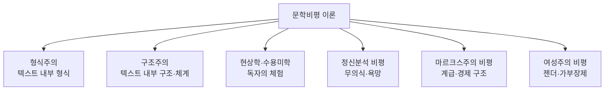

<Callout type="info">
  **이번 문서의 목표:** 문학 작품을 바라보는 대표적인 비평 이론들이 각각 "무엇을 근거로" 작품을 해석하는지 구분하고, 21~22편의 심화 학습과 국문학개론·문학비평론 출제 범위를 미리 조망한다.
</Callout>

## 왜 하나의 작품을 여러 이론으로 볼 수 있는가

같은 소설 한 편을 두고도 어떤 평론가는 "문장과 구성이 얼마나 정교한가"를 따지고, 어떤 평론가는 "이 작품이 당대 사회의 계급 문제를 어떻게 반영하는가"를 따지며, 또 어떤 평론가는 "작가의 무의식이 어떻게 드러나는가"를 따진다. 이렇게 해석의 결과가 갈리는 이유는 평론가마다 "작품을 무엇을 잣대로 읽을 것인가"에 대한 전제, 즉 **문학비평 이론**(文學批評理論, Literary Criticism Theory)이 다르기 때문이다.

> **쉽게 말하면:** 문학비평 이론은 작품이라는 같은 대상을 서로 다른 안경을 끼고 보는 방법이다. 안경(이론)이 바뀌면 같은 문장에서도 다른 것이 보인다.

독학사 4단계의 **문학비평론**과 **국문학개론**은 이 "안경"들의 이름과 핵심 관점을 정확히 구분하는 문제를 자주 낸다. 이론의 세부 이론가·용어까지 깊이 들어가는 것은 21·22편의 몫이고, 이 05편은 각 이론이 "작품의 무엇을 근거로 삼는가"라는 한 가지 질문에 대한 답만으로 전체 지형을 먼저 그린다.

이 여섯 갈래를 근거의 위치에 따라 크게 세 묶음으로 나누어 볼 수 있다. **형식주의·구조주의**는 근거를 텍스트 "안"에서 찾고, **현상학·수용미학**은 근거를 텍스트를 읽는 "독자"에게서 찾으며, **정신분석·마르크스주의·여성주의**는 근거를 텍스트 "바깥"의 맥락(작가의 심리, 사회 구조, 권력 관계)에서 찾는다. 이 위치 감각을 먼저 잡아 두면 21·22편에서 세부 이론가와 용어를 배울 때 "이 이론가가 지금 어디에서 근거를 끌어오는지"를 스스로 점검할 수 있다.

## 형식주의: 텍스트 자체의 언어와 구성을 본다

**형식주의**(形式主義, Formalism)는 작품을 이해하는 데 작가의 생애나 시대 배경 같은 외부 정보가 필요하지 않다고 본다. 작품은 그 자체로 완결된 언어 구조물이며, 비평가의 임무는 그 구조물이 어떻게 짜여 있는지(운율·문체·구성·이미지 배치 등)를 정밀하게 분석하는 것이라고 본다.

> **쉽게 말하면:** 형식주의는 "이 시가 왜 감동적인가"를 시인의 개인사가 아니라, 그 시 안의 낱말·리듬·이미지 배치 자체에서 찾는다.

형식주의가 특히 강조하는 개념은 **낯설게 하기**(Defamiliarization)다. 이는 일상적이고 익숙한 대상을 새롭고 낯선 방식으로 표현해, 독자가 그 대상을 다시 새롭게 지각하도록 만드는 문학적 기법을 가리킨다. 예를 들어 "봄비가 내린다"라는 평범한 문장 대신 "하늘이 가느다란 실을 자아 땅에 심는다"처럼 표현하면, 독자는 익숙한 봄비를 낯선 이미지로 다시 경험하게 된다. 이런 언어적 장치 자체가 형식주의가 분석하려는 핵심 대상이다.

> **비유로 이해하기:** 형식주의는 그림을 감상할 때 화가의 인생사를 참고하지 않고, 오직 캔버스 위 색채·구도·붓질만을 뜯어보는 태도와 같다.

## 구조주의: 개별 작품보다 그 밑의 체계를 본다

**구조주의**(構造主義, Structuralism)는 형식주의와 마찬가지로 텍스트 내부를 중시하지만, 관심의 방향이 다르다. 형식주의가 "이 한 작품이 얼마나 정교하게 짜였는가"를 본다면, 구조주의는 "이 작품이 속한 갈래(설화·민담·소설 등) 전체를 관통하는 공통된 규칙과 체계는 무엇인가"를 묻는다.

구조주의의 핵심 전제는 개별 요소의 의미가 그 요소 자체가 아니라 다른 요소들과의 **관계**(關係, Relation) 속에서 정해진다는 것이다. 예를 들어 여러 민담을 비교해 보면 "영웅의 출생 – 시련 – 조력자의 등장 – 과업 성취"라는 반복되는 기능들의 순서가 발견되는데, 구조주의는 개별 민담의 줄거리보다 이 반복되는 기능 구조 자체를 연구 대상으로 삼는다.

> **쉽게 말하면:** 구조주의는 나무 한 그루(개별 작품)보다 숲 전체를 지배하는 생태 법칙(공통 구조)을 먼저 본다.

| 구분 | 형식주의 | 구조주의 |
|---|---|---|
| 분석 단위 | 개별 작품 하나 | 여러 작품에 공통된 체계 |
| 핵심 질문 | 이 작품의 언어·구성이 얼마나 정교한가 | 이 갈래를 관통하는 공통 규칙은 무엇인가 |
| 대표 관심사 | 낯설게 하기, 운율, 문체 | 서사 기능의 반복 구조, 이항 대립 |

## 현상학과 수용미학: 독자의 체험에서 의미가 완성된다

**현상학**(現象學, Phenomenology)과 이를 문학에 적용한 **수용미학**(受容美學, Reception Aesthetics)은 앞의 두 이론과 달리 근거의 자리를 작품 자체가 아니라 **독자**(讀者, Reader)에게 옮긴다. 이 관점에서 텍스트는 작가가 완성해 놓은 고정된 결과물이 아니라, 독자가 읽는 매 순간 함께 채워 나가는 미완의 틀이다.

수용미학이 즐겨 쓰는 개념이 **빈자리**(空白, Blank)다. 이는 텍스트가 모든 것을 설명하지 않고 의도적으로 남겨 둔 여백을 가리키며, 독자는 자신의 경험과 상상으로 이 빈자리를 채우며 작품의 의미를 완성한다. 예를 들어 한 소설이 주인공의 마지막 표정을 서술하지 않고 끝난다면, 독자마다 그 표정을 다르게 상상하며 서로 다른 결말의 의미를 완성하게 된다.

> **쉽게 말하면:** 같은 작품이라도 읽는 사람에 따라 다르게 완성된다고 보는 관점이 현상학·수용미학이다.

## 정신분석 비평: 무의식과 욕망을 읽는다

**정신분석 비평**(精神分析批評, Psychoanalytic Criticism)은 작품 속 인물의 행동이나 작가의 창작 동기를 인간의 **무의식**(無意識, Unconscious, 스스로 인식하지 못하지만 행동에 영향을 미치는 마음의 영역)과 억압된 욕망으로 설명하려는 관점이다.

예를 들어 한 소설의 주인공이 반복적으로 아버지와 갈등을 겪는 구조가 나타난다면, 정신분석 비평은 이를 단순한 줄거리 장치가 아니라 인물(또는 그 인물을 만들어 낸 작가)의 억압된 심리적 갈등이 서사로 표출된 결과로 읽는다. 꿈에서 나타나는 상징을 해석하듯, 작품 속 반복되는 이미지나 사건을 무의식의 흔적으로 해석하는 것이 이 비평의 방법이다.

> **비유로 이해하기:** 정신분석 비평은 작품을 작가(또는 인물)가 무심코 흘린 "말실수"처럼 읽어, 그 안에 숨은 진짜 속마음을 캐낸다.

## 마르크스주의 비평: 계급과 경제 구조를 읽는다

**마르크스주의 비평**(Marxist Criticism)은 문학 작품이 진공 속에서 만들어지는 것이 아니라, 그 작품이 쓰인 시대의 **경제 구조와 계급 관계**를 반영하거나 때로는 은폐한다고 본다. 이 관점은 작품에 등장하는 인물들의 갈등을 개인의 성격 문제가 아니라, 그들이 속한 계급 사이의 이해관계 충돌로 읽어 낸다.

예를 들어 소작농과 지주의 갈등을 다룬 소설이 있다면, 마르크스주의 비평은 이를 단순한 개인 대 개인의 다툼이 아니라 당대 농촌 사회의 경제적 착취 구조가 서사에 반영된 결과로 해석한다. 또한 이 관점은 작품이 특정 계급의 이익을 정당화하는 방향으로 현실을 미화하거나 왜곡하는 경우, 그 왜곡된 지점 자체를 비판적으로 짚어 낸다.

> **쉽게 말하면:** 마르크스주의 비평은 "이 작품이 누구의 이익을 대변하고 누구의 고통을 가리고 있는가"를 묻는다.

## 여성주의 비평: 젠더와 가부장제를 읽는다

**여성주의 비평**(Feminist Criticism)은 문학 작품과 문학사 서술 속에 스며든 **가부장제**(家父長制, Patriarchy, 남성을 중심으로 권력과 자원이 배분되는 사회 구조)적 시각을 드러내고 비판하는 관점이다. 이 관점은 두 방향으로 작동한다. 하나는 작품 속 여성 인물이 고정된 틀(순종적인 아내, 희생적인 어머니 등)로만 그려지지는 않았는지 점검하는 것이고, 다른 하나는 그동안 문학사 서술에서 소외되었던 여성 작가와 작품을 발굴해 재평가하는 것이다.

예를 들어 한 고전 소설에서 여성 인물의 목소리가 서술자에 의해 거의 전달되지 않고 남성 인물의 시각으로만 그려진다면, 여성주의 비평은 그 서술 방식 자체가 당대의 젠더 권력 구조를 반영한다고 읽어 낸다.

> **쉽게 말하면:** 여성주의 비평은 "이 작품 속 여성은 누구의 시선으로, 어떤 모습으로 그려지고 있는가"를 묻는다.

## 여섯 이론을 구분하는 하나의 표

여섯 이론을 시험에서 헷갈리지 않으려면, 각 이론이 근거로 삼는 자리를 다시 한번 표로 대조해 두는 것이 효과적이다.

| 이론 | 근거의 자리 | 핵심 질문 |
|---|---|---|
| 형식주의 | 작품 내부의 언어·형식 | 이 작품의 언어와 구성이 얼마나 정교한가 |
| 구조주의 | 여러 작품에 공통된 체계 | 이 갈래를 관통하는 공통 구조는 무엇인가 |
| 현상학·수용미학 | 독자의 읽기 체험 | 독자가 빈자리를 어떻게 채우며 의미를 완성하는가 |
| 정신분석 비평 | 작가·인물의 무의식 | 작품 속에 억압된 욕망이 어떻게 나타나는가 |
| 마르크스주의 비평 | 사회의 계급·경제 구조 | 이 작품이 어느 계급의 이해를 반영·은폐하는가 |
| 여성주의 비평 | 젠더·권력 관계 | 여성이 어떤 시선으로, 어떤 모습으로 그려지는가 |

## 자주 틀리는 점

- 형식주의와 구조주의를 "둘 다 텍스트 내부를 본다"는 이유로 완전히 같은 이론으로 착각하기 쉽다. 형식주의는 개별 작품의 정교함을, 구조주의는 여러 작품에 공통된 체계를 본다는 차이가 있다.
- 정신분석 비평을 "작가의 실제 병력을 진단하는 것"으로 오해하기 쉽다. 정신분석 비평은 작품 속에 드러난 상징·반복 구조를 무의식의 흔적으로 해석하는 문학적 방법이지 임상 진단이 아니다.
- 마르크스주의 비평을 "특정 정치 이념 선전"으로만 좁게 이해하기 쉽다. 이 비평의 핵심은 계급·경제 구조가 서사에 어떻게 반영되는지 분석하는 방법론이다.
- 여성주의 비평을 "여성 작가의 작품만 다루는 비평"으로 오해하기 쉽다. 남성 작가의 작품 속 젠더 서술 방식을 비판적으로 읽는 것도 여성주의 비평의 범위에 포함된다.

## 핵심 정리

- 문학비평 이론은 근거를 어디에 두느냐에 따라 텍스트 내부(형식주의·구조주의), 독자(현상학·수용미학), 텍스트 바깥의 맥락(정신분석·마르크스주의·여성주의)으로 크게 나뉜다.
- 형식주의는 개별 작품의 언어·형식을, 구조주의는 여러 작품에 공통된 체계를 분석 대상으로 삼는다.
- 현상학·수용미학은 독자가 텍스트의 빈자리를 채우며 의미를 완성한다고 본다.
- 정신분석 비평은 무의식과 욕망을, 마르크스주의 비평은 계급·경제 구조를, 여성주의 비평은 젠더·권력 관계를 작품 해석의 근거로 삼는다.

## 마무리 복습

<Quiz
  questionNumber={1}
  question="형식주의 비평이 작품을 해석할 때 주된 근거로 삼는 것은?"
  options={['작가의 생애와 창작 당시 개인사', '작품 내부의 언어·구성 등 형식적 요소', '작품이 쓰인 시대의 경제 구조', '작품을 읽는 독자 개개인의 체험']}
  correctAnswer={2}
  explanation="형식주의는 작품 외부 정보 없이도 텍스트 내부의 언어·문체·구성 자체를 분석 대상으로 삼는다."
  optionExplanations={['형식주의는 작가의 생애 정보를 분석의 필수 근거로 삼지 않는다', '정답이다', '경제 구조를 근거로 삼는 것은 마르크스주의 비평이다', '독자의 체험을 근거로 삼는 것은 현상학·수용미학이다']}
/>

<Quiz
  questionNumber={2}
  question="구조주의에 대한 설명으로 가장 적절한 것은?"
  options={['개별 작품 하나의 문체적 정교함을 정밀 분석하는 이론이다', '독자가 텍스트의 빈자리를 채우는 과정을 연구하는 이론이다', '여러 작품에 공통되는 서사 기능이나 체계적 구조를 연구하는 이론이다', '작가의 무의식적 욕망이 작품에 투영되는 방식을 연구하는 이론이다']}
  correctAnswer={3}
  explanation="구조주의는 개별 작품보다 여러 작품에 공통으로 나타나는 기능과 구조 자체를 연구 대상으로 삼는다."
  optionExplanations={['개별 작품의 정교함에 집중하는 것은 형식주의에 가깝다', '독자의 빈자리 채우기는 현상학·수용미학의 설명이다', '정답이다', '무의식적 욕망은 정신분석 비평의 관심사다']}
/>

<Quiz
  questionNumber={3}
  question="수용미학에서 말하는 '빈자리(공백)'에 대한 설명으로 옳은 것은?"
  options={['작가가 실수로 빠뜨린 문법적 오류를 가리킨다', '텍스트가 의도적으로 남겨 두어 독자가 채워야 하는 여백을 가리킨다', '작품에서 완전히 삭제된 인쇄상의 결함을 가리킨다', '독자가 절대 채울 수 없는 해석 불가능한 부분을 가리킨다']}
  correctAnswer={2}
  explanation="빈자리는 텍스트가 모든 것을 설명하지 않고 남겨 둔 여백으로, 독자가 자신의 경험으로 채우며 작품의 의미를 완성하게 하는 장치다."
  optionExplanations={['문법적 오류와는 무관한 개념이다', '정답이다', '인쇄상의 결함이 아니라 의도된 서술상의 여백이다', '독자가 채우는 것을 전제로 하는 개념이므로 옳지 않다']}
/>

<Quiz
  questionNumber={4}
  question="다음 중 정신분석 비평의 관점에 가장 가까운 해석은?"
  options={['소설 속 인물 갈등을 계급 간 경제적 이해관계의 충돌로 읽는다', '소설의 문장 리듬과 이미지 배치의 정교함만을 분석한다', '반복되는 서사 기능을 여러 설화에서 공통으로 찾아낸다', '인물이 반복적으로 보이는 행동을 억압된 무의식적 욕망의 표출로 읽는다']}
  correctAnswer={4}
  explanation="정신분석 비평은 작품 속 반복되는 행동이나 이미지를 인물(또는 작가)의 억압된 무의식이 드러난 흔적으로 해석한다."
  optionExplanations={['계급 간 경제적 이해관계로 읽는 것은 마르크스주의 비평이다', '문장 리듬·이미지 배치 분석은 형식주의에 가깝다', '여러 작품의 공통 서사 기능을 찾는 것은 구조주의다', '정답이다']}
/>

<Quiz
  questionNumber={5}
  question="마르크스주의 비평이 작품을 해석할 때 핵심적으로 묻는 질문은?"
  options={['이 작품이 어느 계급의 이해관계를 반영하거나 은폐하는가', '이 작품 속 여성 인물이 어떤 시선으로 그려지는가', '이 작품이 독자에게 어떤 정서적 체험을 남기는가', '이 작품의 리듬과 문체가 얼마나 참신한가']}
  correctAnswer={1}
  explanation="마르크스주의 비평은 작품에 반영된 계급·경제 구조와 그로 인한 이해관계의 반영 또는 은폐를 핵심 질문으로 삼는다."
  optionExplanations={['정답이다', '젠더 권력 관계를 묻는 것은 여성주의 비평이다', '독자의 정서적 체험은 현상학·수용미학의 관심사다', '리듬·문체의 참신함은 형식주의의 관심사다']}
/>

<Quiz
  questionNumber={6}
  question="여성주의 비평에 대한 설명으로 옳지 않은 것은?"
  options={['작품 속 여성 인물이 고정된 틀로만 그려지지 않았는지 점검한다', '문학사에서 소외되었던 여성 작가와 작품을 재평가한다', '남성 작가의 작품 속 젠더 서술 방식은 분석 대상에서 완전히 제외한다', '가부장제적 시각이 작품에 어떻게 스며 있는지 드러낸다']}
  correctAnswer={3}
  explanation="여성주의 비평은 남성 작가의 작품 속 젠더 서술 방식도 비판적 분석 대상으로 삼으므로, 완전히 제외한다는 설명은 옳지 않다."
  optionExplanations={['옳은 설명이므로 정답이 아니다', '옳은 설명이므로 정답이 아니다', '남성 작가의 작품도 분석 대상에 포함되므로 이것이 정답이다', '옳은 설명이므로 정답이 아니다']}
/>

## 참고 자료

- [국가평생교육진흥원 독학학위제](https://bdes.nile.or.kr)
- [표준국어대사전](https://stdict.korean.go.kr)
