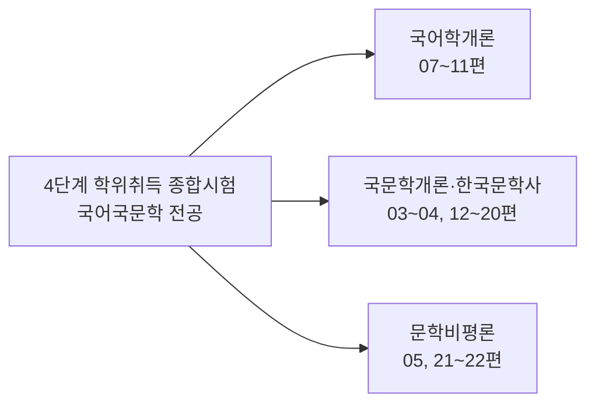
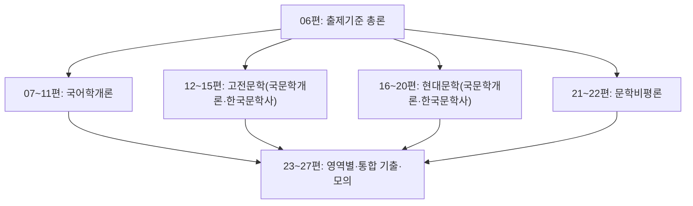

<Callout type="info">
  **이번 문서의 목표:** 4단계 학위취득 종합시험에서 국어국문학 전공이 어떤 과목으로 구성되고 각 과목이 무엇을 묻는지 정확히 파악해, 07편부터 이어지는 본론 학습의 우선순위를 스스로 세울 수 있다.
</Callout>

## 4단계 학위취득 종합시험이란 무엇인가

독학사(독학에 의한 학위취득시험)는 국가평생교육진흥원이 시행하는 국가시험으로, 정규 대학에 다니지 않고도 스스로 공부해 학사 학위를 취득할 수 있게 하는 제도다. 이 시험은 1단계(교양과정)부터 4단계(학위취득 종합시험)까지 단계별로 이루어지며, 하위 단계를 통과하거나 학점은행제 등으로 학점을 인정받으면 다음 단계에 응시할 수 있다.

> **쉽게 말하면:** 4단계는 대학 4년 과정을 마쳤을 때와 동등한 실력이 있는지 종합적으로 확인하는 마지막 관문이다.

4단계는 앞의 세 단계와 성격이 다르다. 1~3단계가 개별 과목을 하나씩 쌓아 올리는 과정이라면, 4단계는 그 전공의 핵심 과목들을 한 번에 종합적으로 묻는 **학위취득 종합시험**이다. 국어국문학 전공의 4단계는 다음 네 과목으로 구성된다(정확한 과목명·배점은 매 공고 시점에 다를 수 있으므로 응시 전 **공고 확인 필요**).

| 과목 | 주로 다루는 영역 |
|---|---|
| 국어학개론 | 음운론·형태론·통사론·의미론·화용론, 국어 규범, 국어사 |
| 국문학개론 | 문학 일반 이론, 갈래론, 문학비평 이론의 기초 |
| 한국문학사 | 상고–현대의 시대별 문학 흐름, 대표 작가·작품, 문예 사조 |
| 문학비평론 | 형식주의·구조주의·정신분석·마르크스주의 등 비평 이론의 심화 적용 |

이 네 과목은 이 자료집의 편 구성과도 직접 연결된다. 국어학개론은 07~11편, 한국문학사와 국문학개론의 갈래론은 12~20편, 문학비평론은 05·21·22편에서 각각 심화된다.

## 문항 유형과 배점 구조

독학사 학위취득 종합시험은 일반적으로 **객관식**(4지선다형)과 **주관식**(단답형·서술형)을 함께 출제하는 구조를 취해 왔다. 서술형은 정해진 글자 수(예: 80자·120자 등) 안에 답안을 작성하도록 요구하는 경우가 많다. 다만 과목별 문항 수, 객관식과 서술형의 배점 비율, 정확한 답안 분량 기준은 회차 공고마다 달라질 수 있으므로, 이 자료에서 특정 숫자를 단정해 암기하기보다는 **아래 두 원칙**을 기억해 두는 편이 안전하다.

- 원칙 1: 객관식만으로 합격점을 넘기기 어렵도록 서술형이 일정 비중을 차지하므로, 개념을 "고르는" 수준이 아니라 "설명하는" 수준까지 준비해야 한다.
- 원칙 2: 정확한 문항 수·배점·글자 수 기준은 응시 학기의 공식 시험요강에서 반드시 재확인한다(**공고 확인 필요**).

> **쉽게 말하면:** 4단계는 "아는 것 같다"만으로는 부족하고, 자신의 언어로 설명할 수 있는 수준까지 요구하는 시험이다.

## 합격 기준: 총점합격제와 과목별합격제

독학사 학위취득 종합시험은 응시자가 두 가지 합격 방식 중 하나를 선택할 수 있게 하는 제도를 운영해 왔다.

| 방식 | 개념 | 특징 |
|---|---|---|
| 총점합격제 | 응시한 모든 과목의 점수를 합산해 총점 기준으로 합격 여부를 판정 | 특정 과목 점수가 낮아도 다른 과목에서 만회할 수 있다 |
| 과목별합격제 | 과목마다 정해진 기준 점수 이상을 받아야 그 과목이 합격 처리 | 이미 합격한 과목은 다음 응시에서 재응시하지 않아도 되는 경우가 있다 |

두 방식 중 어느 쪽이 유리한지는 응시자의 준비 상태(약한 과목이 있는지, 전 과목을 고르게 준비했는지)에 따라 달라지므로, 자신의 학습 상황과 최신 공고의 세부 규정을 함께 검토해 선택하는 것이 바람직하다(**공고 확인 필요**).

> **비유로 이해하기:** 총점합격제는 네 과목 시험지를 한 바구니에 담아 평균을 보는 방식이고, 과목별합격제는 과목마다 개별 문턱을 넘어야 하는 방식이다.

## 최근 출제 경향: 단순 암기에서 통합 적용으로

4단계는 개별 개념을 단순히 아는지 확인하는 문제보다, **여러 개념을 연결해 적용**할 수 있는지를 확인하는 문제의 비중이 높은 편이다. 예를 들어 국어학개론에서는 하나의 음운 변동 사례를 제시하고 그 변동의 종류·조건·결과 표기를 함께 묻는 방식이, 한국문학사에서는 한 작품을 제시하고 그 작품이 속한 갈래·시대·사조를 동시에 판별하도록 요구하는 방식이 자주 나타난다.

이런 경향에서 특히 주의할 유형이 다음 두 가지다.

- **"옳지 않은 것을 고르시오" 유형**: 선택지 네 개 중 세 개는 옳은 설명이고 하나만 틀린 설명이다. 이 유형은 정답 선택지가 왜 틀렸는지뿐 아니라, 나머지 세 선택지가 왜 옳은지도 함께 확인해야 확실하게 풀 수 있다.
- **"설명이 바르게 짝지어진 것" 유형**: 개념과 예시, 또는 작가와 작품을 짝지은 여러 조합 중 올바른 조합을 고르는 유형이다. 개념 하나하나를 아는 것만으로는 부족하고, 관련 개념들을 서로 정확히 구분해 두어야 함정에 걸리지 않는다.

> **쉽게 말하면:** 4단계는 "이게 뭐지?"보다 "이 두 개가 어떻게 다르지?"를 더 자주 묻는다.

## 이 자료집의 학습 순서와 출제 범위의 대응

이 자료집은 국가평생교육진흥원의 공식 평가영역을 다음과 같이 편 구성에 반영했다. 학습을 진행하면서 지금 읽는 편이 네 과목 중 어디에 해당하는지 의식하면, 실제 시험에서 "이 문제는 어느 과목의 어느 영역 문제인지" 감을 잡는 데 도움이 된다.

## 자주 틀리는 점

- 4단계를 1~3단계의 연장선으로 여겨 단순 암기 위주로 준비하는 경우가 많다. 4단계는 개념 간 비교·적용을 묻는 학문형 문항의 비중이 높으므로 서술형 대비 수준의 이해가 필요하다.
- 총점합격제와 과목별합격제 중 하나가 항상 유리하다고 단정하는 경우가 있다. 두 제도의 유불리는 응시자의 과목별 준비 상태에 따라 달라진다.
- "옳지 않은 것을 고르시오" 유형에서 정답만 확인하고 나머지 선택지를 검증하지 않아, 비슷한 다음 문제에서 같은 함정에 다시 걸리는 경우가 잦다.
- 특정 회차의 문항 수·배점을 암기해 다음 회차에도 그대로 적용된다고 가정하는 경우가 있다. 이런 세부 수치는 응시 학기의 공식 시험요강에서 매번 재확인해야 한다.

## 핵심 정리

- 4단계 국어국문학 전공은 국어학개론·국문학개론·한국문학사·문학비평론 네 과목의 학위취득 종합시험으로 구성된다.
- 문항은 객관식과 주관식(단답·서술형)을 함께 출제하는 구조이며, 정확한 문항 수·배점·글자 수 기준은 회차 공고에서 확인해야 한다.
- 합격 방식은 총점합격제와 과목별합격제 중 선택할 수 있으며, 응시자의 준비 상태에 따라 유불리가 달라진다.
- 최근 출제 경향은 단순 암기보다 개념 간 비교·통합 적용을 묻는 문항의 비중이 높으며, "옳지 않은 것 고르기"·"바르게 짝지은 것 고르기" 유형에 특히 유의해야 한다.

## 마무리 복습

<Quiz
  questionNumber={1}
  question="독학사 4단계 학위취득 종합시험의 성격에 대한 설명으로 가장 적절한 것은?"
  options={['1~3단계와 동일하게 개별 과목을 하나씩 순차적으로 응시하는 시험이다', '전공 핵심 과목을 종합적으로 묻는 학위취득 종합시험이다', '객관식 문항만으로 구성되어 서술형 답안은 요구되지 않는다', '국어국문학 전공에서는 국어학 영역만 출제된다']}
  correctAnswer={2}
  explanation="4단계는 전공의 핵심 과목들을 한 번에 종합적으로 평가하는 학위취득 종합시험이다."
  optionExplanations={['4단계는 1~3단계와 성격이 다른 종합시험이다', '정답이다', '서술형 문항도 함께 출제되는 구조를 취해 왔다', '국문학개론·한국문학사·문학비평론도 함께 출제된다']}
/>

<Quiz
  questionNumber={2}
  question="국어국문학 4단계 학위취득 종합시험의 과목 구성으로 옳은 것은?"
  options={['국어학개론, 국문학개론, 한국문학사, 문학비평론', '음운론, 형태론, 통사론, 의미론', '고전문학, 현대문학, 한문학, 구비문학', '국어사, 표준어규정, 외래어표기법, 로마자표기법']}
  correctAnswer={1}
  explanation="국어국문학 4단계는 국어학개론, 국문학개론, 한국문학사, 문학비평론 네 과목으로 구성된다."
  optionExplanations={['정답이다', '이들은 국어학개론 내부의 하위 영역이다', '이들은 국문학개론·한국문학사 안에서 다루는 세부 갈래다', '이들은 국어학개론의 규범 영역에서 다루는 세부 항목이다']}
/>

<Quiz
  questionNumber={3}
  question="총점합격제에 대한 설명으로 옳은 것은?"
  options={['과목마다 정해진 기준 점수를 넘어야 그 과목이 개별적으로 합격 처리된다', '응시한 모든 과목의 점수를 합산해 총점 기준으로 합격 여부를 판정한다', '한 과목이라도 기준 미달이면 전 과목이 자동으로 불합격 처리된다', '객관식 점수만 합산하고 서술형 점수는 반영하지 않는다']}
  correctAnswer={2}
  explanation="총점합격제는 응시한 모든 과목의 점수를 합산한 총점을 기준으로 합격 여부를 판정하는 방식이다."
  optionExplanations={['이는 과목별합격제에 대한 설명이다', '정답이다', '총점합격제는 개별 과목의 개별 기준 미달을 자동 불합격 조건으로 삼지 않는다', '서술형 점수도 총점 산정에 반영된다']}
/>

<Quiz
  questionNumber={4}
  question="최근 4단계 출제 경향에 대한 설명으로 가장 적절한 것은?"
  options={['단순 암기로 풀 수 있는 단발성 지식 문제의 비중이 계속 커지고 있다', '개념 간 비교와 통합 적용을 묻는 학문형 문항의 비중이 높다', '한 문제에서 하나의 개념만 독립적으로 묻고 다른 개념과 연결하지 않는다', '서술형 문항의 비중이 사라지고 전부 객관식으로 전환되었다']}
  correctAnswer={2}
  explanation="4단계는 개별 개념을 단순히 아는지보다 여러 개념을 연결해 적용할 수 있는지를 확인하는 통합형 문항의 비중이 높다."
  optionExplanations={['단순 암기 위주 문제 비중이 커진다는 설명은 최근 경향과 맞지 않는다', '정답이다', '오히려 여러 개념을 연결하는 통합형 문제가 자주 나타난다', '서술형 문항은 여전히 함께 출제되는 구조를 취해 왔다']}
/>

<Quiz
  questionNumber={5}
  question="'옳지 않은 것을 고르시오' 유형을 풀 때 가장 안전한 검증 방법은?"
  options={['정답으로 보이는 선택지 하나만 확인하고 바로 답을 표기한다', '가장 길게 서술된 선택지를 무조건 정답으로 고른다', '정답 선택지가 왜 틀렸는지와 나머지 세 선택지가 왜 옳은지를 모두 확인한다', '선택지 순서상 세 번째 위치한 선택지를 우선적으로 의심한다']}
  correctAnswer={3}
  explanation="이 유형은 정답 선택지의 오류뿐 아니라 나머지 선택지들이 실제로 옳은 설명인지까지 함께 확인해야 확실하게 풀 수 있다."
  optionExplanations={['하나만 확인하면 비슷한 함정에 다시 걸릴 수 있다', '선택지의 길이는 정답 여부와 무관하다', '정답이다', '선택지의 위치는 정답 여부와 무관하다']}
/>

<Quiz
  questionNumber={6}
  question="문항 수·배점·서술형 글자 수 등 시험의 세부 기준에 대해 이 자료가 취하는 태도로 옳은 것은?"
  options={['특정 회차의 수치를 암기해 두면 이후 모든 회차에 그대로 적용할 수 있다', '세부 수치는 회차 공고마다 달라질 수 있으므로 응시 전 공고를 반드시 확인해야 한다', '세부 수치는 시험 결과에 전혀 영향을 주지 않으므로 확인할 필요가 없다', '국어학개론에만 세부 기준이 존재하고 다른 과목에는 기준이 없다']}
  correctAnswer={2}
  explanation="문항 수, 배점, 서술형 분량 기준 등은 회차 공고마다 달라질 수 있으므로, 이 자료는 특정 수치를 단정하지 않고 응시 전 공고 확인을 권장한다."
  optionExplanations={['세부 기준은 회차마다 달라질 수 있어 암기가 위험하다', '정답이다', '세부 기준은 답안 작성 전략에 직접 영향을 준다', '네 과목 모두 각자의 세부 기준을 공고에서 확인해야 한다']}
/>

## 참고 자료

- [국가평생교육진흥원 독학학위제](https://bdes.nile.or.kr)
