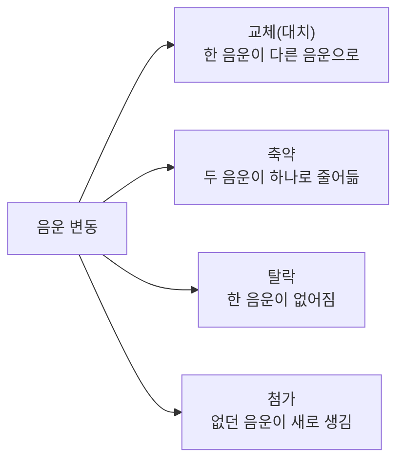

<Callout type="info">
  **이번 문서의 목표:** 국어의 음운 체계를 자음·모음으로 나누어 정리하고, 실제 단어 예시로 음운 변동의 유형과 조건을 정확히 구분해 국어학개론의 음운 변동 문제를 풀어낼 수 있다.
</Callout>

## 국어 음운 체계를 다시 세우기 전에

02편에서 **음운론**(音韻論, Phonology)이 뜻을 구별하는 최소의 소리 단위인 **음소**(音素, Phoneme)를 연구하는 분야라는 것과, 최소대립쌍을 통해 음소를 판별한다는 것을 배웠다. 이 07편에서는 국어의 음소 목록 전체를 자음과 모음으로 나누어 세우고, 그 음소들이 실제 발화 과정에서 서로 영향을 주고받아 형태가 달라지는 **음운 변동**(音韻變動, Phonological Alternation)을 깊게 다룬다.

> **쉽게 말하면:** 이 편은 "국어에 어떤 소리들이 있는가"와 "그 소리들이 단어 안에서 만나면 왜 원래와 다르게 발음되는가"를 함께 정리한다.

## 국어의 자음 체계

**자음**(子音, Consonant)은 발음할 때 공기의 흐름이 목이나 입안의 어느 자리에서 방해를 받아 만들어지는 소리다. 국어의 자음은 소리를 내는 **위치**(조음 위치)와 **방법**(조음 방법)이라는 두 기준으로 분류한다.

| 조음 방법 \ 조음 위치 | 입술소리 | 잇몸소리 | 센입천장소리 | 여린입천장소리 | 목청소리 |
|---|---|---|---|---|---|
| 파열음(예사–된–거센) | ㅂ–ㅃ–ㅍ | ㄷ–ㄸ–ㅌ | – | ㄱ–ㄲ–ㅋ | – |
| 파찰음(예사–된–거센) | – | – | ㅈ–ㅉ–ㅊ | – | – |
| 마찰음(예사–된) | – | ㅅ–ㅆ | – | – | ㅎ |
| 비음 | ㅁ | ㄴ | – | ㅇ(받침) | – |
| 유음 | – | ㄹ | – | – | – |

이 표에서 조음 방법의 뜻은 다음과 같다.

- **파열음**(破裂音, Plosive): 입안의 한 지점을 완전히 막았다가 터뜨리듯 여는 소리(ㅂ, ㄷ, ㄱ 등).
- **파찰음**(破擦音, Affricate): 파열음처럼 막았다가 마찰음처럼 서서히 여는 소리(ㅈ, ㅊ 등).
- **마찰음**(摩擦音, Fricative): 완전히 막지 않고 좁은 틈으로 공기를 내보내 마찰시키는 소리(ㅅ, ㅎ 등).
- **비음**(鼻音, Nasal): 입안의 통로를 막고 코로 공기를 내보내는 소리(ㅁ, ㄴ, ㅇ).
- **유음**(流音, Liquid): 혀끝을 잇몸에 살짝 대고 공기를 옆으로 흘려보내는 소리(ㄹ).

또한 파열음·파찰음·마찰음은 소리를 낼 때 목청이 얼마나 긴장하고 숨이 얼마나 세게 나오는지에 따라 **예사소리**(평음, ㄱ·ㄷ·ㅂ·ㅅ·ㅈ), **된소리**(경음, ㄲ·ㄸ·ㅃ·ㅆ·ㅉ), **거센소리**(격음, ㅋ·ㅌ·ㅍ·ㅊ)로 다시 나뉜다. "달"과 "딸"과 "탈"은 첫소리만 예사–된–거센으로 다를 뿐인데 뜻이 완전히 달라지므로, 이 세 계열은 서로 다른 음소임이 최소대립쌍으로 증명된다.

## 국어의 모음 체계

**모음**(母音, Vowel)은 공기의 흐름이 방해받지 않고 나는 소리로, 혀의 위치와 입술 모양에 따라 분류한다. 국어의 단모음은 다음 두 기준으로 나뉜다.

| 혀의 앞뒤 \ 입술 모양 | 평순(입술을 평평하게) | 원순(입술을 둥글게) |
|---|---|---|
| 전설(혀가 앞쪽) | ㅣ, ㅔ | ㅟ, ㅚ |
| 후설(혀가 뒤쪽) | ㅡ, ㅓ, ㅏ | ㅜ, ㅗ |

이 밖에도 발음하는 동안 혀나 입술의 모양이 처음과 끝이 달라지는 소리를 **이중모음**(二重母音, Diphthong)이라 하며, ㅑ·ㅕ·ㅛ·ㅠ·ㅐ 계열 일부·ㅘ·ㅝ 등이 여기 속한다. 예를 들어 "야"를 발음할 때는 짧은 "이" 소리로 시작해 "아"로 옮겨 가는데, 이렇게 소리가 도중에 변하는 모음이 이중모음이고, 처음부터 끝까지 혀와 입술의 모양이 고정된 모음이 **단모음**(單母音, Monophthong)이다.

> **쉽게 말하면:** 단모음은 발음하는 동안 입 모양이 안 변하는 소리, 이중모음은 발음 도중에 입 모양이 미끄러지듯 변하는 소리다.

## 변별 자질: 음소를 더 잘게 쪼개는 특징들

**변별 자질**(辨別資質, Distinctive Feature)은 음소보다 더 작은 단위로, 하나의 음소가 다른 음소와 구별되는 개별 음성적 특징을 가리킨다. 예를 들어 ㄱ, ㄲ, ㅋ은 모두 "여린입천장에서 나는 파열음"이라는 점은 같지만, 목청의 긴장도와 숨의 세기라는 자질 값이 달라 서로 다른 음소가 된다.

| 자질 | 뜻 | 예 |
|---|---|---|
| 긴장성 | 발음 기관의 근육 긴장 정도 | 된소리(ㄲ)는 긴장성이 있고 예사소리(ㄱ)는 없다 |
| 기식성(유기성) | 숨을 세게 내보내는 정도 | 거센소리(ㅋ)는 기식성이 있고 예사소리(ㄱ)는 없다 |
| 비음성 | 코로 공기를 내보내는지 여부 | ㅁ·ㄴ·ㅇ은 비음성이 있고 나머지 자음은 없다 |

변별 자질을 알아 두면 다음에 배울 음운 변동이 "왜 하필 그 소리로 바뀌는가"를 설명할 때 유용하다. 예를 들어 비음화는 비음이 아닌 소리가 뒤따르는 비음의 "비음성"이라는 자질에 동화되어 비음으로 바뀌는 현상으로 설명할 수 있다.

## 음운 변동이란 무엇이고 왜 일어나는가

**음운 변동**(音韻變動, Phonological Alternation)은 형태소와 형태소가 결합할 때, 발음을 더 쉽게 하려는 이유 등으로 원래의 음운이 다른 음운으로 바뀌거나 없어지거나 새로 생기는 현상이다.

> **쉽게 말하면:** 음운 변동은 글자로 적은 대로 발음하면 오히려 발음하기 어려워서, 실제 입에서는 조금 다르게 소리 나는 현상이다.

음운 변동은 결과의 성격에 따라 크게 네 갈래로 나뉜다.

### 교체(대치): 동화와 중화

**동화**(同化, Assimilation)는 한 음운이 인접한 음운의 성질을 닮아 가는 현상이다. 대표적인 예가 **비음화**(鼻音化, Nasalization)로, 파열음(ㄱ·ㄷ·ㅂ)이 뒤에 오는 비음(ㄴ·ㅁ)의 영향을 받아 같은 위치의 비음(ㅇ·ㄴ·ㅁ)으로 바뀌는 현상이다.

- 예시: "국물" → [궁물] (ㄱ이 뒤의 ㅁ에 동화되어 비음 ㅇ으로 바뀜)
- 예시: "받는다" → [반는다] (ㄷ이 뒤의 ㄴ에 동화되어 비음 ㄴ으로 바뀜)
- 예시: "밥물" → [밤물] (ㅂ이 뒤의 ㅁ에 동화되어 비음 ㅁ으로 바뀜)

또 다른 대표적인 동화는 **유음화**(流音化, Liquidization)로, ㄴ과 ㄹ이 만나면 ㄴ이 ㄹ의 영향을 받아 ㄹ로 바뀌는 현상이다.

- 예시: "신라" → [실라] (ㄴ이 뒤의 ㄹ에 동화되어 ㄹ로 바뀜)
- 예시: "칼날" → [칼랄] (앞의 ㄹ이 뒤의 ㄴ을 ㄹ로 동화시킴)

한편 **중화**(中和, Neutralization)는 음절 끝에서 여러 자음이 구별되지 않고 하나의 대표음으로만 발음되는 현상이다. 국어의 음절 끝소리는 ㄱ·ㄴ·ㄷ·ㄹ·ㅁ·ㅂ·ㅇ 일곱 개의 대표음으로만 발음되는데, 이를 **음절의 끝소리 규칙**이라 부른다.

- 예시: "옷"의 받침 ㅅ은 [옫]으로, "낮"의 받침 ㅈ은 [낟]으로, "부엌"의 받침 ㅋ은 [부억]으로 발음된다. ㅅ·ㅈ·ㅋ이라는 서로 다른 음소가 음절 끝에서는 모두 각각 ㄷ 또는 ㄱ 계열의 대표음 하나로 합쳐지므로 이를 중화라 한다.

### 축약: 두 소리가 만나 하나로 줄어듦

**축약**(縮約, Contraction)은 두 음운이 만나 제3의 한 음운으로 줄어드는 현상이다. 대표적으로 **거센소리되기**(격음화, Aspiration)가 있는데, 예사소리 ㄱ·ㄷ·ㅂ·ㅈ이 ㅎ과 만나면 거센소리 ㅋ·ㅌ·ㅍ·ㅊ으로 줄어든다.

- 예시: "좋다" → [조타] (ㅎ과 ㄷ이 만나 ㅌ으로 축약)
- 예시: "많고" → [만코] (ㅎ과 ㄱ이 만나 ㅋ으로 축약)
- 예시: "잡히다" → [자피다] (ㅂ과 ㅎ이 만나 ㅍ으로 축약)

> **쉽게 말하면:** 축약은 두 소리를 따로따로 내는 대신 한 번에 세게 내는 것으로, 소리의 개수 자체가 줄어드는 변동이다.

### 탈락: 있던 소리가 사라짐

**탈락**(脫落, Deletion)은 형태소가 결합할 때 원래 있던 음운이 발음되지 않고 사라지는 현상이다.

- 예시: "좋아" → [조아] (ㅎ이 모음 사이에서 탈락)
- 예시: "따+아서" → "따서" (동일한 모음 ㅏ가 겹칠 때 하나가 탈락)
- 예시: "울-+-는" → "우는" (어간 끝 ㄹ이 ㄴ 앞에서 탈락)

탈락과 축약을 혼동하기 쉬운데, **탈락은 소리가 아예 없어져 남은 소리의 개수가 줄어드는 것**이고, **축약은 두 소리가 하나로 합쳐져 결과적으로 소리의 개수는 줄지만 합쳐진 소리의 성질(거센소리)이 남는 것**이라는 차이가 있다.

### 첨가: 없던 소리가 새로 생김

**첨가**(添加, Insertion)는 형태소가 결합할 때 원래 없던 음운이 새로 끼어드는 현상이다. 대표적으로 두 단어가 합쳐질 때 앞말이 모음으로 끝나고 뒷말이 "이" 계열 모음으로 시작하면 그 사이에 ㄴ이 첨가되는 **ㄴ첨가**가 있다.

- 예시: "솜이불" → [솜니불] (솜과 이불이 결합할 때 ㄴ이 새로 끼어듦)
- 예시: "한여름" → [한녀름] (한과 여름이 결합할 때 ㄴ이 새로 끼어듦)

## 음운 변동 유형 한눈에 비교하기

시험에서는 주어진 발음 변화 예시가 네 유형 중 어디에 속하는지 판별하는 문제가 자주 나온다. 다음 표로 판별 기준을 정리한다.

| 유형 | 판별 기준 | 예시 |
|---|---|---|
| 교체(동화·중화) | 한 음운이 다른 음운으로 바뀌되, 음운의 개수는 그대로다 | 국물 → [궁물] |
| 축약 | 두 음운이 만나 하나의 새로운 음운(주로 거센소리)으로 줄어든다 | 좋다 → [조타] |
| 탈락 | 있던 음운이 그대로 사라져 음운의 개수가 준다 | 좋아 → [조아] |
| 첨가 | 원래 없던 음운이 새로 생겨 음운의 개수가 는다 | 솜이불 → [솜니불] |

## 음운 변동과 표기의 관계: 왜 발음과 맞춤법이 다른가

국어의 맞춤법은 소리 나는 대로 적는 **표음주의**와 원래 형태소의 본모습을 밝혀 적는 **표의주의**(형태음소적 표기)를 함께 취하고 있다. 음운 변동이 일어나도 그 변동이 매우 규칙적이고 예측 가능하다면, 표기는 변동 이전의 원래 형태소 모습을 그대로 유지하는 경우가 많다.

- 예시: "국물"은 [궁물]로 발음되지만, 표기는 비음화가 일어나기 전의 형태소 "국"과 "물"을 밝혀 "국물"로 적는다.
- 예시: "좋아"는 [조아]로 발음되지만, 표기는 어간 "좋-"의 원래 모습을 밝혀 "좋아"로 적는다.

이처럼 발음과 표기가 다른 이유를 묻는 문제는 10편의 규범·표기 심화에서 다시 다루며, 이 07편에서는 "왜 발음이 그렇게 바뀌는가"라는 음운론적 원인 자체에 집중한다.

## 자주 틀리는 점

- 비음화와 유음화를 모두 "동화"로 뭉뚱그려 기억하다가, 어떤 자음이 어떤 자음에 동화되는지 방향을 거꾸로 착각하는 경우가 많다. 비음화는 파열음이 비음으로, 유음화는 ㄴ이 ㄹ로 바뀐다는 방향을 정확히 구분해야 한다.
- 탈락과 축약을 헷갈려 "좋다 → [조타]"를 탈락으로, "좋아 → [조아]"를 축약으로 잘못 분류하는 경우가 있다. 축약은 결과에 거센소리 등 새로운 음운 성질이 남고, 탈락은 아무 흔적 없이 사라진다는 점으로 구분한다.
- 음절의 끝소리 규칙(중화)을 "받침이 대표음으로 바뀌는 것"으로만 외우고, 정작 어떤 자음들이 몇 개의 대표음으로 묶이는지(일곱 개의 대표음)는 정확히 기억하지 못하는 경우가 많다.
- 이중모음을 단모음과 혼동해, 입 모양이 발음 중에 변하는지 여부를 확인하지 않고 표기 형태(글자 수)만으로 판단하는 경우가 있다.

## 핵심 정리

- 국어의 자음은 조음 위치와 조음 방법(파열·파찰·마찰·비음·유음)으로, 모음은 혀의 앞뒤와 입술 모양으로 분류하며 발음 중 입 모양 변화 여부로 단모음과 이중모음을 구분한다.
- 변별 자질(긴장성·기식성·비음성 등)은 음소보다 작은 단위로, 음운 변동이 왜 그런 방향으로 일어나는지 설명하는 데 쓰인다.
- 음운 변동은 교체(동화·중화)·축약·탈락·첨가 네 유형으로 나뉘며, 각 유형은 변동 후 음운 개수의 변화 여부로 구분할 수 있다.
- 규칙적인 음운 변동이 일어나도 맞춤법은 형태소의 원래 모습을 밝혀 적는 경우가 많아, 발음과 표기가 다르게 나타난다.

## 마무리 복습

<Quiz
  questionNumber={1}
  question="'국물'이 [궁물]로 발음되는 현상을 가리키는 용어는?"
  options={['유음화', '비음화', '거센소리되기', 'ㄴ첨가']}
  correctAnswer={2}
  explanation="파열음 ㄱ이 뒤에 오는 비음 ㅁ의 영향을 받아 같은 위치의 비음 ㅇ으로 바뀌는 현상이 비음화다."
  optionExplanations={['유음화는 ㄴ과 ㄹ이 만나 ㄹ로 바뀌는 현상이다', '정답이다', '거센소리되기는 예사소리와 ㅎ이 만나 거센소리로 축약되는 현상이다', 'ㄴ첨가는 없던 ㄴ이 새로 끼어드는 현상이다']}
/>

<Quiz
  questionNumber={2}
  question="다음 중 축약의 예로 가장 적절한 것은?"
  options={['좋아 → [조아]', '신라 → [실라]', '좋다 → [조타]', '솜이불 → [솜니불]']}
  correctAnswer={3}
  explanation="'좋다'는 ㅎ과 ㄷ이 만나 거센소리 ㅌ 하나로 줄어드는 축약의 예다."
  optionExplanations={['이는 ㅎ이 사라지는 탈락의 예다', '이는 ㄴ이 ㄹ로 바뀌는 유음화(동화)의 예다', '정답이다', '이는 없던 ㄴ이 새로 생기는 첨가의 예다']}
/>

<Quiz
  questionNumber={3}
  question="음절의 끝소리 규칙(중화)에 대한 설명으로 옳은 것은?"
  options={['음절 끝에서 여러 자음이 몇 개의 대표음으로만 발음되는 현상이다', '두 음운이 만나 새로운 하나의 음운으로 줄어드는 현상이다', '없던 음운이 형태소 결합 시 새로 생겨나는 현상이다', '모음 사이에서 자음이 완전히 사라지는 현상이다']}
  correctAnswer={1}
  explanation="음절의 끝소리 규칙은 음절 끝에 오는 여러 자음이 ㄱ·ㄴ·ㄷ·ㄹ·ㅁ·ㅂ·ㅇ 일곱 개의 대표음으로만 발음되는 중화 현상이다."
  optionExplanations={['정답이다', '이는 축약에 대한 설명이다', '이는 첨가에 대한 설명이다', '이는 탈락에 대한 설명이다']}
/>

<Quiz
  questionNumber={4}
  question="단모음과 이중모음을 구분하는 기준으로 가장 적절한 것은?"
  options={['글자를 적을 때 모음자가 한 개인지 두 개인지', '발음하는 동안 혀나 입술의 모양이 변하는지 여부', '단어의 첫소리에 오는지 끝소리에 오는지', '자음과 결합할 수 있는지 여부']}
  correctAnswer={2}
  explanation="단모음은 발음하는 동안 입 모양이 고정되어 있고, 이중모음은 발음 도중 입 모양이 변한다는 점으로 구분한다."
  optionExplanations={['표기상의 글자 수는 음성학적 판별 기준이 아니다', '정답이다', '단어 내 위치는 판별 기준이 아니다', '자음과의 결합 가능 여부는 판별 기준이 아니다']}
/>

<Quiz
  questionNumber={5}
  question="'신라'가 [실라]로 발음되는 현상을 가리키는 용어는?"
  options={['비음화', '유음화', '거센소리되기', '음절의 끝소리 규칙']}
  correctAnswer={2}
  explanation="ㄴ이 뒤에 오는 ㄹ의 영향을 받아 ㄹ로 바뀌는 현상이 유음화다."
  optionExplanations={['비음화는 파열음이 비음으로 바뀌는 현상이다', '정답이다', '거센소리되기는 예사소리와 ㅎ의 축약이다', '이 예시는 받침 중화와는 무관하다']}
/>

<Quiz
  questionNumber={6}
  question="탈락과 축약의 차이에 대한 설명으로 옳은 것은?"
  options={['탈락은 음운이 완전히 사라지고, 축약은 두 음운이 합쳐져 새로운 음운의 성질이 남는다', '탈락과 축약은 결과가 완전히 동일하므로 구분할 필요가 없다', '탈락은 음운의 개수를 늘리고, 축약은 음운의 개수를 그대로 유지한다', '탈락은 자음에서만 일어나고, 축약은 모음에서만 일어난다']}
  correctAnswer={1}
  explanation="탈락은 있던 음운이 흔적 없이 사라지는 것이고, 축약은 두 음운이 만나 거센소리 등 새로운 성질을 지닌 하나의 음운으로 줄어드는 것이다."
  optionExplanations={['정답이다', '두 현상은 결과와 판별 기준이 다르다', '두 현상 모두 음운의 개수를 줄이는 방향으로 작용한다', '탈락과 축약 모두 자음과 모음 환경에서 각각 나타날 수 있다']}
/>

## 참고 자료

- [국립국어원](https://www.korean.go.kr)
- [표준국어대사전](https://stdict.korean.go.kr)
