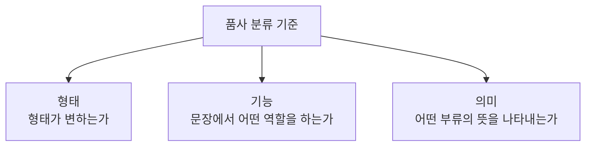
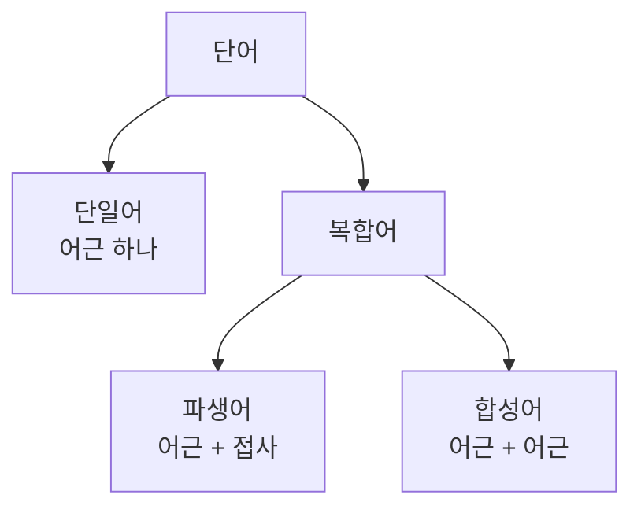

<Callout type="info">
  **이번 문서의 목표:** 국어 품사 아홉 가지를 분류 기준에 따라 정확히 구분하고, 파생어·합성어의 짜임과 형태소 분석 문제에서 자주 나오는 함정을 스스로 가려낼 수 있다.
</Callout>

## 품사 분류로 들어가기 전에

02편에서 **형태소**(形態素, Morpheme)가 뜻을 지닌 최소 단위이며, 형태소가 결합해 만들어지는 더 큰 단위가 **단어**(單語, Word)라고 배웠다. 이 08편은 그 단어를 문법적 성격에 따라 분류하는 **품사**(品詞, Parts of Speech)와, 형태소들이 결합해 새로운 단어를 만드는 **단어 형성**(單語形成, Word Formation) 규칙을 심화한다.

> **쉽게 말하면:** 이 편은 "국어의 단어를 어떤 기준으로 아홉 갈래로 나누는가"와 "새 단어는 어떤 방식으로 만들어지는가"를 다룬다.

## 품사 분류의 세 가지 기준

국어의 품사는 세 가지 기준을 겹쳐서 분류한다.

- **형태**(形態) 기준: 문장 속에서 형태가 변하는 단어(**가변어**)와 변하지 않는 단어(**불변어**)로 나눈다. 예를 들어 "먹다"는 "먹고, 먹으니, 먹어서"처럼 형태가 변하는 가변어이고, "하늘"은 문장 어디에 와도 "하늘"이라는 형태가 변하지 않는 불변어다.
- **기능**(機能) 기준: 문장 안에서 그 단어가 주로 어떤 문장 성분으로 쓰이는지를 본다. 문장의 몸체 역할을 하는 **체언**(명사·대명사·수사), 서술 역할을 하는 **용언**(동사·형용사), 체언을 꾸미거나 관계를 나타내는 **수식언**(관형사·부사)과 **관계언**(조사), 독립적으로 쓰이는 **독립언**(감탄사)으로 나눈다.
- **의미**(意味) 기준: 단어가 나타내는 의미의 성격(대상의 이름인지, 동작인지, 성질인지 등)에 따라 아홉 개의 개별 품사로 최종 확정한다.

이 세 기준을 종합하면 국어의 아홉 품사가 다음과 같이 정리된다.

| 기능 갈래 | 품사 | 형태 | 예 |
|---|---|---|---|
| 체언 | 명사 | 불변어 | 하늘, 학교, 사랑 |
| 체언 | 대명사 | 불변어 | 나, 너, 그것 |
| 체언 | 수사 | 불변어 | 하나, 둘째 |
| 용언 | 동사 | 가변어 | 먹다, 달리다 |
| 용언 | 형용사 | 가변어 | 예쁘다, 크다 |
| 수식언 | 관형사 | 불변어 | 새, 헌, 이 |
| 수식언 | 부사 | 불변어 | 빨리, 매우 |
| 관계언 | 조사 | 대체로 불변어(서술격 조사 '이다'는 가변) | 이/가, 을/를, 이다 |
| 독립언 | 감탄사 | 불변어 | 아, 어머 |

> **비유로 이해하기:** 체언은 문장이라는 무대의 "배우"이고, 용언은 그 배우가 무엇을 하는지 보여 주는 "동작"이며, 수식언은 배우와 동작을 꾸며 주는 "조명"이고, 관계언은 배우들 사이의 관계를 이어 주는 "끈"이다.

## 동사와 형용사를 가르는 기준

동사와 형용사는 둘 다 가변어이자 용언이라는 공통점이 있어 혼동하기 쉽지만, 다음 기준으로 명확히 구분할 수 있다.

- **동작이냐 상태냐**: 동사는 움직임이나 작용(먹다, 뛰다)을, 형용사는 성질이나 상태(예쁘다, 크다)를 나타낸다.
- **현재 시제 선어말 어미 "-는/ㄴ-"의 결합 여부**: 동사는 "먹는다"처럼 현재 시제 어미와 자연스럽게 결합하지만, 형용사는 "*예쁜다"처럼 결합하면 어색하다.
- **명령형·청유형 어미의 결합 여부**: 동사는 "먹어라"(명령), "먹자"(청유)가 자연스럽지만, 형용사는 "*예뻐라", "*예쁘자"가 어색하다.

| 검증 기준 | 동사(먹다) | 형용사(예쁘다) |
|---|---|---|
| 현재 시제 "-는다/ㄴ다" | 먹는다(자연스러움) | 예쁜다(어색함) |
| 명령형 "-아라/어라" | 먹어라(자연스러움) | 예뻐라(어색함) |
| 청유형 "-자" | 먹자(자연스러움) | 예쁘자(어색함) |

일부 단어는 이 기준을 적용해도 헷갈리는 경우가 있다. 예를 들어 "있다"는 문맥에 따라 동사(존재를 나타내며 "있어라"처럼 명령형이 가능한 경우)로도, 형용사(상태를 나타내며 명령형이 어색한 경우)로도 쓰일 수 있어 시험에서 자주 다뤄지는 예다.

## 용언의 활용: 어간과 어미

**활용**(活用, Conjugation)은 용언이 문장에서 다양한 문법적 의미를 나타내기 위해 형태를 바꾸는 현상이다. 활용하는 용언은 형태가 변하지 않는 부분인 **어간**(語幹, Stem)과, 그 뒤에 붙어 형태가 바뀌는 부분인 **어미**(語尾, Ending)로 나뉜다.

예를 들어 "먹다, 먹고, 먹으니, 먹어서"에서 "먹-"은 모든 형태에서 공통으로 나타나는 어간이고, "-다, -고, -으니, -어서"는 각각 다른 문법적 의미를 더하는 어미다.

어미는 다시 단어의 끝에서 문장을 완결시키는 **어말 어미**(종결·연결·전성 어미)와, 어간과 어말 어미 사이에 끼어 시제·높임 등을 나타내는 **선어말 어미**로 나뉜다.

| 어미 종류 | 기능 | 예 |
|---|---|---|
| 종결 어미 | 문장을 끝맺는다 | 먹는-다, 먹었-니 |
| 연결 어미 | 두 문장(절)을 이어 준다 | 먹-고, 먹-어서 |
| 전성 어미 | 용언을 다른 품사처럼 기능하게 바꾼다 | 먹-는(관형사형), 먹-기(명사형) |
| 선어말 어미 | 어간과 어말 어미 사이에서 시제·높임 등을 나타낸다 | 먹-었-다(과거), 먹-으시-다(높임) |

**불규칙 활용**(不規則活用)은 어간이나 어미가 활용 과정에서 일반적인 규칙으로는 설명되지 않는 형태로 바뀌는 경우다. 예를 들어 "듣다"는 모음으로 시작하는 어미 앞에서 어간의 받침 ㄷ이 ㄹ로 바뀌어 "들으니, 들어서"가 되는데(ㄷ 불규칙), 이는 "먹다"가 "먹으니, 먹어서"로 규칙적으로 활용되는 것과 다르다.

## 단어 형성: 어근과 접사, 파생어와 합성어

단어는 그 내부 짜임에 따라 하나의 어근으로만 이루어진 **단일어**와, 둘 이상의 요소가 결합한 **복합어**로 나뉜다. 복합어는 다시 결합하는 요소의 성격에 따라 **파생어**와 **합성어**로 나뉜다.

이 구분에 필요한 핵심 용어를 정리하면 다음과 같다.

- **어근**(語根, Root): 단어에서 실질적인 의미를 나타내는 중심 부분.
- **접사**(接辭, Affix): 어근에 붙어 새로운 뜻을 더하거나 문법적 기능을 바꾸는 부분. 어근 앞에 붙으면 **접두사**(接頭辭, Prefix), 뒤에 붙으면 **접미사**(接尾辭, Suffix)라 한다.

### 파생어: 어근에 접사가 붙는다

**파생어**(派生語, Derived Word)는 어근에 접사가 결합해 만들어진 단어다.

- 접두 파생: "풋사과"는 "풋-"(덜 익은, 미숙한의 뜻을 더하는 접두사)이 어근 "사과"에 결합한 파생어다.
- 접미 파생: "먹이"는 어근 "먹-"에 접미사 "-이"가 결합해 동사를 명사로 바꾼 파생어다.
- 접미 파생(피동·사동): "잡히다"는 어근 "잡-"에 피동 접미사 "-히-"가 결합해 "잡다(능동)"를 "잡히다(피동, 잡음을 당하다)"로 바꾼 파생어다.

> **쉽게 말하면:** 파생어는 원래 단어에 작은 "양념(접사)"을 더해 뜻이나 품사를 바꾼 단어다.

### 합성어: 어근과 어근이 만난다

**합성어**(合成語, Compound Word)는 실질적 의미를 지닌 어근 두 개 이상이 결합해 만들어진 단어다.

- "손발"은 어근 "손"과 어근 "발"이 결합한 합성어다.
- "돌다리"는 어근 "돌"과 어근 "다리"가 결합한 합성어다.
- "뛰어놀다"는 어근 "뛰-"와 어근 "놀-"이 연결 어미 "-어"를 매개로 결합한 합성어다.

합성어는 두 어근이 결합하는 방식이 국어의 일반적인 단어 배열법(통사적 구성)과 같은지에 따라 다시 나뉜다.

| 구분 | 특징 | 예 |
|---|---|---|
| 통사적 합성어 | 국어의 일반적인 단어·구 배열 방식과 같은 방식으로 결합 | 손발(명사+명사), 뛰어놀다(어간+연결어미+어간) |
| 비통사적 합성어 | 국어의 일반적인 배열 방식에서 벗어난 방식으로 결합 | 덮밥(어간 '덮-'이 어미 없이 명사 '밥'과 바로 결합) |

"덮밥"이 비통사적 합성어인 이유는, 국어에서 용언의 어간은 원래 어미 없이 홀로 체언 앞에 놓일 수 없는데(예를 들어 "먹밥"이라고 하지 않고 "먹는 밥"이라고 해야 자연스럽다) "덮밥"은 이 일반 규칙을 어기고 어간 "덮-"이 어미 없이 곧바로 "밥"과 결합했기 때문이다.

## 형태소 분석에서 자주 나오는 함정

시험에서는 실제 단어를 형태소 단위로 정확히 쪼갤 수 있는지를 묻는 문제가 자주 나온다. 다음 예로 분석 과정을 단계별로 확인한다.

"먹이었습니다"를 형태소로 분석하면 다음과 같다.

| 단계 | 조각 | 성격 |
|---|---|---|
| 1 | 먹- | 어근(동사 어간), 실질 형태소, 의존 형태소 |
| 2 | -이- | 사동 접미사, 형식 형태소, 의존 형태소 |
| 3 | -었- | 과거 시제 선어말 어미, 형식 형태소, 의존 형태소 |
| 4 | -습니다 | 종결 어미(높임 포함), 형식 형태소, 의존 형태소 |

이 예에서 확인할 수 있듯, 하나의 단어 안에서도 실질 형태소는 "먹-" 하나뿐이고 나머지는 모두 문법적 기능만 하는 형식 형태소다. 이렇게 형태소를 쪼갤 때 학습자가 자주 놓치는 함정은 다음과 같다.

- 접사와 어미를 혼동하는 함정: "-이-"(사동 접미사, 단어 형성에 관여)와 "-었-"(선어말 어미, 활용에 관여)은 둘 다 어근 뒤에 붙는 의존 형태소이지만, 접사는 새로운 단어를 만드는 데 관여하고 어미는 문장 안에서 문법적 기능만 나타낸다는 차이가 있다.
- 자립 형태소와 실질 형태소를 동일시하는 함정: 조사 "이/가"는 실질적 의미가 아니라 문법적 관계만 나타내는 형식 형태소이지만, 동시에 앞말과 띄어 쓰지 않고 붙는다는 표기 규칙 때문에 자립 형태소처럼 착각하기 쉽다. 조사는 형식 형태소이면서 관행상 의존 형태소로 분류한다.

## 자주 틀리는 점

- 동사와 형용사를 뜻만으로 구분하려다, "있다"처럼 문맥에 따라 둘 다로 쓰이는 단어에서 판단 기준(명령형·청유형 결합 가능 여부)을 적용하지 않아 틀리는 경우가 많다.
- 파생어와 합성어를 "결합한 요소가 두 개 이상이면 무조건 합성어"로 잘못 기억하는 경우가 있다. 결합하는 두 요소 중 하나가 실질적 의미가 없는 접사라면 그것은 합성어가 아니라 파생어다.
- 통사적 합성어와 비통사적 합성어의 구분을, "합성어인지 아닌지"의 구분과 혼동하는 경우가 있다. 이 둘은 모두 합성어이며, 국어의 일반적인 단어 배열 방식을 따르는지 여부로만 하위 구분된다.
- 선어말 어미와 접사를 모두 "어근 뒤에 붙는 것"으로 뭉뚱그려, 새로운 단어를 만드는지(접사) 문법적 의미만 더하는지(어미)를 구분하지 않는 경우가 많다.

## 핵심 정리

- 품사는 형태(가변어·불변어)·기능(체언·용언·수식언·관계언·독립언)·의미라는 세 기준을 겹쳐 아홉 갈래로 분류한다.
- 동사와 형용사는 현재 시제 어미, 명령형·청유형 어미의 결합 가능 여부로 구분할 수 있다.
- 용언은 어간과 어미로 활용하며, 어미는 어말 어미(종결·연결·전성)와 선어말 어미로 나뉜다.
- 단어는 단일어와 복합어(파생어·합성어)로 나뉘며, 파생어는 어근과 접사, 합성어는 어근과 어근의 결합이고, 합성어는 다시 통사적·비통사적 합성어로 나뉜다.

## 마무리 복습

<Quiz
  questionNumber={1}
  question="다음 중 형태 기준으로 볼 때 나머지 셋과 성격이 다른 품사는?"
  options={['명사', '관형사', '동사', '부사']}
  correctAnswer={3}
  explanation="동사는 문장 속에서 형태가 변하는 가변어이지만, 명사·관형사·부사는 형태가 변하지 않는 불변어다."
  optionExplanations={['명사는 불변어다', '관형사는 불변어다', '정답이다', '부사는 불변어다']}
/>

<Quiz
  questionNumber={2}
  question="동사와 형용사를 구분하는 검증 기준으로 가장 적절한 것은?"
  options={['단어의 글자 수가 두 글자 이상인지 여부', '현재 시제 어미나 명령형·청유형 어미와 자연스럽게 결합하는지 여부', '문장의 맨 앞에 올 수 있는지 여부', '조사와 결합할 수 있는지 여부']}
  correctAnswer={2}
  explanation="동사는 현재 시제 어미와 명령형·청유형 어미가 자연스럽게 결합하지만, 형용사는 이러한 어미와 결합하면 어색하다."
  optionExplanations={['글자 수는 품사 구분과 무관하다', '정답이다', '문장 내 위치는 동사·형용사 구분 기준이 아니다', '조사 결합 가능 여부는 체언 판별과 관련되며 동사·형용사 구분 기준이 아니다']}
/>

<Quiz
  questionNumber={3}
  question="용언의 활용에서 어간과 어미에 대한 설명으로 옳은 것은?"
  options={['어간은 활용할 때마다 형태가 바뀌고, 어미는 항상 고정된다', '어간은 형태가 변하지 않는 부분이고, 어미는 뒤에 붙어 형태가 바뀌는 부분이다', '어간과 어미는 모두 실질 형태소로만 이루어진다', '선어말 어미는 항상 문장을 완결시키는 기능을 한다']}
  correctAnswer={2}
  explanation="어간은 활용 전 과정에서 공통으로 유지되는 부분이고, 어미는 그 뒤에 붙어 다양한 문법적 의미를 나타내며 형태가 바뀌는 부분이다."
  optionExplanations={['설명이 반대로 되어 있다', '정답이다', '어미는 실질 형태소가 아니라 형식 형태소다', '문장을 완결시키는 것은 어말 어미 중 종결 어미의 기능이다']}
/>

<Quiz
  questionNumber={4}
  question="'풋사과'의 단어 형성 방식에 대한 설명으로 옳은 것은?"
  options={['어근 풋과 어근 사과가 결합한 합성어다', '접두사 풋-이 어근 사과에 결합한 파생어다', '접미사 사과가 어근 풋에 결합한 파생어다', '단일어이며 더 이상 분석할 수 없다']}
  correctAnswer={2}
  explanation="'풋-'은 어근 앞에 붙어 '덜 익은'이라는 뜻을 더하는 접두사이므로, '풋사과'는 접두사와 어근이 결합한 파생어다."
  optionExplanations={['풋은 실질적 어근이 아니라 접두사이므로 합성어가 아니다', '정답이다', '사과는 접미사가 아니라 어근이다', '두 개의 형태소로 분석되므로 단일어가 아니다']}
/>

<Quiz
  questionNumber={5}
  question="'덮밥'이 비통사적 합성어로 분류되는 이유로 가장 적절한 것은?"
  options={['어근이 하나뿐이어서 합성어의 조건을 충족하지 못하기 때문이다', '접사가 결합하지 않아 파생어의 조건을 충족하지 못하기 때문이다', '용언 어간이 어미 없이 곧바로 체언과 결합하는, 국어의 일반적인 배열 방식에서 벗어났기 때문이다', '두 어근의 의미가 서로 관련이 없기 때문이다']}
  correctAnswer={3}
  explanation="'덮밥'은 용언의 어간 '덮-'이 어미 없이 바로 명사 '밥'과 결합했는데, 이는 국어의 일반적인 단어·구 배열 방식에서 벗어난 결합이므로 비통사적 합성어로 분류된다."
  optionExplanations={['덮밥은 어근 두 개(덮-, 밥)로 이루어진 합성어다', '덮밥은 접사가 아니라 어근끼리 결합했으므로 파생어가 아닌 합성어다', '정답이다', '의미 관련성 여부는 통사적·비통사적 구분 기준이 아니다']}
/>

<Quiz
  questionNumber={6}
  question="'먹이었습니다'를 형태소로 분석했을 때, 실질 형태소에 해당하는 부분은?"
  options={['먹-', '-이-', '-었-', '-습니다']}
  correctAnswer={1}
  explanation="'먹-'은 구체적인 동작의 의미를 지닌 실질 형태소이며, 나머지 '-이-', '-었-', '-습니다'는 문법적 기능만 하는 형식 형태소다."
  optionExplanations={['정답이다', '이는 사동을 나타내는 형식 형태소(접미사)다', '이는 과거 시제를 나타내는 형식 형태소(선어말 어미)다', '이는 문장을 끝맺는 형식 형태소(종결 어미)다']}
/>

## 참고 자료

- [국립국어원](https://www.korean.go.kr)
- [표준국어대사전](https://stdict.korean.go.kr)
