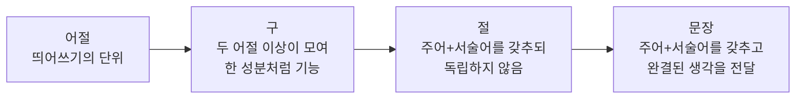

<Callout type="info">
  **이번 문서의 목표:** 02편에서 개관한 통사론·의미론·화용론을 문장 성분·문장의 짜임·의미 관계·발화 행위 수준까지 심화하고, 세 영역이 국어학개론 문제에서 어떻게 갈려 출제되는지 판별 기준을 갖춘다.
</Callout>

## 통사론 심화: 어절에서 문장까지

02편에서 통사론(統辭論, Syntax)은 단어가 결합해 구·절·문장을 이루는 규칙을 연구하는 분야라고 정리했다. 이 개념을 실제 문제 풀이에 쓰려면 문장을 이루는 단위들을 크기 순서로 정확히 구분할 수 있어야 한다.

> **쉽게 말하면:** 통사론은 "단어 조각들을 어떻게 쌓아야 문법적으로 완결된 문장이 되는가"를 다루는 분야다.

국어 문장은 다음과 같은 단위들이 층층이 쌓여 만들어진다.

- **어절**(語節): 문장을 발음하거나 띄어 쓸 때 나누어지는 마디. 대체로 하나의 단어에 조사나 어미가 붙은 형태다. 예를 들어 "학생이 책을 읽는다"는 "학생이", "책을", "읽는다"라는 세 어절로 이루어진다.
- **구**(句, Phrase): 둘 이상의 어절이 모여 하나의 문장 성분처럼 기능하되, 그 안에 주어와 서술어의 관계는 없는 단위. "새 책을"에서 "새 책을"은 관형어와 명사가 모여 목적어 역할을 하는 명사구다.
- **절**(節, Clause): 주어와 서술어를 갖추고 있지만 독립된 문장으로 쓰이지 않고 더 큰 문장 안에 안겨 있거나 이어져 있는 단위. "그가 노력했음이 밝혀졌다"에서 "그가 노력했음"은 주어와 서술어를 갖춘 절이다.
- **문장**(文章, Sentence): 주어와 서술어를 갖추고 하나의 완결된 생각을 전달하는 최종 단위.

## 문장 성분: 문장 안에서 어절(구)이 맡는 역할

**문장 성분**(文章成分)은 어절이나 구가 문장 안에서 맡는 문법적 역할을 가리킨다. 독학사 국어학개론에서는 문장 성분의 종류와 그 성분이 되는 조건을 정확히 구분하는 문제가 자주 나온다.

| 문장 성분 | 역할 | 예시(문장 속 밑줄 표현) |
|---|---|---|
| 주어 | 동작·상태의 주체를 나타낸다 | 도서관이 조용하다 |
| 서술어 | 주어의 동작·상태·성질을 풀이한다 | 도서관이 조용하다 |
| 목적어 | 서술어(타동사)의 동작 대상이 된다 | 학생이 자료를 정리한다 |
| 보어 | "되다", "아니다" 앞에서 의미를 보충한다 | 물이 얼음이 되었다 |
| 관형어 | 체언(명사·대명사·수사) 앞에서 그 체언을 꾸며준다 | 낡은 자전거가 서 있다 |
| 부사어 | 용언(동사·형용사)이나 다른 부사어·문장 전체를 꾸며준다 | 그는 빠르게 달렸다 |
| 독립어 | 다른 성분과 문법적으로 직접 관계를 맺지 않고 홀로 쓰인다 | 아, 벌써 저녁이구나 |

이 중 주어·서술어·목적어·보어는 문장의 골격을 이루는 **주성분**이고, 관형어·부사어는 다른 성분을 꾸미는 **부속성분**, 독립어는 문장 구조와 직접 관련이 없는 **독립성분**으로 분류한다. 시험에서는 "다음 문장에서 밑줄 친 부분의 문장 성분은?" 같은 형태로 자주 나오는데, 같은 형태의 말이라도 문장 안에서의 역할에 따라 성분이 달라진다는 점이 함정이다. 예를 들어 "그는 학생이다"에서 "학생이"는 서술어 "이다" 앞의 보어이지만, "학생이 걷는다"에서 "학생이"는 주어다. 형태(조사 "이/가")만 보고 기계적으로 판단하면 틀리기 쉽다.

## 문장의 짜임: 홑문장과 겹문장

문장은 주어와 서술어의 관계가 몇 번 나타나는지에 따라 두 가지로 나뉜다.

- **홑문장**(單文): 주어와 서술어의 관계가 한 번만 나타나는 문장. 예: "바람이 분다."
- **겹문장**(複文): 주어와 서술어의 관계가 두 번 이상 나타나는 문장. 겹문장은 다시 두 가지로 나뉜다.
  - **이어진문장**: 두 개 이상의 절이 대등하게 또는 종속적으로 이어진 문장. "비가 오고 바람이 분다"(대등하게 이어짐), "비가 와서 길이 막혔다"(원인·결과로 종속적으로 이어짐)
  - **안은문장**: 한 절이 다른 문장 속에 하나의 성분(명사절·관형절·부사절·서술절·인용절)으로 들어가 있는 문장. "나는 그가 옳았음을 깨달았다"에서 "그가 옳았음"은 명사절로 안겨 목적어 역할을 한다.

> **비유로 이해하기:** 홑문장이 벽돌 한 장이라면, 이어진문장은 벽돌을 옆으로 나란히 붙인 것이고, 안은문장은 벽돌 하나를 통째로 다른 벽돌 속에 박아 넣은 것이다.

이어진문장과 안은문장을 구분하는 핵심 기준은 "절이 다른 절과 대등하거나 종속적으로 나란히 있는가", 아니면 "절이 아예 다른 문장의 한 성분 자리를 차지하는가"이다. 시험에서는 안긴절의 종류(명사절·관형절·부사절·서술절·인용절)를 구분하는 문제가 자주 나오므로, 안긴절이 안은문장 안에서 어떤 문장 성분으로 기능하는지까지 함께 확인해야 한다.

## 의미론 심화: 의미 관계를 가르는 기준

02편에서 다룬 동의·반의·다의·동음이의·중의 관계를 국어학개론 수준으로 한 단계 더 깊이 살펴본다.

### 동의 관계와 반의 관계의 하위 유형

동의 관계는 완전히 같은 뜻을 가지는 경우가 드물기 때문에 대체로 **유의 관계**(類義關係, 뜻이 비슷하되 미묘한 뉘앙스나 쓰임의 차이가 있는 관계)로 부르는 것이 더 정확하다. 예를 들어 "친구"와 "벗"은 뜻은 비슷하지만 "벗"이 더 예스럽고 문어적인 느낌을 준다.

반의 관계는 대립의 성격에 따라 세 가지로 나뉜다.

| 반의 관계 유형 | 정의 | 예시 |
|---|---|---|
| 등급 반의어 | 두 단어 사이에 중간 정도가 존재하는 대립 | 크다 – 작다(그 사이에 "보통이다"가 있을 수 있다) |
| 상보 반의어 | 중간항 없이 둘 중 하나만 성립하는 대립 | 살다 – 죽다 |
| 방향 반의어 | 방향이나 관계가 서로 반대인 대립 | 사다 – 팔다, 부모 – 자식 |

### 다의 관계와 중의성의 확장

02편에서 다의어는 의미적으로 연관된 여러 뜻을 가지는 하나의 단어라고 정리했다. 다의어의 여러 뜻 중에서 가장 기본이 되는 뜻을 **중심 의미**, 거기서 확장되어 파생된 뜻을 **주변 의미**라고 부른다. 예를 들어 "손이 크다"라는 표현에서 "손"의 중심 의미는 신체 부위이고, "씀씀이가 후하다"는 주변 의미로 확장된 것이다.

중의성은 발생 원인에 따라 다시 나눌 수 있다.

- **어휘적 중의성**: 다의어나 동음이의어 때문에 한 단어의 해석이 갈리는 경우. "차가 좋다"에서 "차"가 마시는 차인지 탈것인지 불분명한 경우.
- **구조적 중의성**: 문장 성분들의 수식 관계가 두 가지 이상으로 해석되는 경우. "귀여운 영수의 동생"에서 "귀여운"이 "영수"를 꾸미는지 "동생"을 꾸미는지 불분명한 경우.
- **비유적 중의성**: 비유적 표현인지 문자 그대로의 표현인지가 불분명한 경우. "그는 호랑이다"가 실제 동물을 가리키는지 성격이 사납다는 비유인지 맥락 없이는 판단하기 어려운 경우.

## 화용론 심화: 발화 행위와 함축

02편에서 화용론은 맥락 속에서 발화가 실제로 수행하는 의도를 연구하는 분야라고 정리했다. 이를 좀 더 세분화하면 다음 개념들로 나뉜다.

- **발화 행위**(發話行爲, Speech Act): 말을 함으로써 어떤 행위를 수행하는 것. 철학자 존 오스틴(John Austin)의 이론에서는 발화 행위를 다시 세 층위로 나눈다.
  - **언표 행위**(locutionary act): 문장을 문법에 맞게 발음하고 뜻을 전달하는 행위 자체
  - **언표내적 행위**(illocutionary act): 그 발화로 실제로 수행하려는 의도(요청·약속·경고 등)
  - **언향적 행위**(perlocutionary act): 그 발화가 듣는 사람에게 실제로 일으키는 효과(창문을 닫는 행동 등)
- **함축**(含蓄, Implicature): 문장이 문자 그대로 말하지 않았지만 맥락상 전달되는 의미. "숙제 다 했니?"라는 질문에 "밥 먹었어요"라고 답하면, 문자 그대로는 숙제와 무관한 대답이지만 맥락상 "아직 못 했다"는 함축을 전달할 수 있다.
- **전제**(前提, Presupposition): 발화가 성립하기 위해 미리 참으로 받아들여져야 하는 내용. "그가 다시 지각했다"라는 문장은 "그가 예전에도 지각한 적이 있다"는 사실을 전제로 깔고 있다.

> **쉽게 말하면:** 발화 행위는 "말로 무엇을 하는가", 함축은 "말하지 않았지만 전달되는 뜻", 전제는 "그 말이 성립하려면 미리 참이어야 하는 사실"이다.

## 국어학개론 출제 포인트: 세 영역을 가르는 기준

국어학개론 문제에서 통사론·의미론·화용론을 헷갈리지 않으려면 다음 질문을 순서대로 던지는 습관이 유용하다.

<Steps>

1. **문장 구조 자체에 대한 질문인가?** — 문장 성분, 홑문장·겹문장 구분, 안긴절 종류를 묻는다면 통사론이다.
2. **문장이나 단어의 뜻 관계에 대한 질문인가?** — 동의·반의·다의·중의를 묻는다면 의미론이다. 이때 답은 맥락 없이도 사전적으로 판단할 수 있는 경우가 많다.
3. **맥락이 있어야만 답이 정해지는 질문인가?** — 같은 문장이라도 상황에 따라 의도나 함축이 달라진다면 화용론이다.

</Steps>

예를 들어 "밖에 비가 오네요"라는 문장을 두고 "이 문장의 문장 성분 구성은?"이라고 물으면 통사론 문제이고, "이 단어의 반의어는?"이라고 물으면 의미론 문제이며, "우산을 가진 사람에게 이 말을 했을 때 실제로 전달하려는 의도는?"이라고 물으면 화용론 문제다.

## 자주 틀리는 점

- 조사 "이/가"가 붙었다고 무조건 주어로 판단하는 실수가 잦다. 서술어 "되다", "아니다" 앞의 "이/가"는 보어일 수 있다.
- 이어진문장과 안은문장을 "절이 두 개 이상이면 다 이어진문장"으로 뭉뚱그려 잘못 판단하기 쉽다. 절이 다른 문장의 한 성분 자리를 차지하면 안은문장이다.
- 다의어의 주변 의미를 동음이의어로 착각하는 경우가 많다. 의미적 연관성이 조금이라도 있으면 다의어다.
- 화용론 문제를 "말투가 공손한가"로 오해해 예절의 문제로 잘못 접근하는 경우가 있다. 화용론은 맥락에 따른 의미 해석의 규칙을 다룬다.

## 핵심 정리

- 문장은 어절 → 구 → 절 → 문장의 순서로 커지며, 문장 성분(주어·서술어·목적어·보어·관형어·부사어·독립어)은 이 단위들이 문장 안에서 맡는 역할이다.
- 문장은 주어·서술어 관계의 횟수에 따라 홑문장과 겹문장(이어진문장·안은문장)으로 나뉘며, 안은문장은 절이 다른 문장의 한 성분 자리를 차지한다는 점이 이어진문장과 다르다.
- 의미 관계는 동의(유의)·반의(등급·상보·방향)·다의·동음이의·중의(어휘적·구조적·비유적)로 세분화된다.
- 화용론은 발화 행위(언표·언표내적·언향적)와 함축, 전제를 통해 맥락 속 의미를 다루며, 통사론·의미론과 달리 맥락이 있어야 답이 정해진다.

## 마무리 복습

<Quiz
  questionNumber={1}
  question="다음 중 절에 대한 설명으로 가장 적절한 것은?"
  options={['주어와 서술어 관계 없이 두 어절이 모인 단위다', '주어와 서술어를 갖추었지만 독립된 문장으로 쓰이지 않는 단위다', '띄어쓰기의 기본 단위를 가리킨다', '문장 성분 중 하나를 가리키는 용어다']}
  correctAnswer={2}
  explanation="절은 주어와 서술어를 갖추고 있지만 독립된 문장이 아니라 더 큰 문장 안에 안기거나 이어져 있는 단위다."
  optionExplanations={['그것은 구에 대한 설명이다', '정답이다', '그것은 어절에 대한 설명이다', '절은 단위이지 문장 성분의 명칭이 아니다']}
/>

<Quiz
  questionNumber={2}
  question="문장 다음 예의 밑줄 부분과 관련해 옳지 않은 것을 고르라. 예문: 물이 얼음이 되었다."
  options={['이 문장에서 얼음이는 보어에 해당한다', '보어는 되다, 아니다 앞에서 의미를 보충한다', '얼음이는 조사 이가 붙었으므로 언제나 주어로만 분석해야 한다', '이 문장의 주어는 물이이다']}
  correctAnswer={3}
  explanation="조사 이/가가 붙었다고 항상 주어인 것은 아니며, 되다 앞의 이/가는 보어로 분석된다."
  optionExplanations={['옳은 설명이므로 정답이 아니다', '옳은 설명이므로 정답이 아니다', '조사 형태만으로 무조건 주어로 판단하는 것은 옳지 않으므로 이것이 정답이다', '옳은 설명이므로 정답이 아니다']}
/>

<Quiz
  questionNumber={3}
  question="이어진문장과 안은문장을 구분하는 핵심 기준으로 가장 적절한 것은?"
  options={['절의 개수가 두 개 이상인지 여부', '절이 다른 문장의 한 성분 자리를 차지하는지 여부', '문장에 조사가 몇 개 쓰였는지 여부', '문장의 길이가 긴지 여부']}
  correctAnswer={2}
  explanation="절이 대등하거나 종속적으로 나란히 이어지면 이어진문장이고, 절이 다른 문장의 한 성분 자리를 차지하면 안은문장이다."
  optionExplanations={['절이 두 개 이상이어도 나란히 이어지면 이어진문장일 수 있다', '정답이다', '조사의 개수는 구분 기준이 아니다', '문장 길이는 구분 기준이 아니다']}
/>

<Quiz
  questionNumber={4}
  question="크다와 작다처럼 중간 정도가 존재하는 반의 관계를 가리키는 용어는?"
  options={['상보 반의어', '방향 반의어', '등급 반의어', '동음 반의어']}
  correctAnswer={3}
  explanation="크다와 작다 사이에는 보통이다와 같은 중간 정도가 존재할 수 있으므로 등급 반의어에 해당한다."
  optionExplanations={['상보 반의어는 살다와 죽다처럼 중간항이 없다', '방향 반의어는 사다와 팔다처럼 방향이 반대다', '정답이다', '동음 반의어는 국어학개론에서 쓰이는 표준 용어가 아니다']}
/>

<Quiz
  questionNumber={5}
  question="귀여운 영수의 동생이라는 표현에서 발생하는 중의성의 유형은?"
  options={['어휘적 중의성', '구조적 중의성', '비유적 중의성', '음운적 중의성']}
  correctAnswer={2}
  explanation="귀여운이 영수를 꾸미는지 동생을 꾸미는지 수식 관계가 불분명해 발생하는 중의성이므로 구조적 중의성에 해당한다."
  optionExplanations={['어휘적 중의성은 다의어나 동음이의어 때문에 발생한다', '정답이다', '비유적 중의성은 비유 표현인지 여부가 불분명할 때 발생한다', '음운적 중의성은 국어학개론에서 쓰이는 표준 용어가 아니다']}
/>

<Quiz
  questionNumber={6}
  question="숙제 다 했니라는 질문에 밥 먹었어요라고 답해 아직 못 했다는 뜻을 전달했다면, 이 현상을 가리키는 화용론 용어는?"
  options={['전제', '함축', '언표 행위', '동의 관계']}
  correctAnswer={2}
  explanation="문장이 문자 그대로 말하지 않았지만 맥락상 전달되는 의미이므로 함축에 해당한다."
  optionExplanations={['전제는 발화가 성립하기 위해 미리 참이어야 하는 내용이다', '정답이다', '언표 행위는 문장을 문법에 맞게 발음하고 뜻을 전달하는 행위 자체다', '함축은 의미론이 아니라 화용론의 개념이며 동의 관계와는 무관하다']}
/>

<Quiz
  questionNumber={7}
  question="그가 다시 지각했다라는 문장이 성립하려면 미리 참으로 받아들여져야 하는 내용이 있다고 볼 때, 이 개념을 가리키는 용어는?"
  options={['전제', '함축', '반의 관계', '언향적 행위']}
  correctAnswer={1}
  explanation="그가 예전에도 지각한 적이 있다는 사실이 미리 참으로 전제되어야 다시라는 표현이 성립하므로 전제에 해당한다."
  optionExplanations={['정답이다', '함축은 문자 그대로 말하지 않은 채 맥락상 전달되는 의미다', '반의 관계는 의미론의 개념이다', '언향적 행위는 발화가 듣는 사람에게 일으키는 실제 효과다']}
/>

## 참고 자료

- [국립국어원](https://www.korean.go.kr)
- [표준국어대사전](https://stdict.korean.go.kr)
