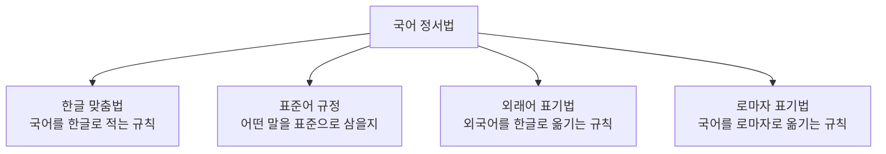

<Callout type="info">
  **이번 문서의 목표:** 한글 문자 체계의 창제 원리를 이해하고, 한글 맞춤법·표준어 규정·외래어 표기법의 핵심 조항을 예시 단어와 함께 설명하며, 표준어와 방언의 관계를 국어학개론 출제 수준으로 정리한다.
</Callout>

## 한글 창제와 문자 체계

**한글**은 조선 세종 25년(1443년)에 창제되고 세종 28년(1446년)에 《훈민정음》이라는 책으로 반포된 문자다. 한글이 시험에서 반복 출제되는 이유는 단순한 역사적 사실을 넘어, **소리를 나타내는 원리 자체가 매우 체계적**이라는 점 때문이다.

> **쉽게 말하면:** 한글은 발음 기관의 모양을 본떠 자음을 만들고, 하늘·땅·사람을 본떠 모음을 만든, 원리를 알고 나면 왜 그런 모양인지 설명할 수 있는 문자다.

### 자음의 제자 원리: 상형과 가획

훈민정음 해례본에 따르면 자음의 기본자 다섯 개는 발음 기관의 모양을 본떠 만들었다(**상형**, 象形).

| 기본자 | 본뜬 모양 | 관련 소리 |
|---|---|---|
| ㄱ | 혀뿌리가 목구멍을 막는 모양 | 어금닛소리(아음) |
| ㄴ | 혀끝이 윗잇몸에 닿는 모양 | 혓소리(설음) |
| ㅁ | 입의 모양 | 입술소리(순음) |
| ㅅ | 이의 모양 | 잇소리(치음) |
| ㅇ | 목구멍의 모양 | 목구멍소리(후음) |

이 다섯 기본자에 소리가 세어지는 정도에 따라 획을 더하는 것을 **가획**(加畫)이라고 한다. 예를 들어 ㄴ에 획을 더하면 ㄷ이 되고, ㄷ에 획을 더하면 ㅌ이 된다. 이렇게 만들어진 글자들은 소리의 세기가 관련된 글자끼리 모양도 비슷하게 이어지므로, 문자 하나하나를 따로 외울 필요 없이 원리로 이해할 수 있다.

### 모음의 제자 원리: 삼재(三才)

모음의 기본자 세 개(ㆍ, ㅡ, ㅣ)는 하늘(ㆍ)·땅(ㅡ)·사람(ㅣ)이라는 삼재(三才)를 본떠 만들었다. 이 세 기본자를 결합해 나머지 모음(ㅏ, ㅑ, ㅓ, ㅕ, ㅗ, ㅛ, ㅜ, ㅠ 등)을 파생시켰다.

> **비유로 이해하기:** 자음이 발음 기관을 관찰해 만든 그림이라면, 모음은 우주의 세 요소를 기하학적 점과 선으로 압축한 도형이다.

한글은 이처럼 하나하나의 문자가 소리의 특징이나 철학적 원리와 대응되도록 설계된 **자질 문자**(資質文字, Featural Alphabet, 문자의 모양 자체가 소리의 자질을 반영하는 문자 체계)로 평가받는다. 이는 세계 문자 중에서도 드문 특징으로, 독학사 시험에서 한글의 우수성을 묻는 문제의 핵심 근거가 된다.

## 한글 맞춤법: 표기법의 대원칙

**한글 맞춤법**은 한국어를 한글로 적을 때 지켜야 할 규정이다. 그 대원칙은 총칙 제1항에 담겨 있다.

> 한글 맞춤법 총칙 제1항: "한글 맞춤법은 표준어를 소리대로 적되, 어법에 맞도록 함을 원칙으로 한다."

이 한 조항 안에 두 가지 원리가 함께 들어 있다는 점이 시험의 핵심 포인트다.

- **소리대로 적기**(표음주의): 실제 발음을 그대로 반영해 적는 원리. 예를 들어 "하늘", "구름"처럼 형태소가 하나뿐인 단어는 소리 나는 대로 적는다.
- **어법에 맞도록 적기**(형태음소주의): 발음이 달라져도 하나의 형태소는 원래 형태를 밝혀 고정해 적는 원리. 예를 들어 "꽃이[꼬치]", "꽃놀이[꼰노리]"처럼 발음은 상황마다 달라지지만 "꽃"이라는 형태는 항상 같은 글자로 고정해 적어, 뜻을 눈으로 빠르게 알아볼 수 있게 한다.

> **쉽게 말하면:** 소리대로 적으면 발음은 쉽게 옮길 수 있지만 뜻을 알아보기 어렵고, 어법에 맞게 적으면 눈으로 뜻을 알아보기 쉬운 대신 발음과 표기가 달라진다. 한글 맞춤법은 이 둘을 상황에 따라 절충한다.

### 띄어쓰기의 원리

한글 맞춤법 제2항은 띄어쓰기의 대원칙을 규정한다.

> 한글 맞춤법 제2항: "문장의 각 단어는 띄어 씀을 원칙으로 한다."

다만 조사는 단어이면서도 예외적으로 앞말에 붙여 쓴다. 예를 들어 "학교에서"의 "에서"는 조사로서 독립된 단어이지만 "학교"에 붙여 쓴다. 반대로 의존 명사는 형식상 조사와 비슷해 보여도 띄어 쓴다. 예를 들어 "먹을 것이 없다"에서 "것"은 의존 명사이므로 앞말과 띄어 쓴다. 이처럼 "조사인가 의존 명사인가"를 구분하는 문제가 띄어쓰기 영역의 대표적인 출제 함정이다.

## 표준어 규정: 어떤 말을 표준으로 삼는가

**표준어**(標準語)를 정하는 기준은 표준어 규정 제1항에 명시되어 있다.

> 표준어 규정 제1항: "표준어는 교양 있는 사람들이 두루 쓰는 현대 서울말로 정함을 원칙으로 한다."

이 조항은 세 가지 기준을 동시에 담고 있다.

| 기준 | 의미 |
|---|---|
| 계층적 기준 | 교양 있는 사람들이 쓰는 말(특정 계층에 국한되지 않되 격식을 갖춘 말) |
| 시대적 기준 | 현대에 쓰이는 말(옛말이나 사어는 제외) |
| 지역적 기준 | 서울말(수도를 중심으로 한 지역의 말) |

표준어를 정하는 이유는 온 국민이 원활하게 의사소통할 수 있는 **공통어**의 기준을 세우기 위해서다. 표준어는 방언보다 우월한 언어가 아니라, 공적인 의사소통을 위해 사회적으로 합의한 기준일 뿐이라는 점이 시험에서 강조되는 관점이다.

## 외래어 표기법: 외국어 소리를 한글로 옮기는 규칙

**외래어 표기법**은 외국어에서 들어와 국어처럼 쓰이는 단어를 한글로 어떻게 적을지 정한 규정이다. 그 대원칙은 제1항에 담겨 있다.

> 외래어 표기법 제1항: "외래어는 국어의 현용 24 자모만으로 적는다."

이는 외래어를 적기 위해 별도의 새로운 글자나 기호를 만들지 않고, 이미 있는 한글 자모만으로 최대한 가깝게 옮긴다는 원칙이다. 예를 들어 영어 "family"는 한글의 기존 자모만으로 "패밀리"로 적으며, 영어 발음에 있는 미묘한 소리 차이를 표현하기 위한 새 글자를 만들지 않는다.

## 방언: 지역과 사회에 따른 언어 변이

**방언**(方言, Dialect)은 같은 언어 안에서 지역이나 사회적 요인에 따라 분화된 말의 체계를 가리킨다. 방언은 분화 기준에 따라 두 가지로 나뉜다.

- **지역 방언**: 지리적으로 떨어진 지역 사이에서 나타나는 언어 차이. 예를 들어 같은 뜻을 가리키는 말이라도 지역마다 다른 낱말이 쓰이는 경우가 있다.
- **사회 방언**: 연령·성별·직업·사회 계층 등 사회적 요인에 따라 나타나는 언어 차이. 특정 직업 집단에서만 쓰이는 전문 용어나 세대에 따라 달라지는 어휘 사용 양상이 그 예다.

> **쉽게 말하면:** 지역 방언은 "어디에서 쓰는 말인가"의 차이이고, 사회 방언은 "누가 쓰는 말인가"의 차이다.

표준어와 방언의 관계에서 시험이 자주 확인하는 오개념은 "방언은 틀린 말이다"라는 인식이다. 방언은 그 자체로 체계적인 문법과 어휘 규칙을 가진 온전한 언어 변이형이며, 표준어는 여러 방언 중 하나(서울말)를 공적 의사소통을 위해 기준으로 정한 것일 뿐 방언보다 언어학적으로 우월한 것이 아니다.

## 국어 정서법과의 연결

**정서법**(正書法, Orthography)은 한 언어를 문자로 적을 때 지켜야 할 규범 전체를 가리키는 포괄적 용어로, 한글 맞춤법·표준어 규정·외래어 표기법·로마자 표기법을 모두 아우른다. 국어학개론에서는 이 네 규정이 각각 무엇을 대상으로 하는지 구분하는 문제가 나온다.

이 네 규정은 서로 다른 대상을 다루면서도 유기적으로 연결된다. 예를 들어 외래어 표기법으로 정해진 단어(예: "패밀리")가 국어 어휘로 굳어지면, 그 이후에는 한글 맞춤법의 적용을 받는 일반 단어처럼 취급된다.

## 자주 틀리는 점

- 한글 맞춤법 제1항의 "소리대로 적되, 어법에 맞도록"을 서로 대립하는 원칙으로 착각하기 쉽다. 두 원칙은 상황에 따라 함께 적용되는 절충적 원리다.
- 조사와 의존 명사를 형태만 보고 혼동해 띄어쓰기를 잘못 판단하는 경우가 많다. 조사는 붙여 쓰고 의존 명사는 띄어 쓴다.
- 표준어를 "표준어가 방언보다 더 올바른 말"이라고 오해하기 쉽다. 표준어는 공적 의사소통을 위한 기준일 뿐 언어학적 우열의 문제가 아니다.
- 외래어 표기법을 "발음을 최대한 원어에 가깝게 새 기호로 표현하는 규정"으로 오해하기 쉽다. 실제로는 기존 24 자모만 사용한다는 것이 대원칙이다.

## 핵심 정리

- 한글은 자음을 발음 기관 모양(상형)과 가획으로, 모음을 하늘·땅·사람(삼재)의 결합으로 만든 자질 문자다.
- 한글 맞춤법 총칙 제1항은 표준어를 소리대로 적되 어법에 맞도록 함을 원칙으로 하며, 이는 표음주의와 형태음소주의를 절충한 것이다.
- 표준어 규정 제1항은 교양 있는 사람들이 두루 쓰는 현대 서울말을 표준어로 정하며, 이는 계층·시대·지역이라는 세 기준을 담고 있다.
- 외래어 표기법 제1항은 국어의 현용 24 자모만으로 외래어를 적도록 하며, 방언은 지역 방언과 사회 방언으로 나뉘고 표준어보다 열등한 것이 아니다.

## 마무리 복습

<Quiz
  questionNumber={1}
  question="훈민정음 해례본에 따를 때 자음 기본자 다섯 개를 만든 원리로 가장 적절한 것은?"
  options={['하늘, 땅, 사람의 모양을 본뜬 삼재의 원리', '발음 기관의 모양을 본뜬 상형의 원리', '기존 한자의 획을 줄인 원리', '외국 문자를 참고해 변형한 원리']}
  correctAnswer={2}
  explanation="자음 기본자 다섯 개는 발음 기관의 모양을 본뜬 상형의 원리로 만들어졌다."
  optionExplanations={['삼재의 원리는 모음 기본자를 만든 원리다', '정답이다', '한자의 획을 줄인 것이 아니라 발음 기관을 본뜬 것이다', '훈민정음은 외국 문자를 변형한 것이 아니라 독자적으로 창제되었다']}
/>

<Quiz
  questionNumber={2}
  question="한글 맞춤법 총칙 제1항의 내용으로 가장 적절한 것은?"
  options={['한글 맞춤법은 소리대로 적는 것만을 원칙으로 한다', '한글 맞춤법은 표준어를 소리대로 적되 어법에 맞도록 함을 원칙으로 한다', '한글 맞춤법은 외래어 표기를 위한 규정이다', '한글 맞춤법은 로마자 표기 규정을 포함한다']}
  correctAnswer={2}
  explanation="한글 맞춤법 총칙 제1항은 표준어를 소리대로 적되 어법에 맞도록 함을 원칙으로 한다고 규정한다."
  optionExplanations={['소리대로 적는 것만이 아니라 어법에 맞도록 하는 원칙도 함께 담고 있다', '정답이다', '외래어 표기는 별도의 외래어 표기법이 규정한다', '로마자 표기는 별도의 로마자 표기법이 규정한다']}
/>

<Quiz
  questionNumber={3}
  question="꽃이를 소리 나는 대로 적지 않고 항상 꽃이로 고정해 적는 원리를 가리키는 용어는?"
  options={['표음주의', '형태음소주의', '삼재의 원리', '가획의 원리']}
  correctAnswer={2}
  explanation="발음이 달라져도 하나의 형태소를 원래 형태로 고정해 적어 뜻을 알아보기 쉽게 하는 원리이므로 형태음소주의에 해당한다."
  optionExplanations={['표음주의는 소리 나는 대로 적는 원리다', '정답이다', '삼재의 원리는 모음 제자 원리다', '가획의 원리는 자음 제자 원리다']}
/>

<Quiz
  questionNumber={4}
  question="학교에서와 먹을 것이 없다에서 에서와 것의 띄어쓰기 처리에 대한 설명으로 옳은 것은?"
  options={['에서는 조사이므로 붙여 쓰고, 것은 의존 명사이므로 띄어 쓴다', '에서와 것 모두 조사이므로 붙여 쓴다', '에서와 것 모두 의존 명사이므로 띄어 쓴다', '에서는 의존 명사이므로 띄어 쓰고, 것은 조사이므로 붙여 쓴다']}
  correctAnswer={1}
  explanation="에서는 조사이므로 앞말에 붙여 쓰고, 것은 의존 명사이므로 앞말과 띄어 쓴다."
  optionExplanations={['정답이다', '것은 조사가 아니라 의존 명사다', '에서는 의존 명사가 아니라 조사다', '에서와 것의 품사 설명이 서로 반대로 되어 있다']}
/>

<Quiz
  questionNumber={5}
  question="표준어 규정 제1항이 표준어를 정하는 기준으로 명시하지 않는 것은?"
  options={['교양 있는 사람들이 쓰는 말이라는 계층적 기준', '현대에 쓰이는 말이라는 시대적 기준', '서울말이라는 지역적 기준', '가장 오래전부터 쓰인 말이라는 역사적 기준']}
  correctAnswer={4}
  explanation="표준어 규정 제1항은 계층, 시대, 지역이라는 세 기준을 명시하며 가장 오래전부터 쓰인 말이라는 역사적 기준은 포함하지 않는다."
  optionExplanations={['표준어 규정 제1항에 명시된 기준이므로 정답이 아니다', '표준어 규정 제1항에 명시된 기준이므로 정답이 아니다', '표준어 규정 제1항에 명시된 기준이므로 정답이 아니다', '정답이다']}
/>

<Quiz
  questionNumber={6}
  question="지역 방언과 사회 방언에 대한 설명으로 옳지 않은 것은?"
  options={['지역 방언은 지리적으로 떨어진 지역 사이의 언어 차이다', '사회 방언은 연령이나 직업 등 사회적 요인에 따른 언어 차이다', '방언은 체계적인 문법과 어휘 규칙을 가진 온전한 언어 변이형이다', '방언은 표준어보다 언어학적으로 열등한 말이다']}
  correctAnswer={4}
  explanation="방언은 표준어와 마찬가지로 체계적인 언어 변이형이며 언어학적으로 열등한 것이 아니므로 이 설명이 옳지 않다."
  optionExplanations={['옳은 설명이므로 정답이 아니다', '옳은 설명이므로 정답이 아니다', '옳은 설명이므로 정답이 아니다', '방언을 열등한 말로 보는 것은 언어학적으로 옳지 않은 오개념이므로 이것이 정답이다']}
/>

<Quiz
  questionNumber={7}
  question="외래어 표기법 제1항의 대원칙으로 가장 적절한 것은?"
  options={['원어 발음을 위해 새로운 글자를 만들어 적는다', '국어의 현용 24 자모만으로 적는다', '한자로 음역하여 적는다', '로마자를 그대로 표기에 사용한다']}
  correctAnswer={2}
  explanation="외래어 표기법 제1항은 외래어를 국어의 현용 24 자모만으로 적도록 규정한다."
  optionExplanations={['새로운 글자를 만들지 않는 것이 대원칙이다', '정답이다', '외래어 표기법은 한자 음역이 아니라 한글 표기 규정이다', '외래어 표기법은 로마자가 아니라 한글로 옮기는 규정이다']}
/>

## 참고 자료

- [국립국어원](https://www.korean.go.kr)
- [표준국어대사전](https://stdict.korean.go.kr)
