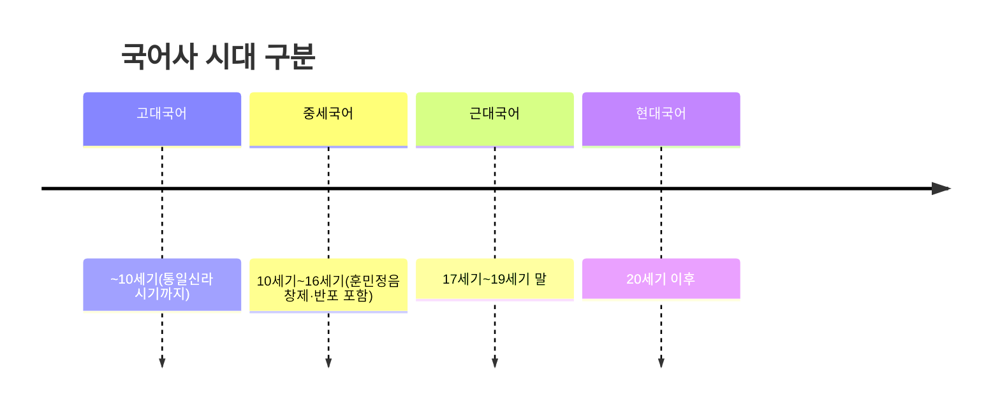

<Callout type="info">
  **이번 문서의 목표:** 국어사의 시대 구분과 각 시대의 음운·문법·어휘 특징을 구분하고, 중세국어 특유의 표기·음가를 훈민정음 창제라는 역사적 사건과 함께 이해해 국어사 문제의 시대 판별 기준을 갖춘다.
</Callout>

## 국어사란 무엇을 연구하는가

**국어사**(國語史, History of Korean)는 앞서 02편에서 정리한 통시적 연구(通時的, Diachronic, 시간의 흐름에 따른 언어 변화를 추적하는 방법)의 대표 영역으로, 한국어가 시대에 따라 음운·문법·어휘 면에서 어떻게 변화해 왔는지를 다룬다.

> **쉽게 말하면:** 국어사는 "옛날 한국어와 지금 한국어가 어떻게 다르고, 그 차이가 어느 시대에 생겼는가"를 연구하는 분야다.

국어사는 언어 자료가 실제로 남아 있는 시기를 기준으로 다음과 같이 시대를 구분하는 것이 일반적이다.

## 고대국어: 문자 기록 이전의 국어

**고대국어**는 삼국시대부터 통일신라 시기(10세기 무렵)까지의 국어를 가리킨다. 이 시기는 한글이 없었기 때문에, 한국어를 직접 표기한 순수한 문자 자료가 남아 있지 않다는 점이 가장 큰 특징이다. 대신 한자를 빌려 한국어를 표기하려 한 시도들이 남아 있다.

- **향찰**(鄕札): 한자의 음과 뜻을 빌려 한국어 문장 전체(특히 향가)를 적던 표기 방식.
- **이두**(吏讀): 한문 문장에 한국어의 조사나 어미에 해당하는 요소를 한자로 보충해 적던 표기 방식으로, 관공서의 실용 문서에 주로 쓰였다.
- **구결**(口訣): 한문을 읽을 때 그 사이사이에 한국어의 조사·어미에 해당하는 요소를 표시해 한문 독해를 돕던 표기 방식.

이 세 표기법은 모두 한글이 없던 시기에 한자를 이용해 한국어를 적으려 했던 노력이라는 공통점이 있지만, 목적과 방식이 다르다. 향찰은 문장 전체를 적는 데 쓰였고, 이두는 실용 문서 작성에, 구결은 한문 독해 보조에 주로 쓰였다는 차이를 구분하는 것이 시험에서 자주 나오는 포인트다.

## 중세국어: 훈민정음 창제를 품은 전환기

**중세국어**는 대략 10세기부터 16세기까지를 가리키며, 이 시기의 가장 중요한 사건은 세종이 훈민정음을 창제(1443년)하고 반포(1446년)한 일이다. 훈민정음 창제 이후 비로소 한국어를 있는 그대로 적을 수 있는 고유 문자가 생겼고, 이 시기의 한국어(주로 15~16세기 문헌에 나타나는 국어)를 좁은 의미로 **중세국어**라 부르기도 한다.

> **쉽게 말하면:** 중세국어는 "한글이 막 만들어져서, 당시 실제 한국어 발음과 문법이 문헌에 그대로 기록되기 시작한 시기의 국어"다.

중세국어는 현대국어와 비교했을 때 다음과 같은 뚜렷한 특징을 보인다.

### 방점: 성조를 표시하던 부호

중세국어는 소리의 높낮이, 즉 **성조**(聲調)가 뜻을 구별하는 데 쓰였다. 이를 글자 왼쪽에 점을 찍어 표시한 것이 **방점**(傍點)이다.

| 방점 | 성조 이름 | 특징 |
|---|---|---|
| 점 없음 | 평성(平聲) | 낮은 소리 |
| 점 하나 | 거성(去聲) | 높은 소리 |
| 점 둘 | 상성(上聲) | 낮았다가 높아지는 소리 |

방점은 근대국어로 넘어오면서 점차 사라졌고, 오늘날 표준어에서는 성조가 뜻을 구별하는 기능을 하지 않는다(다만 장단이 그 흔적으로 일부 남아 있다는 것이 02편에서 다룬 운소 개념과 연결된다).

### 사라진 자모와 음가

중세국어 문헌에는 현대 한글에 없는 자모가 여러 개 나타난다.

| 자모 | 이름 | 음가·쓰임 |
|---|---|---|
| ㆍ | 아래아 | "ㅏ"와 "ㅗ"의 중간 정도로 추정되는 모음. 근대국어를 거치며 소실됨 |
| ㅸ | 순경음 비읍 | 입술을 가볍게 스치며 내는 유성 마찰음에 가까운 소리로 추정됨 |
| ㅿ | 반치음 | 잇소리와 목구멍소리 사이의 유성 마찰음으로 추정됨 |
| ㆁ | 옛이응 | 음절 첫소리에서 나는 목구멍소리를 표기하기 위한 별도 글자(현재의 받침 ㅇ과는 다른 음가) |

이 네 글자는 모두 근대국어를 거치며 문자 체계에서 사라지거나 다른 글자로 합쳐졌다. 시험에서는 이 글자들의 이름과 대략적인 음가, 그리고 "언제 사라졌는가"보다는 "중세국어에는 있었고 현대국어에는 없다"는 사실 관계를 정확히 아는 것이 중요하다.

### 문법·어휘의 특징

- **모음조화**(母音調和): 중세국어에서는 양성모음(ㅏ, ㅗ, ㆍ 등)은 양성모음끼리, 음성모음(ㅓ, ㅜ, ㅡ 등)은 음성모음끼리 어울리는 규칙이 현대국어보다 훨씬 엄격하게 지켜졌다. 현대국어의 "잡아"와 "먹어"에서 어미 "아/어"가 갈리는 것이 이 모음조화의 흔적이다.
- **두음법칙 미실현**: 현대국어에서는 한자어의 첫소리에 오는 "ㄴ", "ㄹ"이 "ㅇ", "ㄴ"으로 바뀌는 두음법칙(예: "녀자"가 "여자"로)이 적용되지만, 중세국어 문헌에는 이러한 제약 없이 본래의 소리가 그대로 나타난다.
- **주격 조사의 형태**: 현대국어의 주격 조사는 "이/가"로 나타나지만, 중세국어에서는 "가"라는 형태가 아직 널리 쓰이지 않았고 "이"가 주로 쓰였다.

## 근대국어: 중세에서 현대로 가는 다리

**근대국어**는 17세기부터 19세기 말까지를 가리키며, 임진왜란 이후의 사회 변동과 함께 국어에도 여러 변화가 일어난 시기다. 근대국어의 핵심은 중세국어의 특징들이 하나씩 사라지며 현대국어의 모습에 가까워져 간다는 점이다.

- **방점의 소실**: 성조를 표시하던 방점이 문헌에서 사라지고, 성조 대신 소리의 길이(장단)만 일부 남는다.
- **아래아(ㆍ)의 음가 소실**: 아래아는 음가 자체가 다른 모음(주로 "ㅏ")에 흡수되어 소리로서는 사라지지만, 표기상으로는 20세기 초까지도 계속 쓰였다는 점이 시험의 함정이다. 즉 "글자가 남아 있었다"는 사실과 "소리가 남아 있었다"는 사실을 구분해야 한다.
- **순경음 비읍(ㅸ)·반치음(ㅿ)의 소실**: 이 두 글자는 근대국어 시기를 거치며 표기 자체에서도 사라졌다.
- **구개음화**(口蓋音化)의 발생: "ㄷ", "ㅌ"이 "ㅣ" 모음 앞에서 "ㅈ", "ㅊ"으로 바뀌는 현상이 근대국어 시기에 본격적으로 자리 잡았다. 예를 들어 "디다(落)"가 "지다"로 바뀐 것이 이 시기의 변화다.

> **쉽게 말하면:** 근대국어는 "중세국어의 특이한 소리들이 하나씩 없어지고, 오늘날 우리가 아는 발음 습관들이 자리를 잡아 가는 과도기"다.

## 국어사 흐름을 한눈에: 시대별 판별 기준

국어사 문제는 제시된 문헌 자료나 예시 단어가 어느 시대의 것인지 판별하는 유형이 많다. 다음 순서로 접근하면 판별이 쉬워진다.

<Steps>

1. **한글로 적혀 있는가, 한자를 빌려 적었는가?** — 한자를 빌려 향찰·이두·구결로 적었다면 고대국어다.
2. **방점이나 아래아, 순경음 비읍, 반치음 같은 중세 특유의 표기가 나타나는가?** — 나타난다면 중세국어(15~16세기)일 가능성이 높다.
3. **방점은 사라졌지만 아래아 글자가 표기에 남아 있고 구개음화가 나타나는가?** — 근대국어(17~19세기)일 가능성이 높다.
4. **위 특징이 모두 없고 현대 맞춤법과 유사한가?** — 현대국어다.

</Steps>

## 자주 틀리는 점

- 향찰·이두·구결을 모두 "한자를 빌려 쓴 표기법"으로 뭉뚱그려 구분하지 않는 실수가 잦다. 향찰은 문장 전체 표기, 이두는 실용 문서, 구결은 한문 독해 보조라는 목적의 차이를 기억해야 한다.
- 훈민정음의 창제(1443년)와 반포(1446년) 연도를 혼동하기 쉽다. 창제는 만들어진 시점, 반포는 책으로 세상에 공개된 시점이다.
- 아래아(ㆍ)가 "사라졌다"는 사실을 음가 소실과 표기 소실을 구분하지 않고 한 시점으로 잘못 아는 경우가 많다. 음가는 근대국어 시기에 이미 소실되었지만, 표기 관습은 20세기 초까지 이어졌다.
- 방점을 "글자의 일부"로 오해하는 경우가 있다. 방점은 글자 자체가 아니라 성조를 표시하기 위해 글자 옆에 찍은 부호다.

## 핵심 정리

- 국어사는 고대국어(~10세기)·중세국어(10~16세기)·근대국어(17~19세기 말)·현대국어(20세기 이후)로 시대를 구분하며, 이는 통시적 연구의 대표 영역이다.
- 고대국어는 향찰·이두·구결로 한자를 빌려 한국어를 표기했고, 중세국어는 훈민정음 창제(1443년)·반포(1446년)로 한글 표기가 시작되면서 방점(성조)과 아래아·순경음 비읍·반치음·옛이응 같은 현대에 없는 요소를 보였다.
- 근대국어는 방점 소실, 구개음화 발생 등을 거치며 중세국어에서 현대국어로 넘어가는 과도기 역할을 했다.
- 시대 판별 문제는 표기 방식(한자 차용 여부)과 중세 특유 요소(방점·아래아 등)의 존재 여부를 순서대로 확인하는 방식으로 접근한다.

## 마무리 복습

<Quiz
  questionNumber={1}
  question="한문 문장에 한국어의 조사나 어미에 해당하는 요소를 한자로 보충해 관공서 실용 문서에 주로 쓰던 고대국어의 표기법은?"
  options={['향찰', '이두', '구결', '방점']}
  correctAnswer={2}
  explanation="이두는 한문 문장에 한국어의 조사나 어미에 해당하는 요소를 한자로 보충해 실용 문서 작성에 주로 쓰인 표기법이다."
  optionExplanations={['향찰은 향가처럼 문장 전체를 적는 데 쓰였다', '정답이다', '구결은 한문 독해를 돕기 위한 표기법이다', '방점은 중세국어 시기 성조 표시 부호로 표기법의 명칭이 아니다']}
/>

<Quiz
  questionNumber={2}
  question="세종의 훈민정음 창제와 반포 연도에 대한 설명으로 옳은 것은?"
  options={['1443년에 반포되고 1446년에 창제되었다', '1443년에 창제되고 1446년에 반포되었다', '창제와 반포는 같은 해에 이루어졌다', '창제 연도와 반포 연도는 정확히 알려져 있지 않다']}
  correctAnswer={2}
  explanation="훈민정음은 1443년에 창제되었고 1446년에 책으로 반포되었다."
  optionExplanations={['창제와 반포 연도가 반대로 되어 있다', '정답이다', '창제와 반포는 3년의 시차를 두고 이루어졌다', '창제와 반포 연도는 역사적으로 확인되어 있다']}
/>

<Quiz
  questionNumber={3}
  question="중세국어에서 소리의 높낮이인 성조를 글자 옆에 점으로 표시한 것을 가리키는 용어는?"
  options={['구결', '방점', '모음조화', '두음법칙']}
  correctAnswer={2}
  explanation="방점은 중세국어에서 성조를 표시하기 위해 글자 왼쪽에 찍던 점이다."
  optionExplanations={['구결은 한문 독해를 돕던 고대국어의 표기법이다', '정답이다', '모음조화는 양성모음과 음성모음이 어울리는 규칙이다', '두음법칙은 한자어 첫소리가 바뀌는 현대국어의 규칙이다']}
/>

<Quiz
  questionNumber={4}
  question="다음 중 중세국어에 있었으나 현대 한글에는 없는 자모가 아닌 것은?"
  options={['아래아(ㆍ)', '순경음 비읍(ㅸ)', '반치음(ㅿ)', '쌍시옷(ㅆ)']}
  correctAnswer={4}
  explanation="쌍시옷은 현대 한글에도 쓰이는 자모이며, 아래아·순경음 비읍·반치음은 중세국어 시기에 쓰이다가 이후 소실된 자모다."
  optionExplanations={['중세국어에 있었으나 현대에는 없는 자모이므로 정답이 아니다', '중세국어에 있었으나 현대에는 없는 자모이므로 정답이 아니다', '중세국어에 있었으나 현대에는 없는 자모이므로 정답이 아니다', '정답이다']}
/>

<Quiz
  questionNumber={5}
  question="아래아(ㆍ)의 음가 소실과 표기 소실에 대한 설명으로 가장 적절한 것은?"
  options={['음가와 표기가 같은 시기에 함께 사라졌다', '음가는 근대국어 시기에 이미 소실되었지만 표기 관습은 20세기 초까지 이어졌다', '표기는 중세국어 시기에 사라졌지만 음가는 지금도 남아 있다', '아래아는 음가와 표기 모두 현재까지 쓰이고 있다']}
  correctAnswer={2}
  explanation="아래아는 근대국어 시기에 음가가 다른 모음에 흡수되어 소리로는 사라졌지만, 표기상으로는 20세기 초까지도 계속 쓰였다."
  optionExplanations={['음가 소실과 표기 소실의 시점은 서로 다르다', '정답이다', '표기가 음가보다 더 오래 남아 있었으므로 설명이 반대다', '아래아는 현재 표기와 음가 모두 쓰이지 않는다']}
/>

<Quiz
  questionNumber={6}
  question="디다(落)가 지다로 바뀐 것처럼 ㄷ, ㅌ이 ㅣ 모음 앞에서 ㅈ, ㅊ으로 바뀌는 현상이 본격적으로 자리 잡은 시기와 그 현상의 이름으로 옳은 것은?"
  options={['고대국어, 두음법칙', '중세국어, 모음조화', '근대국어, 구개음화', '현대국어, 방점']}
  correctAnswer={3}
  explanation="ㄷ, ㅌ이 ㅣ 모음 앞에서 ㅈ, ㅊ으로 바뀌는 구개음화는 근대국어 시기에 본격적으로 자리 잡았다."
  optionExplanations={['두음법칙은 한자어 첫소리 ㄴ, ㄹ이 바뀌는 현대국어의 규칙으로 이 현상과 다르다', '모음조화는 양성모음과 음성모음이 어울리는 중세국어의 규칙으로 이 현상과 다르다', '정답이다', '방점은 성조 표시 부호로 이 현상과 무관하다']}
/>

<Quiz
  questionNumber={7}
  question="국어사에서 시대를 판별할 때, 어떤 문헌에 방점과 아래아 표기가 함께 나타난다면 가장 먼저 의심해 볼 시대는?"
  options={['고대국어', '중세국어', '근대국어', '현대국어']}
  correctAnswer={2}
  explanation="방점은 중세국어에서 성조를 나타내던 특유의 표기이므로 방점과 아래아가 함께 나타나면 중세국어일 가능성이 가장 높다."
  optionExplanations={['고대국어는 한글이 없어 방점 표기 자체가 나타날 수 없다', '정답이다', '근대국어는 방점이 이미 사라진 시기다', '현대국어에는 방점이 쓰이지 않는다']}
/>

## 참고 자료

- [국립국어원](https://www.korean.go.kr)
- [표준국어대사전](https://stdict.korean.go.kr)
