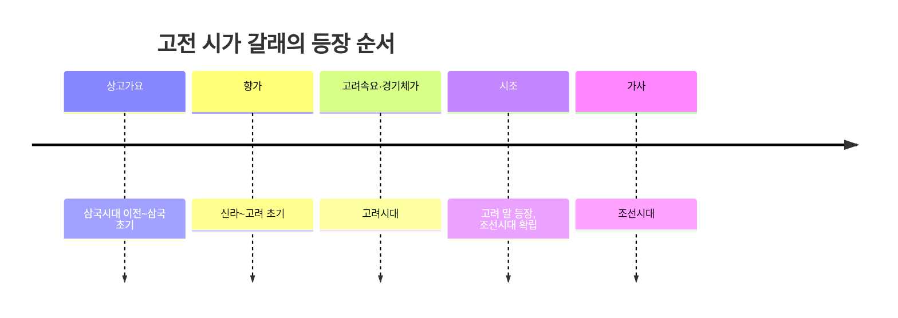

<Callout type="info">
  **이번 문서의 목표:** 상고가요부터 조선시대 가사까지 고전 시가의 주요 갈래를 형식·운율·작가층·주제 기준으로 구분하고, 처음 보는 작품의 갈래를 판별하는 기준을 세운다.
</Callout>

## 고전 시가를 갈래로 나누어 보는 이유

04편에서 정리했듯 한국 고전문학은 상고시대부터 조선시대까지 긴 시간에 걸쳐 있다. 이 긴 시간 동안 시가(詩歌, 노래로 불리던 운문 문학)는 형식과 담당 계층이 계속 바뀌며 여러 갈래로 분화되었다. 독학사 4단계에서는 "처음 보는 작품 한 편을 제시하고 그 갈래를 판별하라"는 유형이 자주 나오므로, 각 갈래의 형식적 특징을 정확히 구분하는 것이 이 문서의 핵심 목표다.

> **쉽게 말하면:** 고전 시가 갈래를 구분하는 문제는 "이 노래가 몇 행·몇 마디로 되어 있고, 후렴구가 있는지, 누가 부르던 노래인지"를 보고 이름을 맞히는 문제다.

## 상고가요: 한국 시가문학의 출발점

**상고가요**(上古歌謠)는 삼국시대 이전부터 삼국 초기까지 불리던 노래로, 오늘날에는 온전한 원문이 전하지 않고 후대 문헌(주로 한문 기록)에 배경 설화와 함께 짧게 옮겨진 형태로만 남아 있다.

> **쉽게 말하면:** 상고가요는 한국 시가 중 가장 오래된 것으로, 노래 자체보다 그 노래가 왜 불렸는지 설명하는 이야기(배경 설화)와 함께 전해지는 경우가 많다.

대표적으로 다음 세 작품이 시험에 자주 인용된다.

| 작품 | 성격 | 배경 설화 요약 |
|---|---|---|
| 공무도하가 | 개인적 서정, 이별과 죽음의 슬픔 | 물을 건너다 빠져 죽은 남편을 보고 그 아내가 슬픔에 겨워 부른 뒤 스스로도 목숨을 끊었다는 내용이 전한다 |
| 구지가 | 집단적 주술요, 왕의 강림을 비는 노래 | 여러 사람이 모여 신령스러운 존재가 나타나기를 바라며 함께 부른 노래로 전한다 |
| 황조가 | 개인적 서정, 외로움과 그리움 | 사랑하는 사람을 잃고 홀로 남은 마음을 꾀꼬리 한 쌍에 빗대어 노래했다고 전한다 |

이 세 작품을 구분하는 시험 포인트는 "개인적 서정이냐 집단적 주술이냐"이다. 공무도하가와 황조가는 한 개인의 감정(이별·그리움)을 노래한 서정 갈래이고, 구지가는 여러 사람이 함께 부르며 초자연적 존재의 강림을 비는 집단적·주술적 성격의 노래라는 점이 대비된다.

## 향가: 향찰로 적힌 신라의 노래

**향가**(鄕歌)는 신라시대부터 고려 초기까지 불리던 노래로, 11편에서 다룬 **향찰**(한자의 음과 뜻을 빌려 한국어 문장을 표기하던 방식)로 기록되어 오늘날까지 원문이 전하는 가장 오래된 우리말 시가다.

> **쉽게 말하면:** 향가는 "한글이 없던 시절, 한자를 빌려서라도 우리말 노래를 그대로 적어 남긴" 최초의 본격적인 시가다.

향가는 형식(구의 수)에 따라 세 종류로 나뉜다.

| 형식 | 구 수 | 특징 |
|---|---|---|
| 4구체 | 4구 | 민요적 성격이 강한 초기 형태 |
| 8구체 | 8구 | 4구체에서 발전한 과도기 형태 |
| 10구체(사뇌가) | 10구 | 향가의 완성된 형식으로, 마지막 두 구(낙구) 앞에 감탄사가 오는 경우가 많다 |

시험에서 자주 다루는 대표 작품으로는 이별한 누이를 추모하며 인생의 무상함을 노래했다고 전하는 10구체 향가, 어린아이의 노래처럼 꾸며 서동(署童)이 자신의 뜻을 이루었다는 설화와 함께 전하는 4구체 향가 등이 있다. 향가는 작가층이 승려·화랑 등 상층 지식인부터 민요적 성격의 무명씨까지 폭넓다는 점, 그리고 불교적 세계관(윤회·정토왕생 등)이 담긴 작품이 많다는 점이 특징으로 자주 출제된다.

## 고려속요와 경기체가: 두 갈래로 나뉜 고려의 노래

고려시대에는 담당 계층이 서로 다른 두 갈래의 노래가 나란히 발전했다.

### 고려속요: 평민층의 노래

**고려속요**(高麗俗謠, 여요라고도 부른다)는 평민층 사이에서 구전되다가 조선시대에 한글로 정착된 노래다.

- **형식**: 대체로 **3음보**(한 행이 세 개의 마디로 끊어 읽히는 운율)를 기본으로 하며, 연이 나뉘는 **분연체**(分聯體)가 많고 각 연 사이에 **후렴구**(같은 구절이 반복되는 부분)가 들어가는 경우가 많다.
- **내용**: 이별의 정한, 삶의 고달픔, 자연에 대한 예찬 등 평민의 정서를 진솔하게 담았다.
- **대표 작품**: 사랑하는 사람과의 이별을 애틋하게 노래한 작품, 자연 속에서 힘겨운 삶을 살아가는 심정을 노래한 작품 등이 있으며, "위 증즐가 대평성ㄷㆍ" 류의 후렴구가 대표적인 형식적 특징으로 언급된다.

### 경기체가: 상층 지식인의 노래

**경기체가**(景幾體歌)는 고려 후기 신흥 사대부(고려 말 새롭게 등장한 지식인·관료 계층) 사이에서 유행한 갈래로, 매 연의 끝에 "경(景) 긔 엇더하니잇고"라는 특유의 후렴 구절이 반복되는 것이 형식적 특징이다. 학문적 자부심과 향락적 풍류를 함께 드러내는 내용이 많아, 평민의 정서를 담은 고려속요와 대비되는 위치에 놓인다.

> **비유로 이해하기:** 고려속요가 저잣거리에서 서민들이 함께 부르던 노래라면, 경기체가는 서재에 모인 지식인들이 자신들의 학식과 풍류를 과시하며 부르던 노래다.

## 시조: 정형시로 완성된 갈래

**시조**(時調)는 고려 말에 등장해 조선시대에 사대부의 대표적인 문학 갈래로 확립된 정형시다. 시조의 가장 큰 특징은 매우 엄격한 형식적 틀을 갖추고 있다는 점이다.

- **3장 6구 형식**: 초장·중장·종장의 세 장으로 이루어지며, 각 장은 다시 두 구씩 나뉘어 전체 여섯 구가 된다.
- **글자 수**: 한 수가 대략 45자 안팎으로, 각 장의 음절 수가 대체로 일정한 범위 안에서 유지된다.
- **종장의 규칙**: 종장의 첫 마디는 반드시 세 글자로 고정된다는 규칙이 있으며, 이 규칙이 지켜지는지 여부가 시조와 다른 갈래를 구분하는 핵심 단서로 자주 출제된다.

시조는 길이와 변형 정도에 따라 다시 나뉜다.

| 종류 | 특징 |
|---|---|
| 평시조 | 3장 6구의 정형을 그대로 지키는 가장 기본적인 형태 |
| 엇시조 | 초장이나 중장 가운데 한 장이 평시조보다 약간 길어진 형태 |
| 사설시조 | 중장이 크게 길어져 산문에 가까워진 형태로, 조선 후기 서민층의 진솔하고 해학적인 내용을 담는 경우가 많다 |

시조의 작가층은 조선 전기에는 사대부(관료·학자)가 중심이었으나, 조선 후기로 갈수록 중인층과 평민층까지 확대되며 사설시조처럼 형식이 자유로운 갈래가 함께 발전했다. 이 흐름은 15편에서 다룰 문학사 사조·계층 변화와 이어진다.

## 가사: 운문과 산문의 경계에 선 갈래

**가사**(歌辭)는 조선시대에 널리 유행한 갈래로, 4음보(한 행이 네 개의 마디로 끊어 읽히는 운율)가 제한 없이 계속 이어지는 **연속체** 형식을 가진다. 시조처럼 엄격한 글자 수 제한이 없어 길이가 자유롭고, 그만큼 다양한 내용을 폭넓게 담을 수 있다.

> **쉽게 말하면:** 가사는 "시조처럼 운율은 있지만, 시조와 달리 길이 제한 없이 하고 싶은 이야기를 계속 이어 갈 수 있는" 갈래다.

가사는 내용과 형식의 정형성 여부에 따라 나뉜다.

- **정격가사**: 마지막 행이 시조의 종장과 비슷한 형식으로 마무리되는, 비교적 정형성이 강한 초기 형태의 가사.
- **변격가사**: 마지막 행의 정형성이 느슨해지거나 사라진, 조선 후기의 자유로운 형태의 가사.

가사는 다루는 내용에 따라 임금에 대한 그리움을 여성 화자의 목소리에 빗댄 연군가사, 자연 속 삶의 즐거움을 노래한 강호가사, 여성의 생활과 감정을 다룬 규방가사, 유배지에서의 심정을 담은 유배가사 등으로 나뉜다. 가사는 운문의 운율을 가지면서도 서사·묘사·논설 등 산문적 내용을 폭넓게 담을 수 있어, 갈래상 시가와 산문의 경계에 있는 **교술 문학**(教述文學, 사실이나 경험을 전달하는 성격이 강한 갈래)으로 분류되기도 한다.

## 갈래 판별 출제 포인트: 형식으로 구분하는 표

지금까지 다룬 갈래를 형식·운율·작가층 기준으로 한눈에 비교하면 다음과 같다.

| 갈래 | 형식적 특징 | 운율 | 주요 작가층 |
|---|---|---|---|
| 상고가요 | 짧은 노래 + 배경 설화 | 확인 어려움(원문 소실) | 왕·귀족·평민 등 다양 |
| 향가 | 4구체·8구체·10구체(사뇌가) | 향찰 표기, 정형성 있음 | 승려·화랑·평민 등 다양 |
| 고려속요 | 분연체, 후렴구 반복 | 3음보 | 평민층 |
| 경기체가 | "경 긔 엇더하니잇고" 반복 후렴 | 독자적 정형 | 신흥 사대부 |
| 시조 | 3장 6구, 종장 첫 마디 3자 고정 | 4음보에 가까움 | 조선 전기 사대부 → 후기 평민까지 확대 |
| 가사 | 4음보 연속체, 길이 제한 없음 | 4음보 | 사대부 → 후기 평민·여성까지 확대 |

이 표에서 시험이 자주 노리는 지점은 **후렴구의 유무와 형태**(고려속요와 경기체가는 후렴구가 있지만 형태가 다르다), **글자 수 제한의 유무**(시조는 엄격하지만 가사는 제한이 없다), **종장 규칙의 유무**(시조에만 있는 결정적 판별 기준)다.

## 자주 틀리는 점

- 고려속요와 경기체가를 "고려시대 노래"라는 이유만으로 같은 갈래로 묶어 버리는 실수가 잦다. 담당 계층(평민 대 신흥 사대부)과 후렴구의 형태가 서로 다르다.
- 시조와 가사를 "둘 다 조선시대 정형시"로 뭉뚱그려 혼동하기 쉽다. 시조는 3장 6구·45자 안팎의 엄격한 글자 수 제한이 있지만, 가사는 4음보가 제한 없이 이어지는 연속체다.
- 향가의 4구체·8구체·10구체를 단순히 "길이 차이"로만 이해해 형식의 발전 단계(민요적 초기 형태에서 완성된 사뇌가로)라는 의미를 놓치는 경우가 있다.
- 사설시조를 "형식이 없는 자유시"로 오해하기 쉽다. 사설시조도 시조의 한 갈래로서 종장의 기본 골격은 유지하며, 다만 중장이 크게 길어졌을 뿐이다.

## 핵심 정리

- 상고가요는 원문이 대부분 소실된 채 배경 설화와 함께 전하며, 개인적 서정(공무도하가·황조가)과 집단적 주술(구지가)로 나뉜다.
- 향가는 향찰로 기록되어 원문이 전하는 최초의 본격 시가로, 4구체·8구체·10구체(사뇌가)로 형식이 발전했다.
- 고려속요(평민층, 3음보, 후렴구)와 경기체가(신흥 사대부, "경 긔 엇더하니잇고" 후렴)는 같은 고려시대 갈래이지만 작가층과 형식이 다르다.
- 시조는 3장 6구·종장 첫 마디 3자 고정이라는 엄격한 정형을 갖추고 평시조·엇시조·사설시조로 나뉘며, 가사는 4음보 연속체로 글자 수 제한 없이 다양한 내용을 담는다.

## 마무리 복습

<Quiz
  questionNumber={1}
  question="공무도하가와 구지가의 성격 차이에 대한 설명으로 가장 적절한 것은?"
  options={['둘 다 집단적 주술요이다', '공무도하가는 개인적 서정, 구지가는 집단적 주술의 성격을 띤다', '공무도하가는 집단적 주술, 구지가는 개인적 서정의 성격을 띤다', '둘 다 향찰로 기록된 향가이다']}
  correctAnswer={2}
  explanation="공무도하가는 이별과 죽음의 슬픔을 노래한 개인적 서정이고, 구지가는 여러 사람이 함께 부른 집단적 주술요다."
  optionExplanations={['공무도하가는 개인적 서정에 해당한다', '정답이다', '성격 설명이 반대로 되어 있다', '두 작품은 향가가 아니라 상고가요로 분류된다']}
/>

<Quiz
  questionNumber={2}
  question="향가의 형식 중 향가의 완성된 형식으로 평가되며 마지막 두 구 앞에 감탄사가 오는 경우가 많은 것은?"
  options={['4구체', '8구체', '10구체(사뇌가)', '3음보 연속체']}
  correctAnswer={3}
  explanation="10구체 향가는 사뇌가라고도 불리며 향가의 완성된 형식으로 평가된다."
  optionExplanations={['4구체는 민요적 성격이 강한 초기 형태다', '8구체는 4구체에서 발전한 과도기 형태다', '정답이다', '3음보 연속체는 향가가 아니라 고려속요의 운율적 특징에 가깝다']}
/>

<Quiz
  questionNumber={3}
  question="고려속요와 경기체가의 차이에 대한 설명으로 옳지 않은 것은?"
  options={['고려속요는 주로 평민층이 담당했다', '경기체가는 신흥 사대부가 주로 담당했다', '경기체가의 후렴구는 경 긔 엇더하니잇고 형태로 반복된다', '고려속요와 경기체가는 담당 계층과 형식이 동일하다']}
  correctAnswer={4}
  explanation="고려속요와 경기체가는 같은 고려시대 갈래이지만 담당 계층(평민 대 신흥 사대부)과 후렴구 형식이 서로 다르다."
  optionExplanations={['옳은 설명이므로 정답이 아니다', '옳은 설명이므로 정답이 아니다', '옳은 설명이므로 정답이 아니다', '두 갈래는 담당 계층과 형식이 다르므로 이 설명이 옳지 않아 정답이다']}
/>

<Quiz
  questionNumber={4}
  question="시조의 형식적 특징으로 가장 적절한 것은?"
  options={['4음보가 제한 없이 이어지는 연속체이다', '3장 6구로 이루어지며 종장 첫 마디가 세 글자로 고정된다', '분연체로 이루어지며 후렴구가 반드시 들어간다', '경 긔 엇더하니잇고라는 후렴이 반복된다']}
  correctAnswer={2}
  explanation="시조는 초장, 중장, 종장의 3장 6구로 이루어지며 종장의 첫 마디가 세 글자로 고정되는 것이 핵심 형식 규칙이다."
  optionExplanations={['그것은 가사의 형식적 특징이다', '정답이다', '그것은 고려속요의 형식적 특징이다', '그것은 경기체가의 형식적 특징이다']}
/>

<Quiz
  questionNumber={5}
  question="사설시조에 대한 설명으로 옳지 않은 것은?"
  options={['평시조보다 중장이 크게 길어진 형태이다', '조선 후기 서민층의 진솔하고 해학적인 내용을 담는 경우가 많다', '시조의 한 갈래로서 종장의 기본 골격을 유지하는 경우가 많다', '형식적 제약이 전혀 없는 자유시에 해당한다']}
  correctAnswer={4}
  explanation="사설시조는 중장이 길어졌을 뿐 시조의 한 갈래로서 종장의 기본 골격을 유지하므로 형식적 제약이 전혀 없다는 설명은 옳지 않다."
  optionExplanations={['옳은 설명이므로 정답이 아니다', '옳은 설명이므로 정답이 아니다', '옳은 설명이므로 정답이 아니다', '사설시조도 시조의 갈래이므로 형식적 제약이 전혀 없다는 설명은 옳지 않아 정답이다']}
/>

<Quiz
  questionNumber={6}
  question="가사 갈래에 대한 설명으로 가장 적절한 것은?"
  options={['3장 6구의 엄격한 글자 수 제한을 가진다', '4음보가 제한 없이 이어지는 연속체 형식이다', '후렴구가 반드시 들어가는 분연체 형식이다', '한자를 빌려 향찰로 기록된 신라시대 갈래이다']}
  correctAnswer={2}
  explanation="가사는 4음보가 제한 없이 계속 이어지는 연속체 형식을 가진 갈래다."
  optionExplanations={['그것은 시조의 특징이다', '정답이다', '그것은 고려속요의 특징이다', '그것은 향가에 대한 설명이다']}
/>

<Quiz
  questionNumber={7}
  question="정격가사와 변격가사를 구분하는 기준으로 가장 적절한 것은?"
  options={['작가의 신분이 사대부인지 평민인지', '마지막 행이 시조의 종장과 비슷한 정형성을 유지하는지 여부', '한글로 기록되었는지 한자로 기록되었는지', '내용이 임금에 대한 그리움을 다루는지 여부']}
  correctAnswer={2}
  explanation="정격가사는 마지막 행이 시조의 종장과 비슷한 형식으로 마무리되어 정형성이 강하고, 변격가사는 이러한 정형성이 느슨해지거나 사라진 형태다."
  optionExplanations={['작가 신분은 정격과 변격을 가르는 직접적 기준이 아니다', '정답이다', '표기 문자는 정격과 변격을 가르는 기준이 아니다', '내용(연군)은 가사의 하위 종류를 나누는 다른 기준이다']}
/>

## 참고 자료

- [국립국어원](https://www.korean.go.kr)
- [표준국어대사전](https://stdict.korean.go.kr)
