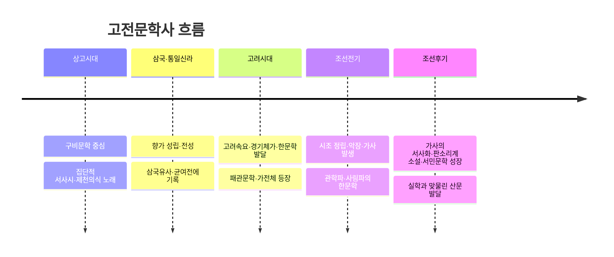

<Callout type="info">
  **이번 문서의 목표:** 고전문학의 주요 작가를 시대·작품·특징 중심으로 정리하고, 상고부터 조선 후기까지 고전문학사의 흐름을 하나의 시간 축 위에 놓아, 작가·작품·시대를 서로 연결해 묻는 대비형·연계형 문제에 대비한다.
</Callout>

## 왜 작가와 문학사 흐름을 한데 묶어 보는가

12~14편에서 갈래별로 흩어져 있던 향가·고려속요·시조·가사·고전 소설·한문학을 이번에는 **시간 축과 작가라는 두 개의 실로 다시 꿰어** 본다. 독학사 4단계는 "이 작가의 이 작품은 어느 시대, 어느 사조에 속하는가"처럼 갈래를 넘나드는 통합형 문제를 즐겨 낸다. 예를 들어 정철은 가사 작가이면서 동시에 시조도 남겼고, 김시습은 한문 소설가이면서 생육신(生六臣)이라는 정치적 위치와도 연결된다. 작가 한 명을 입체적으로 알아야 이런 통합 문제에 대응할 수 있다.

> **쉽게 말하면:** 지금까지 갈래별로 세로로 쌓았다면, 이번 편은 그 갈래들을 시대와 작가라는 가로줄로 다시 엮는 작업이다.

## 고전문학사의 시대 구분 다시 보기

04편에서 정리한 시대 구분을 고전문학에 한정해 다시 확인하면 다음과 같다.

### 왜 조선 전기와 후기를 나누어 보는가

조선 전기는 사대부 중심의 훈민정음 창제 직후 시기로, 시조가 정형화되고 관념적·풍류적 가사가 등장한 때다. 반면 조선 후기는 임진왜란·병자호란 이후 신분 질서가 흔들리고 실학(實學, 현실 문제 해결을 중시한 학풍)이 대두하면서, 서민층이 향유하는 판소리계 소설과 사설시조처럼 형식이 느슨해지고 현실적인 내용을 담은 갈래가 성장한 시기다. 이 전환을 알면 "이 작품은 조선 전기인가 후기인가"를 묻는 문제에서 형식의 정형성·내용의 관념성 대 현실성을 기준으로 판단할 수 있다.

## 주요 작가별 정리

### 김시습(金時習)

| 항목 | 내용 |
|---|---|
| 시대 | 조선 전기(15세기) |
| 정치적 위치 | 생육신의 한 사람으로, 세조의 왕위 찬탈에 반발해 벼슬을 버리고 방랑함 |
| 대표작 | 금오신화(한문 전기소설집으로 논의되는 우리나라 최초의 한문 소설) |
| 문학사적 의의 | 방외인(方外人, 체제 바깥에서 자유롭게 살아간 지식인) 문학의 대표자로, 개인의 내면과 기이한 세계를 다룬 전기소설 양식을 개척했다고 평가됨 |

### 허난설헌(許蘭雪軒)

| 항목 | 내용 |
|---|---|
| 시대 | 조선 전기(16세기) |
| 특징 | 여성 한문학 작가로, 규방(閨房, 여성이 거처하던 방) 안에 갇힌 여성의 삶과 재능이 사회적으로 제약받는 현실을 한시와 규원가 계열 작품(작가로 전해짐)으로 형상화했다고 논의됨 |
| 문학사적 의의 | 여성의 목소리로 당대 여성의 처지를 드러낸 작가로, 조선 시대 여성 문학을 이야기할 때 대표적으로 언급됨 |

### 박지원(朴趾源)

| 항목 | 내용 |
|---|---|
| 시대 | 조선 후기(18세기), 실학자 |
| 특징 | 청나라 문물을 접하고 돌아와 지은 기행문 성격의 한문 산문(열하일기 계열)과, 양반 사회를 풍자하는 한문 단편(허생전·양반전 계열)을 남긴 것으로 논의됨 |
| 문학사적 의의 | 실학적 문제의식을 바탕으로 양반 사회의 허위와 무능을 풍자한 대표적 산문 작가로 평가됨 |

### 정철(鄭澈)

| 항목 | 내용 |
|---|---|
| 시대 | 조선 전기(16세기) |
| 특징 | 가사(사미인곡·관동별곡 계열)와 시조를 함께 남긴 사대부 작가 |
| 문학사적 의의 | 여성 화자에 의탁한 연군지정의 가사 전통을 확립했다고 평가되며, 가사 문학의 대표 작가로 다뤄짐 |

### 그 외 대비해 알아 둘 작가

| 작가 | 갈래 | 특징 |
|---|---|---|
| 윤선도 | 시조 | 자연 속 은거와 안빈낙도를 노래한 강호가도 계열 시조를 대표함 |
| 황진이 | 시조 | 기녀 신분으로 임에 대한 그리움을 섬세한 정서와 뛰어난 비유로 표현한 것으로 평가됨 |
| 월명사·충담사 | 향가 | 신라 승려·화랑 계열의 향가 작가로 각각 제망매가·찬기파랑가와 연결됨 |

## 대비·연계 문제에 대비하는 정리 방식

독학사 4단계는 두 작가나 두 작품을 나란히 놓고 공통점·차이점을 묻는 문제를 자주 낸다. 이런 문제에 대비하려면 작가를 개별적으로 외우기보다 아래처럼 **비교 축**을 세워 정리하는 것이 효율적이다.

| 비교 축 | 대비 예시 |
|---|---|
| 시대(전기 대 후기) | 정철(조선 전기, 관념적·풍류적 가사) 대 박지원(조선 후기, 현실 비판적 산문) |
| 신분(사대부 대 여성·평민) | 정철·윤선도(사대부) 대 허난설헌(여성), 판소리계 소설의 서민 향유층 |
| 갈래(운문 대 산문) | 정철·윤선도(시조·가사 중심) 대 김시습·박지원(한문 산문 중심) |
| 정치적 태도(참여 대 은거·방외) | 사대부의 강호가도(윤선도) 대 김시습의 방외인적 방랑 |

이렇게 비교 축을 세워 두면, "다음 두 작가의 공통점으로 옳은 것은?" 같은 문제에서 어느 축을 기준으로 답을 골라야 하는지 빠르게 판단할 수 있다.

## 자주 틀리는 점

- 김시습을 소설가로만 기억하고 생육신이라는 정치적 위치, 방외인 문학이라는 문학사적 평가를 놓치는 경우가 많다.
- 정철을 가사 작가로만 기억해 그가 시조도 남겼다는 사실을 놓쳐, 갈래를 넘나드는 통합 문제에서 오답을 고르기 쉽다.
- 허난설헌의 작품을 실제 확정된 원문으로 단정하기 쉬우나, 작가 귀속에는 이견이 있는 작품도 있으므로 "~로 전해진다", "~로 논의된다"는 서술의 신중함을 함께 기억해야 한다.
- 조선 전기와 후기의 구분을 단순히 연도로만 암기하고, 신분 질서 변화·실학 대두라는 배경적 이유를 놓치는 경우가 있다.

## 핵심 정리

- 고전문학사는 상고시대의 구비문학에서 시작해 향가(삼국·통일신라) - 고려속요·한문학(고려) - 시조·가사의 정립(조선 전기) - 서민문학의 성장(조선 후기) 순으로 흐른다.
- 김시습은 방외인 문학의 대표자로 최초의 한문 소설(금오신화)을, 박지원은 실학적 문제의식을 담은 풍자 산문을 남겼다.
- 허난설헌은 여성 한문학 작가로 여성의 처지를 형상화했고, 정철은 가사와 시조를 함께 남긴 조선 전기의 대표 작가다.
- 작가·작품 통합 문제는 시대, 신분, 갈래, 정치적 태도 등 비교 축을 세워 정리해 두면 대비할 수 있다.

## 마무리 복습

<Quiz
  questionNumber={1}
  question="김시습에 대한 설명으로 가장 적절한 것은?"
  options={['조선 후기의 실학자로 열하일기를 남겼다', '생육신의 한 사람으로 최초의 한문 소설로 논의되는 금오신화를 남겼다', '여성 한문학 작가로 규방 여성의 삶을 형상화했다', '기녀 신분으로 임에 대한 그리움을 노래한 시조를 남겼다']}
  correctAnswer={2}
  explanation="김시습은 세조의 왕위 찬탈에 반발한 생육신의 한 사람으로, 우리나라 최초의 한문 소설로 논의되는 금오신화를 남겼다."
  optionExplanations={['실학자로 열하일기를 남긴 인물은 박지원이다', '정답이다', '여성 한문학 작가는 허난설헌이다', '기녀 시조 작가는 황진이다']}
/>

<Quiz
  questionNumber={2}
  question="박지원의 문학사적 의의로 가장 적절한 것은?"
  options={['향가를 창작해 신라 문학을 대표했다', '가사와 시조를 함께 남긴 조선 전기의 사대부 작가다', '실학적 문제의식을 바탕으로 양반 사회를 풍자하는 한문 산문을 남겼다', '판소리를 처음으로 소설로 정착시켰다']}
  correctAnswer={3}
  explanation="박지원은 조선 후기의 실학자로, 청나라 문물 견문과 양반 사회에 대한 풍자를 담은 한문 산문을 남긴 것으로 논의된다."
  optionExplanations={['향가 창작은 신라 시대 월명사·충담사 등의 작가와 관련된다', '가사와 시조를 함께 남긴 것은 정철에 대한 설명이다', '정답이다', '판소리계 소설은 특정 개인이 처음 정착시켰다고 단정하기 어려운 구비 전승의 산물이다']}
/>

<Quiz
  questionNumber={3}
  question="조선 전기와 조선 후기 고전문학의 경향 차이에 대한 설명으로 가장 적절한 것은?"
  options={['전기는 서민문학이 중심이고 후기는 사대부 문학이 중심이다', '전기는 관념적·풍류적 성격이 강하고 후기는 현실 비판적·서민적 성격이 강해졌다', '전기와 후기는 문학사적으로 아무런 차이가 없다', '전기에만 한문학이 존재하고 후기에는 한문학이 사라졌다']}
  correctAnswer={2}
  explanation="조선 전기는 사대부 중심의 관념적·풍류적 문학이 주를 이룬 반면, 조선 후기는 신분 질서의 변화와 실학의 대두 속에서 현실 비판적이고 서민적인 문학이 성장했다."
  optionExplanations={['서민문학이 중심이 된 것은 후기의 경향이다', '정답이다', '전기와 후기는 뚜렷한 경향 차이를 보인다', '한문학은 조선 후기에도 박지원 등을 통해 이어졌다']}
/>

<Quiz
  questionNumber={4}
  question="정철에 대한 설명으로 옳지 않은 것은?"
  options={['사미인곡·관동별곡 등의 가사를 남겼다', '여성 화자에 의탁한 연군지정의 가사 전통을 확립했다고 평가된다', '시조는 전혀 남기지 않고 가사만 창작했다', '조선 전기의 사대부 작가다']}
  correctAnswer={3}
  explanation="정철은 가사뿐 아니라 시조도 함께 남긴 작가로, 시조는 전혀 남기지 않았다는 설명은 옳지 않다."
  optionExplanations={['옳은 설명이므로 정답이 아니다', '옳은 설명이므로 정답이 아니다', '정철이 시조도 남겼다는 사실을 부정한 설명이 정답이다', '옳은 설명이므로 정답이 아니다']}
/>

<Quiz
  questionNumber={5}
  question="고전문학사의 시대 순서로 가장 적절한 것은?"
  options={['조선 후기 - 조선 전기 - 고려시대 - 삼국시대', '삼국시대(향가 성립) - 고려시대(고려속요·한문학) - 조선 전기(시조 정립) - 조선 후기(서민문학 성장)', '고려시대 - 삼국시대 - 조선 후기 - 조선 전기', '조선 전기 - 삼국시대 - 조선 후기 - 고려시대']}
  correctAnswer={2}
  explanation="고전문학사는 삼국시대의 향가 성립을 시작으로 고려시대의 고려속요·한문학, 조선 전기의 시조 정립, 조선 후기의 서민문학 성장 순으로 흐른다."
  optionExplanations={['시대 순서가 거꾸로 배열되어 있다', '정답이다', '시대 순서가 뒤섞여 있다', '시대 순서가 뒤섞여 있다']}
/>

<Quiz
  questionNumber={6}
  question="허난설헌에 대한 설명으로 가장 적절한 것은?"
  options={['조선 후기의 실학자로 한문 단편을 남겼다', '여성 한문학 작가로 규방 여성의 삶과 재능의 제약을 형상화했다고 논의된다', '생육신의 한 사람으로 방외인 문학을 대표한다', '가사와 시조를 함께 남긴 조선 전기의 사대부 작가다']}
  correctAnswer={2}
  explanation="허난설헌은 조선 전기의 여성 한문학 작가로, 규방에 갇힌 여성의 삶과 재능이 사회적으로 제약받는 현실을 형상화한 것으로 논의된다."
  optionExplanations={['실학자로 한문 단편을 남긴 인물은 박지원이다', '정답이다', '생육신이자 방외인 문학의 대표자는 김시습이다', '가사와 시조를 함께 남긴 인물은 정철이다']}
/>

<Quiz
  questionNumber={7}
  question="고전문학의 작가·작품을 비교할 때 세울 수 있는 비교 축으로 가장 적절하지 않은 것은?"
  options={['시대(조선 전기 대 후기)', '신분(사대부 대 여성·평민)', '갈래(운문 대 산문)', '작품이 인쇄된 종이의 재질']}
  correctAnswer={4}
  explanation="작가·작품 비교에 유의미한 축은 시대, 신분, 갈래, 정치적 태도 등이며, 인쇄된 종이의 재질은 문학사적 비교 기준으로 다루어지지 않는다."
  optionExplanations={['시대는 유의미한 비교 축이므로 정답이 아니다', '신분은 유의미한 비교 축이므로 정답이 아니다', '갈래는 유의미한 비교 축이므로 정답이 아니다', '문학사적으로 다루어지지 않는 기준이므로 정답이다']}
/>

## 참고 자료

- [한국민족문화대백과사전](https://encykorea.aks.ac.kr)
- [한국고전종합DB](https://db.itkc.or.kr)
