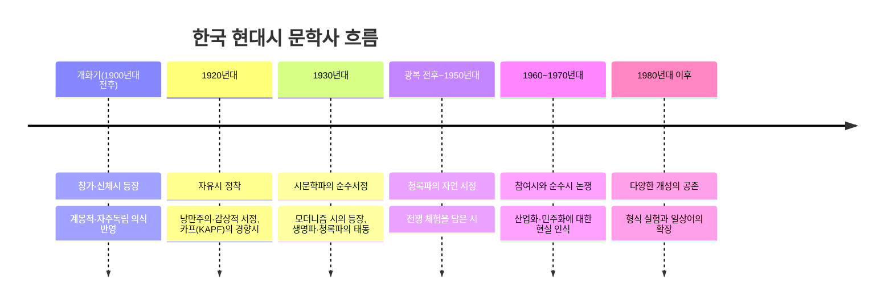

<Callout type="info">
  **이번 문서의 목표:** 개화기부터 현대까지 한국 현대시가 거쳐 온 사조(思潮, 한 시대를 관통하는 사상·문예의 흐름)의 흐름을 시간 축 위에 정리하고, 각 사조의 대표 시인과 작품의 주제·형식적 특징을 연결해 문학사 흐름형 문제에 대비한다.
</Callout>

## 왜 시를 사조의 흐름으로 읽어야 하는가

한 편의 시를 독립적으로 분석하는 것과, 그 시가 어느 사조·시대에 속하는지 아는 것은 다른 능력이다. 독학사 4단계는 "이 시는 어느 시기의 경향을 반영하는가", "다음 중 모더니즘 계열 시인이 아닌 사람은?"처럼 **시를 시대·사조라는 좌표 위에 놓는 문제**를 즐겨 낸다. 개별 시인을 낱낱이 외우기 전에, 먼저 큰 흐름의 지도를 그려 두면 개별 시인의 위치를 훨씬 쉽게 기억할 수 있다.

> **쉽게 말하면:** 시인 한 명 한 명을 따로 외우기보다, 먼저 시대라는 지도를 펼쳐 놓고 그 위에 시인의 이름을 하나씩 꽂아 넣는 방식이 더 오래 기억된다.

## 현대시 문학사의 큰 흐름

## 사조별 정리

### 개화기 시가: 창가와 신체시

개화기(19세기 말~1910년대)는 서구 문물의 유입과 함께 전통 시가에서 현대시로 넘어가는 과도기다. 이 시기의 대표적 갈래는 창가(唱歌, 서양식 곡조에 맞춰 부르던 노래 형식의 시)와 신체시(新體詩, 정형시의 율격에서 부분적으로 벗어나기 시작한 과도기적 시)다.

> **쉽게 말하면:** 개화기 시가는 옛 노래(시조·가사)와 오늘날의 자유시 사이에 다리를 놓는 과도기적 형태다.

신체시는 최남선의 "해에게서 소년에게"가 대표작으로 흔히 언급되며, 완전한 자유시는 아니지만 기존 정형률에서 벗어나려는 시도를 보였다는 점에서 문학사적 의의를 지닌다.

### 1920년대: 자유시의 정착과 경향시

1920년대에 들어 정형률에서 완전히 벗어난 **자유시**(自由詩)가 정착한다. 이 시기는 크게 두 흐름으로 나뉜다.

| 흐름 | 특징 | 대표적으로 언급되는 시인 |
|---|---|---|
| 낭만주의·감상적 서정 | 개인의 정서, 특히 슬픔·그리움 등 감상적 정조를 자유로운 형식으로 표현 | 김소월(전통적 정한의 정서를 민요조 리듬으로 표현한 시인으로 평가됨) |
| 경향시(카프, KAPF 계열) | 카프(조선프롤레타리아예술가동맹)를 중심으로 계급 의식과 사회 현실 비판을 담음 | 임화 등 카프 계열 시인들이 대표적으로 언급됨 |

두 흐름은 "시가 개인의 정서를 노래해야 하는가, 사회 현실을 반영해야 하는가"라는 이후 순수문학 대 참여문학 논쟁의 원형을 이미 보여 준다는 점에서 함께 기억해 두면 좋다.

### 1930년대: 시문학파와 모더니즘, 생명파

1930년대는 한국 현대시가 다양한 방향으로 분화한 시기다.

| 흐름 | 특징 | 대표적으로 언급되는 시인 |
|---|---|---|
| 시문학파 | 순수서정(純粹抒情, 이념·교훈보다 언어와 정서 그 자체의 아름다움을 추구)을 지향하며 세련된 언어 조탁(彫琢, 문장을 갈고 다듬음)을 중시 | 시문학 동인 계열 시인들 |
| 모더니즘 시 | 도시적 감수성, 이미지 중심의 회화적(繪畫的) 표현, 지적이고 실험적인 형식을 추구 | 도시 문명과 이미지즘의 영향을 받은 계열로 논의됨 |
| 생명파 | 인간의 생명력, 원초적 욕망과 고뇌를 강렬한 어조로 표현 | 인간 존재의 근원적 문제에 천착한 계열로 논의됨 |

세 흐름은 "무엇을 중시하는가"로 구분하면 헷갈리지 않는다. 시문학파는 언어의 세련미, 모더니즘은 이미지와 감각, 생명파는 원초적 생명력을 각각 중심에 둔다.

### 광복 전후~1950년대: 청록파와 전쟁 체험

광복 직후 등장한 **청록파**(靑鹿派)는 자연을 소재로 전통적 서정과 운율을 계승하며 순수서정의 흐름을 이어 갔다고 평가된다. 이어지는 6·25 전쟁은 시단에 전쟁의 참상과 상실감, 실존적 고뇌를 다루는 시들을 낳았다.

### 1960~1970년대: 참여시와 순수시 논쟁

산업화와 정치적 격변 속에서 시가 사회 현실에 얼마나 적극적으로 발언해야 하는가를 둘러싼 **참여시 대 순수시 논쟁**이 본격화된다.

| 입장 | 핵심 주장 |
|---|---|
| 참여시 | 시는 현실 문제(독재·산업화의 그늘 등)에 적극적으로 발언하고 저항해야 한다는 입장 |
| 순수시 | 시는 정치적 발언 도구가 아니라 언어 예술 그 자체로서의 완성도를 추구해야 한다는 입장 |

이 논쟁은 1920년대의 경향시 대 낭만주의 서정시 구도가 시대를 바꾸어 반복된 것으로 이해하면 두 시기를 서로 연결해 기억할 수 있다.

### 1980년대 이후: 다양성의 공존

1980년대 이후로는 특정 사조가 시단 전체를 지배하기보다, 형식 실험·일상어의 시적 수용·다양한 개성의 공존이 두드러진다는 것이 일반적인 평가다. 이 시기는 하나의 흐름으로 요약하기보다 "특정 사조의 지배력이 약화되고 개별 시인의 개성이 부각된 시기"로 이해하는 것이 시험 대비에 유용하다.

## 사조 판별 문제에 대비하는 정리 방식

<Steps>

### 1. 시기 확인하기

작품이나 시인이 언급된 시기가 개화기·1920년대·1930년대·광복 전후~1950년대·1960~1970년대·1980년대 이후 중 어디인지 먼저 확인한다.

### 2. 무엇을 중시하는지 확인하기

같은 시기라도 사조에 따라 언어의 세련미(시문학파), 이미지와 감각(모더니즘), 원초적 생명력(생명파), 사회 현실 비판(경향시·참여시) 중 무엇을 중시하는지가 다르다.

### 3. 대비되는 사조와 짝지어 기억하기

경향시 대 낭만주의 서정시, 참여시 대 순수시처럼 **대립하는 두 입장**을 짝지어 기억하면, "다음 중 순수시 계열에 해당하지 않는 것은?" 같은 배제형 문제에 유리하다.

</Steps>

## 자주 틀리는 점

- 신체시를 자유시와 동일한 것으로 오해하기 쉽다. 신체시는 정형률에서 부분적으로 벗어난 과도기적 형태이고, 완전한 자유시는 1920년대에 정착했다고 보는 것이 일반적이다.
- 모더니즘 시를 단순히 "어려운 시"로 오해하는 경우가 있다. 모더니즘은 도시적 감수성과 이미지 중심의 회화적 표현을 지향한다는 구체적 특징으로 이해해야 한다.
- 참여시 대 순수시 논쟁을 1980년대 이후의 일로 착각하기 쉬우나, 이 논쟁의 본격적 전개는 1960~1970년대로 다뤄진다.
- 청록파를 모더니즘 계열로 혼동하는 경우가 있다. 청록파는 자연을 소재로 한 전통적 서정 계승 쪽에 가깝다고 평가된다.

## 핵심 정리

- 한국 현대시는 개화기의 창가·신체시에서 시작해, 1920년대 자유시의 정착(낭만적 서정 대 경향시), 1930년대의 시문학파·모더니즘·생명파의 분화, 광복 전후 청록파의 자연 서정, 1960~1970년대 참여시 대 순수시 논쟁, 1980년대 이후 개성의 공존 순으로 흐른다.
- 사조를 판별할 때는 시기와 함께 "무엇을 중시하는가"(언어의 세련미, 이미지, 생명력, 사회 현실 비판 등)를 함께 확인해야 한다.
- 경향시 대 낭만적 서정시, 참여시 대 순수시처럼 대립하는 사조를 짝지어 기억하면 배제형 문제에 유리하다.

## 마무리 복습

<Quiz
  questionNumber={1}
  question="개화기 신체시에 대한 설명으로 가장 적절한 것은?"
  options={['완전한 자유시로 정형률의 제약이 전혀 없다', '정형시의 율격에서 부분적으로 벗어나기 시작한 과도기적 시 형태다', '카프를 중심으로 계급 의식을 담은 시다', '자연을 소재로 전통적 서정을 계승한 시다']}
  correctAnswer={2}
  explanation="신체시는 개화기에 등장한 과도기적 시 형태로, 기존 정형시의 율격에서 부분적으로 벗어나기 시작했지만 완전한 자유시에는 이르지 않은 단계로 평가된다."
  optionExplanations={['완전한 자유시 정착은 1920년대의 일로 평가된다', '정답이다', '카프 계열 계급 의식은 1920년대 경향시의 특징이다', '자연을 소재로 한 전통적 서정 계승은 청록파의 특징이다']}
/>

<Quiz
  questionNumber={2}
  question="1920년대 카프(KAPF) 계열 경향시의 특징으로 가장 적절한 것은?"
  options={['도시적 감수성과 이미지 중심의 회화적 표현을 추구한다', '계급 의식과 사회 현실 비판을 담은 시를 지향한다', '자연을 소재로 전통적 서정과 운율을 계승한다', '언어의 세련미와 정서적 조탁을 최우선으로 한다']}
  correctAnswer={2}
  explanation="카프 계열의 경향시는 계급 의식과 사회 현실에 대한 비판을 담아내는 것을 지향한 시 흐름으로 논의된다."
  optionExplanations={['도시적 감수성과 이미지 중심 표현은 모더니즘 시의 특징이다', '정답이다', '자연을 소재로 한 전통 서정 계승은 청록파의 특징이다', '언어의 세련미를 중시하는 것은 시문학파의 특징이다']}
/>

<Quiz
  questionNumber={3}
  question="1930년대 시문학파·모더니즘·생명파를 구분하는 기준으로 가장 적절한 것은?"
  options={['활동한 지역이 서로 다르다는 점', '무엇을 시에서 가장 중요하게 다루는가(언어의 세련미, 이미지, 생명력)라는 점', '한글로 썼는지 한자로 썼는지의 표기 문자', '시의 길이가 길고 짧은가의 형식']}
  correctAnswer={2}
  explanation="시문학파는 언어의 세련미, 모더니즘은 이미지와 감각, 생명파는 원초적 생명력을 각각 중심에 둔다는 점에서 세 흐름이 구분된다."
  optionExplanations={['활동 지역 자체가 구분의 핵심 기준으로 다뤄지지 않는다', '정답이다', '세 흐름 모두 한글 시를 기본으로 하므로 표기 문자는 구분 기준이 아니다', '시의 길이는 사조를 구분하는 기준이 아니다']}
/>

<Quiz
  questionNumber={4}
  question="청록파에 대한 설명으로 가장 적절한 것은?"
  options={['도시 문명과 이미지즘의 영향을 받은 모더니즘 계열이다', '카프를 중심으로 계급 의식을 담은 경향시 계열이다', '자연을 소재로 전통적 서정과 운율을 계승한 순수서정 계열로 평가된다', '산업화의 그늘을 고발하는 참여시 계열이다']}
  correctAnswer={3}
  explanation="청록파는 광복 전후 등장해 자연을 소재로 전통적 서정과 운율을 계승했다고 평가되는 순수서정 계열의 흐름이다."
  optionExplanations={['모더니즘 계열은 청록파와 구분되는 다른 흐름이다', '경향시는 1920년대 카프 계열의 흐름이다', '정답이다', '참여시는 1960~1970년대에 본격화된 흐름이다']}
/>

<Quiz
  questionNumber={5}
  question="1960~1970년대 참여시와 순수시 논쟁에 대한 설명으로 옳지 않은 것은?"
  options={['참여시는 시가 사회 현실에 적극적으로 발언해야 한다고 본다', '순수시는 시를 언어 예술 그 자체로서의 완성도로 본다', '이 논쟁은 1920년대의 경향시 대 낭만적 서정시 구도와 무관하게 갑자기 등장했다', '산업화·정치적 격변이라는 시대적 배경과 맞물려 전개되었다']}
  correctAnswer={3}
  explanation="참여시 대 순수시 논쟁은 1920년대의 경향시 대 낭만적 서정시 구도가 시대를 바꾸어 반복된 것으로 이해되므로, 무관하게 갑자기 등장했다는 설명은 옳지 않다."
  optionExplanations={['옳은 설명이므로 정답이 아니다', '옳은 설명이므로 정답이 아니다', '두 시기의 구도는 서로 연결해 이해할 수 있으므로 이 설명이 정답이다', '옳은 설명이므로 정답이 아니다']}
/>

<Quiz
  questionNumber={6}
  question="김소월의 시 세계에 대한 설명으로 가장 적절한 것은?"
  options={['도시적 감수성과 실험적 형식을 추구한 모더니즘 시인으로 평가된다', '전통적 정한의 정서를 민요조 리듬으로 표현한 시인으로 평가된다', '카프를 중심으로 계급 의식을 담은 경향시를 대표한다', '자연을 소재로 한 청록파의 대표 시인이다']}
  correctAnswer={2}
  explanation="김소월은 1920년대 낭만주의·감상적 서정의 흐름 속에서 전통적 정한의 정서를 민요조 리듬으로 표현한 시인으로 평가된다."
  optionExplanations={['모더니즘 계열에 대한 설명이다', '정답이다', '경향시를 대표하는 것은 카프 계열 시인들이다', '청록파는 광복 전후에 등장한 다른 흐름이다']}
/>

<Quiz
  questionNumber={7}
  question="1980년대 이후 한국 현대시의 경향을 요약한 설명으로 가장 적절한 것은?"
  options={['특정 사조가 시단 전체를 완전히 지배하며 통일된 경향을 보인다', '특정 사조의 지배력이 약화되고 형식 실험과 개별 시인의 개성이 부각되었다', '정형률로 완전히 회귀해 자유시가 사라졌다', '카프 계열의 경향시가 다시 시단의 중심이 되었다']}
  correctAnswer={2}
  explanation="1980년대 이후는 특정 사조의 지배력이 약화되고, 형식 실험과 일상어의 시적 수용, 개별 시인의 개성이 부각된 시기로 평가된다."
  optionExplanations={['특정 사조가 전체를 지배했다는 설명은 이 시기의 경향과 어긋난다', '정답이다', '정형률 회귀는 이 시기의 일반적 경향이 아니다', '카프 계열의 부활은 이 시기의 경향으로 다뤄지지 않는다']}
/>

## 참고 자료

- [한국민족문화대백과사전](https://encykorea.aks.ac.kr)
- [표준국어대사전](https://stdict.korean.go.kr)
