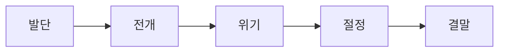

<Callout type="info">
  **이번 문서의 목표:** 소설의 다섯 단계 서사 구조와 인물·갈등·배경의 관계를 이해하고, 네 가지 시점을 정확히 구분하며, 지문에서 서사 요소를 찾아내는 실전 풀이 전략을 세운다.
</Callout>

## 서사 구조의 다섯 단계

소설은 사건을 시간의 흐름이 아니라 **인과 관계**로 재구성해 전달한다(03편에서 다룬 플롯의 정의). 이 재구성된 사건은 대개 다음 다섯 단계로 진행된다.

| 단계 | 정의 | 특징 |
|---|---|---|
| 발단(發端) | 인물과 배경이 소개되고 사건의 실마리가 제시되는 단계 | 갈등의 씨앗이 심어진다 |
| 전개(展開) | 사건이 본격적으로 진행되며 갈등이 구체화되는 단계 | 인물 간 대립이 뚜렷해진다 |
| 위기(危機) | 갈등이 심화되고 긴장이 고조되는 단계 | 사건 해결의 실마리와 걸림돌이 동시에 나타난다 |
| 절정(絶頂) | 갈등이 최고조에 이르러 해결의 전환점이 나타나는 단계 | 사건의 결정적 국면이 드러난다 |
| 결말(結末) | 갈등이 해소되고 사건이 마무리되는 단계 | 인물의 운명이 확정된다 |

> **쉽게 말하면:** 발단은 "이야기가 시작되는 곳", 전개는 "갈등이 커지는 곳", 위기는 "긴장이 최고로 팽팽해지기 직전", 절정은 "가장 극적인 순간", 결말은 "이야기가 정리되는 곳"이다.

### 짧은 예시로 확인하기 (새로 작성)

다음은 이 문서를 위해 새로 지은 짧은 이야기의 줄거리 요약이다.

<Steps>

### 발단

시골 정미소를 물려받은 청년 "동수"가 오래된 기계를 손보며 마을 사람들과 서먹하게 지내는 모습이 그려진다.

### 전개

정미소 운영권을 두고 이웃 마을의 대형 도정 공장과 경쟁이 시작되고, 동수는 낮은 가격 경쟁에서 밀리기 시작한다.

### 위기

동수의 유일한 단골이던 노인이 대형 공장으로 거래처를 옮기려 하면서, 동수는 정미소를 포기할지 말지 갈등한다.

### 절정

폭우로 마을 도로가 끊긴 밤, 동수가 위험을 무릅쓰고 노인의 볍씨를 직접 옮겨 지켜 주면서 신뢰가 회복된다.

### 결말

마을 사람들이 다시 동수의 정미소를 찾기 시작하고, 동수는 기계 옆에서 처음으로 마음 편히 웃는다.

</Steps>

이 요약에서 보듯, 다섯 단계는 항상 균등한 분량으로 나뉘는 것이 아니라 작품에 따라 특정 단계(위 예시에서는 절정)에 서사의 무게가 집중될 수 있다.

## 인물·갈등·배경

### 인물

**인물**(人物, Character)은 역할에 따라 나뉜다.

| 구분 기준 | 유형 | 설명 |
|---|---|---|
| 역할 | 주동 인물 | 사건을 이끌어 가는 중심인물(위 예시의 동수) |
| 역할 | 반동 인물 | 주동 인물과 대립하는 인물(위 예시의 대형 공장 측) |
| 성격 변화 | 평면적 인물 | 이야기 내내 성격이 변하지 않는 인물 |
| 성격 변화 | 입체적 인물 | 사건을 거치며 성격이나 가치관이 변화하는 인물(위 예시의 동수) |

평면적 인물과 입체적 인물의 구분은 시험에서 자주 나오는데, 판별 기준은 **처음의 성격·가치관과 결말의 성격·가치관을 비교했을 때 변화가 있는가**이다. 위 예시의 동수는 마을과 서먹했던 처음 태도에서, 노인을 지키며 마을과 관계를 회복하는 결말로 변화했으므로 입체적 인물이다.

### 갈등

**갈등**(葛藤, Conflict)은 서사를 이끄는 동력으로, 대립의 위치에 따라 나뉜다.

| 갈등 종류 | 설명 |
|---|---|
| 내적 갈등 | 한 인물의 내면에서 일어나는 심리적 대립(위 예시에서 동수가 포기할지 말지 고민하는 부분) |
| 외적 갈등 - 인물과 인물 | 서로 다른 인물 사이의 대립(동수와 대형 공장 운영자) |
| 외적 갈등 - 인물과 사회 | 인물이 사회 구조·제도와 부딪히는 대립(영세 정미소가 대형 자본과 경쟁) |
| 외적 갈등 - 인물과 자연 | 인물이 자연 현상과 부딪히는 대립(폭우로 도로가 끊긴 상황) |

한 작품 안에 여러 갈등이 동시에 존재하는 경우가 많으므로, "이 작품의 갈등 양상으로 가장 적절한 것은?" 유형에서는 지문에 실제로 등장하는 대립 관계를 모두 확인한 뒤 선지와 대조해야 한다.

### 배경

**배경**(背景, Setting)은 사건이 일어나는 시간·공간·사회적 상황을 가리키며, 단순한 무대 장치를 넘어 갈등의 원인이나 분위기 조성에 직접 관여하는 경우가 많다. 위 예시에서 "폭우로 도로가 끊긴 밤"이라는 시대·공간적 배경은 절정부의 갈등 해소 방식(위험을 무릅쓴 행동)을 가능하게 만드는 서사 장치로 기능한다.

## 시점과 서술 방식

**시점**(視點, Point of View)은 03편에서 정의했듯 서술자가 이야기를 바라보고 전달하는 위치와 방식이다. 시점은 **서술자가 작품 안에 있는가**와 **서술자가 인물의 내면까지 아는가**라는 두 기준의 조합으로 네 가지로 나뉜다.

| 시점 | 서술자의 위치 | 내면 서술 | 특징 |
|---|---|---|---|
| 1인칭 주인공 시점 | 작품 안(주인공 "나") | 자신의 내면만 서술 | 주인공의 심리를 생생하게 전달하지만 다른 인물의 내면은 알 수 없다 |
| 1인칭 관찰자 시점 | 작품 안(주변 인물 "나") | 관찰 대상의 내면은 알 수 없음 | 주인공을 곁에서 지켜보는 서술로, 독자의 궁금증을 유발한다 |
| 3인칭 관찰자 시점 | 작품 밖 | 어떤 인물의 내면도 서술하지 않음 | 인물의 행동과 대화만으로 사건을 전달, 객관적 거리감이 크다 |
| 전지적 작가 시점 | 작품 밖 | 모든 인물의 내면을 서술 | 서술자가 신처럼 모든 것을 알고 개입해 설명할 수 있다 |

> **쉽게 말하면:** 서술자가 이야기 속 "나"인지 아닌지가 1차 기준이고, 인물의 속마음까지 들여다볼 수 있는지가 2차 기준이다.

위 예시 이야기를 "동수"의 시선에서 "나는 정미소 문을 열며 오늘도 아무도 오지 않으리라 생각했다"처럼 서술하면 1인칭 주인공 시점이 되고, "동수는 정미소 문을 열며 오늘도 아무도 오지 않으리라 생각했다. 한편 마을 노인은 이미 대형 공장에 볍씨를 맡기기로 마음을 굳히고 있었다"처럼 두 인물의 내면을 모두 드러내면 전지적 작가 시점이 된다.

### 자주 틀리는 점 (시점)

- 1인칭 관찰자 시점을 전지적 작가 시점과 혼동하기 쉽다. 1인칭 관찰자는 "나"가 존재하며 관찰 대상의 내면은 추측만 할 뿐 확정적으로 서술하지 못한다.
- 3인칭이라고 해서 무조건 전지적 시점은 아니다. 서술자가 작품 밖에 있어도 인물의 내면을 전혀 서술하지 않으면 3인칭 관찰자 시점이다.

## 서사 분석 문제 풀이 전략

독학사 4단계 현대소설 지문 문제는 대개 다음 순서로 접근하면 효율적이다.

<Steps>

### 1. 시점을 먼저 확정한다

서술자가 "나"로 등장하는지, 인물의 내면이 어디까지 서술되는지를 확인해 네 시점 중 하나로 확정한다.

### 2. 갈등의 축을 찾는다

지문에서 대립하는 두 축(인물과 인물, 인물과 사회, 인물과 자연, 인물의 내면)을 찾아 표시한다.

### 3. 서사 단계를 확인한다

지문이 발단·전개·위기·절정·결말 중 어느 단계에 해당하는지 앞뒤 맥락으로 판단한다. 절정부는 갈등이 최고조에 이르는 사건이 직접 서술된다는 단서로 알아챌 수 있다.

### 4. 배경의 기능을 확인한다

배경이 단순 무대인지, 갈등이나 분위기 형성에 직접 관여하는지 지문 안에서 근거를 찾는다.

</Steps>

이 네 단계를 순서대로 적용하면 "윗글에 대한 설명으로 적절하지 않은 것은?"처럼 여러 서사 요소를 한꺼번에 묻는 통합형 문제에서도 각 선지를 어느 단계의 근거로 판단해야 하는지 빠르게 정리할 수 있다.

## 핵심 정리

- 소설의 서사 구조는 발단·전개·위기·절정·결말의 다섯 단계로 진행되며, 각 단계는 인과 관계로 재구성된 플롯 위에서 배열된다.
- 인물은 역할(주동·반동)과 성격 변화(평면적·입체적)로 구분하고, 갈등은 내적 갈등과 세 종류의 외적 갈등(인물-인물, 인물-사회, 인물-자연)으로 나뉜다.
- 배경은 단순한 무대가 아니라 갈등의 원인이나 분위기 형성에 직접 관여할 수 있다.
- 시점은 서술자의 작품 내외 위치와 내면 서술 범위라는 두 기준으로 1인칭 주인공, 1인칭 관찰자, 3인칭 관찰자, 전지적 작가 시점의 네 가지로 나뉜다.
- 서사 분석 문제는 시점 확정 → 갈등 축 파악 → 서사 단계 확인 → 배경 기능 확인의 순서로 접근한다.

## 마무리 복습

<Quiz
  questionNumber={1}
  question="소설의 서사 구조 다섯 단계 중 갈등이 최고조에 이르러 해결의 전환점이 나타나는 단계는?"
  options={['발단', '전개', '절정', '결말']}
  correctAnswer={3}
  explanation="절정은 갈등이 최고조에 이르러 사건의 결정적 국면과 해결의 전환점이 나타나는 단계다."
  optionExplanations={['발단은 인물과 배경이 소개되는 단계다', '전개는 갈등이 본격적으로 진행되는 단계다', '정답이다', '결말은 갈등이 해소되고 사건이 마무리되는 단계다']}
/>

<Quiz
  questionNumber={2}
  question="이야기를 거치며 성격이나 가치관이 변화하는 인물을 가리키는 용어는?"
  options={['평면적 인물', '입체적 인물', '반동 인물', '전형적 인물']}
  correctAnswer={2}
  explanation="입체적 인물은 사건을 거치며 성격이나 가치관이 변화하는 인물을 가리킨다."
  optionExplanations={['평면적 인물은 성격이 변하지 않는 인물이다', '정답이다', '반동 인물은 주동 인물과 대립하는 역할을 가리키는 용어로 성격 변화와는 다른 기준이다', '전형적 인물은 특정 부류를 대표하는 성격을 가진 인물을 가리키는 별도의 개념이다']}
/>

<Quiz
  questionNumber={3}
  question="다음 중 외적 갈등에 해당하지 않는 것은?"
  options={['인물과 인물 사이의 대립', '인물과 사회 구조 사이의 대립', '한 인물의 내면에서 일어나는 심리적 대립', '인물과 자연 현상 사이의 대립']}
  correctAnswer={3}
  explanation="한 인물의 내면에서 일어나는 심리적 대립은 내적 갈등이며, 외적 갈등이 아니다."
  optionExplanations={['외적 갈등에 해당하므로 정답이 아니다', '외적 갈등에 해당하므로 정답이 아니다', '이는 내적 갈등에 해당하므로 정답이다', '외적 갈등에 해당하므로 정답이 아니다']}
/>

<Quiz
  questionNumber={4}
  question="서술자가 작품 밖에 위치하면서 모든 인물의 내면을 서술할 수 있는 시점은?"
  options={['1인칭 주인공 시점', '1인칭 관찰자 시점', '3인칭 관찰자 시점', '전지적 작가 시점']}
  correctAnswer={4}
  explanation="전지적 작가 시점은 서술자가 작품 밖에 있으면서 모든 인물의 내면을 서술할 수 있는 시점이다."
  optionExplanations={['1인칭 주인공 시점은 서술자가 작품 안의 주인공이다', '1인칭 관찰자 시점은 서술자가 작품 안의 주변 인물이다', '3인칭 관찰자 시점은 인물의 내면을 서술하지 않는다', '정답이다']}
/>

<Quiz
  questionNumber={5}
  question="1인칭 관찰자 시점에 대한 설명으로 옳지 않은 것은?"
  options={['서술자는 작품 안에 나로 존재한다', '서술자는 관찰 대상 인물의 내면을 확정적으로 서술할 수 없다', '서술자는 모든 인물의 내면을 서술할 수 있다', '주인공을 곁에서 지켜보는 서술로 독자의 궁금증을 유발할 수 있다']}
  correctAnswer={3}
  explanation="모든 인물의 내면을 서술할 수 있는 것은 전지적 작가 시점의 특징이며, 1인칭 관찰자 시점은 관찰 대상의 내면을 확정적으로 서술하지 못하므로 이 설명은 옳지 않다."
  optionExplanations={['옳은 설명이므로 정답이 아니다', '옳은 설명이므로 정답이 아니다', '전지적 작가 시점의 특징이므로 이것이 정답이다', '옳은 설명이므로 정답이 아니다']}
/>

<Quiz
  questionNumber={6}
  question="소설 지문의 서사 분석 문제를 풀 때 가장 먼저 확인하는 것으로 가장 적절한 것은?"
  options={['작품의 출판 연도', '서술자의 시점', '작품에 등장하는 인물의 수', '지문의 총 글자 수']}
  correctAnswer={2}
  explanation="시점을 먼저 확정해야 이후 갈등 축, 서사 단계, 배경의 기능을 정확하게 판단할 수 있다."
  optionExplanations={['출판 연도는 서사 분석의 직접 근거가 아니다', '정답이다', '인물의 수는 분석의 출발점이 아니다', '글자 수는 서사 분석과 관련이 없다']}
/>

## 참고 자료

- [표준국어대사전](https://stdict.korean.go.kr)
- [국립국어원](https://www.korean.go.kr)
