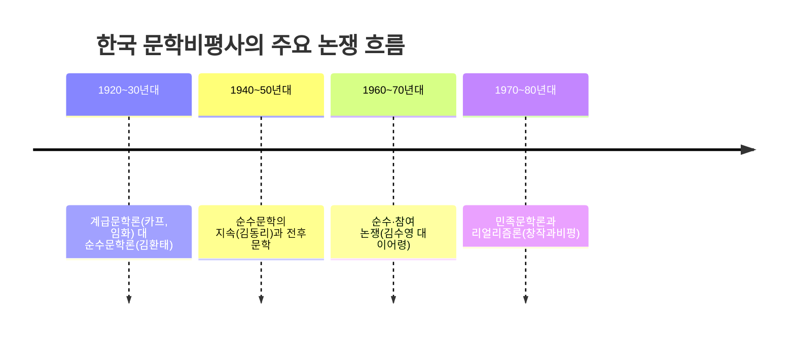

## 왜 한국 문학비평사를 논쟁 중심으로 봐야 하는가

19편에서 형식주의·구조주의·정신분석·마르크스주의 비평이라는 **일반 이론**을 다루었다면, 이 편은 그 이론들이 한국이라는 구체적 시공간에서 실제로 어떻게 **논쟁**으로 전개되었는지를 다룬다. 한국 문학비평사는 특정 이론 하나가 조용히 자리 잡은 역사가 아니라, 시대마다 문학이 무엇을 해야 하는가를 둘러싸고 벌어진 **입장 대립의 역사**에 가깝다.

## 1920~30년대: 계급문학론과 순수문학론의 대립

1920년대 중반, 식민지 조선의 문인들 사이에서 문학이 사회 변혁의 도구가 되어야 한다는 주장이 조직적으로 등장했다. 1925년 결성된 **조선프롤레타리아예술가동맹**(약칭 카프, KAPF)은 문학이 계급 모순을 드러내고 노동자·농민의 해방에 이바지해야 한다는 **계급문학론**을 내세웠다.

이에 맞서 문학의 자율적 가치, 즉 정치적 목적이 아니라 언어 예술 자체의 아름다움과 정서적 감동을 우선해야 한다는 **순수문학론**이 함께 제기되었다. 비평가 **김환태**(金煥泰)는 문학 작품을 이념의 도구가 아니라 그 자체로 느끼고 감상해야 할 대상으로 보는 **순수비평**의 입장을 대표한다.

이 대립 구도는 19편에서 다룬 마르크스주의 비평(반영론·이데올로기)과 형식주의 비평(텍스트 내부의 미적 가치)의 대립이 한국의 구체적 역사 속에서 재현된 사례로 이해할 수 있다.

## 1940~50년대: 순수문학의 지속과 전후 문학

해방과 한국전쟁을 거치며 이념 대립이 격화되는 가운데, 문학의 자율성을 옹호하는 순수문학의 흐름은 이어졌다. **김동리**(金東里)는 소설가이자 비평가로서, 문학이 특정 이념의 도구가 아니라 인간 존재의 근원적 문제를 다루어야 한다는 입장에서 순수문학을 옹호한 대표적 인물로 자주 언급된다.

## 1960~70년대: 순수·참여 논쟁

1960년대 후반, 문학이 현실 정치·사회 문제에 적극적으로 발언해야 하는가를 둘러싸고 **순수·참여 논쟁**이 다시 뜨겁게 벌어졌다. 시인 **김수영**(金洙暎)은 문학이 현실의 억압에 저항하고 정치적 발언을 감당해야 한다는 **참여문학**의 입장을 대표하며, 평론가 **이어령**(李御寧)은 문학의 자율적 언어 실험과 상상력을 강조하는 입장에서 이 논쟁에 참여한 것으로 널리 알려져 있다.

이 논쟁은 1920~30년대의 계급문학 대 순수문학 구도와 뼈대는 닮았지만, 초점이 달라졌다는 점이 시험에서 자주 다루어진다. 1920~30년대가 계급 혁명이라는 이념 자체를 문제 삼았다면, 1960~70년대는 냉전과 독재라는 시대의 구체적 현실에 문학이 얼마나 발언해야 하는가를 문제 삼았다.

## 1970~80년대: 민족문학론과 리얼리즘론

산업화와 민주화 운동이 이어지던 1970~80년대에는, 문학이 분단과 민중의 삶이라는 민족적 현실을 담아내야 한다는 **민족문학론**이 폭넓게 논의되었다. 이 흐름에서 문학이 현실을 정확하고 총체적으로 그려내야 한다는 **리얼리즘론**이 함께 강조되었으며, 계간지 『창작과비평』을 중심으로 한 비평 활동이 이 흐름의 대표적 거점으로 자주 언급된다.

## 논쟁 구도 비교표

| 시기 | 논쟁 | 한쪽 입장 | 다른 쪽 입장 | 대표 인물(예시) |
|---|---|---|---|---|
| 1920–30년대 | 계급문학 대 순수문학 | 문학은 계급 해방의 도구다 | 문학은 자율적 미적 가치를 지닌다 | 임화 / 김환태 |
| 1960–70년대 | 순수·참여 논쟁 | 문학은 현실에 정치적으로 발언해야 한다 | 문학은 언어·상상력의 자율성에 집중해야 한다 | 김수영 / 이어령 |
| 1970–80년대 | 민족문학론 | 문학은 분단·민중 현실을 총체적으로 그려야 한다 | (자율성 중심 입장이 상대적 축으로 계속 존재) | 창작과비평 계열 비평가들 |

이 표에서 보듯, 한국 문학비평사는 "문학의 사회적 책무"를 강조하는 쪽과 "문학의 자율적 언어·미적 가치"를 강조하는 쪽이 시대마다 다른 이름(계급문학/순수문학, 참여/순수, 민족문학/자율문학)으로 반복해서 맞선 역사로 정리할 수 있다.

## 비평문을 읽는 방법: 두 축 먼저 찾기

독학사 4단계에서 비평문 일부를 제시하고 이해를 묻는 문항이 나올 때는, 다음 순서로 접근하면 논지를 빠르게 파악할 수 있다.

## 자주 틀리는 점

- 순수문학과 참여문학을 "좋은 문학과 나쁜 문학"의 구도로 오해하기 쉽다. 이는 가치 판단의 문제가 아니라 문학의 역할에 대한 서로 다른 입장 차이다.
- 계급문학론(1920~30년대)과 순수·참여 논쟁(1960~70년대)을 같은 시기의 논쟁으로 혼동하는 경우가 있다. 두 논쟁은 뼈대는 비슷하지만 서로 다른 시대의 다른 현실을 배경으로 한다.
- 특정 비평가를 항상 한 진영에만 속한 것으로 단정하는 것은 위험하다. 실제 비평가의 입장은 시기에 따라 변화하기도 하므로, 시험에서 다루는 대표적 논쟁 구도 안에서의 위치로 이해하는 것이 안전하다.
- 정확한 연도·세부 논쟁 경과는 교재·공식 자료마다 서술이 다를 수 있으므로, 이 편에서 제시한 흐름은 큰 틀의 이해용으로 삼고 세부 사실은 최신 학습 자료로 다시 확인하는 것이 좋다.

## 핵심 정리

- 한국 문학비평사는 "문학의 사회적 책무"와 "문학의 자율적 미학"이라는 두 축이 시대마다 다른 이름으로 반복해서 맞선 역사다.
- 1920~30년대는 카프의 계급문학론(임화)과 순수문학론(김환태)이 대립했다.
- 1960~70년대는 참여문학(김수영)과 순수문학(이어령)의 순수·참여 논쟁이 벌어졌다.
- 1970~80년대는 분단·민중 현실을 다루는 민족문학론과 리얼리즘론이 창작과비평을 중심으로 논의되었다.
- 비평문을 읽을 때는 비판 대상 찾기 → 대안 입장 찾기 → 근거 작품·개념 확인하기의 순서로 접근한다.

## 마무리 복습

<Quiz
  questionNumber={1}
  question={"1925년 결성되어 문학이 계급 모순을 드러내고 노동자·농민의 해방에 이바지해야 한다는 계급문학론을 내세운 단체는?"}
  options={["창작과비평","조선프롤레타리아예술가동맹(카프)","순수문학협회","민족문학작가회의"]}
  correctAnswer={2}
  explanation={"1925년 결성된 조선프롤레타리아예술가동맹(카프, KAPF)은 문학이 계급 모순을 드러내고 노동자·농민의 해방에 이바지해야 한다는 계급문학론을 내세운 단체다."}
/>

<Quiz
  questionNumber={2}
  question={"문학을 이념의 도구가 아니라 그 자체로 느끼고 감상해야 할 대상으로 본 순수비평의 대표적 인물로 언급되는 사람은?"}
  options={["임화","김환태","김수영","이어령"]}
  correctAnswer={2}
  explanation={"김환태는 문학 작품을 이념의 도구가 아니라 그 자체로 느끼고 감상해야 할 대상으로 본 순수비평의 대표적 인물로 언급된다."}
/>

<Quiz
  questionNumber={3}
  question={"1960년대 후반 벌어진 순수·참여 논쟁에서, 문학이 현실의 억압에 저항하고 정치적 발언을 감당해야 한다는 참여문학의 입장을 대표하는 인물로 언급되는 사람은?"}
  options={["김수영","이어령","김동리","임화"]}
  correctAnswer={1}
  explanation={"시인 김수영은 문학이 현실의 억압에 저항하고 정치적 발언을 감당해야 한다는 참여문학의 입장을 대표하는 인물로 언급된다."}
/>

## 참고 자료

- [국가평생교육진흥원 독학학위제](https://bdes.nile.or.kr)
- [표준국어대사전](https://stdict.korean.go.kr)
