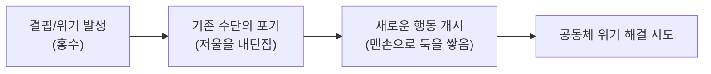

<Callout type="info">
  **이번 문서의 목표:** 형식주의·구조주의·정신분석·마르크스주의 비평 각각이 같은 텍스트에서 무엇을 다르게 질문하는지 설명하고, 국문학개론·문학비평론 문항에서 이론 이름과 핵심 개념을 정확히 짝지을 수 있게 한다.
</Callout>

## 왜 하나의 렌즈만으로는 부족한가

05편에서 형식주의·구조주의·현상학·정신분석·마르크스주의·여성주의를 개념 수준으로 훑었다. 이 편은 그중 시험에 자주 나오는 네 이론(형식주의, 구조주의, 정신분석 비평, 마르크스주의 비평)을 실제 텍스트 분석 수준까지 심화한다. 같은 작품도 어떤 이론을 적용하느냐에 따라 완전히 다른 질문이 나온다는 점이 이 영역 출제의 핵심 포인트다.

> **쉽게 말하면:** 문학비평 이론은 같은 작품을 보는 서로 다른 안경이다. 안경마다 잘 보이는 부분이 다르다.

이 원리를 확인하기 위해, 아래 짧은 이야기를 이 편 전체에서 예시로 쓴다. 이 이야기는 이 문서를 위해 새로 지은 것으로, 실제 문학 작품이 아니다.

### 예시 텍스트 (새로 작성)

> 방앗간집 막내아들 두식이는 아버지가 물려준 낡은 저울을 늘 지니고 다녔다. 사람들은 그 저울이 이제는 눈금이 닳아 쓸모없다고 놀렸지만, 두식이는 흉년이 든 해에도 그 저울로 곡식을 나누어 온 마을을 굶주림에서 건졌다. 어느 날 마을에 큰 홍수가 나자, 두식이는 저울을 내던지고 맨손으로 둑을 쌓기 시작했다.

이 짧은 이야기 하나로도 형식주의는 문장의 짜임을, 구조주의는 이야기의 뼈대를, 정신분석 비평은 인물의 내면을, 마르크스주의 비평은 계급과 물질적 조건을 각각 다르게 파고든다.

## 형식주의 비평: 텍스트 그 자체의 짜임을 본다

**형식주의**(形式主義, Formalism)는 작품을 작가의 전기나 시대 배경과 분리하고, **텍스트 내부의 언어적 장치**만으로 작품의 문학성을 설명하려는 관점이다. 20세기 초 러시아 형식주의(Russian Formalism)와 이후 영미권의 신비평(New Criticism)이 대표적인 두 갈래다.

- **낯설게하기**(defamiliarization, 러시아어로는 остранение): 러시아 형식주의자 빅토르 시클롭스키가 제시한 개념으로, 익숙한 대상을 낯선 방식으로 표현해 독자가 그 대상을 새롭게 지각하게 만드는 문학적 효과를 가리킨다. 위 예시에서 "저울을 내던지고 맨손으로 둑을 쌓기 시작했다"는 표현은 계산과 측정의 도구(저울)를 몸으로 하는 노동(맨손)과 대비시켜, 익숙한 위기 상황을 낯설게 다시 보게 만든다.
- **면밀한 읽기**(close reading): 신비평이 강조한 방법으로, 단어 하나·구두점 하나까지 세밀하게 읽어 작품 내부의 긴장과 통일성을 찾아내는 독법이다.
- **유기적 통일성**(organic unity): 작품의 모든 부분(비유·구조·어휘)이 하나의 전체 의미를 향해 유기적으로 결합해 있다고 보는 신비평의 전제.
- **의도의 오류**(intentional fallacy)와 **감정의 오류**(affective fallacy): 신비평은 작가의 의도나 독자의 감정 반응으로 작품을 평가하는 것을 오류로 규정하고, 오직 텍스트 자체의 언어적 증거로만 해석해야 한다고 주장한다.

> **쉽게 말하면:** 형식주의는 "작가가 무슨 생각으로 썼는지"보다 "텍스트 안에서 단어들이 어떻게 짜여 있는지"만 보라는 입장이다.

위 예시에 형식주의를 적용하면, 두식이라는 인물의 실존 여부나 작가의 창작 의도는 묻지 않는다. 대신 "낡은 저울"과 "맨손"이라는 두 이미지가 어떻게 대비되며 이야기의 긴장을 만들어내는지, 문장 구조가 어떻게 인물의 전환(측정하는 사람에서 노동하는 사람으로)을 뒷받침하는지를 분석한다.

## 구조주의 비평: 이야기의 뼈대를 본다

**구조주의**(構造主義, Structuralism)는 언어학자 페르디낭 드 소쉬르의 기호학에 뿌리를 두고, 개별 작품의 내용보다 **여러 작품에 공통으로 나타나는 심층 구조**를 밝히려는 관점이다.

- **기표와 기의**: 소쉬르는 언어 기호를 소리·문자 형태인 **기표**(記表, signifiant)와 그것이 가리키는 개념인 **기의**(記意, signifié)로 나누었다. 구조주의 비평은 문학 텍스트의 상징과 모티프도 이런 기호 관계로 분석한다.
- **이항대립**(binary opposition): 문화·서사는 흔히 서로 반대되는 두 항(자연/문명, 삶/죽음, 안/밖)의 대립으로 의미를 만든다고 본다. 위 예시에서는 "측정(저울)"과 "몸(맨손)", "평상시의 질서"와 "재난"이라는 이항대립이 이야기를 구성한다.
- **서사 기능**: 러시아 민담 연구자 블라디미르 프로프는 여러 민담을 비교해, 등장인물이 다르더라도 이야기가 진행되는 기능적 단계(예: 결핍의 발생, 주인공의 출발, 시련, 문제 해결)가 반복된다는 것을 밝혔다. 구조주의 서사학은 이 아이디어를 소설·설화 분석에 확장해, 표면의 사건이 달라도 심층의 기능 구조는 비슷하다고 본다.

> **쉽게 말하면:** 구조주의는 "이 이야기만의 특별한 내용"보다 "이야기라는 틀이 어떻게 반복되는 뼈대로 짜여 있는가"를 본다.

위 예시를 프로프식 기능으로 단순화하면 다음과 같은 흐름으로 읽을 수 있다.

## 정신분석 비평: 인물과 텍스트의 무의식을 본다

**정신분석 비평**(Psychoanalytic Criticism)은 지그문트 프로이트의 정신분석 이론을 문학 해석에 적용해, 등장인물의 행동이나 작품의 이미지 배후에 있는 **무의식**(無意識, unconscious)적 욕망과 갈등을 읽어내는 관점이다.

- **억압**(repression): 받아들이기 힘든 욕망이나 기억을 의식에서 몰아내 무의식에 묻어두는 심리 기제. 억압된 것은 사라지지 않고 상징이나 실수, 꿈의 형태로 다시 나타난다고 본다.
- **상징적 대체**: 프로이트는 꿈이나 문학의 이미지가 억압된 욕망을 직접이 아니라 다른 대상으로 바꾸어 표현한다고 보았다. 위 예시에서 "저울을 내던지는" 행동을, 아버지에게서 물려받은 규범(저울)을 스스로 벗어던지려는 무의식적 갈망의 상징으로 읽는 해석이 가능하다.
- **라캉의 세 위상**: 프랑스 정신분석학자 자크 라캉은 인간의 심리를 **상상계**(想像界, 거울에 비친 자기 이미지와 동일시하는 단계), **상징계**(象徵界, 언어·법·질서의 체계에 편입되는 단계), **실재계**(實在界, 언어로 완전히 포착되지 않는 영역)로 구분했다. 문학 텍스트에서 언어로 설명되지 않는 균열이나 침묵의 순간을 실재계의 흔적으로 읽는 해석이 라캉적 비평의 특징이다.

> **쉽게 말하면:** 정신분석 비평은 "인물이 왜 그렇게 행동하는지"를 겉으로 드러난 이유가 아니라 마음 깊은 곳의 억압된 욕망에서 찾는다.

주의할 점은, 정신분석 비평이 작품 속 인물을 실제 환자처럼 진단하는 것이 목적이 아니라는 것이다. 인물의 행동·이미지·상징이 인간 심리의 보편적 갈등을 어떻게 형상화하는지를 읽어내는 것이 이 비평의 목표다.

## 마르크스주의 비평: 계급과 물질적 조건을 본다

**마르크스주의 비평**(Marxist Criticism)은 카를 마르크스의 유물론에 기반해, 문학 작품이 그 시대의 **경제적 토대**(하부구조)와 **계급 관계**를 어떻게 반영하거나 은폐하는지를 분석하는 관점이다.

- **토대와 상부구조**: 마르크스주의는 생산 관계(누가 생산 수단을 소유하는가)라는 **토대**가 법·정치·문화·이데올로기 같은 **상부구조**를 규정한다고 본다. 문학은 상부구조의 일부로서, 당대의 계급 관계를 반영한다.
- **반영론**(reflection theory): 문학이 현실의 사회·경제 구조를 거울처럼 비춘다는 관점. 다만 단순한 사진 찍기가 아니라, 작가의 계급적 위치에 따라 왜곡되거나 특정 계급의 이해관계를 은폐하는 방식으로 반영될 수 있다고 본다.
- **이데올로기**(ideology): 지배 계급의 이해관계를 자연스럽고 보편적인 것처럼 보이게 만드는 관념 체계. 마르크스주의 비평은 작품이 특정 이데올로기를 무비판적으로 전파하는지, 혹은 균열을 드러내며 비판하는지를 살핀다.

위 예시에 마르크스주의 비평을 적용하면, 두식이가 흉년에 곡식을 나눈 행위를 개인의 미덕이 아니라 방앗간이라는 생산 수단을 둘러싼 계급 관계(곡식을 소유·분배하는 위치에 있는 자와 그렇지 못한 마을 사람들) 속에서 다시 읽을 수 있다. 홍수라는 재난 앞에서 저울(교환·측정의 질서)을 버리고 몸으로 노동하는 결말은, 사유화된 자원 배분 방식이 위기 상황에서 공동 노동으로 전환되는 과정으로도 해석될 수 있다.

> **쉽게 말하면:** 마르크스주의 비평은 "누가 무엇을 가졌고, 누가 그것을 나누어 주는 위치에 있는가"라는 물질적 조건에서 이야기를 다시 읽는다.

## 네 이론 한눈에 비교하기

| 이론 | 초점 | 핵심 개념 | 대표 질문 |
|---|---|---|---|
| 형식주의 | 텍스트 내부의 언어 장치 | 낯설게하기, 면밀한 읽기, 유기적 통일성 | 이 문장·이미지가 어떻게 짜여 긴장을 만드는가 |
| 구조주의 | 여러 작품에 공통된 심층 구조 | 기표/기의, 이항대립, 서사 기능 | 이 이야기의 뼈대는 다른 이야기들과 어떤 구조를 공유하는가 |
| 정신분석 비평 | 인물·텍스트의 무의식 | 억압, 상징적 대체, 상상계·상징계·실재계 | 이 행동·이미지 뒤에 어떤 억압된 욕망이 있는가 |
| 마르크스주의 비평 | 계급과 경제적 조건 | 토대/상부구조, 반영론, 이데올로기 | 이 작품은 당대의 계급 관계를 어떻게 반영·은폐하는가 |

## 출제 포인트와 자주 틀리는 점

- **이론과 핵심 개념을 뒤바꾸는 선지**가 가장 흔한 함정이다. 예를 들어 "낯설게하기는 구조주의의 개념이다"처럼 형식주의 개념을 다른 이론에 붙이는 오답이 자주 나온다. 개념 하나마다 어느 이론에 속하는지 표로 정리해 두는 것이 좋다.
- **이항대립을 마르크스주의의 계급 대립과 혼동**하기 쉽다. 이항대립은 구조주의가 말하는 의미 생성 원리(자연/문명 등 보편적 대립)이고, 계급 대립은 마르크스주의가 말하는 특정한 사회경제적 관계다.
- "정신분석 비평은 작가의 실제 병력을 진단하는 것이 목적이다" 같은 선지는 옳지 않다. 이 비평의 목표는 텍스트·인물이 형상화하는 심리적 갈등의 해석이지, 실제 인물의 진단이 아니다.
- 반영론을 "문학이 현실을 있는 그대로 정확히 복사한다"는 뜻으로 단순화하면 옳지 않은 진술이 된다. 마르크스주의 비평의 반영론은 계급적 위치에 따른 왜곡·은폐 가능성까지 포함한다.

## 핵심 정리

- 형식주의는 텍스트 내부의 언어 장치(낯설게하기, 면밀한 읽기, 유기적 통일성)에 집중한다.
- 구조주의는 기표/기의, 이항대립, 서사 기능 개념으로 여러 작품에 공통된 심층 구조를 찾는다.
- 정신분석 비평은 억압된 무의식이 상징으로 드러나는 방식을 읽고, 라캉은 이를 상상계·상징계·실재계로 확장했다.
- 마르크스주의 비평은 토대와 상부구조, 반영론, 이데올로기 개념으로 작품과 계급·경제적 조건의 관계를 분석한다.

## 마무리 복습

<Quiz
  questionNumber={1}
  question="러시아 형식주의자 빅토르 시클롭스키가 제시한, 익숙한 대상을 낯설게 표현해 새롭게 지각하게 만드는 개념은?"
  options={['낯설게하기', '이항대립', '반영론', '상징계']}
  correctAnswer={1}
  explanation="낯설게하기(defamiliarization)는 러시아 형식주의자 시클롭스키가 제시한 개념으로, 익숙한 대상을 낯선 방식으로 표현해 새로운 지각을 일으키는 문학적 효과를 가리킨다."
  optionExplanations={['정답이다', '이항대립은 구조주의가 말하는 의미 생성 원리다', '반영론은 마르크스주의 비평의 개념이다', '상징계는 라캉 정신분석 이론의 개념이다']}
/>

<Quiz
  questionNumber={2}
  question="신비평(New Criticism)이 강조한 읽기 방법으로, 작가의 의도나 독자의 감정보다 텍스트 내부의 언어적 증거만으로 해석해야 한다는 원칙과 관련된 개념은?"
  options={['면밀한 읽기와 의도의 오류', '이데올로기 비판', '오이디푸스 콤플렉스', '프로프의 서사 기능']}
  correctAnswer={1}
  explanation="신비평은 면밀한 읽기(close reading)를 방법으로 삼고, 작가의 의도로 작품을 평가하는 것을 의도의 오류로 규정해 텍스트 자체의 언어적 증거만으로 해석할 것을 주장했다."
  optionExplanations={['정답이다', '이데올로기 비판은 마르크스주의 비평의 관심사다', '오이디푸스 콤플렉스는 정신분석 비평의 개념이다', '서사 기능은 구조주의 비평의 개념이다']}
/>

<Quiz
  questionNumber={3}
  question="소쉬르 기호학에서 언어 기호의 소리·문자 형태를 가리키는 용어는?"
  options={['기의', '기표', '실재계', '상부구조']}
  correctAnswer={2}
  explanation="소쉬르는 언어 기호를 소리·문자 형태인 기표(signifiant)와 그것이 가리키는 개념인 기의(signifié)로 나누었다."
  optionExplanations={['기의는 기호가 가리키는 개념 쪽이다', '정답이다', '실재계는 라캉 정신분석 이론의 개념이다', '상부구조는 마르크스주의 이론의 개념이다']}
/>

<Quiz
  questionNumber={4}
  question="구조주의 서사학에서, 여러 민담을 비교해 등장인물이 달라도 반복되는 기능적 단계가 있다고 밝힌 학자는?"
  options={['프로이트', '라캉', '프로프', '마르크스']}
  correctAnswer={3}
  explanation="러시아 민담 연구자 블라디미르 프로프는 여러 민담을 비교해 이야기가 진행되는 기능적 단계가 반복된다는 것을 밝혔고, 이는 구조주의 서사학의 기초가 되었다."
  optionExplanations={['프로이트는 정신분석 이론의 창시자다', '라캉은 프로이트 이론을 확장한 정신분석학자다', '정답이다', '마르크스는 마르크스주의 비평의 이론적 기반을 제공한 사상가다']}
/>

<Quiz
  questionNumber={5}
  question="라캉이 제시한 세 위상 중, 언어로 완전히 포착되지 않는 영역을 가리키는 것은?"
  options={['상상계', '상징계', '실재계', '이데올로기계']}
  correctAnswer={3}
  explanation="라캉은 인간의 심리를 상상계, 상징계, 실재계로 구분했으며, 이 중 실재계는 언어로 완전히 포착되지 않는 영역을 가리킨다."
  optionExplanations={['상상계는 거울에 비친 자기 이미지와 동일시하는 단계다', '상징계는 언어·법·질서의 체계에 편입되는 단계다', '정답이다', '이데올로기계는 라캉이 제시한 위상 개념이 아니다']}
/>

<Quiz
  questionNumber={6}
  question="마르크스주의 비평에서, 생산 관계가 법·정치·문화 등을 규정한다고 볼 때 후자를 가리키는 용어는?"
  options={['토대', '상부구조', '기표', '이항대립']}
  correctAnswer={2}
  explanation="마르크스주의는 생산 관계인 토대(하부구조)가 법·정치·문화 등의 상부구조를 규정한다고 본다. 법·정치·문화는 상부구조에 해당한다."
  optionExplanations={['토대는 생산 관계 자체를 가리킨다', '정답이다', '기표는 소쉬르 기호학의 개념이다', '이항대립은 구조주의의 개념이다']}
/>

<Quiz
  questionNumber={7}
  question="다음 중 정신분석 비평에 대한 설명으로 옳지 않은 것은?"
  options={['억압된 욕망이 상징의 형태로 다시 나타난다고 본다', '작품 속 인물의 행동을 심리적 갈등의 형상화로 해석한다', '작가나 인물의 실제 병력을 임상적으로 진단하는 것이 궁극적 목적이다', '라캉은 프로이트 이론을 언어학적 관점으로 확장했다']}
  correctAnswer={3}
  explanation="정신분석 비평의 목표는 텍스트와 인물이 형상화하는 심리적 갈등을 해석하는 것이지, 실제 인물을 임상적으로 진단하는 것이 아니므로 이 설명은 옳지 않다."
  optionExplanations={['옳은 설명이므로 정답이 아니다', '옳은 설명이므로 정답이 아니다', '실제 진단이 목적이 아니므로 이것이 정답이다', '옳은 설명이므로 정답이 아니다']}
/>

## 참고 자료

- [국가평생교육진흥원 독학학위제](https://bdes.nile.or.kr)
- [표준국어대사전](https://stdict.korean.go.kr)
