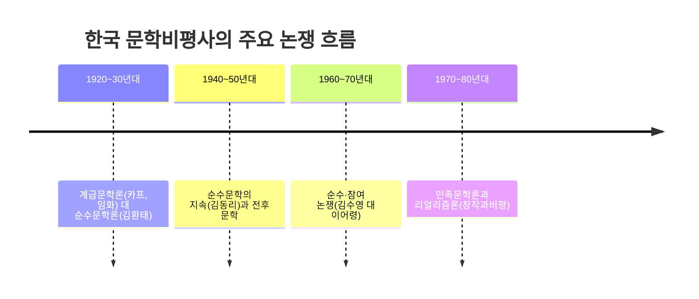

<Callout type="info">
  **이번 문서의 목표:** 한국 근현대 문학비평사에서 반복적으로 나타난 핵심 논쟁 구도(계급문학 대 순수문학, 순수 대 참여, 민족문학론)를 시대순으로 설명하고, 비평문을 읽을 때 논쟁의 두 축을 빠르게 파악하는 방법을 익힌다.
</Callout>

## 왜 한국 문학비평사를 논쟁 중심으로 봐야 하는가

21편에서 형식주의·구조주의·정신분석·마르크스주의 비평이라는 **일반 이론**을 다루었다면, 이 편은 그 이론들이 한국이라는 구체적 시공간에서 실제로 어떻게 **논쟁**으로 전개되었는지를 다룬다. 한국 문학비평사는 특정 이론 하나가 조용히 자리 잡은 역사가 아니라, 시대마다 문학이 무엇을 해야 하는가를 둘러싸고 벌어진 **입장 대립의 역사**에 가깝다. 그래서 이 영역의 시험 문항은 "비평가 이름과 이론을 단순 암기했는가"보다 "이 비평가가 어느 논쟁에서 어떤 입장에 섰는가"를 묻는 경우가 많다.

> **쉽게 말하면:** 한국 문학비평사는 "문학은 무엇을 위해 존재하는가"라는 질문에 시대마다 다르게 답한 논쟁들의 연속이다.

## 1920~30년대: 계급문학론과 순수문학론의 대립

1920년대 중반, 식민지 조선의 문인들 사이에서 문학이 사회 변혁의 도구가 되어야 한다는 주장이 조직적으로 등장했다. 1925년 결성된 **조선프롤레타리아예술가동맹**(약칭 카프, KAPF)은 문학이 계급 모순을 드러내고 노동자·농민의 해방에 이바지해야 한다는 **계급문학론**을 내세웠다. 비평가이자 시인인 **임화**(林和)는 카프 내에서 문학의 정치적 실천성을 강조한 대표적 인물로 꼽힌다.

이에 맞서 문학의 자율적 가치, 즉 정치적 목적이 아니라 언어 예술 자체의 아름다움과 정서적 감동을 우선해야 한다는 **순수문학론**이 함께 제기되었다. 비평가 **김환태**(金煥泰)는 문학 작품을 이념의 도구가 아니라 그 자체로 느끼고 감상해야 할 대상으로 보는 **순수비평**의 입장을 대표한다.

> **쉽게 말하면:** 카프의 계급문학론은 "문학은 사회를 바꾸는 무기여야 한다"는 입장이고, 순수문학론은 "문학은 그 자체로 아름다움을 추구해야 한다"는 입장이다.

이 대립 구도는 21편에서 다룬 마르크스주의 비평(반영론·이데올로기)과 형식주의 비평(텍스트 내부의 미적 가치)의 대립이 한국의 구체적 역사 속에서 재현된 사례로 이해할 수 있다.

## 1940~50년대: 순수문학의 지속과 전후 문학

해방과 한국전쟁을 거치며 이념 대립이 격화되는 가운데, 문학의 자율성을 옹호하는 순수문학의 흐름은 이어졌다. **김동리**(金東里)는 소설가이자 비평가로서, 문학이 특정 이념의 도구가 아니라 인간 존재의 근원적 문제를 다루어야 한다는 입장에서 순수문학을 옹호한 대표적 인물로 자주 언급된다. 이 시기의 논쟁은 앞선 계급문학 대 순수문학 구도의 연장선에서, 전쟁이라는 극단적 현실 앞에서 문학이 어떤 역할을 해야 하는가라는 질문으로 이어졌다.

## 1960~70년대: 순수·참여 논쟁

1960년대 후반, 문학이 현실 정치·사회 문제에 적극적으로 발언해야 하는가를 둘러싸고 **순수·참여 논쟁**이 다시 뜨겁게 벌어졌다. 시인 **김수영**(金洙暎)은 문학이 현실의 억압에 저항하고 정치적 발언을 감당해야 한다는 **참여문학**의 입장을 대표하며, 평론가 **이어령**(李御寧)은 문학의 자율적 언어 실험과 상상력을 강조하는 입장에서 이 논쟁에 참여한 것으로 널리 알려져 있다.

> **쉽게 말하면:** 순수·참여 논쟁은 "문학이 시대의 현실 문제에 직접 발언해야 하는가, 아니면 문학 고유의 언어와 상상력에 집중해야 하는가"를 둘러싼 논쟁이다.

이 논쟁은 1920~30년대의 계급문학 대 순수문학 구도와 뼈대는 닮았지만, 초점이 달라졌다는 점이 시험에서 자주 다루어진다. 1920~30년대가 계급 혁명이라는 이념 자체를 문제 삼았다면, 1960~70년대는 냉전과 독재라는 시대의 구체적 현실에 문학이 얼마나 발언해야 하는가를 문제 삼았다.

## 1970~80년대: 민족문학론과 리얼리즘론

산업화와 민주화 운동이 이어지던 1970~80년대에는, 문학이 분단과 민중의 삶이라는 민족적 현실을 담아내야 한다는 **민족문학론**이 폭넓게 논의되었다. 이 흐름에서 문학이 현실을 정확하고 총체적으로 그려내야 한다는 **리얼리즘론**이 함께 강조되었으며, 계간지 『창작과비평』을 중심으로 한 비평 활동이 이 흐름의 대표적 거점으로 자주 언급된다. 이 시기의 논의는 이후 1980년대 민중의 생활과 투쟁을 문학의 중심에 놓으려는 흐름으로 이어졌다.

## 논쟁 구도 비교표

| 시기 | 논쟁 | 한쪽 입장 | 다른 쪽 입장 | 대표 인물(예시) |
|---|---|---|---|---|
| 1920–30년대 | 계급문학 대 순수문학 | 문학은 계급 해방의 도구다 | 문학은 자율적 미적 가치를 지닌다 | 임화 / 김환태 |
| 1960–70년대 | 순수·참여 논쟁 | 문학은 현실에 정치적으로 발언해야 한다 | 문학은 언어·상상력의 자율성에 집중해야 한다 | 김수영 / 이어령 |
| 1970–80년대 | 민족문학론 | 문학은 분단·민중 현실을 총체적으로 그려야 한다 | (자율성 중심 입장이 상대적 축으로 계속 존재) | 창작과비평 계열 비평가들 |

이 표에서 보듯, 한국 문학비평사는 "문학의 사회적 책무"를 강조하는 쪽과 "문학의 자율적 언어·미적 가치"를 강조하는 쪽이 시대마다 다른 이름(계급문학/순수문학, 참여/순수, 민족문학/자율문학)으로 반복해서 맞선 역사로 정리할 수 있다.

## 비평문을 읽는 방법: 두 축 먼저 찾기

독학사 4단계에서 비평문 일부를 제시하고 이해를 묻는 문항이 나올 때는, 다음 순서로 접근하면 논지를 빠르게 파악할 수 있다.

<Steps>

### 1단계 — 이 글이 무엇에 반대하는가 찾기

비평문은 대개 기존의 어떤 입장을 비판하며 시작한다. 첫 문단에서 필자가 비판하는 대상(예: 지나치게 정치적인 문학, 혹은 지나치게 유미주의적인 문학)을 먼저 찾는다.

### 2단계 — 필자가 대안으로 내세우는 입장 찾기

비판 대상과 짝을 이루는, 필자가 옹호하는 대안적 입장을 찾는다. 앞서 정리한 두 축(사회적 책무 대 자율적 미학) 중 어느 쪽에 가까운지 표시해 둔다.

### 3단계 — 근거로 든 작품·개념 확인하기

필자가 자신의 주장을 뒷받침하기 위해 어떤 작품이나 개념을 근거로 드는지 확인한다. 이 근거가 21편에서 배운 어느 비평 이론(형식주의·구조주의·정신분석·마르크스주의)과 연결되는지 짚어 두면 통합 문항에 대비할 수 있다.

</Steps>

## 자주 틀리는 점

- 순수문학과 참여문학을 "좋은 문학과 나쁜 문학"의 구도로 오해하기 쉽다. 이는 가치 판단의 문제가 아니라 문학의 역할에 대한 서로 다른 입장 차이다.
- 계급문학론(1920~30년대)과 순수·참여 논쟁(1960~70년대)을 같은 시기의 논쟁으로 혼동하는 경우가 있다. 두 논쟁은 뼈대는 비슷하지만 서로 다른 시대의 다른 현실을 배경으로 한다.
- 특정 비평가를 항상 한 진영에만 속한 것으로 단정하는 것은 위험하다. 실제 비평가의 입장은 시기에 따라 변화하기도 하므로, 시험에서 다루는 대표적 논쟁 구도 안에서의 위치로 이해하는 것이 안전하다.
- 정확한 연도·세부 논쟁 경과는 교재·공식 자료마다 서술이 다를 수 있으므로, 이 편에서 제시한 흐름은 큰 틀의 이해용으로 삼고 세부 사실은 최신 학습 자료로 다시 확인하는 것이 좋다.

## 핵심 정리

- 한국 문학비평사는 "문학의 사회적 책무"와 "문학의 자율적 미학"이라는 두 축이 시대마다 다른 이름으로 반복해서 맞선 역사다.
- 1920~30년대는 카프의 계급문학론(임화)과 순수문학론(김환태)이 대립했다.
- 1960~70년대는 참여문학(김수영)과 순수문학(이어령)의 순수·참여 논쟁이 벌어졌다.
- 1970~80년대는 분단·민중 현실을 다루는 민족문학론과 리얼리즘론이 창작과비평을 중심으로 논의되었다.
- 비평문을 읽을 때는 비판 대상 찾기 → 대안 입장 찾기 → 근거 작품·개념 확인하기의 순서로 접근한다.

## 마무리 복습

<Quiz
  questionNumber={1}
  question="1925년 결성되어 문학이 계급 모순을 드러내고 노동자·농민의 해방에 이바지해야 한다는 계급문학론을 내세운 단체는?"
  options={['창작과비평', '조선프롤레타리아예술가동맹(카프)', '순수문학협회', '민족문학작가회의']}
  correctAnswer={2}
  explanation="1925년 결성된 조선프롤레타리아예술가동맹(카프, KAPF)은 문학이 계급 모순을 드러내고 노동자·농민의 해방에 이바지해야 한다는 계급문학론을 내세운 단체다."
  optionExplanations={['창작과비평은 1970~80년대 민족문학론·리얼리즘론의 거점으로 언급되는 계간지다', '정답이다', '순수문학협회는 이 흐름을 대표하는 공식 명칭으로 시험에서 다루는 단체명이 아니다', '민족문학작가회의는 이 시기의 단체명이 아니다']}
/>

<Quiz
  questionNumber={2}
  question="문학을 이념의 도구가 아니라 그 자체로 느끼고 감상해야 할 대상으로 본 순수비평의 대표적 인물로 언급되는 사람은?"
  options={['임화', '김환태', '김수영', '이어령']}
  correctAnswer={2}
  explanation="김환태는 문학 작품을 이념의 도구가 아니라 그 자체로 느끼고 감상해야 할 대상으로 본 순수비평의 대표적 인물로 언급된다."
  optionExplanations={['임화는 카프 계급문학론을 대표하는 인물로 언급된다', '정답이다', '김수영은 1960~70년대 참여문학을 대표하는 인물로 언급된다', '이어령은 같은 시기 순수문학 쪽 입장으로 논쟁에 참여한 것으로 언급된다']}
/>

<Quiz
  questionNumber={3}
  question="1960년대 후반 벌어진 순수·참여 논쟁에서, 문학이 현실의 억압에 저항하고 정치적 발언을 감당해야 한다는 참여문학의 입장을 대표하는 인물로 언급되는 사람은?"
  options={['김수영', '이어령', '김동리', '임화']}
  correctAnswer={1}
  explanation="시인 김수영은 문학이 현실의 억압에 저항하고 정치적 발언을 감당해야 한다는 참여문학의 입장을 대표하는 인물로 언급된다."
  optionExplanations={['정답이다', '이어령은 문학의 자율적 언어 실험을 강조하는 입장에서 이 논쟁에 참여한 것으로 언급된다', '김동리는 1940~50년대 순수문학을 옹호한 인물로 주로 언급된다', '임화는 1920~30년대 카프의 계급문학론을 대표하는 인물이다']}
/>

<Quiz
  questionNumber={4}
  question="1920~30년대 계급문학론 대 순수문학론 논쟁과 1960~70년대 순수·참여 논쟁의 관계에 대한 설명으로 가장 적절한 것은?"
  options={['두 논쟁은 완전히 동일한 시기에 같은 인물들 사이에서 벌어졌다', '두 논쟁은 문학의 사회적 역할과 자율적 미학이라는 비슷한 대립 구도를 서로 다른 시대적 현실 위에서 반복한다', '두 논쟁은 아무런 공통점이 없는 별개의 사건이다', '1960~70년대 논쟁은 카프 해산 직후에 벌어진 사건이다']}
  correctAnswer={2}
  explanation="두 논쟁은 문학의 사회적 책무와 자율적 미학이라는 비슷한 대립 구도가 서로 다른 시대적 현실(식민지 계급 문제, 냉전기 정치 현실) 위에서 반복해 나타난 것으로 이해할 수 있다."
  optionExplanations={['두 논쟁은 시기와 인물이 다르다', '정답이다', '뼈대가 되는 대립 구도는 공통적이므로 이 설명은 옳지 않다', '순수·참여 논쟁은 카프 해산 직후가 아니라 수십 년 뒤인 1960년대 후반의 사건이다']}
/>

<Quiz
  questionNumber={5}
  question="1970~80년대 분단과 민중의 삶이라는 민족적 현실을 문학이 담아내야 한다고 본 흐름과 가장 관련이 깊은 개념은?"
  options={['낯설게하기', '민족문학론과 리얼리즘론', '의도의 오류', '상징계']}
  correctAnswer={2}
  explanation="1970~80년대에는 문학이 분단과 민중의 삶이라는 민족적 현실을 담아내야 한다는 민족문학론과, 현실을 정확하고 총체적으로 그려야 한다는 리얼리즘론이 함께 강조되었다."
  optionExplanations={['낯설게하기는 러시아 형식주의의 개념이다', '정답이다', '의도의 오류는 신비평의 개념이다', '상징계는 라캉 정신분석 이론의 개념이다']}
/>

<Quiz
  questionNumber={6}
  question="비평문의 논지를 파악하는 순서로 이 편에서 제시한 접근법으로 가장 적절한 것은?"
  options={['결론부터 암기하고 근거는 무시한다', '비판 대상 찾기 대안 입장 찾기 근거 작품·개념 확인하기 순서로 읽는다', '필자의 이름과 발표 연도만 확인하면 충분하다', '문장의 길이를 세어 문체를 판단한다']}
  correctAnswer={2}
  explanation="비평문을 읽을 때는 필자가 비판하는 대상을 먼저 찾고, 그에 대한 대안 입장을 확인한 뒤, 근거로 든 작품·개념을 확인하는 순서로 접근하는 것이 논지 파악에 효과적이다."
  optionExplanations={['근거를 무시하면 논지를 정확히 파악할 수 없다', '정답이다', '이름과 연도만으로는 논지 내용을 파악할 수 없다', '문장 길이는 논지 파악과 직접 관련이 없다']}
/>

## 참고 자료

- [국가평생교육진흥원 독학학위제](https://bdes.nile.or.kr)
- [표준국어대사전](https://stdict.korean.go.kr)
