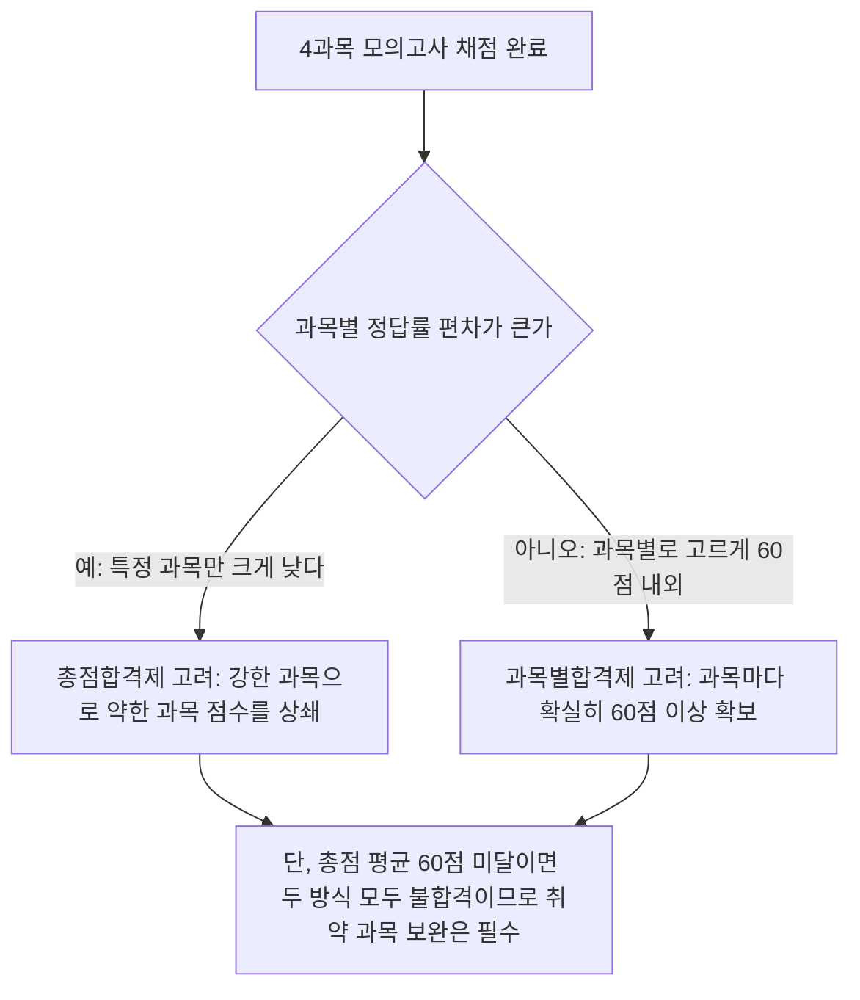

<Callout type="warning">
  **재구성 출제 고지:** 이 모의고사는 국가평생교육진흥원이 공개한 국어국문학 4단계 학위취득 종합시험 출제기준(국어학개론·국문학개론·한국문학사·문학비평론)의 평가 영역·수준을 분석해 새로 구성한 **재구성 문항**입니다. 실제 기출 문항을 그대로 옮기지 않았습니다. **권장 풀이 시간은 50분**이며, 문항 수·배점·서술형 분량 기준·합격 기준의 세부 운영은 회차 공고마다 달라질 수 있으므로 **반드시 응시 회차 공고를 확인**하세요.
</Callout>

## 문항 배분표

| 과목 | 다루는 편 | 문항 수 | 문항 번호 |
| --- | --- | --- | --- |
| 국어학개론 | 02, 07–11 | 6 | 1–6 |
| 국문학개론 | 03, 05, 21–22 | 6 | 7–12 |
| 한국문학사 | 04, 12–20 | 6 | 13–18 |
| 문학비평론 | 05, 21–22 | 6 | 19–24 |

시간을 재고 먼저 끝까지 풀어본 뒤, 채점 후 아래 `## 채점 후 복습 동선` 표를 참고해 틀린 과목의 본론 편으로 돌아가 복습하고, `## 합격 전략 점검` 절에서 총점합격제·과목별합격제 중 자신에게 맞는 전략을 다시 점검하세요.

## 1과목: 국어학개론 (1–6)

### 문제 1

<Quiz
  questionNumber={1}
  question="다음 중 음운 변동의 유형과 예의 연결로 옳지 않은 것은?"
  options={['비음화 – 국물이 [궁물]로 발음됨', '구개음화 – 굳이가 [구지]로 발음됨', '축약 – 좋고가 [조코]로 발음됨', '탈락 – 값이 [갑씨]로 발음됨']}
  correctAnswer={4}
  explanation="'값이'가 [갑씨]로 발음되는 것은 겹받침 중 하나가 탈락하지 않고 뒤 음절의 초성으로 이어져 발음되는 연음 현상과 자음군 단순화가 함께 관여하는 예로, 단순한 음운 탈락의 대표 예로 보기는 어렵다. 자음군 단순화로 인한 탈락의 전형적인 예로는 '넋이'가 아니라 '넋도[넉또]'처럼 자음군 중 하나가 실제로 사라지는 경우를 드는 것이 더 정확하다."
  optionExplanations={['국물이 [궁물]로 발음되는 것은 비음 앞에서 파열음이 비음으로 바뀌는 비음화의 정확한 예다.', '굳이가 [구지]로 발음되는 것은 ㄷ이 모음 이 앞에서 구개음 ㅈ으로 바뀌는 구개음화의 정확한 예다.', '좋고가 [조코]로 발음되는 것은 ㅎ과 ㄱ이 합쳐져 ㅋ이 되는 축약(자음 축약)의 정확한 예다.', '값이는 겹받침이 연음되어 [갑씨]로 발음되는 경우로, 자음이 온전히 탈락하는 전형적인 탈락 예로 제시하기에는 적절하지 않아 이것이 정답이다.']}
/>

### 문제 2

<Quiz
  questionNumber={2}
  question="품사 분류 기준에 대한 설명으로 옳지 않은 것은?"
  options={['형태(활용 여부 등), 기능(문장 성분), 의미(공통된 의미 부류)를 기준으로 품사를 나눈다', '동사와 형용사는 활용을 한다는 점에서 공통되지만 현재 시제 선어말어미 결합 여부 등에서 차이를 보인다', '관형사와 부사는 모두 활용하지 않으며 각각 체언과 용언(또는 문장)을 수식한다', '조사는 반드시 활용하며 독립적으로 문장 성분이 될 수 있다']}
  correctAnswer={4}
  explanation="조사는 원칙적으로 활용하지 않는 품사이며(서술격 조사 이다는 예외적으로 활용), 대부분의 조사는 독립적으로 문장 성분이 되기보다 앞말에 붙어 문법적 관계를 나타내거나 의미를 더하는 역할을 한다. 조사가 반드시 활용하고 독립적으로 문장 성분이 된다는 설명은 옳지 않다."
  optionExplanations={['형태·기능·의미를 품사 분류의 기준으로 삼는다는 것은 옳은 설명이다.', '동사와 형용사가 활용은 공통되지만 현재 시제 선어말어미 결합 등에서 차이를 보인다는 것은 옳은 설명이다.', '관형사와 부사가 활용하지 않으며 각각 체언·용언(문장)을 수식한다는 것은 옳은 설명이다.', '조사는 서술격 조사를 제외하면 활용하지 않고, 독립적 문장 성분이 아니라 주로 문법적 관계를 표시하므로 이 설명이 옳지 않으며 이것이 정답이다.']}
/>

### 문제 3

<Quiz
  questionNumber={3}
  question="다음 중 파생어와 합성어의 구분에 대한 설명으로 가장 적절한 것은?"
  options={['파생어는 어근과 어근이 결합한 단어이고, 합성어는 어근과 접사가 결합한 단어다', '파생어는 어근에 접사가 결합해 만들어진 단어이고, 합성어는 둘 이상의 어근이 결합해 만들어진 단어다', '파생어와 합성어는 모두 단일어에 속하는 하위 개념이다', '파생어와 합성어의 구분은 국어에서 의미가 없다']}
  correctAnswer={2}
  explanation="파생어는 어근에 접사(접두사·접미사)가 결합해 만들어진 단어(예: 헛+소문, 일+꾼)이고, 합성어는 둘 이상의 어근이 결합해 만들어진 단어(예: 손+발, 밤+낮)다. 이 둘은 함께 복합어로 묶이며, 어근 하나로만 이루어진 단일어와 대비된다."
  optionExplanations={['파생어와 합성어의 정의가 서로 뒤바뀌어 있어 틀렸다.', '파생어(어근+접사)와 합성어(어근+어근)의 정의가 정확하므로 정답이다.', '파생어와 합성어는 단일어가 아니라 복합어에 속하는 하위 개념이다.', '파생어와 합성어의 구분은 단어 형성법 학습과 시험 출제에서 핵심적으로 다뤄지는 개념이다.']}
/>

### 문제 4

<Quiz
  questionNumber={4}
  question="다음 중 문장 성분에 대한 설명으로 옳지 않은 것은?"
  options={['주어는 문장에서 동작이나 상태의 주체를 나타내는 성분이다', '관형어는 체언을 수식하는 성분이다', '부사어는 반드시 문장에서 생략할 수 없는 필수 성분이다', '서술어의 자릿수에 따라 필요한 문장 성분의 개수가 달라질 수 있다']}
  correctAnswer={3}
  explanation="부사어는 대부분 문장에서 생략해도 문법적으로 성립하는 수의적(부속) 성분이지만, 서술어의 종류에 따라 필수적으로 요구되는 필수 부사어(예: 그는 학교에 갔다에서 학교에)도 존재한다. 부사어가 '반드시' 생략할 수 없다고 단정하는 것은 부사어 전체의 성격을 지나치게 일반화한 설명이라 옳지 않다."
  optionExplanations={['주어의 정의로 옳은 설명이다.', '관형어의 정의로 옳은 설명이다.', '부사어는 대부분 수의적 성분이며 일부만 필수적 부사어이므로, 반드시 생략할 수 없다는 단정은 옳지 않아 이것이 정답이다.', '서술어 자릿수(한 자리, 두 자리, 세 자리 서술어)에 따라 필요한 문장 성분 수가 달라진다는 것은 옳은 설명이다.']}
/>

### 문제 5

<Quiz
  questionNumber={5}
  question="화용론에서 다루는 '함축(implicature)'에 대한 설명으로 가장 적절한 것은?"
  options={['문장의 통사 구조만으로 결정되는 문법적 의미를 가리킨다', '발화의 문자적 의미를 넘어 맥락 속에서 화자가 청자에게 전달하려는 추가적 의미를 가리킨다', '단어의 사전적 의미만을 가리킨다', '음운 변동으로 발생하는 발음상의 변화를 가리킨다']}
  correctAnswer={2}
  explanation="함축은 발화의 문자 그대로의 의미(명제적 의미)를 넘어, 대화의 맥락과 협력 원리 등을 바탕으로 화자가 청자에게 전달하고자 하는 추가적 의미를 가리킨다. 예를 들어 창문이 열려 있네라는 말이 맥락에 따라 창문을 닫아 달라는 요청으로 해석되는 경우가 함축의 대표적 예다."
  optionExplanations={['이는 통사론이 다루는 문법적 의미에 대한 설명이며 함축과는 다르다.', '맥락 속에서 전달되는 추가적 의미라는 것이 함축의 정확한 정의이므로 정답이다.', '단어의 사전적 의미는 어휘의미론이 다루는 대상이며 함축과는 다르다.', '음운 변동에 따른 발음 변화는 음운론의 대상이며 함축과는 무관하다.']}
/>

### 문제 6

<Quiz
  questionNumber={6}
  question="중세국어의 표기·음가에 대한 설명으로 옳지 않은 것은?"
  options={['훈민정음 창제 당시에는 현대국어에 없는 자모(예: 아래아, 반치음, 여린히읗 등)가 사용되었다', '방점(성조 표시)이 중세국어 문헌에 나타난다', '중세국어의 표기와 음가는 현대국어와 완전히 동일했다', '중세국어 문헌에서는 이어적기(연철) 표기가 자주 나타난다']}
  correctAnswer={3}
  explanation="중세국어는 아래아, 반치음, 여린히읗 등 현대국어에 없는 자모와 성조를 표시하는 방점을 사용했고, 표기 방식(이어적기)도 현대와 달랐다. 따라서 중세국어의 표기와 음가가 현대국어와 완전히 동일했다는 것은 옳지 않은 설명이다."
  optionExplanations={['아래아·반치음·여린히읗 등 현대에 없는 자모 사용은 옳은 설명이다.', '방점으로 성조를 표시했다는 것은 옳은 설명이다.', '표기·음가가 현대국어와 크게 달랐으므로 완전히 동일했다는 것은 옳지 않으며 이것이 정답이다.', '이어적기(연철) 표기가 중세국어 문헌에 자주 나타난다는 것은 옳은 설명이다.']}
/>

## 2과목: 국문학개론 (7–12)

### 문제 7

<Quiz
  questionNumber={7}
  question="소설에서 '시점'의 개념을 설명한 것으로 가장 적절한 것은?"
  options={['작품이 출판된 연도를 가리킨다', '서술자가 이야기를 바라보고 전달하는 위치와 태도를 가리킨다', '작품의 분량(장편·중편·단편)을 구분하는 기준을 가리킨다', '작가의 실제 정치적 입장을 가리킨다']}
  correctAnswer={2}
  explanation="시점은 서술자가 이야기 속 인물과 사건을 어떤 위치에서, 어떤 태도로 바라보고 전달하는지를 가리키는 서사 이론의 핵심 개념이다. 1인칭 주인공·1인칭 관찰자·작가 관찰자(3인칭 관찰자)·전지적 작가 시점으로 흔히 나뉜다."
  optionExplanations={['출판 연도는 시점과 무관한 서지 정보다.', '서술자의 위치와 태도라는 것이 시점의 정확한 정의이므로 정답이다.', '분량 구분은 시점과 무관한 형식적 기준이다.', '작가의 실제 정치적 입장은 시점이라는 서사 기법 개념과는 다른 차원이다.']}
/>

### 문제 8

<Quiz
  questionNumber={8}
  question="희곡과 시나리오를 비교한 설명으로 가장 적절한 것은?"
  options={['희곡은 무대 상연을, 시나리오는 영상 촬영을 전제로 한 대본이라는 점에서 다르다', '희곡과 시나리오는 완전히 동일한 형식을 갖는다', '희곡에는 대사가 없고 시나리오에만 대사가 있다', '시나리오는 조선시대부터 존재한 갈래다']}
  correctAnswer={1}
  explanation="희곡은 무대 위 공연을 전제로 쓰인 대본이고, 시나리오는 영화나 영상 촬영을 전제로 쓰인 대본이라는 점에서 매체와 상연 방식의 차이를 가진다. 두 갈래 모두 대사와 지시문으로 구성된다는 공통점이 있지만, 시나리오는 장면 전환(신, scene)이나 카메라 지시 등 영상 매체에 특화된 요소를 추가로 갖는다."
  optionExplanations={['무대 상연(희곡)과 영상 촬영(시나리오)이라는 매체 차이를 정확히 짚었으므로 정답이다.', '두 갈래는 매체·형식상 공통점과 함께 뚜렷한 차이도 있으므로 완전히 동일하다는 것은 옳지 않다.', '희곡에도 대사가 핵심 구성 요소로 존재하므로 이 설명은 틀렸다.', '시나리오는 근대 이후 영화 매체와 함께 등장한 갈래로 조선시대에는 존재하지 않았다.']}
/>

### 문제 9

<Quiz
  questionNumber={9}
  question="문학의 갈래 중 '교술(敎述)'에 대한 설명으로 가장 적절한 것은?"
  options={['허구적 사건을 통해 인물의 내면을 형상화하는 갈래다', '글쓴이가 경험하거나 알고 있는 사실을 전달·설명하는 성격이 강한 갈래로 수필·경기체가 등이 해당한다', '운율을 갖추어 정서를 압축적으로 표현하는 갈래다', '무대 상연을 전제로 대사와 행동으로 사건을 전개하는 갈래다']}
  correctAnswer={2}
  explanation="교술은 글쓴이가 경험하거나 알고 있는 사실, 정보, 교훈 등을 전달·설명하는 성격이 강한 갈래로, 현대의 수필이나 고전의 경기체가·가사(교훈적 성격이 강한 경우) 등이 여기에 속하는 것으로 다뤄진다."
  optionExplanations={['허구적 사건을 통한 인물 내면 형상화는 서사 갈래의 특징에 가깝다.', '사실 전달·설명 성격이 강한 갈래라는 설명이 교술의 정의에 부합하므로 정답이다.', '운율을 통한 정서의 압축적 표현은 서정 갈래의 특징에 가깝다.', '무대 상연을 전제로 한 대사·행동 중심 전개는 극 갈래의 특징에 가깝다.']}
/>

### 문제 10

<Quiz
  questionNumber={10}
  question="구조주의 비평의 관점에서 설화나 소설을 분석할 때 중시하는 것으로 가장 적절한 것은?"
  options={['작가의 생애와 창작 당시의 개인적 감정', '이야기 표면의 구체적 사건보다 그 이야기를 관통하는 구조적 규칙과 이항 대립', '작품이 출판된 출판사의 상업적 전략', '독자 개인의 정서적 반응']}
  correctAnswer={2}
  explanation="구조주의 비평은 개별 이야기의 표면적 사건보다, 여러 이야기에 공통으로 나타나는 서사 구조나 선악·삶과 죽음 같은 이항 대립 같은 심층적 구조 규칙을 찾아내는 것을 목표로 한다."
  optionExplanations={['작가의 생애·개인적 감정 중심 접근은 전기적 비평에 가깝다.', '구조적 규칙과 이항 대립을 중시한다는 것이 구조주의 비평의 핵심 관점이므로 정답이다.', '출판사의 상업적 전략 분석은 구조주의 비평의 초점과 무관하다.', '독자 개인의 정서적 반응 중심 접근은 독자반응비평에 가깝다.']}
/>

### 문제 11

<Quiz
  questionNumber={11}
  question="다음 중 국문학개론에서 다루는 '문학의 기능'에 대한 설명으로 옳지 않은 것은?"
  options={['문학은 정서적 즐거움을 주는 쾌락적 기능을 가질 수 있다', '문학은 삶에 대한 통찰과 깨달음을 주는 교훈적 기능을 가질 수 있다', '문학은 사회 현실을 반영하고 비판하는 기능을 가질 수 있다', '문학의 기능은 시대와 관계없이 항상 동일한 하나로 고정되어 있다']}
  correctAnswer={4}
  explanation="문학의 기능(쾌락적·교훈적·사회 반영적 기능 등)은 시대와 사회, 개별 작품과 독자에 따라 다양하게 강조되어 왔으며, 하나로 고정되어 있다고 볼 수 없다. 예를 들어 계몽기 문학은 교훈·계몽적 기능이, 순수문학론은 미적·쾌락적 기능이 상대적으로 강조되었다."
  optionExplanations={['쾌락적 기능에 대한 설명으로 옳다.', '교훈적 기능에 대한 설명으로 옳다.', '사회 반영·비판 기능에 대한 설명으로 옳다.', '문학의 기능이 시대·사조에 따라 다양하게 강조되어 왔으므로 항상 동일하게 고정되어 있다는 것은 옳지 않으며 이것이 정답이다.']}
/>

### 문제 12

<Quiz
  questionNumber={12}
  question="국문학개론과 문학비평론의 관계에 대한 설명으로 가장 적절한 것은?"
  options={['국문학개론은 문학비평론과 완전히 무관한 별개의 학문이다', '국문학개론이 문학 일반 이론·갈래·비평 이론의 기초 지도를 제공한다면, 문학비평론은 그 이론들을 심화해 실제 작품 분석에 적용하는 데 초점을 둔다', '문학비평론은 국어학의 하위 분야다', '국문학개론은 오직 고전문학만을 다루는 과목이다']}
  correctAnswer={2}
  explanation="국문학개론은 문학의 정의·갈래·기본 이론과 함께 비평 이론의 큰 지도를 제공하는 성격이 강하고, 문학비평론은 그 이론들을 더 심화해 구체적인 작품 분석과 비평문 이해에 적용하는 데 초점을 둔다는 점에서 두 과목은 서로 보완적 관계에 있다."
  optionExplanations={['두 과목은 문학 이론이라는 공통 기반 위에서 밀접하게 연결되어 있으므로 완전히 무관하다는 것은 옳지 않다.', '기초 지도(국문학개론)와 심화 적용(문학비평론)의 관계 설명이 정확하므로 정답이다.', '문학비평론은 국문학(문학) 영역의 하위 분야이지 국어학의 하위 분야가 아니다.', '국문학개론은 고전문학뿐 아니라 현대문학·문학 일반 이론·비평 이론까지 포괄한다.']}
/>

## 3과목: 한국문학사 (13–18)

### 문제 13

<Quiz
  questionNumber={13}
  question="한국 문학사의 시대 구분에서 '개화기 문학'이 갖는 성격으로 가장 적절한 것은?"
  options={['고전문학의 정형적 양식을 완전히 그대로 유지한 시기의 문학이다', '전통적 양식과 서구·근대적 요소가 혼재하며 계몽적 성격이 강하게 나타나는 과도기적 문학이다', '순수하게 서구 문학 양식만을 이식한 문학이다', '한글 창제 직후 등장한 문학을 가리킨다']}
  correctAnswer={2}
  explanation="개화기 문학은 창가·신소설 등에서 볼 수 있듯이 전통적인 시가·서사 양식의 흔적과 서구·근대적 요소가 함께 나타나며, 자주독립·신교육·개화사상 등을 강조하는 계몽적 성격이 두드러진 과도기적 문학으로 평가된다."
  optionExplanations={['개화기 문학은 전통 양식에서 벗어나려는 변화의 흐름을 보이므로 정형적 양식을 완전히 그대로 유지했다는 것은 옳지 않다.', '전통과 근대적 요소의 혼재, 계몽적 성격이라는 설명이 개화기 문학의 성격을 정확히 짚었으므로 정답이다.', '개화기 문학은 전통 양식의 흔적을 완전히 배제한 순수 서구 이식 문학이 아니다.', '개화기는 19세기 말~20세기 초를 가리키며 15세기 훈민정음 창제 직후와는 시기가 다르다.']}
/>

### 문제 14

<Quiz
  questionNumber={14}
  question="고려속요와 시조를 비교한 설명으로 가장 적절한 것은?"
  options={['고려속요는 개인 창작·기록의 성격이 강하고 시조는 구전 민요적 성격이 강하다', '고려속요는 분연체와 후렴구가 자주 나타나고, 시조는 3장 구조와 종장 첫 음보 3음절 고정이라는 형식적 특징을 갖는다', '두 갈래 모두 후렴구가 필수적으로 나타난다', '두 갈래 모두 조선 후기에 등장했다']}
  correctAnswer={2}
  explanation="고려속요는 분연체 구조와 후렴구 반복이라는 형식적 특징을, 시조는 초장·중장·종장의 3장 구조와 종장 첫 음보 3음절 고정이라는 형식적 특징을 갖는다는 것이 두 갈래를 비교할 때 핵심적으로 다뤄지는 내용이다."
  optionExplanations={['구전 민요적 성격은 고려속요, 개인 창작·기록 성격은 시조에 가까워 설명이 뒤바뀌었다.', '분연체·후렴구(고려속요)와 3장 구조·종장 첫 음보 고정(시조)의 대비가 정확하므로 정답이다.', '후렴구는 고려속요의 특징이며 시조에는 일반적으로 나타나지 않는다.', '고려속요는 고려시대, 시조는 고려 말부터 등장해 조선 후기 등장이라는 설명은 두 갈래 모두에 맞지 않는다.']}
/>

### 문제 15

<Quiz
  questionNumber={15}
  question="조선 후기 서민문학의 발달을 보여 주는 작품군으로 가장 적절한 것은?"
  options={['향가, 경기체가', '판소리계 소설, 사설시조', '개화기 창가, 신체시', '한문 소설(금오신화 등) 단독']}
  correctAnswer={2}
  explanation="판소리계 소설(춘향전, 흥부전 등)과 사설시조는 조선 후기 상업 경제 발달과 서민 의식 성장을 배경으로 크게 발달한 서민문학의 대표적 작품군으로 다뤄진다."
  optionExplanations={['향가·경기체가는 각각 신라~고려 초, 고려시대의 갈래로 조선 후기 서민문학과는 시기가 다르다.', '판소리계 소설과 사설시조가 조선 후기 서민문학 발달을 보여 주는 대표적 작품군이므로 정답이다.', '개화기 창가·신체시는 19세기 말~20세기 초의 문학으로 조선 후기와는 시기가 다르다.', '금오신화는 조선 전기의 한문 소설로 조선 후기 서민문학과는 시기·성격이 다르다.']}
/>

### 문제 16

<Quiz
  questionNumber={16}
  question="1930년대 한국 현대시의 여러 경향을 비교한 설명으로 옳지 않은 것은?"
  options={['정지용, 김광균 등은 회화적 이미지 중심의 모더니즘 경향을 보였다', '김영랑 등 시문학파는 언어의 음악성과 순수 서정을 추구했다', '서정주, 유치환 등은 생명파로 불리며 생명의 본질과 원초적 정열을 탐구했다', '이 시기에는 단 하나의 사조만 존재해 시인들 사이에 경향의 차이가 전혀 없었다']}
  correctAnswer={4}
  explanation="1930년대는 모더니즘, 순수시(시문학파), 생명파 등 여러 경향이 동시에 공존했던 시기로, 단 하나의 사조만 존재해 경향의 차이가 전혀 없었다는 설명은 문학사적 사실과 어긋난다."
  optionExplanations={['정지용·김광균의 모더니즘 경향 설명은 옳다.', '시문학파의 순수 서정 추구 설명은 옳다.', '서정주·유치환의 생명파 경향 설명은 옳다.', '여러 사조가 공존했던 시기이므로 단 하나의 사조만 존재했다는 것은 옳지 않으며 이것이 정답이다.']}
/>

### 문제 17

<Quiz
  questionNumber={17}
  question="현대소설사에서 이광수의 '무정'과 채만식의 '태평천하'를 비교한 설명으로 가장 적절한 것은?"
  options={['두 작품 모두 동일한 사조(자연주의)에 속하는 작품이다', '무정은 계몽주의적 성격의 최초 근대 장편소설이고, 태평천하는 식민지 현실에 안주하는 인물을 풍자한 세태소설이라는 점에서 지향이 다르다', '두 작품 모두 판소리 사설을 계승한 판소리계 소설이다', '두 작품 모두 희곡 갈래에 속한다']}
  correctAnswer={2}
  explanation="이광수의 '무정'은 계몽적 문제의식을 바탕으로 한 최초의 근대 장편소설로 평가되고, 채만식의 '태평천하'는 식민지 현실에 순응하며 안주하는 인물을 풍자적으로 그린 세태소설로 평가된다는 점에서 두 작품은 시기와 지향이 서로 다르다."
  optionExplanations={['무정은 계몽주의적 성격, 태평천하는 풍자적 세태소설로 성격이 다르므로 동일한 사조라는 설명은 옳지 않다.', '두 작품의 성격 차이(계몽적 최초 근대소설과 풍자적 세태소설)를 정확히 짚었으므로 정답이다.', '두 작품 모두 근대소설이며 판소리계 소설(조선 후기 갈래)이 아니다.', '두 작품 모두 소설이며 희곡이 아니다.']}
/>

### 문제 18

<Quiz
  questionNumber={18}
  question="한국문학사를 학습할 때 고전문학과 현대문학을 연결해 이해하는 방법으로 가장 적절한 것은?"
  options={['고전문학과 현대문학은 완전히 단절된 별개의 역사이므로 따로 암기한다', '시대 흐름 속에서 갈래의 변화(예: 판소리계 소설에서 근대소설로), 사회 변화가 문학에 미친 영향을 연결해 이해한다', '고전문학만 깊이 학습하고 현대문학은 생략한다', '현대문학만 깊이 학습하고 고전문학은 생략한다']}
  correctAnswer={2}
  explanation="한국문학사는 고전에서 현대로 이어지는 하나의 흐름으로 다뤄지며, 갈래의 변화 양상(예: 서민문학의 발달이 근대소설의 사실적 경향으로 이어지는 흐름)과 사회 변화가 문학에 미친 영향을 연결해 이해하는 것이 통합적 사고를 요구하는 4단계 출제 경향에 효과적으로 대응하는 방법이다."
  optionExplanations={['고전문학과 현대문학은 하나의 연속된 문학사 흐름으로 다뤄지므로 완전히 단절된 별개로 암기하는 것은 비효율적이다.', '갈래 변화와 사회 변화의 영향을 연결해 이해하는 것이 통합적 학습 전략으로 가장 적절하므로 정답이다.', '4단계는 고전문학과 현대문학을 모두 출제 범위로 포함하므로 한쪽만 학습하면 범위 누락이 생긴다.', '마찬가지로 현대문학만 학습하는 것도 범위 누락으로 이어진다.']}
/>

## 4과목: 문학비평론 (19–24)

### 문제 19

<Quiz
  questionNumber={19}
  question="형식주의 비평과 마르크스주의 비평의 차이를 가장 정확하게 설명한 것은?"
  options={['형식주의는 텍스트 내부의 언어·형식을 중시하고, 마르크스주의는 텍스트가 반영하는 사회경제적 토대·계급 관계를 중시한다', '형식주의와 마르크스주의는 완전히 동일한 분석 방법을 사용한다', '형식주의는 독자의 심리적 반응을, 마르크스주의는 작가의 무의식을 분석의 중심에 둔다', '형식주의는 사회 반영을, 마르크스주의는 텍스트 내부 형식만을 분석한다']}
  correctAnswer={1}
  explanation="형식주의 비평은 텍스트 내부의 언어·구조·형식적 긴장을 분석의 중심에 두는 반면, 마르크스주의 비평은 텍스트가 반영하는 사회경제적 토대와 계급 관계, 이데올로기를 분석의 중심에 둔다는 점에서 두 이론은 뚜렷하게 대비된다."
  optionExplanations={['텍스트 내부 형식(형식주의)과 사회경제적 토대·계급 관계(마르크스주의)의 대비가 정확하므로 정답이다.', '두 이론은 분석의 초점 자체가 다르므로 동일한 방법이라는 설명은 옳지 않다.', '독자의 심리적 반응은 독자반응비평, 작가의 무의식은 정신분석 비평의 초점이라 이 선택지는 두 이론의 실제 초점과 다르다.', '형식주의와 마르크스주의의 초점이 서로 뒤바뀌어 있어 틀렸다.']}
/>

### 문제 20

<Quiz
  questionNumber={20}
  question="여성주의 비평(페미니즘 비평)의 주요 분석 관심사로 가장 적절한 것은?"
  options={['작품에 나타난 운율과 음성적 자질', '작품에 나타난 성별 권력관계와 여성 인물의 재현 방식, 젠더 이데올로기', '작품이 출판된 출판사의 규모', '작품 속 자음과 모음의 음운 변동']}
  correctAnswer={2}
  explanation="여성주의 비평은 작품 속에서 남성과 여성 사이의 권력관계가 어떻게 나타나는지, 여성 인물이 어떤 방식으로 재현되는지, 작품에 내재한 젠더 이데올로기를 분석하는 것을 주요 관심사로 삼는다."
  optionExplanations={['운율·음성적 자질 분석은 형식주의 비평의 세부 방법에 가깝다.', '성별 권력관계와 여성 재현 방식 분석이 여성주의 비평의 핵심 관심사이므로 정답이다.', '출판사 규모는 여성주의 비평의 분석 대상이 아니다.', '음운 변동 분석은 국어학(음운론)의 대상이며 문학비평의 분석 관심사와는 다르다.']}
/>

### 문제 21

<Quiz
  questionNumber={21}
  question="한국 문학비평사에서 카프(KAPF)와 순수문학론의 대립에 대한 설명으로 옳지 않은 것은?"
  options={['카프는 문학의 계급적·정치적 목적성을 강조했다', '순수문학론은 문학 자체의 예술성과 언어의 미적 가치를 강조했다', '두 흐름의 대립은 문학의 사회적 역할과 예술적 자율성에 대한 입장 차이에서 비롯되었다', '두 흐름은 동일한 문학관을 공유해 실제로는 대립한 적이 없다']}
  correctAnswer={4}
  explanation="카프의 계급문학론과 순수문학론은 문학이 사회적·정치적 목적에 복무해야 하는지, 아니면 예술적 자율성을 우선해야 하는지에 대한 입장 차이로 인해 뚜렷하게 대립한 것으로 한국 문학비평사에서 다뤄진다."
  optionExplanations={['카프의 계급적·정치적 목적성 강조는 옳은 설명이다.', '순수문학론의 예술성·미적 가치 강조는 옳은 설명이다.', '사회적 역할과 예술적 자율성에 대한 입장 차이가 대립의 배경이라는 것은 옳은 설명이다.', '두 흐름은 실제로 뚜렷하게 대립했으므로 동일한 문학관을 공유해 대립한 적이 없다는 것은 옳지 않으며 이것이 정답이다.']}
/>

### 문제 22

<Quiz
  questionNumber={22}
  question="문학 작품을 분석할 때 여러 비평 이론을 함께 고려하는 것이 유리한 이유로 가장 적절한 것은?"
  options={['하나의 이론만으로 모든 작품의 모든 측면을 완전히 설명할 수 있기 때문이다', '작품마다 강조되는 측면(형식·사회적 맥락·심리·젠더 등)이 다를 수 있어, 여러 이론적 관점이 서로 다른 통찰을 제공하기 때문이다', '비평 이론은 시험에 출제되지 않기 때문에 상관없다', '여러 이론을 함께 쓰면 반드시 모순이 발생해 분석이 불가능해지기 때문이다']}
  correctAnswer={2}
  explanation="작품에 따라 형식적 정교함이 두드러지는 경우도 있고, 사회적 맥락이나 심리적 갈등, 젠더 문제가 두드러지는 경우도 있으므로 형식주의·마르크스주의·정신분석·여성주의 등 여러 비평 이론이 서로 다른 각도에서 통찰을 제공한다는 점에서 여러 이론을 함께 고려하는 것이 유리하다."
  optionExplanations={['하나의 이론만으로 작품의 모든 측면을 완전히 설명할 수 있다고 보기는 어렵다.', '작품마다 강조되는 측면이 달라 여러 이론이 서로 다른 통찰을 제공한다는 설명이 정확하므로 정답이다.', '문학비평론은 4단계 출제기준에 포함되는 과목이므로 시험에 출제되지 않는다는 설명은 옳지 않다.', '여러 이론을 함께 고려하는 것이 반드시 모순으로 이어지는 것은 아니며, 오히려 통합적 이해에 도움이 될 수 있다.']}
/>

### 문제 23

<Quiz
  questionNumber={23}
  question="독자반응비평의 기본 입장으로 가장 적절한 것은?"
  options={['텍스트의 의미는 작가가 창작하는 순간 완전히 고정되어 독자와 무관하게 결정된다', '텍스트의 의미는 독자가 읽는 과정에서 구성되며, 독자의 경험과 해석에 따라 의미가 달라질 수 있다', '텍스트의 의미는 오직 텍스트 내부의 형식 요소만으로 결정된다', '텍스트의 의미는 사회경제적 계급 구조만으로 결정된다']}
  correctAnswer={2}
  explanation="독자반응비평은 텍스트의 의미가 작가에 의해 일방적으로 완성되는 것이 아니라, 독자가 텍스트를 읽어 나가는 과정에서 자신의 경험과 기대를 바탕으로 능동적으로 구성한다는 입장을 취한다."
  optionExplanations={['작가에 의해 의미가 완전히 고정된다는 입장은 독자반응비평과 반대되는 입장에 가깝다.', '독자의 읽기 과정에서 의미가 구성된다는 것이 독자반응비평의 핵심 입장이므로 정답이다.', '텍스트 내부 형식만으로 의미가 결정된다는 것은 형식주의 비평에 가까운 입장이다.', '사회경제적 계급 구조만으로 의미가 결정된다는 것은 마르크스주의 비평에 가까운 입장이다.']}
/>

### 문제 24

<Quiz
  questionNumber={24}
  question="4단계 문학비평론 학습을 마무리할 때 점검해야 할 사항으로 가장 적절한 것은?"
  options={['비평 이론의 명칭만 암기했는지 확인한다', '이론별 핵심 관점, 한국 문학비평사에서의 실제 적용 사례, 다른 이론과의 차이를 구분해 설명할 수 있는지 확인한다', '문학비평론은 객관식으로만 출제되므로 서술형 대비는 하지 않는다', '이론은 서로 관련이 없으므로 비교하지 않고 개별적으로만 암기한다']}
  correctAnswer={2}
  explanation="4단계는 이론의 명칭 암기를 넘어, 각 이론의 핵심 관점과 한국 문학에 실제로 적용된 사례, 다른 이론과의 경계를 구분해 설명할 수 있는지를 묻는 통합적 문항이 많으므로 이 세 가지를 종합적으로 점검하는 것이 마무리 학습의 핵심이다."
  optionExplanations={['명칭 암기만으로는 개념 간 경계를 묻는 옳지 않은 것 고르기 유형에 대응하기 어렵다.', '핵심 관점, 적용 사례, 이론 간 차이 구분을 종합 점검하는 것이 4단계 학습 마무리에 가장 적절하므로 정답이다.', '독학사는 서술형 문항도 함께 출제되므로 서술형 대비를 생략하는 것은 위험하다.', '이론 간 비교는 오히려 개념 간 경계를 명확히 하는 데 도움이 되므로 비교하지 않는 것은 비효율적이다.']}
/>

## 서술형 답안 예시

<Callout type="warning">
  아래 서술형 예시는 국가평생교육진흥원 학위취득 종합시험의 서술형 문항 형식(단답형 약 80자 내외, 서술형 약 120자 이상)을 참고해 구성한 **예시 답안**입니다. 실제 글자 수 기준·배점·채점 기준은 회차 공고에 따라 달라지므로 **반드시 응시 회차 공고를 확인**하세요.
</Callout>

**문제 1 (단답형, 80자 내외).** 파생어와 합성어의 형성 방식 차이를 서술하시오.

> **예시 답안:** 파생어는 어근에 접두사나 접미사 같은 접사가 결합해 만들어지고, 합성어는 둘 이상의 어근이 결합해 만들어진다는 점에서 형성 방식이 다르다.

**문제 2 (서술형, 120자 이상).** 형식주의 비평과 마르크스주의 비평의 분석 초점 차이를 구체적으로 서술하시오.

> **예시 답안:** 형식주의 비평은 작품이 창작된 시대적 배경보다 텍스트 내부의 언어, 비유, 구조적 긴장 등 형식 요소 자체를 정밀하게 분석하는 데 초점을 둔다. 반면 마르크스주의 비평은 텍스트를 그 시대의 생산관계와 계급 갈등이 반영된 산물로 보고, 작품 속 인물과 사건을 통해 당대의 사회경제적 구조와 이데올로기를 읽어내는 데 초점을 둔다. 두 이론은 텍스트 내부와 텍스트 외부라는 서로 다른 층위에 분석의 무게를 둔다는 점에서 대비된다.

**문제 3 (서술형, 120자 이상).** 개화기 문학이 한국 문학사에서 과도기적 성격을 갖는 이유를 서술하시오.

> **예시 답안:** 개화기 문학은 창가나 신소설처럼 전통적인 시가·서사 양식의 흔적을 일부 유지하면서도, 자주독립과 신교육·개화사상 등 근대적 가치를 담아내려는 계몽적 성격을 강하게 드러낸다. 이처럼 전통 양식과 근대적 지향이 완전히 분리되지 않고 한 작품 안에 함께 나타난다는 점에서 개화기 문학은 고전문학에서 근대문학으로 넘어가는 과도기적 성격을 갖는다.

## 합격 전략 점검

01편에서 정리한 총점합격제와 과목별합격제 중 무엇을 선택할지는 이 최종 모의고사의 과목별 정답률을 근거로 다시 점검해야 한다.

**정확한 제도 운영 방식·선택 절차·과목별 합격 인정 기간 등은 반드시 해당 회차 공고를 통해 다시 확인해야 한다.** 이 모의고사에서 특정 과목의 정답률이 낮게 나왔다면, 총점합격제를 선택하더라도 그 과목의 기초 개념(아래 `## 채점 후 복습 동선` 표 참고)을 반드시 보완한 뒤 실제 시험에 응시하는 것이 안전하다.

## 채점 후 복습 동선

| 틀린 문항의 주제 | 돌아갈 편 번호 |
| --- | --- |
| 음운 변동 | 07 |
| 품사·단어 형성(파생어·합성어) | 08 |
| 통사론(문장 성분)·화용론(함축) | 09 |
| 국어사(중세국어 표기·음가) | 11 |
| 서사 이론(시점)·갈래(교술 등) | 03 |
| 희곡·시나리오 비교 | 20 |
| 구조주의 비평 | 05, 21 |
| 국문학개론과 문학비평론의 관계 | 05 |
| 개화기 문학의 성격 | 04, 16 |
| 고려속요·시조 비교 | 12 |
| 조선 후기 서민문학 | 14 |
| 1930년대 현대시 사조 | 16 |
| 현대소설사(이광수, 채만식) | 19 |
| 고전·현대문학 통합 학습법 | 04 |
| 형식주의·마르크스주의·여성주의·독자반응비평 | 21 |
| 카프와 순수문학론 | 22 |

## 참고 자료

- [국가평생교육진흥원 독학학위제 시험안내](https://bdes.nile.or.kr)
- [국립국어원 표준국어대사전](https://stdict.korean.go.kr)
