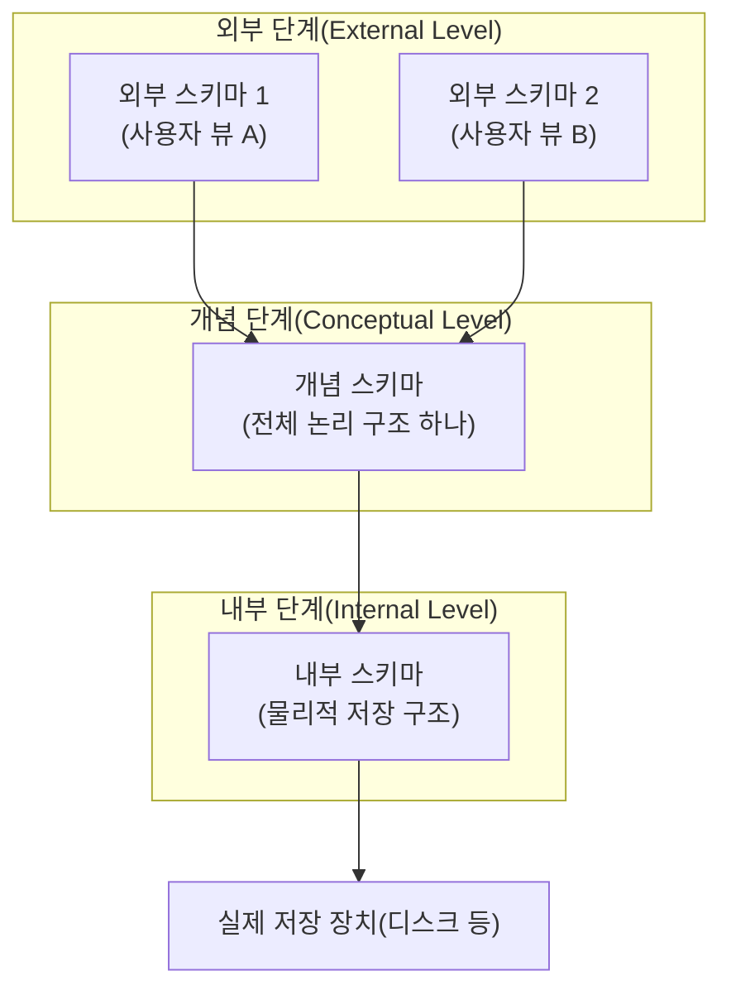

<Callout type="info">
  **이번 문서의 목표:** 이 파일을 다 읽으면 "왜 파일이 아니라 DBMS를 쓰는가"라는 질문에 근거를 들어 답할 수 있고, ANSI/SPARC 3단계 스키마의 각 계층이 하는 역할과 두 종류의 데이터 독립성이 시험에서 어떻게 출제되는지 설명할 수 있게 된다.
</Callout>

## 왜 이 문서가 필요한가

이 시리즈의 나머지 20편은 모두 "데이터베이스 관리 시스템(DBMS) 안에서" 일어나는 일을 다룹니다. 관계 모델, SQL, 정규화, 트랜잭션 모두 DBMS라는 소프트웨어가 존재하기 때문에 필요한 개념입니다. 그런데 왜 파일 시스템만으로는 부족해서 DBMS라는 별도의 소프트웨어 계층이 생겼는지, 그리고 그 DBMS 내부가 어떤 계층 구조로 나뉘는지를 먼저 이해하지 않으면, 뒤에 나오는 "스키마", "데이터 독립성" 같은 용어가 추상적인 암기 대상으로만 남습니다. 이 편은 그 뿌리를 다집니다.

> **쉽게 말하면:** 이 편은 "DBMS라는 건물이 왜 지어졌고, 그 건물이 몇 층으로 나뉘어 있는가"를 설명하는 편입니다.

## 1. 데이터베이스와 DBMS의 정의

**데이터베이스**(Database, DB)는 여러 사용자와 애플리케이션이 공유할 목적으로, 중복을 최소화하도록 체계적으로 통합·저장해 놓은 관련 데이터의 집합입니다. 단순히 "데이터를 모아 놓은 것"이 아니라, **여러 응용 프로그램이 함께 쓸 수 있도록 조직화된** 데이터 집합이라는 점이 핵심입니다.

**DBMS**(DataBase Management System, 데이터베이스 관리 시스템)는 이 데이터베이스를 생성하고, 유지·관리하며, 여러 사용자가 안전하고 효율적으로 접근할 수 있도록 중개하는 소프트웨어입니다. 사용자·애플리케이션은 데이터가 디스크의 어느 위치에 어떤 형식으로 저장되어 있는지 몰라도, DBMS가 제공하는 질의어(대표적으로 SQL)를 통해 데이터를 다룰 수 있습니다.

```mermaid
graph LR
  U["사용자·응용 프로그램"] -->|질의어(SQL 등)| DBMS["DBMS"]
  DBMS -->|저장·검색 요청 처리| DB["데이터베이스<br/>(디스크에 저장된 데이터)"]
```

> **비유:** DBMS는 큰 도서관의 **사서**와 같습니다. 이용자는 책이 정확히 어느 서가, 몇 번째 칸에 꽂혀 있는지 몰라도 "이런 주제의 책을 찾아 달라"고 요청만 하면 됩니다. 사서(DBMS)가 서가 배치(저장 구조)를 알아서 관리하고, 여러 이용자가 동시에 요청해도 혼선 없이 처리(동시성 제어)하며, 화재가 나도 목록을 복구(회복)할 방법을 갖추고 있습니다.

## 2. 파일 처리 방식과 DBMS 방식의 근본적 차이

DBMS가 등장하기 전에는 각 응용 프로그램이 자신만의 파일을 직접 만들어 데이터를 저장했습니다. 이를 **파일 처리 방식**(File Processing System)이라 부릅니다. 예를 들어 학사 관리 프로그램은 `학생.dat` 파일을, 도서 대출 프로그램은 `대출.dat` 파일을 각자 자신의 형식으로 관리하는 식입니다. 이 방식은 시험에서 DBMS의 필요성을 설명하는 대조군으로 자주 등장합니다.

| 문제점 | 파일 처리 방식에서 발생하는 이유 | DBMS가 해결하는 방식 |
|--------|-----------------------------------|------------------------|
| 데이터 중복(Redundancy) | 여러 응용 프로그램이 같은 정보(예: 학생 이름)를 각자 파일에 따로 저장 | 하나의 데이터베이스에 통합 저장해 공유 |
| 데이터 불일치(Inconsistency) | 중복된 값 중 하나만 수정되면 나머지는 옛 값으로 남음 | 통합 저장으로 값이 하나만 존재하게 관리 |
| 데이터 고립(Isolation) | 데이터가 여러 파일에 흩어져 있어 서로 연관 지어 조회하기 어려움 | 관계 등으로 연관된 데이터를 함께 질의 가능 |
| 프로그램-데이터 의존성 | 파일의 물리적 구조가 바뀌면 그 파일을 쓰는 모든 프로그램 코드를 고쳐야 함 | 데이터 독립성(3절에서 다룸)으로 완충 |
| 동시 접근 이상 | 여러 사용자가 같은 파일을 동시에 수정하면 값이 꼬일 수 있음 | 트랜잭션·동시성 제어(20–21편)로 보장 |
| 보안·무결성 통제 어려움 | 파일 단위로만 권한을 걸 수 있어 세밀한 통제가 어려움 | 사용자·역할별 권한(GRANT/REVOKE, 14편), 무결성 제약(06편)으로 통제 |
| 장애 시 복구 어려움 | 파일 손상 시 되돌릴 표준화된 방법이 없음 | 로그 기반 회복(22편)으로 체계적 복구 |

<Callout type="warning">
  **자주 틀리는 점:** "데이터 중복"과 "데이터 불일치"를 같은 말로 혼동하는 경우입니다. **중복**은 같은 값이 여러 곳에 저장되어 있다는 사실 자체를 말하고, **불일치**는 그 중복된 값들 중 일부만 갱신되어 서로 달라진 결과 상태를 말합니다. 즉 불일치는 중복이 있을 때 생길 수 있는 결과이지, 중복과 동일한 현상이 아닙니다.
</Callout>

## 3. ANSI/SPARC 3단계 스키마 — DBMS 내부를 세 층으로 나누는 이유

**스키마**(Schema)는 데이터베이스의 구조·제약을 기술한 정의(설계도)이며, 실제로 저장된 값(인스턴스, Instance)과는 구분되는 개념입니다. 스키마는 자주 바뀌지 않는 뼈대이고, 인스턴스는 시시각각 변하는 실제 데이터 값입니다.

**ANSI/SPARC**는 미국국가표준협회(American National Standards Institute)의 표준계획·요구사항위원회(Standards Planning And Requirements Committee)가 1975년경 제안한 DBMS 아키텍처 모델입니다. 이 모델은 DBMS 내부를 하나의 스키마가 아니라 **세 계층의 스키마**로 나눌 것을 제안했고, 이 구조가 오늘날까지 DBMS 설계의 표준적인 사고 틀로 쓰입니다.

> **쉽게 말하면:** 하나의 데이터베이스를 "사용자가 보는 모습", "설계자가 정의한 전체 논리 구조", "디스크에 실제로 저장되는 방식" 세 겹으로 나누어 관리하자는 아이디어입니다.



### 외부 단계(External Level) — 사용자마다 다르게 보이는 창

**외부 스키마**(External Schema, 서브 스키마·사용자 뷰라고도 부름)는 개별 사용자나 응용 프로그램의 관점에서 필요한 부분만 보여주는 스키마입니다. 같은 데이터베이스라도 학생은 자신의 성적만, 교수는 담당 과목의 수강생 명단만 보는 것처럼, **하나의 데이터베이스에 여러 개의 외부 스키마가 존재**할 수 있습니다. SQL의 뷰(VIEW)가 외부 스키마를 구현하는 대표적인 도구입니다(14편에서 자세히 다룹니다).

### 개념 단계(Conceptual Level) — 조직 전체의 논리적 설계도

**개념 스키마**(Conceptual Schema)는 데이터베이스 전체의 논리적 구조를 기술합니다. 어떤 엔터티(개체)가 있고, 각 엔터티가 어떤 속성을 가지며, 엔터티 사이에 어떤 관계가 있고, 어떤 무결성 제약이 걸려 있는지를 정의합니다. **개념 스키마는 데이터베이스 전체에 오직 하나만 존재**하며, 특정 응용 프로그램이나 저장 장치에 종속되지 않는 논리적 설계도입니다.

### 내부 단계(Internal Level) — 디스크에 실제로 어떻게 저장되는가

**내부 스키마**(Internal Schema)는 데이터가 디스크 등 물리적 저장 장치에 실제로 어떤 형식(레코드 구조, 인덱스, 파일 조직 방식 등)으로 저장되는지를 기술합니다. 내부 스키마 역시 데이터베이스 전체에 **오직 하나만 존재**하며, 저장 구조·인덱스에 관한 세부 내용은 18편에서 다룹니다.

| 스키마 단계 | 관점 | 개수 | 담는 내용 |
|-------------|------|------|-----------|
| 외부 스키마 | 개별 사용자·응용 프로그램 | 여러 개 가능 | 사용자에게 필요한 부분만의 논리적 구조 |
| 개념 스키마 | 조직 전체 | 하나만 존재 | 전체 엔터티·속성·관계·제약의 논리적 구조 |
| 내부 스키마 | 물리적 저장 | 하나만 존재 | 레코드 형식, 파일 조직, 인덱스 등 물리적 구조 |

<Callout type="warning">
  **자주 틀리는 점:** "외부 스키마가 여러 개이니 개념 스키마와 내부 스키마도 여러 개일 것"이라고 착각하는 경우입니다. **개념 스키마와 내부 스키마는 데이터베이스 하나당 정확히 하나씩만 존재**하며, 여러 개가 존재할 수 있는 것은 외부 스키마뿐입니다. 이 개수 차이는 4단계 시험에서 "옳지 않은 것 고르기" 유형으로 자주 등장합니다.
</Callout>

## 4. 데이터 독립성 — 스키마를 나눈 진짜 이유

3단계 스키마를 나눈 근본 목적은 **데이터 독립성**(Data Independence)을 확보하기 위해서입니다. 데이터 독립성이란, 한 단계의 스키마를 변경해도 그보다 상위(사용자에게 더 가까운) 단계의 스키마나 그 단계를 사용하는 응용 프로그램은 영향을 받지 않는 성질을 말합니다. ANSI/SPARC는 이를 두 가지로 구분합니다.


### 논리적 데이터 독립성(Logical Data Independence)

**개념 스키마가 변경되어도 외부 스키마(및 이를 사용하는 응용 프로그램)는 영향을 받지 않는** 성질입니다. 예를 들어 학생 테이블에 "이메일" 속성이 새로 추가되어도, 그 속성을 쓰지 않는 기존 외부 스키마(뷰)나 응용 프로그램은 아무 수정 없이 계속 동작해야 합니다.

### 물리적 데이터 독립성(Physical Data Independence)

**내부 스키마가 변경되어도 개념 스키마(및 그 위의 외부 스키마·응용 프로그램)는 영향을 받지 않는** 성질입니다. 예를 들어 저장 방식이 힙 파일에서 인덱스를 활용하는 구조로 바뀌거나, 데이터가 다른 디스크로 이전되어도, "학생 테이블에 학번·이름·학과가 있다"는 논리적 사실 자체는 변하지 않으므로 개념 스키마와 그 위 계층은 그대로 유지됩니다.

| 구분 | 변경되는 단계 | 영향받지 않아야 하는 단계 | 예시 |
|------|----------------|------------------------------|------|
| 논리적 데이터 독립성 | 개념 스키마 | 외부 스키마·응용 프로그램 | 테이블에 새 컬럼 추가, 테이블 재구성 |
| 물리적 데이터 독립성 | 내부 스키마 | 개념 스키마·외부 스키마·응용 프로그램 | 저장 장치 교체, 인덱스 추가, 파일 조직 변경 |

> **쉽게 말하면:** 논리적 데이터 독립성은 "설계도(개념)가 바뀌어도 사용자 화면(외부)은 그대로"이고, 물리적 데이터 독립성은 "창고 정리 방식(내부)이 바뀌어도 설계도(개념)는 그대로"라는 뜻입니다.

<Callout type="warning">
  **자주 틀리는 점:** 두 데이터 독립성의 "방향"을 헷갈리는 것입니다. 논리적 데이터 독립성은 **개념 스키마 변경 → 외부 스키마 무영향**을, 물리적 데이터 독립성은 **내부 스키마 변경 → 개념 스키마 무영향**을 가리킵니다. "물리적 데이터 독립성은 외부 스키마가 바뀌어도 개념 스키마가 영향받지 않는 것"이라는 식으로 단계를 뒤바꿔 설명하면 틀립니다. 또한 일반적으로 **물리적 데이터 독립성이 논리적 데이터 독립성보다 구현하기 쉽다**고 알려져 있는데, 이는 저장 구조 변경이 논리 구조 변경보다 응용 프로그램에 미치는 파급 범위가 상대적으로 좁기 때문입니다.
</Callout>

## 5. 매핑(Mapping) — 세 스키마를 연결하는 다리

세 단계 스키마가 서로 독립적으로 보이려면, DBMS 내부에서 각 단계를 서로 연결해 주는 **매핑**(Mapping, 사상)이 필요합니다.

- **외부/개념 매핑**(External/Conceptual Mapping): 각 외부 스키마와 개념 스키마 사이의 대응 관계를 정의합니다. 개념 스키마가 바뀌면 이 매핑만 조정해서 외부 스키마를 그대로 유지시키는 것이 논리적 데이터 독립성의 구현 방법입니다.
- **개념/내부 매핑**(Conceptual/Internal Mapping): 개념 스키마와 내부 스키마 사이의 대응 관계를 정의합니다. 내부 스키마가 바뀌면 이 매핑만 조정해서 개념 스키마를 그대로 유지시키는 것이 물리적 데이터 독립성의 구현 방법입니다.

즉 데이터 독립성은 "스키마가 안 바뀐다"는 뜻이 아니라, **하위 스키마가 바뀌어도 매핑을 다시 조정하는 것만으로 상위 스키마와 응용 프로그램을 그대로 유지할 수 있다**는 뜻입니다. 이 매핑이라는 완충 장치가 있기 때문에 데이터 독립성이 성립합니다.

## 핵심 정리

- **데이터베이스**는 여러 사용자·응용 프로그램이 공유하도록 통합·조직화한 데이터 집합이고, **DBMS**는 이를 생성·관리·중개하는 소프트웨어다.
- 파일 처리 방식은 데이터 중복·불일치·고립, 프로그램-데이터 의존성, 동시 접근 이상, 보안 통제 어려움, 복구 어려움이라는 문제를 가지며, DBMS는 이를 통합 저장·독립성·트랜잭션·권한·회복 기능으로 해결한다.
- **ANSI/SPARC 3단계 스키마**는 외부 스키마(사용자별, 여러 개), 개념 스키마(전체 논리 구조, 하나), 내부 스키마(물리적 저장 구조, 하나)로 구성된다.
- **논리적 데이터 독립성**은 개념 스키마 변경이 외부 스키마·응용 프로그램에 영향을 주지 않는 성질이고, **물리적 데이터 독립성**은 내부 스키마 변경이 개념 스키마(및 그 위)에 영향을 주지 않는 성질이다.
- 세 스키마는 외부/개념 매핑, 개념/내부 매핑이라는 연결 장치 덕분에 서로 독립적으로 변경될 수 있다.

## 마무리 복습

<Quiz
  questionNumber={1}
  question="파일 처리 방식의 문제점 중 '데이터 중복'과 '데이터 불일치'의 관계를 가장 정확히 설명한 것은?"
  options={['둘은 완전히 같은 현상을 가리키는 동의어다', '중복은 같은 값이 여러 곳에 저장된 상태이고, 불일치는 그 중복 값 일부만 갱신되어 서로 달라진 결과 상태다', '불일치가 원인이 되어 중복이 발생한다', '중복은 항상 불일치를 동반하며 둘은 분리해서 설명할 수 없다']}
  correctAnswer={2}
  explanation="중복은 같은 데이터가 여러 위치에 저장된 사실 자체를 말하고, 불일치는 그 중복 데이터 중 일부만 수정되어 값이 어긋난 결과 상태를 말한다."
  optionExplanations={['둘은 서로 다른 개념으로 동의어가 아니다', '정답 — 중복은 저장 상태, 불일치는 그로 인해 발생할 수 있는 결과 상태다', '중복이 있을 때 불일치가 발생할 수 있는 것이지 그 반대가 아니다', '중복이 있어도 모든 값이 항상 함께 갱신되면 불일치가 발생하지 않을 수 있다']}
/>

<Quiz
  questionNumber={2}
  question="ANSI/SPARC 3단계 스키마에서 각 단계별로 존재할 수 있는 스키마 개수로 옳은 것은?"
  options={['외부 스키마 1개, 개념 스키마 여러 개, 내부 스키마 1개', '외부 스키마 여러 개, 개념 스키마 1개, 내부 스키마 1개', '외부 스키마 여러 개, 개념 스키마 여러 개, 내부 스키마 여러 개', '세 단계 모두 정확히 1개씩만 존재한다']}
  correctAnswer={2}
  explanation="외부 스키마는 사용자·응용 프로그램마다 다르게 정의될 수 있어 여러 개가 가능하지만, 개념 스키마와 내부 스키마는 데이터베이스 전체에 각각 하나씩만 존재한다."
  optionExplanations={['개념 스키마는 데이터베이스 전체에 오직 하나만 존재한다', '정답 — 외부 스키마는 여러 개, 개념·내부 스키마는 각각 하나씩이다', '개념 스키마와 내부 스키마는 여러 개가 아니라 각각 하나씩만 존재한다', '외부 스키마는 사용자별로 여러 개가 존재할 수 있어 모두 1개라는 설명은 옳지 않다']}
/>

<Quiz
  questionNumber={3}
  question="다음 중 개념 스키마에 대한 설명으로 옳지 않은 것은?"
  options={['데이터베이스 전체의 논리적 구조를 기술한다', '엔터티·속성·관계·무결성 제약을 정의한다', '특정 사용자나 응용 프로그램 관점에서 필요한 부분만 담아 여러 개가 존재할 수 있다', '데이터베이스 하나당 오직 하나만 존재한다']}
  correctAnswer={3}
  explanation="특정 사용자 관점에서 필요한 부분만 담아 여러 개가 존재할 수 있는 것은 외부 스키마의 특징이다. 개념 스키마는 전체 논리 구조를 담은 단 하나의 스키마다."
  optionExplanations={['개념 스키마는 데이터베이스 전체의 논리적 구조를 기술하는 것이 맞다', '엔터티·속성·관계·무결성 제약 정의는 개념 스키마의 역할이 맞다', '정답 — 이는 외부 스키마의 특징이며, 개념 스키마는 사용자별로 나뉘지 않는 전체 구조 하나다', '개념 스키마는 데이터베이스 전체에 하나만 존재하는 것이 맞는 설명이다']}
/>

<Quiz
  questionNumber={4}
  question="'테이블의 물리적 저장 위치를 다른 디스크로 옮기고 인덱스 구조를 변경했지만, 이 테이블을 사용하는 응용 프로그램과 SQL 질의는 전혀 수정할 필요가 없었다'는 상황이 보여주는 것은?"
  options={['논리적 데이터 독립성', '물리적 데이터 독립성', '외부 스키마의 다중성', '무결성 제약의 적용']}
  correctAnswer={2}
  explanation="저장 장치·인덱스 등 내부 스키마의 변경이 개념 스키마와 그 위의 응용 프로그램에 영향을 주지 않는 것은 물리적 데이터 독립성의 대표적인 예다."
  optionExplanations={['논리적 데이터 독립성은 개념 스키마 변경이 외부 스키마에 영향을 주지 않는 성질로, 이 상황은 저장 구조 변경에 해당한다', '정답 — 내부 스키마(저장 구조) 변경이 상위 단계에 영향을 주지 않는 물리적 데이터 독립성의 예다', '이 상황은 스키마 개수와 무관한 데이터 독립성 개념을 보여준다', '무결성 제약은 이 상황과 직접 관련이 없다']}
/>

<Quiz
  questionNumber={5}
  question="논리적 데이터 독립성에 대한 설명으로 옳은 것은?"
  options={['내부 스키마가 변경되어도 개념 스키마가 영향받지 않는 성질이다', '개념 스키마가 변경되어도 외부 스키마와 이를 사용하는 응용 프로그램이 영향받지 않는 성질이다', '외부 스키마가 변경되어도 내부 스키마가 영향받지 않는 성질이다', '데이터가 저장된 디스크를 교체해도 문제가 없는 성질이다']}
  correctAnswer={2}
  explanation="논리적 데이터 독립성은 개념 스키마 변경이 그 위 단계인 외부 스키마·응용 프로그램에 영향을 주지 않는 성질이다."
  optionExplanations={['이는 물리적 데이터 독립성에 대한 설명이다', '정답 — 개념 스키마 변경이 외부 스키마·응용 프로그램에 영향을 주지 않는 성질이다', '외부 스키마 변경이 내부 스키마에 영향을 주는지는 데이터 독립성의 정의 방향과 다르다', '디스크 교체는 내부 스키마 변경에 해당하며 이는 물리적 데이터 독립성과 관련된 예다']}
/>

<Quiz
  questionNumber={6}
  question="외부/개념 매핑과 개념/내부 매핑에 대한 설명으로 옳은 것은?"
  options={['매핑은 데이터 독립성과 무관한 부가 기능이다', '개념 스키마가 바뀔 때 외부/개념 매핑을 조정하면 외부 스키마를 그대로 유지할 수 있어 논리적 데이터 독립성이 구현된다', '내부 스키마가 바뀌면 반드시 외부 스키마도 함께 다시 작성해야 한다', '매핑은 개념 스키마 내부에서만 일어나는 절차다']}
  correctAnswer={2}
  explanation="외부/개념 매핑을 조정하는 것만으로 개념 스키마 변경의 영향을 흡수해 외부 스키마를 그대로 유지할 수 있으며, 이것이 논리적 데이터 독립성이 구현되는 방식이다."
  optionExplanations={['매핑은 데이터 독립성을 실제로 구현하는 핵심 장치다', '정답 — 매핑 조정으로 하위 스키마 변경의 영향을 흡수해 상위 스키마를 그대로 유지하는 것이 데이터 독립성의 구현 방식이다', '물리적 데이터 독립성이 성립하면 내부 스키마 변경만으로 외부 스키마를 다시 작성할 필요가 없다', '매핑은 외부/개념 사이, 개념/내부 사이 두 지점에서 각각 일어난다']}
/>

## 참고 자료

- [국가평생교육진흥원 독학학위제](https://bdes.nile.or.kr)
- [Oracle Database Concepts](https://docs.oracle.com/en/database/oracle/oracle-database/)
