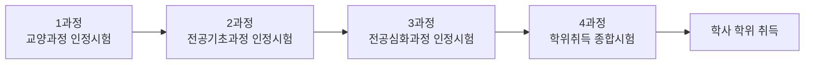

<Callout type="info">
  **이번 문서의 목표:** 이 파일을 다 읽으면 독학사 제도 안에서 4단계 데이터베이스 과목이 어떤 위치에 있고, 어떤 방식으로 출제되며, 남은 편들을 어떤 순서·전략으로 공부해야 하는지 스스로 설계할 수 있게 된다.
</Callout>

## 왜 이 문서가 필요한가

데이터베이스 이론을 아무리 잘 알아도, 그 지식을 "언제 어떤 형식으로 시험장에서 꺼내야 하는지" 모르면 실전에서 점수로 이어지지 않습니다. 독학사(독학에 의한 학위취득시험)는 대학수학능력시험이나 자격증 시험과 구조 자체가 다릅니다. 몇 단계를 거쳐야 하는지, 4단계가 왜 특별한지, 데이터베이스가 그중 어디에 속하는지를 먼저 알아야 뒤에 나오는 25개 편의 학습 계획이 세워집니다.

> **쉽게 말하면:** 이 편은 "시험이라는 게임의 규칙"을 설명하는 편입니다. 규칙을 모르고 내용만 파고들면 시간 배분에서 손해를 봅니다.

## 1. 독학사 제도의 전체 구조

**독학사**는 정식 명칭이 "독학에 의한 학위취득시험"으로, 대학에 다니지 않고도 국가시험을 통해 학사 학위를 취득할 수 있게 하는 제도입니다. 이 제도는 국가평생교육진흥원(National Institute for Lifelong Education, NILE)이 주관합니다. 대학 등록금을 내고 4년을 다니는 대신, 정해진 과정별 시험에 합격하면 그 대학 졸업생과 동등한 학사 학위를 받습니다.

독학사는 총 4개의 과정(흔히 "단계"라고 부릅니다)으로 구성되며, 앞 단계를 통과해야 다음 단계에 응시할 자격이 주어지는 **단계적 구조**입니다.

| 단계 | 정식 명칭 | 성격 | 데이터베이스 과목 여부 |
|------|-----------|------|--------------------------|
| 1단계 | 교양과정 인정시험 | 전공과 무관한 일반 교양 과목 | 없음 |
| 2단계 | 전공기초과정 인정시험 | 전공의 기초가 되는 과목(프로그래밍, 자료구조 등) | 전공에 따라 있을 수 있음 |
| 3단계 | 전공심화과정 인정시험 | 전공 심화 이론 과목 | 전공에 따라 있을 수 있음 |
| 4단계 | 학위취득 종합시험 | 전공을 마무리 짓는 종합 시험 | 컴퓨터공학 등 전공에서 필수·선택 과목으로 출제 |

각 단계는 **별도의 시험 회차**로 진행되며, 앞 단계에 합격(또는 다른 방식으로 학점을 인정)해야 다음 단계 응시 자격을 얻습니다. 학점은행제 학점 인정, 자격증에 의한 시험 면제 등 대체 경로도 있지만, 이 편은 시험 자체의 구조에 집중합니다. 전공별 대체 경로나 면제 조건은 매 학년도 공고가 갱신되므로, 실제 응시 전에는 반드시 국가평생교육진흥원 홈페이지의 최신 공고를 확인해야 합니다.

<Callout type="warning">
  **자주 틀리는 점:** "4단계만 보면 학위가 나온다"고 오해하는 경우가 있습니다. 4단계는 이전 단계(또는 그에 준하는 학점·자격 인정)를 전제로 하는 **마지막 관문**입니다. 데이터베이스 4단계 시험만 따로 떼어 준비하더라도, 학위를 받으려면 결국 전 단계 요건을 채워야 한다는 점을 잊지 말아야 합니다.
</Callout>

## 2. 컴퓨터공학 전공과 데이터베이스 과목의 위치

독학사는 여러 전공을 운영하는데, 데이터베이스 과목은 주로 **컴퓨터공학**(과거 명칭 컴퓨터과학, 소프트웨어공학·정보통신공학 등 유사 계열 전공에서도 유사한 형태로 채택) 전공의 4단계 과목으로 개설됩니다. 4단계는 여러 과목 중 응시자가 일정 개수를 선택해서 치르는 구조이며, 데이터베이스는 그 선택지 중 하나로 컴퓨터공학 전공자에게 특히 실무·이론 양쪽에서 중요도가 높은 과목입니다.

전공명이나 개설 과목 목록은 개정될 수 있으므로("컴퓨터과학" → "컴퓨터공학" 명칭 변경 사례처럼), 응시 학년도의 공식 전공 안내를 반드시 대조해야 합니다. 이 시리즈는 데이터베이스라는 **과목 하나**에 집중하며, 전공 전체의 과목 선택 전략은 다루지 않습니다.

## 3. 4단계가 요구하는 평가 수준 — "이해"를 넘어 "적용·분석"으로

독학사는 단계가 올라갈수록 요구하는 인지 수준이 달라집니다. 이 수준 차이를 이해하지 못하면, 1~2단계 스타일로 "정의를 외우는" 공부만 하다가 4단계 문제 유형에서 당황하게 됩니다.

> **쉽게 말하면:** 1단계가 "무엇인지 아는가"를 묻는다면, 4단계는 "낯선 상황에 그 개념을 적용해서 옳고 그름을 가려낼 수 있는가"를 묻습니다.

| 단계 | 요구 수준 | 데이터베이스 과목 예시로 본 문제 스타일 |
|------|-----------|--------------------------------------------|
| 1–2단계 | 지식·이해 | "기본키의 정의는 무엇인가" |
| 3단계 | 이해·적용 | "주어진 릴레이션에서 후보키를 모두 찾으시오" |
| 4단계 | 적용·분석·종합 | "주어진 함수적 종속 집합이 BCNF를 위반하는 이유를 밝히고, 무손실 분해 결과를 고르시오" |

4단계 데이터베이스 문제는 단순 정의 확인형보다, **주어진 상황(릴레이션 스키마, 함수적 종속 집합, SQL 코드, 트랜잭션 스케줄)을 분석해서 옳은 결론을 고르는 유형**의 비중이 높습니다. 그래서 이 시리즈의 본론 편들은 정의를 안내한 직후 반드시 "그 정의를 어떤 상황에 적용해서 판별하는가"까지 이어서 다룹니다.

<Callout type="warning">
  **자주 틀리는 점:** 4단계를 "쉬운 개론 시험"으로 착각하고 정의 암기 위주로만 준비하는 경우입니다. "옳지 않은 것을 고르시오", "설명이 바르게 짝지어진 것을 고르시오"처럼 보기 4개를 모두 검증해야 풀리는 문제가 많아, 개념의 **경계**(무엇이 아닌지)까지 알아야 실수를 줄일 수 있습니다.
</Callout>

## 4. 문항 유형·배점·시간 전략

독학사 시험은 일반적으로 과목당 **객관식 4지선다형** 문항을 일정 시간 안에 푸는 방식으로 운영되어 왔습니다. 다만 문항 수, 배점, 시험 시간, 합격 기준 점수(대개 100점 만점에 60점 이상, 전 과목 평균 기준 포함 여부)는 회차·공고에 따라 조정될 수 있으므로, **정확한 숫자는 매 회차 국가평생교육진흥원 공고문에서 반드시 재확인**해야 합니다. 이 시리즈에서는 구체적인 문항 수·배점을 단정하지 않고, 아래와 같은 **일반적으로 알려진 운영 방식**을 전략 수립의 출발점으로만 제시합니다.

| 항목 | 일반적으로 알려진 방식 | 확인 방법 |
|------|--------------------------|-----------|
| 문항 형태 | 객관식 4지선다형 위주 | 회차 공고문의 "시험 방법" 항목 |
| 과목당 시험 시간 | 과목별로 정해진 제한 시간(보통 수십 분 단위) | 회차 공고문의 "교시별 시간표" |
| 합격 기준 | 과목별 60점 이상 등 기준 점수 | 회차 공고문의 "합격 기준" 항목 |

시간 전략을 세울 때는 다음 순서를 권장합니다.

1. **정의·비교형 문제부터 빠르게 처리한다.** ANSI/SPARC 스키마 구분, 키의 종류, 정규형 정의처럼 암기·비교로 바로 풀리는 문제는 시간을 오래 쓰지 않습니다.
2. **계산·분해형 문제는 표로 단계를 적으며 푼다.** 함수적 종속 폐포 계산, 정규화 분해, 관계대수 표현식 해석처럼 중간 단계가 있는 문제는 답만 암산으로 찍으면 실수가 잦습니다. 이 시리즈의 각 편도 계산 과정을 한 줄씩 펼쳐서 보여주는 이유입니다.
3. **SQL 실행 결과 예측형은 마지막에 검산한다.** 조인·서브쿼리·집계 함수가 섞인 SQL은 머릿속으로만 실행하면 오류가 나기 쉬우므로, 표 형태로 중간 결과를 그려보는 습관을 들입니다.

## 5. 이 시리즈의 학습 순서 — 왜 이렇게 구성했는가

이 시리즈는 총 26편으로, **선행(01~05) → 본론(06~23) → 종합 연습(24~26)** 순서로 구성됩니다. 선행 편은 시험 제도 이해(01·02)와 이후 본론에서 반복 설명하지 않을 표기법·수학 기초(03~05)를 다룹니다. 본론은 관계 모델 → 관계대수·관계해석 → ER 모델링·사상 → SQL → 정규화 → 저장 구조·질의 처리 → 트랜잭션·동시성·회복 → 보안·분산/객체 DB 순서로, 데이터를 "어떻게 모델링하고, 어떻게 질의하고, 어떻게 안전하게 운영하는가"라는 흐름을 따릅니다. 각 본론 주제의 자세한 배치 근거와 출제 비중은 02편에서 다룹니다.

## 핵심 정리

- 독학사는 1단계(교양) → 2단계(전공기초) → 3단계(전공심화) → 4단계(학위취득 종합시험) 순으로 진행되는 단계적 국가시험이며, 데이터베이스는 컴퓨터공학 전공 4단계 과목이다.
- 4단계는 단순 정의 암기가 아니라 **적용·분석·종합** 수준을 요구하며, "옳지 않은 것 고르기"처럼 보기 전체를 검증해야 하는 문제 비중이 높다.
- 문항 형태는 일반적으로 4지선다형 객관식이지만, 문항 수·시험 시간·합격 기준의 정확한 숫자는 회차 공고마다 다를 수 있어 **반드시 최신 공고로 확인**해야 한다.
- 시간 전략은 정의·비교형(빠르게) → 계산·분해형(단계별로 표시) → SQL 예측형(중간 결과 검산) 순으로 배분하는 것이 효율적이다.
- 이 시리즈는 선행 → 본론(모델링·질의·설계이론·운영) → 종합 연습 순서로 설계되어 있다.

## 마무리 복습

<Quiz
  questionNumber={1}
  question="독학사 제도에서 데이터베이스 과목이 일반적으로 출제되는 단계는?"
  options={['1단계 교양과정 인정시험', '2단계 전공기초과정 인정시험', '3단계 전공심화과정 인정시험', '4단계 학위취득 종합시험']}
  correctAnswer={4}
  explanation="데이터베이스는 컴퓨터공학 전공의 4단계(학위취득 종합시험) 과목으로 개설된다. 1단계는 전공과 무관한 교양 과목만 다룬다."
  optionExplanations={['1단계는 전공과 무관한 일반 교양 과목만 다룬다', '2단계는 전공의 기초 과목을 다루며 데이터베이스는 여기 해당하지 않는다', '3단계는 전공 심화 이론 과목이지만 데이터베이스는 4단계 과목으로 개설된다', '정답 — 데이터베이스는 컴퓨터공학 전공 4단계 학위취득 종합시험 과목이다']}
/>

<Quiz
  questionNumber={2}
  question="독학사 단계 구조에 대한 설명으로 옳은 것은?"
  options={['4단계에만 합격하면 이전 단계와 무관하게 즉시 학위가 나온다', '각 단계는 독립적이며 순서와 무관하게 아무 단계나 먼저 응시할 수 있다', '앞 단계 합격(또는 학점 인정 등 대체 요건)이 있어야 다음 단계에 응시할 자격이 주어진다', '모든 단계는 동일한 문제 유형과 난이도로 출제된다']}
  correctAnswer={3}
  explanation="독학사는 1~4단계가 단계적 구조로, 앞 단계 합격이나 그에 준하는 학점·자격 인정을 전제로 다음 단계 응시 자격이 주어진다."
  optionExplanations={['4단계는 이전 단계 요건이 전제되는 마지막 관문이다', '단계는 순차적 구조로 앞 단계 요건 없이 임의로 응시할 수 없다', '정답 — 단계적 구조이며 앞 단계 요건이 다음 단계 응시의 전제가 된다', '단계가 올라갈수록 요구 인지 수준(이해에서 적용·분석·종합으로)이 달라진다']}
/>

<Quiz
  questionNumber={3}
  question="4단계 데이터베이스 시험이 요구하는 평가 수준에 가장 가까운 문제 스타일은?"
  options={['기본키의 사전적 정의를 그대로 고르는 문제', '주어진 함수적 종속 집합에서 BCNF 위반 여부를 분석해 옳은 분해를 고르는 문제', '용어 하나를 한글로 번역하는 문제', '단순 계산 없이 공식만 암기했는지 확인하는 문제']}
  correctAnswer={2}
  explanation="4단계는 적용·분석·종합 수준을 요구하므로, 주어진 상황(함수적 종속 집합 등)을 분석해 결론을 도출하는 유형이 대표적이다."
  optionExplanations={['정의 그대로 고르는 문제는 1~2단계 스타일에 가깝다', '정답 — 상황을 분석해 결론을 도출하는 유형이 4단계 평가 수준에 해당한다', '단순 번역형 문제는 4단계의 적용·분석 요구 수준과 맞지 않는다', '공식 암기만으로는 4단계에서 요구하는 적용·분석 문제를 풀 수 없다']}
/>

<Quiz
  questionNumber={4}
  question="독학사 4단계 시험의 문항 수·시험 시간에 대한 올바른 태도는?"
  options={['모든 회차가 동일하므로 한 번 외운 숫자를 계속 써도 된다', '회차 공고마다 달라질 수 있으므로 매 회차 최신 공고문으로 반드시 재확인한다', '문항 수는 시험 전략에 영향을 주지 않으므로 확인할 필요가 없다', '시험 시간은 응시자가 접수 시 자유롭게 선택할 수 있다']}
  correctAnswer={2}
  explanation="문항 수·시험 시간·합격 기준은 회차 공고에 따라 달라질 수 있어 단정하지 말고 최신 공고문으로 확인해야 한다."
  optionExplanations={['공고 내용은 회차마다 달라질 수 있어 과거 숫자를 그대로 신뢰하면 안 된다', '정답 — 회차 공고마다 달라질 수 있으므로 매번 최신 공고로 확인해야 한다', '문항 수는 시간 배분 전략에 직접 영향을 주므로 반드시 확인해야 한다', '시험 시간은 공고에 정해진 대로 운영되며 응시자가 임의로 선택할 수 없다']}
/>

<Quiz
  questionNumber={5}
  question="이 시리즈에서 권장하는 문제 풀이 시간 배분 순서로 옳은 것은?"
  options={['SQL 예측형 → 계산·분해형 → 정의·비교형 순으로 푼다', '정의·비교형 → 계산·분해형 → SQL 예측형 순으로 풀며 계산은 단계별로 적는다', '문제 순서와 무관하게 앞에서부터 순서대로만 풀어야 한다', '계산·분해형은 시간이 오래 걸리므로 항상 건너뛴다']}
  correctAnswer={2}
  explanation="정의·비교형을 먼저 빠르게 처리하고, 계산·분해형은 중간 단계를 표로 적어 실수를 줄이며, SQL 예측형은 중간 결과를 검산하는 순서가 효율적이다."
  optionExplanations={['정의·비교형처럼 빨리 풀 수 있는 문제를 먼저 처리하는 것이 효율적이다', '정답 — 빠르게 풀리는 유형부터 처리하고 계산은 단계별로 표시하는 순서가 효율적이다', '문제 난이도와 유형에 따라 순서를 조정하는 것이 시간 관리에 유리하다', '계산·분해형은 배점이 있는 문제이므로 단계를 적어가며 풀어야지 건너뛰면 안 된다']}
/>

<Quiz
  questionNumber={6}
  question="이 시리즈의 본론(06~23편) 학습 흐름 순서로 옳은 것은?"
  options={['트랜잭션 → 관계 모델 → SQL → 정규화 순', '관계 모델 → 관계대수·관계해석·ER 사상 → SQL → 정규화 → 저장구조·질의처리 → 트랜잭션·동시성·회복 순', 'SQL만 집중적으로 다루고 나머지는 다루지 않는다', '정규화를 가장 먼저 배우고 관계 모델은 마지막에 배운다']}
  correctAnswer={2}
  explanation="본론은 데이터 모델(관계 모델) → 질의 언어(관계대수·해석·SQL) → 설계 이론(ER 사상·정규화) → 구현·운영(저장구조·질의처리·트랜잭션·동시성·회복) 흐름을 따른다."
  optionExplanations={['트랜잭션을 관계 모델보다 먼저 배우면 선행 개념 없이 어려운 주제부터 접하게 된다', '정답 — 모델링 → 질의 언어 → 설계 이론 → 구현·운영 흐름을 따른다', 'SQL 외에도 관계대수·정규화·트랜잭션 등 출제기준 전 범위를 다룬다', '정규화는 관계 모델과 함수적 종속 이해를 전제로 하므로 관계 모델보다 먼저 배우지 않는다']}
/>

## 참고 자료

- [국가평생교육진흥원 독학학위제](https://bdes.nile.or.kr)
