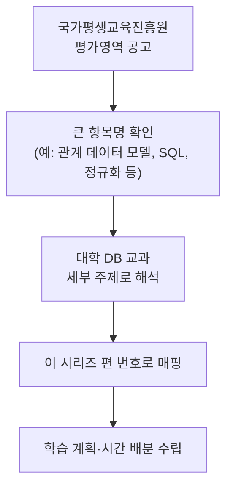

<Callout type="info">
  **이번 문서의 목표:** 이 파일을 다 읽으면 국가평생교육진흥원이 공개하는 "평가영역"이라는 문서가 무엇이고, 그 항목들이 이 시리즈의 어느 편과 대응하는지, 그리고 어떤 영역에 학습 시간을 더 배분해야 하는지 스스로 판단할 수 있게 된다.
</Callout>

## 왜 이 문서가 필요한가

01편에서 "4단계는 적용·분석 수준을 요구한다"는 사실을 확인했습니다. 그런데 "적용·분석해야 할 대상 범위"가 어디까지인지는 과목마다 국가평생교육진흥원이 공개하는 **평가영역**(출제 영역을 큰 항목으로 나눈 공식 문서)에 정해져 있습니다. 이 범위를 모르고 무작정 두꺼운 대학 교재를 처음부터 끝까지 읽으면, 출제기준에 없는 내용(예: 특정 상용 DBMS의 설치·튜닝)에 시간을 뺏기고 정작 자주 나오는 영역(정규화, 트랜잭션)은 얕게 훑고 지나가는 실수를 하게 됩니다.

> **쉽게 말하면:** 이 편은 "시험 범위 지도"입니다. 국가가 공개한 범위표를 이 시리즈의 목차와 나란히 놓고, 어디에 힘을 더 줄지 미리 표시해 둡니다.

## 1. 평가영역이란 무엇인가

**평가영역**(Evaluation Area)은 국가평생교육진흥원이 각 전공·과목별로 "이 과목에서 어떤 큰 주제들을 다루는지"를 항목 단위로 공개하는 공식 문서입니다. 자격증 시험의 "출제기준"과 비슷한 역할을 하지만, 독학사는 세부 문항 배점표까지 공개하지는 않고 **큰 항목명 수준**으로 범위를 안내하는 경우가 많습니다. 그래서 수험생은 평가영역의 항목명을 보고, 그 항목이 실제로 대학 DB 교과 과정의 어떤 주제에 대응하는지 스스로 해석해서 학습 계획을 세워야 합니다.

<Callout type="warning">
  **자주 틀리는 점:** 평가영역 항목명 하나(예: "SQL")를 "쉬운 실습 하나"로 얕보는 경우입니다. 실제로는 그 항목명 아래 DDL·DML·조인·서브쿼리·집합 연산·그룹화·뷰·권한까지 여러 하위 주제가 묶여 있을 수 있습니다. 항목명의 넓이를 과소평가하지 않아야 합니다.
</Callout>

## 2. 데이터베이스 과목 평가영역과 이 시리즈의 대응표

아래 표는 국가평생교육진흥원이 공개하는 데이터베이스 과목의 공식 평가영역 항목(대항목 기준)을, 이 시리즈의 본론 편 번호와 짝지은 것입니다. 실제 공고문의 세부 문구는 개정될 수 있으므로, 이 표는 "항목의 성격"을 기준으로 한 매핑이며 최신 공고와 항목명이 다르게 표기될 수 있습니다.

| 평가영역(대항목) | 대응하는 학부 DB 교과 주제 | 대응 편 |
|--------------------|-------------------------------|---------|
| 데이터베이스 시스템 개요 | DBMS 정의, 파일 처리 방식과의 비교, ANSI/SPARC 3단계 스키마, 데이터 독립성 | 03 |
| 데이터 모델링(ER/EER) | 엔티티·속성·관계, 카디널리티·참여 제약, ISA 계층, 관계 스키마 사상 | 04, 10, 11 |
| 관계 데이터 모델 | 릴레이션·튜플·속성·도메인, 키의 종류, 무결성 제약 | 06 |
| 관계대수·관계해석 | 기본·확장 연산, 튜플·도메인 관계해석, 안전한 질의 | 07, 08, 09 |
| SQL | DDL·DML·DCL, 조인·서브쿼리·집합 연산, 그룹화·뷰·권한 | 12, 13, 14 |
| 정규화 | 함수적 종속·이상 현상, 1NF–BCNF, 4NF·5NF | 15, 16, 17 |
| 저장 구조·인덱스·질의 처리 | 파일 조직, B-트리/B+트리, 해싱, 질의 최적화 개요 | 18, 19 |
| 트랜잭션·동시성 제어·회복 | ACID·직렬성, 잠금·2PL·타임스탬프·교착, 로그·체크포인트·WAL | 20, 21, 22 |
| 보안·분산/객체 DB | 접근 통제, 뷰를 통한 보안, 분산 DB 개념, 객체관계/객체지향 DB | 23 |

이 표에서 알 수 있듯, 평가영역의 대항목 하나가 이 시리즈에서는 여러 편으로 세분화되는 경우가 많습니다(예: SQL 한 항목이 12~14편 세 편으로, 정규화 한 항목이 15~17편 세 편으로). 이는 4단계가 요구하는 적용·분석 수준을 감안해, 각 하위 주제를 충분히 깊게 다루기 위한 구성입니다.

## 3. 출제 비중을 가늠하는 법 — 항목 수가 아니라 "적용 난이도"로 본다

공식 문서에 문항별 배점표가 없는 경우, 수험생은 흔히 "평가영역 항목이 9개이니 균등하게 9분의 1씩 공부하면 되겠지"라고 오해합니다. 하지만 실제 시험 난이도·출제 빈도는 항목 개수와 무관하게, **개념의 응용 범위가 넓고 계산·증명 요소가 있는 영역**에 몰리는 경향이 있습니다. 이 시리즈가 특정 주제군에 더 많은 편수를 배정한 것도 이 판단에 근거합니다.

> **쉽게 말하면:** "항목이 몇 개인가"가 아니라 "그 항목 안에서 얼마나 다양한 함정 문제를 만들 수 있는가"로 비중을 가늠해야 합니다.

| 출제 비중 추정 | 근거 | 해당 영역 |
|-----------------|------|-------------|
| 높음 | 계산·증명·변환 절차가 있어 문제 변형이 많다 | 관계대수, 정규화(FD 폐포·분해), ER→관계 사상, SQL 작성·해석 |
| 중간 | 개념 비교·구조 이해가 핵심이지만 계산은 제한적이다 | ANSI/SPARC 스키마, ER/EER 모델링, 트랜잭션 성질·동시성 프로토콜 |
| 상대적으로 낮음(그러나 출제 가능) | 개념 이해 확인 위주, 구현 세부는 범위 밖 | 저장 구조·인덱스, 질의 최적화 개요, 분산/객체 DB |

<Callout type="warning">
  **자주 틀리는 점:** "비중이 낮다"를 "안 나온다"로 착각하는 것입니다. 이 표의 "상대적으로 낮음"은 다른 영역 대비 계산 문제의 다양성이 적다는 뜻일 뿐, 출제기준에 포함된 이상 개념 확인형 문제는 언제든 나올 수 있습니다. 18~19·23편도 빠짐없이 학습해야 합니다.
</Callout>

## 4. 다른 4단계 전산 과목과의 경계 — 중복 학습을 줄이는 법

컴퓨터공학 4단계에는 운영체제·컴퓨터네트워크 등 다른 전산 과목도 함께 개설됩니다. 데이터베이스 평가영역 중 일부는 이들 과목과 개념적으로 인접합니다(예: 트랜잭션의 동시성 제어는 운영체제의 프로세스 동기화와, 분산 DB는 컴퓨터네트워크의 분산 시스템 개념과 맞닿아 있습니다). 이 시리즈는 데이터베이스 관점에서 필요한 만큼만 정의하고, 각 개념이 본래 속한 과목의 세부 이론까지 재강의하지 않습니다. 다른 과목과 겹치는 배경 지식이 필요하면 본문에서 "자세한 내용은 해당 과목 참고"로 표시합니다.

또한 이 사이트에는 SQL 실무 자격증인 SQLD 과목이 이미 개설되어 있어, SQL 문법·조인·정규화 계산의 **기본 실행 예제**가 겹칠 수 있습니다. 이 시리즈는 그런 기본 예제를 반복하지 않고 "자세한 실행 예제는 SQLD 몇 편"처럼 안내한 뒤, 이 과목만의 차별점인 **ANSI/SPARC 3단계 스키마와 독립성, 관계대수·관계해석의 형식적 정의, 무결성 제약의 이론적 근거, 트랜잭션 이론**에 집중합니다.

## 5. 학습 계획 세우기 — 이 시리즈를 따라가는 4단계 루틴

1. **선행**(01–05)으로 시험 구조와 표기법·수학 기초를 먼저 익힌다.
2. **본론**(06–23)을 순서대로 학습하되, 정규화·트랜잭션·SQL 작성형처럼 계산이 있는 편은 반드시 손으로 직접 풀어본다.
3. 각 편 끝의 Quiz를 풀고, 틀린 문항의 오답 이유(optionExplanations)를 읽어 **어떤 착각이었는지** 확인한다.
4. **종합 연습**(24–26)으로 주제군을 섞은 문제를 실전 시간 감각으로 풀어본다.

## 핵심 정리

- **평가영역**은 국가평생교육진흥원이 공개하는 과목별 출제 범위의 대항목 문서이며, 세부 배점까지는 공개하지 않는 경우가 많아 수험생이 항목의 넓이를 스스로 해석해야 한다.
- 이 시리즈는 평가영역 대항목을 관계 모델·관계대수·SQL·정규화·트랜잭션 등 학부 DB 교과 세부 주제로 풀어 06~23편에 배치했다.
- 출제 비중은 항목 개수가 아니라 **계산·증명·응용 범위**로 가늠해야 하며, 관계대수·정규화·ER 사상·SQL·트랜잭션이 상대적으로 높은 비중으로 다뤄진다.
- "비중이 낮다"는 "안 나온다"가 아니므로 저장 구조·인덱스·분산/객체 DB도 빠짐없이 학습해야 한다.
- 이 과목은 SQLD와 SQL 기본 예제가 겹치므로, 겹치는 부분은 링크로 넘기고 4단계 학위 시험다운 이론적 깊이(스키마 독립성, 관계대수·관계해석, 무결성의 이론적 정의, 트랜잭션 이론)에 집중한다.

## 마무리 복습

<Quiz
  questionNumber={1}
  question="독학사에서 '평가영역'의 성격에 대한 설명으로 가장 적절한 것은?"
  options={['문항별 배점까지 상세히 공개하는 채점 기준표다', '과목별 출제 범위를 큰 항목 단위로 안내하는 공식 문서로, 세부 해석은 수험생의 몫인 경우가 많다', '특정 상용 DBMS의 설치 매뉴얼이다', '매년 동일하게 유지되어 확인할 필요가 없는 문서다']}
  correctAnswer={2}
  explanation="평가영역은 큰 항목명 수준으로 범위를 공개하는 경우가 많아, 그 항목이 실제로 어떤 세부 주제를 포함하는지는 수험생이 대학 DB 교과와 대응시켜 해석해야 한다."
  optionExplanations={['평가영역은 대항목 수준의 범위 안내이며 세부 배점표가 아니다', '정답 — 큰 항목 단위 범위 안내이며 세부 해석은 수험생의 몫인 경우가 많다', '평가영역은 특정 상용 제품의 설치·운영 매뉴얼이 아니라 학문적 범위 안내다', '공고는 개정될 수 있으므로 매 회차 최신 내용을 확인해야 한다']}
/>

<Quiz
  questionNumber={2}
  question="평가영역의 'SQL' 항목이 이 시리즈에서 12~14편 세 편으로 나뉘어 배치된 이유로 가장 적절한 것은?"
  options={['SQL은 출제기준에 없는 내용이라 편법으로 늘린 것이다', '항목명 하나가 DDL·DML·조인·서브쿼리·집합 연산·그룹화·뷰·권한 등 여러 하위 주제를 포괄하기 때문이다', '분량을 맞추기 위해 임의로 나눈 것으로 특별한 근거는 없다', 'SQL은 시험에 나오지 않으므로 참고용으로만 나눈 것이다']}
  correctAnswer={2}
  explanation="평가영역 대항목은 여러 하위 주제를 포괄하는 경우가 많아, 4단계 수준으로 충분히 다루려면 세분화가 필요하다."
  optionExplanations={['SQL은 데이터베이스 평가영역의 핵심 항목으로 출제기준에 포함된다', '정답 — 하나의 대항목이 여러 하위 주제를 포괄하므로 세분화해 깊이 있게 다룬다', '세분화는 4단계 적용·분석 수준에 맞춰 하위 주제를 충분히 다루기 위한 의도적 설계다', 'SQL은 출제 비중이 높은 핵심 영역이다']}
/>

<Quiz
  questionNumber={3}
  question="출제 비중을 가늠하는 방법에 대한 설명으로 옳은 것은?"
  options={['평가영역 항목 개수를 세어 균등하게 나누면 비중을 정확히 알 수 있다', '계산·증명·변환 절차가 있어 문제 변형이 많은 영역일수록 비중이 높은 경향이 있다', '비중이 상대적으로 낮은 영역은 아예 출제되지 않으므로 학습하지 않아도 된다', '모든 영역은 언제나 정확히 동일한 비중으로 출제된다']}
  correctAnswer={2}
  explanation="출제 비중은 항목 개수가 아니라 계산·증명·응용 범위의 넓이로 가늠하는 것이 합리적이며, 관계대수·정규화 등이 이에 해당한다."
  optionExplanations={['항목 개수를 균등 배분하는 방식은 실제 응용 난이도 차이를 반영하지 못한다', '정답 — 계산·증명·변환이 다양한 영역일수록 문제 변형이 많아 비중이 높은 경향이 있다', '비중이 낮다는 것은 출제기준에서 제외된다는 뜻이 아니므로 빠짐없이 학습해야 한다', '영역별로 계산·응용 요소의 차이가 있어 비중이 동일하다고 볼 수 없다']}
/>

<Quiz
  questionNumber={4}
  question="이 시리즈가 SQLD 과목과의 중복을 처리하는 방식으로 옳은 것은?"
  options={['SQL 기본 실행 예제까지 전부 처음부터 다시 설명한다', '기본 실행 예제는 SQLD 해당 편으로 안내하고, ANSI/SPARC 독립성·관계대수·관계해석·무결성 이론·트랜잭션 이론 등 4단계 학위 시험다운 이론적 깊이에 집중한다', 'SQL 관련 내용은 이 과목에서 완전히 제외한다', 'SQLD와 겹치는 내용이 있으면 무조건 삭제하고 대체 주제로 바꾼다']}
  correctAnswer={2}
  explanation="겹치는 SQL 기본 실행 예제는 SQLD로 넘기고, 이 과목은 학문적 깊이(스키마 독립성, 관계대수·해석, 무결성의 이론적 정의, 트랜잭션 이론)로 차별화한다."
  optionExplanations={['기본 예제를 반복하면 중복 학습이 되어 비효율적이다', '정답 — 기본 예제는 SQLD로 안내하고 이론적 깊이로 차별화한다', 'SQL 자체는 데이터베이스 평가영역의 핵심 항목이므로 제외할 수 없다', '겹치는 부분을 삭제하는 것이 아니라 참조로 연결하고 심화 이론에 집중하는 방식이다']}
/>

<Quiz
  questionNumber={5}
  question="이 시리즈에서 권장하는 학습 루틴 순서로 옳은 것은?"
  options={['종합 연습(24~26) → 본론(06~23) → 선행(01~05) 순', '선행(01~05) → 본론(06~23) → 종합 연습(24~26) 순으로 진행하며 계산형 편은 직접 손으로 풀어본다', '본론만 학습하고 선행·종합 연습은 생략해도 무방하다', '무작위 순서로 편을 골라 읽어도 학습 효과는 동일하다']}
  correctAnswer={2}
  explanation="시험 구조·표기법 이해(선행) 후 본론으로 이론을 쌓고, 종합 연습으로 실전 감각을 익히는 순서가 이 시리즈의 설계 의도다."
  optionExplanations={['종합 연습을 먼저 하면 선행 개념 없이 문제를 풀게 되어 비효율적이다', '정답 — 선행 → 본론 → 종합 연습 순서로 진행하며 계산형은 직접 풀어보는 것이 권장된다', '선행 편의 표기법·수학 기초 없이는 본론의 관계대수·정규화 이해가 어렵다', '편별 선행 의존 관계가 있어 순서를 지키는 것이 학습 효율에 유리하다']}
/>

<Quiz
  questionNumber={6}
  question="4단계 데이터베이스와 다른 4단계 전산 과목(운영체제·컴퓨터네트워크 등) 간 중복 개념을 다루는 이 시리즈의 원칙은?"
  options={['다른 과목의 이론을 처음부터 끝까지 재강의한다', '데이터베이스 관점에서 필요한 만큼만 정의하고, 세부 이론은 해당 과목을 참고하도록 안내한다', '중복되는 개념은 아예 언급하지 않는다', '다른 과목과 겹치면 무조건 해당 개념의 정의를 임의로 바꾼다']}
  correctAnswer={2}
  explanation="트랜잭션의 동시성 제어와 운영체제의 프로세스 동기화처럼 인접 개념은 데이터베이스 관점에서 필요한 만큼만 설명하고, 본래 과목의 재강의는 하지 않는다."
  optionExplanations={['다른 과목을 처음부터 재강의하면 이 과목의 범위를 벗어나고 중복이 심해진다', '정답 — 필요한 만큼만 정의하고 세부는 해당 과목 참고로 안내한다', '동시성 제어처럼 시험 범위에 포함된 개념은 언급을 생략할 수 없다', '개념 정의는 표준 정의를 따르며 임의로 바꾸지 않는다']}
/>

## 참고 자료

- [국가평생교육진흥원 독학학위제](https://bdes.nile.or.kr)
