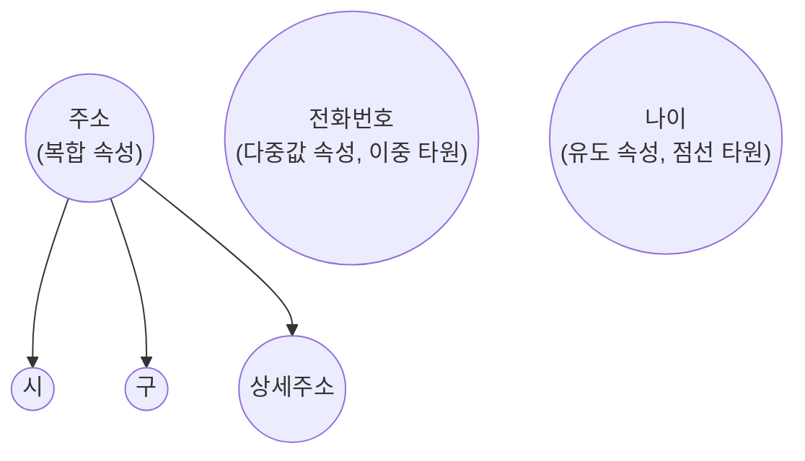
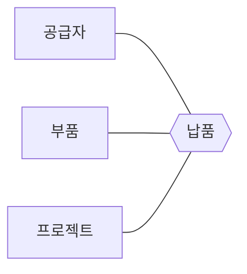
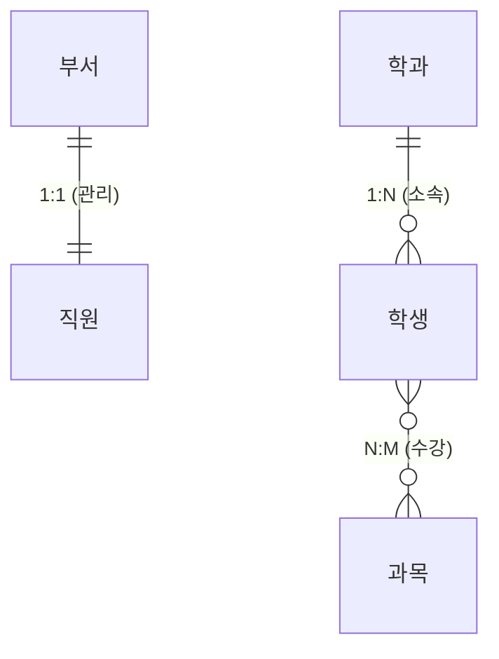
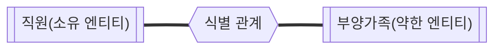

<Callout type="info">
  **이번 문서의 목표:** 이 파일을 다 읽으면 어떤 ER 다이어그램을 보더라도 엔티티·속성·관계·키·카디널리티·참여 제약을 정확한 용어로 읽어내고, 10편(ER/EER 모델링)과 11편(관계 스키마 사상)에서 바로 활용할 수 있는 표기법 지식을 갖추게 된다.
</Callout>

## 왜 이 문서가 필요한가

03편에서 개념 스키마가 "엔터티·속성·관계·제약을 정의한 전체 논리 구조"라고 배웠습니다. 그런데 이 논리 구조를 처음부터 SQL 테이블로 바로 설계하면, 업무 규칙(어떤 대상이 몇 개까지 관련될 수 있는지, 반드시 있어야 하는 관계인지)을 놓치기 쉽습니다. 그래서 실제 설계 과정에서는 먼저 **ER(Entity-Relationship, 개체-관계) 모델**이라는 그림 언어로 업무 규칙을 표현한 뒤, 이를 관계 스키마로 옮깁니다. 이 편은 그 그림 언어의 용어와 기호를 다지는 편이며, 10·11편에서 실제 설계·변환 문제를 풀 때 반드시 필요한 기초입니다.

이 사이트의 SQLD 과목 02편은 실무에서 널리 쓰이는 IE(까마귀발)·바커 표기법을 다룹니다. 이 편은 그와 달리 **피터 첸(Peter Chen)의 원조 ER 표기법을 기준으로, 4단계 시험에서 요구하는 학문적 정의**(약한 엔터티, 식별 관계, 카디널리티 비율, 참여 제약의 형식적 정의)에 집중합니다. 까마귀발 표기법 자체의 실무적 비교가 필요하면 SQLD 02편을 함께 참고하세요.

> **쉽게 말하면:** 이 편은 "ER 다이어그램이라는 그림을 정확한 용어로 읽는 법"을 다지는 편입니다.

## 1. 엔티티와 엔티티 집합

**엔티티**(Entity, 개체)는 데이터베이스에 표현하고자 하는 현실 세계의 독립적인 대상(사물이나 사건)입니다. "학생 홍길동", "과목 데이터베이스개론"처럼 구체적인 하나의 대상을 가리킵니다. 같은 유형의 속성을 갖는 엔티티들의 집합을 **엔티티 집합**(Entity Set) 또는 엔티티 타입(Entity Type)이라고 부르며, ER 다이어그램에서는 사각형으로 표현합니다. 시험이나 실무에서 "엔티티"라고 말할 때는 대부분 이 엔티티 집합(예: "학생"이라는 유형 전체)을 의미하는 경우가 많습니다.

### 속성의 종류

**속성**(Attribute)은 엔티티가 갖는 세부 성질입니다. ER 모델은 속성을 여러 기준으로 분류하며, 이 분류 자체가 시험에서 자주 출제됩니다.

| 속성 종류 | 정의 | 예시 |
|-----------|------|------|
| 단순 속성(Simple Attribute) | 더 이상 작은 구성 요소로 나눌 수 없는 속성 | 학번, 성별 |
| 복합 속성(Composite Attribute) | 여러 개의 단순 속성으로 나눌 수 있는 속성 | 주소(시·구·상세주소로 분해 가능), 이름(성·이름으로 분해 가능) |
| 단일값 속성(Single-valued Attribute) | 하나의 엔티티가 오직 하나의 값만 갖는 속성 | 학번(한 학생은 학번이 하나) |
| 다중값 속성(Multivalued Attribute) | 하나의 엔티티가 여러 개의 값을 가질 수 있는 속성 | 전화번호(한 사람이 여러 번호를 가질 수 있음), 취미 |
| 저장 속성(Stored Attribute) | 다른 속성으로부터 계산되지 않고 직접 저장되는 속성 | 생년월일 |
| 유도 속성(Derived Attribute) | 다른 속성의 값으로부터 계산해 낼 수 있는 속성 | 나이(생년월일로부터 계산) |
| 널 값 허용 속성(Null-valued Attribute) | 해당 엔티티에 적용되지 않거나 값을 모를 때 널(Null)을 허용하는 속성 | 아직 배정되지 않은 사무실 전화번호 |

복합 속성은 다이어그램에서 하나의 타원 아래 여러 개의 하위 타원으로 표현되고, 다중값 속성은 이중 타원으로, 유도 속성은 점선 타원으로 표현하는 것이 피터 첸 표기법의 관례입니다.

<Callout type="warning">
  **자주 틀리는 점:** "다중값 속성"과 "복합 속성"을 혼동하는 경우입니다. 다중값 속성은 **같은 종류의 값을 여러 개** 가질 수 있다는 뜻(전화번호 여러 개)이고, 복합 속성은 **하나의 값이 여러 하위 요소로 구성**되어 있다는 뜻(주소 하나가 시·구·상세주소로 구성)입니다. 두 성질은 서로 독립적이라서, 이론적으로는 "다중값이면서 복합적인" 속성도 가능합니다(예: 여러 개의 주소를 각각 시·구·상세주소로 구성해 저장하는 경우).
</Callout>

## 2. 키(Key) — ER 모델에서의 정의

**키**(Key)는 엔티티 집합 안에서 각 엔티티를 유일하게 식별할 수 있는 속성(또는 속성의 조합)입니다. ER 모델에서는 키에 해당하는 속성 이름 아래에 밑줄을 그어 표시하는 것이 관례입니다. 키의 세부 분류(슈퍼키·후보키·기본키·대체키)와 무결성 제약과의 관계는 이 시리즈의 06편(관계 데이터 모델과 키·무결성 제약)에서 관계 스키마 차원으로 자세히 다룹니다. 이 편에서는 ER 다이어그램 표기법 차원에서, "엔티티 집합에는 그 엔티티를 유일하게 구분해 주는 키 속성이 있어야 한다"는 원칙과 표기 방식(밑줄)만 확인하고 넘어갑니다.

## 3. 관계와 차수(Degree)

**관계**(Relationship)는 둘 이상의 엔티티 집합 사이의 연관성입니다. 다이어그램에서는 마름모로 표현하고, 관련된 엔티티 집합들과 선으로 연결합니다. 관계에 참여하는 엔티티 집합의 개수를 **차수**(Degree)라고 부릅니다.

| 차수 | 명칭 | 예시 |
|------|------|------|
| 2 | 이진 관계(Binary Relationship) | 학생–수강–과목 |
| 3 | 삼진 관계(Ternary Relationship) | 공급자–납품–부품–프로젝트(세 엔티티가 함께 참여하는 하나의 관계) |
| n | n항 관계(n-ary Relationship) | 일반적으로 n개의 엔티티 집합이 참여하는 관계 |

가장 흔한 형태는 이진 관계이며, 4단계 시험에서는 이진 관계의 카디널리티·참여 제약을 정확히 읽는 문제가 압도적으로 많습니다. 다만 삼진 관계처럼 세 엔티티가 동시에 관여해야만 의미가 완성되는 경우(예: 특정 공급자가 특정 부품을 특정 프로젝트에 납품한 사실)를, 두 개의 이진 관계로 억지로 쪼개면 원래의 의미(어느 공급자·부품·프로젝트 조합인지)를 잃어버릴 수 있다는 점도 함께 기억해야 합니다.

## 4. 카디널리티 비율(Cardinality Ratio)

**카디널리티 비율**은 이진 관계에서 한쪽 엔티티의 하나의 인스턴스가 다른 쪽 엔티티의 최대 몇 개의 인스턴스와 관계를 맺을 수 있는지를 나타내는 제약입니다. 1:1, 1:N, N:M(다대다) 세 가지로 분류합니다.

> **쉽게 말하면:** 카디널리티 비율은 "한쪽 인스턴스 하나에 다른 쪽 인스턴스가 최대 몇 개까지 붙을 수 있는가"를 나타내는 숫자입니다.

| 카디널리티 비율 | 정의 | 예시 |
|-------------------|------|------|
| 1:1 | 양쪽 모두 상대방의 인스턴스를 최대 하나까지만 가질 수 있다 | 직원–관리–부서(한 부서는 한 명의 관리자만, 한 직원은 최대 한 부서만 관리) |
| 1:N | 한쪽 인스턴스 하나가 다른 쪽 인스턴스 여러 개와 대응하지만, 반대 방향은 최대 하나까지만 대응한다 | 학과–소속–학생(한 학과에 여러 학생, 한 학생은 한 학과) |
| N:M | 양쪽 모두 상대방의 인스턴스를 여러 개 가질 수 있다 | 학생–수강–과목(한 학생이 여러 과목을, 한 과목을 여러 학생이 수강) |

## 5. 참여 제약(Participation Constraint) — 카디널리티와는 다른 축

**참여 제약**은 한 엔티티 집합의 **모든** 인스턴스가 그 관계에 반드시 참여해야 하는지(전체 참여), 아니면 참여하지 않을 수도 있는지(부분 참여)를 나타내는 제약입니다. 앞서 다룬 카디널리티 비율("최대 몇 개까지")과는 **완전히 다른 축의 정보**이므로, 두 개념을 섞어서 추론하면 안 됩니다.

| 참여 제약 | 정의 | 다이어그램 표기(피터 첸) |
|-----------|------|----------------------------|
| 전체 참여(Total Participation) | 해당 엔티티 집합의 모든 인스턴스가 반드시 그 관계에 하나 이상 참여해야 한다 | 이중선(Double Line) |
| 부분 참여(Partial Participation) | 해당 엔티티 집합의 인스턴스 중 관계에 참여하지 않는 것이 있어도 된다 | 단일선(Single Line) |

> **비유:** 카디널리티 비율이 "한 사람이 최대 몇 개의 좌석을 예약할 수 있는가"라면, 참여 제약은 "이 사람이 반드시 좌석을 예약해야 하는가, 아니면 예약하지 않아도 되는가"입니다. 두 질문은 서로 답이 독립적입니다.

예를 들어 "모든 직원은 반드시 하나의 부서에 소속되어야 한다(전체 참여)"와 "한 부서는 소속 직원이 아직 없을 수도 있다(부분 참여)"는 동시에 성립할 수 있습니다. 이 둘을 합치면 "직원 쪽은 전체 참여, 부서 쪽은 부분 참여인 1:N 관계"가 됩니다.

<Callout type="warning">
  **자주 틀리는 점:** "1:N 관계이니 N쪽은 당연히 전체 참여일 것"이라고 카디널리티 비율만으로 참여 제약을 추측하는 것입니다. 카디널리티 비율(최댓값)과 참여 제약(최솟값이 0인지 1 이상인지)은 서로 독립적으로 명시되는 별개의 규칙이므로, 문제에 주어진 업무 규칙 문장을 그대로 읽고 각각 판단해야 합니다.
</Callout>

## 6. 약한 엔티티와 식별 관계

**약한 엔티티**(Weak Entity)는 자신의 속성만으로는 유일하게 식별할 수 있는 키를 가지지 못해, 다른 엔티티(소유 엔티티, Owner Entity 또는 식별 엔티티, Identifying Entity)의 키에 의존해야만 식별될 수 있는 엔티티입니다. 이때 약한 엔티티가 부분적으로 갖는, 소유 엔티티 안에서만 유일성을 보장하는 속성을 **부분 키**(Partial Key, 판별자·Discriminator라고도 함)라고 부릅니다.

약한 엔티티와 소유 엔티티를 연결하는 관계를 **식별 관계**(Identifying Relationship)라고 하며, 다음과 같은 특징을 갖습니다.

- 식별 관계에서 약한 엔티티는 항상 **전체 참여**해야 한다(소유 엔티티 없이는 약한 엔티티가 존재할 이유가 없으므로).
- 카디널리티 비율은 소유 엔티티 쪽이 1, 약한 엔티티 쪽이 N인 **1:N 관계**가 일반적이다(하나의 소유 엔티티에 여러 약한 엔티티가 속함).

> **비유:** 약한 엔티티는 "부모의 주민등록등본에 함께 올라 있어야만 신원이 확정되는 미성년 자녀"와 비슷합니다. 자녀의 이름만으로는 동명이인이 많아 유일하게 식별할 수 없지만, "어느 부모의 자녀인지 + 자녀 이름(부분 키)"을 합치면 유일하게 식별됩니다.

다이어그램에서 약한 엔티티는 **이중 사각형**, 식별 관계는 **이중 마름모**, 부분 키는 **점선 밑줄**로 표기하는 것이 피터 첸 표기법의 관례입니다.

<Callout type="warning">
  **자주 틀리는 점:** 약한 엔티티도 "키가 아예 없다"고 오해하는 경우입니다. 약한 엔티티는 자신만의 **완전한** 키가 없을 뿐, 부분 키는 가지고 있습니다. 실제 유일 식별자는 "소유 엔티티의 키 + 약한 엔티티의 부분 키"의 조합이며, 이 조합 방식은 11편(ER→관계 사상)에서 약한 엔티티를 테이블로 변환할 때 그대로 적용됩니다.
</Callout>

## 핵심 정리

- **엔티티 집합**은 사각형, **속성**은 타원, **관계**는 마름모로 표현하며, 속성은 단순/복합, 단일값/다중값, 저장/유도 축으로 분류된다.
- **키**는 엔티티를 유일하게 식별하는 속성(조합)이며 다이어그램에서 밑줄로 표기한다. 세부 분류는 06편에서 다룬다.
- 관계의 **차수**는 참여하는 엔티티 집합의 개수(이진·삼진·n항)를 뜻하며, 삼진 관계를 이진 관계 두 개로 임의로 쪼개면 원래 의미를 잃을 수 있다.
- **카디널리티 비율**(1:1, 1:N, N:M)은 "최대 몇 개까지 대응하는가"를, **참여 제약**(전체·부분)은 "반드시 참여해야 하는가"를 나타내는 서로 다른 축의 정보다.
- **약한 엔티티**는 부분 키만 가지며 소유 엔티티의 키에 의존해 식별되고, 이를 연결하는 **식별 관계**에서 약한 엔티티는 항상 전체 참여한다.

## 마무리 복습

<Quiz
  questionNumber={1}
  question="다음 중 '다중값 속성'에 대한 설명으로 옳은 것은?"
  options={['하나의 값이 여러 하위 요소로 나뉘는 속성이다', '하나의 엔티티가 같은 종류의 값을 여러 개 가질 수 있는 속성이다', '다른 속성으로부터 계산되어 유도되는 속성이다', '값이 없을 수 있는 속성이다']}
  correctAnswer={2}
  explanation="다중값 속성은 한 사람이 전화번호를 여러 개 가질 수 있는 것처럼, 하나의 엔티티가 같은 종류의 값을 여러 개 가질 수 있는 속성이다."
  optionExplanations={['이는 복합 속성에 대한 설명이다', '정답 — 같은 종류의 값을 여러 개 가질 수 있는 속성이 다중값 속성이다', '이는 유도 속성에 대한 설명이다', '이는 널 값 허용 속성에 대한 설명이며 다중값 속성의 정의와는 다르다']}
/>

<Quiz
  questionNumber={2}
  question="'공급자–부품–프로젝트' 삼진 관계를 두 개의 이진 관계(공급자–부품, 부품–프로젝트)로 임의로 쪼갤 때 발생할 수 있는 문제는?"
  options={['아무 문제가 없으며 오히려 설계가 단순해진다', '어느 공급자가 어느 프로젝트에 어느 부품을 납품했는지 세 요소의 결합 정보가 소실될 수 있다', '카디널리티 비율이 자동으로 1:1로 바뀐다', '약한 엔티티가 자동으로 생성된다']}
  correctAnswer={2}
  explanation="삼진 관계는 세 엔티티가 동시에 관여해야 의미가 완성되므로, 이를 두 개의 이진 관계로 쪼개면 세 요소의 결합 정보(어느 조합인지)가 소실될 수 있다."
  optionExplanations={['세 요소의 결합 정보가 소실될 수 있어 문제가 없다고 볼 수 없다', '정답 — 세 엔티티의 결합 관계 정보가 두 개의 이진 관계로는 정확히 표현되지 않을 수 있다', '카디널리티 비율은 관계 분리와 무관하게 별도로 정의되는 제약이다', '약한 엔티티 여부는 삼진 관계를 이진 관계로 쪼개는 것과 직접적인 관련이 없다']}
/>

<Quiz
  questionNumber={3}
  question="카디널리티 비율과 참여 제약의 관계에 대한 설명으로 옳은 것은?"
  options={['카디널리티 비율이 1:N이면 N쪽은 항상 전체 참여다', '카디널리티 비율은 최대 대응 개수를, 참여 제약은 반드시 참여해야 하는지를 나타내는 서로 독립적인 축이다', '참여 제약이 전체 참여이면 카디널리티 비율은 항상 1:1이다', '두 개념은 사실상 같은 것을 다르게 부르는 것뿐이다']}
  correctAnswer={2}
  explanation="카디널리티 비율(최댓값)과 참여 제약(최솟값이 0인지 1 이상인지)은 서로 독립적인 축의 정보로, 업무 규칙에 따라 각각 명시되어야 한다."
  optionExplanations={['카디널리티 비율과 참여 제약은 독립적이므로 1:N이라고 해서 참여 제약이 자동으로 정해지지 않는다', '정답 — 두 개념은 서로 다른 축의 독립적인 제약이다', '전체 참여 여부와 카디널리티 비율의 종류는 서로 독립적으로 정해진다', '두 개념은 서로 다른 질문(최대 몇 개인가 vs 반드시 참여해야 하는가)에 답하는 별개의 제약이다']}
/>

<Quiz
  questionNumber={4}
  question="약한 엔티티와 식별 관계에 대한 설명으로 옳지 않은 것은?"
  options={['약한 엔티티는 자신의 속성만으로 유일하게 식별할 수 있는 완전한 키를 갖지 못한다', '약한 엔티티는 부분 키(판별자)조차 전혀 가지지 않는다', '식별 관계에서 약한 엔티티는 항상 전체 참여한다', '약한 엔티티의 실제 유일 식별자는 소유 엔티티의 키와 부분 키의 조합이다']}
  correctAnswer={2}
  explanation="약한 엔티티는 완전한 키는 없지만, 소유 엔티티 안에서만 유일성을 보장하는 부분 키(판별자)는 가진다."
  optionExplanations={['약한 엔티티는 완전한 키를 갖지 못하는 것이 맞는 설명이다', '정답 — 약한 엔티티도 부분 키(판별자)는 가지고 있으며, 완전한 키만 없을 뿐이다', '식별 관계에서 약한 엔티티가 전체 참여하는 것은 맞는 설명이다', '유일 식별자가 소유 엔티티의 키와 부분 키의 조합이라는 것은 맞는 설명이다']}
/>

<Quiz
  questionNumber={5}
  question="'모든 직원은 반드시 하나의 부서에 소속되어야 하지만, 어떤 부서는 아직 소속 직원이 한 명도 없을 수 있다'는 규칙을 참여 제약 관점에서 옳게 설명한 것은?"
  options={['직원 쪽은 부분 참여, 부서 쪽은 전체 참여다', '직원 쪽은 전체 참여, 부서 쪽은 부분 참여다', '양쪽 모두 전체 참여다', '양쪽 모두 부분 참여다']}
  correctAnswer={2}
  explanation="모든 직원이 반드시 소속되어야 하므로 직원 쪽은 전체 참여이고, 소속 직원이 없는 부서가 있을 수 있으므로 부서 쪽은 부분 참여다."
  optionExplanations={['직원과 부서의 참여 제약이 서로 뒤바뀐 설명이다', '정답 — 직원은 반드시 참여(전체), 부서는 참여하지 않을 수 있음(부분)이라는 규칙에 맞는 설명이다', '부서 쪽은 소속 직원이 없을 수 있으므로 전체 참여가 아니다', '직원 쪽은 반드시 참여해야 하므로 부분 참여가 아니다']}
/>

<Quiz
  questionNumber={6}
  question="피터 첸 ER 표기법에서 약한 엔티티와 식별 관계를 표기하는 방식으로 옳은 것은?"
  options={['약한 엔티티는 점선 사각형, 식별 관계는 단일 마름모로 표기한다', '약한 엔티티는 이중 사각형, 식별 관계는 이중 마름모로 표기한다', '약한 엔티티와 일반 엔티티는 표기상 구분하지 않는다', '식별 관계는 항상 원으로 표기한다']}
  correctAnswer={2}
  explanation="피터 첸 표기법의 관례상 약한 엔티티는 이중 사각형, 이를 소유 엔티티와 연결하는 식별 관계는 이중 마름모로 표기해 일반 엔티티·관계와 구분한다."
  optionExplanations={['약한 엔티티는 점선이 아니라 이중 사각형으로 표기하는 것이 관례다', '정답 — 약한 엔티티는 이중 사각형, 식별 관계는 이중 마름모로 표기한다', '약한 엔티티는 일반 엔티티와 구분되는 별도 표기(이중 사각형)를 사용한다', '식별 관계는 원이 아니라 이중 마름모로 표기하는 것이 관례다']}
/>

## 참고 자료

- [국가평생교육진흥원 독학학위제](https://bdes.nile.or.kr)
- [Oracle Database Concepts](https://docs.oracle.com/en/database/oracle/oracle-database/)
