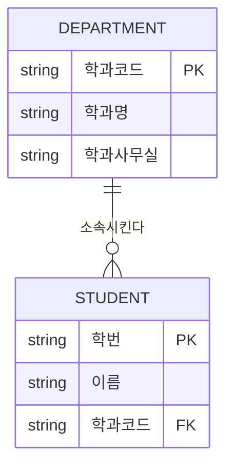

<Callout type="info">
  **이번 문서의 목표:** 이 파일을 다 읽으면 릴레이션·튜플·속성·도메인·차수·기수를 정확한 정의로 구분할 수 있고, 슈퍼키부터 외래키까지 다섯 가지 키를 실제 테이블 예제에서 직접 찾아낼 수 있으며, 네 가지 무결성 제약이 각각 어떤 위반을 막는지 설명할 수 있다.
</Callout>

## 릴레이션이라는 이름의 정체

### 왜 필요한가

05편에서 집합론을 다시 짚은 이유가 여기서 바로 쓰인다. SQL을 다루다 보면 "테이블(table)"이라는 말에 너무 익숙해져서, 그 뒤에 있는 수학적 정의를 건너뛰기 쉽다. 그런데 독학사 4단계는 "테이블을 다룰 줄 아는가"가 아니라 "관계 데이터 모델(relational data model)의 이론적 정의를 정확히 아는가"를 묻는다. 예를 들어 "릴레이션의 튜플 사이에는 순서가 있다"거나 "하나의 속성에 여러 값이 들어갈 수 있다"처럼 틀린 진술을 정답처럼 위장한 보기가 자주 나오는데, 정의를 정확히 알지 못하면 이런 함정을 골라내지 못한다.

> **쉽게 말하면:** 릴레이션은 "정해진 열(속성)을 가진, 순서 없고 중복 없는 행(튜플)들의 집합"이다.

### 정의

**릴레이션**(relation)은 관계 데이터 모델에서 데이터를 저장하는 기본 구조로, SQL의 테이블(table)에 대응한다. 릴레이션을 정의하려면 먼저 아래 다섯 가지 용어를 순서대로 알아야 한다.

1. **도메인**(domain): 어떤 속성이 가질 수 있는 값들의 집합이다. 예를 들어 "학년" 속성의 도메인은 `{1, 2, 3, 4}`라는 정수 집합이고, "이름" 속성의 도메인은 한글 20자 이내의 문자열 집합이다. 도메인은 그 값이 "어떤 종류의 데이터인지"를 규정하는 틀이다.
2. **속성**(attribute): 릴레이션을 구성하는 열(column) 하나를 가리키는 이름이다. 각 속성은 반드시 하나의 도메인에 대응한다. 예를 들어 STUDENT 릴레이션의 "학번", "이름", "학년"이 각각 속성이다.
3. **튜플**(tuple): 각 속성에 실제 값이 채워진 하나의 행(row)이다. 예를 들어 `(20240001, '김민준', 2)`처럼 속성 값들의 순서 있는 나열이 튜플 하나다.
4. **릴레이션 스키마**(relation schema): 릴레이션의 이름과 그 릴레이션을 구성하는 속성들의 집합을 정의한 틀이다. `STUDENT(학번, 이름, 학년)`처럼 표기하며, 실제 데이터가 채워지기 전의 "설계도"에 해당한다.
5. **릴레이션 인스턴스**(relation instance): 어떤 시점에 릴레이션 스키마에 실제로 채워져 있는 튜플들의 집합이다. 흔히 "릴레이션"이라고 하면 이 인스턴스를 가리킨다.

이제 릴레이션을 정식으로 정의할 수 있다. **릴레이션**은 릴레이션 스키마 $R(A_1, A_2, \ldots, A_n)$에 대해, 각 속성 $A_i$의 도메인을 $D_i$라 할 때 $D_1 \times D_2 \times \cdots \times D_n$(05편의 카티전 곱)의 부분집합이다. 즉 릴레이션은 "가능한 모든 속성값 조합" 중에서 실제로 존재하는 튜플들만 모아 놓은 **튜플의 집합**이다.

이 정의에서 두 가지 중요한 성질이 바로 따라 나온다. 05편에서 다룬 "집합에는 중복과 순서가 없다"는 성질이 릴레이션에도 그대로 적용되기 때문이다.

- **튜플의 중복이 없다.** 릴레이션은 집합이므로, 완전히 같은 값을 가진 튜플이 두 번 이상 존재할 수 없다. 이 성질이 뒤에서 다룰 기본키(primary key)가 반드시 필요한 이유의 근거가 된다.
- **튜플 사이에 순서가 없다.** 어떤 튜플이 몇 번째 행에 있는지는 릴레이션의 정의에 포함되지 않는다. SQL에서 `ORDER BY` 없이 조회한 결과의 행 순서를 보장할 수 없는 이유가 여기에 있다.

여기에 한 가지 성질이 더해진다.

- **속성 값은 원자값(atomic value)이어야 한다.** 하나의 속성 칸에는 더는 쪼갤 수 없는 단일 값만 들어가야 하며, 목록이나 여러 값을 한 칸에 넣을 수 없다. 이 조건을 만족하지 못하는 릴레이션을 **비정규 릴레이션**(unnormalized relation)이라 하며, 16편에서 다룰 제1정규형(1NF)의 출발점이 된다.

### 작은 예시

아래는 대학교의 학생 정보를 담은 STUDENT 릴레이션의 예다.

| 학번 | 이름 | 학년 | 학과 |
|---|---|---|---|
| 20240001 | 김민준 | 2 | 컴퓨터공학 |
| 20240002 | 이서연 | 3 | 컴퓨터공학 |
| 20230005 | 박도윤 | 4 | 전자공학 |
| 20220012 | 최지우 | 4 | 컴퓨터공학 |

이 표에서 "학번, 이름, 학년, 학과"는 속성이고, 각 행(예: `(20240001, '김민준', 2, '컴퓨터공학')`)은 튜플이며, `STUDENT(학번, 이름, 학년, 학과)`는 릴레이션 스키마다.

### 차수와 기수

**차수**(degree)는 릴레이션이 가진 속성의 개수다. STUDENT 릴레이션은 학번·이름·학년·학과 네 개의 속성을 가지므로 차수는 4다. **기수**(cardinality)는 릴레이션에 실제로 들어 있는 튜플의 개수다. 위 예시는 튜플이 4개이므로 기수는 4다. 차수는 릴레이션 스키마가 정해지면 (열을 추가·삭제하기 전까지는) 고정되지만, 기수는 데이터가 삽입·삭제될 때마다 계속 바뀐다는 점에서 두 개념의 성격이 다르다.

### 자주 틀리는 점

<Callout type="warning">
  **자주 틀리는 함정**: "릴레이션의 튜플은 삽입된 순서대로 저장되고 조회된다"거나 "하나의 속성에 여러 개의 학과를 콤마로 나열해 저장할 수 있다"는 보기가 틀린 진술로 나온다. 릴레이션은 순서 없는 튜플의 집합이므로 저장 순서를 전제할 수 없고, 원자값 조건 때문에 한 칸에 여러 값을 몰아넣는 것도 관계 데이터 모델의 정의를 어기는 것이다. 또한 "차수와 기수를 서로 바꿔 설명"하는 보기(예: "차수는 행의 개수, 기수는 열의 개수")도 반복 출제되므로, 차수는 열(속성) 개수, 기수는 행(튜플) 개수라는 짝을 정확히 기억해야 한다.
</Callout>

## 키의 종류: 슈퍼키에서 외래키까지

### 왜 필요한가

릴레이션에 중복 튜플이 없다는 성질을 실제로 보장하려면, "이 릴레이션에서 튜플 하나를 유일하게 구별해 주는 속성(들의 조합)"이 무엇인지 정해야 한다. 이 역할을 하는 속성 조합을 통틀어 **키**(key)라 부르며, 독학사 시험에서는 슈퍼키·후보키·기본키·대체키·외래키 다섯 가지를 정의만이 아니라 실제 테이블에서 골라내는 문제로 자주 낸다.

> **쉽게 말하면:** 키는 "이 값(들)을 알면 튜플을 한 개로 딱 찍어낼 수 있는 속성 조합"이다. 다섯 가지 키는 그 조합을 고르는 기준이 서로 다를 뿐이다.

### 정의

아래 STUDENT 릴레이션을 예로 각 키를 정의한다. 이 릴레이션에서는 "학번"이 유일하고, "주민등록번호"도 유일하며, "이름"은 겹칠 수 있다고 가정한다.

| 학번 | 주민등록번호 | 이름 | 학년 | 학과 |
|---|---|---|---|---|
| 20240001 | 040512-3****** | 김민준 | 2 | 컴퓨터공학 |
| 20240002 | 041130-4****** | 이서연 | 3 | 컴퓨터공학 |
| 20230005 | 030228-3****** | 김민준 | 4 | 전자공학 |

1. **슈퍼키**(superkey): 릴레이션의 튜플을 유일하게 구별할 수 있는 속성(들의 조합)이면 전부 슈퍼키다. `{학번}`도 슈퍼키이고, `{학번, 이름}`처럼 필요 없는 속성을 더 붙여도 여전히 유일성이 유지되므로 슈퍼키다. 즉 슈퍼키는 "유일성만 만족하면" 되고, 최소성은 요구하지 않는다.
2. **후보키**(candidate key): 슈퍼키 중에서 **최소성**(minimality)을 만족하는 것이다. 즉 그 조합에서 어떤 속성을 하나라도 빼면 더는 유일성이 보장되지 않는 슈퍼키만 후보키가 된다. 위 예에서는 `{학번}`과 `{주민등록번호}`가 각각 후보키다. `{학번, 이름}`은 슈퍼키이지만, "이름"을 빼도 "학번"만으로 이미 유일하므로 최소성을 만족하지 못해 후보키가 아니다.
3. **기본키**(primary key): 여러 후보키 중에서 데이터베이스 설계자가 대표로 선정한 딱 하나의 키다. 위 예에서 `{학번}`과 `{주민등록번호}` 중 하나를 골라 기본키로 지정한다(개인정보 보호를 고려하면 보통 학번을 고른다).
4. **대체키**(alternate key): 후보키였지만 기본키로 선정되지 않고 남은 나머지 후보키다. `{학번}`을 기본키로 골랐다면 `{주민등록번호}`가 대체키가 된다.
5. **외래키**(foreign key): 어떤 릴레이션의 속성(들의 조합)이 **다른 릴레이션(또는 같은 릴레이션)의 기본키를 참조**하는 경우, 그 속성을 외래키라 한다. 외래키는 두 릴레이션 사이의 관계(참조 관계)를 표현하는 연결 고리 역할을 한다.

### 작은 예시: 외래키로 두 릴레이션 연결하기

DEPARTMENT(학과) 릴레이션과 STUDENT(학생) 릴레이션이 있고, 학생은 반드시 하나의 학과에 소속된다고 하자.

| 학과코드(기본키) | 학과명 | 학과사무실 |
|---|---|---|
| CS | 컴퓨터공학 | 공학관 401호 |
| EE | 전자공학 | 공학관 302호 |

| 학번(기본키) | 이름 | 학과코드(외래키) |
|---|---|---|
| 20240001 | 김민준 | CS |
| 20240002 | 이서연 | CS |
| 20230005 | 박도윤 | EE |

여기서 STUDENT 릴레이션의 "학과코드" 속성은 DEPARTMENT 릴레이션의 기본키인 "학과코드"를 그대로 값으로 가져와 참조하고 있으므로, STUDENT의 "학과코드"는 외래키다. 이 관계를 도식으로 표현하면 다음과 같다.

erDiagram의 `||--o{`는 "DEPARTMENT 하나가 STUDENT 여러 개와 관계를 맺는다(1:N 관계)"는 뜻이며, 이 표기법 자체는 04편에서 이미 익힌 것을 그대로 재사용한 것이다. 자세한 표기법은 04편을 참고하고, 여기서는 "기본키를 그대로 가져와 참조하는 속성이 외래키"라는 정의에 집중한다.

### 결과 해석

다섯 가지 키의 관계를 한 문장으로 정리하면 다음과 같다. 슈퍼키는 후보키를 포함하는 더 넓은 개념이고, 후보키 중 하나가 기본키로 뽑히면 나머지 후보키는 대체키가 되며, 외래키는 이 모든 것과 별개로 "다른 릴레이션을 가리키는 역할"을 하는 속성이다. 즉 외래키는 자신이 속한 릴레이션에서는 기본키가 아니어도 되고(중복 값을 가질 수 있다), 심지어 널(NULL, 값이 없음)이 허용되는 경우도 있다(선택적 참여 관계일 때).

아래 표로 다섯 키의 관계를 한눈에 비교한다.

| 키 | 유일성 | 최소성 | 개수 | 핵심 특징 |
|---|---|---|---|---|
| 슈퍼키 | 만족 | 요구하지 않음 | 여러 개 가능 | 유일성만 있으면 전부 슈퍼키 |
| 후보키 | 만족 | 만족 | 여러 개 가능 | 기본키가 될 자격이 있는 최소 슈퍼키 |
| 기본키 | 만족 | 만족 | 릴레이션당 1개 | 후보키 중 대표로 선정된 것 |
| 대체키 | 만족 | 만족 | 여러 개 가능 | 기본키로 뽑히지 못한 나머지 후보키 |
| 외래키 | 요구하지 않음 | 요구하지 않음 | 여러 개 가능 | 다른 릴레이션의 기본키를 참조하는 속성 |

### 자주 틀리는 점

<Callout type="warning">
  **자주 틀리는 함정**: "슈퍼키는 후보키보다 항상 속성 개수가 많다"는 진술은 틀렸다. 후보키 자체도 슈퍼키의 한 종류이므로(최소성을 만족하는 슈퍼키), 후보키와 슈퍼키의 속성 개수가 같은 경우도 당연히 있다. 정확히 말하면 "모든 후보키는 슈퍼키이지만, 모든 슈퍼키가 후보키인 것은 아니다"이다. 또한 "외래키는 반드시 그 릴레이션의 기본키와 다른 속성이어야 한다"는 것도 틀렸다. 같은 속성이 자신의 릴레이션에서는 기본키이면서 동시에 다른 릴레이션을 참조하는 외래키일 수도 있고(계층 구조가 있는 경우), 자기 자신을 참조하는 **재귀적 외래키**(self-referencing foreign key, 예: 사원 릴레이션의 "상급자사번"이 같은 사원 릴레이션의 "사번"을 참조)도 가능하다.
</Callout>

## 무결성 제약: 데이터가 지켜야 할 네 가지 규칙

### 왜 필요한가

키를 정의하는 것만으로는 데이터가 항상 올바르게 유지된다고 보장할 수 없다. 예를 들어 기본키에 중복된 값이나 빈 값이 들어가거나, 외래키가 존재하지 않는 부모 데이터를 가리키거나, 나이 속성에 "abc" 같은 값이 들어가는 등의 오류를 막으려면 별도의 규칙이 필요하다. 이 규칙들을 통틀어 **무결성 제약**(integrity constraint)이라 하며, 독학사 출제기준은 엔티티 무결성·참조 무결성·도메인 무결성·사용자 정의 무결성 네 가지를 다룬다.

> **쉽게 말하면:** 무결성 제약은 "데이터베이스에 절대 들어와서는 안 되는 잘못된 데이터의 형태"를 미리 정해 놓은 규칙이다.

### 정의

1. **엔티티 무결성**(entity integrity): 기본키를 구성하는 속성은 **널 값을 가질 수 없다**는 제약이다. 기본키가 널이면 그 튜플을 다른 튜플과 구별할 방법이 없어져, 릴레이션에 중복 튜플이 없다는 정의 자체가 무너지기 때문이다.
2. **참조 무결성**(referential integrity): 외래키 값은 반드시 **참조하는 릴레이션에 실제로 존재하는 기본키 값이거나 널**이어야 한다는 제약이다. 예를 들어 STUDENT의 "학과코드"에 "MATH"라는 값이 들어 있는데 DEPARTMENT 릴레이션에 "MATH"라는 학과코드가 없다면, 이는 참조 무결성 위반이다.
3. **도메인 무결성**(domain integrity): 각 속성의 값은 그 속성에 정의된 도메인(자료형·범위·형식)을 벗어날 수 없다는 제약이다. "학년" 속성에 정수 1~4만 허용하도록 정의했다면, "다섯"이나 5.5, "일학년" 같은 값은 도메인 무결성 위반이다.
4. **사용자 정의 무결성**(user-defined integrity, 업무 규칙 무결성이라고도 한다): 앞의 세 가지로는 표현할 수 없는, 그 업무 도메인에서만 통용되는 규칙이다. 예를 들어 "재고 수량은 0 이상이어야 한다", "종강일은 반드시 개강일보다 뒤여야 한다"처럼 업무 상식에서 나오는 제약이 여기에 속한다.

### 작은 예시

앞서 만든 DEPARTMENT와 STUDENT 릴레이션에 각 무결성 제약을 적용해 보면 다음과 같다.

| 위반 사례 | 위반된 제약 | 이유 |
|---|---|---|
| STUDENT의 학번이 비어 있는(NULL) 튜플을 삽입 | 엔티티 무결성 | 기본키는 널을 허용하지 않는다 |
| STUDENT의 학과코드에 "ME"(기계공학)를 넣었는데 DEPARTMENT에 "ME"가 없음 | 참조 무결성 | 외래키는 존재하는 기본키 값만 참조할 수 있다 |
| STUDENT의 학년에 "10"을 넣음(1–4학년만 허용하는 도메인) | 도메인 무결성 | 정의된 값의 범위를 벗어났다 |
| STUDENT의 입학년도가 졸업년도보다 뒤인 튜플을 삽입 | 사용자 정의 무결성 | 논리적으로 성립할 수 없는 업무 규칙 위반 |

### 결과 해석

이 네 가지 제약은 SQL로 구현될 때 서로 다른 문법으로 나타난다. 12편에서 배울 `PRIMARY KEY` 제약이 엔티티 무결성을, `FOREIGN KEY ... REFERENCES` 제약이 참조 무결성을, `CHECK`나 `NOT NULL`, 자료형 선언이 도메인 무결성을, 그리고 `CHECK` 제약이나 트리거(trigger)가 사용자 정의 무결성을 구현하는 도구가 된다. 즉 지금 배운 이론적 분류가 이후 SQL 실습에서 "이 제약을 어떤 문법으로 걸어야 하는가"를 판단하는 기준이 된다.

### 자주 틀리는 점

<Callout type="warning">
  **자주 틀리는 함정**: 참조 무결성을 "외래키는 반드시 값이 있어야 한다"로 오해하는 경우가 많다. 실제로는 외래키가 **널을 허용하는 경우도 있다.** 예를 들어 "아직 학과를 배정받지 않은 신입생"처럼 참조가 선택적인 관계라면, 외래키에 널을 넣는 것은 참조 무결성 위반이 아니다. 참조 무결성이 금지하는 것은 "존재하지 않는 값을 참조하는 것"이지 "값이 없는 것"이 아니다. 또한 "삭제·수정 시 참조 무결성을 유지하는 방법(CASCADE·RESTRICT·SET NULL 등)"은 참조 무결성 자체의 정의가 아니라 그 제약을 어떻게 실행 시점에 처리할지에 대한 정책이라는 점도 구분해 기억해야 한다.
</Callout>

## 핵심 정리

- 릴레이션은 릴레이션 스키마 위에서 정의되는 튜플들의 집합으로, 중복 튜플이 없고 튜플 사이에 순서가 없으며 속성 값은 원자값이어야 한다. 차수는 속성(열) 개수, 기수는 튜플(행) 개수다.
- 슈퍼키는 유일성만 만족하는 속성 조합, 후보키는 유일성과 최소성을 모두 만족하는 슈퍼키, 기본키는 후보키 중 대표로 선정된 것, 대체키는 기본키로 뽑히지 못한 나머지 후보키, 외래키는 다른(또는 같은) 릴레이션의 기본키를 참조하는 속성이다.
- 엔티티 무결성은 기본키의 널 금지, 참조 무결성은 외래키가 존재하는 기본키 값이거나 널이어야 한다는 제약, 도메인 무결성은 속성 값이 정의된 도메인을 벗어나면 안 된다는 제약, 사용자 정의 무결성은 앞의 세 제약으로 표현할 수 없는 업무 규칙이다.
- 외래키는 자신이 속한 릴레이션의 기본키가 아니어도 되고, 관계가 선택적이면 널을 가질 수도 있다.

## 마무리 복습

<Quiz
  questionNumber={1}
  question="릴레이션에 대한 설명으로 옳은 것은?"
  options={['릴레이션의 튜플은 삽입된 순서대로 저장되고 조회되어야 한다', '릴레이션은 중복된 튜플을 포함할 수 없는 튜플들의 집합이다', '하나의 속성 값에는 여러 개의 값을 콤마로 나열해 저장할 수 있다', '릴레이션의 차수는 튜플의 개수를 의미한다']}
  correctAnswer={2}
  explanation="릴레이션은 수학적으로 집합으로 정의되므로, 집합의 성질에 따라 중복된 원소(튜플)를 가질 수 없다."
  optionExplanations={['릴레이션은 순서 없는 집합이므로 저장·조회 순서를 전제로 할 수 없다', '집합의 정의상 중복 원소가 없으므로 이 설명이 정답이다', '속성 값은 원자값이어야 하므로 한 칸에 여러 값을 나열할 수 없다', '차수는 속성(열)의 개수를 뜻하며, 튜플의 개수는 기수라고 부른다']}
/>

<Quiz
  questionNumber={2}
  question="어떤 릴레이션의 속성이 8개이고 튜플이 150개일 때, 이 릴레이션의 차수와 기수를 옳게 짝지은 것은?"
  options={['차수 150, 기수 8', '차수 8, 기수 150', '차수 8, 기수 8', '차수 150, 기수 150']}
  correctAnswer={2}
  explanation="차수는 속성(열)의 개수이므로 8이고, 기수는 튜플(행)의 개수이므로 150이다."
  optionExplanations={['차수와 기수의 정의가 서로 바뀌어 있으므로 틀렸다', '속성 개수 8을 차수로, 튜플 개수 150을 기수로 옳게 짝지었으므로 정답이다', '기수는 튜플 개수인 150이어야 하며 8이 아니다', '차수는 속성 개수인 8이어야 하며 150이 아니다']}
/>

<Quiz
  questionNumber={3}
  question="후보키와 슈퍼키의 관계에 대한 설명으로 옳은 것은?"
  options={['모든 슈퍼키는 후보키이다', '모든 후보키는 슈퍼키이지만, 모든 슈퍼키가 후보키인 것은 아니다', '슈퍼키와 후보키는 서로 아무 관련이 없는 별개의 개념이다', '후보키는 항상 슈퍼키보다 속성 개수가 많다']}
  correctAnswer={2}
  explanation="후보키는 최소성을 만족하는 슈퍼키이므로 모든 후보키는 슈퍼키에 포함되지만, 최소성을 만족하지 못하는 슈퍼키도 존재하므로 모든 슈퍼키가 후보키인 것은 아니다."
  optionExplanations={['최소성을 만족하지 못하는 슈퍼키는 후보키가 아니므로 이 설명은 틀렸다', '후보키가 슈퍼키의 부분집합 관계에 있다는 것을 정확히 서술했으므로 정답이다', '후보키는 슈퍼키 중 최소성을 만족하는 것으로 서로 밀접하게 연결된 개념이다', '후보키는 최소성을 만족해야 하므로 오히려 불필요한 속성이 없는 더 작은(또는 같은) 조합이다']}
/>

<Quiz
  questionNumber={4}
  question="외래키에 대한 설명으로 옳지 않은 것은?"
  options={['외래키는 다른 릴레이션의 기본키를 참조하는 속성이다', '외래키 값은 항상 널이 될 수 없다', '외래키는 자기 자신이 속한 릴레이션을 참조하는 재귀적 외래키로 쓰일 수도 있다', '외래키는 자신이 속한 릴레이션 안에서 중복된 값을 가질 수 있다']}
  correctAnswer={2}
  explanation="참조 관계가 선택적인 경우 외래키는 널을 허용할 수 있으므로, 외래키가 항상 널이 될 수 없다는 설명은 옳지 않다."
  optionExplanations={['외래키의 정의를 정확히 서술한 옳은 설명이다', '선택적 참여 관계에서는 외래키에 널이 허용될 수 있으므로 이 설명이 틀렸고, 따라서 이 문제의 정답이다', '사원 릴레이션의 상급자사번처럼 재귀적 외래키가 실제로 쓰이므로 옳은 설명이다', '외래키는 유일성을 요구하지 않으므로 중복 값을 가질 수 있다는 것은 옳은 설명이다']}
/>

<Quiz
  questionNumber={5}
  question="다음 중 참조 무결성 위반에 해당하는 경우는?"
  options={['STUDENT 릴레이션의 학과코드가 널로 비어 있는 경우', 'STUDENT 릴레이션의 학번이 널로 비어 있는 경우', 'STUDENT 릴레이션의 학과코드에 DEPARTMENT에 존재하지 않는 값이 들어간 경우', 'STUDENT 릴레이션의 학년에 5라는 값이 들어간 경우']}
  correctAnswer={3}
  explanation="참조 무결성은 외래키 값이 참조하는 릴레이션에 실제로 존재하는 기본키 값이거나 널이어야 한다는 제약이므로, 존재하지 않는 값을 참조하면 참조 무결성 위반이다."
  optionExplanations={['참조가 선택적인 관계에서는 외래키가 널을 가질 수 있으므로 이 자체는 참조 무결성 위반이 아니다', '기본키가 널인 것은 엔티티 무결성 위반이다', '외래키가 존재하지 않는 부모 값을 참조하는 것이 참조 무결성 위반의 정확한 사례이므로 정답이다', '정의된 범위를 벗어난 값이 들어간 것은 도메인 무결성 위반이다']}
/>

<Quiz
  questionNumber={6}
  question="다음 중 사용자 정의 무결성에 해당하는 예로 가장 적절한 것은?"
  options={['기본키에는 널 값이 허용되지 않는다', '외래키 값은 참조하는 릴레이션에 존재해야 한다', '속성 값은 정의된 자료형과 범위를 벗어날 수 없다', '상품의 할인 가격은 정가보다 낮아야 한다는 업무 규칙']}
  correctAnswer={4}
  explanation="상품의 할인 가격이 정가보다 낮아야 한다는 규칙은 그 업무 도메인에서만 통용되는 논리이며, 엔티티·참조·도메인 무결성으로는 표현할 수 없어 사용자 정의 무결성으로 분류된다."
  optionExplanations={['기본키의 널 금지는 엔티티 무결성에 대한 설명이다', '외래키의 참조 조건은 참조 무결성에 대한 설명이다', '자료형·범위 제한은 도메인 무결성에 대한 설명이다', '해당 업무에서만 성립하는 규칙이므로 사용자 정의 무결성의 예로 정답이다']}
/>

## 참고 자료

- [국가평생교육진흥원 독학학위제](https://bdes.nile.or.kr)
- [Oracle Database SQL Language Reference](https://docs.oracle.com)
