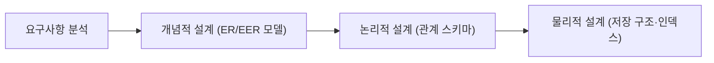
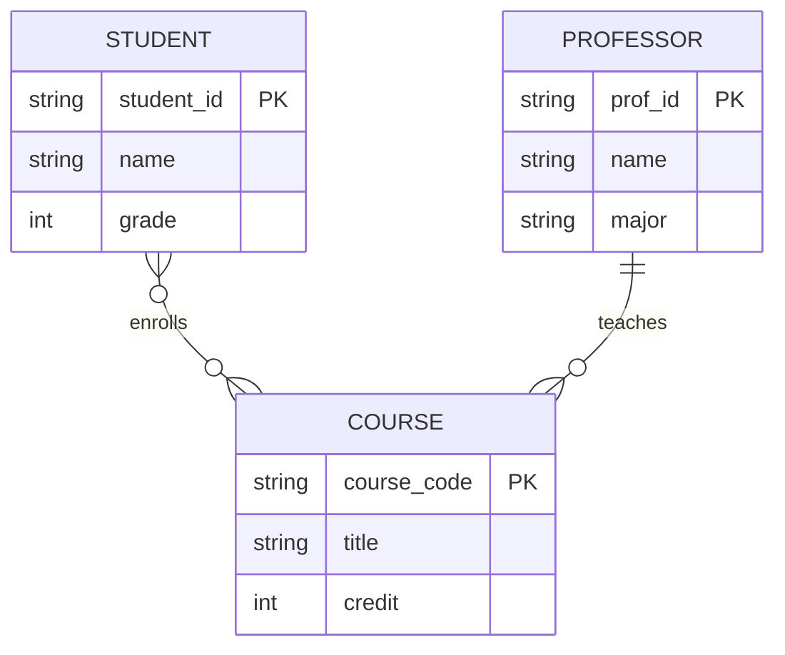
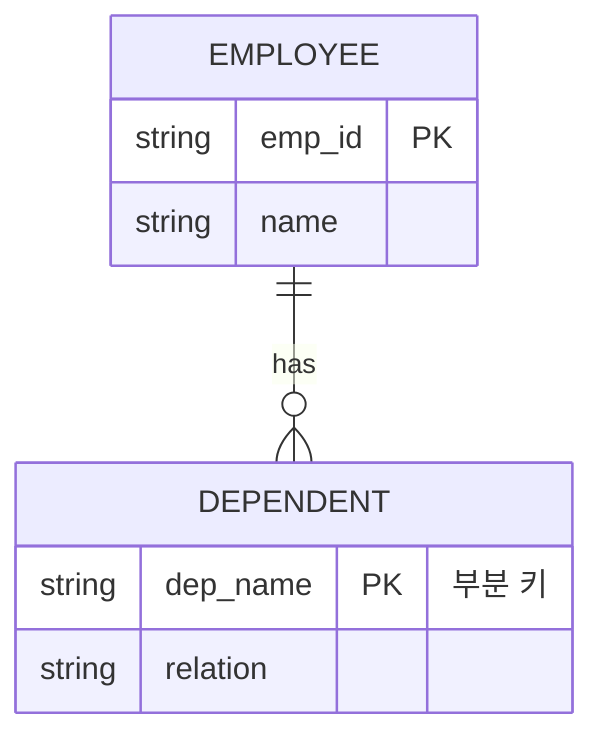
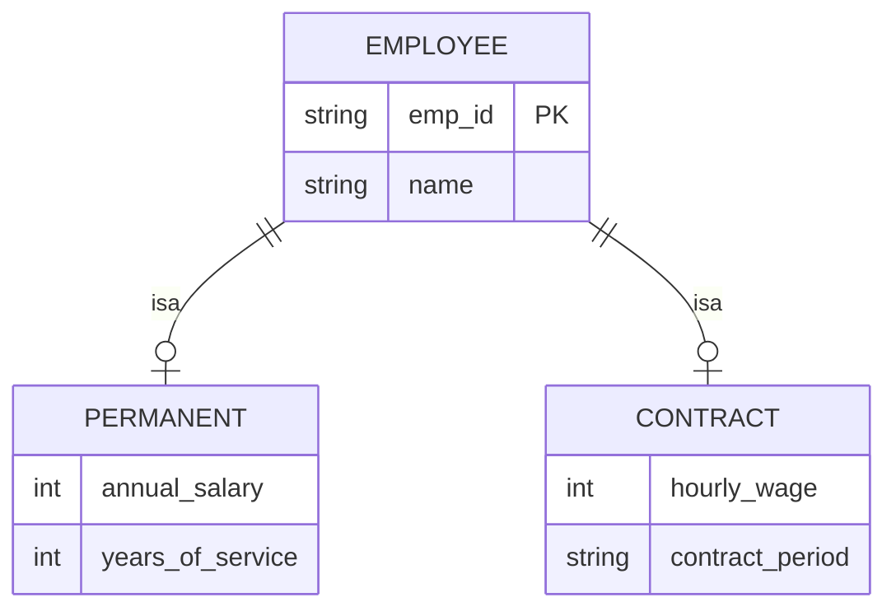
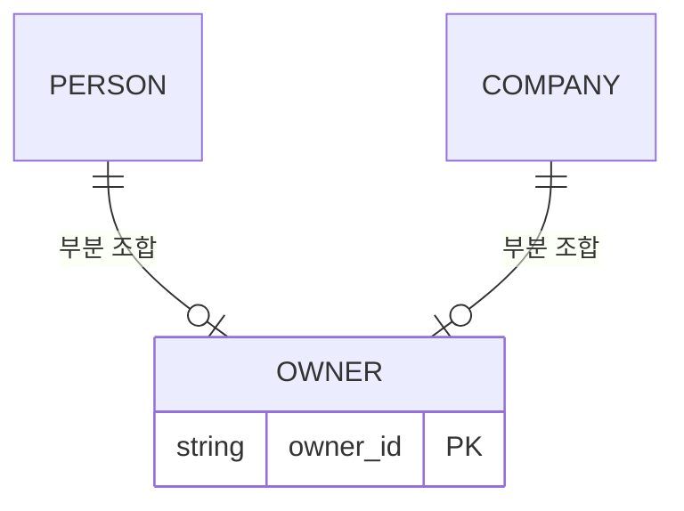
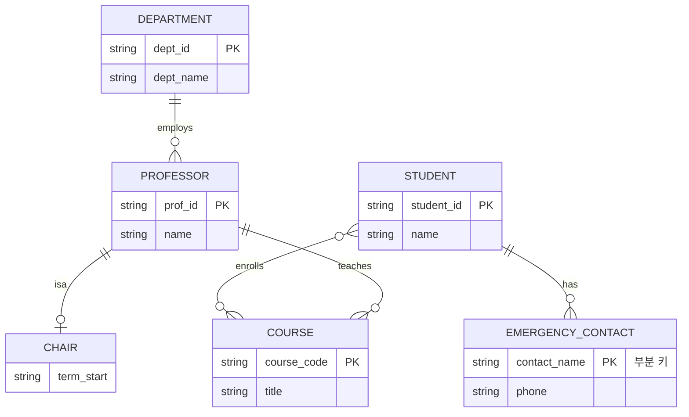

<Callout type="info">
  **이번 문서의 목표:** 이 문서를 다 읽으면 요구사항을 보고 엔티티 집합·관계 집합·카디널리티를 직접 설계할 수 있고, 약한 엔티티와 ISA 상속을 구분해 EER 다이어그램을 그릴 수 있다.
</Callout>

## 왜 개념적 설계가 먼저인가

데이터베이스를 만들 때 곧바로 SQL의 `CREATE TABLE` 문을 쓰는 사람은 없다. 요구사항을 다 파악하지 못한 채 테이블부터 만들면, 나중에 "부서 하나에 직원이 여러 명 있을 수 있는데 왜 테이블 구조가 1대1처럼 되어 있지"처럼 구조를 뒤엎는 문제가 생긴다. 그래서 실제 설계는 세 단계를 거친다.

**개념적 설계**(conceptual design)는 특정 DBMS나 자료구조를 전혀 신경 쓰지 않고, "이 업무에는 어떤 대상(사물)이 있고 그 대상들이 서로 어떤 관계를 맺는가"만 사람이 이해하기 쉬운 그림으로 표현하는 단계다. 이때 쓰는 도구가 **ER 모델**(Entity-Relationship model, 개체-관계 모델)이며, 이를 확장한 것이 **EER 모델**(Enhanced ER model, 확장 개체-관계 모델)이다. 04편에서 ER/EER의 기호와 용어(엔티티, 속성, 관계, 카디널리티 표기법 등)를 이미 정리했으므로, 이 문서에서는 그 기호들을 **실제로 어떻게 설계에 적용하는지**, 그리고 04편에서 다루지 않은 EER 확장 개념(전문화·일반화·범주)까지 깊게 다룬다.

> **쉽게 말하면:** 개념적 설계는 "무엇을 저장할지"를 그림으로 정리하는 단계이고, 이 그림을 SQL 테이블로 바꾸는 작업은 다음 편(11편)에서 다룬다.

## 엔티티 집합 설계 — 무엇을 하나의 개체로 볼 것인가

### 정의와 판단 기준

**엔티티**(entity, 개체)는 데이터베이스에 독립적으로 저장할 가치가 있는 실세계의 사물이나 사건이다. 같은 종류의 속성을 가진 엔티티들의 모임을 **엔티티 집합**(entity set) 또는 엔티티 타입(entity type)이라고 한다. 예를 들어 대학교 수강신청 시스템을 설계한다면, "학생", "과목", "교수"는 각각 독립적으로 존재하고 스스로 식별될 수 있는 개체이므로 엔티티 집합 후보가 된다.

엔티티인지 아닌지 헷갈리는 대표적인 경우가 "속성으로 둘 것인가, 별도 엔티티로 둘 것인가"의 판단이다. 판단 기준은 다음과 같다.

1. **그 대상 자체가 여러 개의 속성을 가지는가.** 예를 들어 "학과"가 단순히 이름 하나만 갖는다면 학생 엔티티의 속성(`dept_name`)으로 둘 수 있지만, 학과에 학과장·설립연도·정원처럼 여러 속성이 딸려 있다면 별도 엔티티로 분리하는 것이 낫다.
2. **다른 엔티티와 독립적으로 여러 개 연결될 수 있는가.** 학과 하나에 학생이 여러 명, 교수가 여러 명 속한다면 학과는 독자적인 정체성을 가지는 엔티티로 봐야 한다.
3. **그 자체로 이력·시점 관리가 필요한가.** 예를 들어 "수강신청"은 학생과 과목이 어느 학기에 연결되었는지를 따로 기록해야 하므로, 단순한 속성이 아니라 엔티티(또는 관계 집합에 속성을 붙인 형태)로 다뤄야 한다.

> **쉽게 말하면:** "이것이 스스로 여러 속성을 갖고, 다른 것들과 여러 번 연결되고, 따로 기록을 남겨야 한다면" 엔티티로 독립시킨다.

### 예시로 적용하기 — 대학 수강신청 도메인

다음 요구사항을 보고 엔티티 집합을 뽑아 보자.

> "학생은 학번·이름·학년을 가진다. 과목은 과목코드·과목명·학점을 가진다. 교수는 교번·이름·전공을 가진다. 각 과목은 한 학기에 여러 교수가 나누어 강의할 수 있다."

이 문장에서 "학번·이름·학년"처럼 스스로 여러 속성을 갖고, 문장의 주어로 반복해서 등장하는 명사(학생, 과목, 교수)가 엔티티 집합 후보다.

<table>
<thead><tr><th>엔티티 집합</th><th>속성</th><th>키 속성</th></tr></thead>
<tbody>
<tr><td>학생(Student)</td><td>학번, 이름, 학년</td><td>학번</td></tr>
<tr><td>과목(Course)</td><td>과목코드, 과목명, 학점</td><td>과목코드</td></tr>
<tr><td>교수(Professor)</td><td>교번, 이름, 전공</td><td>교번</td></tr>
</tbody>
</table>

각 엔티티 집합에서 다른 엔티티와 구별하는 값을 **키 속성**(key attribute)이라고 하며, 다이어그램에서는 밑줄로 표시한다. 이 키 개념은 06편에서 배운 후보키·기본키와 정확히 대응한다.

## 관계 집합과 카디널리티 설계

### 관계 집합이란

**관계 집합**(relationship set)은 둘 이상의 엔티티 집합 사이의 의미 있는 연관을 나타낸다. 위 예시에서 "학생이 과목을 수강한다", "교수가 과목을 강의한다"가 관계 집합이다. 관계에 참여하는 엔티티 집합의 개수를 **관계의 차수**(degree)라고 하며, 두 엔티티 집합 사이의 관계는 **이진 관계**(binary relationship)라고 부른다.

### 카디널리티 비율 — 몇 대 몇으로 연결되는가

**카디널리티 비율**(cardinality ratio)은 한 엔티티 집합의 인스턴스 하나가 다른 엔티티 집합의 인스턴스 몇 개와 관계를 맺을 수 있는지를 나타낸다. 크게 세 가지로 나뉜다.

<table>
<thead><tr><th>카디널리티</th><th>의미</th><th>예시</th></tr></thead>
<tbody>
<tr><td>1대1(1:1)</td><td>양쪽 모두 상대방 인스턴스 하나에만 연결</td><td>사람 – 주민등록번호(한 사람에 번호 하나, 번호 하나에 사람 한 명)</td></tr>
<tr><td>1대다(1:N)</td><td>한쪽은 하나, 다른 쪽은 여러 개와 연결</td><td>학과(1) – 교수(N): 학과 하나에 교수 여러 명, 교수 한 명은 학과 하나</td></tr>
<tr><td>다대다(M:N)</td><td>양쪽 모두 여러 개와 연결 가능</td><td>학생(M) – 과목(N): 학생 한 명이 여러 과목을 듣고, 과목 하나도 여러 학생이 듣는다</td></tr>
</tbody>
</table>

"학생이 과목을 수강한다"는 관계를 다이어그램으로 그리면 다음과 같다. mermaid의 `erDiagram` 표기에서 `}o--o{`는 다대다(M:N, 0개 이상씩 참여 가능)를, `||--o{`는 1대다를 나타낸다.

> **자주 틀리는 점:** 카디널리티를 표기할 때 "학생 쪽에 붙는 숫자"와 "과목 쪽에 붙는 숫자"를 반대로 읽는 실수가 많다. 카디널리티는 **관계선 반대쪽 끝에 붙어 있는 엔티티 집합 인스턴스의 개수 제한**을 뜻한다. 즉 "학생–과목이 1대다"라고 하면, 학생 쪽에 붙는 "다(N)" 표시는 "과목 하나에 학생이 여러 명 연결될 수 있다"는 뜻이지 그 반대가 아니다.

### 참여 제약 — 반드시 참여해야 하는가

**참여 제약**(participation constraint)은 한 엔티티 집합의 모든 인스턴스가 그 관계에 반드시 참여해야 하는지를 나타낸다.

- **전체 참여**(total participation): 그 엔티티 집합의 모든 인스턴스가 반드시 관계에 참여해야 한다. 다이어그램에서는 이중선으로 표시한다. 예를 들어 "모든 교수는 최소 하나의 과목을 강의해야 한다"는 규칙이 있다면 교수–강의 관계에서 교수 쪽은 전체 참여다.
- **부분 참여**(partial participation): 참여하지 않아도 되는 인스턴스가 있을 수 있다. 예를 들어 신규 과목이 개설 준비 중이라 아직 담당 교수가 배정되지 않은 경우가 허용된다면, 과목 쪽은 부분 참여다.

## 약한 엔티티 — 스스로 식별되지 못하는 엔티티

### 정의와 필요성

**약한 엔티티**(weak entity)는 자신만의 속성으로는 유일하게 식별할 수 없어서, 반드시 다른 엔티티(**소유 엔티티**, owner entity 또는 identifying entity)와의 관계를 통해서만 식별되는 엔티티다. 약한 엔티티가 가진, 소유 엔티티 안에서만 유일성을 갖는 속성을 **부분 키**(partial key, discriminator)라고 한다.

전형적인 예로 "부양가족"을 들 수 있다. 부양가족은 이름만으로는 회사 전체에서 유일하게 식별되지 않는다("Kim"이라는 이름의 부양가족이 여러 직원에게 있을 수 있다). 하지만 "어느 직원의 부양가족인가 + 그 직원 안에서의 이름"을 합치면 유일하게 식별된다.

> **쉽게 말하면:** 약한 엔티티는 "부모 없이는 자기 이름만으로 자신을 증명할 수 없는" 엔티티다. 부양가족은 소속 직원이 정해져야 비로소 "누구의 Kim"인지 구별된다.

약한 엔티티를 식별하는 관계를 **식별 관계**(identifying relationship)라고 하며, 다이어그램에서 이중 사각형(약한 엔티티)과 이중 마름모(식별 관계)로 표시하는 것이 04편에서 배운 표기법이다. 약한 엔티티는 소유 엔티티 쪽에 대해 반드시 **전체 참여**를 가진다 — 부양가족은 반드시 어떤 직원에 속해야 하기 때문이다.

> **자주 틀리는 점:** 부분 키는 그 자체로는 키가 아니다. 부분 키(예: `dep_name`)만으로는 유일성이 보장되지 않고, **소유 엔티티의 기본키 + 부분 키**를 합쳐야 비로소 약한 엔티티 전체를 식별하는 완전한 키가 된다. 이 결합 키는 다음 편(11편)에서 관계 스키마로 사상할 때 그대로 기본키가 된다.

## ISA 계층 — 엔티티 사이의 상속

### 왜 필요한가

같은 엔티티 집합 안에 속하지만, 일부 인스턴스만 추가 속성을 가지는 경우가 많다. 예를 들어 "직원" 중에서 "정규직"은 연봉·재직기간을, "계약직"은 계약기간·시급을 추가로 가진다고 하자. 이럴 때 모든 직원 테이블에 두 종류 속성을 다 넣으면 정규직에게는 계약기간이, 계약직에게는 연봉이 항상 비어 있는 낭비가 생긴다. 이 문제를 객체지향 프로그래밍의 **상속**(inheritance) 개념을 빌려 해결하는 것이 **ISA 계층**(ISA hierarchy, "is a" 관계)이다.

### 정의

ISA 관계는 "상위 엔티티(슈퍼클래스, superclass)의 인스턴스 중 일부가 하위 엔티티(서브클래스, subclass)에도 동시에 속한다"는 것을 나타낸다. 서브클래스는 슈퍼클래스의 모든 속성을 물려받고, 자신만의 추가 속성을 가진다.

> **쉽게 말하면:** ISA는 "정규직은 직원이다", "계약직은 직원이다"처럼 서브클래스가 슈퍼클래스의 특수한 경우임을 나타낸다. 정규직·계약직은 직원의 모든 속성(사번, 이름)을 그대로 가지면서 자기만의 속성을 추가로 갖는다.

## EER의 확장 개념 — 전문화·일반화·범주

### 전문화 — 위에서 아래로

**전문화**(specialization)는 하나의 슈퍼클래스를 공통 속성 외에 서로 다른 특징을 가진 여러 서브클래스로 나누는 하향식(top-down) 설계 방식이다. 위의 "직원 → 정규직·계약직" 예시가 전형적인 전문화다. "차량"이라는 슈퍼클래스를 "승용차·화물차·버스"로 나누는 것도 전문화다.

### 일반화 — 아래에서 위로

**일반화**(generalization)는 반대로, 이미 존재하는 여러 엔티티 집합에서 공통된 속성을 뽑아 하나의 슈퍼클래스로 묶어 올리는 상향식(bottom-up) 설계 방식이다. 예를 들어 이미 "저축예금", "적금", "당좌예금"이라는 별도 엔티티 집합이 있는데, 세 집합 모두 "계좌번호·개설일·잔액"을 공통으로 가진다는 것을 발견했다면, 이 공통 속성을 "계좌"라는 슈퍼클래스로 일반화할 수 있다.

> **쉽게 말하면:** 전문화는 큰 것을 잘게 쪼개는 것이고, 일반화는 잘게 쪼개진 것들의 공통점을 찾아 하나로 합치는 것이다. 방향만 반대일 뿐, 결과로 나오는 ISA 계층의 모양은 같다.

### 분리 제약과 전체 제약

전문화·일반화에는 두 가지 독립적인 제약을 함께 표시한다.

1. **분리 제약**(disjointness constraint): 한 인스턴스가 여러 서브클래스에 동시에 속할 수 있는지를 나타낸다. **분리적**(disjoint, 배타적)이면 한 인스턴스는 서브클래스 중 딱 하나에만 속한다(정규직이면서 동시에 계약직일 수는 없다). **중복적**(overlapping)이면 여러 서브클래스에 동시에 속할 수 있다(한 사람이 "학생"이면서 동시에 "조교"일 수 있다).
2. **참여 제약**(completeness constraint, 완전성 제약): 슈퍼클래스의 모든 인스턴스가 반드시 어떤 서브클래스엔가는 속해야 하는지를 나타낸다. **전체**(total): 모든 슈퍼클래스 인스턴스가 반드시 어느 한 서브클래스에 속한다. **부분**(partial): 어느 서브클래스에도 속하지 않는 인스턴스가 있을 수 있다.

<table>
<thead><tr><th>분리 여부</th><th>참여 여부</th><th>의미</th><th>예시</th></tr></thead>
<tbody>
<tr><td>분리적(disjoint)</td><td>전체(total)</td><td>모든 인스턴스가 서로 겹치지 않는 서브클래스 중 하나에 반드시 속함</td><td>모든 직원은 정규직 또는 계약직 중 하나이며 둘 다일 수는 없다</td></tr>
<tr><td>중복적(overlapping)</td><td>부분(partial)</td><td>일부는 여러 서브클래스에 속하고, 어느 서브클래스에도 속하지 않는 인스턴스도 있음</td><td>일부 직원만 정규직 겸 사내강사이고, 어느 쪽도 아닌 신입 인턴도 있음</td></tr>
</tbody>
</table>

### 범주 — 서로 다른 슈퍼클래스를 합치는 서브클래스

**범주**(category, union type)는 지금까지와 반대 방향의 특수한 ISA 관계다. 앞의 ISA는 "서브클래스 하나가 슈퍼클래스 하나로부터 상속"받는 구조였지만, 범주는 **서로 다른 여러 슈퍼클래스 중 어느 하나로부터라도 속하면 되는** 서브클래스를 나타낸다.

예를 들어 "소유주"라는 서브클래스가 있는데, 이 소유주는 "사람" 엔티티일 수도 있고 "회사" 엔티티일 수도 있다고 하자. 소유주는 사람과 회사 양쪽 모두를 부모로 상속받는 것이 아니라, **둘 중 하나에만** 속한다. 이런 관계를 범주라고 하며, 다이어그램에서는 원 안에 U자 기호로 표시한다.

> **자주 틀리는 점:** ISA 계층과 범주를 혼동하기 쉽다. ISA는 "서브클래스가 슈퍼클래스 하나의 속성을 전부 상속"하는 구조이고, 범주는 "서브클래스가 여러 슈퍼클래스 중 하나에만 소속되며, 서로 다른 슈퍼클래스들의 속성 구조가 달라도 된다"는 점에서 다르다. 범주는 흔히 "부분 조합"(partial union)이라고 불리며, 슈퍼클래스들끼리는 서로 아무 관계가 없어도 된다.

## 종합 예시 — 수강신청 도메인에 EER 전부 적용하기

지금까지 배운 개념을 하나의 다이어그램에 종합해 보자. "교수" 중 일부가 "학과장"이라는 추가 역할(전문화, 중복적·부분)을 가지고, "학생"에 딸린 "비상연락처"는 학생 없이는 식별되지 않는 약한 엔티티다.

이 하나의 그림 안에 카디널리티(학과 1 – 교수 N), 약한 엔티티(비상연락처), ISA(학과장), 다대다(학생–과목)가 모두 담겨 있다. 다음 편(11편)에서는 이 그림을 실제 SQL 테이블(관계 스키마)로 정확히 변환하는 규칙을 다룬다.

## 핵심 정리

- 개념적 설계는 요구사항 분석과 논리적 설계(관계 스키마) 사이의 단계로, ER/EER 모델로 "무엇이 있고 어떻게 연결되는지"만 그린다.
- 엔티티 집합은 스스로 여러 속성을 가지고 독립적으로 여러 번 연결되는 대상을 뽑는다. 카디널리티 비율(1:1, 1:N, M:N)과 참여 제약(전체·부분)을 함께 설계한다.
- 약한 엔티티는 부분 키만으로는 식별되지 않고, 소유 엔티티와의 식별 관계를 통해서만 식별되며 소유 엔티티 쪽에 항상 전체 참여한다.
- ISA 계층은 슈퍼클래스·서브클래스 사이의 상속 관계다. 전문화는 하향식, 일반화는 상향식으로 만들어지며 결과 구조는 같다.
- 전문화·일반화에는 분리 제약(분리적·중복적)과 참여 제약(전체·부분)을 함께 표기한다.
- 범주(부분 조합)는 서로 다른 여러 슈퍼클래스 중 하나에만 속하는 특수한 서브클래스로, 일반 ISA와 구분된다.

## 마무리 복습

<Quiz
  questionNumber={1}
  question="다음 중 별도 엔티티 집합으로 분리하기보다 다른 엔티티의 속성으로 두는 것이 더 적절한 경우는?"
  options={['부서 자체가 학과장, 설립연도, 예산 등 여러 속성을 가지고 여러 교수와 연결된다', '고객의 우편번호처럼 그 값 하나만 저장하면 되고 다른 엔티티와 독립적으로 연결될 필요가 없다', '주문마다 배송 이력이 여러 건 반복되어 시점별로 관리해야 한다', '한 창고에 여러 재고 품목이 보관되고 품목마다 별도 속성이 필요하다']}
  correctAnswer={2}
  explanation="우편번호처럼 단일 값이고 다른 엔티티와 독립적으로 여러 번 연결될 필요가 없는 경우는 별도 엔티티가 아니라 속성으로 두는 것이 적절하다."
  optionExplanations={['여러 속성과 여러 연결을 가지므로 엔티티로 분리하는 것이 맞다', '정답이다', '시점별 이력 관리가 필요하므로 엔티티(또는 관계의 속성)로 다뤄야 한다', '독자적인 속성을 가지므로 엔티티로 분리하는 것이 적절하다']}
/>

<Quiz
  questionNumber={2}
  question="학과(Department) 1개에 교수(Professor)가 여러 명 속하고, 교수 한 명은 반드시 하나의 학과에만 속하는 경우의 카디널리티 비율은?"
  options={['1대1', '1대다', '다대다', '이 정보만으로는 판단할 수 없다']}
  correctAnswer={2}
  explanation="학과 하나에 교수가 여러 명 연결되고, 교수 한 명은 학과 하나에만 연결되므로 학과(1) 대 교수(다)의 1대다 관계다."
  optionExplanations={['교수가 여러 명일 수 있으므로 1대1이 아니다', '정답이다', '교수가 여러 학과에 동시에 속하지 않으므로 다대다가 아니다', '문제에서 조건이 명확히 제시되어 판단할 수 있다']}
/>

<Quiz
  questionNumber={3}
  question="약한 엔티티에 대한 설명으로 옳지 않은 것은?"
  options={['부분 키만으로는 약한 엔티티를 유일하게 식별할 수 없다', '소유 엔티티의 기본키와 부분 키를 합쳐야 완전한 식별이 가능하다', '약한 엔티티는 소유 엔티티에 대해 부분 참여를 가지는 것이 일반적이다', '약한 엔티티를 식별하는 관계를 식별 관계라고 부른다']}
  correctAnswer={3}
  explanation="약한 엔티티는 소유 엔티티 없이는 존재 의미가 없으므로 소유 엔티티 쪽에 대해 전체 참여를 가지는 것이 일반적이다. 부분 참여라는 설명이 옳지 않다."
  optionExplanations={['부분 키는 소유 엔티티 안에서만 유일성을 가지므로 옳은 설명이다', '완전한 키는 소유 엔티티의 기본키와 부분 키의 결합이므로 옳은 설명이다', '옳지 않은 설명이다 — 전체 참여가 일반적이다', '식별 관계라는 용어 정의가 옳다']}
/>

<Quiz
  questionNumber={4}
  question="전문화(specialization)와 일반화(generalization)의 관계를 가장 정확히 설명한 것은?"
  options={['전문화는 하향식으로 슈퍼클래스를 서브클래스로 나누고, 일반화는 상향식으로 서브클래스의 공통점을 슈퍼클래스로 묶는다', '전문화는 서브클래스를 먼저 설계하고 나중에 슈퍼클래스를 삭제하는 기법이다', '일반화는 항상 분리적이고 전체 참여 제약을 가진다', '전문화와 일반화는 서로 전혀 다른 결과 구조를 만든다']}
  correctAnswer={1}
  explanation="전문화는 하향식(슈퍼클래스에서 서브클래스로), 일반화는 상향식(서브클래스에서 슈퍼클래스로) 설계 방향이며, 두 방식 모두 결과적으로 같은 형태의 ISA 계층을 만든다."
  optionExplanations={['정답이다', '슈퍼클래스를 삭제하는 기법이 아니라 방향만 반대인 설계 접근이다', '분리·참여 제약은 도메인 규칙에 따라 달라지며 항상 고정되지 않는다', '방향만 다를 뿐 결과 ISA 계층 구조는 동일하다']}
/>

<Quiz
  questionNumber={5}
  question="정규직과 계약직이 서로 겹칠 수 없고, 모든 직원이 반드시 둘 중 하나에 속해야 한다면 이 전문화의 제약으로 옳은 것은?"
  options={['중복적(overlapping) + 부분(partial)', '분리적(disjoint) + 전체(total)', '분리적(disjoint) + 부분(partial)', '중복적(overlapping) + 전체(total)']}
  correctAnswer={2}
  explanation="서로 겹칠 수 없으므로 분리적이고, 모든 직원이 반드시 어느 한쪽에 속해야 하므로 전체 참여 제약이다."
  optionExplanations={['겹칠 수 없다고 했으므로 중복적이 아니다', '정답이다', '모든 직원이 반드시 속해야 하므로 부분이 아니라 전체다', '겹칠 수 없다고 했으므로 중복적이 아니다']}
/>

<Quiz
  questionNumber={6}
  question="범주(category, union type)에 대한 설명으로 옳은 것은?"
  options={['범주는 하나의 슈퍼클래스로부터만 상속받는 일반 ISA 관계의 다른 이름이다', '범주는 서로 다른 여러 슈퍼클래스 중 하나에만 속하는 서브클래스를 나타내며 부분 조합이라고도 불린다', '범주는 항상 분리적이고 전체 참여여야 한다', '범주는 약한 엔티티의 다른 표현 방식일 뿐이다']}
  correctAnswer={2}
  explanation="범주는 서로 다른 여러 슈퍼클래스 중 어느 하나에만 속하는 서브클래스를 나타내는 특수한 ISA 관계로, 부분 조합이라고도 불린다."
  optionExplanations={['일반 ISA는 슈퍼클래스가 하나이므로 범주와 다르다', '정답이다', '참여 제약은 도메인에 따라 부분일 수도 전체일 수도 있다', '약한 엔티티는 식별 문제를 다루는 개념으로 범주와는 별개다']}
/>

## 참고 자료

- 대학 데이터베이스 시스템 강의 자료(ER/EER 모델링, ISA·전문화·일반화 구조): https://www.geeksforgeeks.org/dbms
- NPTEL Fundamentals of Database Systems 강의 계획: https://nptel.ac.in
