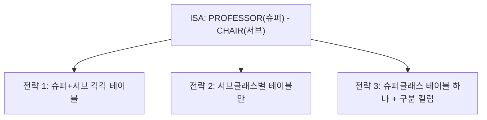

## 왜 규칙이 필요한가

08편에서는 요구사항을 보고 엔티티 집합·관계 집합·카디널리티·약한 엔티티·ISA 계층을 설계하는 방법을 배웠다. 하지만 실제 데이터베이스에 저장하려면 이 그림을 04편에서 배운 **관계 스키마**(relation schema, 테이블 구조)로 바꿔야 한다.

이 문서에서는 08편에서 그린 수강신청 도메인 예시(학과·교수·학과장·학생·비상연락처·과목)를 그대로 이어서 사용하며, 규칙마다 실제 Oracle SQL `CREATE TABLE` 문으로 결과를 보여준다.

## 규칙 1 — 강한 엔티티 집합의 변환

**강한 엔티티**(strong entity, 약한 엔티티가 아닌 일반 엔티티)는 가장 단순하다. 엔티티 집합 하나를 테이블 하나로 만들고, 엔티티의 단순(single-valued) 속성을 그대로 열(컬럼)로 옮기며, 엔티티의 키 속성을 테이블의 **기본키**(primary key)로 지정한다.

08편의 `학과(Department)` 엔티티(속성: `dept_id`, `dept_name`)를 변환하면 다음과 같다.

```sql
CREATE TABLE department (
    dept_id    VARCHAR2(10) PRIMARY KEY,
    dept_name  VARCHAR2(50) NOT NULL
);
```

`학생(Student)` 엔티티(속성: `student_id`, `name`)도 같은 규칙으로 변환한다.

```sql
CREATE TABLE student (
    student_id  VARCHAR2(10) PRIMARY KEY,
    name        VARCHAR2(50) NOT NULL
);
```

## 규칙 2 — 약한 엔티티 집합의 변환

08편에서 배운 **약한 엔티티**(weak entity)는 스스로 유일하게 식별되지 않으므로 변환 방식이 다르다. 규칙은 다음과 같다.

1. 약한 엔티티의 속성들을 열로 만든다.
2. **소유 엔티티**(owner entity)의 기본키를 **외래키**(foreign key)로 추가한다.
3. 약한 엔티티의 **부분 키**(partial key)와, 방금 추가한 소유 엔티티의 외래키를 합쳐서 **복합 기본키**(composite primary key)로 지정한다.

08편의 `비상연락처(EMERGENCY_CONTACT)`는 `학생(Student)`의 약한 엔티티였다. 부분 키는 `contact_name`이다.

```sql
CREATE TABLE emergency_contact (
    contact_name  VARCHAR2(50),
    student_id    VARCHAR2(10),
    phone         VARCHAR2(20) NOT NULL,
    PRIMARY KEY (contact_name, student_id),
    FOREIGN KEY (student_id) REFERENCES student(student_id) ON DELETE CASCADE
);
```

> **자주 틀리는 점:** 부분 키 하나만 기본키로 지정하는 실수가 흔하다. `contact_name`만 기본키로 지정하면 서로 다른 학생에게 같은 이름의 비상연락처가 있을 때 기본키 중복 오류가 난다. 반드시 **소유 엔티티의 외래키 + 부분 키**를 합쳐서 기본키로 지정해야 한다. 또한 소유 엔티티(학생)가 삭제되면 약한 엔티티(비상연락처)도 의미가 없어지므로, `ON DELETE CASCADE`(부모 삭제 시 자식도 함께 삭제)를 붙이는 것이 일반적이다.

## 규칙 3 — 관계 집합의 변환: 카디널리티에 따라 방법이 다르다

### 1대다(1:N) 관계 — 외래키를 "다" 쪽에 추가

1대다 관계는 별도 테이블을 만들지 않고, **"다(N)" 쪽 엔티티의 테이블에 "1" 쪽 엔티티의 기본키를 외래키로 추가**하는 방식으로 표현한다. 08편의 `학과(1) – 교수(N)` 관계(`employs`)를 변환해 보자.

```sql
CREATE TABLE professor (
    prof_id   VARCHAR2(10) PRIMARY KEY,
    name      VARCHAR2(50) NOT NULL,
    dept_id   VARCHAR2(10),
    FOREIGN KEY (dept_id) REFERENCES department(dept_id)
);
```

`dept_id`가 `professor` 테이블에 외래키로 들어간 이유는, 교수 한 명이 학과 하나에만 속하므로(다 쪽) 교수 테이블의 한 행에 학과 정보를 하나만 적으면 되기 때문이다. 반대로 학과 테이블에 교수 목록을 넣으려 하면, 학과 하나가 여러 교수를 가지므로 한 칸에 값을 여러 개 넣어야 하는 모순이 생긴다(제1정규형 위반, 13~14편에서 자세히 다룬다).

### 다대다(M:N) 관계 — 별도의 연결 테이블 생성

다대다 관계는 어느 한쪽 테이블에 외래키를 넣을 수 없다. 그래서 다대다 관계는 **연결 테이블**(associative table, junction table, bridge table이라고도 부른다)을 새로 만들어, 양쪽 엔티티의 기본키를 각각 외래키로 가지고 두 외래키를 합쳐 기본키로 삼는다.

08편의 `학생(M) – 과목(N)` 관계(`enrolls`)를 변환하면 다음과 같다.

```sql
CREATE TABLE enrollment (
    student_id    VARCHAR2(10),
    course_code   VARCHAR2(10),
    enroll_term   VARCHAR2(10) NOT NULL,
    PRIMARY KEY (student_id, course_code),
    FOREIGN KEY (student_id) REFERENCES student(student_id),
    FOREIGN KEY (course_code) REFERENCES course(course_code)
);
```

`enroll_term`(수강 학기)처럼 **관계 자체가 가지는 속성**(관계 속성, relationship attribute)이 있다면, 이 연결 테이블에 그대로 컬럼으로 추가한다. 이런 속성은 학생에도 과목에도 속하지 않고 "이 학생이 이 과목을 들었다"는 사실 자체에 딸린 정보이기 때문이다.

> **자주 틀리는 점:** 다대다 관계를 억지로 1:N 두 개로 쪼개 외래키를 양쪽에 나눠 넣으려는 시도는 잘못된 설계다. 다대다는 반드시 별도의 연결 테이블이 필요하다.

### 1대1(1:1) 관계 — 외래키를 어느 쪽에 둘지는 참여 제약으로 결정

1대1 관계는 두 테이블 중 아무 쪽에나 외래키를 넣어도 문법적으로는 동작하지만, **참여 제약**(08편에서 배운 전체 참여·부분 참여)을 보고 어느 쪽에 넣을지 정하는 것이 좋은 설계다. 원칙은 "**전체 참여를 하는 쪽**에 외래키를 두면 그 컬럼에 `NULL`(값 없음)이 생기지 않는다"는 것이다.

예를 들어 "모든 학과는 반드시 학과장을 가지지만, 모든 교수가 학과장인 것은 아니다"라는 규칙에서 `학과(전체 참여) – 학과장(부분 참여)` 관계가 있다면, 외래키는 전체 참여 쪽인 학과 테이블에 두는 것이 낫다.

```sql
CREATE TABLE department (
    dept_id      VARCHAR2(10) PRIMARY KEY,
    dept_name    VARCHAR2(50) NOT NULL,
    chair_id     VARCHAR2(10) NOT NULL,
    FOREIGN KEY (chair_id) REFERENCES professor(prof_id)
);
```

반대로 교수 테이블에 `dept_chaired_id`를 넣으면, 학과장이 아닌 대부분의 교수 행에서 이 컬럼이 `NULL`로 남아 공간이 낭비되고 "이 교수가 학과장인지"를 매번 `NULL` 검사로 판단해야 하는 불편함이 생긴다.

## 규칙 4 — 다중값 속성의 변환

**다중값 속성**(multivalued attribute)은 한 엔티티 인스턴스가 여러 개의 값을 가질 수 있는 속성이다. 예를 들어 교수 한 명이 전화번호를 여러 개 가질 수 있다면, `phone`은 다중값 속성이다.

규칙은 다음과 같다. **다중값 속성마다 별도 테이블을 만들고, 그 테이블에 소유 엔티티의 기본키를 외래키로 넣은 뒤, "외래키 + 속성값"을 합쳐 기본키로 삼는다.**

```sql
CREATE TABLE professor_phone (
    prof_id  VARCHAR2(10),
    phone    VARCHAR2(20),
    PRIMARY KEY (prof_id, phone),
    FOREIGN KEY (prof_id) REFERENCES professor(prof_id)
);
```

교수 한 명이 전화번호를 3개 가지면 이 테이블에 그 교수의 `prof_id`로 행이 3개 생기는 방식으로 표현한다. 이 구조는 규칙 2의 약한 엔티티 변환, 규칙 3의 다대다 연결 테이블과 매우 비슷한 모양이 되는데, 실제로 다중값 속성은 "소유 엔티티에 종속된 작은 약한 엔티티"로 취급된다고 이해하면 기억하기 쉽다.

## 규칙 5 — 복합 속성의 변환

**복합 속성**(composite attribute)은 여러 개의 하위 속성으로 나뉘는 속성이다. 예를 들어 "주소"는 "시/도, 구/군, 상세주소"로 나뉠 수 있다.

```sql
CREATE TABLE student (
    student_id   VARCHAR2(10) PRIMARY KEY,
    name         VARCHAR2(50) NOT NULL,
    addr_city    VARCHAR2(30),
    addr_district VARCHAR2(30),
    addr_detail  VARCHAR2(100)
);
```

## 규칙 6 — ISA 상속의 변환: 세 가지 전략

08편에서 배운 ISA 계층(학과장이 교수의 서브클래스인 경우)은 변환 전략이 하나가 아니라 세 가지가 있으며, 어떤 전략을 쓸지는 분리·참여 제약과 조회 패턴을 함께 고려해서 정한다.



### 전략 1 — 슈퍼클래스와 서브클래스를 각각 테이블로 (가장 일반적)

슈퍼클래스 테이블에는 공통 속성을, 서브클래스 테이블에는 추가 속성만 두고, 서브클래스 테이블의 기본키를 슈퍼클래스 테이블의 기본키를 참조하는 외래키로 동시에 사용한다.

```sql
CREATE TABLE professor (
    prof_id   VARCHAR2(10) PRIMARY KEY,
    name      VARCHAR2(50) NOT NULL
);

CREATE TABLE chair (
    prof_id     VARCHAR2(10) PRIMARY KEY,
    term_start  DATE NOT NULL,
    FOREIGN KEY (prof_id) REFERENCES professor(prof_id)
);
```

`chair.prof_id`는 자기 테이블의 기본키이면서 동시에 `professor` 테이블을 참조하는 외래키다. 다만 학과장의 이름을 조회하려면 `professor`와 `chair`를 조인(11편에서 배울 JOIN)해야 한다는 단점이 있다.

### 전략 2 — 서브클래스별 테이블만 만들고 슈퍼클래스 테이블은 없앰

슈퍼클래스가 **분리적이면서 전체 참여**(모든 인스턴스가 반드시 어느 한 서브클래스에 속하고 겹치지 않음)일 때만 쓸 수 있다. 슈퍼클래스의 공통 속성을 각 서브클래스 테이블에 중복해서 포함시킨다.

```sql
CREATE TABLE permanent_employee (
    emp_id          VARCHAR2(10) PRIMARY KEY,
    name            VARCHAR2(50) NOT NULL,
    annual_salary   NUMBER NOT NULL
);

CREATE TABLE contract_employee (
    emp_id           VARCHAR2(10) PRIMARY KEY,
    name             VARCHAR2(50) NOT NULL,
    hourly_wage      NUMBER NOT NULL
);
```

> **자주 틀리는 점:** 이 전략은 슈퍼클래스만 조회하는 질의(예: "전체 직원 명단")를 만들 때 두 테이블을 `UNION`(06·11편에서 배울 합집합 연산)으로 합쳐야 하는 불편이 생긴다. 또한 **부분 참여**(슈퍼클래스 인스턴스 중 어느 서브클래스에도 속하지 않는 경우가 있음)이거나 **중복적**(한 인스턴스가 여러 서브클래스에 동시에 속함)이면 이 전략은 데이터를 잃어버리거나 중복시키므로 쓸 수 없다.

### 전략 3 — 슈퍼클래스 테이블 하나에 구분 컬럼(discriminator) 추가

서브클래스의 추가 속성이 몇 개 안 되고 서로 겹치지 않을 때, 테이블 하나에 모든 속성을 몰아넣고 어떤 서브클래스인지 구분하는 컬럼을 추가하는 방식이다.

```sql
CREATE TABLE employee (
    emp_id          VARCHAR2(10) PRIMARY KEY,
    name            VARCHAR2(50) NOT NULL,
    emp_type        VARCHAR2(10) NOT NULL,
    annual_salary   NUMBER,
    hourly_wage     NUMBER
);
```

`emp_type`이 `'PERM'`이면 `annual_salary`만, `'CONTRACT'`이면 `hourly_wage`만 값이 채워지고 나머지는 `NULL`이 된다. 이 방식은 테이블 하나로 조회가 간단해지는 장점이 있지만, 서브클래스가 늘어날수록 `NULL`투성이 컬럼이 늘어나는 단점이 있다.

<table>
<thead><tr><th>전략</th><th>적합한 상황</th><th>단점</th></tr></thead>
<tbody>
<tr><td>전략 1(슈퍼+서브 분리)</td><td>서브클래스가 여러 개, 중복적 허용, 속성이 많음</td><td>조회 시 조인 필요</td></tr>
<tr><td>전략 2(서브클래스만)</td><td>분리적 + 전체 참여가 확실할 때</td><td>전체 조회 시 합집합 필요, 부분·중복이면 사용 불가</td></tr>
<tr><td>전략 3(구분 컬럼)</td><td>서브클래스 추가 속성이 적고 분리적일 때</td><td>NULL 컬럼 증가</td></tr>
</tbody>
</table>

## 종합 예시 — 수강신청 도메인 전체 사상 결과

08편 EER 다이어그램 전체를 규칙 1~6에 따라 한 번에 사상한 최종 스키마는 다음과 같다.

```sql
CREATE TABLE department (
    dept_id    VARCHAR2(10) PRIMARY KEY,
    dept_name  VARCHAR2(50) NOT NULL
);

CREATE TABLE professor (
    prof_id   VARCHAR2(10) PRIMARY KEY,
    name      VARCHAR2(50) NOT NULL,
    dept_id   VARCHAR2(10),
    FOREIGN KEY (dept_id) REFERENCES department(dept_id)
);

CREATE TABLE chair (
    prof_id     VARCHAR2(10) PRIMARY KEY,
    term_start  DATE NOT NULL,
    FOREIGN KEY (prof_id) REFERENCES professor(prof_id)
);

CREATE TABLE student (
    student_id  VARCHAR2(10) PRIMARY KEY,
    name        VARCHAR2(50) NOT NULL
);

CREATE TABLE emergency_contact (
    contact_name  VARCHAR2(50),
    student_id    VARCHAR2(10),
    phone         VARCHAR2(20) NOT NULL,
    PRIMARY KEY (contact_name, student_id),
    FOREIGN KEY (student_id) REFERENCES student(student_id) ON DELETE CASCADE
);

CREATE TABLE course (
    course_code  VARCHAR2(10) PRIMARY KEY,
    title        VARCHAR2(50) NOT NULL
);

CREATE TABLE enrollment (
    student_id   VARCHAR2(10),
    course_code  VARCHAR2(10),
    enroll_term  VARCHAR2(10) NOT NULL,
    PRIMARY KEY (student_id, course_code),
    FOREIGN KEY (student_id) REFERENCES student(student_id),
    FOREIGN KEY (course_code) REFERENCES course(course_code)
);
```

이 결과 스키마 전체가 10편부터 배울 SQL DDL·DML의 예제 대상이 된다.

## 핵심 정리

- 강한 엔티티는 그대로 테이블, 키 속성은 기본키로 변환한다.
- 약한 엔티티는 소유 엔티티의 기본키를 외래키로 받아, 부분 키와 합쳐 복합 기본키를 만든다.
- 1대다 관계는 "다" 쪽 테이블에 "1" 쪽 기본키를 외래키로 추가한다. 다대다 관계는 별도 연결 테이블을 만들어 양쪽 기본키를 합쳐 기본키로 삼는다. 1대1 관계는 전체 참여 쪽에 외래키를 두어 `NULL`을 줄인다.
- 다중값 속성은 별도 테이블(소유 엔티티 기본키 + 속성값이 기본키)로, 복합 속성은 최하위 단순 속성만 컬럼으로 만든다.
- ISA 상속은 슈퍼+서브 분리, 서브클래스만, 구분 컬럼 세 전략 중 분리·참여 제약과 조회 패턴에 맞는 것을 고른다.

## 마무리 복습

<Quiz
  questionNumber={1}
  question={"약한 엔티티를 관계 스키마로 변환할 때 기본키를 설계하는 방법으로 옳은 것은?"}
  options={["부분 키만 단독으로 기본키로 지정한다","소유 엔티티의 기본키만 단독으로 기본키로 지정한다","소유 엔티티의 기본키를 외래키로 추가한 뒤 부분 키와 합쳐 복합 기본키로 지정한다","약한 엔티티는 기본키 없이 테이블을 만들 수 있다"]}
  correctAnswer={3}
  explanation={"약한 엔티티는 소유 엔티티의 기본키를 외래키로 받아, 그 외래키와 부분 키를 합친 복합 기본키로 유일성을 확보해야 한다."}
/>

<Quiz
  questionNumber={2}
  question={"1대다(1:N) 관계를 관계 스키마로 사상하는 방법으로 옳은 것은?"}
  options={["별도의 연결 테이블을 반드시 만들어야 한다","\"1\" 쪽 테이블에 \"다\" 쪽 기본키를 외래키로 추가한다","\"다\" 쪽 테이블에 \"1\" 쪽 기본키를 외래키로 추가한다","양쪽 테이블에 서로의 기본키를 모두 외래키로 추가한다"]}
  correctAnswer={3}
  explanation={"1대다 관계는 다 쪽 테이블의 한 행이 1 쪽 값 하나만 가지면 되므로, 다 쪽 테이블에 1 쪽 기본키를 외래키로 추가하는 것으로 충분하다."}
/>

<Quiz
  questionNumber={3}
  question={"다대다(M:N) 관계를 변환할 때 연결 테이블의 기본키로 가장 적절한 것은?"}
  options={["연결 테이블에 새로 부여한 일련번호 하나만 기본키로 쓴다","양쪽 엔티티의 기본키를 각각 외래키로 받아 두 값을 합쳐 기본키로 쓴다","관계에 딸린 속성(예: 수강 학기)만 기본키로 쓴다","한쪽 엔티티의 기본키만 기본키로 쓴다"]}
  correctAnswer={2}
  explanation={"다대다 연결 테이블은 양쪽 엔티티의 기본키를 각각 외래키로 받고, 그 두 외래키를 합쳐 복합 기본키로 삼아 같은 조합이 중복 저장되지 않도록 한다."}
/>

## 참고 자료

- Oracle Database SQL Language Reference: https://docs.oracle.com/en/database/oracle/oracle-database/
- GeeksforGeeks DBMS Tutorial(ER to Relational Mapping): https://www.geeksforgeeks.org/dbms
