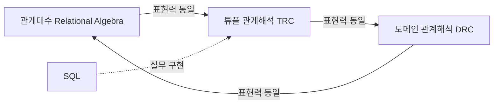

<Callout type="info">
  **이번 문서의 목표:** 이 문서를 다 읽으면 튜플 관계해석·도메인 관계해석으로 질의를 직접 쓰고 읽을 수 있고, 관계대수 질의와 서로 변환할 수 있으며, 안전한 질의와 안전하지 않은 질의를 구분할 수 있다.
</Callout>

## 왜 관계대수만으로는 부족한가

07편·08편에서 배운 **관계대수**(relational algebra)는 셀렉트(select)·프로젝트(project)·조인(join) 같은 연산자를 순서대로 조합해서 "어떤 절차를 거쳐" 원하는 결과를 만드는지 명시한다. 이런 방식을 **절차적**(procedural) 질의 언어라고 부른다. 연산을 어떤 순서로 적용할지 사용자가 직접 정해야 한다.

그런데 실제로 사람이 원하는 것은 대부분 "무엇을 원하는가"이지 "어떤 절차로 구하는가"가 아니다. 예를 들어 "개발팀 직원 이름을 모두 보여줘"라고 말할 때, 머릿속에는 셀렉트를 먼저 하고 프로젝트를 나중에 할지, 그 반대로 할지 같은 절차가 없다. 그냥 조건을 만족하는 결과의 **성질**만 있을 뿐이다. 이런 방식으로 "결과가 만족해야 할 조건"만 기술하는 언어를 **선언적**(declarative) 질의 언어라고 한다. **관계해석**(relational calculus)이 바로 이 선언적 접근을 수학적으로 정리한 것이며, 우리가 12~14편에서 배울 SQL도 근본적으로는 관계해석에 가까운 선언적 언어다.

> **쉽게 말하면:** 관계대수는 "어떻게 구할지"를 적고, 관계해석은 "무엇을 원하는지"만 적는다. SQL은 관계해석 쪽에 더 가까운 방식으로 만들어졌다.

관계해석은 수리논리학의 **술어논리**(predicate logic)에서 빌려온 표기법을 쓴다. 술어논리란 "참(true) 또는 거짓(false)으로 판정되는 문장"을 기호로 표현하고, 그 문장이 어떤 대상에 대해 성립하는지를 다루는 논리 체계다. 관계해석에는 두 가지 방식이 있다. 하나는 변수가 튜플 전체를 가리키는 **튜플 관계해석**(tuple relational calculus, TRC)이고, 다른 하나는 변수가 튜플의 개별 속성값(도메인의 원소)을 가리키는 **도메인 관계해석**(domain relational calculus, DRC)이다.

## 예시로 쓸 작은 릴레이션

이 문서 전체에서 아래 `Employee` 릴레이션을 예시로 쓴다. 속성은 `empno`(사원번호), `ename`(이름), `dept`(부서), `salary`(급여)다.

<table>
<thead><tr><th>empno</th><th>ename</th><th>dept</th><th>salary</th></tr></thead>
<tbody>
<tr><td>100</td><td>Kim</td><td>Sales</td><td>3000</td></tr>
<tr><td>101</td><td>Lee</td><td>Dev</td><td>3500</td></tr>
<tr><td>102</td><td>Park</td><td>Dev</td><td>3200</td></tr>
<tr><td>103</td><td>Choi</td><td>Sales</td><td>2800</td></tr>
</tbody>
</table>

## 튜플 관계해석(TRC) — 변수가 튜플을 가리킨다

### 정의와 기본 구문

튜플 관계해석의 질의는 다음과 같은 형태로 쓴다.

```
{ t | P(t) }
```

이 식은 "튜플 변수 `t`가 술어(조건식) `P(t)`를 만족하는 모든 `t`들의 집합"이라는 뜻이다. `t`는 릴레이션의 튜플 하나 전체를 가리키는 변수이고, `t[속성명]`은 그 튜플에서 특정 속성의 값을 꺼내는 표기다. `P(t)`는 `t`에 대해 참·거짓이 판정되는 논리식으로, 안에는 다음 기호들을 쓸 수 있다.

- `∈` : "~의 원소이다"(belongs to). `t ∈ Employee`는 "튜플 `t`가 Employee 릴레이션에 속한다"는 뜻이다.
- `∧`(and, 논리곱), `∨`(or, 논리합), `¬`(not, 부정) : 조건을 결합·부정하는 논리 연산자.
- `∃`(there exists, 존재 한정 기호) : "~을 만족하는 것이 적어도 하나 존재한다."
- `∀`(for all, 전칭 한정 기호) : "모든 ~에 대해 성립한다."

> **쉽게 말하면:** `{t | P(t)}`는 "조건 P를 만족하는 튜플 t를 전부 모아라"라는 뜻이다. SQL의 `SELECT ... WHERE` 문장과 발상이 거의 같다.

### 작은 예시로 적용하기

**질의 1**: "부서가 Dev인 직원의 튜플 전체를 보여줘."

```
{ t | t ∈ Employee ∧ t[dept] = 'Dev' }
```

이 식을 `Employee` 4개 튜플에 하나씩 대입해서 판정해 보자.

<table>
<thead><tr><th>튜플 t</th><th>t ∈ Employee</th><th>t[dept] = 'Dev'</th><th>P(t) 전체</th><th>결과 포함?</th></tr></thead>
<tbody>
<tr><td>(100, Kim, Sales, 3000)</td><td>참</td><td>거짓</td><td>거짓</td><td>제외</td></tr>
<tr><td>(101, Lee, Dev, 3500)</td><td>참</td><td>참</td><td>참</td><td>포함</td></tr>
<tr><td>(102, Park, Dev, 3200)</td><td>참</td><td>참</td><td>참</td><td>포함</td></tr>
<tr><td>(103, Choi, Sales, 2800)</td><td>참</td><td>거짓</td><td>거짓</td><td>제외</td></tr>
</tbody>
</table>

결과 릴레이션은 다음과 같다.

<table>
<thead><tr><th>empno</th><th>ename</th><th>dept</th><th>salary</th></tr></thead>
<tbody>
<tr><td>101</td><td>Lee</td><td>Dev</td><td>3500</td></tr>
<tr><td>102</td><td>Park</td><td>Dev</td><td>3200</td></tr>
</tbody>
</table>

이 결과는 07편에서 배운 관계대수의 셀렉트 연산 `σ_(dept='Dev')(Employee)`와 완전히 같다. 실제로 조건만 있는 단순 TRC 질의는 대부분 셀렉트 하나로 바로 옮길 수 있다.

**질의 2**: "부서가 Dev이면서 급여가 3200 이상인 직원의 이름만 보여줘." 여기서는 특정 속성만 뽑아야 하므로 프로젝트에 해당하는 표현이 필요하다. TRC에서는 존재 한정 기호를 이용해서 "어딘가에 이 이름을 가진 Employee 튜플이 존재한다"는 방식으로 표현한다.

```
{ t | ∃e (e ∈ Employee ∧ e[dept] = 'Dev' ∧ e[salary] >= 3200 ∧ t[ename] = e[ename]) }
```

여기서 `t`는 `ename`이라는 속성 하나만 가진 새로운 튜플 변수이고, `e`는 원래 `Employee`의 튜플을 가리키는 **한정된 변수**(bound variable, 존재/전칭 기호에 묶인 변수)다. `∃e(...)`는 "그런 `e`가 적어도 하나 있다면"이라는 뜻이다. 대입해 보면 `e`가 (101, Lee, Dev, 3500)일 때 조건을 만족하고 `t[ename]`은 Lee가 된다. `e`가 (102, Park, Dev, 3200)일 때도 조건을 만족해 Park도 결과에 들어간다. 결과는 `{Lee, Park}` 두 이름이다.

> **자주 틀리는 점:** `∃`로 묶이지 않은 변수를 **자유 변수**(free variable)라고 하는데, 결과 집합을 정의하는 `{t | ...}`의 `t`는 항상 자유 변수여야 한다. 자유 변수가 없거나 여러 개면 그 식은 "무엇의 집합인지" 정의되지 않아 잘못된 질의다.

### 전칭 한정 기호 `∀`의 활용 — "모두" 조건

전칭 한정 기호는 "이 조건을 만족하는 대상이 하나도 빠짐없이 모두 성립해야 한다"는 조건을 표현할 때 쓴다. 예를 들어 "Sales 부서에 소속된 모든 직원의 급여가 2500 이상인가"를 판정하는 조건은 다음처럼 쓴다.

```
∀t (t ∈ Employee ∧ t[dept] = 'Sales' → t[salary] >= 2500)
```

`→`는 "함의"(implication, ~이면 ~이다)를 뜻하는 논리 기호로, `A → B`는 "`A`가 거짓이거나 `B`가 참이면 전체가 참"이라고 정의된다. 이 식을 `Employee`의 네 튜플에 대입하면, `dept='Sales'`인 (100, Kim, Sales, 3000)과 (103, Choi, Sales, 2800) 모두 `salary >= 2500`을 만족하고, 나머지 두 튜플은 `dept='Sales'`가 거짓이므로 함의 전체가 자동으로 참이 된다. 따라서 이 전칭 문장은 참이다.

`∀`는 `∃`와 `¬`(부정)로 서로 바꿔 쓸 수 있다는 점도 기억해 둘 필요가 있다. "모든 `t`에 대해 `P(t)`가 성립한다"는 "`P(t)`가 성립하지 않는 `t`가 하나도 존재하지 않는다"와 논리적으로 같기 때문이다.

```
∀t (P(t))  ≡  ¬∃t (¬P(t))
```

## 도메인 관계해석(DRC) — 변수가 속성값 하나를 가리킨다

### 정의와 기본 구문

도메인 관계해석은 튜플 전체가 아니라 **속성 하나하나의 값**을 변수로 다룬다. 기본 형태는 다음과 같다.

```
{ <x1, x2, ..., xn> | P(x1, x2, ..., xn) }
```

`x1`부터 `xn`까지는 각각 하나의 도메인 값(속성값)을 가리키는 변수이고, `P`는 그 변수들 사이의 관계를 나타내는 술어다. `Employee` 릴레이션의 속성 순서를 (empno, ename, dept, salary)로 고정하면, "Dev 부서 직원의 사번과 이름"을 묻는 질의는 다음처럼 쓴다.

```
{ <e, n> | ∃d ∃s (Employee(e, n, d, s) ∧ d = 'Dev') }
```

여기서 `Employee(e, n, d, s)`는 "네 값 `e, n, d, s`를 각각 empno, ename, dept, salary 자리에 넣은 튜플이 `Employee` 릴레이션 안에 실제로 존재한다"는 술어다. `d`와 `s`는 결과에 나타나지 않지만 조건을 검사하기 위해 `∃`로 도입한 변수이고, `e`와 `n`은 결과 튜플을 구성하는 자유 변수다.

> **쉽게 말하면:** 튜플 관계해석은 "행 하나 전체"를 변수로 삼고, 도메인 관계해석은 "칸 하나하나의 값"을 변수로 삼는다. 결과를 구성하는 재료의 단위만 다를 뿐 표현하는 힘은 같다.

### 작은 예시로 적용하기

앞의 질의를 `Employee`의 네 튜플에 대입해 보자.

<table>
<thead><tr><th>(e, n, d, s)</th><th>Employee(e,n,d,s)</th><th>d = 'Dev'</th><th>결과 &lt;e, n&gt; 포함?</th></tr></thead>
<tbody>
<tr><td>(100, Kim, Sales, 3000)</td><td>참</td><td>거짓</td><td>제외</td></tr>
<tr><td>(101, Lee, Dev, 3500)</td><td>참</td><td>참</td><td>포함 → (101, Lee)</td></tr>
<tr><td>(102, Park, Dev, 3200)</td><td>참</td><td>참</td><td>포함 → (102, Park)</td></tr>
<tr><td>(103, Choi, Sales, 2800)</td><td>참</td><td>거짓</td><td>제외</td></tr>
</tbody>
</table>

결과는 (101, Lee)와 (102, Park) 두 튜플로, 앞서 TRC로 얻은 "부서가 Dev인 튜플 전체"에서 `empno`, `ename` 두 속성만 프로젝트한 것과 동일하다. 이렇게 DRC는 SQL의 `SELECT` 목록(어떤 칸을 뽑을지)과 표현 방식이 더 직접적으로 닮아 있어서, 훗날 QBE(Query By Example) 같은 실무 질의 도구의 이론적 기반이 되었다.

## 관계대수·튜플해석·도메인해석의 등가성

세 언어 사이의 관계를 그림으로 정리하면 다음과 같다.



1970년 에드거 커드(E. F. Codd)는 "관계대수로 표현할 수 있는 모든 질의는 안전한 튜플 관계해석으로 표현할 수 있고, 그 역도 성립한다"는 것을 증명했다. 이를 **Codd의 정리**(Codd's theorem)라고 부르며, 이 표현력의 동등한 정도를 **관계적으로 완전하다**(relationally complete)고 말한다. 즉 세 언어는 "무엇을 표현할 수 있는가"의 관점에서는 완전히 같은 힘을 가지며, 문법과 사고방식(절차적 vs 선언적, 튜플 단위 vs 속성값 단위)만 다르다. 07~08편의 관계대수 연산을 관계해석으로 바꿔 쓰는 대응은 다음과 같다.

<table>
<thead><tr><th>관계대수 연산</th><th>튜플 관계해석 대응</th></tr></thead>
<tbody>
<tr><td>셀렉트 `σ_C(R)`</td><td>`{t | t ∈ R ∧ C(t)}`</td></tr>
<tr><td>프로젝트 `π_A(R)`</td><td>`{t | ∃r(r ∈ R ∧ t[A] = r[A])}` (존재 한정으로 나머지 속성 감춤)</td></tr>
<tr><td>합집합 `R ∪ S`</td><td>`{t | t ∈ R ∨ t ∈ S}`</td></tr>
<tr><td>차집합 `R − S`</td><td>`{t | t ∈ R ∧ ¬(t ∈ S)}`</td></tr>
<tr><td>조인 `R ⋈ S`</td><td>`{t | ∃r∃s(r ∈ R ∧ s ∈ S ∧ 조인조건 ∧ t가 r,s를 합친 값)}`</td></tr>
</tbody>
</table>

## 안전한 질의와 안전하지 않은 질의

### 왜 "안전"이 문제가 되는가

관계해석은 술어논리를 그대로 빌려 왔기 때문에, 문법적으로는 맞지만 **결과가 무한 집합이 되거나 계산이 끝나지 않는 질의**를 얼마든지 쓸 수 있다. 예를 들어 다음 식을 보자.

```
{ t | ¬(t ∈ Employee) }
```

이 식은 문법적으로는 완전히 올바른 TRC 질의다. 그런데 그 의미를 그대로 따라가면 "Employee 릴레이션에 속하지 않는 모든 튜플"을 구하라는 뜻이 된다. 튜플 `t`가 가질 수 있는 값의 범위(사원번호가 무엇이든, 이름이 무엇이든, 부서가 무엇이든, 급여가 무엇이든)에는 제한이 없으므로, 이 조건을 만족하는 튜플은 이론적으로 무한히 많다. 데이터베이스는 유한한 저장 공간에서 동작하므로 이런 질의는 계산할 수 없다.

> **쉽게 말하면:** 안전하지 않은 질의는 "우주에 있는 모든 것 중에서 Employee가 아닌 것을 다 가져와"라고 말하는 것과 같다. 답이 무한해서 계산기(DBMS)가 멈출 수 없다.

### 안전성의 정의

어떤 관계해석 질의가 **안전하다**(safe)는 것은, 그 결과에 나타날 수 있는 모든 값이 질의에 등장하는 릴레이션들의 실제 값(그리고 질의 안에서 명시적으로 비교하는 상수)으로만 이루어진 **유한한 영역**(domain of the query) 안에 있다는 뜻이다. 반대로 결과값이 이 유한한 영역 밖으로 나갈 가능성이 있으면 **안전하지 않다**(unsafe)고 한다.

안전성을 실무적으로 점검하는 방법은 다음 두 가지를 확인하는 것이다.

1. 자유 변수가 등장하는 모든 존재 한정식은 반드시 어떤 릴레이션에 속한다는 조건(`r ∈ R` 형태)으로 그 변수의 값 범위를 유한하게 묶어야 한다.
2. 부정(`¬`)을 쓸 때는 부정되는 부분이 이미 유한한 범위 안에서만 움직이도록 만들어야 한다. 즉 "R에는 속하지만 S에는 속하지 않는다"(`t ∈ R ∧ ¬(t ∈ S)`)처럼 부정 앞에 반드시 유한 범위를 고정하는 긍정 조건이 있어야 안전하다.

앞서 본 `{t | t ∈ Employee ∧ ¬(t ∈ S)}` 형태는 `t`의 범위가 이미 `Employee`로 유한하게 고정되어 있으므로 안전하다. 반면 `{t | ¬(t ∈ Employee)}`처럼 부정만 있고 앞에서 범위를 고정해 주는 긍정 조건이 없으면 안전하지 않다.

> **자주 틀리는 점:** "부정을 쓰면 무조건 안전하지 않다"고 오해하기 쉽다. 부정 자체가 문제가 아니라, **부정된 조건의 변수가 유한한 범위로 묶여 있는지**가 핵심이다. `t ∈ R ∧ ¬C(t)`는 안전하고, `¬(t ∈ R)`만 단독으로 있으면 안전하지 않다.

실무에서 만나는 모든 관계해석 교재·DBMS 이론서는 "표현 가능한 질의"를 "안전한 질의"로 제한한다. 관계적으로 완전하다는 Codd의 정리도 정확히는 "안전한 관계해석 질의"와 관계대수 사이의 등가성을 말하는 것이다.

## 핵심 정리

- 관계대수는 절차(어떻게)를, 관계해석은 조건(무엇을)을 기술하는 선언적 언어다.
- 튜플 관계해석(TRC)은 `{t | P(t)}` 형태로 변수 `t`가 튜플 전체를 가리키고, `t[속성]`으로 값을 꺼낸다.
- 도메인 관계해석(DRC)은 `{<x1,...,xn> | P(...)}` 형태로 변수가 속성값 하나하나를 가리킨다.
- `∃`(존재)와 `∀`(전칭) 한정 기호, `∧ ∨ ¬ →` 논리 연산자로 조건을 구성하며, `∀t(P(t)) ≡ ¬∃t(¬P(t))`로 서로 변환된다.
- 관계대수·TRC·DRC는 표현력이 동등하다(Codd의 정리, 관계적 완전성). 단, 이 등가성은 **안전한** 질의에 한정된다.
- 안전한 질의란 결과와 중간 변수의 값 범위가 항상 유한하게 고정되는 질의다. 부정을 쓸 때는 반드시 앞에서 유한 범위를 고정하는 긍정 조건이 있어야 한다.

## 마무리 복습

<Quiz
  questionNumber={1}
  question="다음 중 관계대수와 관계해석의 근본적인 차이를 가장 정확히 설명한 것은?"
  options={['관계대수는 표 형태 결과를, 관계해석은 그래프 형태 결과를 만든다', '관계대수는 절차적으로 연산 순서를 기술하고, 관계해석은 결과가 만족할 조건만 선언적으로 기술한다', '관계대수는 SQL로 변환할 수 없지만 관계해석은 SQL로 바로 변환된다', '관계대수는 이론에만 쓰이고 관계해석은 실무 DBMS에서 직접 실행된다']}
  correctAnswer={2}
  explanation="관계대수는 셀렉트·프로젝트·조인 등 연산을 어떤 순서로 적용할지 명시하는 절차적 언어이고, 관계해석은 결과 튜플이 만족해야 할 논리 조건만 기술하는 선언적 언어다."
  optionExplanations={['결과 형태는 둘 다 릴레이션(표)으로 동일하다', '정답이다', '관계대수도 SQL 실행 계획으로 변환된다', '실무 DBMS는 SQL을 내부적으로 관계대수 실행 계획으로 바꿔 처리하므로 이 설명은 부정확하다']}
/>

<Quiz
  questionNumber={2}
  question="튜플 관계해석 식 {t | t ∈ Employee ∧ t[dept] = 'Dev'}에서 t가 뜻하는 것은?"
  options={['Employee 릴레이션의 dept 속성값 하나', 'Employee 릴레이션의 튜플(행) 전체', 'Employee 릴레이션에 속하지 않는 임의의 값', '질의 결과에 나타나는 속성 이름의 목록']}
  correctAnswer={2}
  explanation="튜플 관계해석에서 변수는 릴레이션의 튜플, 즉 행 전체를 가리킨다. t[dept]처럼 대괄호로 특정 속성값을 꺼낸다."
  optionExplanations={['속성값 하나를 변수로 삼는 것은 도메인 관계해석의 방식이다', '정답이다', 't ∈ Employee 조건이 있으므로 t는 Employee에 속하는 튜플이다', '결과의 속성 구성이 아니라 개별 튜플을 가리키는 변수다']}
/>

<Quiz
  questionNumber={3}
  question="도메인 관계해석 식 {&lt;e, n&gt; | ∃d ∃s (Employee(e, n, d, s) ∧ d = 'Dev')}의 결과에 대한 설명으로 옳은 것은?"
  options={['Employee의 모든 속성을 포함한 튜플 전체가 결과로 나온다', 'dept가 Dev인 직원의 empno와 ename 두 속성만 결과로 나온다', 'd와 s 값이 결과 튜플에 포함되어 4개 속성이 모두 나온다', '이 식은 안전하지 않아 계산할 수 없다']}
  correctAnswer={2}
  explanation="결과 튜플은 e와 n 두 값으로만 정의되어 있으므로 empno와 ename 두 값만 나온다. d, s는 존재 한정으로 조건 검사에만 쓰이고 결과에는 나타나지 않는다."
  optionExplanations={['결과의 자유 변수는 e, n 두 개뿐이다', '정답이다', 'd, s는 존재 한정 기호로 묶인 변수라 결과에 나타나지 않는다', 'e, n의 범위가 Employee(e,n,d,s)로 유한하게 고정되어 있어 안전한 질의다']}
/>

<Quiz
  questionNumber={4}
  question="다음 중 안전하지 않은(unsafe) 관계해석 질의는?"
  options={['t가 Employee에 속하고 salary가 3000 초과인 튜플을 구하는 질의', '¬(t가 Employee에 속한다)만으로 정의되어 t의 범위가 고정되지 않는 질의', 't가 Employee에 속한다는 조건이 먼저 범위를 고정한 뒤 dept가 Sales가 아님을 추가로 확인하는 질의', '순서쌍 e, n을 결과로 하고 Employee(e, n, d, s)로 범위가 고정된 질의']}
  correctAnswer={2}
  explanation="t의 값 범위를 유한하게 고정하는 긍정 조건 없이 부정만 있으면 결과가 무한해질 수 있어 안전하지 않다. ¬(t ∈ Employee)는 Employee에 속하지 않는 모든 가능한 튜플을 뜻해 범위가 무한하다."
  optionExplanations={['t ∈ Employee로 범위가 유한하게 고정되어 있어 안전하다', '정답이다', 't ∈ Employee가 먼저 범위를 고정하므로 뒤의 부정은 안전하다', 'Employee(e,n,d,s)가 e, n, d, s의 범위를 모두 유한하게 고정하므로 안전하다']}
/>

<Quiz
  questionNumber={5}
  question="전칭 한정 기호 ∀와 존재 한정 기호 ∃, 부정 ¬ 사이의 관계로 옳은 것은?"
  options={['∀t(P(t)) ≡ ∃t(P(t))', '∀t(P(t)) ≡ ¬∃t(¬P(t))', '∀t(P(t)) ≡ ∃t(¬P(t))', '∀와 ∃는 서로 변환할 수 없는 독립적인 기호다']}
  correctAnswer={2}
  explanation="모든 t에 대해 P(t)가 성립한다는 것은, P(t)가 성립하지 않는 t가 하나도 존재하지 않는다는 것과 논리적으로 같다."
  optionExplanations={['전칭과 존재 한정은 의미가 다르므로 단순히 같다고 할 수 없다', '정답이다', '부정 위치가 맞지 않는 잘못된 변환이다', '실제로는 부정을 매개로 서로 변환 가능하다']}
/>

<Quiz
  questionNumber={6}
  question="Codd의 정리(관계적 완전성)가 의미하는 바로 가장 적절한 것은?"
  options={['SQL이 관계대수보다 표현력이 더 강하다는 것을 증명한다', '안전한 관계해석과 관계대수가 표현할 수 있는 질의의 범위가 서로 동일함을 보인다', '도메인 관계해석은 튜플 관계해석보다 표현력이 약하다는 것을 보인다', '관계대수 연산 중 조인은 다른 연산으로 대체할 수 없다는 것을 보인다']}
  correctAnswer={2}
  explanation="Codd의 정리는 안전한 튜플 관계해석으로 표현 가능한 모든 질의는 관계대수로도 표현 가능하고 그 역도 성립함을 보여, 두 언어의 표현력이 동등함(관계적 완전성)을 증명한다."
  optionExplanations={['SQL과의 비교가 아니라 관계대수와 관계해석 사이의 등가성에 대한 정리다', '정답이다', 'TRC와 DRC도 서로 표현력이 동등하다', '조인은 셀렉트·카티전 곱의 조합으로 대체 가능한 파생 연산이다']}
/>

## 참고 자료

- NPTEL Fundamentals of Database Systems 강의 계획: https://nptel.ac.in
- GeeksforGeeks DBMS Tutorial: https://www.geeksforgeeks.org/dbms
