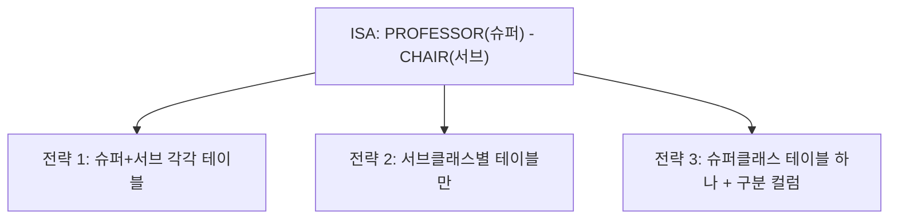

<Callout type="info">
  **이번 문서의 목표:** 이 문서를 다 읽으면 ER/EER 다이어그램의 엔티티·관계·속성·ISA 구조를 규칙에 따라 관계 스키마(테이블 설계)로 정확히 변환할 수 있다.
</Callout>

## 왜 규칙이 필요한가

10편에서는 요구사항을 보고 엔티티 집합·관계 집합·카디널리티·약한 엔티티·ISA 계층을 설계하는 방법을 배웠다. 하지만 실제 데이터베이스에 저장하려면 이 그림을 06편에서 배운 **관계 스키마**(relation schema, 테이블 구조)로 바꿔야 한다. 이 변환을 사람마다 마음대로 하면 같은 다이어그램에서 전혀 다른(그리고 잘못된) 테이블 구조가 나올 수 있다. 그래서 ER/EER를 관계 스키마로 바꾸는 데는 정해진 **사상 규칙**(mapping algorithm)이 있으며, 독학사 시험에서도 "이 ER 다이어그램을 관계 스키마로 올바르게 변환한 것은?" 유형으로 자주 나온다.

> **쉽게 말하면:** ER 다이어그램은 설계도이고, 관계 스키마는 그 설계도대로 실제로 지은 테이블이다. 사상 규칙은 "설계도의 이 부분은 테이블의 이 부분이 된다"는 번역표다.

이 문서에서는 10편에서 그린 수강신청 도메인 예시(학과·교수·학과장·학생·비상연락처·과목)를 그대로 이어서 사용하며, 규칙마다 실제 Oracle SQL `CREATE TABLE` 문으로 결과를 보여준다.

## 규칙 1 — 강한 엔티티 집합의 변환

**강한 엔티티**(strong entity, 약한 엔티티가 아닌 일반 엔티티)는 가장 단순하다. 엔티티 집합 하나를 테이블 하나로 만들고, 엔티티의 단순(single-valued) 속성을 그대로 열(컬럼)로 옮기며, 엔티티의 키 속성을 테이블의 **기본키**(primary key)로 지정한다.

10편의 `학과(Department)` 엔티티(속성: `dept_id`, `dept_name`)를 변환하면 다음과 같다.

```sql
CREATE TABLE department (
    dept_id    VARCHAR2(10) PRIMARY KEY,
    dept_name  VARCHAR2(50) NOT NULL
);
```

`학생(Student)` 엔티티(속성: `student_id`, `name`)도 같은 규칙으로 변환한다.

```sql
CREATE TABLE student (
    student_id  VARCHAR2(10) PRIMARY KEY,
    name        VARCHAR2(50) NOT NULL
);
```

> **쉽게 말하면:** 강한 엔티티는 "엔티티 이름 = 테이블 이름, 속성 = 컬럼, 키 속성 = 기본키"로 그대로 옮기면 된다.

## 규칙 2 — 약한 엔티티 집합의 변환

10편에서 배운 **약한 엔티티**(weak entity)는 스스로 유일하게 식별되지 않으므로 변환 방식이 다르다. 규칙은 다음과 같다.

1. 약한 엔티티의 속성들을 열로 만든다.
2. **소유 엔티티**(owner entity)의 기본키를 **외래키**(foreign key)로 추가한다.
3. 약한 엔티티의 **부분 키**(partial key)와, 방금 추가한 소유 엔티티의 외래키를 합쳐서 **복합 기본키**(composite primary key)로 지정한다.

10편의 `비상연락처(EMERGENCY_CONTACT)`는 `학생(Student)`의 약한 엔티티였다. 부분 키는 `contact_name`이다.

```sql
CREATE TABLE emergency_contact (
    contact_name  VARCHAR2(50),
    student_id    VARCHAR2(10),
    phone         VARCHAR2(20) NOT NULL,
    PRIMARY KEY (contact_name, student_id),
    FOREIGN KEY (student_id) REFERENCES student(student_id) ON DELETE CASCADE
);
```

> **자주 틀리는 점:** 부분 키 하나만 기본키로 지정하는 실수가 흔하다. `contact_name`만 기본키로 지정하면 서로 다른 학생에게 같은 이름의 비상연락처가 있을 때 기본키 중복 오류가 난다. 반드시 **소유 엔티티의 외래키 + 부분 키**를 합쳐서 기본키로 지정해야 한다. 또한 소유 엔티티(학생)가 삭제되면 약한 엔티티(비상연락처)도 의미가 없어지므로, `ON DELETE CASCADE`(부모 삭제 시 자식도 함께 삭제)를 붙이는 것이 일반적이다.

## 규칙 3 — 관계 집합의 변환: 카디널리티에 따라 방법이 다르다

### 1대다(1:N) 관계 — 외래키를 "다" 쪽에 추가

1대다 관계는 별도 테이블을 만들지 않고, **"다(N)" 쪽 엔티티의 테이블에 "1" 쪽 엔티티의 기본키를 외래키로 추가**하는 방식으로 표현한다. 10편의 `학과(1) – 교수(N)` 관계(`employs`)를 변환해 보자.

```sql
CREATE TABLE professor (
    prof_id   VARCHAR2(10) PRIMARY KEY,
    name      VARCHAR2(50) NOT NULL,
    dept_id   VARCHAR2(10),
    FOREIGN KEY (dept_id) REFERENCES department(dept_id)
);
```

`dept_id`가 `professor` 테이블에 외래키로 들어간 이유는, 교수 한 명이 학과 하나에만 속하므로(다 쪽) 교수 테이블의 한 행에 학과 정보를 하나만 적으면 되기 때문이다. 반대로 학과 테이블에 교수 목록을 넣으려 하면, 학과 하나가 여러 교수를 가지므로 한 칸에 값을 여러 개 넣어야 하는 모순이 생긴다(제1정규형 위반, 15~16편에서 자세히 다룬다).

> **쉽게 말하면:** "많은 쪽" 테이블에 "적은 쪽"을 가리키는 외래키를 꽂는다. 자식(N)이 부모(1)를 참조한다.

### 다대다(M:N) 관계 — 별도의 연결 테이블 생성

다대다 관계는 어느 한쪽 테이블에 외래키를 넣을 수 없다. 학생 한 명이 여러 과목을, 과목 하나가 여러 학생을 가지므로 양쪽 다 한 칸에 여러 값을 넣어야 하는 문제가 생기기 때문이다. 그래서 다대다 관계는 **연결 테이블**(associative table, junction table, bridge table이라고도 부른다)을 새로 만들어, 양쪽 엔티티의 기본키를 각각 외래키로 가지고 두 외래키를 합쳐 기본키로 삼는다.

10편의 `학생(M) – 과목(N)` 관계(`enrolls`)를 변환하면 다음과 같다.

```sql
CREATE TABLE enrollment (
    student_id    VARCHAR2(10),
    course_code   VARCHAR2(10),
    enroll_term   VARCHAR2(10) NOT NULL,
    PRIMARY KEY (student_id, course_code),
    FOREIGN KEY (student_id) REFERENCES student(student_id),
    FOREIGN KEY (course_code) REFERENCES course(course_code)
);
```

`enroll_term`(수강 학기)처럼 **관계 자체가 가지는 속성**(관계 속성, relationship attribute)이 있다면, 이 연결 테이블에 그대로 컬럼으로 추가한다. 이런 속성은 학생에도 과목에도 속하지 않고 "이 학생이 이 과목을 들었다"는 사실 자체에 딸린 정보이기 때문이다.

> **자주 틀리는 점:** 다대다 관계를 억지로 1:N 두 개로 쪼개 외래키를 양쪽에 나눠 넣으려는 시도는 잘못된 설계다. 다대다는 반드시 별도의 연결 테이블이 필요하다.

### 1대1(1:1) 관계 — 외래키를 어느 쪽에 둘지는 참여 제약으로 결정

1대1 관계는 두 테이블 중 아무 쪽에나 외래키를 넣어도 문법적으로는 동작하지만, **참여 제약**(10편에서 배운 전체 참여·부분 참여)을 보고 어느 쪽에 넣을지 정하는 것이 좋은 설계다. 원칙은 "**전체 참여를 하는 쪽**에 외래키를 두면 그 컬럼에 `NULL`(값 없음)이 생기지 않는다"는 것이다.

예를 들어 "모든 학과는 반드시 학과장을 가지지만, 모든 교수가 학과장인 것은 아니다"라는 규칙에서 `학과(전체 참여) – 학과장(부분 참여)` 관계가 있다면, 외래키는 전체 참여 쪽인 학과 테이블에 두는 것이 낫다.

```sql
CREATE TABLE department (
    dept_id      VARCHAR2(10) PRIMARY KEY,
    dept_name    VARCHAR2(50) NOT NULL,
    chair_id     VARCHAR2(10) NOT NULL,
    FOREIGN KEY (chair_id) REFERENCES professor(prof_id)
);
```

반대로 교수 테이블에 `dept_chaired_id`를 넣으면, 학과장이 아닌 대부분의 교수 행에서 이 컬럼이 `NULL`로 남아 공간이 낭비되고 "이 교수가 학과장인지"를 매번 `NULL` 검사로 판단해야 하는 불편함이 생긴다.

## 규칙 4 — 다중값 속성의 변환

**다중값 속성**(multivalued attribute)은 한 엔티티 인스턴스가 여러 개의 값을 가질 수 있는 속성이다. 예를 들어 교수 한 명이 전화번호를 여러 개 가질 수 있다면, `phone`은 다중값 속성이다. 관계형 테이블의 한 칸에는 원자값 하나만 들어가야 한다는 제1정규형 원칙(16편에서 자세히 다룬다) 때문에, 다중값 속성은 원래 테이블에 컬럼으로 넣을 수 없다.

규칙은 다음과 같다. **다중값 속성마다 별도 테이블을 만들고, 그 테이블에 소유 엔티티의 기본키를 외래키로 넣은 뒤, "외래키 + 속성값"을 합쳐 기본키로 삼는다.**

```sql
CREATE TABLE professor_phone (
    prof_id  VARCHAR2(10),
    phone    VARCHAR2(20),
    PRIMARY KEY (prof_id, phone),
    FOREIGN KEY (prof_id) REFERENCES professor(prof_id)
);
```

교수 한 명이 전화번호를 3개 가지면 이 테이블에 그 교수의 `prof_id`로 행이 3개 생기는 방식으로 표현한다. 이 구조는 규칙 2의 약한 엔티티 변환, 규칙 3의 다대다 연결 테이블과 매우 비슷한 모양이 되는데, 실제로 다중값 속성은 "소유 엔티티에 종속된 작은 약한 엔티티"로 취급된다고 이해하면 기억하기 쉽다.

## 규칙 5 — 복합 속성의 변환

**복합 속성**(composite attribute)은 여러 개의 하위 속성으로 나뉘는 속성이다. 예를 들어 "주소"는 "시/도, 구/군, 상세주소"로 나뉠 수 있다. 복합 속성은 다중값 속성과 달리 별도 테이블이 필요 없다. 규칙은 단순하다. **최하위 단순 속성만 뽑아 각각 하나의 컬럼으로 만든다.** 상위 개념(예: "주소")은 테이블에 컬럼으로 존재하지 않고, 하위 속성들의 묶음으로만 문서상 존재한다.

```sql
CREATE TABLE student (
    student_id   VARCHAR2(10) PRIMARY KEY,
    name         VARCHAR2(50) NOT NULL,
    addr_city    VARCHAR2(30),
    addr_district VARCHAR2(30),
    addr_detail  VARCHAR2(100)
);
```

> **쉽게 말하면:** 복합 속성은 "쪼개서 각자 컬럼으로", 다중값 속성은 "따로 테이블로" — 이 둘의 처리 방식을 헷갈리지 않는 것이 핵심이다.

## 규칙 6 — ISA 상속의 변환: 세 가지 전략

10편에서 배운 ISA 계층(학과장이 교수의 서브클래스인 경우)은 변환 전략이 하나가 아니라 세 가지가 있으며, 어떤 전략을 쓸지는 분리·참여 제약과 조회 패턴을 함께 고려해서 정한다.



### 전략 1 — 슈퍼클래스와 서브클래스를 각각 테이블로 (가장 일반적)

슈퍼클래스 테이블에는 공통 속성을, 서브클래스 테이블에는 추가 속성만 두고, 서브클래스 테이블의 기본키를 슈퍼클래스 테이블의 기본키를 참조하는 외래키로 동시에 사용한다.

```sql
CREATE TABLE professor (
    prof_id   VARCHAR2(10) PRIMARY KEY,
    name      VARCHAR2(50) NOT NULL
);

CREATE TABLE chair (
    prof_id     VARCHAR2(10) PRIMARY KEY,
    term_start  DATE NOT NULL,
    FOREIGN KEY (prof_id) REFERENCES professor(prof_id)
);
```

`chair.prof_id`는 자기 테이블의 기본키이면서 동시에 `professor` 테이블을 참조하는 외래키다. 이 방식은 서브클래스가 여러 개이고 중복적(overlapping)일 때도 자연스럽게 처리할 수 있어 가장 널리 쓰인다. 다만 학과장의 이름을 조회하려면 `professor`와 `chair`를 조인(13편에서 배울 JOIN)해야 한다는 단점이 있다.

### 전략 2 — 서브클래스별 테이블만 만들고 슈퍼클래스 테이블은 없앰

슈퍼클래스가 **분리적이면서 전체 참여**(모든 인스턴스가 반드시 어느 한 서브클래스에 속하고 겹치지 않음)일 때만 쓸 수 있다. 슈퍼클래스의 공통 속성을 각 서브클래스 테이블에 중복해서 포함시킨다.

```sql
CREATE TABLE permanent_employee (
    emp_id          VARCHAR2(10) PRIMARY KEY,
    name            VARCHAR2(50) NOT NULL,
    annual_salary   NUMBER NOT NULL
);

CREATE TABLE contract_employee (
    emp_id           VARCHAR2(10) PRIMARY KEY,
    name             VARCHAR2(50) NOT NULL,
    hourly_wage      NUMBER NOT NULL
);
```

> **자주 틀리는 점:** 이 전략은 슈퍼클래스만 조회하는 질의(예: "전체 직원 명단")를 만들 때 두 테이블을 `UNION`(08·13편에서 배울 합집합 연산)으로 합쳐야 하는 불편이 생긴다. 또한 **부분 참여**(슈퍼클래스 인스턴스 중 어느 서브클래스에도 속하지 않는 경우가 있음)이거나 **중복적**(한 인스턴스가 여러 서브클래스에 동시에 속함)이면 이 전략은 데이터를 잃어버리거나 중복시키므로 쓸 수 없다.

### 전략 3 — 슈퍼클래스 테이블 하나에 구분 컬럼(discriminator) 추가

서브클래스의 추가 속성이 몇 개 안 되고 서로 겹치지 않을 때, 테이블 하나에 모든 속성을 몰아넣고 어떤 서브클래스인지 구분하는 컬럼을 추가하는 방식이다.

```sql
CREATE TABLE employee (
    emp_id          VARCHAR2(10) PRIMARY KEY,
    name            VARCHAR2(50) NOT NULL,
    emp_type        VARCHAR2(10) NOT NULL,
    annual_salary   NUMBER,
    hourly_wage     NUMBER
);
```

`emp_type`이 `'PERM'`이면 `annual_salary`만, `'CONTRACT'`이면 `hourly_wage`만 값이 채워지고 나머지는 `NULL`이 된다. 이 방식은 테이블 하나로 조회가 간단해지는 장점이 있지만, 서브클래스가 늘어날수록 `NULL`투성이 컬럼이 늘어나는 단점이 있다.

<table>
<thead><tr><th>전략</th><th>적합한 상황</th><th>단점</th></tr></thead>
<tbody>
<tr><td>전략 1(슈퍼+서브 분리)</td><td>서브클래스가 여러 개, 중복적 허용, 속성이 많음</td><td>조회 시 조인 필요</td></tr>
<tr><td>전략 2(서브클래스만)</td><td>분리적 + 전체 참여가 확실할 때</td><td>전체 조회 시 합집합 필요, 부분·중복이면 사용 불가</td></tr>
<tr><td>전략 3(구분 컬럼)</td><td>서브클래스 추가 속성이 적고 분리적일 때</td><td>NULL 컬럼 증가</td></tr>
</tbody>
</table>

## 종합 예시 — 수강신청 도메인 전체 사상 결과

10편 EER 다이어그램 전체를 규칙 1~6에 따라 한 번에 사상한 최종 스키마는 다음과 같다.

```sql
CREATE TABLE department (
    dept_id    VARCHAR2(10) PRIMARY KEY,
    dept_name  VARCHAR2(50) NOT NULL
);

CREATE TABLE professor (
    prof_id   VARCHAR2(10) PRIMARY KEY,
    name      VARCHAR2(50) NOT NULL,
    dept_id   VARCHAR2(10),
    FOREIGN KEY (dept_id) REFERENCES department(dept_id)
);

CREATE TABLE chair (
    prof_id     VARCHAR2(10) PRIMARY KEY,
    term_start  DATE NOT NULL,
    FOREIGN KEY (prof_id) REFERENCES professor(prof_id)
);

CREATE TABLE student (
    student_id  VARCHAR2(10) PRIMARY KEY,
    name        VARCHAR2(50) NOT NULL
);

CREATE TABLE emergency_contact (
    contact_name  VARCHAR2(50),
    student_id    VARCHAR2(10),
    phone         VARCHAR2(20) NOT NULL,
    PRIMARY KEY (contact_name, student_id),
    FOREIGN KEY (student_id) REFERENCES student(student_id) ON DELETE CASCADE
);

CREATE TABLE course (
    course_code  VARCHAR2(10) PRIMARY KEY,
    title        VARCHAR2(50) NOT NULL
);

CREATE TABLE enrollment (
    student_id   VARCHAR2(10),
    course_code  VARCHAR2(10),
    enroll_term  VARCHAR2(10) NOT NULL,
    PRIMARY KEY (student_id, course_code),
    FOREIGN KEY (student_id) REFERENCES student(student_id),
    FOREIGN KEY (course_code) REFERENCES course(course_code)
);
```

이 결과 스키마 전체가 12편부터 배울 SQL DDL·DML의 실습 대상이 된다.

## 핵심 정리

- 강한 엔티티는 그대로 테이블, 키 속성은 기본키로 변환한다.
- 약한 엔티티는 소유 엔티티의 기본키를 외래키로 받아, 부분 키와 합쳐 복합 기본키를 만든다.
- 1대다 관계는 "다" 쪽 테이블에 "1" 쪽 기본키를 외래키로 추가한다. 다대다 관계는 별도 연결 테이블을 만들어 양쪽 기본키를 합쳐 기본키로 삼는다. 1대1 관계는 전체 참여 쪽에 외래키를 두어 `NULL`을 줄인다.
- 다중값 속성은 별도 테이블(소유 엔티티 기본키 + 속성값이 기본키)로, 복합 속성은 최하위 단순 속성만 컬럼으로 만든다.
- ISA 상속은 슈퍼+서브 분리, 서브클래스만, 구분 컬럼 세 전략 중 분리·참여 제약과 조회 패턴에 맞는 것을 고른다.

## 마무리 복습

<Quiz
  questionNumber={1}
  question="약한 엔티티를 관계 스키마로 변환할 때 기본키를 설계하는 방법으로 옳은 것은?"
  options={['부분 키만 단독으로 기본키로 지정한다', '소유 엔티티의 기본키만 단독으로 기본키로 지정한다', '소유 엔티티의 기본키를 외래키로 추가한 뒤 부분 키와 합쳐 복합 기본키로 지정한다', '약한 엔티티는 기본키 없이 테이블을 만들 수 있다']}
  correctAnswer={3}
  explanation="약한 엔티티는 소유 엔티티의 기본키를 외래키로 받아, 그 외래키와 부분 키를 합친 복합 기본키로 유일성을 확보해야 한다."
  optionExplanations={['부분 키만으로는 서로 다른 소유 엔티티 사이에서 중복될 수 있다', '소유 엔티티의 기본키만으로는 같은 소유 엔티티에 속한 여러 약한 엔티티를 구분할 수 없다', '정답이다', '관계형 모델에서 모든 테이블은 기본키를 가져야 한다']}
/>

<Quiz
  questionNumber={2}
  question="1대다(1:N) 관계를 관계 스키마로 사상하는 방법으로 옳은 것은?"
  options={['별도의 연결 테이블을 반드시 만들어야 한다', '"1" 쪽 테이블에 "다" 쪽 기본키를 외래키로 추가한다', '"다" 쪽 테이블에 "1" 쪽 기본키를 외래키로 추가한다', '양쪽 테이블에 서로의 기본키를 모두 외래키로 추가한다']}
  correctAnswer={3}
  explanation="1대다 관계는 다 쪽 테이블의 한 행이 1 쪽 값 하나만 가지면 되므로, 다 쪽 테이블에 1 쪽 기본키를 외래키로 추가하는 것으로 충분하다."
  optionExplanations={['연결 테이블은 다대다 관계에서 필요하다', '1 쪽에 다 쪽 기본키를 넣으면 한 칸에 여러 값을 넣어야 하는 모순이 생긴다', '정답이다', '양쪽에 다 넣는 것은 불필요한 중복이다']}
/>

<Quiz
  questionNumber={3}
  question="다대다(M:N) 관계를 변환할 때 연결 테이블의 기본키로 가장 적절한 것은?"
  options={['연결 테이블에 새로 부여한 일련번호 하나만 기본키로 쓴다', '양쪽 엔티티의 기본키를 각각 외래키로 받아 두 값을 합쳐 기본키로 쓴다', '관계에 딸린 속성(예: 수강 학기)만 기본키로 쓴다', '한쪽 엔티티의 기본키만 기본키로 쓴다']}
  correctAnswer={2}
  explanation="다대다 연결 테이블은 양쪽 엔티티의 기본키를 각각 외래키로 받고, 그 두 외래키를 합쳐 복합 기본키로 삼아 같은 조합이 중복 저장되지 않도록 한다."
  optionExplanations={['불가능한 것은 아니지만 표준적인 사상 규칙은 두 외래키의 조합을 기본키로 쓰는 것이다', '정답이다', '관계 속성만으로는 유일성이 보장되지 않는 경우가 많다', '한쪽 기본키만으로는 같은 학생이 여러 과목을 수강하는 것을 구분할 수 없다']}
/>

<Quiz
  questionNumber={4}
  question="1대1 관계에서 외래키를 어느 쪽 테이블에 둘지 결정할 때 가장 중요한 기준은?"
  options={['알파벳 순서상 앞에 오는 테이블에 둔다', '전체 참여를 하는 쪽에 두어 NULL 값 발생을 줄인다', '속성 개수가 더 적은 테이블에 무조건 둔다', '외래키는 항상 두 테이블 모두에 넣어야 한다']}
  correctAnswer={2}
  explanation="전체 참여를 하는 쪽에 외래키를 두면 그 컬럼에 NULL이 생기지 않아 더 효율적인 설계가 된다."
  optionExplanations={['설계 기준이 될 수 없는 임의의 순서다', '정답이다', '속성 개수는 참여 제약과 무관한 기준이다', '양쪽에 다 넣으면 데이터 일관성 관리가 이중으로 필요해진다']}
/>

<Quiz
  questionNumber={5}
  question="다중값 속성과 복합 속성의 변환 방법 차이로 옳은 것은?"
  options={['다중값 속성은 컬럼 하나로 합치고, 복합 속성은 별도 테이블로 분리한다', '다중값 속성은 별도 테이블로 분리하고, 복합 속성은 최하위 단순 속성만 컬럼으로 만든다', '두 속성 모두 별도 테이블로 분리해야 한다', '두 속성 모두 컬럼 하나로 합쳐야 한다']}
  correctAnswer={2}
  explanation="다중값 속성은 소유 엔티티 기본키와 속성값을 묶어 별도 테이블로 만들고, 복합 속성은 하위 단순 속성들만 각각 컬럼으로 풀어낸다."
  optionExplanations={['반대로 설명되어 있다', '정답이다', '복합 속성은 테이블 분리가 필요 없다', '다중값 속성은 컬럼 하나로 합칠 수 없다(제1정규형 위반)']}
/>

<Quiz
  questionNumber={6}
  question="ISA 계층에서 서브클래스가 여러 개이고 중복적(overlapping)일 가능성이 있을 때 가장 적합한 사상 전략은?"
  options={['서브클래스별로 슈퍼클래스 속성을 복제한 테이블만 만들고 슈퍼클래스 테이블은 없앤다', '슈퍼클래스와 각 서브클래스를 각각 테이블로 만들고 서브클래스의 기본키가 슈퍼클래스를 참조하게 한다', '슈퍼클래스 테이블 하나에 모든 서브클래스 속성을 다 넣고 구분 컬럼 하나만 둔다', 'ISA 계층은 관계형 모델로 표현할 수 없으므로 무시한다']}
  correctAnswer={2}
  explanation="서브클래스가 여러 개이고 겹칠 수 있는 경우, 슈퍼클래스와 서브클래스를 각각 테이블로 두고 서브클래스 기본키가 슈퍼클래스 기본키를 참조하는 전략이 중복 허용 상황에도 자연스럽게 대응한다."
  optionExplanations={['이 전략은 분리적이고 전체 참여일 때만 안전하게 쓸 수 있다', '정답이다', '구분 컬럼 하나로는 한 인스턴스가 여러 서브클래스에 동시에 속하는 중복 상황을 표현하기 어렵다', 'ISA 계층도 규칙에 따라 관계형 테이블로 사상할 수 있다']}
/>

## 참고 자료

- Oracle Database SQL Language Reference: https://docs.oracle.com/en/database/oracle/oracle-database/
- GeeksforGeeks DBMS Tutorial(ER to Relational Mapping): https://www.geeksforgeeks.org/dbms
