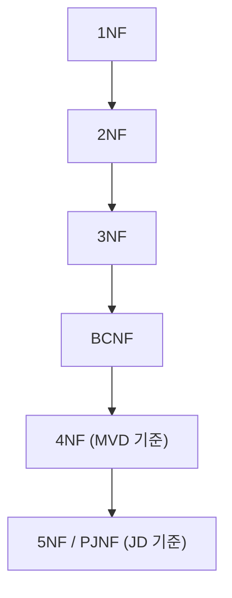

<Callout type="info">
  **이번 문서의 목표:** 이 파일을 다 읽으면 BCNF까지 정규화된 테이블에서도 왜 중복이 남을 수 있는지 설명하고, 다중값 종속과 조인 종속을 판별해 4NF·5NF까지 분해할 수 있게 된다.
</Callout>

## 왜 이 문서가 필요한가

16편에서 함수적 종속(Functional Dependency, FD)을 기준으로 1NF부터 BCNF까지 분해하는 절차를 다뤘습니다. BCNF에 도달하면 "키가 아닌 속성이 후보키를 결정하는" 형태의 이상 현상은 모두 제거됩니다. 그런데 BCNF 테이블인데도 여전히 데이터가 불필요하게 반복되는 경우가 있습니다. 원인은 FD가 아니라, FD보다 더 일반적인 형태의 종속인 **다중값 종속**(Multivalued Dependency, MVD)과 **조인 종속**(Join Dependency, JD)입니다. 독학사 4단계는 정규화를 출제 비중이 높은 핵심 축으로 다루므로, BCNF에서 멈추지 않고 4NF·5NF까지 판별·분해할 수 있어야 "정규화 문제 중 어려운 유형"에서 실점하지 않습니다.

> **쉽게 말하면:** FD가 "속성 A를 알면 속성 B가 하나로 정해진다"는 관계라면, MVD는 "속성 A를 알면 속성 B의 값 집합이 다른 속성과 무관하게 독립적으로 정해진다"는 관계입니다. 이 독립성이 중복을 만듭니다.

## 1. 다중값 종속(MVD)이 만드는 중복 — FD로는 안 보이는 문제

### 문제 상황: BCNF인데 중복이 있다

한 학생이 여러 과목을 수강하면서, 동시에 여러 취미를 갖는 상황을 하나의 테이블에 담았다고 합시다.

| 학생 | 과목 | 취미 |
|------|------|------|
| 김민준 | 데이터베이스 | 축구 |
| 김민준 | 데이터베이스 | 독서 |
| 김민준 | 운영체제 | 축구 |
| 김민준 | 운영체제 | 독서 |
| 이서연 | 자료구조 | 등산 |

이 테이블 `수강_취미(학생, 과목, 취미)`에는 자명하지 않은(trivial하지 않은) FD가 하나도 없습니다. 과목이 취미를 결정하지도 않고, 취미가 과목을 결정하지도 않기 때문입니다. FD가 없으므로 유일한 후보키는 세 속성을 모두 합친 `(학생, 과목, 취미)`이고, 이 테이블은 이미 **BCNF**입니다. 그런데도 김민준의 행이 4개나 반복되고 있습니다. 과목과 취미가 서로 완전히 독립적이라, "김민준이 듣는 과목 2개 × 김민준의 취미 2개 = 4행"이 강제로 만들어진 것입니다.

<Callout type="warning">
  **자주 틀리는 점:** "BCNF까지 갔으니 정규화는 끝났다"고 단정하는 것입니다. BCNF는 FD 기준의 최종 단계일 뿐, MVD·JD 기준의 이상 현상까지 막아주지는 않습니다.
</Callout>

### 정의: 다중값 종속(MVD)

릴레이션 R의 속성 집합을 X, Y, Z(= R의 전체 속성 - X - Y)로 나눌 때, **X ->> Y**(X가 Y를 다중값 결정한다)는 다음을 의미합니다. R의 X 값이 같은 두 튜플 t1, t2가 있을 때, t1의 Y값과 t2의 Z값을 조합한 튜플, 그리고 t2의 Y값과 t1의 Z값을 조합한 튜플이 항상 R에 존재해야 합니다.

$$
X \to\to Y \iff \forall t_1, t_2 \in R,\ t_1[X] = t_2[X] \Rightarrow \exists t_3, t_4 \in R
$$

- $X \to\to Y$: X가 Y를 다중값 결정한다는 표기(화살표가 이중으로 꺾인 것은 "여러 값을 통째로 결정한다"는 뜻)
- $t_1, t_2, t_3, t_4$: 릴레이션에 존재하는 튜플(행)들
- $t_1[X]$: 튜플 t1에서 속성 집합 X 부분만 꺼낸 값

풀어서 말하면, "X값이 같은 그룹 안에서는 Y값의 집합과 Z값의 집합이 서로 짝을 가리지 않고 자유롭게 조합되어야 한다"는 뜻입니다. 위 표에서 X = 학생, Y = 과목, Z = 취미라고 하면, 학생이 김민준으로 같은 두 튜플의 과목·취미를 서로 바꿔 조합해도 반드시 테이블에 존재해야 하므로 `학생 ->> 과목`(그리고 대칭적으로 `학생 ->> 취미`)이 성립합니다.

**MVD의 핵심 성질**은 다음과 같습니다.

- **자명한 MVD**: Y가 X의 부분집합이거나, X와 Y를 합친 것이 R의 전체 속성이면 그 MVD는 항상 성립하며 중복을 만들지 않습니다. 이런 MVD는 정규화 판정에서 무시합니다.
- **상보성(complementation)**: X ->> Y가 성립하면 X ->> Z(Z = 전체 속성 - X - Y)도 성립합니다. 위 예시에서 `학생 ->> 과목`이 성립하면 `학생 ->> 취미`도 자동으로 성립합니다.
- **모든 FD는 MVD다**: X → Y(FD)가 성립하면 X ->> Y(MVD)도 항상 성립합니다. 즉 MVD는 FD를 포함하는 더 넓은 개념입니다.

### 작은 예시로 다시 확인하기

`수강_취미` 테이블에서 학생 = 김민준인 두 튜플 (데이터베이스, 축구)와 (운영체제, 독서)를 골라 조합을 바꿔봅니다. (데이터베이스, 독서)와 (운영체제, 축구)도 테이블에 있어야 MVD가 성립하는데, 실제로 표에 이미 네 조합이 모두 있으므로 `학생 ->> 과목`이 성립함을 확인할 수 있습니다. 반대로 이서연 행은 과목과 취미가 하나씩뿐이라 조합할 상대가 없고, 이런 경우는 MVD 정의상 자동으로 만족(공집합에 대한 자명한 조건)됩니다.

## 2. 4NF: MVD 기준의 무손실 분해

### 정의

릴레이션 R이 **제4정규형(4NF**)에 있다는 것은, R에 성립하는 모든 **자명하지 않은** MVD X ->> Y에 대해 X가 R의 **슈퍼키**라는 뜻입니다. BCNF 정의에서 "X → Y이면 X가 슈퍼키"였던 조건을, MVD로 확장한 것이 4NF입니다.

`수강_취미(학생, 과목, 취미)`에서는 `학생 ->> 과목`이 자명하지 않은 MVD인데 학생은 슈퍼키가 아닙니다(후보키는 세 속성 전체였음을 앞서 확인했습니다). 그래서 이 테이블은 BCNF이지만 **4NF가 아닙니다.**

### 4NF 분해 절차

FD 기반 BCNF 분해와 마찬가지로, 위반하는 MVD를 기준으로 릴레이션을 둘로 쪼갭니다. X ->> Y가 위반되면 R을 R1(X, Y)과 R2(X, Z)로 분해합니다.

<Steps>

1. **위반 MVD 찾기**: `학생 ->> 과목`이 있고 학생은 슈퍼키가 아니므로 위반.
2. **분해 실행**: R1(학생, 과목), R2(학생, 취미)로 나눕니다.
3. **각 결과 확인**: R1에는 `학생 ->> 과목`이 자명한 MVD(Y와 X∪Y가 전체 속성)로만 남고, 후보키가 (학생, 과목) 전체이므로 4NF. R2도 마찬가지로 4NF.
4. **무손실 조인 검증**: R1과 R2를 자연 조인하면 원래 테이블의 모든 조합이 정확히 복원되는지 확인합니다.

</Steps>

분해 결과는 다음과 같습니다.

| 학생 | 과목 |
|------|------|
| 김민준 | 데이터베이스 |
| 김민준 | 운영체제 |
| 이서연 | 자료구조 |

| 학생 | 취미 |
|------|------|
| 김민준 | 축구 |
| 김민준 | 독서 |
| 이서연 | 등산 |

두 테이블 각각 3행뿐이라, 원래 4행이던 김민준 데이터가 2 + 2 = 4행에서 3 + 3 = 6행이 아니라 훨씬 압축됐습니다(원래 표에서 김민준 행 4개가 여기서는 2 + 2 = 4개로 줄었습니다). 두 테이블을 학생 기준으로 자연 조인하면 원래의 4개 조합이 정확히 다시 만들어지므로 **무손실 조인**이 성립합니다.

<Callout type="warning">
  **자주 틀리는 점:** MVD 기반 분해는 반드시 "X ->> Y이면 R을 (X, Y)와 (X, 전체 - X - Y)로 나눈다"는 상보성 규칙을 따라야 합니다. 임의로 다른 속성 조합으로 나누면 무손실 조인이 깨질 수 있습니다.
</Callout>

## 3. 조인 종속(JD)과 5NF — 셋 이상으로 쪼개야만 무손실인 경우

### 왜 4NF로는 부족한가

4NF는 "두 조각으로 나누는" MVD까지만 다룹니다. 그런데 어떤 릴레이션은 **세 조각 이상으로 나눠야만** 무손실 조인이 되고, 두 조각씩 어떻게 나눠도 정보가 손실되거나 가짜 튜플(spurious tuple)이 생기는 경우가 있습니다. 이를 설명하는 개념이 **조인 종속**(Join Dependency, JD)입니다.

### 정의: 조인 종속(JD)

릴레이션 R에 대해 $\Join(R_1, R_2, \ldots, R_n)$이 성립한다는 것은, R을 속성 집합 R1, ..., Rn으로 각각 투영(project)한 다음 그 결과들을 모두 자연 조인하면 정확히 원래의 R이 복원된다는 뜻입니다.

- $\Join$: 조인(join)을 뜻하는 기호. 괄호 안의 여러 릴레이션을 자연 조인한다는 표기.
- $R_1, \ldots, R_n$: R의 속성을 나눠 가진 부분 릴레이션(스키마)들. 이들의 합집합이 R의 전체 속성이어야 함.

**MVD는 JD의 특수한 경우**(두 조각으로만 나누는 JD)입니다. 즉 JD는 MVD보다 더 일반적인 개념입니다.

### 대표 예시: 대리점-제조사-부품 공급 관계

세 속성으로 이뤄진 공급 정보 테이블을 봅니다.

| 대리점 | 제조사 | 부품 |
|--------|--------|------|
| 한빛전자 | 삼성 | 모니터 |
| 한빛전자 | 삼성 | 키보드 |
| 한빛전자 | LG | 모니터 |
| 우주상사 | 삼성 | 모니터 |

이 관계는 다음 업무 규칙을 따른다고 가정합니다. "대리점이 어떤 제조사를 취급하고, 그 제조사가 어떤 부품을 만들고, 그 대리점이 그 부품을 취급 목록에 올려두었다면, 그 대리점은 그 제조사의 그 부품을 공급한다." 이 규칙이 성립하면 `(대리점,제조사)`, `(제조사,부품)`, `(대리점,부품)` 세 개의 이진 관계로 쪼개도 원래 테이블을 정확히 복원할 수 있습니다. 하지만 이 셋 중 **어느 두 개만으로는** 원래 테이블을 복원할 수 없습니다(두 개만 조인하면 실제로는 없던 조합, 즉 가짜 튜플이 생깁니다). 이런 성질을 **삼진 조인 종속**이라 부르고, 이 관계는 4NF까지는 만족해도(MVD 관점에서는 더 쪼갤 다중값 종속이 없음) 5NF는 만족하지 못할 수 있습니다.

### 정의: 5NF(제5정규형, PJNF)

릴레이션 R이 **5NF**(Project-Join Normal Form, PJNF라고도 함)에 있다는 것은, R에 성립하는 모든 자명하지 않은 조인 종속이 R의 **후보키**에 의해 함의된다는 뜻입니다(달리 말해, 후보키로 설명되지 않는 "우연한" JD가 없다는 뜻). 실무·시험에서는 "더 이상 정보 손실 없이 의미 있게 쪼갤 수 없는 최종 단계"로 이해하면 충분합니다.

<Callout type="warning">
  **자주 틀리는 점:** 조인 종속을 찾는 일반 알고리즘은 계산량이 매우 크기 때문에, 독학사 수준에서는 "주어진 삼진 관계가 어떤 업무 규칙(예: 위의 대리점-제조사-부품 규칙)을 따르는지 해석해서 분해 여부를 판단하는" 개념 문제로 출제될 가능성이 높습니다. 임의의 3속성 관계를 보자마자 기계적으로 5NF 위반이라 단정하지 않아야 합니다.
</Callout>

## 4. 정규형 사이의 포함 관계 정리

지금까지 다룬 정규형들의 포함 관계를 그림으로 정리합니다.

| 정규형 | 제거하는 이상의 근원 | 판별 기준 |
|--------|----------------------|-----------|
| BCNF | X → Y (FD) | 모든 결정자가 슈퍼키 |
| 4NF | X ->> Y (MVD) | 모든 자명하지 않은 MVD의 결정자가 슈퍼키 |
| 5NF | JD(R1, ..., Rn) | 모든 자명하지 않은 JD가 후보키로 함의됨 |

## 핵심 정리

- MVD(X ->> Y)는 FD보다 넓은 개념으로, "X값이 같으면 Y값 집합과 나머지 속성 값 집합이 서로 독립적으로 조합된다"는 뜻이며 상보성(X ->> Y이면 X ->> Z)을 가진다.
- 4NF는 모든 자명하지 않은 MVD의 결정자가 슈퍼키인 상태이며, 위반하는 MVD를 기준으로 두 릴레이션으로 무손실 분해한다.
- JD(조인 종속)는 셋 이상의 조각으로 나눠야만 무손실 조인이 되는 경우를 설명하며, MVD는 JD의 두 조각짜리 특수 사례다.
- 5NF(PJNF)는 모든 자명하지 않은 JD가 후보키로 설명되는 최종 정규형이며, 실전에서는 업무 규칙 해석형 문제로 나오기 쉽다.
- 정규형은 1NF ⊆ 2NF ⊆ 3NF ⊆ BCNF ⊆ 4NF ⊆ 5NF의 포함 관계를 가진다.

## 마무리 복습

<Quiz
  questionNumber={1}
  question="다중값 종속(MVD) X--&gt;&gt;Y에 대한 설명으로 옳지 않은 것은?"
  options={['X값이 같은 튜플들 사이에서 Y값 집합과 나머지 속성 값 집합이 독립적으로 조합될 수 있어야 한다', 'X to Y (FD)가 성립하면 X↠Y도 항상 성립한다', 'X↠Y가 성립하면 X↠Z(Z는 전체에서 X, Y를 뺀 나머지)도 항상 성립한다', 'MVD는 조인 종속보다 더 일반적인 개념이라 모든 JD는 MVD로 표현할 수 있다']}
  correctAnswer={4}
  explanation="MVD는 JD의 특수한 경우(두 조각으로만 나누는 조인 종속)이므로, 일반성 방향이 반대입니다. JD가 MVD보다 더 넓은 개념이며, 셋 이상으로 나눠야 하는 조인 종속은 MVD로 표현되지 않습니다. 나머지 세 보기는 MVD의 정의와 상보성, FD와의 관계를 정확히 설명합니다."
  optionExplanations={['옳은 설명이다. MVD의 정의 자체가 이 독립적 조합 조건이다', '옳은 설명이다. 모든 FD는 MVD의 특수한 경우이므로 항상 성립한다', '옳은 설명이다. 상보성 규칙에 따라 이 명제는 항상 참이다', '틀린 설명이다. 일반성의 방향이 반대로 서술되어 있다']}
/>

<Quiz
  questionNumber={2}
  question="릴레이션 수강_취미(학생, 과목, 취미)에서 과목과 취미가 서로 완전히 독립적이며 자명하지 않은 FD가 없을 때, 이 릴레이션의 정규형 상태로 가장 적절한 것은?"
  options={['BCNF이지만 4NF는 아니다', '2NF에도 속하지 않는다', 'BCNF를 만족하지 못하고 3NF까지만 만족한다', '이미 5NF까지 만족한다']}
  correctAnswer={1}
  explanation="자명하지 않은 FD가 없으므로 유일한 후보키는 세 속성 전체이고, 결정자가 항상 슈퍼키 조건을 자동으로 만족해 BCNF입니다. 그러나 학생--&gt;&gt;과목이라는 자명하지 않은 MVD가 있고 학생은 슈퍼키가 아니므로 4NF는 위반합니다."
  optionExplanations={['정답이다. FD 기준으로는 최종 단계이지만 MVD 기준의 4NF는 위반한다', '자명하지 않은 FD가 없어도 후보키가 전체 속성이 되는 극단적인 경우 2NF, 3NF, BCNF를 모두 자동으로 만족한다', 'FD가 없으면 BCNF를 위반할 방법이 없다. 이 보기는 원인과 결과를 반대로 설명한다', '4NF조차 만족하지 못하므로 5NF는 더더욱 만족할 수 없다']}
/>

<Quiz
  questionNumber={3}
  question="MVD 기준으로 4NF 위반을 분해할 때의 절차로 가장 올바른 것은? (R의 전체 속성을 U, 위반하는 MVD를 X--&gt;&gt;Y라 하자)"
  options={['R을 (X, Y)와 (X, U - X - Y)로 나눈다', 'R을 (Y, U - Y)와 (X, U - X)로 나눈다', 'X와 Y를 합친 속성만으로 새 릴레이션 하나를 만들고 원래 릴레이션은 그대로 둔다', 'Y를 제거하고 X와 나머지 속성만 남긴다']}
  correctAnswer={1}
  explanation="MVD의 상보성(X--&gt;&gt;Y이면 X--&gt;&gt;U-X-Y도 성립)에 따라, 위반하는 MVD를 기준으로 결정자 X를 공통으로 갖는 두 릴레이션 (X, Y)와 (X, U-X-Y)로 나누는 것이 무손실 조인을 보장하는 표준 절차입니다."
  optionExplanations={['정답이다. 상보성에 기반한 표준 4NF 분해 절차다', '이런 방식으로 나누면 공통 속성이 X, Y 어느 쪽으로도 명확히 대응되지 않아 무손실 조인이 보장되지 않는다', '원래 릴레이션을 그대로 두면 중복이 전혀 해소되지 않는다', 'Y를 제거하면 정보가 그대로 손실된다']}
/>

<Quiz
  questionNumber={4}
  question="조인 종속(JD)과 5NF에 대한 설명으로 옳은 것은?"
  options={['JD(R1, R2, R3)가 성립한다는 것은 R1, R2, R3을 각각 투영한 뒤 모두 자연 조인하면 원래 릴레이션이 정확히 복원된다는 뜻이다', '5NF를 만족하는 모든 릴레이션은 반드시 세 개 이상의 부분 릴레이션으로 분해되어 있어야 한다', 'JD는 항상 두 개의 부분 릴레이션 조합으로만 정의된다', '5NF는 BCNF보다 항상 더 낮은(약한) 정규형이다']}
  correctAnswer={1}
  explanation="조인 종속의 정의 자체가 부분 릴레이션들을 투영 후 자연 조인했을 때 원래 릴레이션이 정확히 복원되는 성질입니다. 5NF는 BCNF, 4NF보다 더 엄격한(강한) 상위 정규형입니다."
  optionExplanations={['정답이다. 조인 종속의 정의를 정확히 설명한다', '5NF는 조건을 만족하는 상태를 뜻할 뿐, 반드시 물리적으로 셋 이상으로 쪼개져 있어야 한다는 뜻은 아니다', 'JD는 두 조각짜리(=MVD)뿐 아니라 셋 이상의 조각으로도 정의될 수 있는 더 일반적인 개념이다', '5NF는 BCNF를 포함하는 상위 개념으로 더 엄격한 정규형이다']}
/>

<Quiz
  questionNumber={5}
  question="대리점-제조사-부품 공급 테이블에서, 세 속성 전체로는 JD(R1, R2, R3)가 성립하지만 어느 두 속성 쌍으로 투영해서 조인해도 가짜 튜플이 생기는 상황을 가장 잘 설명하는 것은?"
  options={['이 릴레이션은 4NF를 만족하지 못한 상태이므로 먼저 4NF 분해를 해야 한다', '이 릴레이션은 세 조각으로 쪼개야만 무손실 조인이 되는 삼진 조인 종속을 갖는 경우로, 5NF 판별의 대표 사례다', '이 상황은 함수적 종속만으로 완전히 설명되며 별도의 개념이 필요하지 않다', '두 속성 쌍으로 조인했을 때 가짜 튜플이 생기는 것은 항상 원래 데이터 입력 오류를 의미한다']}
  correctAnswer={2}
  explanation="세 조각으로만 무손실 조인이 성립하고 두 조각 조합으로는 성립하지 않는 것은 전형적인 삼진 조인 종속의 특징이며, 이를 판별·분해하는 것이 5NF의 핵심 주제입니다."
  optionExplanations={['4NF는 MVD 기준이며, 이 릴레이션에 자명하지 않은 MVD가 없다면 이미 4NF를 만족할 수 있다. 문제의 핵심은 JD이지 MVD가 아니다', '정답이다. 삼진 조인 종속과 5NF 판별의 정의를 정확히 설명한다', 'FD만으로는 이런 삼진 조인 관계를 설명할 수 없으며, 이 때문에 JD라는 별도 개념이 필요하다', '가짜 튜플은 데이터 오류가 아니라 분해 방식이 그 릴레이션의 조인 종속 구조와 맞지 않아서 생기는 정상적인 현상이다']}
/>

<Quiz
  questionNumber={6}
  question="정규형 사이의 포함 관계로 옳은 것은?"
  options={['5NF는 4NF에 포함되고, 4NF는 BCNF에 포함된다', 'BCNF를 만족하는 모든 릴레이션이 자동으로 4NF도 만족한다', '4NF를 만족하는 모든 릴레이션이 자동으로 5NF를 만족하는 것은 아니다', '1NF만 만족하면 4NF도 자동으로 만족한다']}
  correctAnswer={3}
  explanation="포함 관계는 1NF에서 5NF로 갈수록 더 엄격해지는 구조입니다(1NF ⊆ 2NF ⊆ 3NF ⊆ BCNF ⊆ 4NF ⊆ 5NF). 4NF를 만족해도 삼진 조인 종속 같은 JD 문제가 남아 있으면 5NF는 만족하지 못할 수 있습니다."
  optionExplanations={['포함 관계가 반대로 서술되어 있다. 5NF가 더 상위(엄격)의 정규형이다', 'BCNF는 FD만 다루고 MVD는 다루지 않으므로, BCNF라 해서 자동으로 4NF가 되지는 않는다(수강_취미 예시가 반례다)', '정답이다. 4NF와 5NF는 서로 다른 종류의 종속(MVD 대 JD)을 기준으로 하므로 4NF가 5NF를 보장하지 않는다', '1NF는 가장 약한 조건이므로 상위 정규형을 자동으로 보장하지 않는다']}
/>

## 참고 자료

- 국가평생교육진흥원 학습정보 - 과목별 평가영역: https://bdes.nile.or.kr
- GeeksforGeeks - Database Normalization: https://www.geeksforgeeks.org/normal-forms-in-dbms/
