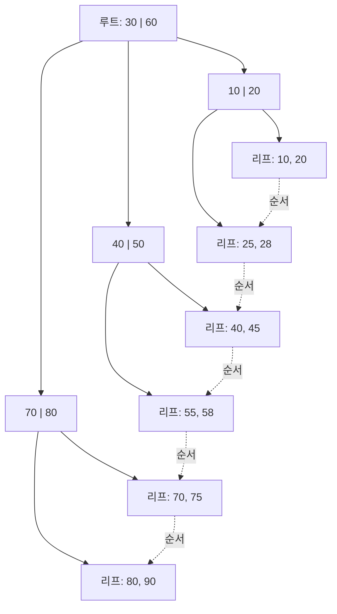

<Callout type="info">
  **이번 문서의 목표:** 이 파일을 다 읽으면 DBMS가 디스크에 데이터를 어떤 단위로 저장하고, 어떤 파일 조직·인덱스 구조를 쓸 때 검색이 왜 빨라지는지 계산으로 설명할 수 있게 된다.
</Callout>

## 왜 이 문서가 필요한가

지금까지 다룬 관계 모델·SQL·정규화는 "논리적으로 데이터를 어떻게 조직할까"를 다뤘습니다. 하지만 실제로 SQL 질의 하나가 실행되면, DBMS는 디스크의 특정 위치에서 데이터를 읽어와야 합니다. 이때 데이터가 디스크에 어떤 단위·구조로 저장되어 있는지에 따라 같은 질의라도 걸리는 시간이 수십 배 차이 납니다. 19편의 질의 최적화도, 여기서 다루는 파일 조직·인덱스 구조를 전제로 "어느 인덱스를 쓰면 몇 번 만에 찾는가"를 계산합니다.

> **쉽게 말하면:** 이 편은 "책 내용(테이블 데이터)을 서가에 어떻게 꽂아두고, 찾아보기(인덱스)를 어떻게 만들어두면 원하는 페이지를 빨리 펼칠 수 있는가"를 다루는 편입니다.

## 1. 저장의 기본 단위: 블록과 레코드

디스크는 바이트 하나씩이 아니라 **블록**(block, 또는 페이지page) 단위로 읽고 씁니다. 블록은 디스크와 메인 메모리 사이에 데이터를 주고받는 최소 단위로, 보통 4KB에서 16KB 사이의 고정 크기입니다. 테이블의 각 행은 **레코드**(record)라는 단위로 표현되며, 여러 레코드가 하나의 블록 안에 함께 저장됩니다.

- **블록(block)**: 디스크 입출력(I/O)의 최소 단위. DBMS는 필요한 레코드 하나만 읽고 싶어도, 그 레코드가 속한 블록 전체를 메모리로 읽어와야 한다.
- **레코드(record)**: 테이블의 한 행에 대응하는 저장 단위. 고정 길이 레코드와 가변 길이 레코드(VARCHAR 등 가변 길이 속성을 포함)로 나뉜다.
- **버퍼(buffer)**: 디스크에서 읽어온 블록을 임시로 담아두는 메인 메모리 영역. 같은 블록을 다시 요청하면 디스크까지 가지 않고 버퍼에서 바로 응답해 비용을 줄인다.

<Callout type="warning">
  **자주 틀리는 점:** "레코드 1개를 읽는 비용 = 1"이라고 계산하는 것입니다. 실제 비용은 **블록 입출력 횟수**로 측정합니다. 한 블록에 레코드가 100개 들어 있다면, 그 블록에서 원하는 레코드 1개를 찾는 비용이나 100개를 모두 찾는 비용이나 블록 I/O 관점에서는 똑같이 1번일 수 있습니다.

</Callout>

한 테이블이 차지하는 블록 수를 계산하는 기본 공식은 다음과 같습니다.

$$
\text{블록 수} = \left\lceil \frac{\text{전체 레코드 수}}{\text{블록당 레코드 수}} \right\rceil
$$

- $\lceil \cdot \rceil$: 올림(ceiling) 기호. 소수점이 남으면 무조건 한 블록을 더 쓴다는 뜻(레코드가 블록 경계를 넘어 쪼개지지 않는다고 가정할 때).
- 블록당 레코드 수는 보통 (블록 크기) ÷ (레코드 크기)로 계산한다.

예를 들어 블록 크기가 8,000바이트이고 레코드 하나가 200바이트라면 블록당 40개 레코드가 들어가고, 전체 100,000개 레코드가 있다면 100,000 ÷ 40 = 2,500블록이 필요합니다.

## 2. 파일 조직: 레코드를 디스크에 배치하는 방식

### 힙 파일(heap file)

레코드를 **삽입 순서대로**, 특별한 정렬 없이 아무 빈 공간에나 채워 넣는 방식입니다. 삽입은 항상 마지막 빈 블록에 붙이면 되므로 매우 빠르지만(평균 O(1)), 특정 값을 찾으려면 처음부터 끝까지 모든 블록을 훑는 **순차 탐색**(full scan)이 필요해 검색이 느립니다.

### 순차 파일(sequential file)

레코드를 **특정 검색 키(search key) 값 순서로 정렬**해서 저장하는 방식입니다. 정렬되어 있으므로 이진 탐색(binary search)을 적용할 수 있어 검색이 힙 파일보다 훨씬 빠릅니다. 대신 새 레코드를 삽입할 때 정렬 순서를 유지하려면 뒤 레코드들을 밀어내야 하므로(또는 오버플로 영역을 따로 두고 주기적으로 재정렬), 삽입·삭제 비용이 힙 파일보다 큽니다.

### 해시 파일(hash file)

검색 키 값에 **해시 함수**(hash function)를 적용해 나온 값으로 저장 위치(버킷)를 바로 계산하는 방식입니다. 해시 함수는 키 값을 입력받아 버킷 번호를 출력하는 함수로, 같은 키는 항상 같은 버킷으로 매핑됩니다. 등가 검색(`= 값`으로 찾는 검색)은 버킷 위치를 계산 한 번으로 바로 찾아가므로 매우 빠르지만(이상적으로 O(1)), 범위 검색(`>=`, `BETWEEN` 등)에는 쓸 수 없습니다. 해시 값이 특정 버킷에 몰리는 현상을 **충돌**(collision)이라 하며, 체이닝(chaining)이나 오버플로 버킷으로 처리합니다.

| 파일 조직 | 삽입 비용 | 등가 검색 | 범위 검색 | 대표 상황 |
|-----------|-----------|-----------|-----------|-----------|
| 힙 파일 | 매우 빠름 | 느림(전체 스캔) | 느림(전체 스캔) | 로그처럼 삽입만 잦고 검색은 드문 데이터 |
| 순차 파일 | 느림(재정렬 필요) | 빠름(이진 탐색) | 빠름(정렬 순서 그대로 읽기) | 정렬된 순서로 자주 조회하는 데이터 |
| 해시 파일 | 빠름 | 매우 빠름(계산 한 번) | 지원 안 됨 | 기본키로 정확히 일치하는 값만 찾는 상황 |

<Callout type="warning">
  **자주 틀리는 점:** 해시 파일을 "항상 가장 빠른 방식"으로 오해하는 것입니다. 해시는 등가 검색에서만 강하고, `WHERE 나이 >= 20`처럼 범위를 묻는 질의에는 어떤 버킷에 값이 있을지 예측할 수 없어 쓸모가 없습니다.
</Callout>

## 3. 인덱스: 데이터를 다시 훑지 않고 위치를 알아내는 방법

**인덱스**(index)는 검색 키 값과 그 값을 가진 레코드의 위치(포인터)를 별도로 정리해둔 보조 구조입니다. 인덱스 자체도 디스크에 저장되며, 인덱스를 먼저 조회해 위치를 알아낸 뒤 실제 데이터 블록으로 한 번에 찾아갑니다.

### 밀집 인덱스 vs 희소 인덱스

- **밀집 인덱스(dense index)**: 테이블의 **모든** 검색 키 값에 대해 인덱스 항목을 하나씩 둔다. 어떤 값이든 인덱스만 보면 바로 위치를 알 수 있지만, 인덱스 자체의 크기가 커진다.
- **희소 인덱스(sparse index)**: 데이터가 **정렬되어 있다는 전제** 아래, 몇 개 블록마다 대표 값 하나씩만 인덱스에 둔다. 인덱스 크기는 작지만, 찾는 값이 정확히 인덱스에 없으면 "그 값보다 작은 대표 값" 위치로 가서 그 블록 안을 순차 탐색해야 한다.

| 구분 | 밀집 인덱스 | 희소 인덱스 |
|------|-------------|-------------|
| 인덱스 항목 수 | 전체 레코드 수만큼 | 블록 수만큼(대표 값만) |
| 데이터 정렬 필요 여부 | 필요 없음 | 반드시 정렬되어 있어야 함 |
| 인덱스 크기 | 큼 | 작음 |
| 탐색 방식 | 인덱스에서 바로 위치 확인 | 대표 값 확인 후 블록 내 순차 탐색 |

### 1차 인덱스 vs 2차 인덱스, 그리고 클러스터 인덱스

- **1차 인덱스(primary index)**: 데이터 파일이 그 인덱스의 검색 키 순서로 **물리적으로 정렬**되어 있을 때의 인덱스. 보통 기본키에 대해 만든다.
- **2차 인덱스(secondary index)**: 데이터 파일의 물리적 정렬 순서와 **무관한** 속성에 만든 인덱스. 정렬 기준이 아니므로 희소 인덱스로 만들 수 없고, 항상 밀집 인덱스여야 한다(정렬되어 있지 않으니 대표 값 하나로 여러 레코드를 대표할 수 없기 때문).
- **클러스터 인덱스(clustered index)**: 1차 인덱스와 거의 같은 개념으로, 인덱스의 정렬 순서와 실제 데이터 저장 순서가 일치하는 인덱스를 가리킨다. 한 테이블에는 물리적으로 정렬 순서를 하나만 가질 수 있으므로 **클러스터 인덱스도 테이블당 하나만** 가능하다.

<Callout type="warning">
  **자주 틀리는 점:** "2차 인덱스는 희소 인덱스로 만들면 더 효율적이지 않을까"라고 생각하는 것입니다. 희소 인덱스는 데이터가 그 키로 정렬되어 있을 때만 성립합니다. 2차 인덱스는 정렬 기준이 아닌 속성에 만드므로, 대표 값 하나가 여러 레코드를 대신 가리킬 수 없어 반드시 밀집 인덱스로 만들어야 합니다.
</Callout>

## 4. B-트리와 B+트리: 실무 인덱스의 표준 구조

앞서 말한 순차 파일 기반 인덱스는 삽입·삭제가 잦으면 정렬을 유지하기 어렵다는 한계가 있습니다. 그래서 대부분의 DBMS는 삽입·삭제가 있어도 균형(balance)을 자동으로 유지하는 트리 구조인 **B-트리**(B-tree)와 그 변형인 **B+트리**(B+-tree)를 인덱스로 사용합니다.

### B-트리의 구조

B-트리는 **차수**(order) n을 갖는 다진 탐색 트리(multi-way search tree)로, 각 노드는 최대 n-1개의 키 값과 n개의 자식 포인터를 가집니다. 모든 리프 노드가 같은 깊이에 있어 항상 균형을 이루며, 각 노드 안에서 키와 함께 그 키에 대응하는 레코드 포인터(데이터 위치)를 직접 갖습니다.

### B+트리와 B-트리의 차이

**B+트리**는 실제 DBMS 인덱스에서 B-트리보다 훨씬 널리 쓰입니다. 차이는 다음과 같습니다.

- B-트리는 내부 노드에도 레코드 포인터를 둘 수 있지만, B+트리는 **모든 데이터 포인터를 리프 노드에만** 두고 내부 노드는 오직 검색을 안내하는 키 값만 가진다.
- B+트리는 리프 노드끼리 **연결 리스트**로 이어져 있어, 범위 검색(`BETWEEN`, `>=`)을 할 때 리프 노드 하나를 찾은 뒤 옆으로 쭉 읽기만 하면 된다. B-트리는 범위 검색을 하려면 트리를 오르내려야 해서 비효율적이다.

### 탐색 비용 계산: 차수와 트리 높이

B+트리에서 특정 키를 찾는 비용은 루트에서 리프까지 내려가는 **트리 높이**만큼의 블록 I/O입니다. 차수가 n이면 각 노드가 최대 n개의 자식을 가지므로, N개의 리프 항목을 담기 위한 트리 높이는 대략 다음과 같습니다.

$$
h = \lceil \log_n N \rceil
$$

- $h$: 트리의 높이(루트부터 리프까지 거쳐야 하는 단계 수, 곧 탐색에 필요한 블록 I/O 횟수와 거의 같음)
- $n$: 차수(각 노드가 가질 수 있는 최대 자식 수)
- $N$: 인덱스에 담긴 전체 키(리프 항목)의 개수
- $\log_n N$: N을 밑이 n인 로그로 계산한 값. "n을 몇 번 곱해야 N이 되는가"를 뜻함

예를 들어 차수 n = 100인 B+트리에 N = 1,000,000개의 키가 있다면, $\log_{100} 1{,}000{,}000 = 3$이므로 트리 높이는 3단계 정도이며, 100만 건 중 원하는 값을 **블록 I/O 3~4번**만으로 찾을 수 있습니다. 힙 파일 전체 스캔이라면 최악의 경우 블록 수만큼(수만 번) I/O가 필요했을 것과 비교하면 극적인 차이입니다.

<Callout type="warning">
  **자주 틀리는 점:** 트리 높이를 노드 개수와 혼동하는 것입니다. B+트리의 강점은 차수 n이 클수록(한 노드에 키를 많이 담을수록) 높이가 로그 스케일로 아주 낮게 유지된다는 점입니다. 차수가 크면 N이 백만, 천만으로 늘어도 높이는 3~4단계 수준에서 크게 늘지 않습니다.
</Callout>

## 5. 해싱: 정적 해싱과 동적 해싱

### 정적 해싱(static hashing)

버킷의 개수를 **미리 고정**해두고, 해시 함수로 계산한 값을 그 고정된 개수로 나눈 나머지 등을 이용해 버킷을 정합니다. 구조가 단순하지만, 데이터가 늘어나 버킷이 꽉 차면 **오버플로 체인**이 계속 길어져 성능이 나빠지고, 버킷 수를 늘리려면 전체 데이터를 다시 해싱(rehashing)해야 하는 큰 비용이 듭니다.

### 동적 해싱(dynamic hashing)

데이터 양에 따라 버킷 구조를 **점진적으로 늘리거나 줄이는** 방식입니다. 대표적으로 **확장 해싱**(extendible hashing)은 해시 값의 앞 몇 비트만 사용하는 디렉터리를 두고, 특정 버킷이 넘치면 그 버킷만 둘로 쪼개고 디렉터리의 해당 비트 수만 늘립니다. 전체를 재해싱하지 않고 국소적으로만 확장하므로, 데이터가 계속 늘어나는 환경에 유리합니다.

| 구분 | 정적 해싱 | 동적 해싱(확장 해싱) |
|------|-----------|------------------------|
| 버킷 수 | 고정 | 필요에 따라 증가·감소 |
| 데이터 급증 시 | 오버플로 체인 증가로 성능 저하 | 국소적 버킷 분할로 대응 |
| 재해싱 범위 | 전체 재해싱 필요 | 넘친 버킷만 분할 |
| 구현 복잡도 | 낮음 | 상대적으로 높음(디렉터리 관리) |

## 핵심 정리

- 디스크 입출력은 블록 단위로 이뤄지며, 비용은 레코드 개수가 아니라 블록 I/O 횟수로 측정한다.
- 힙 파일은 삽입이 빠르고 검색이 느리며, 순차 파일은 정렬 덕분에 이진 탐색이 가능하고, 해시 파일은 등가 검색에 매우 빠르지만 범위 검색을 지원하지 못한다.
- 밀집 인덱스는 모든 키에 항목을 두고, 희소 인덱스는 정렬된 데이터를 전제로 대표 값만 둔다. 1차·클러스터 인덱스는 데이터의 물리적 정렬과 일치하고, 2차 인덱스는 정렬과 무관해 항상 밀집이어야 한다.
- B+트리는 데이터 포인터를 리프에만 두고 리프끼리 연결 리스트로 이어, 등가·범위 검색 모두를 로그 스케일 높이(블록 I/O 몇 번)로 처리한다.
- 정적 해싱은 구조가 단순하지만 데이터 증가에 취약하고, 동적(확장) 해싱은 국소적으로 버킷을 분할해 유연하게 대응한다.

## 마무리 복습

<Quiz
  questionNumber={1}
  question="디스크 저장 구조에 대한 설명으로 옳은 것은?"
  options={['DBMS는 레코드 하나 단위로 디스크 입출력을 수행한다', '디스크 입출력의 비용은 읽어들인 블록 수로 측정하는 것이 일반적이다', '한 블록에는 레코드가 정확히 하나만 저장될 수 있다', '버퍼는 디스크 장치 내부에 있는 고정 저장 공간을 의미한다']}
  correctAnswer={2}
  explanation="DBMS는 블록 단위로 디스크에 접근하므로, 질의 비용은 보통 블록 I/O 횟수로 측정합니다. 한 블록에는 여러 레코드가 저장될 수 있고, 버퍼는 메인 메모리에 있는 임시 저장 영역입니다."
  optionExplanations={['블록 단위로 입출력하며, 필요한 레코드가 속한 블록 전체를 읽어온다', '정답이다. 블록 I/O 횟수가 표준적인 비용 척도다', '블록 크기가 레코드 크기보다 크면 여러 레코드가 한 블록에 함께 저장된다', '버퍼는 메인 메모리 상의 임시 영역이지 디스크 장치 내부 공간이 아니다']}
/>

<Quiz
  questionNumber={2}
  question="힙 파일, 순차 파일, 해시 파일의 비교로 옳지 않은 것은?"
  options={['힙 파일은 삽입 비용이 낮지만 검색 시 전체 스캔이 필요할 수 있다', '순차 파일은 정렬되어 있어 이진 탐색으로 검색할 수 있다', '해시 파일은 등가 검색뿐 아니라 범위 검색에도 효율적이다', '순차 파일은 삽입 시 정렬 순서를 유지하는 비용이 힙 파일보다 크다']}
  correctAnswer={3}
  explanation="해시 파일은 해시 함수 값으로 버킷을 계산하는 방식이라 등가 검색에는 매우 빠르지만, 범위 검색은 값이 어느 버킷에 흩어져 있을지 알 수 없어 지원하지 못합니다."
  optionExplanations={['옳은 설명이다. 힙 파일은 삽입은 빠르지만 검색이 느리다', '옳은 설명이다. 정렬된 파일은 이진 탐색이 가능하다', '틀린 설명이다. 해시 파일은 범위 검색에 부적합하다', '옳은 설명이다. 순차 파일은 삽입 시 재정렬 비용이 든다']}
/>

<Quiz
  questionNumber={3}
  question="밀집 인덱스와 희소 인덱스에 대한 설명으로 옳은 것은?"
  options={['밀집 인덱스는 데이터가 정렬되어 있지 않아도 사용할 수 있다', '희소 인덱스는 검색 키의 모든 값에 대해 인덱스 항목을 둔다', '희소 인덱스는 데이터가 정렬되어 있지 않은 경우에도 자유롭게 적용할 수 있다', '희소 인덱스는 밀집 인덱스보다 항목 수가 많아 인덱스 크기가 더 크다']}
  correctAnswer={1}
  explanation="밀집 인덱스는 모든 검색 키 값에 대해 항목을 두므로 데이터의 물리적 정렬 여부와 무관하게 사용할 수 있습니다. 희소 인덱스는 정렬을 전제로 대표 값만 두는 방식입니다."
  optionExplanations={['정답이다. 밀집 인덱스는 모든 값에 대해 항목을 두므로 정렬 여부와 무관하게 동작한다', '희소 인덱스는 대표 값만 둔다. 모든 값을 두는 것은 밀집 인덱스의 정의다', '희소 인덱스는 정렬을 전제로 해야만 대표 값이 의미를 가진다', '희소 인덱스는 항목 수가 적어 인덱스 크기가 밀집 인덱스보다 작다']}
/>

<Quiz
  questionNumber={4}
  question="1차 인덱스, 2차 인덱스, 클러스터 인덱스에 대한 설명으로 옳지 않은 것은?"
  options={['클러스터 인덱스는 인덱스의 정렬 순서와 데이터의 물리적 저장 순서가 일치한다', '한 테이블은 클러스터 인덱스를 여러 개 가질 수 있다', '2차 인덱스는 데이터 파일의 물리적 정렬 순서와 무관한 속성에 만든다', '2차 인덱스는 항상 밀집 인덱스로 구성해야 한다']}
  correctAnswer={2}
  explanation="한 테이블의 데이터는 물리적으로 하나의 정렬 순서만 가질 수 있으므로, 클러스터 인덱스는 테이블당 하나만 만들 수 있습니다."
  optionExplanations={['옳은 설명이다. 클러스터 인덱스의 정의다', '틀린 설명이다. 물리적 정렬은 하나뿐이므로 클러스터 인덱스는 테이블당 하나만 가능하다', '옳은 설명이다. 2차 인덱스는 정렬 기준과 무관한 속성에 만든다', '옳은 설명이다. 정렬 기준이 아니므로 대표 값으로 대신할 수 없어 밀집 인덱스여야 한다']}
/>

<Quiz
  questionNumber={5}
  question="차수(order) n = 100인 B+트리에 N = 1,000,000개의 키가 저장되어 있을 때, 특정 키를 찾기 위한 트리 높이(블록 I/O 횟수)를 계산한 값으로 가장 적절한 것은?"
  options={['약 100번', '약 1,000,000번', '약 3~4번', '약 10,000번']}
  correctAnswer={3}
  explanation="트리 높이 h는 h = 올림(log_n N) 공식으로 구합니다. log_100(1,000,000)은 100의 3제곱이 1,000,000이므로 3에 해당하고, 실제 트리에서는 반올림·오차를 고려해 3~4단계 정도로 봅니다. B+트리의 강점은 데이터가 100만 건이어도 로그 스케일 덕분에 몇 단계만에 찾아간다는 점입니다."
  optionExplanations={['차수 100은 각 노드의 자식 수이지, 트리 높이 자체가 아니다', '이는 전체 데이터를 처음부터 끝까지 순차 탐색할 때의 비용에 해당한다. B+트리를 쓰는 이유가 바로 이 비용을 피하기 위해서다', '정답이다. 로그 스케일 계산 결과와 일치한다', '이 값은 어떤 표준 계산으로도 나오지 않는 값이다']}
/>

<Quiz
  questionNumber={6}
  question="정적 해싱과 동적(확장) 해싱을 비교한 설명으로 옳은 것은?"
  options={['정적 해싱은 데이터가 늘어나도 재해싱 없이 자동으로 버킷을 늘린다', '동적 해싱은 버킷이 넘치면 전체 데이터를 다시 해싱해야 한다', '정적 해싱은 버킷 수가 고정되어 있어 데이터 급증 시 오버플로 체인이 길어질 수 있다', '동적 해싱과 정적 해싱 모두 범위 검색에 매우 효율적이다']}
  correctAnswer={3}
  explanation="정적 해싱은 버킷 수를 미리 고정하므로, 데이터가 예상보다 많이 늘어나면 오버플로 체인이 길어져 성능이 저하됩니다. 확장 해싱 같은 동적 해싱은 넘친 버킷만 국소적으로 분할해 이 문제를 완화합니다."
  optionExplanations={['정적 해싱은 버킷 수가 고정이라 자동으로 늘어나지 않는다. 이 설명은 동적 해싱에 가깝다', '동적 해싱(확장 해싱)의 핵심은 국소적으로만 분할해 전체 재해싱을 피한다는 점이다', '정답이다. 정적 해싱의 대표적인 한계다', '해싱 계열 파일·인덱스는 등가 검색에 강할 뿐, 범위 검색에는 원천적으로 부적합하다']}
/>

## 참고 자료

- 국가평생교육진흥원 학습정보 - 과목별 평가영역: https://bdes.nile.or.kr
- GeeksforGeeks DBMS Tutorial (Indexing, File Organization): https://www.geeksforgeeks.org/dbms/indexing-in-databases-set-1/
