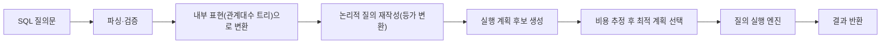

<Callout type="info">
  **이번 문서의 목표:** 이 파일을 다 읽으면 SQL 질의 하나가 처리되는 전체 단계를 설명하고, 조인 알고리즘별 비용을 계산해 어떤 실행 계획이 더 유리한지 판단할 수 있게 된다.
</Callout>

## 왜 이 문서가 필요한가

같은 결과를 내는 SQL 질의라도 **어떤 순서로, 어떤 방법으로** 실행하느냐에 따라 걸리는 시간이 크게 달라집니다. `SELECT * FROM 학생, 수강 WHERE 학생.학번 = 수강.학번 AND 학과 = '컴퓨터공학'`이라는 질의를 생각해봅시다. 두 테이블을 통째로 조인(join)한 다음 학과 조건으로 거르는 방법과, 학과 조건으로 먼저 걸러낸 소수의 학생만 조인하는 방법은 결과는 같지만 처리해야 하는 데이터 양이 전혀 다릅니다. 18편에서 다룬 저장 구조·인덱스는, 바로 이 "어떤 방법이 더 싼가"를 계산하는 근거가 됩니다.

> **쉽게 말하면:** 이 편은 "SQL이라는 주문서를 받은 DBMS가 머릿속으로 여러 요리 순서를 저울질해서 가장 빠른 순서를 고르는 과정"을 다루는 편입니다.

## 1. 질의 처리 단계: 파싱부터 실행까지

SQL 문 하나가 결과를 내기까지 DBMS 내부에서는 다음 단계를 거칩니다.

- **파싱(parsing)**: SQL 문법이 올바른지 확인하고, 테이블·컬럼 이름이 실제로 존재하는지(카탈로그와 대조) 검증한다. 이 단계를 통과하면 SQL 문은 **관계대수 트리** 형태의 내부 표현으로 바뀐다(관계대수는 07·08편 참고).
- **논리적 재작성(rewrite)**: 관계대수 트리를 의미는 그대로 두고 더 효율적인 형태로 바꾼다. 아래에서 다룰 "셀렉트 내리기" 같은 등가 변환 규칙이 이 단계에 해당한다.
- **실행 계획 생성(plan generation)**: 같은 논리적 트리라도 조인 순서·조인 알고리즘·인덱스 사용 여부에 따라 여러 물리적 실행 계획이 나올 수 있다.
- **비용 추정과 선택(cost estimation)**: 각 후보 계획이 예상 블록 I/O를 얼마나 쓸지 추정하고, 가장 싼 계획을 고른다. 이를 **비용 기반 최적화**(Cost-Based Optimization, CBO)라 한다.
- **실행(execution)**: 선택된 계획대로 실제 디스크·메모리 연산을 수행해 결과를 만든다.

## 2. 관계대수 등가 변환 규칙 — 셀렉트 내리기

관계대수 표현식은 결과가 같으면서도 계산 비용이 다른 여러 형태로 바꿔 쓸 수 있습니다. 이런 규칙을 **등가 변환 규칙**(equivalence rule)이라 하며, 그중 가장 널리 쓰이는 것이 **셀렉트 내리기**(selection pushdown, 셀렉션을 트리 아래로 밀어 넣기)입니다.

### 규칙: 셀렉트는 조인보다 먼저

$$
\sigma_{\theta}(R \Join S) \equiv \sigma_{\theta}(R) \Join S \quad (\theta\text{가 } R\text{의 속성만 포함할 때})
$$

- $\sigma_\theta$: 셀렉트(select, 선택) 연산. 조건 θ(세타)를 만족하는 행만 남긴다.
- $\Join$: 자연 조인(natural join) 연산.
- $\theta$: 셀렉트 조건. 예를 들어 "학과 = '컴퓨터공학'"처럼 R의 속성만으로 판단할 수 있는 조건.
- $\equiv$: 두 관계대수 표현식이 항상 같은 결과를 낸다는 뜻(등가).

이 규칙은 "조인해서 큰 결과를 만든 다음 걸러내는 것"보다 "먼저 걸러서 작아진 관계끼리 조인하는 것"이 항상 비용 면에서 유리하거나 같다는 사실에 기반합니다. 조인 연산은 두 테이블의 곱셈에 가까운 비용이 들기 때문에, 조인에 들어가는 테이블의 크기를 줄이는 것이 최적화의 가장 기본적인 방향입니다.

### 예시로 확인하기

`학생(학번, 이름, 학과)`이 10,000행, `수강(학번, 과목)`이 50,000행 있고, 학과가 '컴퓨터공학'인 학생은 200명뿐이라고 합시다.

- **셀렉트를 나중에 하는 계획**: 학생 10,000행과 수강 50,000행을 먼저 조인(중간 결과가 50,000행 근처로 커짐) → 그중 학과 조건을 만족하는 행만 필터링.
- **셀렉트를 먼저 내리는 계획**: 학생에서 학과 = '컴퓨터공학'인 200행만 먼저 골라냄 → 그 200행만 수강과 조인.

두 계획의 최종 결과는 같지만, 두 번째 계획은 조인에 참여하는 학생 쪽 데이터가 10,000행에서 200행으로 줄어, 조인 연산 자체의 비용이 훨씬 작아집니다.

### 그 밖의 대표 등가 변환 규칙

| 규칙 이름 | 내용 |
|-----------|------|
| 셀렉트 분배(cascade) | 여러 조건을 AND로 묶은 셀렉트는 조건별로 나눠 순서를 바꿔도 결과가 같다 |
| 셀렉트-프로젝트 교환 | 프로젝트(투영) 결과에 남는 속성에 대한 조건이면 셀렉트를 프로젝트보다 먼저 적용할 수 있다 |
| 조인의 교환·결합 법칙 | $R \Join S \equiv S \Join R$, $(R \Join S) \Join T \equiv R \Join (S \Join T)$ — 조인 순서를 바꿔도 결과는 같으므로 순서를 고르는 것이 최적화의 대상이 된다 |

<Callout type="warning">
  **자주 틀리는 점:** "셀렉트를 내리면 항상 이득"이라고 무조건 암기하는 것입니다. 정확한 조건은 그 셀렉트 조건이 **내려보내는 쪽 릴레이션의 속성만으로 판단 가능**해야 한다는 점입니다. 조건이 조인된 이후에만 계산되는 속성(예: 조인으로 생긴 계산 컬럼)을 참조한다면 그 셀렉트는 내릴 수 없습니다.
</Callout>

## 3. 비용 기반 최적화의 기본 개념

**비용 기반 최적화(CBO**)는 여러 실행 계획 후보의 예상 비용을 수치로 추정하고, 가장 낮은 비용의 계획을 선택하는 방식입니다. 비용은 보통 **디스크 블록 입출력 횟수**를 기준으로 추정합니다(18편의 블록 I/O 개념 참고).

비용 추정에는 다음과 같은 **통계 정보**(카탈로그 정보)가 사용됩니다.

- 각 테이블의 전체 레코드 수와 블록 수
- 각 속성의 서로 다른 값의 개수(distinct value 수) → 조건을 만족하는 예상 행 수 추정에 사용
- 인덱스 유무와 종류(B+트리인지 해시인지)

이 정보를 바탕으로 옵티마이저(optimizer, 최적화기)는 여러 조인 순서·조인 알고리즘 조합을 평가하는데, 테이블 개수가 늘어날수록 가능한 조인 순서의 경우의 수는 조합적으로 폭발합니다(테이블 n개의 조인 순서는 최대 n! 가지). 그래서 실제 옵티마이저는 동적 계획법(dynamic programming)이나 휴리스틱(heuristic, 경험적 규칙)을 사용해 탐색 범위를 줄입니다.

<Callout type="warning">
  **자주 틀리는 점:** 비용 기반 최적화를 "가장 결과가 빨리 나오는 계획을 실제로 다 실행해보고 고르는 것"으로 오해하는 것입니다. 실제로는 실행 전에 **통계 정보를 이용한 추정치**만으로 계획을 고르며, 통계가 오래되거나 부정확하면 추정과 실제 실행 시간이 어긋날 수 있습니다.
</Callout>

## 4. 조인 알고리즘 비교: 중첩 루프·정렬 병합·해시 조인

두 테이블을 물리적으로 조인하는 방법에도 여러 알고리즘이 있으며, 데이터 크기와 인덱스 유무에 따라 유불리가 갈립니다. 테이블 R(레코드 수 $n_R$, 블록 수 $b_R$)과 테이블 S(레코드 수 $n_S$, 블록 수 $b_S$)를 조인한다고 합시다.

### 중첩 루프 조인(nested-loop join)

바깥 루프에서 R의 블록을 하나씩 읽고, 그 블록의 각 레코드마다 안쪽 루프에서 S 전체를 다시 훑으며 조인 조건을 검사하는 방식입니다. 가장 단순하지만, 인덱스가 없으면 최악의 비용을 가집니다.

$$
\text{비용}_{\text{NL}} = b_R + (n_R \times b_S)
$$

- $b_R$: R을 한 번 읽는 데 필요한 블록 I/O(바깥 테이블은 한 번만 순차적으로 읽음)
- $n_R$: R의 레코드 수(R의 레코드마다 S를 처음부터 다시 훑어야 함)
- $b_S$: S 전체를 한 번 읽는 데 필요한 블록 수

바깥 테이블(R)을 무엇으로 고르느냐에 따라 비용이 달라지므로, **레코드 수가 더 적은 테이블을 바깥 루프로 두는 것**이 유리합니다.

### 정렬 병합 조인(sort-merge join)

R과 S를 각각 조인 키 기준으로 정렬한 다음, 정렬된 두 파일을 병합(merge)하며 같은 키를 매칭하는 방식입니다. 정렬 비용이 별도로 들지만, 이미 정렬되어 있거나(예: 클러스터 인덱스) 정렬 비용을 감수할 만큼 데이터가 크면 효율적입니다.

$$
\text{비용}_{\text{SM}} = (\text{정렬 비용}_R + \text{정렬 비용}_S) + (b_R + b_S)
$$

- 정렬 비용: 각 테이블을 정렬하는 데 드는 블록 I/O(이미 정렬돼 있으면 0에 가까움)
- $b_R + b_S$: 정렬이 끝난 뒤 병합 단계에서 두 테이블을 각각 한 번씩만 읽으면 되는 비용

### 해시 조인(hash join)

두 테이블 중 더 작은 쪽(보통 R)을 조인 키 기준 해시 함수로 메모리에 **해시 테이블**을 만들고, 다른 테이블(S)을 한 번 훑으며 같은 해시 값을 가진 R의 항목과 매칭하는 방식입니다. 인덱스나 정렬이 없어도 평균적으로 매우 효율적입니다.

$$
\text{비용}_{\text{HJ}} \approx b_R + b_S
$$

- $b_R$: 작은 쪽 테이블을 읽어 해시 테이블을 만드는 비용
- $b_S$: 큰 쪽 테이블을 한 번 훑으며 매칭하는 비용
- 단, 해시 테이블이 메인 메모리에 다 들어가지 못하면(R이 너무 크면) 여러 단계로 나눠 처리하는 분할(partition) 비용이 추가된다.

### 비교표

| 조인 알고리즘 | 기본 비용 | 유리한 상황 | 불리한 상황 |
|---------------|-----------|-------------|-------------|
| 중첩 루프 조인 | $b_R + n_R \times b_S$ | 안쪽 테이블에 조인 키 인덱스가 있을 때(비용이 $b_R + n_R \times (\text{인덱스 탐색 비용})$으로 줄어듦) | 두 테이블 모두 크고 인덱스가 없을 때 |
| 정렬 병합 조인 | 정렬 비용 + $b_R + b_S$ | 이미 정렬되어 있거나 클러스터 인덱스가 있을 때 | 매번 새로 정렬해야 하고 데이터가 매우 클 때 |
| 해시 조인 | 약 $b_R + b_S$ | 등가 조인(`=`)이고 작은 쪽이 메모리에 들어갈 때 | 부등호 조인이나 두 테이블 모두 메모리보다 훨씬 클 때 |

### 계산 예시로 비용 비교하기

R = 1,000블록, S = 3,000블록, R의 레코드 수 $n_R$ = 100,000건이라고 합시다.

**중첩 루프 조인 비용**(인덱스 없이 R을 바깥 루프로 둘 때):

$$
\text{비용}_{\text{NL}} = 1{,}000 + (100{,}000 \times 3{,}000) = 300{,}001{,}000
$$

**해시 조인 비용**(R이 메모리 해시 테이블에 들어갈 만큼 작다고 가정):

$$
\text{비용}_{\text{HJ}} \approx 1{,}000 + 3{,}000 = 4{,}000
$$

같은 두 테이블을 조인하는데도 중첩 루프 조인은 약 3억 블록 I/O, 해시 조인은 약 4,000 블록 I/O로, 자릿수가 완전히 다른 차이가 납니다. 이 계산이 바로 옵티마이저가 "왜 인덱스가 없으면 해시 조인이나 정렬 병합 조인을 선호하는가"를 뒷받침하는 근거입니다.

<Callout type="warning">
  **자주 틀리는 점:** 중첩 루프 조인을 "항상 나쁜 방법"으로 단정하는 것입니다. 안쪽 테이블의 조인 키에 인덱스가 있다면, 안쪽 루프의 비용이 S 전체를 훑는 $b_S$가 아니라 인덱스 탐색 비용(18편의 B+트리 탐색 비용 정도)으로 줄어들어, 작은 테이블끼리의 조인에서는 오히려 가장 효율적일 수 있습니다.
</Callout>

## 5. 조인 순서와 인덱스 사용의 직관

세 테이블 이상을 조인하는 질의에서는 **조인 순서**도 비용에 큰 영향을 줍니다. 일반적인 직관은 다음과 같습니다.

- **선택도(selectivity)가 높은(결과 행이 적게 남는) 조건을 먼저 적용한다.** 셀렉트 내리기와 같은 원리로, 중간 결과가 작아야 이후 조인 비용도 작아집니다.
- **작은 중간 결과부터 조인한다.** 세 테이블 A, B, C를 조인할 때 (A ⋈ B) ⋈ C와 A ⋈ (B ⋈ C)는 결과는 같지만, 중간 결과 크기가 작은 순서를 고르는 쪽이 유리합니다.
- **인덱스가 있는 조인 키를 활용한다.** 조인 조건에 인덱스가 걸려 있다면 중첩 루프 조인이라도 인덱스 탐색으로 안쪽 루프 비용을 크게 줄일 수 있습니다.

이런 판단은 독학사 수준에서 "여러 실행 계획 중 어느 것이 더 저렴한가"를 계산·비교하는 문제로 출제되기 쉬우므로, 위의 조인 알고리즘별 비용 공식을 실제 숫자에 대입해 계산하는 연습이 중요합니다.

## 핵심 정리

- 질의 처리는 파싱 → 관계대수 내부 표현 변환 → 논리적 재작성(등가 변환) → 실행 계획 생성 → 비용 추정·선택 → 실행 순으로 진행된다.
- 셀렉트 내리기는 조인 이전에 필터링해 조인에 참여하는 데이터 양을 줄이는 대표적인 등가 변환 규칙이며, 조건이 해당 릴레이션 속성만으로 판단 가능해야 적용할 수 있다.
- 비용 기반 최적화는 카탈로그 통계 정보를 이용해 여러 실행 계획의 블록 I/O 비용을 추정하고 최소 비용 계획을 선택한다.
- 중첩 루프 조인은 $b_R + n_R \times b_S$, 정렬 병합 조인은 정렬 비용 + $b_R + b_S$, 해시 조인은 약 $b_R + b_S$로 비용 성격이 다르며, 인덱스·정렬·메모리 크기에 따라 유불리가 갈린다.
- 조인 순서 최적화는 선택도가 높은 조건과 작은 중간 결과를 먼저 처리하는 방향으로 이뤄진다.

## 마무리 복습

<Quiz
  questionNumber={1}
  question="SQL 질의 처리 단계의 순서로 옳은 것은?"
  options={['파싱 -> 논리적 재작성(등가 변환) -> 실행 계획 생성 및 비용 추정 -> 실행', '실행 -> 파싱 -> 비용 추정 -> 논리적 재작성', '비용 추정 -> 파싱 -> 실행 -> 논리적 재작성', '논리적 재작성 -> 파싱 -> 실행 -> 비용 추정']}
  correctAnswer={1}
  explanation="질의 처리는 SQL 문을 문법·의미적으로 검증하는 파싱 단계에서 시작해, 관계대수 트리로 바꾼 뒤 등가 변환으로 논리적으로 재작성하고, 여러 실행 계획 후보의 비용을 추정해 최적안을 고른 다음 실제로 실행하는 순서로 진행됩니다."
  optionExplanations={['정답이다. 파싱이 항상 가장 먼저 이뤄져야 이후 단계가 성립한다', '실행이 가장 먼저 온다는 것은 순서가 완전히 뒤바뀐 설명이다', '비용 추정은 파싱과 재작성 이후에 가능한 단계다', '파싱 없이 재작성이 먼저 이뤄질 수 없다']}
/>

<Quiz
  questionNumber={2}
  question="셀렉트 내리기(selection pushdown) 등가 변환 규칙에 대한 설명으로 옳은 것은?"
  options={['셀렉트 조건이 조인 이후에만 계산되는 속성을 참조해도 항상 아래로 내릴 수 있다', '셀렉트 조건이 한쪽 릴레이션의 속성만으로 판단 가능하다면, 그 셀렉트를 조인보다 먼저 적용해도 결과는 같다', '셀렉트 내리기를 적용하면 항상 결과 집합의 내용이 달라진다', '셀렉트 내리기는 관계대수가 아니라 SQL 문법에서만 정의되는 규칙이다']}
  correctAnswer={2}
  explanation="셀렉트 내리기는 조건이 해당 릴레이션의 속성만으로 판단 가능할 때, 조인 전에 먼저 필터링해도 최종 결과가 동일하다는 관계대수 등가 규칙입니다. 결과 집합의 내용은 그대로이고, 처리해야 하는 중간 데이터 양만 줄어듭니다."
  optionExplanations={['조인 이후에만 계산되는 속성을 참조하는 조건은 내려보낼 수 없다', '정답이다. 등가 변환 규칙의 정확한 조건과 효과를 설명한다', '등가 변환이므로 최종 결과 집합의 내용은 항상 동일하게 유지된다', '셀렉트 내리기는 관계대수 수준에서 정의되는 최적화 규칙이며, 관계대수는 SQL 실행의 내부 표현으로 쓰인다']}
/>

<Quiz
  questionNumber={3}
  question="비용 기반 최적화(CBO)에 대한 설명으로 옳지 않은 것은?"
  options={['비용 추정에는 테이블의 레코드 수, 블록 수, 속성별 서로 다른 값의 개수 등 통계 정보가 사용된다', '테이블 개수가 늘어날수록 가능한 조인 순서의 경우의 수가 조합적으로 늘어난다', '비용 기반 최적화는 모든 후보 계획을 실제로 끝까지 실행해본 뒤 가장 빠른 것을 선택하는 방식이다', '통계 정보가 오래되어 부정확하면 실제 실행 시간과 추정 비용이 어긋날 수 있다']}
  correctAnswer={3}
  explanation="비용 기반 최적화는 실행 전에 통계 정보를 바탕으로 비용을 추정해 계획을 고르는 방식이며, 후보 계획을 실제로 다 실행해보는 것이 아닙니다. 그렇게 하면 최적화 자체의 비용이 실행 비용보다 커질 수 있습니다."
  optionExplanations={['옳은 설명이다. 카탈로그 통계 정보가 비용 추정의 근거다', '옳은 설명이다. 조인 순서의 경우의 수는 최대 n!까지 늘어난다', '틀린 설명이다. 실제 실행이 아니라 추정치로 계획을 고른다', '옳은 설명이다. 통계가 부정확하면 추정과 실제가 어긋나는 것이 CBO의 한계다']}
/>

<Quiz
  questionNumber={4}
  question="R(1,000블록, 레코드 수 100,000건)과 S(3,000블록)를 인덱스 없이 중첩 루프 조인으로 처리할 때(R을 바깥 루프로 둠), 비용 계산식과 그 결과로 옳은 것은?"
  options={['b_R + b_S = 4,000', 'b_R + (n_R x b_S) = 300,001,000', 'n_R x n_S 만으로 계산되며 인덱스 여부와 무관하다', 'b_R x b_S = 3,000,000']}
  correctAnswer={2}
  explanation="인덱스 없는 중첩 루프 조인의 비용 공식은 b_R + (n_R x b_S)입니다. 대입하면 1,000 + (100,000 x 3,000) = 300,001,000이 됩니다."
  optionExplanations={['이 계산식은 해시 조인의 근사 비용식이지 중첩 루프 조인의 공식이 아니다', '정답이다. 중첩 루프 조인 공식에 값을 대입한 결과와 일치한다', '중첩 루프 조인 비용은 레코드 수와 블록 수를 함께 고려하며, 인덱스가 있으면 비용이 크게 줄어든다', '이 계산식은 표준적인 조인 비용 공식이 아니다']}
/>

<Quiz
  questionNumber={5}
  question="해시 조인(hash join)에 대한 설명으로 옳은 것은?"
  options={['해시 조인은 항상 정렬이 먼저 끝난 두 테이블에만 적용할 수 있다', '해시 조인은 작은 쪽 테이블로 메모리에 해시 테이블을 만들고 큰 쪽 테이블을 한 번 훑으며 매칭해, 등가 조인에서 평균적으로 효율적이다', '해시 조인은 부등호(<, >) 조인 조건에서 가장 효율적으로 동작한다', '해시 조인은 두 테이블의 크기와 무관하게 항상 동일한 비용을 가진다']}
  correctAnswer={2}
  explanation="해시 조인은 정렬을 요구하지 않으며, 작은 쪽 테이블로 해시 테이블을 만들고 큰 쪽을 훑으며 매칭하는 방식입니다. 이 방식은 등가(=) 조인에서 평균적으로 매우 효율적입니다."
  optionExplanations={['해시 조인은 정렬이 필요 없다는 점이 정렬 병합 조인과의 핵심 차이다', '정답이다. 해시 조인의 동작 방식과 강점을 정확히 설명한다', '해시 함수는 값이 같은지만 판단할 수 있어, 부등호 조건에는 적용할 수 없다', '해시 테이블이 메모리에 다 들어가지 못하면 분할 처리가 필요해 비용이 늘어난다']}
/>

<Quiz
  questionNumber={6}
  question="세 테이블 이상을 조인하는 질의의 실행 계획을 고를 때의 일반적인 직관으로 옳지 않은 것은?"
  options={['선택도가 높아 결과 행이 적게 남는 조건을 먼저 적용해 중간 결과를 줄인다', '조인 순서를 어떻게 바꾸든 중간 결과의 크기는 항상 동일하므로 순서는 성능에 영향을 주지 않는다', '조인 키에 인덱스가 있다면 중첩 루프 조인이라도 안쪽 루프 비용을 크게 줄일 수 있다', '작은 중간 결과부터 순차적으로 조인해 나가는 편이 유리한 경우가 많다']}
  correctAnswer={2}
  explanation="조인은 교환·결합 법칙 덕분에 결과는 같지만, 중간 결과의 크기는 조인 순서에 따라 크게 달라질 수 있습니다. 그래서 조인 순서 선택이 비용 기반 최적화의 핵심 과제 중 하나입니다."
  optionExplanations={['옳은 설명이다. 셀렉트 내리기와 같은 원리로 중간 결과를 줄이는 것이 유리하다', '틀린 설명이다. 조인 순서에 따라 중간 결과 크기가 달라지므로 순서 선택이 중요한 최적화 대상이다', '옳은 설명이다. 인덱스가 있으면 중첩 루프 조인도 효율적일 수 있다', '옳은 설명이다. 작은 중간 결과부터 조인하는 것이 일반적으로 유리하다']}
/>

## 참고 자료

- 국가평생교육진흥원 학습정보 - 과목별 평가영역: https://bdes.nile.or.kr
- Oracle Database SQL Tuning Guide - 실행 계획과 옵티마이저 개념: https://docs.oracle.com/en/database/oracle/oracle-database/
