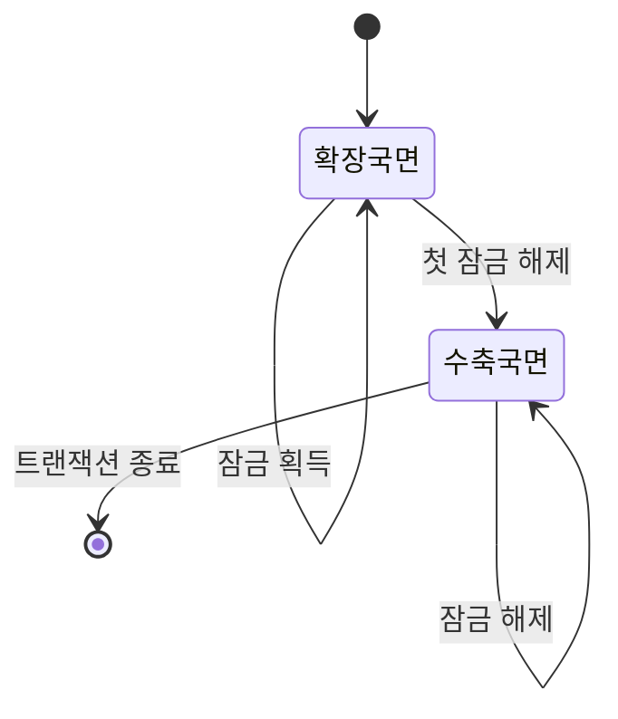
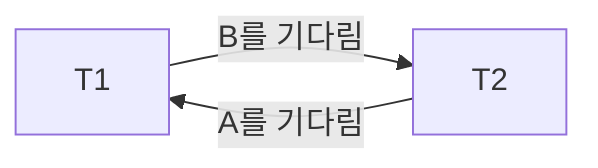

<Callout type="info">
  **이번 문서의 목표:** 이 문서를 다 읽으면 잠금 기반 프로토콜(2PL·strict 2PL)과 타임스탬프 기반 프로토콜의 동작을 스케줄에 직접 적용해 판정할 수 있고, wait-for 그래프로 교착상태를 탐지하며 예방·회피 기법의 차이를 설명할 수 있다.
</Callout>

## 왜 동시성 제어가 필요한가

20편에서 여러 트랜잭션(transaction, 하나의 논리적 작업 단위)이 동시에 실행되는 스케줄(schedule)이 직렬 가능(serializable)해야 결과가 안전하다는 것을 배웠다. 자세한 내용은 20편을 참고하되, 이 문서에서 꼭 필요한 부분만 다시 짚으면 다음과 같다. 직렬 가능성이란 여러 트랜잭션을 동시에 실행한 결과가 **어떤 순서로든 하나씩 차례로 실행한 결과와 같아야 한다**는 성질이다.

문제는 "직렬 가능한 스케줄만 만들어라"는 요구를 **사후에 검사**하는 방식으로는 실제 DBMS(DataBase Management System, 데이터베이스 관리 시스템)를 운영할 수 없다는 점이다. 트랜잭션이 이미 끝난 뒤에 "어라, 이 스케줄은 직렬 가능하지 않았네"라고 판정해 봐야 이미 잘못된 결과가 사용자에게 나간 뒤다. 그래서 DBMS는 트랜잭션이 실행되는 **도중에** 연산 순서를 통제해서, 결과가 항상 직렬 가능하도록 미리 강제하는 프로토콜(protocol, 규약)을 쓴다. 이것이 동시성 제어(concurrency control)다.

> **쉽게 말하면:** 동시성 제어는 "여러 트랜잭션이 뒤섞여 실행되더라도 결과가 항상 직렬 가능하도록, 실행 중에 미리 순서를 통제하는 규칙"이다.

동시성 제어 기법은 크게 두 갈래로 나뉜다. 하나는 **잠금(lock)을 걸어서 충돌 가능한 접근을 아예 못 하게 막는** 비관적(pessimistic) 방식이고, 다른 하나는 **일단 실행시키고 타임스탬프(timestamp, 트랜잭션이 시작된 시각을 나타내는 고유한 순번)로 순서를 사후 검증하는** 방식이다. 이 문서는 이 두 갈래(잠금 기반의 2PL, 타임스탬프 순서 프로토콜)와 이들이 공통으로 마주치는 문제인 교착상태(deadlock)를 다룬다.

## 잠금 기반 동시성 제어: 공유 잠금과 배타 잠금

### 왜 필요한가

두 트랜잭션이 같은 데이터 항목을 동시에 건드리면 문제가 생긴다. 예를 들어 트랜잭션 T1과 T2가 동시에 계좌 잔액 `A`를 읽고 각자 계산해서 쓰면, 나중에 쓴 트랜잭션이 먼저 쓴 트랜잭션의 결과를 덮어써 버리는 갱신 손실(lost update) 문제가 생긴다. 이를 막으려면 "지금 이 데이터를 누가 어떤 방식으로 쓰고 있는지"를 표시해서 다른 트랜잭션의 접근을 통제해야 한다. 그 표시가 잠금(lock)이다.

> **쉽게 말하면:** 잠금은 "지금 이 데이터, 내가 쓰고 있으니 건드리지 마"라고 표시해 두는 꼬리표다.

### 정의: 공유 잠금과 배타 잠금

- **공유 잠금**(shared lock, S-lock): 데이터를 **읽기만** 할 때 거는 잠금이다. 여러 트랜잭션이 같은 데이터에 동시에 S-lock을 걸 수 있다(읽기는 여럿이 동시에 해도 안전하므로).
- **배타 잠금**(exclusive lock, X-lock): 데이터를 **쓰기** 위해 거는 잠금이다. 한 번에 오직 하나의 트랜잭션만 X-lock을 가질 수 있고, 다른 트랜잭션은 S-lock도 X-lock도 걸 수 없다.

두 잠금이 함께 쓰일 수 있는지는 잠금 호환성 표(compatibility matrix)로 정리한다. 표의 각 셀은 "행의 트랜잭션이 이미 그 잠금을 갖고 있을 때, 열의 잠금 요청을 다른 트랜잭션이 허용받는지"를 나타낸다.

| 이미 걸린 잠금 \ 새 요청 | S-lock 요청 | X-lock 요청 |
|---|---|---|
| S-lock | 허용 | 거부 |
| X-lock | 거부 | 거부 |

이 표에서 핵심은 "S–S만 공존 가능, 나머지 조합은 모두 거부"라는 규칙이다. 이 규칙 하나가 읽기끼리는 서로 방해하지 않으면서, 쓰기는 항상 배타적으로 이루어지게 만드는 핵심 장치다.

**자주 틀리는 점**: S-lock을 가진 트랜잭션이 나중에 같은 데이터에 쓰기를 하고 싶으면, S-lock을 X-lock으로 승격(upgrade)해야 한다. 이때 다른 트랜잭션이 같은 데이터에 S-lock을 갖고 있으면 승격이 즉시 되지 않고 대기해야 한다는 점을 놓치기 쉽다.

## 2단계 잠금 프로토콜(2PL)

### 왜 필요한가

단순히 "쓰기 전에 X-lock을 걸고, 다 쓰면 바로 풀어준다"는 규칙만으로는 직렬 가능성이 보장되지 않는다. 잠금을 걸고 푸는 **시점**을 잘못 정하면, 여전히 직렬 가능하지 않은 스케줄이 만들어질 수 있다. 이를 막기 위해 잠금 획득과 해제를 두 단계로 엄격히 나누는 규칙이 2단계 잠금 프로토콜(Two-Phase Locking, 2PL)이다.

### 정의

2PL은 각 트랜잭션의 실행을 두 국면(phase)으로 나눈다.

1. **확장 국면**(growing phase): 잠금만 획득할 수 있고, 어떤 잠금도 풀 수 없다.
2. **수축 국면**(shrinking phase): 잠금만 해제할 수 있고, 새로운 잠금은 획득할 수 없다.

한 번 잠금을 풀기 시작하면(수축 국면 진입), 다시는 새 잠금을 얻을 수 없다는 것이 핵심 규칙이다. 이 규칙을 지키는 모든 트랜잭션들로 이루어진 스케줄은 **충돌 직렬 가능**(conflict serializable)함이 증명되어 있다(증명 자체는 독학사 시험 범위를 넘어서므로 결과만 기억한다).

### 2PL의 변형: 기본 2PL, strict 2PL, strong strict 2PL

기본 2PL은 직렬 가능성만 보장할 뿐, 트랜잭션이 중간에 실패해서 롤백(rollback, 되돌리기)될 때 다른 트랜잭션까지 연쇄적으로 롤백되는 연쇄 실행(cascading rollback) 문제를 막지 못한다. 이 문제를 보완한 변형들이 실무·시험에서 더 자주 등장한다.

| 구분 | 잠금 해제 시점 | 연쇄 롤백 방지 | 회복 가능성 |
|---|---|---|---|
| 기본 2PL | 수축 국면에서 아무 때나(커밋 전에도 가능) | 못 막음 | 보장 안 됨 |
| Strict 2PL | X-lock은 커밋·중단 시점까지 유지 | X-lock 기준으로 막음 | 보장됨 |
| Strong Strict 2PL(엄격 2PL) | S-lock·X-lock 모두 커밋·중단 시점까지 유지 | 완전히 막음 | 보장됨(가장 안전) |

실제 상용 DBMS(Oracle 등)는 대부분 strict 2PL 계열을 채택한다. 이유는 표에서 보듯 "커밋 전에는 어떤 잠금도 풀지 않는다"는 규칙이 회복(22편에서 다룰 로그 기반 회복)과 맞물렸을 때 훨씬 예측 가능한 동작을 만들기 때문이다.

### 계산 예제: 스케줄이 2PL을 따르는지 판정하기

다음 스케줄에서 T1, T2가 각각 잠금을 요청·해제하는 순서가 주어졌다고 하자(`S(A)`는 A에 S-lock 획득, `X(A)`는 A에 X-lock 획득, `U(A)`는 A의 잠금 해제를 뜻한다).

| 시각 | T1 | T2 |
|---|---|---|
| t1 | S(A) | |
| t2 | S(B) | |
| t3 | U(A) | |
| t4 | | S(A) |
| t5 | S(C) | |
| t6 | | S(B) |

**판정 절차**

1. T1의 잠금 이력을 시간순으로 나열한다: 획득(S(A)) → 획득(S(B)) → 해제(U(A)) → 획득(S(C)).
2. "해제 이후에 획득이 다시 나오는가"를 확인한다. t3에서 U(A)로 해제했는데, t5에서 다시 S(C)로 **새 잠금을 획득**했다.
3. 이는 "잠금 해제 후 다시 잠금 획득"에 해당하므로 확장 국면과 수축 국면이 뒤섞였다.

**결론**: T1은 2PL을 위반한다. 수축 국면(t3에서 시작)에 들어간 뒤 t5에서 다시 확장 국면으로 되돌아갔기 때문이다. 만약 t5의 `S(C)`가 t3보다 앞선 시점(즉 U(A) 이전)에 있었다면 2PL을 만족했을 것이다.

**자주 틀리는 점**: "T1이 A만 다시 건드리지 않았으니 문제없다"고 생각하기 쉽지만, 2PL의 국면 규칙은 **트랜잭션 전체의 잠금 이력**에 적용되는 규칙이지 특정 데이터 항목 하나에만 적용되는 규칙이 아니다. 어떤 데이터를 새로 잠그든, 한 번 해제를 시작한 뒤에는 절대 안 된다.

## 타임스탬프 순서 프로토콜

### 왜 필요한가

잠금 기반 방식은 충돌 가능성을 미리 막는(비관적) 접근이라 잠금 관리 비용과 교착상태 위험이 따른다. 이와 다른 접근으로, 각 트랜잭션에 시작 시각을 나타내는 고유한 타임스탬프(timestamp)를 부여하고, "타임스탬프 순서대로 실행된 것처럼" 강제하는 방법이 타임스탬프 순서 프로토콜(Timestamp Ordering Protocol, TO)이다.

> **쉽게 말하면:** 타임스탬프 순서 프로토콜은 "늦게 시작한 트랜잭션이 먼저 시작한 트랜잭션보다 먼저 실행된 것처럼 보이면 그 연산을 거부(롤백)한다"는 규칙이다.

### 정의: read/write 타임스탬프와 판정 규칙

데이터 항목 `Q`마다 다음 두 값을 관리한다.

- $\text{R\_TS}(Q)$: Q를 성공적으로 읽은 트랜잭션들 중 가장 큰 타임스탬프(가장 최근에 읽은 트랜잭션의 시작 시각).
- $\text{W\_TS}(Q)$: Q에 성공적으로 쓴 트랜잭션들 중 가장 큰 타임스탬프.

트랜잭션 $T_i$(타임스탬프 $TS(T_i)$)가 Q를 읽거나 쓰려 할 때 다음 규칙을 적용한다.

**읽기 요청** `read(Q)`:

- $TS(T_i) < \text{W\_TS}(Q)$이면 $T_i$보다 미래에 속한 트랜잭션이 이미 Q에 썼다는 뜻이므로, $T_i$는 롤백된다.
- 그렇지 않으면 읽기를 허용하고, $\text{R\_TS}(Q)$를 $TS(T_i)$와 현재 값 중 더 큰 값으로 갱신한다.

**쓰기 요청** `write(Q)`:

- $TS(T_i) < \text{R\_TS}(Q)$이거나 $TS(T_i) < \text{W\_TS}(Q)$이면, $T_i$보다 미래의 트랜잭션이 이미 Q를 읽었거나 썼다는 뜻이므로 $T_i$는 롤백된다.
- 그렇지 않으면 쓰기를 허용하고 $\text{W\_TS}(Q)$를 $TS(T_i)$로 갱신한다.

### 계산 예제: 타임스탬프 순서 프로토콜 적용

T1의 타임스탬프는 10, T2의 타임스탬프는 20이라 하자($T1$이 먼저 시작했다). 데이터 항목 `A`의 초기값은 $\text{R\_TS}(A) = 0$, $\text{W\_TS}(A) = 0$이다. 다음 연산이 순서대로 들어온다.

1. `T2: read(A)` — 판정: $TS(T2)=20 \ge \text{W\_TS}(A)=0$이므로 허용. $\text{R\_TS}(A)$를 $\max(0, 20) = 20$으로 갱신.
2. `T1: write(A)` — 판정: $TS(T1)=10 < \text{R\_TS}(A)=20$이므로 **거부**. T1을 롤백하고 더 큰 새 타임스탬프(예: 30)로 재시작시킨다.
3. `T2: write(A)` — 판정: $TS(T2)=20 \ge \text{R\_TS}(A)=20$이고 $20 \ge \text{W\_TS}(A)=0$이므로 허용. $\text{W\_TS}(A)$를 20으로 갱신.

**결과 해석**: T1은 자신보다 늦게 시작한 T2가 이미 A를 읽어버린 뒤에 A에 쓰려고 했다. 이 쓰기를 허용하면 "T2가 나중 값을 못 보고 예전 값을 읽은 것"처럼 되어 T1을 T2보다 앞에 두는 직렬 순서와 모순된다. 그래서 프로토콜은 T1을 롤백시켜 이 모순을 원천 차단한다.

**Thomas 쓰기 규칙(Thomas' Write Rule)**: 위 기본 규칙은 $TS(T_i) < \text{W\_TS}(Q)$인 쓰기를 무조건 거부하지만, 이 경우 사실 그 쓰기 결과는 어차피 더 최신 쓰기에 덮어써질 값이므로 **그냥 무시(no-op)해도 결과가 같다**는 점에 착안해 롤백 대신 해당 쓰기를 조용히 건너뛰는 최적화다. 읽기 조건($TS(T_i) < \text{R\_TS}(Q)$)에 걸린 경우는 이 규칙으로도 구제되지 않는다.

## 교착상태: 예방·회피·탐지

### 왜 생기는가

잠금 기반 프로토콜은 필연적으로 교착상태(deadlock) 위험을 안는다. T1이 A를 잠그고 B를 기다리는데, 동시에 T2가 B를 잠그고 A를 기다리면 둘 다 영원히 서로를 기다리게 된다.

> **쉽게 말하면:** 교착상태는 "너 끝나면 내가 할게" "아니, 너 먼저 끝내"라고 서로 미루며 아무도 못 끝나는 상황이다.

이를 그림으로 나타낸 것이 대기 그래프(wait-for graph)다. 트랜잭션을 노드로 하고, $T_i \to T_j$ 간선은 "$T_i$가 $T_j$가 가진 잠금을 기다리고 있다"는 뜻이다. 이 그래프에 **사이클(cycle)이 생기면 반드시 교착상태**다.

### 계산 예제: 대기 그래프로 교착상태 탐지

세 트랜잭션 T1, T2, T3의 잠금 요청 상황이 다음과 같다고 하자.

- T1은 A를 갖고 B를 기다린다.
- T2는 B를 갖고 C를 기다린다.
- T3는 C를 갖고 A를 기다린다.

**절차**: 각 "기다린다" 관계를 간선으로 그린다. T1 → T2(B를 기다리므로 B를 가진 T2로), T2 → T3(C를 가진 T3로), T3 → T1(A를 가진 T1로). 이 세 간선을 연결하면 T1 → T2 → T3 → T1으로 **사이클이 만들어진다**.

**결론**: 사이클이 존재하므로 T1, T2, T3는 교착상태에 빠져 있다. 이 사이클에 포함된 트랜잭션 중 하나 이상을 희생자(victim)로 선정해 강제로 롤백시켜야 나머지가 진행될 수 있다.

### 예방·회피·탐지 비교

교착상태에 대응하는 전략은 "언제 개입하는가"를 기준으로 세 가지로 나뉜다.

| 전략 | 개입 시점 | 방식 | 대표 기법 |
|---|---|---|---|
| 예방(prevention) | 트랜잭션 시작 전 | 애초에 순환 대기가 생길 수 없도록 잠금 순서·타임스탬프 규칙을 강제 | wait-die, wound-wait |
| 회피(avoidance) | 잠금 요청 시점 | 요청을 허용했을 때 교착이 생길지 미리 시뮬레이션해서 위험하면 거부 | 은행원 알고리즘 계열 |
| 탐지 후 회복(detection and recovery) | 주기적으로 | 일단 자유롭게 실행시키고, 대기 그래프에서 사이클을 찾아 사후에 희생자를 롤백 | 대기 그래프 사이클 탐지 |

**wait-die와 wound-wait**: 둘 다 타임스탬프를 이용해 "오래된 트랜잭션(먼저 시작한 트랜잭션)을 우대"하는 예방 기법이지만, 처리 방식이 반대다.

| 상황($T_i$가 $T_j$가 가진 잠금을 요청) | wait-die | wound-wait |
|---|---|---|
| $T_i$가 더 오래됨(먼저 시작) | $T_i$는 대기(die 하지 않음) | $T_i$가 $T_j$를 강제로 중단(wound)시키고 잠금을 뺏음 |
| $T_i$가 더 최근(나중 시작) | $T_i$는 스스로 중단(die)됨 | $T_i$는 대기 |

두 기법 모두 "오래된 트랜잭션이 나중 트랜잭션에게 영원히 밀리지 않는다"는 점을 보장해서 특정 트랜잭션이 계속 희생되는 기아 상태(starvation)를 막는다. 차이는 오래된 트랜잭션이 마주쳤을 때 **대기하느냐(wait-die) 상대를 뺏느냐(wound-wait**)뿐이다.

**자주 틀리는 점**: "예방이 항상 최선"이라고 생각하기 쉽지만, 예방 기법은 실제로 교착이 일어나지 않을 상황까지 미리 트랜잭션을 중단시키는 비용(불필요한 롤백)을 치른다. 반대로 탐지 기법은 평소엔 자유롭게 실행하다가 실제 사이클이 생겼을 때만 개입하므로, 교착 발생 빈도가 낮은 환경에서는 오히려 효율적일 수 있다. 어느 쪽이 "무조건 낫다"는 정답은 없고, 시스템 특성에 따라 선택한다.

## 핵심 정리

- 공유 잠금(S-lock)은 읽기끼리 공존 가능하지만, 배타 잠금(X-lock)은 어떤 잠금과도 공존할 수 없다.
- 2PL은 확장 국면(잠금만 획득)과 수축 국면(잠금만 해제)을 엄격히 분리해 충돌 직렬 가능성을 보장한다. strict 2PL은 X-lock을, strong strict 2PL은 S-lock·X-lock 모두 커밋 시점까지 유지해 연쇄 롤백을 막는다.
- 타임스탬프 순서 프로토콜은 $\text{R\_TS}(Q)$·$\text{W\_TS}(Q)$와 트랜잭션 타임스탬프를 비교해, 시간 역행이 생기는 연산을 롤백시킨다. Thomas 쓰기 규칙은 무의미해질 쓰기를 롤백 대신 무시한다.
- 교착상태는 대기 그래프의 사이클로 탐지한다. 예방(wait-die·wound-wait)·회피·탐지 후 회복은 개입 시점과 비용 구조가 다른 별개의 전략이다.

## 마무리 복습

<Quiz
  questionNumber={1}
  question="공유 잠금(S-lock)과 배타 잠금(X-lock)의 호환성에 대한 설명으로 옳은 것은?"
  options={['S-lock끼리는 동시에 여러 트랜잭션이 가질 수 있다', 'X-lock을 가진 트랜잭션이 있어도 다른 트랜잭션이 S-lock을 걸 수 있다', 'S-lock을 가진 트랜잭션이 있으면 다른 트랜잭션은 항상 X-lock만 걸 수 없고 S-lock은 걸 수 있다는 점에서 X-lock과 동일하게 취급된다', '한 트랜잭션이 X-lock을 가지면 같은 트랜잭션도 같은 데이터에 S-lock을 추가로 걸 수 없다']}
  correctAnswer={1}
  explanation="잠금 호환성 표에서 S-S 조합만 허용되고 S-X, X-S, X-X는 모두 거부된다. 읽기끼리는 서로 방해하지 않으므로 여러 트랜잭션이 동시에 S-lock을 가질 수 있다."
  optionExplanations={['정답. S-lock은 읽기 전용이라 여러 트랜잭션이 동시에 가질 수 있다', 'X-lock이 걸려 있으면 S-lock 요청도 거부된다는 규칙을 놓친 오답이다', 'S-lock이 걸려 있으면 X-lock 요청은 거부되므로 두 잠금을 동일하게 취급한 것은 잘못이다', '같은 트랜잭션 자신의 잠금 승격·중복 요청은 별도로 처리되며, 이 선택지의 단정 자체가 표의 규칙과 무관한 착각이다']}
/>

<Quiz
  questionNumber={2}
  question="2단계 잠금 프로토콜(2PL)에 대한 설명으로 옳지 않은 것은?"
  options={['확장 국면에서는 잠금 획득만 가능하다', '수축 국면에서는 새로운 잠금을 획득할 수 없다', '2PL을 따르는 스케줄은 항상 충돌 직렬 가능하다', '2PL은 잠금 해제 시점을 규제하므로 별도 조치 없이도 연쇄 롤백을 완전히 막아준다']}
  correctAnswer={4}
  explanation="기본 2PL은 충돌 직렬 가능성만 보장할 뿐, 커밋 전에 잠금을 해제할 수 있어 연쇄 롤백을 막지 못한다. 연쇄 롤백을 막으려면 strict 2PL 이상의 변형이 필요하다."
  optionExplanations={['확장 국면의 정의와 일치하는 옳은 설명이다', '수축 국면의 정의와 일치하는 옳은 설명이다', '2PL의 핵심 성질로 옳은 설명이다', '옳지 않은 것을 찾는 문제의 정답. 기본 2PL은 연쇄 롤백을 막지 못하며 이를 막으려면 strict 2PL이 필요하다']}
/>

<Quiz
  questionNumber={3}
  question="strict 2PL과 strong strict 2PL(엄격 2PL)의 차이를 옳게 설명한 것은?"
  options={['strict 2PL은 S-lock과 X-lock 모두 커밋 시점까지 유지하고, strong strict 2PL은 X-lock만 유지한다', 'strict 2PL은 X-lock만 커밋 시점까지 유지하고, strong strict 2PL은 S-lock과 X-lock 모두 커밋 시점까지 유지한다', '두 방식 모두 잠금을 트랜잭션 중간에 자유롭게 해제할 수 있다', 'strict 2PL은 교착상태를 원천적으로 없애는 기법이다']}
  correctAnswer={2}
  explanation="strict 2PL은 쓰기 충돌 방지를 위해 X-lock만 커밋·중단 시점까지 유지하고, strong strict 2PL은 S-lock까지 함께 유지해 더 완전하게 연쇄 롤백을 막는다."
  optionExplanations={['두 방식의 설명이 뒤바뀐 오답이다', '정답. X-lock만 유지하는 것이 strict 2PL, S-lock까지 유지하는 것이 strong strict 2PL이다', '두 방식 모두 커밋·중단 전에는 해당 잠금을 해제하지 않는다는 점이 핵심이므로 틀렸다', '2PL 계열은 직렬 가능성과 연쇄 롤백 방지를 다루는 기법이며 교착상태 자체를 없애주지 않는다']}
/>

<Quiz
  questionNumber={4}
  question="타임스탬프 순서 프로토콜에서 트랜잭션 T의 read(Q) 연산이 롤백되는 조건은?"
  options={['TS(T)가 W_TS(Q)보다 작을 때', 'TS(T)가 R_TS(Q)보다 클 때', 'TS(T)가 W_TS(Q)보다 클 때', 'TS(T)가 R_TS(Q)보다 작을 때']}
  correctAnswer={1}
  explanation="read(Q)는 TS(T) &lt; W_TS(Q)일 때 롤백된다. T보다 미래의 트랜잭션이 이미 Q에 값을 써 놓았다면, T가 그 값을 못 보고 예전 값을 읽는 것은 직렬 순서와 모순되기 때문이다."
  optionExplanations={['정답. 이 조건이 read 연산의 롤백 조건이다', 'R_TS(Q)와의 비교는 write 연산의 롤백 조건 중 하나이며 read의 롤백 조건이 아니다', 'TS(T)가 W_TS(Q)보다 크면 오히려 정상적으로 허용되는 경우다', 'R_TS(Q)와의 비교는 read가 아니라 write 연산에서 사용되는 조건이다']}
/>

<Quiz
  questionNumber={5}
  question="Thomas의 쓰기 규칙(Thomas' Write Rule)에 대한 설명으로 옳은 것은?"
  options={['TS(T) < R_TS(Q) 조건에 걸린 쓰기도 무시하고 넘어가도 된다는 규칙이다', 'TS(T)가 W_TS(Q)보다 작을 때 조건에 걸린 쓰기를 롤백 대신 무시해도 결과가 같다는 규칙이다', '모든 읽기 연산에 대해 롤백을 면제해 주는 규칙이다', '2PL과 결합해서만 적용할 수 있는 규칙이다']}
  correctAnswer={2}
  explanation="Thomas의 쓰기 규칙은 TS(T) &lt; W_TS(Q)로 거부될 쓰기가 어차피 더 최신 쓰기에 덮어써질 값이므로, 롤백 대신 조용히 무시(no-op)해도 최종 결과가 같다는 최적화다."
  optionExplanations={['R_TS(Q)에 걸리는 경우는 T보다 미래의 트랜잭션이 이미 읽었다는 뜻이라 무시로는 구제되지 않는다', '정답. W_TS(Q) 조건에 걸린 쓰기만 무시 처리가 가능하다', '읽기 연산에는 적용되지 않는 규칙이다', 'Thomas의 쓰기 규칙은 타임스탬프 순서 프로토콜의 일부이며 2PL과는 별개의 기법이다']}
/>

<Quiz
  questionNumber={6}
  question="대기 그래프(wait-for graph)를 이용한 교착상태 탐지에 대한 설명으로 옳은 것은?"
  options={['그래프에 간선이 하나라도 있으면 교착상태다', '그래프에 사이클이 있으면 교착상태다', '그래프는 트랜잭션이 아니라 데이터 항목을 노드로 한다', '교착상태가 탐지되면 관련된 모든 트랜잭션을 예외 없이 전부 롤백해야 한다']}
  correctAnswer={2}
  explanation="대기 그래프는 트랜잭션을 노드로, 잠금 대기 관계를 간선으로 표시하며, 이 그래프에 사이클이 생기면 반드시 교착상태다."
  optionExplanations={['단순 대기 간선 하나는 정상적인 순서 대기일 수 있으며, 사이클이 있어야 교착상태다', '정답. 사이클의 존재가 교착상태의 필요충분조건이다', '대기 그래프의 노드는 데이터 항목이 아니라 트랜잭션이다', '사이클에 포함된 트랜잭션 중 희생자 하나 이상만 선택적으로 롤백하면 되며, 전부를 롤백할 필요는 없다']}
/>

<Quiz
  questionNumber={7}
  question="wait-die와 wound-wait 기법의 차이를 옳게 설명한 것은?"
  options={['둘 다 최근에 시작한 트랜잭션을 우대한다', 'wait-die는 오래된 트랜잭션이 대기하고, wound-wait는 오래된 트랜잭션이 상대를 강제 중단시킨다', 'wait-die는 타임스탬프를 쓰지 않고, wound-wait만 타임스탬프를 사용한다', '두 기법 모두 교착상태 탐지 후 회복 전략에 속한다']}
  correctAnswer={2}
  explanation="wait-die는 오래된 트랜잭션이 젊은 트랜잭션이 가진 잠금을 기다리며 대기하고, wound-wait는 오래된 트랜잭션이 젊은 트랜잭션을 강제로 중단시켜 잠금을 빼앗는다. 둘 다 타임스탬프 기반의 교착상태 예방 기법이다."
  optionExplanations={['두 기법 모두 오래된(먼저 시작한) 트랜잭션을 우대해 기아 상태를 막는 기법이다', '정답. 오래된 트랜잭션의 처리 방식(대기 vs 강제 중단)이 두 기법의 핵심 차이다', '두 기법 모두 트랜잭션의 시작 시각인 타임스탬프를 비교해 동작을 결정한다', '두 기법은 교착상태가 생기기 전에 미리 막는 예방(prevention) 전략이지 탐지 후 회복 전략이 아니다']}
/>

## 참고 자료

- [Oracle Database Concepts - Data Concurrency and Consistency](https://docs.oracle.com/en/database/oracle/oracle-database/index.html)
- [GeeksforGeeks - Concurrency Control in DBMS](https://www.geeksforgeeks.org/dbms/concurrency-control-in-dbms/)
- 국가평생교육진흥원 독학학위제: [https://bdes.nile.or.kr](https://bdes.nile.or.kr)
