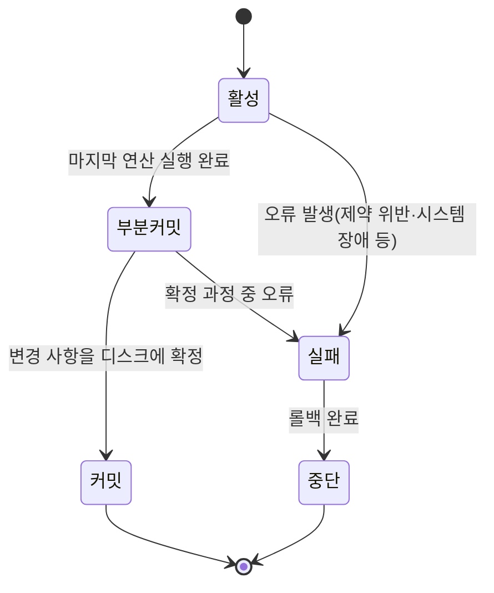
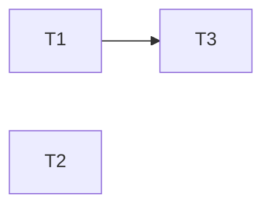
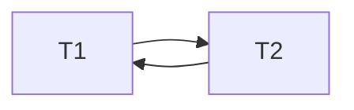
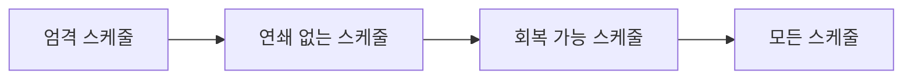

<Callout type="info">
  **이번 문서의 목표:** 이 문서를 다 읽으면 트랜잭션의 상태 전이를 그리고 ACID 네 가지 특성을 각각 예로 설명하며, 주어진 스케줄에 선행 그래프(precedence graph)를 그려 충돌 직렬 가능성을 직접 판정하고, 회복 가능·연쇄 없는·엄격 스케줄의 차이를 구분할 수 있다. 21편의 동시성 제어, 22편의 회복은 모두 이 문서의 개념을 전제로 한다.
</Callout>

## 왜 트랜잭션을 별도로 다루는가

06편에서 관계 데이터 모델을 배울 때는 "테이블에 어떤 데이터가 어떻게 저장되어 있는가"만 다뤘다. 그런데 실제로 은행 계좌 이체처럼 여러 단계의 연산이 한 덩어리로 실행되어야 하는 작업이 있다. "A 계좌에서 10만 원을 빼고, B 계좌에 10만 원을 더한다"는 두 연산은 둘 다 성공하거나 둘 다 실패해야지, 하나만 성공하면 돈이 허공에서 사라지거나 생겨난다. 이렇게 **하나의 논리적 작업 단위로 취급해야 하는 연산들의 묶음**을 트랜잭션(transaction)이라 부른다.

> **쉽게 말하면:** 트랜잭션은 "전부 되거나, 전혀 안 되거나" 둘 중 하나만 허용되는 작업 묶음이다.

동시에 여러 사용자가 같은 데이터베이스에 접속해 각자의 트랜잭션을 실행하는 것이 보통의 운영 환경이다. 이 문서는 트랜잭션 하나의 정의·상태·성질(ACID)을 먼저 다지고, 여러 트랜잭션이 뒤섞여 실행되는 스케줄(schedule)이 언제 "안전하다"고 판단할 수 있는지(직렬 가능성, serializability)를 판정하는 절차까지 다룬다. 21편의 동시성 제어(잠금·타임스탬프)는 "어떻게 하면 항상 이 안전한 스케줄만 만들어지도록 강제할까"를 다루고, 22편의 회복은 "장애가 나도 이 안전성을 어떻게 지킬까"를 다루므로, 이 문서의 용어를 정확히 잡아두지 않으면 두 편을 따라가기 어렵다.

## 1. 트랜잭션의 정의와 상태 전이

### 정의

**트랜잭션**(transaction)은 데이터베이스에 대한 하나 이상의 연산(읽기 `read`, 쓰기 `write`)으로 이루어진 논리적 작업 단위로, 실행 결과가 데이터베이스에 **전부 반영되거나 전혀 반영되지 않아야** 한다. Oracle을 비롯한 대부분의 관계형 DBMS(DataBase Management System, 데이터베이스 관리 시스템)에서는 다음과 같은 SQL 문으로 트랜잭션의 끝을 명시적으로 표시한다.

```sql
-- 계좌 이체 트랜잭션 예시 (Oracle SQL)
UPDATE ACCOUNT SET BALANCE = BALANCE - 100000 WHERE ACC_NO = 'A001';
UPDATE ACCOUNT SET BALANCE = BALANCE + 100000 WHERE ACC_NO = 'B001';
COMMIT;
```

- `COMMIT`: 트랜잭션의 모든 변경을 데이터베이스에 영구히 확정한다.
- `ROLLBACK`: 트랜잭션이 지금까지 수행한 변경을 전부 취소하고 트랜잭션 시작 이전 상태로 되돌린다.
- `SAVEPOINT`: 트랜잭션 중간에 표시점을 두어, 전체가 아니라 그 표시점 이후만 부분적으로 `ROLLBACK TO`할 수 있게 한다.

### 트랜잭션의 상태 전이

트랜잭션은 시작부터 끝까지 다음과 같은 상태(state)를 거친다.



- **활성**(active): 트랜잭션이 연산을 실행하는 중인 초기·기본 상태다.
- **부분 커밋**(partially committed): 트랜잭션의 마지막 연산까지는 실행했지만, 아직 그 결과가 디스크에 안전하게 확정(commit)되지는 않은 상태다. 이 짧은 구간에도 정전 같은 장애가 나면 커밋이 무산될 수 있다.
- **커밋**(committed): 트랜잭션의 모든 변경이 데이터베이스에 영구히 반영된 상태다. 이후에는 어떤 장애가 나도 이 결과가 사라지지 않아야 한다(22편의 지속성·회복이 이를 보장한다).
- **실패**(failed): 정상적인 실행을 계속할 수 없는 오류(0으로 나누기 같은 논리적 오류, 제약 조건 위반, 시스템 장애 등)가 발생한 상태다.
- **중단**(aborted): 실패한 트랜잭션이 지금까지의 변경을 전부 롤백(rollback, 되돌리기)해서 트랜잭션 시작 전 상태로 복귀를 마친 상태다. 중단된 트랜잭션은 필요하면 완전히 새로운 트랜잭션으로 다시 제출될 수 있다.

<Callout type="warning">
  **자주 틀리는 점:** "부분 커밋"과 "커밋"을 같은 상태로 착각하는 것이다. 부분 커밋은 아직 최종 확정 전의 **불안정한 중간 지점**이고, 이 구간에서도 장애가 나면 실패 상태로 넘어가 결국 롤백될 수 있다. "마지막 연산까지 실행했으니 이미 끝난 것"이라고 판단하면 안 된다.
</Callout>

## 2. ACID 특성 — 트랜잭션이 지켜야 할 네 가지 약속

트랜잭션이 안전하게 동작한다는 것은 구체적으로 다음 네 가지 성질을 모두 만족한다는 뜻이며, 각 영단어의 앞글자를 딴 것이 **ACID**다.

| 특성 | 영단어 | 의미 | 위 계좌 이체 예시에서의 의미 |
|---|---|---|---|
| 원자성 | Atomicity | 트랜잭션의 연산은 전부 반영되거나 전혀 반영되지 않는다 | A 계좌 차감과 B 계좌 증가가 둘 다 일어나거나, 둘 다 일어나지 않아야 한다 |
| 일관성 | Consistency | 트랜잭션 실행 전후로 데이터베이스는 항상 정합적인(무결성 제약을 만족하는) 상태를 유지한다 | 이체 전후로 두 계좌 잔액의 합계는 항상 같아야 한다 |
| 고립성 | Isolation | 동시에 실행되는 트랜잭션들은 서로의 중간 결과에 영향을 주지 않아야 한다 | 다른 트랜잭션이 이체가 절반만 끝난 A 계좌의 잔액을 훔쳐보면 안 된다 |
| 지속성 | Durability | 커밋이 완료된 트랜잭션의 결과는 이후 어떤 장애가 나도 사라지지 않는다 | 이체를 커밋한 직후 정전이 나도, 전원이 복구되면 이체 결과가 그대로 남아 있어야 한다 |

각 특성을 조금 더 풀어보면 다음과 같다.

- **원자성**(atomicity)은 위에서 다룬 트랜잭션 상태 전이 자체가 지키는 성질이다. 커밋에 도달하지 못하면 반드시 중단(전부 되돌림)으로 끝난다.
- **일관성**(consistency)은 트랜잭션 하나가 "데이터베이스가 지켜야 할 규칙(무결성 제약, 06편 참고)을 깨지 않는다"는 성질로, 트랜잭션을 작성하는 응용 프로그램의 책임과 DBMS의 제약 조건 검사가 함께 이 성질을 지킨다.
- **고립성**(isolation)은 이 문서의 뒷부분(스케줄과 직렬 가능성)과 21편(동시성 제어)이 가장 깊이 다루는 성질이다. 여러 트랜잭션이 물리적으로는 뒤섞여 실행되더라도, 그 결과는 마치 각 트랜잭션이 혼자 순서대로 실행된 것과 같아야 한다는 것이 고립성의 핵심 요구다.
- **지속성**(durability)은 22편의 로그·회복 메커니즘이 실제로 구현하는 성질이다.

<Callout type="warning">
  **자주 틀리는 점:** 일관성(consistency)을 "동시성 제어가 보장하는 성질"이라고 착각하는 것이다. 여러 트랜잭션이 서로 간섭하지 않게 만드는 것은 고립성이고, 일관성은 트랜잭션 **하나가** 실행되고 나서도 데이터베이스가 정의된 무결성 규칙을 계속 만족하는지에 대한 성질이다. 두 성질은 서로 다른 문제를 가리킨다.
</Callout>

## 3. 스케줄과 직렬 스케줄

### 왜 필요한가

여러 트랜잭션이 동시에 실행되면, DBMS는 각 트랜잭션의 연산들을 어떤 순서로 번갈아 처리할지 결정해야 한다. 이 실행 순서 전체를 기록한 것이 스케줄(schedule)이다. 문제는 "어떤 순서로 뒤섞어도 괜찮은가"인데, 이를 판단하는 기준이 바로 고립성이 요구하는 직렬 가능성(serializability)이다.

### 정의

- **스케줄**(schedule): 하나 이상의 트랜잭션에 속한 연산(read·write·commit·abort)들을 시간 순서대로 나열한 것. 여러 트랜잭션의 연산이 번갈아 등장할 수 있다.
- **직렬 스케줄**(serial schedule): 트랜잭션들이 **하나씩 차례로**, 즉 한 트랜잭션의 모든 연산이 끝난 뒤에야 다음 트랜잭션이 시작하는 스케줄. 트랜잭션 자체는 정상적으로 작성되었다고 가정하면, 직렬 스케줄은 서로 간섭이 전혀 없으므로 항상 안전하다.
- **비직렬(동시) 스케줄**(non-serial / concurrent schedule): 두 개 이상의 트랜잭션 연산이 서로 끼어들며 실행되는 스케줄. 성능(여러 트랜잭션을 병렬로 처리)을 위해 DBMS는 이런 스케줄을 실제로 만든다.

> **쉽게 말하면:** 직렬 스케줄은 "한 사람씩 순서대로 계산대를 쓰는 것", 비직렬 스케줄은 "여러 사람이 번갈아 가며 한 계산대를 나눠 쓰는 것"이다. 후자가 더 빠를 수 있지만, 잘못 뒤섞이면 계산이 꼬일 수 있다.

DBMS의 목표는 "직렬 스케줄만 허용"하는 것이 아니라(그러면 동시 처리의 이점을 포기하는 것이다), **비직렬 스케줄이라도 그 결과가 어떤 직렬 스케줄의 결과와 같기만 하면 허용**하는 것이다. 이 성질이 직렬 가능성이다.

## 4. 충돌 직렬 가능성 — 선행 그래프로 판정하기

### 정의: 충돌하는 연산

두 연산이 **충돌**(conflict)한다고 말하려면 다음 세 조건을 모두 만족해야 한다.

1. 서로 다른 트랜잭션에 속한 연산이다.
2. 같은 데이터 항목에 접근한다.
3. 둘 중 적어도 하나가 쓰기(write) 연산이다.

즉 읽기(read)끼리는 아무리 같은 데이터를 봐도 충돌이 아니다(둘 다 값을 바꾸지 않으므로 순서를 바꿔도 결과가 같다). `read-write`, `write-read`, `write-write` 세 조합만 충돌로 본다.

### 정의: 충돌 동등·충돌 직렬 가능

두 스케줄이 **충돌 동등**(conflict equivalent)하다는 것은, 한 스케줄에서 다른 스케줄로 바꿀 때 **충돌하지 않는 연산끼리만 순서를 맞바꿔서** 도달할 수 있다는 뜻이다(충돌하는 연산의 상대적 순서는 절대 바뀌지 않는다). 어떤 스케줄이 **충돌 직렬 가능**(conflict serializable)하다는 것은, 그 스케줄이 어떤 직렬 스케줄과 충돌 동등하다는 뜻이다.

### 판정 절차: 선행 그래프(precedence graph)

매번 연산을 하나씩 맞바꿔 보며 직렬 스케줄을 찾는 것은 비효율적이므로, 다음과 같은 그래프 판정법을 쓴다.

<Steps>

1. **노드 만들기**: 스케줄에 등장하는 트랜잭션마다 노드 하나씩 만든다.
2. **간선 만들기**: 트랜잭션 $T_i$의 연산이 트랜잭션 $T_j$의 연산과 충돌하고, $T_i$의 연산이 시간상 **먼저** 실행되었다면 $T_i \rightarrow T_j$ 간선을 긋는다.
3. **사이클 검사**: 완성된 그래프(선행 그래프, precedence graph)에 사이클(cycle)이 있는지 확인한다.
4. **판정**: 사이클이 없으면(비순환, acyclic) 그 스케줄은 충돌 직렬 가능하며, 그래프를 위상 정렬(topological sort)한 순서가 곧 그 스케줄과 동등한 직렬 스케줄의 순서다. 사이클이 있으면 충돌 직렬 가능하지 않다.

</Steps>

### 계산 예제 1 — 충돌 직렬 가능한 경우

다음 스케줄 $S_1$을 판정해 본다.

| 시각 | T1 | T2 | T3 |
|---|---|---|---|
| t1 | R(A) | | |
| t2 | | R(B) | |
| t3 | W(A) | | |
| t4 | | | R(A) |
| t5 | | W(B) | |
| t6 | | | W(A) |

**1단계 — 노드**: T1, T2, T3 세 개의 노드를 만든다.

**2단계 — 충돌 쌍 찾기**: 데이터 항목별로 접근한 연산을 모은다.

- `A`에 접근한 연산: t1(T1, R), t3(T1, W), t4(T3, R), t6(T3, W).
- `B`에 접근한 연산: t2(T2, R), t5(T2, W).

`B`는 T2의 연산끼리만 접근하므로(같은 트랜잭션은 충돌 판정 대상이 아니다) 간선이 생기지 않는다. `A`에서 서로 다른 트랜잭션 쌍을 시간순으로 짚어 본다.

- t1(T1, R(A))과 t4(T3, R(A)): 둘 다 읽기이므로 충돌이 아니다.
- t1(T1, R(A))과 t6(T3, W(A)): read-write 충돌, T1이 먼저이므로 $T1 \rightarrow T3$.
- t3(T1, W(A))과 t4(T3, R(A)): write-read 충돌, T1이 먼저이므로 $T1 \rightarrow T3$.
- t3(T1, W(A))과 t6(T3, W(A)): write-write 충돌, T1이 먼저이므로 $T1 \rightarrow T3$.

**3단계 — 그래프 구성**: 세 쌍 모두 같은 방향($T1 \rightarrow T3$)이므로 간선은 하나(중복 제거)다. T2는 A에 접근하지 않고 B는 T2 혼자만 접근하므로 T2와 관련된 간선은 전혀 없다.



**4단계 — 판정**: 간선이 $T1 \rightarrow T3$ 하나뿐이고 사이클이 없다. 따라서 $S_1$은 **충돌 직렬 가능**하다. 위상 정렬 결과 T1이 T3보다 앞서기만 하면 되므로, `T1, T2, T3`나 `T1, T3, T2`, `T2, T1, T3` 모두 $S_1$과 동등한 직렬 스케줄이 될 수 있다.

### 계산 예제 2 — 충돌 직렬 가능하지 않은 경우

다음은 흔히 "갱신 손실(lost update)"로 알려진 스케줄 $S_2$다.

| 시각 | T1 | T2 |
|---|---|---|
| t1 | R(A) | |
| t2 | | R(A) |
| t3 | W(A) | |
| t4 | | W(A) |

**1단계·2단계 — 충돌 쌍 찾기**: `A`에 접근한 연산은 t1(T1,R), t2(T2,R), t3(T1,W), t4(T2,W) 네 개다.

- t1(T1, R(A))과 t4(T2, W(A)): read-write 충돌, T1이 먼저이므로 $T1 \rightarrow T2$.
- t2(T2, R(A))과 t3(T1, W(A)): read-write 충돌, T2가 먼저이므로 $T2 \rightarrow T1$.
- t3(T1, W(A))과 t4(T2, W(A)): write-write 충돌, T1이 먼저이므로 $T1 \rightarrow T2$.

**3단계 — 그래프 구성**: $T1 \rightarrow T2$와 $T2 \rightarrow T1$ 간선이 모두 존재한다.



**4단계 — 판정**: $T1 \rightarrow T2 \rightarrow T1$이 사이클을 이루므로 $S_2$는 **충돌 직렬 가능하지 않다.** 실제로 이 스케줄은 T2가 A의 예전 값을 읽은 뒤 T1의 갱신 결과를 덮어써 버리는 "갱신 손실" 이상 현상을 보여주며, 어떤 직렬 스케줄(T1 다음 T2, 또는 T2 다음 T1)의 결과와도 같아지지 않는다.

<Callout type="warning">
  **자주 틀리는 점:** 간선을 그릴 때 "충돌 쌍마다 매번 새 간선을 추가로 그려야 한다"고 착각하는 것이다. 같은 두 트랜잭션 사이에 방향이 같은 간선이 여러 번 나오면 하나로 합치면 되고, 판정에 중요한 것은 오직 "사이클이 생기는가"뿐이다. 또한 같은 트랜잭션 내부의 연산끼리는 애초에 충돌 판정 대상이 아니라는 점도 놓치기 쉽다.
</Callout>

### 참고: 뷰 직렬 가능성

충돌 직렬 가능성보다 더 느슨한 기준으로 **뷰 직렬 가능성**(view serializability)이 있다. 두 스케줄이 (1) 각 데이터 항목을 처음 읽는 트랜잭션이 같고, (2) 한 트랜잭션이 쓴 값을 다른 트랜잭션이 읽는 관계가 같고, (3) 각 데이터 항목을 마지막으로 쓰는 트랜잭션이 같으면 **뷰 동등**(view equivalent)하다고 하며, 어떤 직렬 스케줄과 뷰 동등하면 그 스케줄은 뷰 직렬 가능하다. 모든 충돌 직렬 가능한 스케줄은 뷰 직렬 가능하지만 역은 성립하지 않으며(맹목적 쓰기blind write가 있는 경우), 뷰 직렬 가능성 판정은 계산 복잡도가 높아 실제 DBMS는 충돌 직렬 가능성만 실용적으로 사용한다. 독학사 시험에서도 계산 문제는 충돌 직렬 가능성 위주로 나오므로, 뷰 직렬 가능성은 "더 넓은 개념이 있다" 정도로만 기억해 둔다.

## 5. 스케줄의 회복 관련 성질: 회복 가능·연쇄 없음·엄격

### 왜 필요한가

직렬 가능성은 "고립성"을 판정하는 기준이었다. 그런데 22편에서 다룰 회복(장애 후 복구)의 관점에서는 또 다른 문제가 생긴다. 트랜잭션 $T_j$가 아직 커밋되지 않은 $T_i$가 쓴 값을 읽었는데, 그 뒤 $T_i$가 실패해서 롤백된다면 어떻게 될까. $T_j$는 이미 존재하지도 않는(무효가 된) 값을 근거로 계속 실행되고 있었던 것이다. 이런 상황을 통제하기 위해 스케줄에 다음과 같은 등급을 매긴다.

### 정의

- **회복 가능 스케줄**(recoverable schedule): 트랜잭션 $T_j$가 $T_i$가 쓴 데이터 항목을 읽었다면, $T_i$의 커밋이 $T_j$의 커밋보다 반드시 먼저 일어나는 스케줄. 이 조건이 지켜지지 않으면, $T_i$가 롤백될 때 이미 커밋되어 버린 $T_j$까지 되돌릴 방법이 없어 회복 자체가 불가능해진다.
- **연쇄 없는 스케줄**(cascadeless schedule): 트랜잭션은 다른 트랜잭션이 **커밋한 뒤에만** 그 트랜잭션이 쓴 값을 읽을 수 있는 스케줄. $T_i$가 아직 커밋하지 않은 값을 $T_j$가 읽는 일 자체를 금지하므로, $T_i$가 롤백되어도 $T_j$까지 연쇄적으로 롤백할 필요가 없다(21편에서 다룰 연쇄 롤백cascading rollback을 원천 차단한다).
- **엄격 스케줄**(strict schedule): 트랜잭션은 다른 트랜잭션이 어떤 데이터 항목에 쓴 값을 **그 트랜잭션이 커밋하거나 중단하기 전까지는 읽지도 쓰지도** 못하는 스케줄. 회복 가능 스케줄 중 가장 제약이 강한 등급이며, 롤백 시 이전 값으로 단순히 덮어쓰기만 하면 되어 회복 절차가 가장 간단해진다.

세 등급은 다음과 같은 포함 관계를 가진다.



| 등급 | 조건 | 연쇄 롤백 위험 | 회복 절차 |
|---|---|---|---|
| 회복 가능 | 읽은 대상의 커밋이 자신의 커밋보다 먼저 | 있음(연쇄 롤백 가능) | 가능하지만 복잡할 수 있음 |
| 연쇄 없음 | 커밋된 값만 읽을 수 있음 | 없음 | 상대적으로 단순 |
| 엄격 | 커밋·중단 전에는 읽기·쓰기 모두 금지 | 없음 | 가장 단순(이전 값으로 되돌리기만 하면 됨) |

<Callout type="warning">
  **자주 틀리는 점:** "직렬 가능한 스케줄이면 회복 가능성도 저절로 보장된다"고 생각하는 것이다. 직렬 가능성(고립성 판정)과 회복 가능성(장애 대응 판정)은 서로 **독립적인 기준**이다. 어떤 스케줄은 충돌 직렬 가능하면서도 회복 불가능할 수 있고, 그 반대도 가능하다. DBMS가 실제로 허용하려는 스케줄은 이 두 기준을 모두 만족해야 한다. 21편에서 배울 strict 2PL 프로토콜이 인기 있는 이유도, 이 프로토콜이 만드는 스케줄이 항상 엄격 스케줄이면서 동시에 충돌 직렬 가능하기 때문이다.
</Callout>

## 핵심 정리

- 트랜잭션은 활성 → 부분 커밋 → 커밋(정상 종료), 또는 활성/부분 커밋 → 실패 → 중단(비정상 종료)의 상태를 거친다.
- ACID는 원자성(전부 또는 전무)·일관성(무결성 유지)·고립성(다른 트랜잭션과 간섭 없음)·지속성(커밋 결과는 영구 보존)이며, 일관성과 고립성은 서로 다른 문제를 가리킨다.
- 스케줄이 직렬 가능하다는 것은 어떤 직렬 스케줄과 결과가 같다는 뜻이며, 충돌 직렬 가능성은 선행 그래프에 사이클이 없는지로 판정한다(사이클 있으면 직렬 가능하지 않음).
- 회복 가능·연쇄 없음·엄격 스케줄은 직렬 가능성과 별개로, "커밋되지 않은 값을 읽었다가 그 트랜잭션이 롤백되면 어떻게 되는가"를 기준으로 등급을 매긴 성질이며, 엄격 ⊆ 연쇄 없음 ⊆ 회복 가능 순으로 포함된다.

## 마무리 복습

<Quiz
  questionNumber={1}
  question="트랜잭션의 상태 전이에 대한 설명으로 옳지 않은 것은?"
  options={['활성 상태는 트랜잭션이 연산을 실행하고 있는 기본 상태다', '부분 커밋 상태는 마지막 연산까지 실행했지만 아직 최종 확정 전인 상태다', '중단 상태는 롤백을 완료해 트랜잭션 시작 전 상태로 되돌린 상태다', '부분 커밋 상태에 도달하면 어떤 경우에도 반드시 커밋 상태로 이어진다']}
  correctAnswer={4}
  explanation="부분 커밋 상태에서도 확정 과정 중 오류가 발생하면 실패 상태를 거쳐 중단될 수 있다. 부분 커밋이 항상 커밋으로 이어진다는 설명은 옳지 않다."
  optionExplanations={['활성 상태의 정의로 옳은 설명이다', '부분 커밋 상태의 정의로 옳은 설명이다', '중단 상태의 정의로 옳은 설명이다', '옳지 않은 것을 찾는 문제의 정답. 부분 커밋 상태에서도 실패로 전이될 수 있다']}
/>

<Quiz
  questionNumber={2}
  question="ACID 특성에 대한 설명으로 옳지 않은 것은?"
  options={['원자성은 트랜잭션의 연산이 전부 반영되거나 전혀 반영되지 않아야 한다는 성질이다', '지속성은 커밋된 트랜잭션의 결과가 이후 장애에도 사라지지 않아야 한다는 성질이다', '고립성은 동시에 실행되는 트랜잭션들이 서로의 중간 결과에 영향을 주지 않아야 한다는 성질이다', '일관성은 여러 트랜잭션이 동시에 실행될 때 서로 간섭하지 않도록 순서를 통제하는 동시성 제어 기법 자체를 가리킨다']}
  correctAnswer={4}
  explanation="일관성은 트랜잭션 실행 전후로 데이터베이스가 무결성 제약을 계속 만족해야 한다는 성질이며, 트랜잭션 간 간섭을 막는 것은 고립성이다. 동시성 제어 기법 자체를 가리킨다는 설명은 옳지 않다."
  optionExplanations={['원자성의 정의로 옳은 설명이다', '지속성의 정의로 옳은 설명이다', '고립성의 정의로 옳은 설명이다', '옳지 않은 것을 찾는 문제의 정답. 일관성과 고립성의 역할이 뒤바뀌어 설명되어 있다']}
/>

<Quiz
  questionNumber={3}
  question="스케줄(schedule)과 직렬 스케줄(serial schedule)에 대한 설명으로 옳은 것은?"
  options={['직렬 스케줄은 여러 트랜잭션의 연산이 자유롭게 뒤섞여 실행되는 스케줄이다', '비직렬 스케줄은 항상 직렬 가능하지 않은 스케줄을 의미한다', '직렬 스케줄은 한 트랜잭션의 모든 연산이 끝난 뒤에야 다음 트랜잭션이 시작하는 스케줄이다', '스케줄은 반드시 하나의 트랜잭션에 속한 연산으로만 구성된다']}
  correctAnswer={3}
  explanation="직렬 스케줄은 트랜잭션들이 서로 끼어들지 않고 하나씩 차례로 실행되는 스케줄이다. 여러 트랜잭션의 연산이 섞이는 것은 비직렬(동시) 스케줄이다."
  optionExplanations={['이 설명은 비직렬 스케줄에 대한 것이며 직렬 스케줄과 반대다', '비직렬 스케줄이라도 어떤 직렬 스케줄과 결과가 같으면(직렬 가능하면) 안전하게 허용된다', '정답. 직렬 스케줄의 정확한 정의다', '스케줄은 여러 트랜잭션의 연산이 함께 나열된 것을 다루기 위한 개념이다']}
/>

<Quiz
  questionNumber={4}
  question="두 연산이 충돌(conflict)한다고 판정하기 위한 조건으로 옳지 않은 것은?"
  options={['서로 다른 트랜잭션에 속한 연산이어야 한다', '같은 데이터 항목에 접근하는 연산이어야 한다', '둘 중 적어도 하나는 쓰기(write) 연산이어야 한다', '두 연산 모두 읽기(read) 연산이면 충돌로 판정한다']}
  correctAnswer={4}
  explanation="읽기끼리는 아무리 같은 데이터를 대상으로 해도 값을 바꾸지 않으므로 순서를 바꿔도 결과가 같아 충돌로 보지 않는다. 충돌은 read-write, write-read, write-write 조합에서만 성립한다."
  optionExplanations={['충돌 판정의 첫 번째 조건으로 옳다', '충돌 판정의 두 번째 조건으로 옳다', '충돌 판정의 세 번째 조건으로 옳다', '옳지 않은 것을 찾는 문제의 정답. 읽기끼리는 충돌이 아니다']}
/>

<Quiz
  questionNumber={5}
  question="선행 그래프(precedence graph)를 이용한 충돌 직렬 가능성 판정에 대한 설명으로 옳은 것은?"
  options={['그래프에 사이클이 있으면 그 스케줄은 충돌 직렬 가능하다', '그래프에 사이클이 없으면(비순환) 그 스케줄은 충돌 직렬 가능하다', '선행 그래프의 노드는 데이터 항목을 나타낸다', '두 트랜잭션 사이에 충돌 쌍이 여러 번 나오면 그 개수만큼 간선을 각각 따로 그려야 판정에 영향을 준다']}
  correctAnswer={2}
  explanation="선행 그래프에 사이클이 없으면 위상 정렬로 동등한 직렬 스케줄을 구성할 수 있으므로 충돌 직렬 가능하고, 사이클이 있으면 충돌 직렬 가능하지 않다."
  optionExplanations={['사이클이 있으면 오히려 충돌 직렬 가능하지 않다고 판정한다', '정답. 비순환 그래프가 충돌 직렬 가능성의 판정 기준이다', '선행 그래프의 노드는 데이터 항목이 아니라 트랜잭션이다', '같은 방향의 간선은 하나로 합치면 되며, 판정에 중요한 것은 사이클 존재 여부뿐이다']}
/>

<Quiz
  questionNumber={6}
  question="스케줄 S에서 T1: R(A), T2: R(A), T1: W(A), T2: W(A) 순서로 연산이 실행되었다. 이 스케줄에 대한 판정으로 옳은 것은?"
  options={['선행 그래프에 T1→T2 간선만 존재하여 충돌 직렬 가능하다', '선행 그래프에 T1→T2와 T2→T1 간선이 모두 존재하여 충돌 직렬 가능하지 않다', '두 트랜잭션이 서로 다른 데이터 항목에 접근하므로 애초에 충돌이 발생하지 않는다', 'T2가 T1보다 나중에 커밋했으므로 무조건 직렬 가능하다']}
  correctAnswer={2}
  explanation="T1의 R(A)와 T2의 W(A) 사이(T1이 먼저)에서 T1→T2, T2의 R(A)와 T1의 W(A) 사이(T2가 먼저)에서 T2→T1이 생겨 사이클이 만들어지므로 충돌 직렬 가능하지 않다. 이는 갱신 손실이 발생하는 대표적인 스케줄이다."
  optionExplanations={['T2→T1 간선이 빠져 있다. 실제로는 두 방향의 간선이 모두 생겨 사이클을 이룬다', '정답. 두 방향의 간선이 사이클을 이루어 충돌 직렬 가능하지 않다', '두 트랜잭션 모두 데이터 항목 A에 접근하므로 충돌이 발생한다', '커밋 순서만으로는 직렬 가능성을 판정할 수 없으며, 연산의 충돌 관계를 분석해야 한다']}
/>

<Quiz
  questionNumber={7}
  question="회복 가능 스케줄, 연쇄 없는 스케줄, 엄격 스케줄의 관계에 대한 설명으로 옳은 것은?"
  options={['연쇄 없는 스케줄은 모두 회복 가능 스케줄이지만, 그 역은 항상 성립하지는 않는다', '엄격 스케줄은 연쇄 없는 스케줄의 조건을 만족하지 못하는 경우가 대부분이다', '회복 가능 스케줄이면 충돌 직렬 가능성도 자동으로 보장된다', '연쇄 없는 스케줄은 다른 트랜잭션이 커밋하기 전에 쓴 값도 자유롭게 읽을 수 있다']}
  correctAnswer={1}
  explanation="엄격 스케줄은 연쇄 없는 스케줄의 부분집합이고, 연쇄 없는 스케줄은 회복 가능 스케줄의 부분집합이다. 따라서 연쇄 없는 스케줄은 항상 회복 가능하지만, 회복 가능하다고 해서 반드시 연쇄 없는 스케줄인 것은 아니다."
  optionExplanations={['정답. 엄격 ⊆ 연쇄 없음 ⊆ 회복 가능 순의 포함 관계다', '엄격 스케줄은 연쇄 없는 스케줄의 조건을 항상 만족하는 가장 제약이 강한 등급이다', '직렬 가능성과 회복 가능성은 서로 독립적인 기준이며, 한쪽을 만족한다고 다른 쪽이 자동으로 보장되지 않는다', '연쇄 없는 스케줄은 커밋된 값만 읽을 수 있도록 제한하는 스케줄이다']}
/>

## 참고 자료

- [Oracle Database Concepts - Transaction Management](https://docs.oracle.com/en/database/oracle/oracle-database/index.html)
- [GeeksforGeeks - Transaction Isolation Levels in DBMS](https://www.geeksforgeeks.org/dbms/)
- 국가평생교육진흥원 독학학위제: [https://bdes.nile.or.kr](https://bdes.nile.or.kr)
