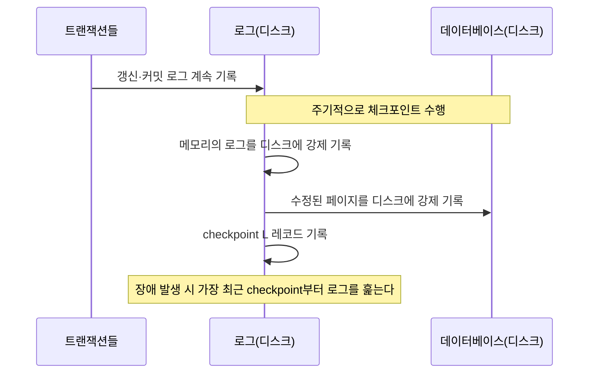

<Callout type="info">
  **이번 문서의 목표:** 이 문서를 다 읽으면 장애 유형을 구분하고, 로그 레코드와 체크포인트가 주어졌을 때 REDO·UNDO 대상 트랜잭션을 스스로 판정해 회복 절차 전 과정을 설명할 수 있다.
</Callout>

## 왜 회복이 필요한가

20편·21편에서 살펴본 트랜잭션(transaction)과 동시성 제어(concurrency control)는 "여러 트랜잭션이 동시에 실행돼도 결과가 안전하다"를 다뤘다. 그런데 트랜잭션이 실행되는 도중에 정전이 나거나 디스크가 손상되면 어떻게 될까. 이미 커밋(commit, 트랜잭션의 변경을 영구히 확정하는 연산)된 트랜잭션의 결과는 반드시 남아 있어야 하고, 커밋되지 않은 트랜잭션의 흔적은 반드시 지워져야 한다. 이 두 가지를 장애 이후에도 보장하는 것이 회복(recovery)이다.

> **쉽게 말하면:** 회복은 "정전이 나도 저장하기로 약속한 내용은 남고, 저장 안 하기로 한 내용은 사라지게 만드는" 사후 복구 절차다.

이 약속은 트랜잭션의 ACID 성질(20편 참고) 중 지속성(durability, 커밋된 결과는 어떤 장애에도 사라지지 않음)과 원자성(atomicity, 트랜잭션은 전부 반영되거나 전혀 반영되지 않음)을 실제로 구현하는 부분이다. 개념만으로는 이 약속을 지킬 수 없고, 로그(log)라는 기록 장치와 이를 다루는 절차가 있어야 한다.

## 장애의 종류

회복 절차를 설계하려면 먼저 "무엇이 고장 나는가"를 구분해야 한다. 장애(failure)의 원인에 따라 대응 방법이 완전히 다르기 때문이다.

| 장애 유형 | 원인 예시 | 손상 범위 | 대응 방법 |
|---|---|---|---|
| 트랜잭션 장애 | 논리적 오류(0으로 나누기), 시스템이 교착상태 희생자로 선정 | 해당 트랜잭션 하나 | 그 트랜잭션만 롤백(undo) |
| 시스템 장애 | 정전, 운영체제 충돌, 하드웨어 오류 | 주기억장치(휘발성) 내용 손실. 디스크(비휘발성) 내용은 보존 | 로그를 이용한 REDO·UNDO |
| 미디어 장애 | 디스크 헤드 손상, 저장 장치 물리적 파손 | 디스크에 저장된 데이터 자체 손실 | 별도 백업본 + 로그로 재구성 |

**자주 틀리는 점**: 시스템 장애는 "메모리 내용은 사라지지만 디스크 내용은 안전하다"는 전제가 핵심이다. 이 전제 덕분에 로그를 디스크에 안전하게 기록해 두기만 하면, 메모리가 통째로 날아가도 로그로 상태를 재구성할 수 있다. 미디어 장애는 이 전제(디스크는 안전하다)가 깨지는 경우이므로, 로그만으로는 부족하고 별도의 백업(backup)이 반드시 필요하다.

## 로그 레코드의 구조

### 왜 필요한가

회복을 하려면 "어떤 트랜잭션이 어떤 데이터를 어떻게 바꿨는지"를 장애 이전에 미리 어딘가 안전하게 적어 둬야 한다. 이 기록이 로그(log)다. 로그가 없으면 장애 발생 시점의 메모리 상태는 이미 사라졌으므로 무엇을 되돌리고 무엇을 다시 반영해야 하는지 전혀 알 수 없다.

### 정의: 로그 레코드의 형식

각 로그 레코드는 트랜잭션이 수행한 변경 하나를 나타낸다. 갱신 로그 레코드는 다음 정보를 담는다.

```
<Ti, Xj, V1, V2>
```

- $T_i$: 갱신을 수행한 트랜잭션의 식별자.
- $X_j$: 갱신된 데이터 항목.
- $V_1$: 갱신 전 값(이전 값, old value) — 되돌릴 때(undo) 사용.
- $V_2$: 갱신 후 값(이후 값, new value) — 다시 반영할 때(redo) 사용.

이 외에 트랜잭션의 시작과 끝을 나타내는 제어 레코드가 있다.

- `<Ti start>`: 트랜잭션 $T_i$가 시작함.
- `<Ti commit>`: 트랜잭션 $T_i$가 커밋을 완료함.
- `<Ti abort>`: 트랜잭션 $T_i$가 중단(되돌리기)됨.

## 즉시 갱신과 지연 갱신

### 왜 필요한가

트랜잭션이 데이터를 바꿀 때, 그 변경을 **로그에만 적어 둘지, 실제 데이터베이스에도 바로 반영할지**에 따라 회복 절차가 달라진다. 이 선택 기준이 즉시 갱신(immediate update)과 지연 갱신(deferred update)이다.

- **즉시 갱신**: 트랜잭션이 커밋되기 전이라도, 로그에 기록한 뒤 곧바로 실제 데이터베이스에 값을 반영할 수 있다. 아직 커밋되지 않은 변경이 디스크에 남을 수 있으므로, 장애가 나면 커밋되지 않은 트랜잭션의 변경을 **되돌리는(undo) 절차**가 반드시 필요하다.
- **지연 갱신**: 트랜잭션이 커밋되기 전에는 변경 내용을 로그에만 적어 두고, 실제 데이터베이스에는 반영하지 않는다. 커밋이 확정된 뒤에야 로그를 바탕으로 데이터베이스에 반영한다. 커밋되지 않은 변경은 애초에 디스크에 쓰인 적이 없으므로 **되돌릴 필요가 없다**(no-undo scheme). 대신 커밋된 변경이 디스크 반영 전에 장애로 사라졌을 수 있으므로 **다시 반영하는(redo) 절차**만 필요하다.

| 구분 | 커밋 전 DB 반영 | undo 필요 여부 | redo 필요 여부 |
|---|---|---|---|
| 즉시 갱신 | 가능 | 필요 | 필요 |
| 지연 갱신 | 불가능 | 불필요(no-undo) | 필요 |

**자주 틀리는 점**: "지연 갱신은 로그도 늦게 쓴다"고 오해하기 쉬운데, 지연 갱신도 갱신이 일어나는 즉시 **로그에는 기록**한다. 다만 그 기록을 실제 데이터베이스 파일에 반영하는 시점만 커밋 이후로 미루는 것이다. 독학사 시험 수준에서는 즉시 갱신 방식을 기본으로 다루므로, 이 문서의 계산 예제도 즉시 갱신을 기준으로 한다.

## 쓰기 전 로그(WAL) 원칙

### 왜 필요한가

즉시 갱신 방식에서는 커밋 전에 데이터베이스가 변경될 수 있다고 했다. 그런데 만약 "데이터베이스에는 이미 새 값이 반영됐는데, 그 사실을 적은 로그 레코드는 아직 디스크에 안 쓰인" 상태에서 장애가 나면 어떻게 될까. 그 변경을 되돌릴 근거(이전 값)가 로그에 없으므로 되돌릴 수 없는 상황이 생긴다.

### 정의

**쓰기 전 로그**(Write-Ahead Logging, WAL) 원칙은 이 문제를 막기 위한 강제 규칙이다.

> **쉽게 말하면:** "데이터를 실제로 바꾸기 전에, 그 변경을 되돌릴 수 있는 로그 레코드부터 먼저 디스크에 써 둬라"는 규칙이다.

구체적으로 두 가지를 요구한다.

1. 데이터 항목 $X$에 대한 갱신 로그 레코드는, $X$의 새 값이 실제 데이터베이스(디스크)에 반영되기 **전에** 먼저 디스크에 기록되어야 한다.
2. 트랜잭션의 커밋 로그 레코드는, 해당 트랜잭션이 변경한 모든 데이터가 최종적으로 디스크에 반영된 뒤에(또는 최소한 로그 자체가 먼저) 기록되어야 한다.

이 규칙 덕분에 "데이터는 바뀌었는데 로그가 없어서 되돌릴 수 없는" 상황이 원천적으로 발생하지 않는다. 로그가 항상 실제 데이터 변경보다 먼저(ahead) 안전하게 기록되어 있기 때문이다.

## 체크포인트

### 왜 필요한가

로그는 시스템이 켜져 있는 내내 계속 쌓인다. 장애가 나면 이 로그 전체를 처음부터 끝까지 다시 훑어야 하는데, 로그가 몇 달치 쌓여 있다면 회복에 엄청난 시간이 걸린다. 이 부담을 줄이기 위해 주기적으로 "이 시점 이전 것들은 이미 안전하니 다시 볼 필요 없다"는 기준점을 찍어 두는 것이 체크포인트(checkpoint)다.

### 정의

체크포인트를 수행하는 절차는 다음과 같다.

1. 현재 메모리에 있는 모든 로그 레코드를 디스크에 강제로 기록한다.
2. 메모리에서 수정된(아직 디스크에 반영되지 않은) 데이터 페이지를 디스크에 기록한다.
3. `<checkpoint L>` 형태의 체크포인트 레코드를 로그에 기록한다. 여기서 $L$은 **체크포인트 시점에 아직 진행 중인(커밋도 중단도 안 된) 트랜잭션들의 목록**이다.

체크포인트가 찍힌 뒤에는, 체크포인트 이전에 **이미 커밋된 트랜잭션**의 변경은 모두 안전하게 디스크에 반영되어 있음이 보장된다. 그래서 회복 시 로그 전체가 아니라 **가장 최근 체크포인트부터** 훑으면 된다.



## 회복 알고리즘: REDO 목록과 UNDO 목록 만들기

### 절차

즉시 갱신 방식에서 시스템 장애가 발생했을 때, 로그를 이용해 REDO(다시 반영)할 트랜잭션과 UNDO(되돌릴)할 트랜잭션을 가려내는 절차는 다음과 같다.

1. 로그에서 가장 최근의 `<checkpoint L>` 레코드를 찾는다.
2. `undo-list`를 체크포인트 시점의 활성 트랜잭션 목록 $L$로 초기화하고, `redo-list`는 빈 목록으로 시작한다.
3. 체크포인트 이후부터 로그 끝(장애 시점)까지 **앞으로** 훑으면서, `<Ti start>`를 만나면 $T_i$를 `undo-list`에 추가하고, `<Ti commit>`이나 `<Ti abort>`를 만나면 $T_i$를 `undo-list`에서 지우고 `<Ti commit>`인 경우에만 `redo-list`에 추가한다.
4. 최종적으로 `redo-list`에 남은 트랜잭션은 커밋까지 완료됐지만 그 결과가 디스크에 남아 있다는 보장이 없으므로 로그의 새 값으로 REDO한다. `undo-list`에 남은 트랜잭션은 커밋되지 못했으므로 로그의 이전 값으로 UNDO한다.

### 계산 예제

다음 로그가 순서대로 기록되어 있다가, 마지막 줄에서 시스템 장애가 발생했다고 하자.

```
1. <T1 start>
2. <T1, A, 1000, 950>
3. <T2 start>
4. <T2, B, 2000, 2050>
5. <T1, C, 700, 600>
6. <T1 commit>
7. <checkpoint {T2}>
8. <T3 start>
9. <T3, D, 500, 400>
10. <T2, E, 300, 350>
11. <T2 commit>
12. <T3, F, 800, 750>
   -- 시스템 장애 발생 --
```

**1단계 — 체크포인트와 초기 목록 확인**: 7번 줄이 가장 최근(유일한) 체크포인트이고, 그 시점의 활성 트랜잭션 목록은 $L = \{T2\}$다. 따라서 `undo-list = {T2}`, `redo-list = { }`로 시작한다.

**2단계 — 체크포인트 이후 로그를 앞으로 훑기**:

- 8번 줄 `<T3 start>` → `undo-list`에 T3 추가: `undo-list = {T2, T3}`.
- 11번 줄 `<T2 commit>` → T2를 `undo-list`에서 제거하고 `redo-list`에 추가: `undo-list = {T3}`, `redo-list = {T2}`.
- 12번 줄은 갱신 레코드이며 그 뒤 커밋·중단 레코드 없이 장애가 났으므로 T3의 상태는 변하지 않는다.

**3단계 — 최종 목록 확정**: 로그 끝까지 훑은 결과 `redo-list = {T2}`, `undo-list = {T3}`다. T1은 체크포인트 **이전에 이미 커밋**되었으므로(6번 줄) 체크포인트 절차에 의해 이미 디스크에 안전하게 반영되어 있다고 보고, REDO·UNDO 어느 목록에도 넣지 않는다.

**4단계 — 실제 회복 동작 수행**:

- **REDO(T2)**: 체크포인트 이후 T2가 수행한 갱신인 10번 줄 `<T2, E, 300, 350>`을 새 값(350)으로 다시 반영한다. (체크포인트 이전 갱신인 4번 줄 B는 체크포인트 때 이미 디스크에 반영되었으므로 다시 손댈 필요가 없다.)
- **UNDO(T3)**: T3가 수행한 갱신들을 로그의 **역순**으로 되돌린다. 먼저 12번 줄 `<T3, F, 800, 750>`을 이전 값(800)으로 되돌리고, 그다음 9번 줄 `<T3, D, 500, 400>`을 이전 값(500)으로 되돌린다.

**결과 해석**: 커밋을 완료한 T1·T2의 결과는 (필요하면 REDO를 거쳐) 반드시 남고, 커밋되지 못한 T3의 흔적은 완전히 지워진다. 이것이 원자성과 지속성을 장애 이후에도 지키는 실제 절차다.

**자주 틀리는 점**: UNDO는 반드시 로그의 **역순**(최근 것부터)으로 적용해야 한다. 순서를 뒤집으면(오래된 것부터 되돌리면) 같은 데이터 항목에 대한 여러 번의 갱신이 뒤섞여 엉뚱한 값이 남을 수 있다. 또한 "체크포인트 이전 커밋 트랜잭션(T1)도 REDO 목록에 넣어야 하지 않을까"라고 생각하기 쉬운데, 체크포인트 자체가 "그 시점까지 커밋된 변경은 모두 디스크에 반영을 마쳤다"를 보장하는 장치이므로 T1은 어떤 목록에도 들어가지 않는다.

## 핵심 정리

- 장애는 트랜잭션 장애·시스템 장애·미디어 장애로 나뉘며, 각각 대응 방법(개별 롤백, 로그 기반 회복, 백업 기반 재구성)이 다르다.
- 갱신 로그 레코드는 `<Ti, Xj, 이전 값, 이후 값>` 형식이며, 이전 값은 undo에, 이후 값은 redo에 쓰인다.
- 즉시 갱신은 undo·redo가 모두 필요하고, 지연 갱신은 redo만 필요하다(no-undo).
- WAL 원칙은 데이터 반영보다 로그 기록을 항상 먼저 하도록 강제해, 되돌릴 근거가 사라지는 상황을 막는다.
- 체크포인트는 로그 전체를 훑지 않고 최근 체크포인트부터만 훑도록 회복 범위를 줄여 준다. 체크포인트 이후 로그를 훑어 커밋된 트랜잭션은 REDO 목록에, 끝내 커밋되지 못한 트랜잭션은 UNDO 목록에 넣는다.

## 마무리 복습

<Quiz
  questionNumber={1}
  question="장애 유형과 대응 방법을 짝지은 것으로 옳지 않은 것은?"
  options={['트랜잭션 장애 - 해당 트랜잭션만 롤백', '시스템 장애 - 로그를 이용한 REDO와 UNDO', '미디어 장애 - 로그만으로 완전히 복구 가능하며 별도 백업은 불필요', '시스템 장애는 주기억장치 내용은 손실되지만 디스크 내용은 보존된다는 전제를 따른다']}
  correctAnswer={3}
  explanation="미디어 장애는 디스크 자체가 손상되는 경우이므로 로그만으로는 복구할 수 없고 별도의 백업본이 반드시 필요하다."
  optionExplanations={['트랜잭션 장애의 대응으로 옳은 설명이다', '시스템 장애의 대응으로 옳은 설명이다', '옳지 않은 것을 찾는 문제의 정답. 미디어 장애는 백업이 반드시 필요하다', '시스템 장애 회복의 핵심 전제로 옳은 설명이다']}
/>

<Quiz
  questionNumber={2}
  question="갱신 로그 레코드 형식이 다음과 같이 주어졌다. 각 항목의 의미로 옳지 않은 것은?"
  options={['Ti는 갱신을 수행한 트랜잭션의 식별자다', 'Xj는 갱신된 데이터 항목이다', 'V1은 갱신 이전 값으로 undo에 사용된다', 'V2는 갱신 이전 값으로 redo에는 사용되지 않는다']}
  correctAnswer={4}
  explanation="V2는 갱신 이후(새) 값이며 redo(다시 반영) 연산에 사용된다. 이전 값이라고 한 설명과 redo에 쓰이지 않는다는 설명 모두 잘못되었다."
  optionExplanations={['Ti의 정의로 옳다', 'Xj의 정의로 옳다', 'V1의 정의로 옳다', '옳지 않은 것을 찾는 문제의 정답. V2는 이후 값이며 redo에 사용된다']}
/>

<Quiz
  questionNumber={3}
  question="즉시 갱신(immediate update)과 지연 갱신(deferred update)에 대한 설명으로 옳은 것은?"
  options={['즉시 갱신은 undo가 필요 없고 redo만 필요하다', '지연 갱신은 커밋 전에 로그조차 기록하지 않는다', '즉시 갱신은 커밋 전에도 데이터베이스에 값을 반영할 수 있어 undo와 redo가 모두 필요하다', '지연 갱신은 커밋 전에 데이터베이스에 값을 반영한다']}
  correctAnswer={3}
  explanation="즉시 갱신은 커밋 전에도 실제 데이터베이스에 변경을 반영할 수 있으므로, 장애 시 커밋되지 못한 변경을 되돌리는 undo와 이미 커밋됐지만 디스크 반영이 불확실한 변경을 다시 쓰는 redo가 모두 필요하다."
  optionExplanations={['undo가 필요 없는 쪽은 지연 갱신이다', '지연 갱신도 로그는 갱신 시점에 바로 기록하며, 실제 DB 반영만 커밋 이후로 미룬다', '정답. 즉시 갱신의 정의와 필요 절차를 정확히 설명한다', '지연 갱신은 커밋 전에 데이터베이스에 값을 반영하지 않는다']}
/>

<Quiz
  questionNumber={4}
  question="쓰기 전 로그(Write-Ahead Logging, WAL) 원칙이 요구하는 순서로 옳은 것은?"
  options={['데이터를 먼저 디스크에 반영한 뒤 로그 레코드를 기록한다', '로그 레코드를 먼저 디스크에 기록한 뒤 그 데이터를 디스크에 반영한다', '로그와 데이터를 항상 동시에 기록해야 한다', '커밋 로그 레코드는 데이터 반영보다 먼저 기록되면 안 된다는 규칙은 없다']}
  correctAnswer={2}
  explanation="WAL 원칙은 데이터 항목의 새 값이 디스크에 반영되기 전에 그 변경을 되돌릴 수 있는 로그 레코드가 먼저 디스크에 기록되어야 한다고 요구한다."
  optionExplanations={['순서가 뒤바뀌었다. 로그가 먼저 기록되어야 한다', '정답. WAL 원칙의 핵심 순서다', '동시 기록을 요구하는 규칙이 아니라 로그가 먼저라는 순서를 요구하는 규칙이다', 'WAL은 로그 기록의 선후 관계를 명확히 규정하는 원칙이다']}
/>

<Quiz
  questionNumber={5}
  question="체크포인트(checkpoint)에 대한 설명으로 옳지 않은 것은?"
  options={['체크포인트 레코드에는 그 시점에 진행 중인 트랜잭션 목록이 포함된다', '체크포인트를 수행하면 메모리의 로그와 수정된 페이지를 디스크에 강제로 기록한다', '체크포인트 덕분에 회복 시 로그 전체가 아니라 최근 체크포인트부터만 훑으면 된다', '체크포인트 이전에 커밋된 트랜잭션도 매번 REDO 대상에 포함해야 한다']}
  correctAnswer={4}
  explanation="체크포인트 자체가 그 시점까지 커밋된 변경은 이미 디스크에 반영을 마쳤음을 보장하므로, 체크포인트 이전에 커밋된 트랜잭션은 REDO 대상에 포함시키지 않는다."
  optionExplanations={['체크포인트 레코드의 구성으로 옳은 설명이다', '체크포인트 수행 절차로 옳은 설명이다', '체크포인트의 목적으로 옳은 설명이다', '옳지 않은 것을 찾는 문제의 정답. 체크포인트 이전 커밋 트랜잭션은 REDO 대상이 아니다']}
/>

<Quiz
  questionNumber={6}
  question="어떤 로그에서 체크포인트 시점의 활성 트랜잭션 목록이 {T2}이고, 이후 T3가 시작되어 갱신 후 커밋 없이 장애가 났으며, T2는 체크포인트 이후 갱신을 수행하고 커밋까지 완료했다. 이때 REDO·UNDO 목록으로 옳은 것은?"
  options={['REDO = {T2, T3}, UNDO = { }', 'REDO = {T2}, UNDO = {T3}', 'REDO = {T3}, UNDO = {T2}', 'REDO = { }, UNDO = {T2, T3}']}
  correctAnswer={2}
  explanation="T2는 체크포인트 이후 커밋 레코드가 확인되므로 REDO 대상이고, T3는 끝내 커밋되지 못했으므로 UNDO 대상이다."
  optionExplanations={['T3는 커밋되지 않았으므로 REDO 대상이 아니라 UNDO 대상이다', '정답. 커밋된 T2는 REDO, 커밋되지 못한 T3는 UNDO 대상이다', 'T2와 T3의 REDO·UNDO 배정이 뒤바뀐 오답이다', 'T2는 커밋을 완료했으므로 UNDO가 아니라 REDO 대상이다']}
/>

<Quiz
  questionNumber={7}
  question="UNDO 연산을 로그의 역순(가장 최근 것부터)으로 적용해야 하는 이유로 가장 적절한 것은?"
  options={['로그 파일의 저장 공간을 절약하기 위해서다', '같은 데이터 항목에 대한 여러 번의 갱신을 순서대로 되돌리지 않으면 엉뚱한 값이 남을 수 있기 때문이다', 'REDO 연산과 순서를 맞추기 위한 관례일 뿐 결과에는 영향이 없다', '역순으로 처리해야 체크포인트 레코드를 다시 생성할 수 있기 때문이다']}
  correctAnswer={2}
  explanation="같은 데이터 항목이 한 트랜잭션 안에서 여러 번 갱신되었을 수 있으므로, 가장 최근 갱신부터 순서대로 되돌려야 최종적으로 갱신 이전의 올바른 값이 남는다."
  optionExplanations={['저장 공간 절약과는 관련이 없는 이유다', '정답. 순서를 지키지 않으면 값이 잘못 남을 수 있다', '단순 관례가 아니라 결과의 정확성에 직접 영향을 미친다', '체크포인트 레코드 재생성과는 관련이 없다']}
/>

## 참고 자료

- [Oracle Database Concepts - Data Recovery and the Redo Log](https://docs.oracle.com/en/database/oracle/oracle-database/index.html)
- [GeeksforGeeks - Log-Based Recovery in DBMS](https://www.geeksforgeeks.org/dbms/log-based-recovery-in-dbms/)
- 국가평생교육진흥원 독학학위제: [https://bdes.nile.or.kr](https://bdes.nile.or.kr)
