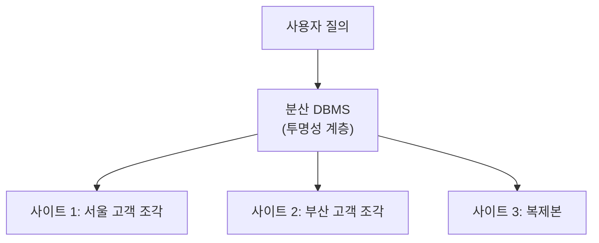

<Callout type="info">
  **이번 문서의 목표:** 이 문서를 다 읽으면 접근 통제 모델(DAC·MAC·RBAC)의 차이와 Oracle GRANT/REVOKE 구문, 뷰를 이용한 보안 기법을 설명하고, 분산 데이터베이스의 분할·복제·투명성 개념과 객체관계·객체지향 데이터베이스가 관계형 데이터베이스와 어떻게 다른지 비교할 수 있다.
</Callout>

## 왜 보안이 별도로 필요한가

14편에서 GRANT/REVOKE의 기본 문법을 다뤘다. 자세한 문법은 14편을 참고하고, 이 문서에서는 "왜 이런 권한 체계가 필요한가"와 "권한을 어떤 원칙으로 설계하는가"를 다룬다. 데이터베이스는 조직 전체의 데이터를 한곳에 모아 두는 시스템이기 때문에, 아무나 아무 데이터에나 접근할 수 있다면 그 위험은 파일 몇 개가 유출되는 것과는 비교가 안 될 만큼 크다. 그래서 DBMS(DataBase Management System, 데이터베이스 관리 시스템)는 "누가 무엇을 할 수 있는가"를 세밀하게 통제하는 접근 통제(access control) 체계를 내장한다.

> **쉽게 말하면:** 접근 통제는 "이 사람은 이 표를 볼 수는 있지만 고칠 수는 없다"처럼 사용자마다 할 수 있는 일을 다르게 정해 두는 규칙이다.

## 접근 통제 모델: DAC·MAC·RBAC

### 정의와 비교

접근 통제 모델은 "권한을 누가, 어떤 기준으로 정하는가"에 따라 세 가지로 나뉜다.

| 모델 | 권한을 정하는 주체 | 권한 부여 기준 | 특징 |
|---|---|---|---|
| 임의적 접근 통제(DAC, Discretionary Access Control) | 데이터의 소유자(owner) | 소유자가 재량껏 다른 사용자에게 권한을 부여·회수 | 유연하지만 권한이 여러 단계로 전파되면 통제가 느슨해질 수 있음 |
| 강제적 접근 통제(MAC, Mandatory Access Control) | 시스템(중앙 정책) | 데이터와 사용자에 매겨진 보안 등급(비밀·대외비 등)의 비교 | 소유자도 임의로 등급 규칙을 바꿀 수 없어 통제가 엄격함. 군사·정부 시스템에 주로 사용 |
| 역할 기반 접근 통제(RBAC, Role-Based Access Control) | 관리자가 정의한 역할(role) | 사용자를 역할에 배정하고, 역할에 권한을 부여 | 사용자가 많은 조직에서 "사용자 개개인"이 아니라 "역할 단위"로 권한을 관리해 유지보수가 쉬움 |

**자주 틀리는 점**: DAC는 "권한을 가진 사용자가 그 권한을 다시 남에게 넘겨줄 수 있는가(전파, propagation)"까지 재량에 포함된다는 점에서 단순히 "권한이 있다/없다"만 따지는 것과 다르다. 반대로 MAC는 데이터 소유자조차 등급 규칙을 스스로 바꿀 수 없다는 점이 DAC와의 결정적 차이다. RBAC는 DAC·MAC와 배타적인 개념이 아니라, "권한을 누구에게 직접 줄 것인가"의 문제를 "역할이라는 중간 단계를 하나 더 두어" 관리 효율을 높인 방식이라는 점에 유의한다.

### Oracle SQL로 보는 권한 관리

관계형 DBMS에서 권한 관리는 표준 SQL의 DCL(Data Control Language, 데이터 제어어)인 `GRANT`, `REVOKE`로 이루어진다. 다음은 Oracle 문법 기준 예제다.

```sql
-- 사용자 kim에게 EMPLOYEE 테이블 조회·수정 권한 부여
GRANT SELECT, UPDATE ON EMPLOYEE TO kim;

-- kim이 받은 권한을 다른 사용자에게 다시 넘겨줄 수 있도록 허용
GRANT SELECT ON EMPLOYEE TO kim WITH GRANT OPTION;

-- kim이 다시 lee에게 SELECT 권한을 전파
GRANT SELECT ON EMPLOYEE TO lee;

-- kim의 SELECT 권한을 회수(CASCADE로 kim이 전파한 권한도 함께 회수)
REVOKE SELECT ON EMPLOYEE FROM kim CASCADE CONSTRAINTS;
```

`WITH GRANT OPTION`은 DAC의 "권한 전파" 개념을 SQL로 구현한 것이다. kim이 이 옵션과 함께 SELECT 권한을 받았기 때문에, kim은 자신의 권한을 lee에게 다시 넘길 수 있었다. 이때 kim의 권한을 회수하면 kim이 전파한 lee의 권한도 함께 사라지는 것이 표준적인 동작이며, 이를 연쇄 회수(cascading revoke)라 부른다.

**자주 틀리는 점**: `WITH GRANT OPTION` 없이 받은 권한은 아무리 SELECT 권한이 있어도 다른 사용자에게 그 권한을 넘겨줄 수 없다. "권한이 있으면 당연히 남에게도 줄 수 있다"고 착각하지 않도록 주의한다.

## 뷰를 통한 보안

### 왜 필요한가

GRANT/REVOKE는 "테이블 전체"나 "특정 컬럼"에 대한 권한을 다룰 수는 있지만, "이 사용자는 이 테이블에서 특정 조건을 만족하는 행(row)만 봐야 한다"처럼 더 세밀한 통제가 필요할 때가 있다. 예를 들어 부서장이 자기 부서 직원의 급여만 조회할 수 있어야 하고, 다른 부서 직원의 급여는 아예 존재 자체를 몰라야 한다면, 테이블 단위 권한 부여만으로는 부족하다.

### 정의

뷰(view, 하나 이상의 테이블에서 유도된 가상 테이블)를 이용하면 이 문제를 해결할 수 있다. 원본 테이블에는 권한을 주지 않고, 필요한 컬럼·행만 걸러낸 뷰를 만들어 그 뷰에만 권한을 부여하는 방식이다.

```sql
-- 부서 10의 직원 정보만 보여주는 뷰
CREATE VIEW DEPT10_EMP AS
SELECT EMP_ID, EMP_NAME, SALARY
FROM EMPLOYEE
WHERE DEPT_ID = 10;

-- 부서장 kim에게는 뷰에만 SELECT 권한 부여 (원본 EMPLOYEE 테이블에는 권한 없음)
GRANT SELECT ON DEPT10_EMP TO kim;
```

kim은 `DEPT10_EMP` 뷰를 통해서만 데이터에 접근할 수 있고, `EMPLOYEE` 테이블 자체에는 아무 권한이 없으므로 다른 부서 직원의 정보는 애초에 질의할 수단이 없다. 이처럼 뷰는 "보여줄 것만 노출하고 나머지는 원천 차단"하는 논리적 데이터 독립성(logical data independence, 03편 참고)의 보안 응용이라 할 수 있다.

> **쉽게 말하면:** 뷰를 통한 보안은 "원본은 아예 안 보여주고, 봐도 되는 부분만 잘라낸 창문(뷰)을 통해서만 보게 하는" 방식이다.

## 분산 데이터베이스 기초

### 왜 필요한가

조직의 데이터가 한 대의 서버에 다 들어가지 않을 만큼 커지거나, 지사마다 물리적으로 떨어진 곳에서 빠르게 데이터에 접근해야 하는 경우, 데이터를 여러 사이트(site, 물리적으로 분리된 컴퓨터·서버)에 나누어 저장하고도 사용자에게는 마치 하나의 데이터베이스처럼 보이게 만들 필요가 있다. 이를 다루는 분야가 분산 데이터베이스(Distributed DataBase, DDB)다.

> **쉽게 말하면:** 분산 데이터베이스는 "데이터는 여러 곳에 흩어져 있지만, 사용하는 사람은 어디에 있는지 신경 쓸 필요가 없게" 만든 데이터베이스다.

### 데이터 분할(fragmentation)

하나의 테이블을 여러 조각으로 나누어 각기 다른 사이트에 저장하는 것을 분할이라 한다.

| 분할 방식 | 나누는 기준 | 예시 |
|---|---|---|
| 수평 분할(horizontal fragmentation) | 행(row) 단위로 나눔 | 서울 지사 고객 행과 부산 지사 고객 행을 각각 다른 사이트에 저장 |
| 수직 분할(vertical fragmentation) | 열(column) 단위로 나눔 | 고객의 기본 정보 컬럼과 결제 정보 컬럼을 서로 다른 사이트에 저장 |
| 혼합 분할(mixed fragmentation) | 행과 열을 함께 나눔 | 위 두 방식을 조합해 특정 지사의 특정 컬럼 조합만 저장 |

수직 분할을 할 때는 원래 테이블을 완전히 복원할 수 있도록, 각 조각에 기본 키(primary key)를 공통으로 포함시켜야 한다는 점이 중요하다. 그래야 나중에 조각들을 조인(join)해서 원래 테이블을 다시 만들 수 있다.

### 데이터 복제(replication)

같은 데이터(또는 조각)를 여러 사이트에 똑같이 복사해 두는 것이 복제다. 복제는 읽기 성능과 장애 대응력을 높이지만, 한 사이트에서 데이터를 변경하면 다른 모든 복제본에도 그 변경을 반영해야 하므로 갱신 비용과 동시성 제어(21편 참고)가 훨씬 복잡해진다는 대가가 따른다.

### 투명성(transparency)

분산 데이터베이스의 목표는 "사용자는 데이터가 어디에 어떻게 흩어져 있는지 몰라도 하나의 데이터베이스처럼 쓸 수 있어야 한다"는 것이다. 이를 투명성이라 하며, 대표적으로 다음 종류가 있다.

| 투명성 종류 | 사용자가 몰라도 되는 것 |
|---|---|
| 분할 투명성(fragmentation transparency) | 테이블이 여러 조각으로 나뉘어 있다는 사실 |
| 위치 투명성(location transparency) | 각 조각(또는 복제본)이 물리적으로 어느 사이트에 있는지 |
| 복제 투명성(replication transparency) | 같은 데이터가 여러 곳에 복제되어 있다는 사실 |

이 세 가지 투명성이 모두 갖춰지면, 사용자는 지금까지 배운 SQL을 마치 데이터가 한곳에 있는 것처럼 그대로 작성할 수 있고, 실제로 어느 사이트의 어느 조각에서 데이터를 가져올지는 시스템이 알아서 처리한다.



**자주 틀리는 점**: 분산 데이터베이스는 여러 대의 컴퓨터에 데이터가 나뉘어 있다는 점에서 단순한 "클라이언트-서버 구조로 원격 접속하는 중앙 집중형 데이터베이스"와 다르다. 후자는 데이터가 물리적으로 한곳에 모여 있고 접근 경로만 원격일 뿐이지만, 분산 데이터베이스는 데이터 자체가 여러 사이트에 실제로 나뉘어(또는 복제되어) 저장된다.

## 객체관계·객체지향 데이터베이스 기본 개념

### 왜 필요한가

관계형 데이터베이스는 모든 데이터를 단순한 표(테이블) 형태로 다루는 것을 전제로 한다. 그런데 설계·CAD 도면, 멀티미디어 파일, 복잡한 사용자 정의 자료구조처럼 "단순한 표로 표현하기 어려운 복잡한 데이터"를 다뤄야 하는 응용 분야가 늘어나면서, 객체지향 프로그래밍(object-oriented programming)의 개념(객체·클래스·상속·캡슐화)을 데이터베이스에 도입하려는 시도가 나왔다.

### 정의와 비교

| 구분 | 관계형 DBMS(RDBMS) | 객체관계형 DBMS(ORDBMS) | 객체지향 DBMS(OODB) |
|---|---|---|---|
| 데이터 모델 | 테이블(관계)만 사용 | 테이블 기반 + 사용자 정의 타입·상속 확장 | 객체·클래스 자체가 데이터 모델 |
| SQL 호환성 | 표준 SQL 완전 지원 | 표준 SQL을 확장해 지원(대부분 호환) | 독자적인 질의어를 쓰는 경우가 많음(SQL 호환성 낮음) |
| 복잡한 데이터 표현 | 여러 테이블로 쪼개서 표현(설계가 복잡해짐) | 사용자 정의 타입으로 비교적 자연스럽게 표현 | 객체 그대로 저장해 가장 자연스럽게 표현 |
| 대표적 활용 | 일반적인 업무 시스템 | 기존 관계형 시스템에 복잡한 타입을 점진적으로 추가 | CAD·설계·멀티미디어 등 특수 응용 |

**핵심 개념**: 객체지향 데이터베이스의 핵심은 캡슐화(encapsulation, 데이터와 그 데이터를 다루는 연산을 하나로 묶는 것), 상속(inheritance, 상위 클래스의 속성·연산을 하위 클래스가 물려받는 것), 객체 식별자(Object Identifier, OID, 값이 아니라 시스템이 부여하는 고유 식별자로 객체를 구분하는 방식)다. 관계형 모델의 튜플은 기본 키 값으로 식별되지만, 객체지향 모델의 객체는 값이 같아도 서로 다른 OID를 가지면 별개의 객체로 취급된다는 점이 근본적인 차이다.

객체관계형 DBMS(ORDBMS)는 이 둘의 절충안으로, 기존 관계형 모델의 SQL 생태계·표준화 이점을 유지하면서 사용자 정의 타입(user-defined type)과 상속 같은 객체지향 개념 일부만 받아들인 형태다. Oracle을 포함한 대부분의 현업 상용 DBMS가 이 방식을 채택하고 있다.

> **쉽게 말하면:** OODB는 "데이터베이스를 통째로 객체지향 프로그래밍 세계처럼 만든 것"이고, ORDBMS는 "기존 관계형 데이터베이스에 객체지향의 편리한 기능 몇 가지만 얹은 것"이다.

## 핵심 정리

- 접근 통제 모델은 DAC(소유자 재량)·MAC(시스템의 강제 등급)·RBAC(역할 기반) 세 가지로 나뉘며, DAC의 권한 전파는 Oracle SQL의 `WITH GRANT OPTION`으로 구현된다.
- 뷰를 통한 보안은 원본 테이블에는 권한을 주지 않고, 필요한 컬럼·행만 걸러낸 뷰에만 권한을 부여해 세밀한 접근 통제를 구현한다.
- 분산 데이터베이스는 데이터를 수평·수직·혼합 분할하거나 복제하되, 분할·위치·복제 투명성을 통해 사용자에게는 하나의 데이터베이스처럼 보이게 한다.
- 객체관계형 DBMS(ORDBMS)는 관계형 모델에 객체지향 개념 일부를 얹은 절충안이고, 객체지향 DBMS(OODB)는 객체·클래스·상속·OID를 데이터 모델의 핵심으로 삼는다.

## 마무리 복습

<Quiz
  questionNumber={1}
  question="접근 통제 모델 DAC·MAC·RBAC에 대한 설명으로 옳지 않은 것은?"
  options={['DAC는 데이터 소유자가 재량껏 권한을 부여·회수할 수 있다', 'MAC는 데이터 소유자도 임의로 보안 등급 규칙을 바꿀 수 없다', 'RBAC는 사용자 개개인이 아니라 역할 단위로 권한을 관리한다', 'MAC는 소유자의 재량에 따라 권한이 자유롭게 전파되는 모델이다']}
  correctAnswer={4}
  explanation="권한이 소유자의 재량으로 자유롭게 전파되는 모델은 DAC다. MAC는 시스템이 정한 보안 등급 비교로 권한이 결정되며 소유자의 재량이 개입하지 않는다."
  optionExplanations={['DAC의 정의로 옳은 설명이다', 'MAC의 정의로 옳은 설명이다', 'RBAC의 정의로 옳은 설명이다', '옳지 않은 것을 찾는 문제의 정답. 재량에 따른 자유로운 전파는 DAC의 특징이지 MAC의 특징이 아니다']}
/>

<Quiz
  questionNumber={2}
  question="다음 Oracle SQL 문에 대한 설명으로 옳은 것은? GRANT SELECT ON EMPLOYEE TO kim WITH GRANT OPTION;"
  options={['kim은 EMPLOYEE 테이블에 대해 조회만 가능하고 자신의 권한을 남에게 넘길 수 없다', 'kim은 EMPLOYEE 테이블을 조회할 수 있고, 이 SELECT 권한을 다른 사용자에게 다시 부여할 수도 있다', 'kim은 EMPLOYEE 테이블에 대한 모든 권한(SELECT, UPDATE, DELETE 등)을 받는다', 'WITH GRANT OPTION은 kim의 권한을 자동으로 일정 기간 뒤 회수한다는 뜻이다']}
  correctAnswer={2}
  explanation="WITH GRANT OPTION은 부여받은 권한을 다른 사용자에게 다시 부여(전파)할 수 있도록 허용하는 절이다. 이 문장에서는 SELECT 권한만 부여했으므로 다른 권한은 갖지 않는다."
  optionExplanations={['WITH GRANT OPTION이 있으므로 권한을 남에게 넘길 수 있다', '정답. GRANT의 대상 권한과 WITH GRANT OPTION의 의미를 정확히 설명한다', '이 문장은 SELECT 권한만 부여했으므로 UPDATE, DELETE 권한은 포함되지 않는다', 'WITH GRANT OPTION은 기간 제한과 무관하며 권한 전파 허용을 의미한다']}
/>

<Quiz
  questionNumber={3}
  question="뷰를 통한 보안 기법에 대한 설명으로 옳은 것은?"
  options={['뷰에 권한을 부여하려면 반드시 원본 테이블에도 같은 권한을 부여해야 한다', '뷰는 컬럼만 제한할 수 있고 행 단위 제한은 불가능하다', '원본 테이블에는 권한을 주지 않고 필요한 컬럼·행만 걸러낸 뷰에만 권한을 부여해 세밀한 통제를 할 수 있다', '뷰를 이용한 보안은 물리적 데이터 독립성의 응용이다']}
  correctAnswer={3}
  explanation="뷰를 통한 보안은 원본 테이블에는 아무 권한도 주지 않고, 필요한 부분만 걸러낸 뷰에 권한을 부여해 그 뷰를 통해서만 접근하게 하는 방식이다."
  optionExplanations={['뷰만 권한을 받고 원본 테이블은 권한이 없어도 되는 것이 이 기법의 핵심이다', 'WHERE 절을 이용하면 행 단위 제한도 가능하다', '정답. 뷰를 통한 보안의 핵심 동작 방식이다', '뷰를 통한 보안은 논리적 데이터 독립성의 응용이지 물리적 데이터 독립성과는 관련이 적다']}
/>

<Quiz
  questionNumber={4}
  question="분산 데이터베이스의 데이터 분할 방식에 대한 설명으로 옳지 않은 것은?"
  options={['수평 분할은 행 단위로 테이블을 나눈다', '수직 분할은 열 단위로 테이블을 나눈다', '수직 분할된 조각에는 원래 테이블을 복원할 수 있도록 기본 키를 공통으로 포함시켜야 한다', '혼합 분할은 수평 분할과 수직 분할 중 하나만 선택해서 적용하는 방식이다']}
  correctAnswer={4}
  explanation="혼합 분할은 수평 분할과 수직 분할을 함께 적용하는 방식이지, 둘 중 하나만 선택하는 것이 아니다."
  optionExplanations={['수평 분할의 정의로 옳은 설명이다', '수직 분할의 정의로 옳은 설명이다', '조각을 다시 조인해 원본을 복원하려면 기본 키가 공통으로 있어야 한다는 옳은 설명이다', '옳지 않은 것을 찾는 문제의 정답. 혼합 분할은 두 방식을 함께 적용하는 것이다']}
/>

<Quiz
  questionNumber={5}
  question="분산 데이터베이스의 투명성(transparency) 종류와 그 의미를 옳게 짝지은 것은?"
  options={['위치 투명성 - 테이블이 여러 조각으로 나뉘어 있다는 사실을 몰라도 됨', '분할 투명성 - 조각이 물리적으로 어느 사이트에 있는지 몰라도 됨', '복제 투명성 - 같은 데이터가 여러 곳에 복제되어 있다는 사실을 몰라도 됨', '복제 투명성 - 테이블이 나뉘어 있다는 사실을 몰라도 됨']}
  correctAnswer={3}
  explanation="복제 투명성은 같은 데이터가 여러 사이트에 복제되어 있다는 사실을 사용자가 몰라도 되게 하는 것이다."
  optionExplanations={['이 설명은 위치 투명성이 아니라 분할 투명성에 해당한다', '이 설명은 분할 투명성이 아니라 위치 투명성에 해당한다', '정답. 복제 투명성의 정의와 정확히 일치한다', '이 설명은 복제 투명성이 아니라 분할 투명성에 해당한다']}
/>

<Quiz
  questionNumber={6}
  question="관계형 DBMS(RDBMS), 객체관계형 DBMS(ORDBMS), 객체지향 DBMS(OODB)의 비교로 옳은 것은?"
  options={['RDBMS는 표준 SQL과 무관한 독자적인 질의어만 지원한다', 'ORDBMS는 관계형 모델에 사용자 정의 타입·상속 등을 확장한 절충안이다', 'OODB는 표준 SQL과 완전히 동일한 질의어를 사용한다', 'RDBMS가 OODB보다 복잡한 사용자 정의 자료구조를 더 자연스럽게 표현한다']}
  correctAnswer={2}
  explanation="ORDBMS는 관계형 모델의 SQL 생태계를 유지하면서 사용자 정의 타입, 상속 같은 객체지향 개념 일부를 받아들인 절충 모델이다."
  optionExplanations={['RDBMS는 표준 SQL을 완전히 지원하는 것이 특징이다', '정답. ORDBMS의 정의와 정확히 일치한다', 'OODB는 독자적인 질의어를 쓰는 경우가 많아 SQL 호환성이 상대적으로 낮다', '복잡한 사용자 정의 자료구조는 객체를 그대로 저장하는 OODB가 더 자연스럽게 표현한다']}
/>

<Quiz
  questionNumber={7}
  question="객체지향 데이터베이스(OODB)에서 객체 식별자(OID)에 대한 설명으로 옳은 것은?"
  options={['OID는 객체가 가진 속성 값들의 조합으로 계산되는 값이다', 'OID는 값이 같은 두 객체를 항상 같은 객체로 취급하게 만든다', 'OID는 시스템이 부여하는 고유 식별자로, 값이 같아도 서로 다른 객체로 구분할 수 있게 한다', '관계형 모델의 기본 키(primary key)와 OID는 완전히 동일한 개념이다']}
  correctAnswer={3}
  explanation="OID는 객체의 속성 값과 무관하게 시스템이 부여하는 고유 식별자로, 두 객체의 속성 값이 완전히 같아도 서로 다른 OID를 가지면 별개의 객체로 구분된다."
  optionExplanations={['OID는 속성 값의 조합으로 계산되는 값이 아니라 시스템이 독립적으로 부여하는 값이다', 'OID는 오히려 값이 같아도 서로 다른 객체로 구분할 수 있게 하는 장치다', '정답. OID의 정의와 관계형 기본 키와의 근본적 차이를 정확히 설명한다', '기본 키는 속성 값 기반 식별이고 OID는 값과 무관한 시스템 부여 식별이라는 점에서 서로 다른 개념이다']}
/>

## 참고 자료

- [Oracle Database Security Guide](https://docs.oracle.com/en/database/oracle/oracle-database/index.html)
- [GeeksforGeeks - Types of Database Security](https://www.geeksforgeeks.org/dbms/database-security-in-dbms/)
- [GeeksforGeeks - Distributed Database System](https://www.geeksforgeeks.org/dbms/distributed-database-system/)
- 국가평생교육진흥원 독학학위제: [https://bdes.nile.or.kr](https://bdes.nile.or.kr)
