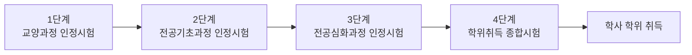

<Callout type="info">
  **이번 문서의 목표:** 독학사 제도 안에서 4단계 실용영어 시험이 어떤 위치에 있는지, 합격 기준이 무엇인지, 시험 시간을 어떻게 배분해야 하는지 설명할 수 있다.
</Callout>

## 독학사 제도란 무엇인가

> **쉽게 말하면:** 대학에 다니지 않아도 국가시험 4단계를 순서대로 통과하면 학사 학위를 주는 제도다.

독학사(독학에 의한 학위취득시험)는 정식 명칭이 **독학학위제**(獨學學位制)다. 대학교에 입학해 4년을 다니는 대신, 국가평생교육진흥원(National Institute for Lifelong Education, 줄여서 **NILE**, 나일)이 주관하는 시험을 단계별로 통과하면 학사 학위를 취득하는 제도다. "독학"이라는 말 그대로 정규 대학 강의를 듣지 않고 스스로 공부해서 학위를 딴다는 뜻이며, "학위취득시험"이라는 말은 시험 합격 자체가 학점이 아니라 학위 취득의 요건이 된다는 뜻이다.

독학사는 총 4단계로 구성된다. 1단계는 교양과정 인정시험, 2단계는 전공기초과정 인정시험, 3단계는 전공심화과정 인정시험, 4단계는 **학위취득 종합시험**이다. 4단계라는 이름에 "종합"이라는 말이 들어가는 이유는, 이 시험이 1~3단계에서 다룬 내용을 별도로 다시 묻는 것이 아니라 해당 전공 분야에서 학사 학위를 받을 사람이 갖추어야 할 종합적인 역량을 확인하는 마지막 관문이기 때문이다. 아래 표는 4단계 전체의 위치를 정리한 것이다.

| 단계 | 정식 명칭 | 성격 | 통과 시 인정되는 것 |
|------|-----------|------|----------------------|
| 1단계 | 교양과정 인정시험 | 대학 1–2학년 교양 수준 | 교양과정 이수 |
| 2단계 | 전공기초과정 인정시험 | 전공 기초 수준 | 전공기초과정 이수 |
| 3단계 | 전공심화과정 인정시험 | 전공 심화 수준 | 전공심화과정 이수 |
| 4단계 | 학위취득 종합시험 | 학사 학위 종합 역량 | 학사 학위 취득 |

각 단계는 순서대로 통과해야 하는 것이 원칙이지만, 대학 재학·졸업, 학점은행제 학점 인정, 국가기술자격 취득 등으로 특정 단계를 **면제**받을 수 있다. 그래서 이 과목의 독자처럼 "1~3단계는 이미 통과했거나 학점인정으로 4단계만 남은 학습자"가 실제로 많다. 이 경우 4단계 실용영어만 남았다고 해도, 시험 구조 자체는 다른 4단계 전공과목과 동일하게 적용되므로 이번 편에서 그 구조를 명확히 짚어 둔다.

## 4단계 학위취득 종합시험의 구조

> **쉽게 말하면:** 4단계는 전공별로 정해진 여러 과목을 한 번에 치르고, 각 과목을 개별적으로 60점 이상 받아야 통과한다.

4단계 학위취득 종합시험은 전공 계열(예: 경영학, 컴퓨터공학, 영어영문학 등)마다 정해진 필수·선택 과목을 함께 응시하는 구조다. 실용영어는 여러 전공 계열에서 **교양공통** 과목으로 지정되어 있는 경우가 많다. "교양공통"이라는 말은 특정 전공 지식이 아니라 전공에 관계없이 공통으로 요구되는 교양·실무 소양을 확인하는 과목이라는 뜻이며, 그래서 실용영어는 특정 전공 이론이 아니라 실제 상황에서 쓰이는 영어 활용 능력을 평가한다.

합격 기준은 매 회차 공고에서 확정되지만, 독학사 전반에 공통적으로 적용되어 온 원칙은 다음과 같다.

- 각 과목을 **100점 만점 60점 이상** 받아야 해당 과목이 합격 처리된다.
- 4단계는 각 과목을 개별적으로 채점하며, 한 과목이라도 60점 미만이면 그 과목만 불합격 처리되고 다음 회차에 그 과목만 다시 응시할 수 있다(전 과목 재응시가 아니다).
- 시험은 보통 객관식(4지선다) 위주로 구성되며, 과목에 따라 주관식 문항이 포함되기도 한다. 실용영어는 객관식이 중심이지만 서술형 대비 수준의 이해를 요구하는 문항이 나온다.

<Callout type="warning">
  회차별 정확한 문항 수, 배점, 시험 시간, 주관식 포함 여부는 **매년(회차별) 공고마다 달라질 수 있다.** 이 문서에서 제시하는 수치는 학습 전략을 세우기 위한 일반적인 기준이며, 실제 응시 전에 반드시 국가평생교육진흥원 홈페이지의 최신 응시요강을 확인해야 한다.
</Callout>

## 실용영어 과목의 위치와 성격

> **쉽게 말하면:** 실용영어는 문학·어학 이론이 아니라 실제 상황에서 영어를 이해하고 쓰는 능력을 확인하는 과목이다.

같은 4단계 안에도 영어영문학 전공에는 영어학개론, 영문학개론처럼 이론 중심 과목이 있다. 반면 실용영어는 "실용"(實用, practical)이라는 말 그대로, 이메일, 공지문, 광고, 대화문처럼 실제 생활·업무 상황에서 마주치는 텍스트를 얼마나 정확히 읽고 활용할 수 있는지를 평가한다. 문법 이론을 장황하게 묻기보다는, 문법 지식이 실제 문장 안에서 오류를 찾거나 올바른 표현을 고르는 데 쓰이는지를 확인하는 방식이다.

이 과목이 다루는 영역은 크게 다섯 갈래로 나뉜다.

| 영역 | 무엇을 확인하는가 | 이 시리즈에서 다루는 편 |
|------|-------------------|------------------------|
| 어휘·숙어·구동사 | 생활·비즈니스 어휘, 동의어·반의어, 문맥 추론 | 07, 08 |
| 문법·어법 | 시제·태·수일치·접속사·관계사·병렬·오류 찾기 | 09, 10, 11, 12 |
| 독해 | 주제·요지, 세부·추론, 빈칸·순서·삽입, 무관 문장 | 13, 14, 15 |
| 생활·실용·비즈니스 영어 | 이메일·공지·광고·전화·대화 등 실제 상황 표현 | 18, 19 |
| 문장 완성·전환·영작·해석 | 문장 패턴, 전환(능동↔수동, 화법), 재배열, 해석 | 16, 17 |

이 다섯 영역이 국가평생교육진흥원이 공식적으로 제시하는 **평가영역**의 뼈대다. 평가영역이 무엇이고 왜 중요한지는 다음 02편에서 자세히 다룬다. 지금 단계에서 기억할 것은, 실용영어 시험은 이 다섯 영역이 골고루 출제되는 종합형 시험이라는 점, 그리고 한두 영역만 편식해서 공부하면 합격선인 60점을 넘기 어렵다는 점이다.

## 시간 배분 전략

> **쉽게 말하면:** 어휘·문법처럼 빨리 푸는 문제를 먼저 끝내고, 독해와 지문형 문제에 남은 시간을 몰아준다.

시험 시간은 회차마다 다를 수 있지만, 다음과 같은 배분 원칙은 문항 유형의 성격상 일관되게 적용할 수 있다.

1. **어휘·숙어 문항** — 문장을 읽자마자 답이 보이거나, 몰라도 오래 고민한다고 답이 나오지 않는 유형이다. 문항당 목표 시간을 짧게(예: 40초 이내) 잡고, 모르면 바로 표시만 해 두고 넘어간다.
2. **문법·어법 문항** — 규칙을 알면 빠르게 풀 수 있지만, 밑줄 여러 개 중 오류를 찾는 유형은 문장을 두 번 읽어야 할 수 있다. 문항당 목표 시간을 어휘보다 조금 넉넉하게(예: 50~60초) 잡는다.
3. **독해 문항** — 지문을 읽는 시간이 필요하므로 가장 많은 시간을 배정해야 한다. 특히 빈칸·순서·삽입 유형은 지문 전체의 논리 흐름을 따라가야 하므로 서두르면 오히려 틀리기 쉽다.
4. **생활·실용 영어, 문장 전환·영작 문항** — 대화문이나 실용 텍스트는 상황 파악이 핵심이므로, 첫 문장에서 상황(누가, 어디서, 무엇을 요청하는지)을 먼저 파악한 뒤 선택지를 본다.

> **비유로 이해하면:** 시험 시간 배분은 뷔페에서 접시를 채우는 순서와 비슷하다. 빨리 없어지는(시간이 걸리지 않는) 음식부터 담아 배를 채워 놓고, 오래 걸리는 요리(독해 지문)에는 남은 시간을 여유 있게 쓰는 것이 총점을 극대화하는 전략이다.

자주 저지르는 시간 배분 실수는 다음과 같다.

- 어휘 문제 하나를 몰라서 2~3분씩 붙잡고 있다가 뒤쪽 독해 지문을 읽을 시간이 부족해지는 경우
- 독해 지문을 정독하지 않고 선택지부터 훑다가 함정 선택지에 걸리는 경우 — 지문의 핵심 문장(주제문, 연결사가 붙은 문장)을 먼저 표시하며 읽는 습관이 필요하다
- 초반 문항에서 시간을 다 써서 마지막 5~10문항을 찍는 경우 — 전체 문항 수를 먼저 확인하고 구간별 목표 시각(예: "30번까지는 시험 시작 20분 후")을 정해 두는 것이 도움이 된다

## 핵심 정리

- 독학사는 1~4단계로 구성되며, 4단계는 전공별 학위취득 **종합**시험이다. 실용영어는 여러 전공에서 교양공통 과목으로 지정된다.
- 합격 기준의 기본 원칙은 과목별 100점 만점 **60점 이상**이며, 불합격 과목만 재응시할 수 있다. 정확한 문항 수·시간은 회차 공고 확인이 필요하다.
- 실용영어는 어휘·숙어, 문법·어법, 독해, 생활·실용 영어, 문장 완성·전환·영작·해석 다섯 영역으로 구성된 실무 중심 시험이다.
- 시간 배분은 빠르게 푸는 어휘·문법 문항을 먼저 처리하고, 지문을 읽어야 하는 독해·생활영어 문항에 상대적으로 많은 시간을 배정하는 전략이 효율적이다.

## 마무리 복습

<Quiz
  questionNumber={1}
  question="독학사 제도에서 4단계 학위취득 종합시험에 대한 설명으로 옳지 않은 것은?"
  options={['전공별로 정해진 필수·선택 과목을 함께 응시하는 구조다', '각 과목을 100점 만점 60점 이상 받아야 해당 과목이 합격 처리된다', '한 과목이 60점 미만이면 4단계 전체 과목을 처음부터 다시 응시해야 한다', '실용영어는 여러 전공 계열에서 교양공통 과목으로 지정되는 경우가 많다']}
  correctAnswer={3}
  explanation="독학사 4단계는 과목별로 개별 채점되어, 불합격한 과목만 다음 회차에 재응시하면 된다. 전 과목을 처음부터 다시 보는 것이 아니다."
  optionExplanations={['옳은 설명이다. 4단계는 전공 계열별 필수·선택 과목을 함께 응시한다.', '옳은 설명이다. 과목별 60점 이상이 합격 기준의 기본 원칙이다.', '틀린 설명이다. 불합격 과목만 재응시하면 되며 전 과목 재응시가 아니다.', '옳은 설명이다. 실용영어는 여러 전공에서 교양공통 과목으로 지정된다.']}
/>

<Quiz
  questionNumber={2}
  question="독학사 4단계 실용영어 과목의 성격에 대한 설명으로 가장 적절한 것은?"
  options={['영문학 작품의 문예사조를 심층 분석하는 과목이다', '영어학 이론 중 음운론과 통사론을 전문적으로 다루는 과목이다', '이메일, 공지, 광고, 대화 등 실제 상황에서 영어를 이해하고 활용하는 능력을 확인하는 과목이다', '스피킹과 발음 실기를 중심으로 평가하는 과목이다']}
  correctAnswer={3}
  explanation="실용영어는 실제 생활·업무 상황에서 마주치는 텍스트를 얼마나 정확히 읽고 활용할 수 있는지를 평가하는 실무 중심 과목이다."
  optionExplanations={['영문학 작품론은 다른 전공과목(영문학개론 등)의 영역이다.', '음운론·통사론 심화는 영어학개론 등 다른 전공과목의 영역이다.', '정답이다. 실용영어는 실제 상황 텍스트 기반의 실무 영어 능력을 평가한다.', '스피킹·발음 실기는 독학사 4단계 실용영어의 평가 범위에서 제외된다.']}
/>

<Quiz
  questionNumber={3}
  question="실용영어 시험에서 권장되는 시간 배분 전략으로 가장 적절하지 않은 것은?"
  options={['어휘·숙어 문항은 문항당 목표 시간을 짧게 잡고 모르면 표시만 하고 넘어간다', '독해 지문형 문항은 지문을 읽는 시간이 필요하므로 상대적으로 많은 시간을 배정한다', '어휘 문제 하나를 모르면 답이 떠오를 때까지 몇 분이든 붙잡고 있어야 한다', '전체 문항 수를 미리 확인하고 구간별 목표 시각을 정해 두면 뒤쪽 문항을 찍는 상황을 줄일 수 있다']}
  correctAnswer={3}
  explanation="어휘 문제를 오래 붙잡고 있으면 뒤쪽 독해 지문을 읽을 시간이 부족해지므로, 모르는 문항은 표시만 하고 넘어가는 것이 효율적인 전략이다."
  optionExplanations={['옳은 전략이다. 어휘·숙어는 짧게 판단하고 넘어가는 것이 효율적이다.', '옳은 전략이다. 독해는 지문을 읽어야 하므로 상대적으로 많은 시간이 필요하다.', '틀린 전략이다. 모르는 어휘 문제에 시간을 과도하게 쓰면 전체 시간 배분이 무너진다.', '옳은 전략이다. 구간별 목표 시각을 정하면 시간 관리에 도움이 된다.']}
/>

<Quiz
  questionNumber={4}
  question="독학사 단계 면제 제도에 대한 설명으로 옳은 것은?"
  options={['면제는 어떤 경우에도 허용되지 않으며 반드시 1단계부터 순서대로 응시해야 한다', '대학 재학·졸업, 학점은행제 학점 인정, 국가기술자격 취득 등으로 특정 단계를 면제받을 수 있다', '면제를 받으면 4단계 학위취득 종합시험도 응시할 필요가 없다', '면제는 1단계에만 적용되고 2~4단계에는 적용되지 않는다']}
  correctAnswer={2}
  explanation="독학사는 대학 재학·졸업, 학점은행제 학점 인정, 국가기술자격 취득 등의 방법으로 특정 단계를 면제받을 수 있는 제도를 운영한다."
  optionExplanations={['틀린 설명이다. 면제 제도가 존재하며 반드시 순서대로 응시해야 하는 것은 아니다.', '옳은 설명이다. 다양한 방법으로 단계별 면제가 가능하다.', '틀린 설명이다. 1~3단계를 면제받아도 학위 취득을 위해서는 4단계 학위취득 종합시험을 통과해야 한다.', '틀린 설명이다. 면제는 여러 단계에 걸쳐 적용될 수 있다.']}
/>

<Quiz
  questionNumber={5}
  question="다음 중 독학사 4단계 실용영어가 공식적으로 다루는 평가영역에 해당하지 않는 것은?"
  options={['어휘·숙어·구동사', '문법·어법', '생활·실용·비즈니스 영어 표현', '스피킹 발음 교정 실기']}
  correctAnswer={4}
  explanation="스피킹·발음 실기는 독학사 4단계 실용영어의 평가 범위에서 제외되는 영역이다. 실용영어는 읽기·문법·어휘·실용 표현 중심의 필기시험이다."
  optionExplanations={['실용영어의 공식 평가영역에 해당한다.', '실용영어의 공식 평가영역에 해당한다.', '실용영어의 공식 평가영역에 해당한다.', '정답이다. 스피킹·발음 실기는 이 과목의 평가 범위에서 명시적으로 제외된다.']}
/>

<Quiz
  questionNumber={6}
  question="다음 중 시험 시간 배분과 관련해 저지르기 쉬운 실수로 지문에서 언급된 것이 아닌 것은?"
  options={['어휘 문제 하나에 2~3분씩 붙잡혀 있다가 뒤쪽 독해 지문 읽을 시간이 부족해지는 것', '독해 지문을 정독하지 않고 선택지부터 훑다가 함정 선택지에 걸리는 것', '초반 문항에서 시간을 다 써서 마지막 문항들을 찍게 되는 것', '독해 지문의 주제문과 연결사가 붙은 문장을 먼저 표시하며 읽는 것']}
  correctAnswer={4}
  explanation="주제문과 연결사가 붙은 문장을 먼저 표시하며 읽는 것은 지문에서 권장하는 좋은 습관이지 실수가 아니다."
  optionExplanations={['지문에서 언급된 대표적인 시간 배분 실수다.', '지문에서 언급된 대표적인 시간 배분 실수다.', '지문에서 언급된 대표적인 시간 배분 실수다.', '정답이다. 이는 실수가 아니라 권장되는 독해 습관이다.']}
/>

## 참고 자료

- [국가평생교육진흥원 독학학위제](https://bdes.nile.or.kr)
