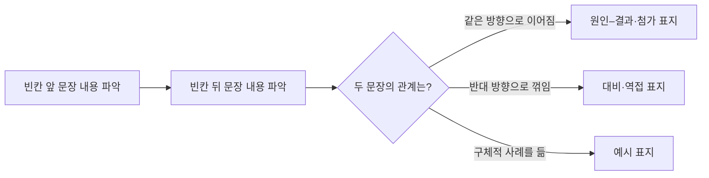

## 왜 논리 독해 기본기가 따로 필요한가

01편에서 topic, main idea, inference 같은 용어를 정리했다면, 이번 편은 그 용어들이 실제로 어떻게 지문 안에서 작동하는지를 다룬다. 논리 관계란 앞 문장과 뒤 문장이 "그래서(원인–결과)", "하지만(대비)", "예를 들어(예시)" 중 어떤 관계로 이어지는지를 뜻한다.

## 문단 구조 — 주제문과 뒷받침문

01편에서 이미 정의한 것처럼 **주제문**(topic sentence)은 문단의 핵심 주장을 담은 한 문장이고, **뒷받침문**(supporting sentence)은 그 주장을 예시·이유·데이터로 보강하는 문장이다. 영어 문단은 한국어 글보다 이 구조가 훨씬 명시적으로 드러나는 경우가 많아서, 주제문의 위치만 찾아도 문단 전체의 요지를 빠르게 파악할 수 있다.

다음은 이 구조를 보여주기 위해 새로 작성한 예문 문단이다.

> Many small companies now allow employees to choose their own working hours. This flexibility helps workers manage personal responsibilities such as childcare and medical appointments. It also tends to increase job satisfaction, since employees feel trusted to organize their own schedules. As a result, several studies report lower turnover rates among companies that adopt flexible hours.

해석: 많은 소규모 기업들이 이제 직원들에게 자신의 근무 시간을 선택하도록 허용한다. 그 결과 여러 연구는 유연 근무제를 도입한 기업에서 이직률이 더 낮다고 보고한다.

이 문단에서 첫 문장("Many small companies now allow employees to choose their own working hours.")이 주제문이다. 만약 이 문단에 제목을 붙이거나 요지를 묻는 문제가 나온다면, 뒷받침문 하나(예: "이직률 감소")만 보고 정답을 고르지 말고 반드시 주제문이 담고 있는 더 큰 범위(유연 근무제의 긍정적 효과)로 답해야 한다.

<Callout type="warning">
  주제문이 항상 문단의 첫 문장에 오는 것은 아니다. 마지막 문장에 결론 형태로 오거나, 드물게는 중간에 오는 경우도 있다. "첫 문장 = 무조건 주제문"이라고 기계적으로 외우지 말고, 뒷받침문들이 공통으로 가리키는 문장이 무엇인지를 확인하는 습관이 더 안전하다.
</Callout>

## 연결사·담화 표지 — 문장 사이 관계를 알려주는 신호등

**연결사**(connector) 또는 **담화 표지**(discourse marker)는 문장과 문장, 또는 문단과 문단을 이어주면서 그 사이의 논리 관계를 드러내는 단어·구절이다. 담화(discourse)란 문장 하나를 넘어서는 더 큰 단위의 말·글의 흐름을 뜻하는 말이며, 담화 표지는 그 흐름 속에서 "지금부터 이런 관계의 내용이 온다"고 미리 알려주는 이정표 역할을 한다.

| 관계 | 대표 담화 표지 | 뜻 |
|------|----------------|----|
| 원인–결과 | as a result, therefore, consequently, so | 그 결과, 따라서 |
| 대비·역접 | however, on the other hand, in contrast, although | 하지만, 반면에, 비록 그렇더라도 |
| 예시 | for example, for instance, such as | 예를 들어 |
| 첨가·나열 | in addition, furthermore, moreover | 게다가, 또한 |
| 요약·결론 | in short, in conclusion, overall | 요컨대, 결론적으로 |

이 표지들은 빈칸 추론 문제에서 특히 힘을 발휘한다. 빈칸 앞뒤 문장의 내용이 서로 반대된다면 however 계열이, 앞 문장의 결과가 뒤 문장으로 이어진다면 as a result 계열이 빈칸에 들어갈 가능성이 높다. 다음 예문으로 확인해 보자.

> The new online registration system was expected to reduce waiting times at the clinic. ______, many patients reported that the system was confusing and took longer to use than the old paper forms.

해석: 새로운 온라인 등록 시스템은 병원 진료소의 대기 시간을 줄일 것으로 기대되었다. ______, 많은 환자들은 그 시스템이 헷갈리고 예전 종이 양식보다 사용하는 데 시간이 더 오래 걸렸다고 답했다.

빈칸 앞 문장은 "대기 시간을 줄일 것으로 기대되었다"는 긍정적 예상이고, 빈칸 뒤 문장은 "헷갈리고 시간이 더 걸렸다"는 반대되는 실제 결과다. 두 문장이 대비 관계이므로 빈칸에는 however가 들어가야 한다. as a result를 넣으면 "기대되었다, 그 결과 헷갈렸다"는 어색한 인과 관계가 되어 버리므로 오답이다.

```mermaid
flowchart LR
    A["빈칸 앞 문장 내용 파악"] --> B["빈칸 뒤 문장 내용 파악"]
    B --> C{두 문장의 관계는?}
    C -->|같은 방향으로 이어짐| D["원인–결과·첨가 표지"]
    C -->|반대 방향으로 꺾임| E["대비·역접 표지"]
    C -->|구체적 사례를 듦| F["예시 표지"]
```

## 논증 구조 — 원인–결과, 대비, 예시로 글을 뜯어보기

**논증**(argument)이란 어떤 주장을 근거로 뒷받침해 나가는 글의 짜임을 뜻한다. 논증 구조를 안다는 것은 "이 지문이 지금 무엇을 근거로, 어떤 방식으로 주장을 펼치고 있는가"를 지도처럼 그릴 수 있다는 뜻이다. 실용영어 독해에서 반복적으로 나타나는 논증 구조는 크게 세 가지다.

1. **원인–결과(cause and effect)**: 어떤 사건이나 조건이 다른 결과를 낳는 구조다. 위 유연 근무제 예문에서 "유연 근무제 도입 → 만족도 상승 → 이직률 감소"로 이어지는 흐름이 이에 해당한다. 원인–결과 구조를 파악하는 문제에서는 무엇이 원인이고 무엇이 결과인지를 뒤바꾼 선택지가 대표적인 함정이다.
2. **대비(contrast)**: 두 대상이나 상황의 차이를 부각하는 구조다. 위 온라인 등록 시스템 예문에서 "기대했던 효과"와 "실제 반응"을 대비시킨 것이 이에 해당한다. 대비 구조 문제에서는 두 대상의 공통점을 정답으로 착각하게 만드는 선택지가 함정으로 자주 나온다.
3. **예시(example)**: 추상적인 주장을 구체적인 사례로 뒷받침하는 구조다. for example 뒤에 오는 문장은 대개 그 앞 문장의 일반적 주장을 뒷받침하는 구체적 사례이므로, 예시 문장 자체가 지문 전체의 main idea는 아니라는 점에 유의해야 한다.

세 구조는 서로 배타적이지 않고 한 지문 안에서 섞여 나타난다. 예를 들어 "재택근무 확대"라는 주제의 공지문 안에 재택근무의 장점(원인–결과), 기존 방식과의 차이(대비), 실제 적용 사례(예시)가 순서대로 등장할 수 있다.

## 함의와 추론 — 지문이 직접 말하지 않은 것 읽어내기

**함의**(含意, implication)란 지문이 직접적으로 서술하지는 않았지만 문맥상 은연중에 전달하는 내용을 뜻하고, **추론**(推論, inference)은 01편에서 정의했듯이 그 함의를 근거로 독자가 논리적으로 이끌어내는 결론을 뜻한다. 두 용어는 짝을 이루는 개념으로, 지문이 함의를 "심어 놓으면" 독자는 그것을 근거로 추론을 "이끌어낸다"고 이해하면 된다.

위 유연 근무제 예문을 다시 보자. 지문은 "유연 근무제를 도입한 기업에서 이직률이 더 낮다고 보고한다"라고만 말했을 뿐, "그러므로 유연 근무제가 없는 기업은 이직률이 더 높다"라고 직접 말하지 않았다.

## 자주 틀리는 점

- 주제문을 무조건 첫 문장으로 단정하고, 결론부에 주제문이 오는 문단에서 엉뚱한 뒷받침문을 요지로 고르는 경우가 있다.
- 담화 표지의 사전적 뜻만 외우고, 빈칸 앞뒤 문장의 실제 내용 관계를 확인하지 않은 채 표지를 고르는 경우가 있다.
- 예시 문장을 그 지문의 main idea로 착각해, 지나치게 좁은 범위의 선택지를 정답으로 고르는 경우가 있다.
- 추론 문제에서 지문에 언급되지 않은 내용까지 논리적 비약으로 끌어와 오답을 정답으로 고르는 경우가 있다.

## 핵심 정리

- 문단은 핵심 주장을 담은 주제문과 그것을 뒷받침하는 여러 뒷받침문으로 구성되며, 주제문의 위치는 첫 문장에 국한되지 않는다.
- 연결사·담화 표지는 문장 사이의 논리 관계(원인–결과, 대비, 예시, 첨가, 요약)를 미리 알려주는 신호이며, 빈칸 문제는 표지의 뜻보다 앞뒤 문장의 실제 관계를 먼저 파악해야 한다.
- 지문 전체는 원인–결과, 대비, 예시 같은 몇 가지 논증 구조의 조합으로 이루어지며, 이를 표시하며 읽으면 뒤에서 다룰 순서·삽입 문제 풀이가 빨라진다.
- 함의는 지문이 은연중에 전달하는 내용이고, 추론은 그것을 근거로 이끌어내는 결론이다. 근거 없는 비약과 타당한 추론을 구별해야 한다.

## 마무리 복습

<Quiz
  questionNumber={1}
  question={"주제문(topic sentence)과 뒷받침문(supporting sentence)의 관계에 대한 설명으로 가장 적절한 것은?"}
  options={["뒷받침문은 항상 주제문보다 먼저 나온다","주제문은 문단의 핵심 주장을 담고 뒷받침문은 그것을 예시·근거로 보강한다","주제문과 뒷받침문은 서로 바꾸어 사용해도 문단의 의미가 전혀 달라지지 않는다","뒷받침문은 문단당 하나만 존재할 수 있다"]}
  correctAnswer={2}
  explanation={"주제문은 문단의 핵심 주장을 담은 문장이고, 뒷받침문은 그 주장을 구체적인 근거나 예시로 보강하는 문장이다."}
/>

<Quiz
  questionNumber={2}
  question={"다음 문장에서 빈칸에 들어가기에 가장 적절한 담화 표지는? ______, its total sales increased by 15 percent."}
  options={["However","Surprisingly","For example","In addition"]}
  correctAnswer={2}
  explanation={"예산을 줄였는데도 매출이 오히려 늘었다는 것은 일반적인 기대와 반대되는 뜻밖의 결과이므로, 놀라움을 나타내는 Surprisingly가 가장 자연스럽다."}
/>

<Quiz
  questionNumber={3}
  question={"원인–결과 논증 구조를 파악하는 문제에서 가장 대표적인 함정 선택지의 형태는?"}
  options={["원인과 결과를 정확한 순서 그대로 서술한 선택지","무엇이 원인이고 무엇이 결과인지 뒤바꾸어 서술한 선택지","지문에 언급되지 않은 완전히 새로운 화제를 다룬 선택지","지문의 결론 문장을 그대로 인용한 선택지"]}
  correctAnswer={2}
  explanation={"원인–결과 구조 문제에서는 원인과 결과의 방향을 뒤바꾼 선택지가 가장 흔한 함정으로 출제된다."}
/>

## 참고 자료

- [국가평생교육진흥원 독학학위제](https://bdes.nile.or.kr)
- [Cambridge Dictionary](https://dictionary.cambridge.org)
