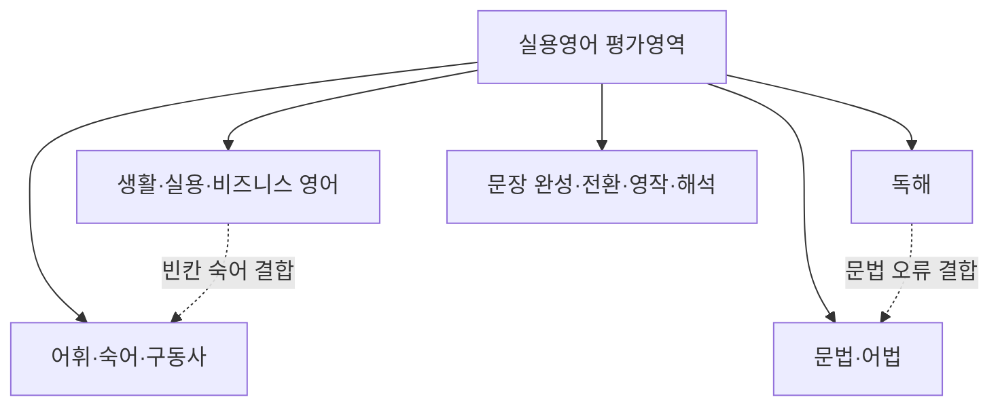

<Callout type="info">
  **이번 문서의 목표:** 국가평생교육진흥원이 공고하는 평가영역·출제방향이 무엇을 뜻하는지 설명하고, 이를 바탕으로 실용영어 문항의 실무·실용 중심 성격을 구별할 수 있다.
</Callout>

## 평가영역이란 무엇이고 왜 먼저 읽어야 하는가

> **쉽게 말하면:** 평가영역은 "이 과목에서 무엇을 시험 보겠다"고 국가평생교육진흥원이 공식적으로 정해 둔 항목 목록이다.

01편에서 실용영어가 어휘·숙어, 문법·어법, 독해, 생활·실용 영어, 문장 완성·전환·영작·해석 다섯 갈래로 나뉜다는 것을 살펴봤다. 이 다섯 갈래는 필자가 임의로 나눈 분류가 아니라, 국가평생교육진흥원(NILE)이 과목별로 공고하는 **평가영역**(評價領域, evaluation area)이라는 공식 항목을 재구성한 것이다. 평가영역은 "이 과목 시험에서 어떤 범위의 지식과 능력을 확인하겠다"는 국가 기관의 공식 약속이다. 그래서 평가영역을 먼저 정확히 읽어 두면, 어떤 주제를 얼마나 깊이 공부해야 하는지 방향을 잡을 수 있다.

평가영역과 자주 혼동되는 개념이 **출제기준**(出題基準, examination guideline)이다. 출제기준은 평가영역보다 한 단계 더 구체적인 문서로, 평가영역 각 항목 아래에 실제로 어떤 하위 주제·유형이 포함되는지까지 명시한다. 비유하자면 평가영역은 "요리책의 목차"이고, 출제기준은 "각 챕터 안에 어떤 레시피가 들어 있는지 적힌 상세 페이지"에 가깝다. 실제 시험 공고에는 두 문서가 함께 게시되는 경우가 많으므로, 두 용어를 구별하지 못하면 "출제기준에 이런 내용이 있었나?"라는 혼란이 생긴다.

<Callout type="warning">
  평가영역·출제기준의 정확한 문구와 세부 항목은 회차·연도마다 국가평생교육진흥원 공고에서 갱신될 수 있다. 이 문서에서 제시하는 다섯 영역 구조는 최근 공고에서 일관되게 확인되는 큰 틀이며, 세부 문구는 응시 전 최신 공고 원문으로 반드시 재확인해야 한다.
</Callout>

## 실용영어의 다섯 평가영역

> **쉽게 말하면:** 어휘, 문법, 독해, 생활영어, 영작(전환·해석 포함)이라는 다섯 기둥이 시험 전체를 떠받친다.

아래 표는 다섯 평가영역 각각이 무엇을 확인하는지, 그리고 이 시리즈의 어느 편에서 그 영역을 본격적으로 다루는지 정리한 것이다.

| 평가영역 | 확인하려는 능력 | 대표 문항 형태 | 본론 담당 편 |
|----------|------------------|----------------|--------------|
| 어휘·숙어·구동사 | 단어·숙어의 의미를 문맥 속에서 정확히 아는가 | 동의어·반의어 선택, 빈칸에 알맞은 어휘 고르기 | 07, 08 |
| 문법·어법 | 문법 규칙을 실제 문장 오류 판단에 적용할 수 있는가 | 밑줄 오류 찾기, 어법상 올바른 표현 고르기 | 09–12 |
| 독해 | 지문의 주제·세부·논리 구조를 파악할 수 있는가 | 주제·요지, 빈칸·순서·삽입, 추론 | 13–15 |
| 생활·실용·비즈니스 영어 | 실제 상황(이메일·공지·전화·대화)에서 알맞은 표현을 아는가 | 대화 빈칸 완성, 안내문 해석 | 18, 19 |
| 문장 완성·전환·영작·해석 | 문장 구조를 바꾸거나 새로 구성할 수 있는가 | 능동↔수동 전환, 한국어→영어 문장 변환 | 16, 17 |

이 다섯 영역은 서로 완전히 분리된 칸이 아니라 실제 문항에서는 겹쳐서 나타나는 경우가 많다. 예를 들어 독해 지문 안에 밑줄 친 문법 오류를 찾는 문항이 섞여 나오기도 하고, 생활영어 대화문 안에 빈칸에 들어갈 숙어를 고르는 문항이 나오기도 한다. 그래서 다섯 영역을 "따로따로 외우는 목록"이 아니라, 한 문제 안에서도 여러 영역이 동시에 작동할 수 있다는 감각으로 받아들이는 것이 중요하다.

## 출제방향·평가수준이 말하는 것

> **쉽게 말하면:** "단순 암기가 아니라, 배운 것을 실제 문장·상황에 적용할 수 있는지 본다"는 것이 출제방향의 핵심이다.

국가평생교육진흥원은 독학학위제 전 과목에 공통으로 적용되는 출제방향을 안내하면서, 문항을 **이해**(理解, understanding), **적용**(適用, application), **분석**(分析, analysis) 세 수준으로 나누어 평가한다고 밝히고 있다. 세 용어는 교육학에서 학습 목표의 위계를 나눌 때 쓰는 표현으로, 여기서는 다음과 같은 뜻으로 이해하면 된다.

- **이해**: 단어의 뜻, 문법 규칙 자체를 알고 있는가. 예를 들어 "동사 뒤에 목적어가 오면 3형식이다"라는 규칙을 아는 단계다.
- **적용**: 그 규칙을 처음 보는 문장에 실제로 적용해서 올바른 형태를 고를 수 있는가. 예를 들어 새로운 문장에서 밑줄 친 동사 형태가 맞는지 판단하는 단계다.
- **분석**: 여러 요소가 얽힌 상황에서 어떤 규칙이 우선하는지, 왜 다른 선택지가 틀렸는지까지 구별할 수 있는가. 예를 들어 독해 지문에서 빈칸 앞뒤 논리 관계를 따져 접속사를 고르는 단계다.

이 세 수준은 뒤로 갈수록 어렵고, 실용영어는 세 수준이 골고루 섞여 출제된다. 어휘 문항은 이해 수준에 가깝고, 문법 오류 찾기는 적용 수준, 빈칸·순서·삽입형 독해는 분석 수준에 가깝다고 보면 대략의 난이도 지도를 그릴 수 있다. 다만 이 대응은 절대적인 것이 아니라 경향일 뿐이므로, "어휘니까 무조건 쉽다"고 단정하지 않도록 주의한다. 다의어나 문맥 추론이 섞인 어휘 문항은 분석 수준까지 요구하기도 한다.

<Callout type="warning">
  이해·적용·분석이라는 세 단계 명칭과 구체적인 배점 비율은 시험 공고문의 표현을 그대로 인용한 것이 아니라, 국가평생교육진흥원이 공개하는 출제방향의 취지를 이 시리즈가 학습 목적으로 재구성한 설명이다. 정확한 공고 문구는 최신 응시요강에서 확인해야 한다.
</Callout>

## 실용영어의 실무·실용 중심 출제 특징

> **쉽게 말하면:** 실용영어는 문법책 예문이 아니라, 실제로 마주칠 법한 이메일·공지·광고·대화를 지문으로 쓴다.

01편에서 이미 짚었듯이 실용영어는 영어영문학 전공의 이론 과목(영어학개론, 영문학개론 등)과 성격이 다르다. "실용"(實用, practical)이라는 이름이 뜻하는 바는 두 가지다. 첫째, 지문의 **소재**가 실생활·업무 상황이라는 것이다. 회사 공지, 채용 광고, 예약 확인 이메일, 고객 불만 응대 대화처럼 실제로 마주칠 법한 텍스트가 그대로 지문이 된다. 둘째, 지문을 읽고 확인하는 **능력**도 이론적 분석이 아니라 실제 활용 능력이라는 것이다. 예를 들어 시의 운율 구조를 분석하는 것이 아니라, 공지문에서 "언제까지 신청해야 하는가"라는 실무 정보를 정확히 뽑아내는 능력을 확인한다.

이 실무·실용 중심 출제 특징은 아래 세 가지 방향으로 구체화된다.

1. **지문 형식의 다양성**: 산문형 지문뿐 아니라 이메일 헤더(제목·발신인·수신인), 목록형 공지, 광고 레이아웃, 대화 형식(A: / B:)처럼 실제 문서의 형식을 흉내 낸 지문이 나온다. 형식이 낯설어도 정보를 찾는 방식은 일반 독해와 같다는 점을 알면 당황하지 않는다.
2. **상황 판단이 먼저**: 생활·실용 영어 문항은 문법을 몰라도 상황(누가, 어디서, 무엇을 요청·안내하는지)만 정확히 파악하면 풀리는 경우가 많다. 그래서 지문을 읽을 때 등장인물의 역할과 목적을 가장 먼저 확인하는 습관이 중요하다.
3. **문법·어휘의 실전 적용**: 문법 문항도 추상적인 규칙 설명이 아니라, 업무 이메일이나 안내문 속 한 문장을 인용해 그 문장의 오류를 찾거나 올바른 표현을 고르게 한다. 그래서 문법을 공부할 때도 "규칙을 외우는 것"에서 그치지 않고 "실제 문장에 적용해 보는 연습"까지 이어져야 한다.

> **비유로 이해하면:** 이론 중심 과목이 요리학 교과서로 조리 원리를 배우는 것이라면, 실용영어는 실제 주방에서 손님이 주문한 요리를 그 자리에서 만들어 내는 것과 비슷하다. 재료(문법·어휘)를 아는 것만으로는 부족하고, 상황에 맞게 바로 활용할 수 있어야 한다.

## 핵심 정리

- 평가영역은 국가평생교육진흥원이 공고하는 공식 시험 범위이며, 출제기준은 그 아래 세부 주제까지 명시한 더 구체적인 문서다.
- 실용영어의 평가영역은 어휘·숙어·구동사, 문법·어법, 독해, 생활·실용·비즈니스 영어, 문장 완성·전환·영작·해석 다섯 갈래로 구성된다.
- 출제방향은 이해→적용→분석 세 수준으로 문항 난도가 올라가는 구조를 취하며, 실용영어는 세 수준이 골고루 섞여 출제된다.
- 실용영어의 "실용" 성격은 소재(실제 업무·생활 텍스트)와 능력(실전 활용) 두 측면에서 드러나며, 문법·어휘도 실제 문장 속 적용을 전제로 출제된다.

## 마무리 복습

<Quiz
  questionNumber={1}
  question="평가영역과 출제기준의 관계에 대한 설명으로 가장 적절한 것은?"
  options={['평가영역과 출제기준은 완전히 동일한 문서를 가리키는 다른 이름일 뿐이다', '출제기준은 평가영역보다 더 큰 범주이며 평가영역이 그 하위 세부 항목이다', '평가영역은 시험의 큰 범위를 정한 항목이고 출제기준은 그 아래 구체적 하위 주제까지 명시한 문서다', '평가영역은 민간 교재에서만 쓰는 용어이고 국가평생교육진흥원 공고에는 등장하지 않는다']}
  correctAnswer={3}
  explanation="평가영역은 시험 범위를 정한 큰 항목이고, 출제기준은 그 아래 하위 주제·유형까지 구체화한 문서다. 두 용어는 상세도의 차이로 구별된다."
  optionExplanations={['틀린 설명이다. 두 용어는 상세도가 다른 별개의 문서다.', '틀린 설명이다. 관계가 반대로 서술되어 있다. 출제기준이 평가영역보다 더 구체적이다.', '정답이다. 평가영역이 큰 틀, 출제기준이 세부 항목이라는 위계 관계를 정확히 설명한다.', '틀린 설명이다. 평가영역은 국가평생교육진흥원 공고에서 쓰는 공식 용어다.']}
/>

<Quiz
  questionNumber={2}
  question="다음 중 국가평생교육진흥원이 공고하는 독학사 4단계 실용영어의 공식 평가영역에 해당하지 않는 것은?"
  options={['어휘·숙어·구동사', '문법·어법', '생활·실용·비즈니스 영어', '영문학 작품의 문예사조 분석']}
  correctAnswer={4}
  explanation="영문학 작품의 문예사조 분석은 영문학개론 등 다른 4단계 전공과목의 영역이며, 실용영어의 공식 평가영역에는 해당하지 않는다."
  optionExplanations={['실용영어의 공식 평가영역에 해당한다.', '실용영어의 공식 평가영역에 해당한다.', '실용영어의 공식 평가영역에 해당한다.', '정답이다. 문예사조 분석은 실용영어가 아니라 문학 이론 과목의 영역이다.']}
/>

<Quiz
  questionNumber={3}
  question="출제방향에서 말하는 이해–적용–분석 세 수준에 대한 설명으로 옳지 않은 것은?"
  options={['이해는 단어의 뜻이나 문법 규칙 자체를 아는 단계를 뜻한다', '적용은 배운 규칙을 처음 보는 문장에 실제로 적용해 판단하는 단계를 뜻한다', '분석은 여러 요소가 얽힌 상황에서 우선순위를 따지고 오답 이유까지 구별하는 단계를 뜻한다', '세 수준은 항상 어휘–문법–독해 순서로만 고정되어 나타나며 예외는 없다']}
  correctAnswer={4}
  explanation="이해·적용·분석은 난도 위계를 설명하는 개념일 뿐 특정 영역에 고정된 것은 아니다. 다의어나 문맥 추론이 섞인 어휘 문항도 분석 수준을 요구할 수 있다."
  optionExplanations={['옳은 설명이다. 이해는 규칙 자체를 아는 가장 기본 단계다.', '옳은 설명이다. 적용은 새로운 문장에 규칙을 적용하는 단계다.', '옳은 설명이다. 분석은 우선순위와 오답 이유까지 구별하는 가장 높은 단계다.', '정답이다. 세 수준은 영역과 절대적으로 고정된 대응 관계가 아니라 경향에 가깝다.']}
/>

<Quiz
  questionNumber={4}
  question="실용영어의 실무·실용 중심 출제 특징으로 가장 거리가 먼 것은?"
  options={['이메일, 공지, 광고, 대화문처럼 실제 업무·생활 텍스트가 지문으로 쓰인다', '생활·실용 영어 문항은 상황(누가, 어디서, 무엇을 요청하는지) 파악이 우선인 경우가 많다', '문법 문항도 실제 이메일·안내문 속 문장을 인용해 오류를 찾게 하는 방식이 흔하다', '실용영어는 실무 소재를 다루므로 문법 규칙을 전혀 학습할 필요가 없다']}
  correctAnswer={4}
  explanation="실용영어는 문법 규칙 자체를 배제하는 과목이 아니라, 문법 규칙을 실제 문장에 적용하는 능력까지 확인하는 과목이다."
  optionExplanations={['실무·실용 중심 출제 특징에 해당하는 옳은 설명이다.', '실무·실용 중심 출제 특징에 해당하는 옳은 설명이다.', '실무·실용 중심 출제 특징에 해당하는 옳은 설명이다.', '정답이다. 문법 규칙 학습이 불필요하다는 것은 실용영어의 성격과 반대되는 서술이다.']}
/>

<Quiz
  questionNumber={5}
  question="다음 중 평가영역과 그 대표 문항 형태의 연결이 옳지 않은 것은?"
  options={['어휘·숙어·구동사 – 동의어·반의어 선택', '문법·어법 – 밑줄 오류 찾기', '독해 – 빈칸·순서·삽입', '문장 완성·전환·영작·해석 – 대화 상황에서 적절한 응답 선택']}
  correctAnswer={4}
  explanation="대화 상황에서 적절한 응답을 선택하는 문항은 생활·실용·비즈니스 영어 영역의 대표 형태이며, 문장 완성·전환·영작·해석 영역은 능동↔수동 전환이나 한국어→영어 문장 변환이 대표적이다."
  optionExplanations={['옳은 연결이다.', '옳은 연결이다.', '옳은 연결이다.', '정답이다. 대화 응답 선택은 생활·실용 영어 영역의 대표 형태다.']}
/>

<Quiz
  questionNumber={6}
  question="실용영어와 영어영문학 전공의 이론 과목(영어학개론 등)의 차이에 대한 설명으로 가장 적절한 것은?"
  options={['실용영어는 이론 과목보다 어휘량을 더 많이 요구할 뿐 그 외에는 차이가 없다', '실용영어는 실제 업무·생활 소재와 실전 활용 능력을 확인하고, 이론 과목은 언어·문학 이론 자체의 분석 능력을 확인한다', '실용영어는 객관식이 없고 전부 주관식으로만 출제된다', '이론 과목은 실용영어보다 항상 배점이 낮게 책정된다']}
  correctAnswer={2}
  explanation="실용영어는 실무 소재와 실전 활용 능력을, 이론 과목은 언어학·문학 이론 자체를 분석하는 능력을 확인한다는 점에서 성격이 다르다."
  optionExplanations={['틀린 설명이다. 어휘량 차이만이 아니라 평가하는 능력의 성격 자체가 다르다.', '정답이다. 실용영어와 이론 과목의 핵심 차이를 정확히 설명한다.', '틀린 설명이다. 실용영어는 객관식이 중심이며 과목에 따라 주관식이 포함될 수 있다.', '틀린 설명이다. 배점 체계는 회차 공고에 따라 다르며 이 시리즈에서 단정할 수 있는 내용이 아니다.']}
/>

## 참고 자료

- [국가평생교육진흥원 독학학위제](https://bdes.nile.or.kr)
