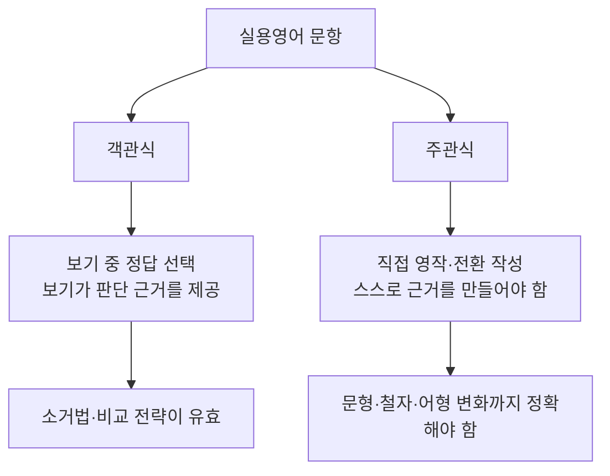

<Callout type="info">
  **이번 문서의 목표:** 이 파일을 다 읽으면 실용영어 시험에 나오는 모든 문제 유형을 영역별로 분류하고, 어디에 학습 시간을 더 투자해야 하는지 스스로 판단할 수 있다.
</Callout>

## 왜 전체 지도부터 그려야 하는가

07편부터는 어휘, 문법, 독해, 영작, 생활영어를 하나씩 깊게 파고든다. 하지만 그 전에 "이 시험이 전체적으로 어떤 모양인가"를 먼저 알아야 한다. 지도 없이 낯선 도시를 걷다 보면 같은 골목을 여러 번 돌게 되는 것처럼, 전체 유형 분류를 모른 채 문제집부터 풀면 이미 익숙한 유형만 반복하고 약한 유형은 계속 피하게 된다.

> **쉽게 말하면:** 이 편은 실용영어 시험이라는 지도 전체를 펼쳐 놓고, 어느 영역에 몇 개의 산이 있고 어느 산이 가장 오르기 힘든지 미리 표시해 두는 자리다.

02편에서 다룬 국가평생교육진흥원의 공식 평가영역(어휘·문법·독해·생활영어·영작)을 기준으로 삼되, 실제 문제지에서는 이 다섯 영역이 더 세분화된 문항 형태로 나타난다. 이번 편에서는 그 세분화된 유형을 전부 늘어놓고, 객관식(multiple-choice, 보기 중 하나를 고르는 방식)과 주관식(short-answer, 직접 써넣는 방식)의 구조 차이, 그리고 영역별 시간 배분 전략까지 다룬다.

## 영역별 유형 분류 — 다섯 영역, 여덟 갈래

공식 평가영역 다섯 가지(어휘·문법·독해·생활영어·영작)는 실제 문항에서 아래처럼 더 잘게 나뉜다. 이 표는 이후 07~19편이 각각 어느 칸을 맡는지 보여주는 이정표이기도 하다.

| 공식 평가영역 | 세부 유형 | 대표 문항 형태 | 자세히 다루는 편 |
|---|---|---|---|
| 어휘·숙어 | 동의어·반의어 선택, 문맥추론 어휘, 구동사·콜로케이션 | 빈칸에 들어갈 단어 고르기, 밑줄 친 단어와 의미가 가장 가까운 것 고르기 | 07, 08 |
| 문법·어법 | 시제·태·수일치, 접속사·관계사, 병렬·전치사, 오류 찾기 | 빈칸 채우기, 밑줄 중 어법상 틀린 것 고르기 | 09, 10, 11, 12 |
| 독해 | 주제·요지·제목, 세부·추론·태도, 빈칸·순서·삽입·무관 문장 | 지문을 읽고 질문에 답하기 | 13, 14, 15 |
| 문장 완성·전환·해석 | 문장 완성, 능동/수동·화법 전환, 부분·전체 해석 | 두 문장이 같은 뜻이 되도록 빈칸 채우기 | 16 |
| 영작 | 기본 문형(SVO 등) 적용, 한국어→영어 변환 | 우리말 문장을 영어로 가장 바르게 옮긴 것 고르기 | 17 |
| 생활·실용·비즈니스 표현 | 인사·안내·문의, 이메일·전화·회의 표현 | 상황에 맞는 표현 고르기 | 18 |
| 대화문 | 짧은/긴 대화 완성, 응답 선택 | 빈칸에 들어갈 대답 고르기 | 19 |

이 표에서 눈여겨볼 점은 "문법·어법"과 "독해"가 각각 네 편, 세 편으로 나뉘어 있다는 사실이다. 이는 우연이 아니라 실제 출제 비중을 반영한 배치다(05편의 설계 근거 참고). 즉 학습 시간을 배분할 때도 이 두 영역에 상대적으로 더 많은 시간을 쓰는 것이 합리적이다.

## 객관식과 주관식의 구조 차이

독학사 4단계는 교양·전공 대부분이 객관식(multiple-choice) 위주지만, 실용영어처럼 어학 과목은 **주관식(short-answer, 단답형 서술)** 문항이 함께 출제되는 경우가 있다는 점이 다른 전공 과목과 다르다. 두 형태는 요구하는 능력 자체가 다르므로 준비 방법도 달라야 한다.

객관식은 보기 네 개 중 하나만 정답이므로, 정답을 모르더라도 나머지 세 개가 왜 틀렸는지 소거하는 전략이 통한다. 반면 주관식은 보기가 없으므로 문장을 스스로 완성해야 하고, 철자(spelling)나 어형 변화(동사 변형, 관사 등) 하나만 틀려도 감점될 수 있다. 그래서 주관식 대비는 "이해했다"에서 멈추지 않고 "정확히 손으로 쓸 수 있다"는 단계까지 연습해야 한다.

> **쉽게 말하면:** 객관식은 알아보는 능력(recognition)을, 주관식은 만들어내는 능력(production)을 시험한다.

주관식은 매 회차 공고에 따라 출제 여부와 비중이 달라질 수 있으므로, 반드시 **응시하는 해당 회차의 공고를 확인**해야 한다. 이 문서에서 제시하는 유형 비중은 최근 출제 경향을 근거로 한 추정치이며 절대적인 기준이 아니다.

## 난도·배점 추정과 시간 전략

시험 시간과 문항 수, 배점은 회차 공고마다 달라질 수 있어 이 문서에서 특정 숫자를 단정하지 않는다. 다만 **영역별 난도 체감**은 여러 해에 걸쳐 비교적 일정한 패턴을 보이므로, 아래 표를 학습 우선순위를 정하는 데 참고할 수 있다.

| 영역 | 체감 난도 | 이유 | 시간 배분 전략 |
|---|---|---|---|
| 어휘·숙어 | 중 | 암기량은 많지만 함정 패턴이 제한적 | 짧게, 자주 반복 |
| 문법·어법 | 상 | 규칙이 세밀하고 예외가 많음 | 오답 유형별 정리에 가장 많은 시간 투입 |
| 독해 | 중상 | 지문 길이·논리 추론 부담 | 시간 안에 푸는 훈련(속독+정확도) 병행 |
| 생활·실용 표현 | 하중 | 정형화된 표현 위주 | 빈출 표현 암기 위주로 빠르게 정리 |
| 영작·전환 | 상 | 문법과 어휘를 동시에 정확히 적용해야 함 | 문형별 패턴을 반복 훈련 |

시험 당일 시간 전략은 "쉬운 영역 먼저, 어려운 영역에 남은 시간 집중"이 기본 원칙이다. 어휘·생활영어처럼 빠르게 판단 가능한 문항을 먼저 처리해 시간을 확보한 뒤, 독해 지문처럼 시간이 오래 걸리는 문항에 남은 시간을 몰아 쓰는 방식이 일반적으로 효율적이다. 단, 이는 일반적인 전략이며 실제 문항 배열과 개인의 강약점에 따라 조정해야 한다.

**자주 틀리는 점**: 문법 문제를 완벽히 다 풀고 넘어가려다 독해 지문을 읽을 시간이 부족해지는 경우가 많다. 문법 문제는 "확신이 서지 않으면 표시만 해 두고 다음으로 넘어간 뒤, 독해까지 끝내고 돌아와 재검토"하는 순서가 전체 점수에 유리하다.

## 핵심 정리

- 공식 평가영역 다섯 가지(어휘·문법·독해·생활영어·영작)는 실제 문항에서 여덟 갈래 세부 유형으로 나뉜다.
- 객관식은 소거법이 통하는 인식(recognition) 문제, 주관식은 정확한 어형까지 요구하는 생성(production) 문제다.
- 시험 시간·배점·주관식 비중은 회차 공고마다 달라질 수 있으므로 반드시 해당 회차 공고를 확인해야 한다.
- 문법·독해 영역은 체감 난도가 높고 출제 비중도 크므로 학습 시간을 상대적으로 더 배분한다.
- 시험 당일에는 쉬운 영역을 먼저 처리해 시간을 확보하고, 어려운 영역에 남은 시간을 집중하는 전략이 유리하다.

## 마무리 복습

<Quiz
  questionNumber={1}
  question="국가평생교육진흥원의 공식 평가영역에 해당하지 않는 것은?"
  options={['어휘·숙어', '문법·어법', '독해', '발음·억양 실기']}
  correctAnswer={4}
  explanation="발음·억양 실기(스피킹)는 필기시험인 독학사 4단계 실용영어의 평가영역에 포함되지 않는다. 나머지 셋은 모두 공식 평가영역에 해당한다."
  optionExplanations={['어휘·숙어는 공식 평가영역에 포함된다.', '문법·어법은 공식 평가영역에 포함된다.', '독해는 공식 평가영역에 포함된다.', '발음·억양 실기는 필기시험 범위가 아니므로 해당하지 않는다.']}
/>

<Quiz
  questionNumber={2}
  question="객관식 문항과 주관식 문항의 차이를 가장 정확하게 설명한 것은?"
  options={['객관식은 인식 능력을, 주관식은 생성 능력을 주로 요구한다.', '객관식은 문법 영역에만, 주관식은 독해 영역에만 나온다.', '주관식은 철자나 어형이 틀려도 채점에 영향이 없다.', '객관식은 소거법이 통하지 않고 주관식은 소거법이 통한다.']}
  correctAnswer={1}
  explanation="객관식은 보기 중에서 정답을 알아보는 인식(recognition) 능력을, 주관식은 스스로 답을 만들어내는 생성(production) 능력을 요구한다는 것이 두 유형의 핵심 차이다."
  optionExplanations={['객관식은 인식, 주관식은 생성 능력을 요구한다는 설명이 정확하다.', '두 형식이 특정 영역에만 국한된다는 설명은 근거가 없다.', '주관식은 철자·어형 오류가 감점 요인이 될 수 있다.', '소거법은 보기가 있는 객관식에서 통하는 전략이며 설명이 반대로 되어 있다.']}
/>

<Quiz
  questionNumber={3}
  question="실용영어 시험의 시험 시간·문항 수·배점에 대한 설명으로 가장 적절한 것은?"
  options={['모든 회차에서 항상 동일하게 고정되어 있다.', '회차 공고마다 달라질 수 있으므로 해당 회차 공고 확인이 필요하다.', '독학사 시험 특성상 공고 없이 매년 자동으로 결정된다.', '독해 영역에만 배점이 존재하고 나머지 영역은 배점이 없다.']}
  correctAnswer={2}
  explanation="시험 시간, 문항 수, 배점은 회차 공고마다 달라질 수 있으므로 특정 수치를 단정할 수 없고, 반드시 응시하는 회차의 공고를 확인해야 한다."
  optionExplanations={['공고마다 세부 사항이 달라질 수 있으므로 항상 고정이라는 설명은 옳지 않다.', '공고 확인이 필요하다는 설명이 정확하다.', '공고 없이 자동 결정된다는 설명은 사실과 다르다.', '모든 영역에 배점이 존재하므로 독해에만 배점이 있다는 설명은 옳지 않다.']}
/>

<Quiz
  questionNumber={4}
  question="시험 당일 시간 배분 전략으로 가장 권장되는 것은?"
  options={['모든 문항을 앞에서부터 순서대로 풀고 절대 순서를 바꾸지 않는다.', '쉬운 영역을 먼저 처리해 시간을 확보하고 어려운 영역에 남은 시간을 집중한다.', '어려운 문법 문제부터 끝까지 붙잡고 다음 문제로 넘어가지 않는다.', '독해 지문은 가장 마지막까지 미뤄 두고 시간이 남으면 읽는다.']}
  correctAnswer={2}
  explanation="어휘·생활영어처럼 빠르게 판단 가능한 영역을 먼저 처리해 시간을 확보한 뒤, 독해처럼 시간이 오래 걸리는 영역에 남은 시간을 집중하는 것이 일반적으로 효율적인 전략이다."
  optionExplanations={['순서를 절대 바꾸지 않는 전략은 시간 관리에 비효율적일 수 있다.', '쉬운 영역 우선 처리 후 어려운 영역에 집중하는 전략이 가장 권장된다.', '한 문제에 과도하게 시간을 쓰면 뒤 문항을 풀 시간이 부족해진다.', '독해를 마지막까지 미루면 시간 부족으로 지문을 제대로 읽지 못할 위험이 크다.']}
/>

<Quiz
  questionNumber={5}
  question="다음 중 문법·어법 영역의 세부 유형으로 다루어지는 것을 04편의 논리 독해와 혼동하지 않고 바르게 짝지은 것은?"
  options={['시제·태·수일치와 오류 찾기 유형은 문법·어법 영역에 속한다.', '주제·요지 파악은 문법·어법 영역의 세부 유형이다.', '빈칸·순서·삽입 문제는 문법·어법 영역에서만 출제된다.', '생활·실용 표현은 문법·어법 영역의 하위 유형이다.']}
  correctAnswer={1}
  explanation="시제·태·수일치, 접속사·관계사, 병렬·전치사, 오류 찾기는 모두 문법·어법 영역의 세부 유형이다. 주제·요지 파악과 빈칸·순서·삽입은 독해 영역, 생활·실용 표현은 별도 영역에 속한다."
  optionExplanations={['시제·태·수일치와 오류 찾기는 문법·어법 영역에 속하므로 옳은 설명이다.', '주제·요지 파악은 독해 영역의 세부 유형이다.', '빈칸·순서·삽입은 독해 영역의 세부 유형이지 문법·어법 전용이 아니다.', '생활·실용 표현은 문법·어법과 별도의 독립 영역이다.']}
/>

<Quiz
  questionNumber={6}
  question="영역별 학습 우선순위를 정할 때 이 편에서 제시한 근거로 가장 적절한 것은?"
  options={['모든 영역의 난도가 동일하므로 순서 없이 무작위로 학습한다.', '문법·독해는 체감 난도와 출제 비중이 높아 상대적으로 더 많은 시간을 투입한다.', '생활·실용 표현은 출제되지 않으므로 학습에서 제외한다.', '영작은 난도가 가장 낮으므로 가장 짧게 학습한다.']}
  correctAnswer={2}
  explanation="이 편의 표에 따르면 문법·어법과 독해는 체감 난도가 상대적으로 높고 출제 비중도 크므로, 학습 시간을 이 두 영역에 더 배분하는 것이 합리적이다."
  optionExplanations={['영역별 난도 차이가 존재하므로 무작위 학습은 비효율적이다.', '문법·독해에 시간을 더 투입한다는 설명이 이 편의 근거와 일치한다.', '생활·실용 표현도 출제 영역에 포함되므로 제외하면 안 된다.', '영작은 이 편에서 난도 상으로 분류되어 있으므로 가장 짧게 학습한다는 설명은 옳지 않다.']}
/>

## 참고 자료

- [국가평생교육진흥원 독학학위제](https://bdes.nile.or.kr)
- [Cambridge Dictionary](https://dictionary.cambridge.org)
