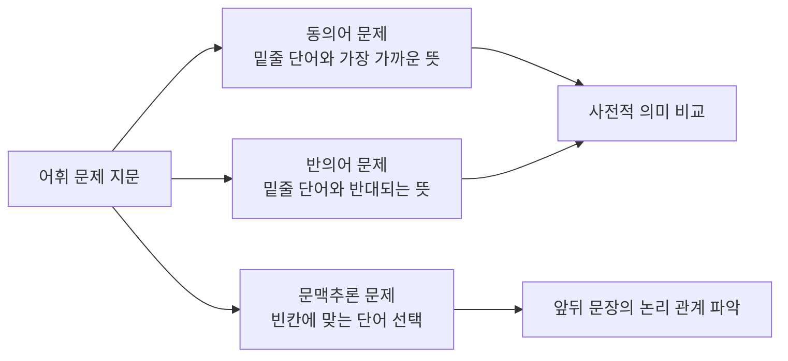

## 왜 단어 뜻만 외우면 안 되는가

어휘 문제집을 펼쳐 놓고 영단어와 한국어 뜻을 1대1로 외우는 방식은 얼핏 효율적으로 보이지만, 실용영어 시험에서는 오히려 함정에 빠지기 쉽다. 시험 문제는 단어 하나를 뚝 떼어 묻지 않고, 반드시 **문장 속 문맥**에서 그 단어가 어떤 의미로 쓰였는지를 묻기 때문이다.

첫째 생활·비즈니스에서 자주 쓰이는 실용 어휘, 둘째 빈출 구동사, 셋째 관용적 숙어(idiom)와 콜로케이션(collocation, 단어끼리 짝을 이루는 관용적 조합), 넷째 이 어휘들이 시험에서 어떻게 문제로 바뀌는지(동의어·반의어·문맥추론)다. 실제 풀이 절차와 오답 패턴은 05편에서 이어서 다룬다.

## 실전 텍스트로 어휘 만나기 — 사내 공지 이메일

아래는 이 문서를 위해 새로 작성한 가상의 사내 공지 이메일이다. 실제 시험이나 교재의 지문이 아니라, 이번 편에서 다룰 어휘를 자연스러운 문맥 속에 담기 위해 새로 만든 예시다.

> Subject: Office Relocation Notice
>
> Dear Staff,
>
> We are writing to notify you that our office will be relocated to the 5th floor starting next Monday. Please go through your desk drawers and set aside any personal items before Friday. The moving company will take care of all office furniture and equipment.
>
> During the transition, some of you may have to deal with temporary internet outages. We apologize for any inconvenience this may cause. If you come across any issue during the move, please do not hesitate to reach out to the facilities team.
>
> We look forward to settling into the new space together.
>
> Best regards,
> Facilities Team

이 짧은 이메일 안에만 구동사 다섯 개(go through, set aside, take care of, deal with, come across, reach out to)와 비즈니스 실용 표현(relocate, transition, inconvenience)이 자연스럽게 들어 있다. 시험에 나오는 어휘·구동사 문제의 상당수가 바로 이런 실용 텍스트(공지·이메일·안내문)에서 출제되므로, 단어를 따로 외우기보다 이런 문맥 속에서 그 쓰임을 익히는 것이 훨씬 오래 남는다.

## 생활·비즈니스 실용 어휘

실용영어에서 자주 나오는 어휘는 학술적이거나 문학적인 단어가 아니라, 회사·공공기관·일상생활에서 실제로 쓰이는 실용적 단어다. 아래 표는 위 이메일에 등장한 단어를 포함해 빈출 어휘를 정리한 것이며, 뜻만 나열하지 않고 각 단어가 실제로 쓰이는 예문을 함께 붙였다.

| 단어 | 뜻 | 예문(해석) |
|---|---|---|
| relocate | 이전하다, 재배치하다 | The headquarters will relocate to a new building next year. (본사는 내년에 새 건물로 이전할 것이다.) |
| transition | 전환, 이행 | The company is going through a transition to remote work. (그 회사는 원격 근무로의 전환을 겪고 있다.) |
| inconvenience | 불편 | We apologize for the inconvenience caused by the delay. (지연으로 인한 불편에 대해 사과드립니다.) |
| notify | 알리다, 통보하다 | Employees will be notified of the schedule change by email. (직원들은 이메일로 일정 변경을 통보받을 것이다.) |
| facilities | 시설, 편의 설비 | The building offers excellent facilities for conferences. (그 건물은 회의를 위한 훌륭한 시설을 갖추고 있다.) |
| outage | (전력·서비스 등의) 중단 | A power outage delayed the morning meeting. (정전이 아침 회의를 지연시켰다.) |

**자주 틀리는 점**: inconvenience와 discomfort를 혼동하는 경우가 많다. inconvenience는 "일이 번거로워지는 불편"을, discomfort는 "몸이나 마음이 불편한 상태"를 가리킨다는 차이를 놓치면 문맥추론 문제에서 오답을 고르기 쉽다.

## 빈출 구동사(phrasal verb)

구동사는 동사와 전치사·부사가 결합해 원래 동사의 뜻과 전혀 다른 새로운 의미를 만든다. 이 때문에 구동사는 "동사만 알면 뜻을 짐작할 수 있다"는 생각이 가장 위험하게 작용하는 영역이다. 위 이메일에 등장한 구동사를 포함해 실용영어에서 자주 나오는 구동사를 정리하면 다음과 같다.

| 구동사 | 뜻 | 예문(해석) |
|---|---|---|
| go through | (서류·물건 등을) 살펴보다, 겪다 | Please go through the contract before signing it. (서명하기 전에 계약서를 살펴보세요.) |
| set aside | 따로 떼어 두다 | I set aside some time to review the report. (나는 그 보고서를 검토할 시간을 따로 떼어 두었다.) |
| take care of | 처리하다, 돌보다 | The assistant will take care of the travel arrangements. (그 비서가 출장 준비를 처리할 것이다.) |
| deal with | 처리하다, 다루다 | The manager has to deal with several complaints today. (관리자는 오늘 몇 건의 불만을 처리해야 한다.) |
| come across | 우연히 발견하다, 마주치다 | She came across an old email while cleaning her inbox. (그녀는 받은편지함을 정리하다가 오래된 이메일을 우연히 발견했다.) |
| reach out to | 연락을 취하다 | Feel free to reach out to us if you have any questions. (질문이 있으면 언제든 저희에게 연락 주세요.) |
| put off | 미루다, 연기하다 | They decided to put off the meeting until next week. (그들은 회의를 다음 주로 미루기로 했다.) |
| carry out | 수행하다, 실행하다 | The team carried out the plan without any delay. (그 팀은 지체 없이 계획을 수행했다.) |

**자주 틀리는 점**: put off(미루다)와 put up with(참다)처럼 동사는 같은데 뒤에 붙는 전치사에 따라 뜻이 완전히 달라지는 구동사 쌍을 혼동하는 경우가 많다. 전치사 하나가 곧 의미 전체를 바꾼다는 점을 반드시 기억해야 한다.

## 관용적 숙어(idiom)와 콜로케이션(collocation)

숙어(idiom)는 단어 각각의 뜻을 합쳐도 전체 의미가 나오지 않는 관용 표현이고, 콜로케이션(collocation)은 문법적으로는 자유롭게 조합 가능해 보이지만 실제로는 특정 단어끼리만 짝을 이뤄 쓰이는 관습적 결합이다. 예를 들어 "강한 비"는 영어로 heavy rain이라고 하지 strong rain이라고 하지 않는데, 이는 heavy와 rain이 굳어진 콜로케이션이기 때문이다.

| 표현 | 유형 | 뜻 | 예문(해석) |
|---|---|---|---|
| under the weather | 숙어 | 몸이 좀 안 좋은 | I am feeling a bit under the weather today. (나는 오늘 몸이 좀 안 좋다.) |
| on the same page | 숙어 | 같은 생각인, 의견이 일치하는 | Let us make sure we are on the same page before the meeting. (회의 전에 우리 의견이 일치하는지 확인합시다.) |
| make a decision | 콜로케이션 | 결정을 내리다 | The board will make a decision by Friday. (이사회는 금요일까지 결정을 내릴 것이다.) |
| heavy traffic | 콜로케이션 | 심한 교통 체증 | We were late because of heavy traffic. (우리는 심한 교통 체증 때문에 늦었다.) |
| pay attention to | 콜로케이션 | 무언가에 주의를 기울이다 | Please pay attention to the safety instructions. (안전 수칙에 주의를 기울여 주세요.) |

**자주 틀리는 점**: make a decision을 do a decision으로, pay attention을 give attention으로 잘못 조합하는 오류가 흔하다. 콜로케이션은 문법 규칙이 아니라 관습이므로, 뜻이 아니라 **짝지어 쓰이는 동사** 자체를 함께 외워야 한다.

## 문맥 속 어휘 문제 유형 미리 보기

04편의 어휘를 시험 문제로 바꾸면 크게 세 가지 유형이 된다. 첫째는 밑줄 친 단어와 뜻이 가장 가까운 것을 고르는 **동의어(synonym) 문제**, 둘째는 밑줄 친 단어와 뜻이 반대인 것을 고르는 **반의어(antonym) 문제**, 셋째는 문맥 전체를 읽고 빈칸에 들어갈 가장 알맞은 단어를 고르는 **문맥추론(context inference) 문제**다.

동의어·반의어 문제는 단어 자체의 사전적 의미를 비교하면 풀리지만, 문맥추론 문제는 그 단어가 없어도 앞뒤 문장의 논리 흐름(원인·결과, 대비 등)을 먼저 파악해야 정답을 좁힐 수 있다. 이 추론 절차와 실제 풀이 전략은 05편에서 단계별로 다룬다.

## 핵심 정리

- 어휘는 단어와 뜻을 1대1로 외우지 말고, 실용 텍스트(이메일·공지·광고) 속 문맥과 함께 익힌다.
- 구동사는 전치사·부사 하나만 바뀌어도 뜻이 완전히 달라지므로 조합 전체를 하나의 단어처럼 외운다.
- 숙어는 단어 뜻의 합이 아니라 관용적 의미로, 콜로케이션은 짝지어 쓰이는 동사 자체로 외운다.
- 어휘 문제는 동의어·반의어·문맥추론 세 유형으로 나뉘며, 문맥추론은 단어보다 앞뒤 문장의 논리 관계 파악이 우선이다.
- inconvenience/discomfort, put off/put up with처럼 형태가 비슷하거나 전치사만 다른 표현의 의미 차이를 특히 주의한다.

## 마무리 복습

<Quiz
  questionNumber={1}
  question={"다음 중 예시 이메일에 나온 go through의 의미로 가장 적절한 것은?"}
  options={["따로 떼어 두다","살펴보다","연락을 취하다","우연히 발견하다"]}
  correctAnswer={2}
  explanation={"예시 이메일의 go through your desk drawers는 서랍을 살펴본다는 뜻으로 쓰였다. go through는 서류나 물건을 살펴본다는 뜻의 구동사다."}
/>

<Quiz
  questionNumber={2}
  question={"구동사 put off와 뜻이 가장 가까운 것은?"}
  options={["postpone","endure","discover","contact"]}
  correctAnswer={1}
  explanation={"put off는 일정을 미룬다는 뜻으로 postpone(연기하다)과 의미가 가장 가깝다."}
/>

<Quiz
  questionNumber={3}
  question={"다음 중 콜로케이션이 잘못 짝지어진 것은?"}
  options={["make a decision","heavy traffic","do a decision","pay attention to"]}
  correctAnswer={3}
  explanation={"decision과 짝을 이루는 동사는 make이며, do a decision은 관습적으로 쓰이지 않는 잘못된 조합이다."}
/>

## 참고 자료

- [Cambridge Dictionary](https://dictionary.cambridge.org)
- [Merriam-Webster](https://www.merriam-webster.com)
