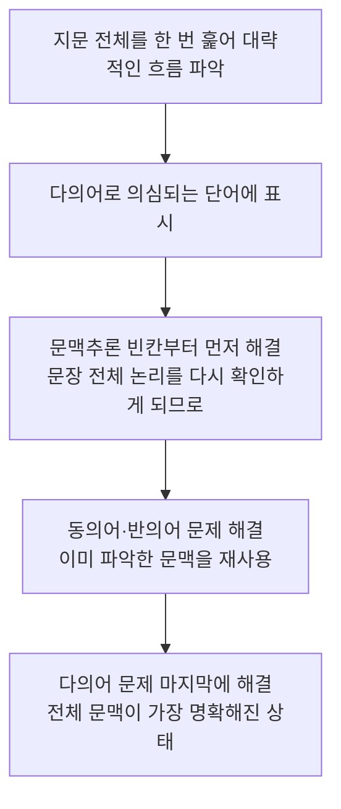

## 04편의 지식을 "문제 푸는 절차"로 바꾸기

04편에서 생활·비즈니스 어휘, 구동사, 숙어·콜로케이션을 문맥 속에서 익혔다면, 05편은 그 지식을 실제 시험 문항에 적용하는 절차를 세우는 자리다. 02편에서 다진 논리 독해 기본(연결사·담화 표지 읽기)이 바로 이 절차의 바탕이 된다.

첫째 동의어·반의어 선택 문제의 풀이 절차, 둘째 문맥추론·어휘 빈칸 문제의 풀이 절차, 셋째 다의어(polysemous word, 하나의 형태가 여러 관련된 뜻을 갖는 단어)와 구동사를 구분하는 절차, 넷째 이 모든 유형이 한 지문 안에 섞여 나오는 통합 세트 문제의 풀이 절차다.

## 실전 텍스트로 훈련하기 — 어학원 광고

아래는 이 문서를 위해 새로 작성한 가상의 어학원 광고문이다. 이번 편에서 다룰 다의어와 어휘 문제를 자연스러운 광고 문맥 속에 담기 위해 새로 만든 지문이다.

> Sunrise Language Institute — Register Now!
>
> Are you ready to take your English to the next level? Our new intensive course will run for eight weeks, starting this March. Each class is led by native instructors who charge students with confidence rather than fear.
>
> Seats are limited, so please book your spot early. Students who address their weak points early tend to see the fastest improvement. We also offer a free trial lesson so you can address any concerns before you commit.
>
> Call us today, or visit our website to reserve your place.

이 광고에는 다의어(polysemous word)가 세 개 숨어 있다. charge는 "요금을 청구하다"라는 뜻으로 흔히 쓰이지만 이 문맥에서는 "(감정·에너지를) 채우다, 북돋우다"에 가까운 뜻으로 쓰였다. book은 명사로 "책"을 뜻하지만 동사로는 "예약하다"라는 뜻이며, 이 광고에서는 동사로 쓰였다. address 역시 명사로는 "주소"지만 동사로는 "다루다, 해결하다"라는 전혀 다른 뜻으로 두 번이나 쓰였다.

## 다의어(polysemous word)와 구동사 구분하기

다의어 문제는 같은 단어라도 **문장 안에서의 품사와 위치**를 먼저 확인해야 풀린다. book이 관사(a, the) 뒤에 오면 명사 "책"일 가능성이 크지만, 목적어를 바로 이끌면(book your spot처럼) 동사 "예약하다"로 쓰인 것이다. 아래 표로 위 광고에 나온 다의어를 정리한다.

| 단어 | 뜻 1 | 뜻 2 | 구분 단서 | 예문(해석) |
|---|---|---|---|---|
| book | 책(명사) | 예약하다(동사) | 뒤에 목적어가 오면 동사 | Please book your spot early. (자리를 일찍 예약하세요.) |
| address | 주소(명사) | 다루다·해결하다(동사) | 주어 바로 뒤, 목적어가 있으면 동사 | Students who address their weak points improve fast. (약점을 다루는 학생들은 빠르게 향상된다.) |
| charge | 요금을 청구하다 | (에너지·감정을) 채우다 | 뒤에 with가 오면 무언가로 채우다는 뜻 | Instructors charge students with confidence. (강사들은 학생들에게 자신감을 채워 준다.) |

구동사와 다의어를 구분하는 기준도 비슷하다. 구동사는 동사와 전치사·부사가 **하나의 의미 단위**로 붙어 다니므로, 두 단어를 분리해서 사전을 찾으면 뜻이 나오지 않는다. 반면 다의어는 단어 하나가 문장 안 위치나 품사에 따라 뜻이 바뀌는 경우이므로, 그 단어 하나만 사전에서 찾아도 여러 뜻 중 하나로 확인할 수 있다.

**자주 틀리는 점**: address가 명사로 익숙하다 보니 동사로 쓰인 문장에서도 "주소"로 해석해 문장 전체가 이상해지는데도 억지로 끼워 맞추는 오류가 흔하다. 해석이 자연스럽지 않으면 그 단어의 다른 품사·다른 뜻을 의심해야 한다.

## 동의어·반의어 선택 문제 풀이 절차

동의어·반의어 문제는 아래 순서로 풀면 오답을 크게 줄일 수 있다.

예를 들어 "Instructors charge students with confidence."에서 charge와 의미가 가장 가까운 것을 고르는 문제라면, 1단계에서 charge가 동사이고 뒤에 "students with confidence"라는 목적어+전치사구가 붙어 있음을 확인한다. 2단계에서 "학생들에게 자신감을 채워 준다"는 문맥을 확정한다.

## 문맥추론·어휘 빈칸 문제 풀이 절차

빈칸 문제는 동의어 문제와 달리 밑줄 친 단어 자체가 없으므로, 앞뒤 문장의 논리 관계에서 힌트를 찾아야 한다. 절차는 다음과 같다.

위 광고에서 "We also offer a free trial lesson so you can _____ any concerns before you commit."이라는 문장이 있다고 가정하자. 1단계에서 so(그래서)는 결과를 나타내는 연결사이므로, 앞의 "무료 체험 수업 제공"이 원인, 빈칸이 그 결과라는 관계를 파악한다.

## 어휘·숙어 통합 세트 문제 풀이 절차

실제 시험에서는 한 지문 안에 동의어·반의어·문맥추론·다의어 문제가 세트로 묶여 나오는 경우가 많다. 이런 통합 세트는 문제를 순서대로 풀기보다, 아래 순서로 접근하는 것이 효율적이다.

문맥추론 빈칸 문제를 먼저 푸는 이유는, 이 유형을 풀면서 지문 전체의 논리 흐름을 다시 한번 확인하게 되고, 그 과정에서 얻은 문맥 이해가 뒤이어 나오는 동의어·반의어·다의어 문제에도 그대로 재사용되기 때문이다. 반대로 다의어 문제부터 풀면 아직 문맥 파악이 끝나지 않은 상태라 품사 판단에서 실수하기 쉽다.

**자주 틀리는 점**: 세트 문제에서 앞 문항의 오답 보기가 뒤 문항의 정답처럼 보이도록 설계된 경우가 있다. 문항마다 독립적으로 판단하지 않고 "방금 그 단어와 비슷하니까 이것도 맞겠지"라고 넘겨짚으면 연쇄적으로 틀리게 된다.

## 핵심 정리

- 동의어·반의어 문제는 품사 확인 → 문맥 의미 확정 → 보기 비교 → 대입 재확인의 4단계로 푼다.
- 문맥추론 빈칸 문제는 단어보다 앞뒤 문장의 논리 관계(연결사)를 먼저 읽는다.
- 다의어는 문장 내 위치와 품사로, 구동사는 두 단어가 하나의 의미 단위로 붙어 다니는지로 구분한다.
- 통합 세트 문제는 문맥추론 → 동의어·반의어 → 다의어 순서로 풀면 문맥 이해를 재사용할 수 있어 효율적이다.
- 세트 문제의 각 문항은 독립적으로 판단하고, 앞 문항의 인상만으로 뒤 문항을 넘겨짚지 않는다.

## 마무리 복습

<Quiz
  questionNumber={1}
  question={"다음 문장에서 book의 품사와 뜻으로 가장 적절한 것은? Please book your spot early."}
  options={["명사, 책","동사, 예약하다","형용사, 도서의","부사, 정기적으로"]}
  correctAnswer={2}
  explanation={"book 뒤에 목적어 your spot이 바로 이어지므로 book은 동사이며, 문맥상 예약하다는 뜻으로 쓰였다."}
/>

<Quiz
  questionNumber={2}
  question={"다음 문장에서 밑줄 친 charge와 의미가 가장 가까운 것은? Instructors charge students with confidence."}
  options={["bill","fill","attack","accuse"]}
  correctAnswer={2}
  explanation={"이 문맥에서 charge는 청구하다가 아니라 채우다는 뜻으로 쓰였으므로 fill이 의미상 가장 가깝다."}
/>

<Quiz
  questionNumber={3}
  question={"동의어 선택 문제를 풀 때 가장 마지막에 해야 할 확인 절차는?"}
  options={["밑줄 단어의 품사를 확인한다.","문맥 속 실제 의미를 확정한다.","고른 보기를 원래 문장에 대입해 자연스러운지 확인한다.","사전에서 첫 번째로 나오는 뜻을 무조건 선택한다."]}
  correctAnswer={3}
  explanation={"이 편에서 제시한 4단계 절차의 마지막은 고른 보기를 원래 문장에 대입해 자연스러운지 재확인하는 단계다."}
/>

## 참고 자료

- [Cambridge Dictionary](https://dictionary.cambridge.org)
- [Merriam-Webster](https://www.merriam-webster.com)
