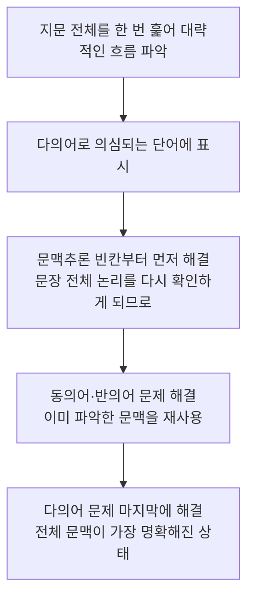

<Callout type="info">
  **이번 문서의 목표:** 이 파일을 다 읽으면 07편에서 익힌 어휘·구동사·숙어를 동의어·반의어·문맥추론·다의어 문제에 실제로 적용하고, 통합 세트 문제를 정해진 절차대로 풀 수 있다.
</Callout>

## 07편의 지식을 "문제 푸는 절차"로 바꾸기

07편에서 생활·비즈니스 어휘, 구동사, 숙어·콜로케이션을 문맥 속에서 익혔다면, 08편은 그 지식을 실제 시험 문항에 적용하는 절차를 세우는 자리다. 많은 학습자가 단어 뜻은 다 아는데도 문제를 틀리는 이유는, 문제 유형마다 요구하는 사고 절차가 다르다는 것을 모르고 "일단 아는 단어부터 찾는" 방식으로 접근하기 때문이다. 04편에서 다진 논리 독해 기본(연결사·담화 표지 읽기)이 바로 이 절차의 바탕이 된다.

> **쉽게 말하면:** 이 편은 단어를 몰라서가 아니라 풀이 순서를 몰라서 틀리는 실수를 없애는 자리다.

이번 편에서는 네 가지를 순서대로 다룬다. 첫째 동의어·반의어 선택 문제의 풀이 절차, 둘째 문맥추론·어휘 빈칸 문제의 풀이 절차, 셋째 다의어(polysemous word, 하나의 형태가 여러 관련된 뜻을 갖는 단어)와 구동사를 구분하는 절차, 넷째 이 모든 유형이 한 지문 안에 섞여 나오는 통합 세트 문제의 풀이 절차다.

## 실전 텍스트로 훈련하기 — 어학원 광고

아래는 이 문서를 위해 새로 작성한 가상의 어학원 광고문이다. 이번 편에서 다룰 다의어와 어휘 문제를 자연스러운 광고 문맥 속에 담기 위해 새로 만든 지문이다.

> Sunrise Language Institute — Register Now!
> 
> Are you ready to take your English to the next level? Our new intensive course will run for eight weeks, starting this March. Each class is led by native instructors who charge students with confidence rather than fear.
> 
> Seats are limited, so please book your spot early. Students who address their weak points early tend to see the fastest improvement. We also offer a free trial lesson so you can address any concerns before you commit.
> 
> Call us today, or visit our website to reserve your place.

이 광고에는 다의어(polysemous word)가 세 개 숨어 있다. charge는 "요금을 청구하다"라는 뜻으로 흔히 쓰이지만 이 문맥에서는 "(감정·에너지를) 채우다, 북돋우다"에 가까운 뜻으로 쓰였다. book은 명사로 "책"을 뜻하지만 동사로는 "예약하다"라는 뜻이며, 이 광고에서는 동사로 쓰였다. address 역시 명사로는 "주소"지만 동사로는 "다루다, 해결하다"라는 전혀 다른 뜻으로 두 번이나 쓰였다.

## 다의어(polysemous word)와 구동사 구분하기

다의어 문제는 같은 단어라도 **문장 안에서의 품사와 위치**를 먼저 확인해야 풀린다. book이 관사(a, the) 뒤에 오면 명사 "책"일 가능성이 크지만, 목적어를 바로 이끌면(book your spot처럼) 동사 "예약하다"로 쓰인 것이다. 아래 표로 위 광고에 나온 다의어를 정리한다.

| 단어 | 뜻 1 | 뜻 2 | 구분 단서 | 예문(해석) |
|---|---|---|---|---|
| book | 책(명사) | 예약하다(동사) | 뒤에 목적어가 오면 동사 | Please book your spot early. (자리를 일찍 예약하세요.) |
| address | 주소(명사) | 다루다·해결하다(동사) | 주어 바로 뒤, 목적어가 있으면 동사 | Students who address their weak points improve fast. (약점을 다루는 학생들은 빠르게 향상된다.) |
| charge | 요금을 청구하다 | (에너지·감정을) 채우다 | 뒤에 with가 오면 무언가로 채우다는 뜻 | Instructors charge students with confidence. (강사들은 학생들에게 자신감을 채워 준다.) |

구동사와 다의어를 구분하는 기준도 비슷하다. 구동사는 동사와 전치사·부사가 **하나의 의미 단위**로 붙어 다니므로, 두 단어를 분리해서 사전을 찾으면 뜻이 나오지 않는다. 반면 다의어는 단어 하나가 문장 안 위치나 품사에 따라 뜻이 바뀌는 경우이므로, 그 단어 하나만 사전에서 찾아도 여러 뜻 중 하나로 확인할 수 있다.

**자주 틀리는 점**: address가 명사로 익숙하다 보니 동사로 쓰인 문장에서도 "주소"로 해석해 문장 전체가 이상해지는데도 억지로 끼워 맞추는 오류가 흔하다. 해석이 자연스럽지 않으면 그 단어의 다른 품사·다른 뜻을 의심해야 한다.

## 동의어·반의어 선택 문제 풀이 절차

동의어·반의어 문제는 아래 순서로 풀면 오답을 크게 줄일 수 있다.

<Steps>

### 1단계 — 밑줄 친 단어의 품사와 문장 내 역할 확인

먼저 그 단어가 문장에서 동사인지 명사인지, 목적어를 취하는지부터 확인한다. 품사를 잘못 판단하면 애초에 비교 대상 자체가 틀어진다.

### 2단계 — 문맥 속에서의 실제 의미 확정

사전에 나온 여러 뜻 중 이 문장에서는 어떤 뜻으로 쓰였는지 확정한다. 위 광고의 charge는 사전 첫 번째 뜻(청구하다)이 아니라 문맥상 "채우다"에 가까운 뜻으로 쓰였다는 점이 좋은 예다.

### 3단계 — 보기 네 개를 확정한 의미와 비교

보기 중 확정한 의미와 가장 가까운(또는 반대되는) 단어를 고른다. 이때 보기 중 "밑줄 단어의 다른 뜻"과 헷갈리도록 설계된 오답이 섞여 있는 경우가 많으므로 주의한다.

### 4단계 — 대입해서 자연스러운지 재확인

고른 보기를 원래 문장의 밑줄 자리에 대입해 읽었을 때 의미가 자연스러운지 마지막으로 확인한다.

</Steps>

예를 들어 "Instructors charge students with confidence."에서 charge와 의미가 가장 가까운 것을 고르는 문제라면, 1단계에서 charge가 동사이고 뒤에 "students with confidence"라는 목적어+전치사구가 붙어 있음을 확인한다. 2단계에서 "학생들에게 자신감을 채워 준다"는 문맥을 확정한다. 3단계에서 보기 중 fill(채우다), bill(청구하다), attack(공격하다), accuse(비난하다) 중 fill을 고른다. 4단계에서 "Instructors fill students with confidence(강사들은 학생들에게 자신감을 채워 준다)"로 바꿔 읽어도 자연스러우므로 정답으로 확정한다.

## 문맥추론·어휘 빈칸 문제 풀이 절차

빈칸 문제는 동의어 문제와 달리 밑줄 친 단어 자체가 없으므로, 앞뒤 문장의 논리 관계에서 힌트를 찾아야 한다. 절차는 다음과 같다.

<Steps>

### 1단계 — 빈칸 앞뒤 문장의 논리 관계 파악

빈칸 앞뒤가 원인–결과 관계인지, 대조 관계인지, 예시 관계인지를 먼저 살핀다. 04편에서 다룬 연결사(however, therefore, for example 등)가 있으면 결정적 단서가 된다.

### 2단계 — 빈칸에 들어갈 단어의 성격(품사·긍정/부정) 예측

문장 구조상 명사가 필요한지 동사가 필요한지, 그리고 문맥상 긍정적 의미인지 부정적 의미인지를 먼저 좁힌다.

### 3단계 — 보기를 대입해 논리적으로 가장 자연스러운 것 선택

예측한 성격에 맞는 보기를 우선 검토하고, 나머지는 소거한다.

</Steps>

위 광고에서 "We also offer a free trial lesson so you can _____ any concerns before you commit."이라는 문장이 있다고 가정하자. 1단계에서 so(그래서)는 결과를 나타내는 연결사이므로, 앞의 "무료 체험 수업 제공"이 원인, 빈칸이 그 결과라는 관계를 파악한다. 2단계에서 concerns(우려)를 목적어로 취하는 동사가 필요하고, "수업을 듣기 전에 우려를 ___할 수 있다"는 맥락상 부정적 감정을 해소하는 쪽의 동사가 와야 한다고 예측한다. 3단계에서 보기 중 address(다루다·해소하다)가 가장 자연스럽고, ignore(무시하다)는 문맥과 반대이므로 소거한다. 정답은 address이며, "체험 수업을 통해 등록 전에 우려를 해소할 수 있다"는 자연스러운 문장이 된다.

## 어휘·숙어 통합 세트 문제 풀이 절차

실제 시험에서는 한 지문 안에 동의어·반의어·문맥추론·다의어 문제가 세트로 묶여 나오는 경우가 많다. 이런 통합 세트는 문제를 순서대로 풀기보다, 아래 순서로 접근하는 것이 효율적이다.

문맥추론 빈칸 문제를 먼저 푸는 이유는, 이 유형을 풀면서 지문 전체의 논리 흐름을 다시 한번 확인하게 되고, 그 과정에서 얻은 문맥 이해가 뒤이어 나오는 동의어·반의어·다의어 문제에도 그대로 재사용되기 때문이다. 반대로 다의어 문제부터 풀면 아직 문맥 파악이 끝나지 않은 상태라 품사 판단에서 실수하기 쉽다.

**자주 틀리는 점**: 세트 문제에서 앞 문항의 오답 보기가 뒤 문항의 정답처럼 보이도록 설계된 경우가 있다. 문항마다 독립적으로 판단하지 않고 "방금 그 단어와 비슷하니까 이것도 맞겠지"라고 넘겨짚으면 연쇄적으로 틀리게 된다.

## 핵심 정리

- 동의어·반의어 문제는 품사 확인 → 문맥 의미 확정 → 보기 비교 → 대입 재확인의 4단계로 푼다.
- 문맥추론 빈칸 문제는 단어보다 앞뒤 문장의 논리 관계(연결사)를 먼저 읽는다.
- 다의어는 문장 내 위치와 품사로, 구동사는 두 단어가 하나의 의미 단위로 붙어 다니는지로 구분한다.
- 통합 세트 문제는 문맥추론 → 동의어·반의어 → 다의어 순서로 풀면 문맥 이해를 재사용할 수 있어 효율적이다.
- 세트 문제의 각 문항은 독립적으로 판단하고, 앞 문항의 인상만으로 뒤 문항을 넘겨짚지 않는다.

## 마무리 복습

<Quiz
  questionNumber={1}
  question="다음 문장에서 book의 품사와 뜻으로 가장 적절한 것은? Please book your spot early."
  options={['명사, 책', '동사, 예약하다', '형용사, 도서의', '부사, 정기적으로']}
  correctAnswer={2}
  explanation="book 뒤에 목적어 your spot이 바로 이어지므로 book은 동사이며, 문맥상 예약하다는 뜻으로 쓰였다."
  optionExplanations={['명사라면 뒤에 목적어가 바로 올 수 없다.', '목적어가 뒤따르는 동사로 예약하다는 뜻이 정확하다.', '형용사로 쓰였다면 명사를 수식해야 하지만 그런 구조가 아니다.', '부사로 쓰였다면 동사·형용사를 수식해야 하지만 그런 구조가 아니다.']}
/>

<Quiz
  questionNumber={2}
  question="다음 문장에서 밑줄 친 charge와 의미가 가장 가까운 것은? Instructors charge students with confidence."
  options={['bill', 'fill', 'attack', 'accuse']}
  correctAnswer={2}
  explanation="이 문맥에서 charge는 청구하다가 아니라 채우다는 뜻으로 쓰였으므로 fill이 의미상 가장 가깝다."
  optionExplanations={['bill은 요금을 청구하다는 뜻으로 이 문맥과 맞지 않는다.', 'fill은 채우다는 뜻으로 이 문맥의 charge와 의미가 가장 가깝다.', 'attack은 공격하다는 뜻으로 문맥과 관련이 없다.', 'accuse는 비난하다는 뜻으로 문맥과 관련이 없다.']}
/>

<Quiz
  questionNumber={3}
  question="동의어 선택 문제를 풀 때 가장 마지막에 해야 할 확인 절차는?"
  options={['밑줄 단어의 품사를 확인한다.', '문맥 속 실제 의미를 확정한다.', '고른 보기를 원래 문장에 대입해 자연스러운지 확인한다.', '사전에서 첫 번째로 나오는 뜻을 무조건 선택한다.']}
  correctAnswer={3}
  explanation="이 편에서 제시한 4단계 절차의 마지막은 고른 보기를 원래 문장에 대입해 자연스러운지 재확인하는 단계다."
  optionExplanations={['품사 확인은 1단계에 해당한다.', '문맥 의미 확정은 2단계에 해당한다.', '대입 재확인이 마지막 단계로 가장 적절하다.', '사전의 첫 번째 뜻이 항상 문맥에 맞는 것은 아니므로 이 방법은 위험하다.']}
/>

<Quiz
  questionNumber={4}
  question="다음 빈칸에 들어갈 가장 적절한 단어는? We offer a free trial lesson so you can _____ any concerns before you commit."
  options={['ignore', 'address', 'multiply', 'postpone']}
  correctAnswer={2}
  explanation="so(그래서)로 이어지는 결과절이며, 우려를 해소한다는 문맥상 address(다루다, 해소하다)가 가장 자연스럽다."
  optionExplanations={['ignore(무시하다)는 우려를 해소한다는 문맥과 반대된다.', 'address는 우려를 다루고 해소한다는 뜻으로 문맥과 정확히 맞는다.', 'multiply(늘리다)는 문맥과 관련이 없다.', 'postpone(미루다)은 우려 해소라는 목적과 맞지 않는다.']}
/>

<Quiz
  questionNumber={5}
  question="다의어와 구동사를 구분하는 기준으로 가장 적절한 것은?"
  options={['다의어는 항상 명사로만 쓰이고 구동사는 항상 동사로만 쓰인다.', '구동사는 두 단어가 하나의 의미 단위로 붙어 다녀 따로 찾으면 뜻이 나오지 않는다.', '다의어는 반드시 두 단어 이상으로 이루어져 있다.', '구동사는 문장 내 위치에 따라 품사가 자유롭게 바뀐다.']}
  correctAnswer={2}
  explanation="구동사는 동사와 전치사·부사가 결합해 하나의 의미 단위를 이루므로 각 단어를 따로 사전에서 찾으면 원래 뜻을 알 수 없다는 것이 핵심 구분 기준이다."
  optionExplanations={['다의어도 동사로 쓰이는 경우가 많으므로 이 설명은 옳지 않다.', '구동사가 하나의 의미 단위로 붙어 다닌다는 설명이 정확하다.', '다의어는 하나의 단어 형태가 여러 뜻을 갖는 것이므로 이 설명은 옳지 않다.', '구동사는 품사가 자유롭게 바뀌는 것이 아니라 고정된 의미 단위로 쓰인다.']}
/>

<Quiz
  questionNumber={6}
  question="통합 세트 문제를 풀 때 이 편에서 권장한 순서로 가장 적절한 것은?"
  options={['다의어 문제부터 풀고 문맥추론 문제는 마지막에 푼다.', '문맥추론 빈칸 문제를 먼저 풀어 문맥을 재확인한 뒤 동의어·반의어, 다의어 순으로 푼다.', '보기를 보지 않고 지문만 반복해서 읽는다.', '문항 번호와 상관없이 아는 단어가 나온 문제부터 무작위로 푼다.']}
  correctAnswer={2}
  explanation="문맥추론 빈칸 문제를 먼저 풀면서 지문 전체 논리를 재확인하고, 그 이해를 동의어·반의어·다의어 문제에 재사용하는 순서가 이 편에서 권장한 절차다."
  optionExplanations={['다의어를 먼저 풀면 문맥 파악이 부족해 품사 판단에서 실수하기 쉽다.', '문맥추론을 먼저 푸는 순서가 이 편의 권장 절차와 일치한다.', '지문만 반복해서 읽는 것은 구체적인 풀이 절차가 아니다.', '무작위로 푸는 방식은 문맥 이해를 재사용하지 못해 비효율적이다.']}
/>

<Quiz
  questionNumber={7}
  question="예시 광고문에서 address가 두 번 쓰였을 때의 공통된 의미로 가장 적절한 것은?"
  options={['우편으로 보내는 주소', '어떤 문제나 우려를 다루고 해결하다', '연설을 하다', '건물의 층수를 가리키다']}
  correctAnswer={2}
  explanation="광고문의 두 address는 모두 동사로 쓰여 학생의 약점이나 우려를 다루고 해결한다는 의미로 사용되었다."
  optionExplanations={['이 지문에서 address는 명사 주소의 뜻으로 쓰이지 않았다.', '동사로서 다루다·해결하다는 뜻이 두 문장 모두에 맞는다.', '연설하다는 뜻의 address와는 다른 문맥이다.', '층수를 가리키는 용법은 이 지문과 관련이 없다.']}
/>

<Quiz
  questionNumber={8}
  question="세트 문제를 풀 때 주의해야 할 함정으로 이 편에서 지적한 것은?"
  options={['모든 문항의 정답이 항상 같은 보기 번호에 몰려 있다.', '앞 문항의 오답 보기가 뒤 문항의 정답처럼 보이도록 설계된 경우가 있어 문항마다 독립적으로 판단해야 한다.', '세트 문제는 항상 동의어 문제로만 구성된다.', '세트 문제에서는 지문을 읽지 않고 보기만 비교해도 충분하다.']}
  correctAnswer={2}
  explanation="세트 문제에서는 앞 문항의 오답이 뒤 문항의 정답처럼 보이도록 설계될 수 있으므로, 각 문항을 독립적으로 판단해야 한다는 것이 이 편의 핵심 경고다."
  optionExplanations={['정답 번호의 분포에 대한 규칙은 존재하지 않는다.', '문항 간 함정에 대한 경고가 이 편의 설명과 정확히 일치한다.', '세트 문제는 동의어·반의어·문맥추론·다의어가 섞여 구성된다.', '지문을 읽지 않고 보기만 비교하는 방식은 이 편에서 권장하지 않는다.']}
/>

## 참고 자료

- [Cambridge Dictionary](https://dictionary.cambridge.org)
- [Merriam-Webster](https://www.merriam-webster.com)
