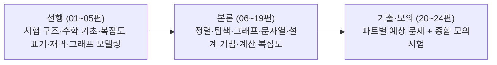

<Callout type="info">
  **이번 문서의 목표:** 이 문서를 다 읽으면 독학학위제(독학사) 4단계 종합시험이 어떤 제도이고 알고리즘 과목이 그 안에서 무엇을 요구하는지 설명할 수 있고, 앞으로 이 과목의 각 편을 읽을 때 "이 정도 깊이면 충분한가"를 스스로 판단할 수 있다.
</Callout>

## 왜 시험 구조부터 알아야 하는가

알고리즘이라는 과목은 대학 강의, 코딩 테스트, 자격증 시험, 독학사 시험에서 각각 요구하는 깊이와 형식이 다르다. 코딩 테스트는 "정답 코드를 빠르게 짜는 능력"을 보지만, 독학사는 학위 취득을 위한 국가시험이므로 "개념을 얼마나 정확히 이해하고 있는가"를 우선으로 본다. 같은 "퀵 정렬을 아는가"라는 질문도 코딩 테스트에서는 구현 코드를, 독학사에서는 파티션 과정을 손으로 추적하고 시간복잡도를 유도하는 능력을 묻는다.

이 편에서 시험의 성격과 범위를 먼저 정리해 두면, 뒤에 나오는 편들에서 "왜 이 정도까지 자세히 다루는지", "왜 특정 언어의 구현 코드는 다루지 않는지"를 매번 다시 설명하지 않아도 된다.

> **쉽게 말하면:** 이 편은 "무엇을, 얼마나 깊이, 어떤 형식으로 공부해야 하는가"에 대한 지도를 그리는 편이다.

## 독학학위제(독학사)란 무엇인가

**독학학위제**(獨學學位制, 흔히 "독학사"라고 줄여 부른다)는 대학에 다니지 않고 스스로 공부한 사람도 국가가 시행하는 시험에 합격하면 학사 학위를 받을 수 있게 하는 제도다. 관리·운영은 **국가평생교육진흥원**(National Institute for Lifelong Education, 평생학습을 지원하는 국가기관이며 독학학위제 시험의 출제·채점·공고를 담당한다)이 맡는다.

독학사는 학위 취득 과정을 4개의 단계로 나눈다.

| 단계 | 이름 | 성격 |
|------|------|------|
| 1단계 | 교양과정 인정시험 | 대학 교양과목 수준의 기초 과목(영어, 국어, 수학 등) |
| 2단계 | 전공기초과정 인정시험 | 전공의 기초가 되는 과목(자료구조, C프로그래밍, 컴퓨터구조 등) |
| 3단계 | 전공심화과정 인정시험 | 전공을 깊이 있게 다루는 과목(운영체제, 컴퓨터네트워크, 정보보호 등) |
| 4단계 | 학위취득 종합시험 | 전공 전체를 종합해 실력을 최종 평가하는 시험 |

4단계는 이름 그대로 **학위취득 종합시험**이다. 이 시험에 합격하면 그 전공의 학사 학위를 받는다. 그래서 4단계 시험은 1~3단계보다 한 단계 더 종합적인 이해와 응용력을 요구한다. 알고리즘 과목이 4단계에 배치되어 있다는 것은, 이 과목이 "처음 배우는 개념"이 아니라 "그동안 쌓은 프로그래밍·자료구조 지식을 바탕으로 문제 해결 능력을 검증하는 과목"이라는 뜻이다.

> **자주 틀리는 점:** 4단계라고 해서 무조건 1~3단계보다 문제가 복잡한 코드를 요구하는 것은 아니다. 오히려 4단계는 **개념 간의 연결과 응용 판단력**(예: "이 문제는 동적계획법으로 풀어야 하는가, 탐욕 알고리즘으로 풀어도 되는가")을 더 많이 묻는다. 단순 암기보다 "왜 그런지"를 설명할 수 있는 이해가 핵심이다.

## 4단계 종합시험에서 알고리즘 과목의 위치

4단계 학위취득 종합시험은 전공별로 여러 과목을 지정하고, 응시자는 그중 일정 과목을 선택해 시험을 본다. 컴퓨터과학·컴퓨터공학 계열 전공에서 **알고리즘**은 대표적인 4단계 지정 과목 중 하나다. 이 과목은 2단계의 자료구조, 3단계의 운영체제·컴퓨터네트워크 등에서 다룬 개별 자료구조·시스템 지식을 바탕으로, "문제를 어떻게 효율적으로 풀 것인가"라는 알고리즘 설계·분석 능력을 종합적으로 검증한다.

이 과목이 요구하는 선행 지식은 다음과 같다(자세한 범위는 학습 방향 문서를 따른다).

- 변수·제어문·함수·재귀 등 **프로그래밍 기초**
- 배열·스택·큐·연결리스트·트리·그래프 등 **자료구조 핵심 용어와 성질**

이미 알고 있다고 전제하는 지식이므로, 이 과목의 각 편에서는 이런 배경 지식을 처음부터 설명하지 않고 "자료구조 과목 몇 편 참고"처럼 짧게 안내만 하고 넘어간다. 반대로 이 과목에서 새로 요구하는 것은 **복잡도를 스스로 유도하는 능력, 정렬·탐색·그래프 알고리즘의 동작을 손으로 추적하는 능력, 문제 유형에 맞는 설계 기법을 고르는 판단력**이다.

## 알고리즘 과목 출제범위 — 무엇을 다루는가

국가평생교육진흥원이 공개하는 과목별 평가영역(출제기준)은 개정될 수 있으므로, 이 문서에서 정리하는 범위는 **최근 공개된 출제기준을 기준으로 한 것이며 실제 응시 전 반드시 최신 공고를 다시 확인해야 한다**(공고 확인 필요).

일반적으로 알고리즘 과목 출제범위는 다음 영역으로 구성된다.

<Steps>

### 알고리즘 기초와 복잡도 분석

알고리즘의 정의와 특성, 시간·공간 복잡도, 점근적 표기법(Big-O, Big-Ω, Big-Θ), 최악·평균·최선의 경우, 점화식과 재귀 알고리즘의 복잡도 분석. 이 과목 전체를 관통하는 "언어"이므로 출제 비중이 꾸준히 높다.

### 정렬과 탐색

선택·삽입·버블 정렬 같은 기본 정렬, 퀵·병합·힙·기수 정렬 같은 고급 정렬, 각 정렬의 안정성(stability)·제자리(in-place) 여부·복잡도 비교. 순차·이진 탐색, 해시를 이용한 탐색.

### 그래프 알고리즘

그래프의 표현(인접 행렬·인접 리스트), 깊이 우선 탐색(DFS)·너비 우선 탐색(BFS), 위상 정렬, 최소 신장 트리(프림·크루스칼), 최단경로(다익스트라·벨만-포드·플로이드-워셜).

### 알고리즘 설계 기법

분할정복(divide and conquer), 동적계획법(dynamic programming), 탐욕 알고리즘(greedy algorithm), 백트래킹(backtracking)과 분기한정(branch and bound). 각 기법이 언제 적합한지 판별하는 문제가 자주 나온다.

### 문자열 패턴 매칭

나이브(단순 비교) 문자열 검색, KMP(Knuth-Morris-Pratt) 알고리즘 수준까지의 문자열 패턴 매칭.

### 계산 복잡도 개요

결정 문제, P(다항시간에 풀 수 있는 문제)와 NP(다항시간에 검증할 수 있는 문제)의 정의, NP-완전(NP-complete)·NP-난해(NP-hard) 개념, 다항시간 환원(polynomial-time reduction)의 개요.

</Steps>

## 평가 수준 — "학문형 문항"이 많다

독학사는 국가시험이지만 자격증 시험과 성격이 다르다. 정보처리기사 같은 자격증 시험은 "실무에서 이 기능을 쓸 줄 아는가"를 주로 묻는 반면, 독학사는 대학 학위를 인정하는 시험이므로 **학문형 문항**(개념의 정의·원리·비교를 정확히 이해했는가를 묻는 문항)의 비중이 높다.

이 때문에 알고리즘 과목에서는 다음과 같은 유형의 문항이 자주 등장한다.

- **정의를 정확히 짝지었는지 묻는 문항**: "다음 설명 중 Big-O에 대한 설명으로 옳은 것은?"처럼, 비슷비슷한 개념(Big-O vs Big-Ω, 동적계획법 vs 탐욕 알고리즘, 스택 기반 DFS vs 큐 기반 BFS)의 **경계**를 정확히 짚어야 풀 수 있는 문항.
- **"옳지 않은 것을 고르시오" 유형**: 보기 4개 중 3개는 맞고 1개만 틀린 진술을 찾는 문항. 정의를 대강 알면 틀리기 쉽고, 각 보기를 하나씩 참/거짓으로 판정할 수 있어야 정확히 풀 수 있다.
- **계산·추적 문항**: 정렬 과정의 중간 상태, 그래프 탐색의 방문 순서, 점화식을 풀어 나온 복잡도 차수를 직접 구해야 하는 문항.
- **설계 기법 선택 문항**: 주어진 문제 설명을 보고 분할정복·동적계획법·탐욕 중 어느 기법이 적합한지, 혹은 왜 특정 기법이 적합하지 않은지를 판단하는 문항.

> **쉽게 말하면:** "정의를 외웠는가"보다 "개념과 개념 사이의 차이를 정확히 아는가"를 훨씬 많이 묻는다.

## 문항 유형 — 객관식이 중심이지만 서술형 대비 수준으로

독학사 4단계 종합시험은 과목과 회차에 따라 문항 형식이 다를 수 있다. 일반적으로 알고리즘 같은 이론 과목은 **객관식(4지선다)** 위주로 출제되지만, 과목에 따라 **주관식·서술형 문항이 함께 출제되는 경우**도 있으므로 정확한 문항 수·배점·시험 시간은 매 회차 공고를 확인해야 한다(공고 확인 필요).

문항 형식이 객관식이라 하더라도, 이 문서 시리즈에서는 **서술형 대비 수준의 깊이**로 학습할 것을 권장한다. 이유는 다음과 같다.

1. 객관식 문항이라도 "왜 그 보기가 틀렸는지"를 정확히 설명할 수 있어야 헷갈리는 함정 보기를 피할 수 있다.
2. 계산형 문항(복잡도 유도, 정렬 과정 추적)은 답을 구하는 **전 과정**을 이해하지 못하면 중간에 실수하기 쉽다.
3. 만약 서술형이 함께 출제되는 회차라면, 개념을 "글로 설명할 수 있는 수준"으로 알아 두어야 대응할 수 있다.

이런 이유로 이 시리즈의 각 편은 정의만 나열하지 않고, "왜 필요한가 → 정의 → 작은 예시로 손 계산 → 결과 해석 → 자주 틀리는 점" 순서로 서술형 답안을 쓰듯 풀어낸다.

## 이 시리즈의 학습 순서와 각 편의 역할

이 시리즈는 크게 세 부분으로 구성된다.

- **선행 편(01~05)**: 본론에 들어가기 전, 시험 자체의 구조(이 편)와 복잡도 분석·재귀·그래프 모델링에 필요한 공통 배경 지식을 정리한다. 이후 본론 편에서는 이 배경 지식을 매번 다시 설명하지 않고 곧바로 알고리즘 자체를 다룬다.
- **본론 편(06~19)**: 정렬 → 탐색 → 그래프 → 문자열 패턴 매칭 → 설계 기법 → 계산 복잡도 순으로, 출제기준의 핵심 주제를 하나씩 깊이 있게 다룬다.
- **기출·모의 편(20~24)**: 앞에서 배운 내용을 정렬·탐색, 그래프, 설계 기법, 계산 복잡도 네 영역으로 나눠 예상 문제를 풀고, 마지막에 실전 감각을 위한 모의 종합시험 1회분을 다룬다.

> **자주 틀리는 점:** "선행 편이니까 가볍게 읽어도 된다"고 생각하기 쉽지만, 02~04편(수학 기초·점근적 표기·점화식)은 이후 모든 본론 편에서 반복해서 쓰이는 "공용 언어"다. 여기서 헷갈리면 뒤의 모든 복잡도 계산이 흔들리므로, 선행 편도 본론 편과 같은 밀도로 학습해야 한다.

## 핵심 정리

- 독학사는 대학에 다니지 않고도 학사 학위를 받을 수 있는 국가시험이며, 1~4단계로 구성되고 알고리즘은 학위취득 종합시험인 4단계 지정 과목이다.
- 4단계는 프로그래밍 기초·자료구조 핵심 지식을 이미 안다고 전제하고, 그 위에서 알고리즘 설계·분석 능력을 종합적으로 검증한다.
- 출제범위는 크게 복잡도 분석, 정렬·탐색, 그래프 알고리즘, 설계 기법, 문자열 패턴 매칭, 계산 복잡도 개요로 나뉜다(최신 공고 확인 필요).
- 독학사는 학문형 문항 비중이 높아 정의·원리·비교를 정확히 아는 것이 암기보다 중요하며, 문항 형식(객관식·서술형 여부)은 회차 공고를 반드시 확인해야 한다.
- 이 시리즈는 선행(01~05) → 본론(06~19) → 기출·모의(20~24) 순으로 구성되며, 선행 편의 복잡도·재귀 개념이 본론 전체의 기반이 된다.

## 마무리 복습

<Quiz
  questionNumber={1}
  question="독학학위제(독학사)에 대한 설명으로 옳은 것은?"
  options={['대학 재학생만 응시할 수 있는 성적 인증 시험이다', '국가평생교육진흥원이 관리하며 대학에 다니지 않고도 학사 학위를 받을 수 있게 하는 제도다', '1단계부터 4단계까지 모두 같은 난이도의 과목을 반복해서 응시하는 시험이다', '민간 기관이 자율적으로 운영하는 자격증 시험이다']}
  correctAnswer={2}
  explanation="독학학위제는 국가평생교육진흥원이 관리·운영하는 국가시험으로, 대학에 다니지 않고 스스로 공부한 사람도 시험에 합격하면 학사 학위를 받을 수 있게 하는 제도다."
  optionExplanations={['대학 재학 여부와 무관하게 누구나 응시 자격 요건을 갖추면 응시할 수 있는 제도다.', '정답. 국가평생교육진흥원이 관리하는 학위 취득 국가시험이다.', '1단계 교양과정부터 4단계 학위취득 종합시험까지 단계별로 성격과 난이도가 다르다.', '독학학위제는 민간 기관이 아니라 국가평생교육진흥원이 운영하는 국가시험이다.']}
/>

<Quiz
  questionNumber={2}
  question="독학사 4단계(학위취득 종합시험)의 성격에 대한 설명으로 가장 적절한 것은?"
  options={['전공 지식을 처음 접하는 사람을 위한 입문 단계다', '전공기초 과목만 다루며 응용 문제는 나오지 않는다', '그동안 쌓은 전공 지식을 종합해 문제 해결 능력을 검증하는 마지막 단계다', '모든 과목이 실기 시험으로만 진행된다']}
  correctAnswer={3}
  explanation="4단계는 학위취득 종합시험으로, 1~3단계에서 쌓은 전공 지식을 종합해 최종적으로 실력을 검증하는 단계다. 알고리즘 과목도 프로그래밍 기초·자료구조 지식을 전제로 종합적인 설계·분석 능력을 묻는다."
  optionExplanations={['4단계는 입문 단계가 아니라 학습의 마지막 종합 단계다.', '4단계는 전공기초를 넘어 응용·종합 판단력을 요구하는 문항이 많다.', '정답. 4단계는 전공 전체를 종합해 검증하는 학위취득 종합시험이다.', '알고리즘 과목은 실기가 아니라 필기(객관식 중심) 시험으로 진행되는 것이 일반적이다.']}
/>

<Quiz
  questionNumber={3}
  question="이 시리즈에서 자료구조·프로그래밍 기초를 매 편마다 처음부터 다시 설명하지 않는 이유로 가장 적절한 것은?"
  options={['자료구조와 프로그래밍 기초는 시험 범위에 포함되지 않기 때문이다', '4단계 알고리즘 과목은 그런 지식을 이미 알고 있다고 전제하는 종합 과목이기 때문이다', '분량을 줄이기 위해 임의로 생략한 것이다', '자료구조 내용은 알고리즘과 관련이 전혀 없기 때문이다']}
  correctAnswer={2}
  explanation="4단계는 2단계(전공기초)에서 배운 자료구조, 프로그래밍 기초 지식을 이미 갖췄다고 전제하는 종합 단계이므로, 이 시리즈에서는 필요한 경우 간단히 요약하고 자세한 설명은 해당 편을 참고하도록 안내한다."
  optionExplanations={['범위에는 포함되지 않지만 이해를 위한 선행 지식으로 전제된다는 의미이지, 시험 범위 자체와는 다른 얘기다.', '정답. 4단계는 선행 지식을 이미 갖췄다고 전제하는 종합 과목이기 때문이다.', '분량 문제가 아니라 과목 성격상 선행 지식으로 전제하기 때문이다.', '트리·힙·그래프 표현처럼 자료구조와 알고리즘은 밀접하게 연결되어 있다.']}
/>

<Quiz
  questionNumber={4}
  question="독학사 알고리즘 과목에서 학문형 문항의 예시로 가장 적절한 것은?"
  options={['특정 프로그래밍 언어의 문법 오류를 찾는 문항', 'Big-O와 Big-Ω의 정의 차이를 근거로 옳은 설명을 고르는 문항', '특정 회사의 코딩 테스트 기출 문제를 그대로 복제한 문항', '키보드 단축키를 암기했는지 묻는 문항']}
  correctAnswer={2}
  explanation="학문형 문항은 개념의 정의·원리·비교를 정확히 이해했는지 묻는 문항이다. Big-O(상한)와 Big-Omega(하한)처럼 비슷해 보이지만 다른 개념의 경계를 정확히 짚어야 풀리는 문항이 대표적이다."
  optionExplanations={['특정 언어의 문법 오류 찾기는 프로그래밍 과목의 문항 유형에 가깝다.', '정답. 개념 간 정의·경계를 정확히 아는지 묻는 학문형 문항의 전형적인 예다.', '독학사는 실제 기출을 그대로 복제하지 않고 출제기준에 근거해 재구성한다.', '단축키 암기는 알고리즘 과목의 평가 목적과 관련이 없다.']}
/>

<Quiz
  questionNumber={5}
  question="이 시리즈가 객관식 중심 시험임에도 '서술형 대비 수준'으로 학습할 것을 권장하는 이유로 옳지 않은 것은?"
  options={['왜 특정 보기가 틀렸는지 설명할 수 있어야 함정 보기를 피할 수 있어서', '계산형 문항은 중간 과정을 이해해야 실수 없이 답을 구할 수 있어서', '회차에 따라 주관식·서술형이 함께 출제될 수도 있어서', '객관식 문제는 항상 서술형보다 배점이 낮으므로 서술형 대비가 더 중요해서']}
  correctAnswer={4}
  explanation="서술형 대비 깊이로 학습하는 이유는 함정 보기 판별, 계산 과정 이해, 회차별 문항 형식 변동 가능성 때문이다. 배점 비교는 이 시리즈가 제시하는 근거가 아니며, 실제 배점은 공고에 따라 다르므로 단정할 수 없다."
  optionExplanations={['옳은 이유다. 틀린 이유를 설명할 수 있어야 헷갈리는 보기를 피할 수 있다.', '옳은 이유다. 계산 과정을 모르면 중간에 실수하기 쉽다.', '옳은 이유다. 과목·회차에 따라 서술형이 포함될 수 있으므로 대비가 필요하다.', '정답. 배점 구조는 회차 공고에 따라 다르며, 이 시리즈가 제시한 근거가 아니다.']}
/>

<Quiz
  questionNumber={6}
  question="이 시리즈의 선행 편(01~05편)에 대한 설명으로 옳지 않은 것은?"
  options={['본론에서 반복적으로 쓰이는 공용 언어(수학 기초·복잡도 표기·재귀 분석)를 먼저 정리한다', '본론 편보다 낮은 밀도로 가볍게 훑고 넘어가도 무방하다', '05편은 그래프 용어 자체보다 문제를 그래프로 모델링하는 사고에 집중한다', '01편은 시험 구조와 출제기준을 정리해 이후 학습의 깊이 기준을 잡는다']}
  correctAnswer={2}
  explanation="선행 편의 복잡도·점화식 개념은 이후 모든 본론 편의 계산에 반복 사용되는 기반이므로, 가볍게 훑기보다 본론 편과 동일한 밀도로 학습해야 한다."
  optionExplanations={['옳은 설명이다. 02~04편이 이런 공용 언어 역할을 한다.', '정답. 선행 편도 본론 편과 같은 밀도로 학습해야 뒤의 계산이 흔들리지 않는다.', '옳은 설명이다. 05편은 그래프 용어 복습보다 모델링 사고에 집중한다.', '옳은 설명이다. 01편은 이후 학습의 깊이 기준을 잡는 역할을 한다.']}
/>

## 참고 자료

- [국가평생교육진흥원 독학학위제](https://bdes.nile.or.kr) — 독학학위제의 단계별 구조, 응시 자격, 과목별 평가영역(출제기준) 공고를 확인할 수 있는 공식 사이트. 실제 응시 전 최신 출제기준과 시험 시간·문항 수 공고를 반드시 재확인해야 한다.
