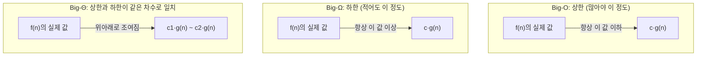

<Callout type="info">
  **이번 문서의 목표:** 이 문서를 다 읽으면 어떤 의사코드를 보고 최악·평균·최선의 경우를 구분해 반복 횟수를 시그마로 세울 수 있고, 그 결과를 Big-O·Big-Ω·Big-Θ 표기법으로 정확하게 옮길 수 있으며, 세 표기법의 정의 차이를 근거를 들어 설명할 수 있다.
</Callout>

## 왜 복잡도 분석이 알고리즘 과목의 뿌리인가

01편에서 이 과목은 "자료구조·프로그래밍 기초는 이미 안다"는 전제 위에서, "문제를 얼마나 효율적으로 푸는가"를 다룬다고 했다. 효율성을 비교하려면 "얼마나 빠른가"를 컴퓨터 성능이나 프로그래밍 언어에 관계없이 객관적으로 잴 수 있는 도구가 필요하다. 그 도구가 바로 **점근적 표기법**(asymptotic notation)이며, 02편에서 다진 로그·지수·시그마 계산이 이 도구를 다루는 재료가 된다.

06편부터 시작되는 정렬·탐색·그래프·설계 기법 편들은 전부 "이 알고리즘의 복잡도는 무엇인가"를 이 편에서 세운 절차로 계산한다. 이 편의 절차를 확실히 익혀 두지 않으면 뒤의 모든 계산이 흔들린다.

> **쉽게 말하면:** 이 편은 "어떤 알고리즘이 다른 알고리즘보다 얼마나 더 빠른지"를 공정하게 재는 자를 만드는 편이다.

## 시간복잡도와 공간복잡도 — 무엇을 재는가

알고리즘의 성능을 나타내는 지표는 크게 두 가지다.

- **시간복잡도**(time complexity): 입력 크기 `n`이 커질 때 실행에 필요한 **연산 횟수**가 어떤 비율로 늘어나는지를 나타낸다. 실제 초 단위 시간이 아니라 "연산이 몇 번 일어나는가"를 세는 것에 가깝다. 컴퓨터 성능이 다르면 같은 알고리즘도 걸리는 실제 시간(초)이 다르지만, 연산 횟수의 증가 비율은 컴퓨터와 무관하게 알고리즘 자체의 성질이기 때문이다.
- **공간복잡도**(space complexity): 입력 크기 `n`이 커질 때 알고리즘이 추가로 사용하는 **메모리량**이 어떤 비율로 늘어나는지를 나타낸다.

두 지표 모두 "정확한 숫자"가 아니라 "증가하는 추세"를 나타낸다는 공통점이 있다. 이 추세를 나타내는 표기법이 이 편의 핵심 주제인 Big-O, Big-Ω, Big-Θ다.

## 최악·평균·최선의 경우 — 같은 알고리즘도 입력에 따라 다르다

같은 알고리즘이라도 어떤 데이터가 입력으로 들어오느냐에 따라 연산 횟수가 달라질 수 있다. 이를 구분하는 세 시나리오는 다음과 같다.

- **최악의 경우**(worst case): 가장 운이 나쁜 입력이 들어왔을 때. 연산 횟수가 가장 많다.
- **평균의 경우**(average case): 있을 수 있는 모든 입력을 확률적으로 고려했을 때 기대되는 연산 횟수.
- **최선의 경우**(best case): 가장 운이 좋은 입력이 들어왔을 때. 연산 횟수가 가장 적다.

이 세 경우를 **삽입 정렬**(insertion sort, 현재 원소를 이미 정렬된 앞부분의 알맞은 위치에 끼워 넣는 정렬 방법이며 06편에서 의사코드까지 자세히 다룬다)의 비교 횟수로 직접 세어 보자. 크기 `n`인 배열을 삽입 정렬로 정렬한다고 하자.

| 상황 | 입력 상태 | 비교 횟수(직접 세어 유도) |
|------|-----------|---------------------------|
| 최선 | 배열이 이미 오름차순으로 정렬되어 있다 | 각 원소가 바로 앞 원소 하나와만 비교하고 멈추므로 `n-1`번 |
| 최악 | 배열이 내림차순(정반대)으로 정렬되어 있다 | `i`번째 원소가 이미 정렬된 앞부분 `i`개 전체와 비교해야 하므로 `1+2+⋯+(n-1) = n(n-1)/2`번 |
| 평균 | 원소들이 무작위 순서로 섞여 있다 | 각 원소가 정렬된 앞부분의 절반 정도와 비교한다고 가정하면 최악의 절반 수준인 약 `n(n-1)/4`번 |

최악의 경우 비교 횟수 `n(n-1)/2`는 02편에서 익힌 시그마 합 공식 `Σ(i=1 to n-1) i = n(n-1)/2`를 그대로 적용한 결과다. 이렇게 "몇 번 반복되는가"를 시그마로 세우고 합 공식으로 정리하는 절차가 이 편 전체에서 반복된다.

> **자주 틀리는 점:** 시험 문제에서 "이 알고리즘의 복잡도는 얼마인가"라고만 물으면 특별한 언급이 없는 한 **최악의 경우**를 기준으로 답해야 한다. 최선의 경우가 아무리 빨라도 그것이 전체 복잡도를 대표하지 않는다. "최악의 경우에도 이 정도 성능은 보장된다"는 것이 최악의 경우 복잡도가 갖는 실질적인 의미다.

## Big-O 표기법 — 상한을 나타내는 표기

**Big-O 표기법**(Big-O notation, "빅오"라고 읽는다)은 입력 크기 `n`이 충분히 커졌을 때 연산 횟수가 **많아야 이 정도 속도로 늘어난다**는 상한(upper bound)을 나타낸다. 형식적인 정의는 다음과 같다.

$$
f(n) = O(g(n)) \iff \exists\, c > 0,\ n_0 > 0 \text{ such that } f(n) \le c \cdot g(n) \text{ for all } n \ge n_0
$$

- $f(n)$: 실제로 분석하려는 함수(예: 정렬 알고리즘의 실제 비교 횟수).
- $g(n)$: 비교 기준이 되는 더 단순한 함수(예: `n²`).
- $\exists$ (존재한다, "있다"): 조건을 만족하는 값이 적어도 하나 있다는 뜻.
- $c$ (상수): $g(n)$에 곱해서 $f(n)$을 덮을 수 있게 만드는 배수. 값이 얼마인지는 중요하지 않고, 그런 값이 존재하기만 하면 된다.
- $n_0$: 이 부등식이 성립하기 시작하는 기준점. `n`이 작을 때는 안 맞아도 되고, `n`이 $n_0$보다 커지면 항상 성립해야 한다.

말로 풀면 "`n`이 어느 정도(≥ $n_0$) 이상 커지면, $f(n)$은 항상 $g(n)$에 어떤 상수 $c$를 곱한 값보다 작거나 같다"는 뜻이다. 즉 $g(n)$이 $f(n)$의 **성장 속도를 위에서 덮는 울타리** 역할을 한다.

### 반복 횟수를 직접 세어 Big-O를 유도하는 절차

정의를 외우기보다 실제로 유도하는 절차를 손에 익히는 것이 훨씬 실전적이다. 다음 의사코드로 연습해 보자.

```text
for i = 0 to n-1:
    for j = 0 to n-1:
        연산 1회 수행
```

<Steps>

### 반복 구조 파악

바깥 반복문 `i`가 `n`번 돌고, 그때마다 안쪽 반복문 `j`가 다시 `n`번 도는 이중 반복문이다.

### 시그마 식 세우기

바깥이 `n`번, 안쪽이 매번 `n`번이므로 전체 연산 횟수는 다음과 같다.

$$
\sum_{i=0}^{n-1} \sum_{j=0}^{n-1} 1 = \sum_{i=0}^{n-1} n = n \times n = n^2
$$

### 최고차항만 남기고 상수 지우기

이 식은 이미 `n²` 하나뿐이라 상수를 지울 것도 없다. 결과는 `O(n²)`이다.

</Steps>

이번에는 상수와 낮은 차수 항이 섞인 경우를 보자. 어떤 알고리즘의 실제 연산 횟수가 `f(n) = 3n² + 5n + 2`로 계산되었다고 하자.

$$
f(n) = 3n^2 + 5n + 2
$$

`n`이 아주 커진다고 상상하면, `3n²`이 `5n`이나 `2`에 비해 압도적으로 커진다. `n = 1000`만 대입해도 `3n² = 3,000,000`인데 `5n = 5,000`, `2`는 무시할 만한 수준이다. Big-O는 이렇게 **가장 빠르게 커지는 항(최고차항)만 남기고, 그 항에 곱해진 상수 배수도 지운다**. 상수 배수를 지우는 이유는 정의의 $c$가 "어떤 상수든 상관없다"고 허용하기 때문이다. `f(n) = 3n² + 5n + 2 ≤ c \cdot n^2$을 만족하는 $c$(예: $c=10$, $n_0=1$)가 존재하므로, $f(n) = O(n^2)$이 성립한다.

$$
3n^2 + 5n + 2 = O(n^2)
$$

> **왜 상수와 낮은 차수 항을 지우는가:** Big-O의 목적은 "n이 아주 커졌을 때 무엇이 증가 속도를 지배하는가"만 보는 것이다. 상수 배수(3배, 10배 등)는 컴퓨터 성능·구현 방식에 따라 달라질 수 있는 값이라 알고리즘 고유의 성질이 아니며, 낮은 차수 항은 `n`이 커질수록 최고차항에 비해 무시할 수 있을 만큼 작아지기 때문이다.

## Big-Ω(오메가) 표기법 — 하한을 나타내는 표기

**Big-Omega 표기법**(Big-Ω notation, 그리스 문자 대문자 오메가를 쓰고 "빅오메가"라고 읽는다)은 Big-O와 정반대로, 연산 횟수가 **적어도 이 정도는 걸린다**는 하한(lower bound)을 나타낸다.

$$
f(n) = \Omega(g(n)) \iff \exists\, c > 0,\ n_0 > 0 \text{ such that } f(n) \ge c \cdot g(n) \text{ for all } n \ge n_0
$$

Big-O의 정의에서 부등호 방향(`≤`)만 반대(`≥`)로 뒤집힌 형태다. 즉 "`n`이 어느 정도 이상 커지면 $f(n)$은 항상 $g(n)$에 어떤 상수를 곱한 값보다 크거나 같다"는 뜻이며, $g(n)$이 $f(n)$의 **성장 속도를 아래에서 받치는 바닥** 역할을 한다.

예를 들어 순차 탐색(linear search, 배열의 맨 앞부터 하나씩 확인하는 탐색)은 운이 아주 좋으면 첫 번째 원소에서 바로 찾을 수 있으므로(최선의 경우 1번 비교) 전체 알고리즘의 하한은 $\Omega(1)$이라고 말할 수 있다. 반면 앞서 계산한 삽입 정렬의 최악의 경우 비교 횟수 `n(n-1)/2`는 상한도 $O(n^2)$이고 하한도 $\Omega(n^2)$이다.

## Big-Θ(세타) 표기법 — 상한과 하한이 같은 차수로 만날 때

**Big-Theta 표기법**(Big-Θ notation, 그리스 문자 대문자 세타를 쓰고 "빅세타"라고 읽는다)은 상한(O)과 하한(Ω)이 **같은 차수로 정확히 일치할 때** 사용하는, 가장 강한 보장을 담은 표기법이다.

$$
f(n) = \Theta(g(n)) \iff f(n) = O(g(n)) \text{ and } f(n) = \Omega(g(n))
$$

즉 $f(n)$을 위에서 덮는 울타리($O$)와 아래에서 받치는 바닥($\Omega$)이 같은 $g(n)$이라면, "$f(n)$은 정확히 $g(n)$과 같은 속도로 늘어난다"고 자신 있게 말할 수 있다.

앞서 살펴본 삽입 정렬의 최악의 경우 비교 횟수 `n(n-1)/2`를 생각해 보자. 이 값은 최악의 경우라는 조건 안에서 항상 정확히 그 식대로 계산되므로(입력이 어떻든 최악의 조건에서는 매번 같은 계산이 나온다), 이 경우에 한해 상한과 하한이 같은 차수(`n²`)로 일치한다. 그래서 "삽입 정렬의 최악의 경우 비교 횟수는 $\Theta(n^2)$이다"라고 표현할 수 있다.

반면 삽입 정렬 **전체**(최선~최악을 통틀어)는 최선이 $\Theta(n)$, 최악이 $\Theta(n^2)$으로 차수 자체가 다르므로, "삽입 정렬 전체가 $\Theta(n^2)$이다"라고 뭉뚱그려 말할 수 없다. Θ 표기는 항상 "어떤 경우(최선/평균/최악)에 대한 것인지"를 짝지어 말해야 정확하다.

> **쉽게 말하면:** O는 "최대 이 정도"라는 약속, Ω는 "최소 이 정도"라는 약속, Θ는 그 둘이 똑같아서 "정확히 이 정도 속도"라고 자신 있게 말할 수 있는 경우다.

> **자주 틀리는 점:** 실무나 시험 문제에서는 관습적으로 최악의 경우 상한을 나타내는 **O 표기만 쓰고 Θ와 구별하지 않는 경우**가 많다. "이 정렬의 시간복잡도는 O(n log n)이다"라는 문장은 사실 "최악의 경우에도 O(n log n)을 넘지 않는다"는 뜻으로 편하게 쓰는 관행이다. 하지만 "O와 Θ의 정의 차이"를 정면으로 묻는 문항에서는 O는 상한만 보장하고 Θ는 상한과 하한이 모두 그 차수로 일치함을 보장한다는 정의 차이를 정확히 짚어야 한다.

## 세 표기법을 그림으로 정리하기



| 표기 | 뜻 | 부등호 방향 | "이 알고리즘은 ___이다"로 말할 때 의미 |
|------|-----|------------|--------------------------------------|
| O(g(n)) | 상한 | f(n) ≤ c·g(n) | 많아야 이 속도로 늘어난다(보장의 최댓값) |
| Ω(g(n)) | 하한 | f(n) ≥ c·g(n) | 적어도 이 속도로는 늘어난다(보장의 최솟값) |
| Θ(g(n)) | 상한과 하한이 일치 | c₁·g(n) ≤ f(n) ≤ c₂·g(n) | 정확히 이 속도로 늘어난다(가장 강한 보장) |

## 자주 나오는 복잡도 차수와 성장 속도 순서

02편에서 계산한 성장 속도 표를 복잡도 표기로 옮기면 다음과 같은 순서가 된다(느린 순).

$$
O(1) < O(\log n) < O(n) < O(n \log n) < O(n^2) < O(2^n) < O(n!)
$$

| 표기 | 이름 | 대표 예시(이후 편에서 자세히 다룬다) |
|------|------|--------------------------------------|
| O(1) | 상수 시간 | 배열 인덱스 접근 |
| O(log n) | 로그 시간 | 이진 탐색(10편) |
| O(n) | 선형 시간 | 순차 탐색(10편), 배열 한 번 순회 |
| O(n log n) | 선형로그 시간 | 병합 정렬·힙 정렬(07·08편) |
| O(n^2) | 이차 시간 | 선택·삽입·버블 정렬(06편) |
| O(2^n) | 지수 시간 | 백트래킹의 완전 탐색(17편) |
| O(n!) | 팩토리얼 시간 | 순열을 모두 나열하는 완전 탐색(17편) |

`n`이 10에서 1,000으로 100배 늘어날 때 `O(n)`은 그대로 100배(10 → 1,000)로 늘어나지만 `O(n²)`은 100배의 제곱인 10,000배(100 → 1,000,000)로 늘어난다. 이 차이 때문에 같은 문제라도 `O(n²)` 알고리즘 대신 `O(n log n)` 알고리즘으로 풀어야 할 실질적인 이유가 생긴다.

## 공간복잡도 — 메모리도 같은 표기법으로 잰다

공간복잡도도 시간복잡도와 똑같은 O, Ω, Θ 표기법을 그대로 사용해 "추가로 사용하는 메모리량이 입력 크기에 따라 어떤 비율로 늘어나는가"를 나타낸다. 예를 들어 배열을 한 번 훑으며 합계를 변수 하나에 누적하는 알고리즘은, 입력 배열 자체를 제외하면 합계를 담는 변수 하나만 추가로 쓰므로 추가 공간복잡도는 `O(1)`이다. 반면 입력을 정렬한 결과를 새 배열에 복사해 담는 방식은 크기 `n`짜리 배열을 새로 만들어야 하므로 `O(n)`이다.

이렇게 입력 자체의 크기는 제외하고 **추가로 쓰는 공간이 O(1**)인 알고리즘을 **제자리(in-place) 알고리즘**이라고 부른다. 06편의 정렬 알고리즘 비교표에서 "제자리 정렬인가"를 판별할 때 이 개념이 그대로 쓰인다.

> **자주 틀리는 점:** 공간복잡도를 계산할 때 "입력 자체가 차지하는 메모리"까지 포함할지, "입력을 제외한 추가 메모리"만 셀지는 문제에서 요구하는 기준에 따라 다르다. "제자리(in-place)"라는 표현이 나오면 입력 자체의 크기는 세지 않고 **추가로 쓰는 메모리만** 따진다는 뜻으로 읽어야 한다.

## 자주 틀리는 점 (종합)

- **최선의 경우를 전체 복잡도로 착각하는 실수**: 별도 언급이 없으면 복잡도는 최악의 경우를 기준으로 답한다.
- **상수를 남겨서 표기하는 실수**: `O(3n + 5)`가 아니라 `O(n)`으로 정리해야 한다.
- **낮은 차수 항을 지우지 않는 실수**: `O(n^2 + n)`이 아니라 `O(n^2)`이 옳다.
- **O와 Θ를 같은 뜻으로 혼동하는 실수**: O는 상한만, Θ는 상한과 하한의 일치를 보장한다. "O(n)이다"라는 말이 항상 "Θ(n)이다"라는 말과 같지는 않다.
- **복잡도를 실제 실행 시간(초)과 혼동하는 실수**: 복잡도는 컴퓨터 성능과 무관한 증가 추세를 나타낼 뿐, 특정 컴퓨터에서 몇 초 걸리는지를 말해주지 않는다.

## 핵심 정리

- 시간복잡도는 연산 횟수, 공간복잡도는 메모리 사용량이 입력 크기에 따라 어떤 비율로 늘어나는지를 나타낸다.
- 최선·평균·최악은 "어떤 입력이 들어왔는가"를 구분하는 기준이며, 별도 언급이 없으면 복잡도는 최악의 경우를 뜻한다.
- Big-O는 상한($f(n) \le c \cdot g(n)$), Big-Ω는 하한($f(n) \ge c \cdot g(n)$), Big-Θ는 둘이 같은 차수로 일치할 때 사용하는 표기법이다.
- Big-O를 유도하려면 반복문의 실행 횟수를 시그마로 세우고, 합 공식으로 정리한 뒤, 최고차항만 남기고 상수를 지운다.
- 성장 속도 순서는 `O(1) < O(log n) < O(n) < O(n log n) < O(n²) < O(2ⁿ) < O(n!)`이며, 공간복잡도도 같은 표기법으로 표현하고 "제자리(in-place)"는 추가 공간 O(1)을 뜻한다.

## 마무리 복습

<Quiz
  questionNumber={1}
  question="어떤 알고리즘의 시간복잡도를 특별한 조건 없이 물었을 때 일반적으로 기준이 되는 경우는?"
  options={['최선의 경우', '평균의 경우', '최악의 경우', '최선과 최악의 평균값']}
  correctAnswer={3}
  explanation="별도 언급이 없을 때 시간복잡도는 관례적으로 최악의 경우를 기준으로 삼는다. 이는 어떤 입력이 들어와도 보장되는 성능의 상한을 알려주기 때문이다."
  optionExplanations={['최선의 경우만으로는 알고리즘이 항상 보장하는 성능을 나타낼 수 없다.', '평균의 경우는 입력 분포에 대한 가정이 필요해 별도로 명시해야 한다.', '정답. 관례적으로 최악의 경우를 기준으로 복잡도를 표기한다.', '최선과 최악의 평균을 내는 방식은 표준적인 정의가 아니다.']}
/>

<Quiz
  questionNumber={2}
  question="삽입 정렬에서 배열이 이미 내림차순(정반대)으로 정렬되어 있을 때의 비교 횟수를 시그마로 세우면 Σ(i=1 to n-1) i가 되고 이를 정리하면 n(n-1)/2이다. 이 경우의 시간복잡도로 옳은 것은?"
  options={['O(n)', 'O(n log n)', 'O(n^2)', 'O(2^n)']}
  correctAnswer={3}
  explanation="n(n-1)/2를 전개하면 (n^2-n)/2이며, 최고차항 n^2만 남기고 상수와 낮은 차수 항을 지우면 O(n^2)이다."
  optionExplanations={['이 식은 n에 정비례하지 않고 n의 제곱에 비례한다.', '이 식에는 로그 항이 나타나지 않으므로 해당하지 않는다.', '정답. n(n-1)/2를 정리하면 최고차항이 n^2이므로 O(n^2)이다.', '지수 시간은 이 식보다 훨씬 빠르게 증가하는 경우에 쓰는 표기다.']}
/>

<Quiz
  questionNumber={3}
  question="Big-O와 Big-Θ(세타)의 정의 차이에 대한 설명으로 옳은 것은?"
  options={['Big-O는 하한만, Big-Θ는 상한만 보장한다', 'Big-O는 상한만 보장하지만 Big-Θ는 상한과 하한이 같은 차수로 일치함을 보장한다', 'Big-O와 Big-Θ는 완전히 같은 개념이라 항상 바꿔 써도 된다', 'Big-Θ는 최선의 경우에만 적용할 수 있는 표기법이다']}
  correctAnswer={2}
  explanation="Big-O는 f(n) ≤ c·g(n)이라는 상한만 보장하는 반면, Big-Θ는 Big-O(상한)와 Big-Ω(하한)이 같은 g(n)에 대해 동시에 성립할 때 사용하는 더 강한 보장을 담은 표기법이다."
  optionExplanations={['Big-O는 상한을, Big-Θ는 상한과 하한 모두를 다루므로 설명이 뒤바뀌었다.', '정답. Big-O는 상한만, Big-Θ는 상한과 하한의 일치를 보장한다.', '두 표기는 보장의 강도가 다르므로 항상 같은 뜻으로 바꿔 쓸 수 없다.', 'Big-Θ는 최선·평균·최악 중 어느 경우에 대해서도, 그 경우의 상한과 하한이 일치하기만 하면 사용할 수 있다.']}
/>

<Quiz
  questionNumber={4}
  question="Big-Omega(Ω) 표기법에 대한 설명으로 옳은 것은?"
  options={['입력 크기에 따른 연산 횟수의 상한을 나타낸다', '입력 크기에 따른 연산 횟수의 하한을 나타낸다', 'Big-O와 완전히 같은 것을 나타내는 표기법이다', '항상 최악의 경우에만 적용되는 표기법이다']}
  correctAnswer={2}
  explanation="Big-Omega는 f(n) ≥ c·g(n)을 만족하는 하한을 나타내는 표기법으로, 상한을 나타내는 Big-O와 부등호 방향만 반대다."
  optionExplanations={['상한을 나타내는 것은 Big-O이며 Big-Omega는 하한을 나타낸다.', '정답. Big-Omega는 적어도 이만큼은 걸린다는 하한을 나타낸다.', 'Big-O는 상한, Big-Omega는 하한으로 부등호 방향이 반대인 서로 다른 표기다.', '하한은 최선의 경우, 평균의 경우, 최악의 경우 어디에도 적용할 수 있어 최악의 경우로 한정되지 않는다.']}
/>

<Quiz
  questionNumber={5}
  question="다음 중 입력 크기 n이 커질 때 연산 횟수가 가장 느리게 증가하는 것은?"
  options={['O(n^2)', 'O(n log n)', 'O(log n)', 'O(2^n)']}
  correctAnswer={3}
  explanation="복잡도 차수를 성장 속도가 느린 순서로 나열하면 O(1), O(log n), O(n), O(n log n), O(n^2), O(2^n) 순이다. 보기 중에서는 O(log n)이 가장 느리게 증가한다."
  optionExplanations={['O(n^2)은 이차 시간으로 보기 중 비교적 빠르게 증가한다.', 'O(n log n)은 O(n^2)보다는 느리지만 O(log n)보다는 빠르게 증가한다.', '정답. 로그 시간은 보기 중 가장 느리게 증가한다.', 'O(2^n)은 지수 시간으로 보기 중 가장 빠르게 증가한다.']}
/>

<Quiz
  questionNumber={6}
  question="배열 원소의 합계를 구하기 위해 반복문을 한 번 돌면서 변수 하나에 누적해서 더하는 알고리즘의 공간복잡도(입력 배열 자체는 제외)로 가장 적절한 것은?"
  options={['O(1)', 'O(log n)', 'O(n)', 'O(n^2)']}
  correctAnswer={1}
  explanation="입력 배열을 제외하고 추가로 사용하는 메모리는 합계를 저장하는 변수 하나뿐이며, 이는 n이 커져도 늘어나지 않으므로 O(1)이다. 이런 방식을 제자리(in-place) 처리라고 부른다."
  optionExplanations={['정답. 추가로 쓰는 메모리가 변수 하나로 고정되어 있으므로 O(1)이다.', '로그 시간에 비례해 메모리를 쓰는 상황이 아니다.', 'n에 비례해 추가 메모리를 쓰려면 별도의 배열이나 구조를 새로 만들어야 한다.', '이 알고리즘은 중첩 반복문도 없고 추가 메모리도 늘어나지 않으므로 이차에 해당하지 않는다.']}
/>

<Quiz
  questionNumber={7}
  question="f(n) = 5n^2 + 100n + 1000을 Big-O로 정리한 결과로 옳은 것은?"
  options={['O(5n^2)', 'O(n^2)', 'O(n^2 + n)', 'O(100n)']}
  correctAnswer={2}
  explanation="Big-O 표기법은 n이 충분히 커졌을 때 지배적인 최고차항만 남기고 상수 배수와 낮은 차수 항을 모두 지운다. 최고차항이 n^2이므로 O(n^2)으로 정리한다."
  optionExplanations={['Big-O 표기법에서는 상수 배수 5를 지우고 O(n^2)으로 표기해야 한다.', '정답. 최고차항만 남기고 상수·낮은 차수 항을 지우면 O(n^2)이다.', '낮은 차수 항 n까지 남기는 것은 Big-O 표기 관례에 어긋난다.', '100n은 최고차항이 아니라 낮은 차수 항이므로 지배항이 될 수 없다.']}
/>

## 참고 자료

- [국가평생교육진흥원 독학학위제](https://bdes.nile.or.kr) — 알고리즘 과목 평가영역 중 복잡도 분석 부분의 출제 수준과 범위를 확인하는 데 참고했다.
- [Big-O Cheat Sheet](https://www.bigocheatsheet.com/) — 대표 알고리즘별 시간·공간 복잡도와 성장 속도 비교표를 제공하는 공개 참고 자료.
