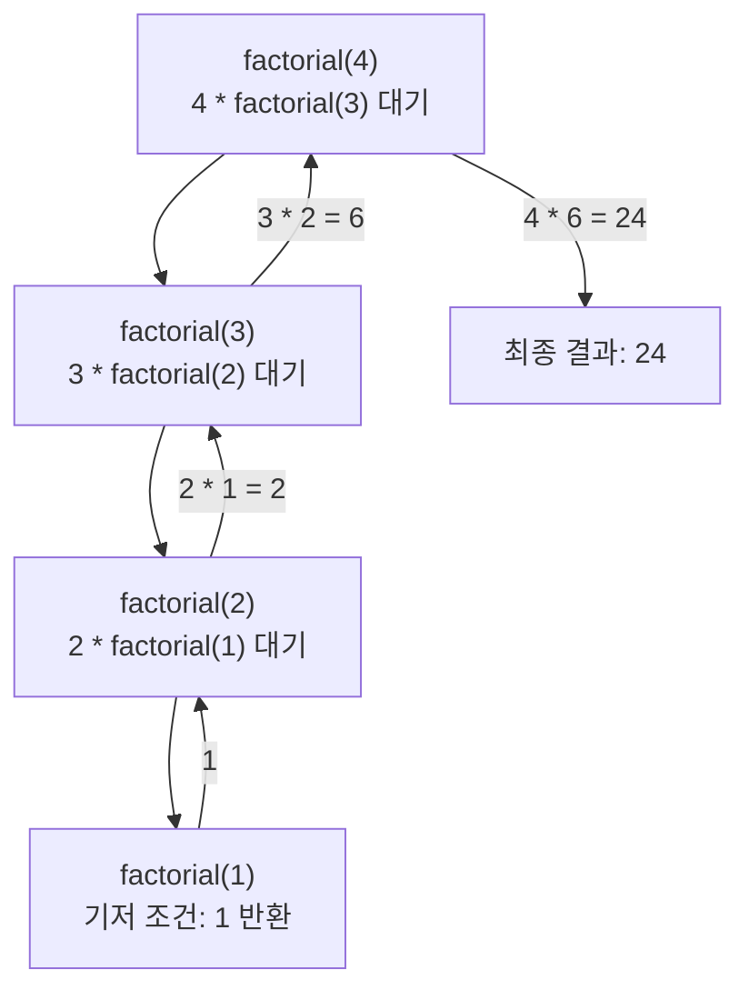
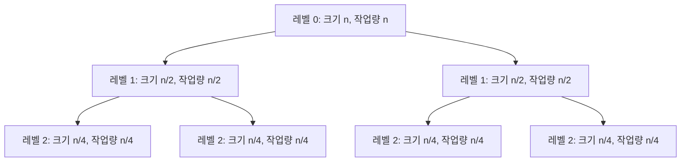

<Callout type="info">
  **이번 문서의 목표:** 이 문서를 다 읽으면 재귀 함수의 호출 과정을 손으로 추적해 변수 값 표를 그릴 수 있고, 간단한 점화식을 반복 대입과 재귀 트리 두 가지 방법으로 직접 풀 수 있으며, 마스터 정리로 그 결과를 빠르게 검산할 수 있다.
</Callout>

## 왜 점화식을 따로 떼어 배우는가

03편에서는 반복문의 실행 횟수를 시그마로 세어 복잡도를 유도했다. 하지만 07편의 퀵·병합 정렬이나 15편의 분할정복 기법처럼, 자기 자신을 더 작은 크기로 다시 호출하는 **재귀**(recursion) 알고리즘은 반복문만으로는 실행 횟수를 세기 어렵다. "크기 `n`짜리 문제를 풀려면 크기 `n/2`짜리 문제를 두 번 풀고, 거기에 추가로 `n`만큼 일을 더 한다"처럼 **알고리즘의 실행 시간을 자기 자신의 더 작은 버전으로 정의하는 식**이 필요한데, 이런 식을 **점화식**(recurrence relation)이라고 부른다.

07편(퀵·병합 정렬)과 15편(분할정복)에서 점화식 계산이 계속 반복해서 나오므로, 여기서 점화식을 세우고 푸는 절차를 한 번 확실히 익혀 두면 이후 편에서는 "이 알고리즘의 점화식은 이렇게 세워진다"까지만 짚고 계산 자체는 이 편에서 익힌 절차를 그대로 적용하면 된다.

> **쉽게 말하면:** 이 편은 "재귀 알고리즘이 몇 번 일하는지"를 세는 방법을 배우는 편이다.

## 재귀 호출 추적 — 변수 값 표로 눈에 보이게 만들기

점화식을 세우기 전에, 재귀 함수가 실제로 어떻게 호출되고 되돌아오는지부터 손으로 따라가 보자. 다음은 `n`의 팩토리얼(02편에서 배운 `n!`)을 재귀로 계산하는 의사코드다.

```text
function factorial(n):
    if n <= 1:
        return 1
    return n * factorial(n - 1)
```

`factorial(4)`를 호출했을 때 어떤 일이 일어나는지 단계별로 추적해 보자.

| 호출 단계 | 호출 | `n <= 1` 인가 | 반환하는 식 | 실제 반환값(재귀 결과가 나온 뒤) |
|-----------|------|--------------|-------------|-----------------------------------|
| 1 | factorial(4) | 아니오 | 4 × factorial(3) | 4 × 6 = 24 |
| 2 | factorial(3) | 아니오 | 3 × factorial(2) | 3 × 2 = 6 |
| 3 | factorial(2) | 아니오 | 2 × factorial(1) | 2 × 1 = 2 |
| 4 | factorial(1) | 예 | 1 (더 이상 재귀 호출 없음) | 1 |

이 표에서 1~3단계는 "아직 답을 모르니 더 작은 문제를 풀어 달라"며 호출을 계속 쌓아 나가는 과정이고, 4단계에서 `n <= 1`이라는 조건(**기저 조건**, base case, 재귀 호출을 멈추게 하는 조건)에 도달해 즉시 답을 반환한다. 이후에는 4단계 → 3단계 → 2단계 → 1단계 순서로 되돌아가며 곱셈이 실제로 계산된다.



> **비유로 이해하기:** 재귀 호출은 "포장을 뜯기 전까지는 안의 내용물을 모르는 러시아 인형(마트료시카)"과 비슷하다. 가장 작은 인형(기저 조건)의 답을 먼저 확인한 다음, 그 답을 가지고 한 겹씩 바깥 인형으로 나오면서 최종 결과를 완성한다.

> **자주 틀리는 점:** 기저 조건이 없거나 잘못 설정되면 재귀 호출이 끝없이 이어져 **무한 재귀**(스택 오버플로 오류의 원인)가 발생한다. 재귀 함수를 볼 때는 항상 "언제 호출을 멈추는가(기저 조건)"와 "그 조건에 얼마나 빨리 다가가는가(재귀 호출마다 문제 크기가 확실히 줄어드는가)"를 먼저 확인하는 습관이 필요하다.

## 점화식이란 무엇인가 — 알고리즘의 실행 시간을 자기 자신으로 정의하기

`factorial(n)`이 몇 번 곱셈을 하는지 점화식으로 표현해 보자. `T(n)`을 "크기 `n`일 때 필요한 곱셈 횟수"라고 정의하면 다음과 같이 쓸 수 있다.

$$
T(n) = T(n-1) + 1, \quad T(1) = 0
$$

- $T(n)$: 크기 `n`일 때 걸리는 작업량(여기서는 곱셈 횟수). 앞으로 점화식에서 항상 이렇게 "구하고 싶은 함수"를 정의하고 시작한다.
- $T(n-1)$: 크기를 하나 줄인 부분 문제(재귀 호출 한 번)를 푸는 데 걸리는 작업량.
- $+1$: 재귀 호출을 제외하고 그 단계에서 추가로 하는 작업(여기서는 곱셈 한 번).
- $T(1) = 0$: 기저 조건에서의 작업량. 재귀가 멈추는 지점의 값을 반드시 함께 정의해야 점화식을 끝까지 풀 수 있다.

이 점화식을 말로 풀면 "`n`짜리 문제를 풀려면, `n-1`짜리 문제를 풀고(`T(n-1)`), 거기에 곱셈 한 번(`+1`)을 더 한다"는 뜻이다.

## 등차형 점화식 풀기 — 반복 대입법

`T(n) = T(n-1) + 1` 같은 점화식은 **반복 대입법**(iteration method, 점화식을 계속 풀어서 대입해 나가며 규칙을 찾는 방법)으로 쉽게 풀 수 있다.

<Steps>

### 한 단계씩 전개하기

$T(n) = T(n-1) + 1$

$T(n-1) = T(n-2) + 1$이므로 대입하면 $T(n) = T(n-2) + 1 + 1 = T(n-2) + 2$

$T(n-2) = T(n-3) + 1$이므로 대입하면 $T(n) = T(n-3) + 1 + 2 = T(n-3) + 3$

### 규칙 찾기

`k`번 전개했을 때 $T(n) = T(n-k) + k$라는 규칙이 보인다.

### 기저 조건에 도달할 때까지 전개하기

$n - k = 1$이 되는 지점, 즉 $k = n - 1$일 때 기저 조건 $T(1) = 0$에 도달한다.

$$
T(n) = T(1) + (n-1) = 0 + (n-1) = n-1
$$

</Steps>

`n = 4`로 검산해 보면 `factorial(4)`는 `4×3×2×1`을 계산하는 과정에서 곱셈을 `4×3`, `(12)×2`, `(24)×1` 이렇게 3번(`n-1 = 3`번) 수행하므로 식과 정확히 일치한다. 이 점화식을 Big-O로 표현하면 $T(n) = n - 1 = O(n)$이다. "`n-1`씩 계속 줄어드는" 이런 형태의 점화식을 **등차형 점화식**이라고 부르며, 결과는 항상 `n`에 정비례하는 선형 시간이 된다.

## 등비형 점화식 풀기 — 재귀 트리로 그림 그려 보기

이번에는 07편의 병합 정렬, 15편의 분할정복에서 실제로 등장하는 형태의 점화식을 다뤄 보자.

$$
T(n) = 2\,T\!\left(\frac{n}{2}\right) + n, \quad T(1) = 1
$$

- $2\,T(n/2)$: 크기 `n`짜리 문제를 정확히 절반 크기인 `n/2`짜리 문제 **두 개**로 나눠서 푼다는 뜻(분할정복에서 "반으로 나누고 두 번 재귀 호출"하는 패턴을 그대로 옮긴 식이다).
- $+n$: 두 부분 문제의 결과를 합치는 데 걸리는 추가 작업(예: 병합 정렬에서 두 정렬된 배열을 하나로 합치는 과정)이 `n`에 비례한다는 뜻.

이런 점화식은 반복 대입법보다 **재귀 트리**(recursion tree, 재귀 호출이 가지를 치며 뻗어나가는 모습을 나무 형태로 그린 그림)로 그려서 각 레벨(깊이)의 작업량을 더하는 방식이 훨씬 직관적이다.



<Steps>

### 각 레벨의 작업량 세기

레벨 0(맨 위, 처음 호출)은 노드 1개, 각 노드의 작업량 `n` → 레벨 합계 `n`.

레벨 1은 노드 2개, 각 노드의 작업량 `n/2` → 레벨 합계 `2 × (n/2) = n`.

레벨 2는 노드 4개, 각 노드의 작업량 `n/4` → 레벨 합계 `4 × (n/4) = n`.

이 패턴을 보면 **모든 레벨의 작업량 합계가 항상 `n`으로 똑같다**는 규칙이 보인다.

### 레벨의 개수(트리의 높이) 구하기

문제 크기가 `n → n/2 → n/4 → ⋯ → 1`로 줄어들며, 매 레벨마다 절반씩 나누므로 몇 레벨을 내려가야 크기가 1이 되는지는 02편에서 배운 로그의 정의 그대로다. `n`을 2로 몇 번 나눠야 1이 되는가는 $\log_2 n$번이므로, 트리의 높이(레벨의 개수)는 $\log_2 n + 1$이다(0번째 레벨부터 세므로 1을 더한다).

### 전체 작업량 = 레벨당 작업량 × 레벨 수

$$
T(n) = n \times (\log_2 n + 1) = n\log_2 n + n
$$

최고차항만 남기면 $T(n) = O(n \log n)$이다.

</Steps>

`n = 8`로 검산해 보자. 레벨 0(크기 8, 작업량 8) → 레벨 1(크기 4씩 2개, 합 8) → 레벨 2(크기 2씩 4개, 합 8) → 레벨 3(크기 1씩 8개, 합 8). 레벨은 0부터 3까지 총 4개이고, `log₂8 + 1 = 3 + 1 = 4`로 정확히 일치한다. 전체 작업량은 `8 × 4 = 32`이며 이는 `n log₂n + n = 8×3 + 8 = 32`와도 일치한다. 이 점화식이 바로 07편에서 다루는 병합 정렬의 복잡도가 $O(n \log n)$이 되는 근거다.

> **자주 틀리는 점:** 재귀 트리에서 "레벨마다 노드 수는 늘어나지만 각 노드의 작업량은 줄어든다"는 것을 놓치고 레벨 수만 세거나 노드 수만 세는 실수를 한다. 반드시 **레벨의 노드 수와 노드 하나의 작업량**을 곱해 그 레벨의 합계를 구한 다음, 레벨별 합계를 모두 더해야 한다.

## 마스터 정리 — 검산용 공식

재귀 트리를 매번 그리지 않고도 $T(n) = a\,T(n/b) + f(n)$ 형태의 점화식을 빠르게 판정할 수 있는 공식이 **마스터 정리**(master theorem)다. 여기서는 시험에서 요구하는 개요 수준으로만 정리한다(엄밀한 증명은 이 과목의 범위를 벗어난다).

$$
T(n) = a\,T\!\left(\frac{n}{b}\right) + f(n)
$$

- $a$: 한 번 재귀 호출할 때 몇 개의 부분 문제로 나뉘는가(위 병합 정렬 예시에서는 2).
- $b$: 부분 문제의 크기가 원래의 몇 분의 1로 줄어드는가(위 예시에서는 2, 즉 절반).
- $f(n)$: 재귀 호출을 제외하고 그 레벨에서 추가로 하는 작업량(위 예시에서는 `n`).

마스터 정리는 $f(n)$과 $n^{\log_b a}$(재귀로 생기는 부분 문제 개수가 총 몇 개인지를 나타내는 기준값)을 비교해 세 가지 경우로 나눈다.

| 비교 결과 | 의미 | 결론 |
|-----------|------|------|
| $f(n)$이 $n^{\log_b a}$보다 차수가 낮다 | 트리의 아래쪽(잎에 가까운 레벨)에서 하는 일이 더 많다 | $T(n) = \Theta(n^{\log_b a})$ |
| $f(n)$이 $n^{\log_b a}$과 같은 차수다 | 모든 레벨에서 하는 일의 총량이 비슷하다(위 병합 정렬 예시가 이 경우) | $T(n) = \Theta(n^{\log_b a} \log n)$ |
| $f(n)$이 $n^{\log_b a}$보다 차수가 높다 | 트리의 위쪽(처음 호출에 가까운 레벨)에서 하는 일이 더 많다 | $T(n) = \Theta(f(n))$ |

병합 정렬 예시로 검산해 보면 $a=2$, $b=2$이므로 $n^{\log_b a} = n^{\log_2 2} = n^1 = n$이고, $f(n) = n$으로 $n^{\log_b a}$와 정확히 같은 차수다. 따라서 두 번째 경우에 해당해 $T(n) = \Theta(n^1 \log n) = \Theta(n \log n)$이 되며, 앞서 재귀 트리로 직접 유도한 결과와 정확히 일치한다.

> **자주 틀리는 점:** 마스터 정리는 $T(n) = a\,T(n/b) + f(n)$ **형태의 점화식에만** 적용할 수 있다. 앞서 다룬 `T(n) = T(n-1) + 1`처럼 부분 문제의 크기가 `n/b`가 아니라 `n-1`, `n-2`처럼 **한 개씩 줄어드는 형태**에는 마스터 정리를 적용할 수 없고, 반복 대입법으로 풀어야 한다. 두 형태를 구분하는 것이 마스터 정리를 오용하지 않는 핵심이다.

## 이 편의 절차가 뒤에서 어떻게 쓰이는가

이후 편에서는 이 편에서 익힌 절차를 다음과 같이 재사용한다.

- **07편(퀵·병합 정렬)**: 병합 정렬은 이 편의 예시와 똑같은 $T(n) = 2T(n/2) + n$을, 퀵 정렬은 피벗 선택에 따라 균형 분할(`T(n) = 2T(n/2) + n`, 최선)과 불균형 분할(`T(n) = T(n-1) + n`, 최악)이 어떻게 다른 결과를 내는지를 이 편의 재귀 트리·반복 대입 절차로 유도한다.
- **15편(분할정복)**: 분할정복의 일반 패턴에서 점화식을 세우는 방법과 마스터 정리 적용 사례를 더 다양한 예제로 확장한다.
- **16편(동적계획법)**: 재귀 호출이 같은 부분 문제를 중복해서 계산하는 비효율(예: 피보나치수를 단순 재귀로 계산하면 $T(n) = T(n-1) + T(n-2) + 1$로 지수 시간이 걸린다)을 이 편의 재귀 트리 사고로 확인한 뒤, 그 중복을 없애는 것이 동적계획법의 핵심 아이디어임을 배운다.

## 자주 틀리는 점 (종합)

- **기저 조건을 빠뜨리는 실수**: 점화식은 반드시 재귀 부분($T(n) = \cdots$)과 기저 조건($T(1) = \cdots$)을 함께 정의해야 끝까지 풀 수 있다.
- **반복 대입법에서 전개 횟수와 남은 크기를 헷갈리는 실수**: `k`번 전개했을 때 크기가 `n-k`인지, `n/2^k`인지 형태에 따라 다르므로 매번 직접 대입해 규칙을 확인해야 한다.
- **재귀 트리에서 레벨 수를 세지 않고 노드 하나의 작업량만 보는 실수**: 반드시 (레벨의 노드 수) × (노드 하나의 작업량)을 레벨마다 계산해야 한다.
- **마스터 정리를 아무 점화식에나 적용하는 실수**: $T(n) = a\,T(n/b) + f(n)$ 형태가 아니면(예: `n-1`씩 줄어드는 형태) 마스터 정리를 적용할 수 없다.

## 핵심 정리

- 재귀 호출은 기저 조건에 도달할 때까지 호출을 쌓았다가, 기저 조건에서부터 거꾸로 계산 결과를 되돌려 받는 구조이며 변수 값 표나 mermaid 그림으로 추적하면 이해하기 쉽다.
- 점화식은 "크기 `n`짜리 문제의 작업량을 더 작은 크기의 작업량으로 정의하는 식"이며, 재귀 부분과 기저 조건을 함께 정의해야 한다.
- 등차형 점화식(`T(n) = T(n-1) + c`)은 반복 대입법으로 풀며 결과는 보통 선형 시간이 된다.
- 등비형 점화식(`T(n) = a T(n/b) + f(n)`)은 재귀 트리를 그려 레벨별 작업량을 더하는 방식이 직관적이며, `T(n) = 2T(n/2) + n`은 $O(n \log n)$이 된다.
- 마스터 정리는 $f(n)$과 $n^{\log_b a}$의 차수를 비교해 세 가지 결론 중 하나로 빠르게 검산하는 공식이며, `T(n) = a T(n/b) + f(n)` 형태에만 적용된다.

## 마무리 복습

<Quiz
  questionNumber={1}
  question="재귀 함수에서 기저 조건(base case)이 하는 역할로 가장 적절한 것은?"
  options={['재귀 호출의 속도를 두 배로 높인다', '재귀 호출을 멈추고 더 이상 자기 자신을 호출하지 않게 하는 조건이다', '재귀 함수의 반환값을 항상 0으로 만든다', '재귀 함수가 여러 번 실행되도록 강제한다']}
  correctAnswer={2}
  explanation="기저 조건은 더 이상 재귀 호출을 하지 않고 즉시 답을 반환하게 하는 조건이다. 이 조건이 없거나 잘못되면 재귀 호출이 끝없이 이어지는 무한 재귀가 발생한다."
  optionExplanations={['기저 조건은 속도를 조절하는 장치가 아니라 재귀를 멈추는 조건이다.', '정답. 기저 조건에 도달하면 더 이상 재귀 호출을 하지 않고 값을 반환한다.', '기저 조건에서 반환하는 값은 함수마다 다르며 항상 0인 것은 아니다.', '기저 조건은 재귀를 멈추는 역할이지 강제로 반복시키는 역할이 아니다.']}
/>

<Quiz
  questionNumber={2}
  question="점화식 T(n) = T(n-1) + 1, T(1) = 0을 반복 대입법으로 풀었을 때 결과로 옳은 것은?"
  options={['T(n) = n', 'T(n) = n - 1', 'T(n) = log n', 'T(n) = n^2']}
  correctAnswer={2}
  explanation="k번 전개하면 T(n) = T(n-k) + k가 되고, n-k=1이 되는 k=n-1일 때 T(1)=0에 도달하므로 T(n) = 0 + (n-1) = n-1이다."
  optionExplanations={['기저 조건 T(1)=0을 반영하면 정확한 값은 n이 아니라 n-1이다.', '정답. 반복 대입법으로 전개하면 T(n) = n-1이 된다.', '이 점화식은 크기가 절반이 아니라 1씩 줄어드는 형태이므로 로그가 아니라 선형 결과가 나온다.', '이 점화식은 등차형으로 결과가 n의 제곱이 아니라 n에 비례한다.']}
/>

<Quiz
  questionNumber={3}
  question="점화식 T(n) = 2T(n/2) + n을 재귀 트리로 분석할 때, 각 레벨(깊이)의 작업량 합계에 대한 설명으로 옳은 것은?"
  options={['레벨이 깊어질수록 작업량 합계가 두 배씩 늘어난다', '레벨이 깊어질수록 작업량 합계가 절반씩 줄어든다', '모든 레벨의 작업량 합계가 항상 n으로 동일하다', '첫 번째 레벨에서만 작업량이 발생하고 나머지 레벨은 0이다']}
  correctAnswer={3}
  explanation="레벨마다 노드 수는 두 배씩 늘어나지만(1, 2, 4, ...) 각 노드의 작업량은 절반씩 줄어들므로(n, n/2, n/4, ...) 두 값을 곱한 레벨별 합계는 항상 n으로 동일하게 유지된다."
  optionExplanations={['노드 수는 늘어나지만 노드 하나의 작업량이 줄어들어 상쇄되므로 합계가 두 배로 늘어나지 않는다.', '작업량 합계는 줄어들지 않고 모든 레벨에서 동일하게 유지된다.', '정답. 노드 수 증가와 노드당 작업량 감소가 상쇄되어 모든 레벨의 합계가 n으로 같다.', '재귀 트리의 모든 레벨에서 작업량이 발생하며 특정 레벨만 0이 되지 않는다.']}
/>

<Quiz
  questionNumber={4}
  question="위 3번 문항의 점화식 T(n) = 2T(n/2) + n의 시간복잡도로 옳은 것은?"
  options={['O(n)', 'O(n log n)', 'O(n^2)', 'O(log n)']}
  correctAnswer={2}
  explanation="레벨당 작업량이 항상 n이고, 트리의 높이(레벨 수)가 log₂n + 1이므로 전체 작업량은 n × (log₂n + 1) = n log n + n이며 최고차항만 남기면 O(n log n)이다."
  optionExplanations={['레벨 수를 고려하지 않고 레벨당 작업량 n만 본 결과이며 실제로는 레벨 수를 곱해야 한다.', '정답. 레벨당 작업량 n에 레벨 수 log n을 곱한 O(n log n)이다.', 'n의 제곱이 되려면 레벨당 작업량이 레벨마다 커져야 하는데 이 점화식은 그렇지 않다.', 'log n만으로는 레벨당 작업량 n이 반영되지 않은 결과다.']}
/>

<Quiz
  questionNumber={5}
  question="마스터 정리 T(n) = aT(n/b) + f(n)를 적용할 수 있는 점화식으로 옳은 것은?"
  options={['T(n) = T(n-1) + 1', 'T(n) = 2T(n/2) + n', 'T(n) = T(n-1) + T(n-2) + 1', 'T(n) = T(n-2) + n^2']}
  correctAnswer={2}
  explanation="마스터 정리는 부분 문제의 크기가 n/b 형태로 나뉠 때만 적용할 수 있다. T(n) = 2T(n/2) + n은 크기가 절반(n/2)으로 줄어드는 형태이므로 마스터 정리를 바로 적용할 수 있다."
  optionExplanations={['부분 문제 크기가 n-1로, n을 b로 나눈 형태가 아니므로 마스터 정리를 적용할 수 없다.', '정답. 크기가 n/2로 나뉘는 형태이므로 마스터 정리를 바로 적용할 수 있다.', '재귀 호출이 두 번 등장하지만 크기가 n-1, n-2로 1씩 줄어드는 형태라 마스터 정리 형식이 아니다.', '부분 문제 크기가 n-2로, n을 b로 나눈 형태가 아니므로 마스터 정리를 적용할 수 없다.']}
/>

<Quiz
  questionNumber={6}
  question="병합 정렬의 점화식 T(n) = 2T(n/2) + n에 마스터 정리를 적용할 때 a=2, b=2이므로 n^(log_b a) = n이 되고, f(n) = n으로 이와 같은 차수다. 이때 마스터 정리의 결론으로 옳은 것은?"
  options={['T(n) = Θ(n^(log_b a)) = Θ(n)', 'T(n) = Θ(n^(log_b a) log n) = Θ(n log n)', 'T(n) = Θ(f(n)) = Θ(n)', 'T(n) = Θ(n^2)']}
  correctAnswer={2}
  explanation="f(n)이 n^(log_b a)와 같은 차수일 때는 마스터 정리의 두 번째 경우에 해당하여 T(n) = Θ(n^(log_b a) log n)이 되며, 여기서는 Θ(n log n)이다."
  optionExplanations={['이 결론은 f(n)이 n^(log_b a)보다 차수가 낮을 때 적용되는 첫 번째 경우다.', '정답. f(n)과 n^(log_b a)가 같은 차수이므로 두 번째 경우에 해당해 Θ(n log n)이다.', '이 결론은 f(n)이 n^(log_b a)보다 차수가 높을 때 적용되는 세 번째 경우다.', 'Θ(n^2)은 이 점화식의 결과와 맞지 않으며 재귀 트리로 직접 검산한 결과와도 다르다.']}
/>

## 참고 자료

- [국가평생교육진흥원 독학학위제](https://bdes.nile.or.kr) — 알고리즘 과목 평가영역 중 재귀·점화식 분석 부분의 출제 수준을 확인하는 데 참고했다.
- [Big-O Cheat Sheet](https://www.bigocheatsheet.com/) — 분할정복 계열 알고리즘의 점화식과 결과 복잡도를 비교해 볼 수 있는 공개 참고 자료.
