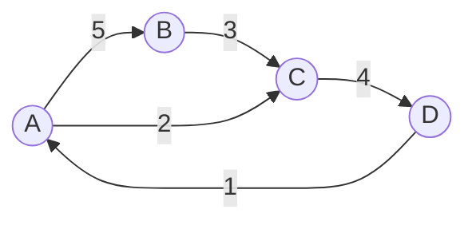
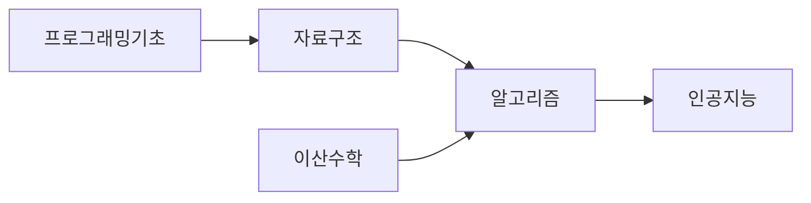

<Callout type="info">
  **이번 문서의 목표:** 이 파일을 다 읽으면 문제 상황을 정점·간선으로 옮겨 그래프로 표현하고, 상황에 맞는 저장 방식(인접 행렬 또는 인접 리스트)을 스스로 선택할 수 있다.
</Callout>

## 왜 그래프를 다시 정리하는가

지하철 노선도, 친구 관계, 웹 페이지 사이의 링크, 도시 사이의 도로. 겉보기에는 전혀 다른 이 네 가지는 수학적으로는 똑같은 구조를 하고 있다. "무언가"들이 있고, 그 "무언가" 사이에 "관계"가 있다는 점이다. 이런 대상과 관계를 하나의 틀로 표현하는 자료구조가 **그래프**(graph)다.

자료구조 과목에서 그래프의 정의와 기본 용어는 이미 배웠을 것이다. 이 편은 그 내용을 처음부터 다시 가르치지 않는다. 대신 독학사 4단계 알고리즘 시험이 요구하는 두 가지, 즉 (1) 실제 문제를 그래프로 **모델링**하는 사고와 (2) 그 그래프를 컴퓨터 메모리에 어떻게 **표현**할지 선택하는 기준을 집중적으로 다룬다. 11~13편에서 배울 DFS·BFS·MST·최단경로 알고리즘은 모두 "그래프가 이미 표현되어 있다"는 전제에서 출발하므로, 이 편에서 표현 방식을 확실히 정리해 두면 뒤에서 반복 설명 없이 알고리즘 자체에 집중할 수 있다.

## 그래프 용어 복습: 정점·간선·가중치·방향성

> **쉽게 말하면:** 그래프는 점(정점)과 그 점을 잇는 선(간선)의 모임이다. 선에 화살표가 있으면 방향이 있는 관계, 선에 숫자가 붙으면 비용이 있는 관계다.

그래프 $G$는 정점(vertex, 노드라고도 함)의 집합 $V$와 간선(edge, 두 정점을 잇는 연결)의 집합 $E$의 쌍으로 정의한다. 시험에서는 이를 $G = (V, E)$로 표기한다.

- $V$: 정점의 집합. 예: $V = \{A, B, C, D\}$
- $E$: 간선의 집합. 각 간선은 두 정점의 쌍이다. 예: $E = \{(A,B), (B,C), (C,D)\}$
- $|V|$: 정점의 개수 (흔히 $n$으로도 표기)
- $|E|$: 간선의 개수 (흔히 $m$으로도 표기)

여기서 집합 표기 $\{A, B, C, D\}$처럼 중괄호를 쓸 때는 항상 KaTeX 수식 안에 넣어야 산문 중괄호 금지 규칙을 지킬 수 있다는 점을 참고하자(00_MDX규칙 참고).

### 방향성: 화살표가 있는가 없는가

간선에 방향이 있는지 없는지에 따라 그래프는 두 종류로 나뉜다.

- **무방향 그래프**(undirected graph): 간선 $(A, B)$가 있으면 $A$에서 $B$로도, $B$에서 $A$로도 갈 수 있다. 예: 친구 관계(내가 친구면 상대도 친구다), 양방향 도로.
- **방향 그래프**(directed graph, 줄여서 digraph): 간선에 방향이 있어 $A \to B$가 있어도 $B \to A$는 없을 수 있다. 예: 팔로우 관계(내가 팔로우해도 상대는 나를 안 할 수 있다), 일방통행 도로, 선수 과목 관계("자료구조를 들어야 알고리즘을 들을 수 있다").

방향 그래프에서 정점 하나로 들어오는 간선의 개수를 **진입차수**(in-degree), 나가는 간선의 개수를 **진출차수**(out-degree)라 한다. 무방향 그래프에서는 이런 구분 없이 그냥 그 정점에 연결된 간선 수를 **차수**(degree)라 부른다.

### 가중치: 관계에 비용이 있는가

간선마다 숫자(비용, 거리, 시간 등)가 붙어 있으면 **가중 그래프**(weighted graph), 그렇지 않고 연결 여부만 의미가 있으면 **비가중 그래프**(unweighted graph)라 한다. 예를 들어 도로망에서 두 도시 사이의 거리(km)나 이동 시간(분)은 전형적인 가중치이며, 13편에서 다룰 최단경로 알고리즘은 이 가중치의 합을 최소화하는 문제다.

### 경로·사이클·연결성

- **경로**(path): 정점을 간선으로 이어 나가는 정점들의 나열. 예: $A \to B \to C$.
- **사이클**(cycle): 시작 정점과 끝 정점이 같은 경로. 예: $A \to B \to C \to A$.
- **연결 그래프**(connected graph): 무방향 그래프에서 임의의 두 정점 사이에 항상 경로가 존재하면 연결 그래프라 한다. 방향 그래프에서는 방향을 무시해도 연결되어 있으면 **약하게 연결**(weakly connected), 방향을 지켜도 서로 오갈 수 있으면 **강하게 연결**(strongly connected)이라 구분한다. 강연결성은 18편·21편에서 강연결요소(SCC) 개념과 함께 다시 나온다.

아래 그림은 지금까지 나온 용어를 한 그래프 위에 정리한 것이다.

이 그래프는 방향 그래프이며 가중 그래프다. $D \to A \to C \to D$는 사이클이고, $A$에서 $D$까지 갈 수 있으므로($A \to C \to D$) 이 그래프는 (방향을 지켜도) 서로 오갈 수 있는지는 각 쌍을 다 확인해야 강연결 여부를 판단할 수 있다.

## 인접 행렬: 정점 사이 관계를 표로 채운다

> **쉽게 말하면:** 정점 수만큼의 정사각형 표를 만들고, 두 정점이 연결되어 있으면 그 칸에 표시한다.

**인접 행렬**(adjacency matrix)은 정점이 $n$개일 때 $n \times n$ 크기의 2차원 배열 $M$을 만들고, 정점 $i$에서 정점 $j$로 가는 간선이 있으면 $M[i][j] = 1$(또는 가중치 값), 없으면 $M[i][j] = 0$(또는 $\infty$)로 채우는 방식이다.

앞의 방향 가중 그래프($A \to B$ 가중치 5, $B \to C$ 가중치 3, $A \to C$ 가중치 2, $C \to D$ 가중치 4, $D \to A$ 가중치 1)를 인접 행렬로 표현하면 다음과 같다. 연결이 없는 칸은 $\infty$(무한대, 갈 수 없음을 의미)로 표시한다.

| 행\열 | A | B | C | D |
|---|---|---|---|---|
| A | 0 | 5 | 2 | ∞ |
| B | ∞ | 0 | 3 | ∞ |
| C | ∞ | ∞ | 0 | 4 |
| D | 1 | ∞ | ∞ | 0 |

**결과 해석:** $M[A][B]=5$는 "$A$에서 $B$로 가는 간선이 있고 가중치는 5"라는 뜻이다. $M[B][A]$는 표에 없으므로(∞) $B$에서 $A$로 직접 가는 간선은 없다는 뜻이다. 무방향 그래프라면 $M[i][j] = M[j][i]$가 항상 성립해 행렬이 대각선을 기준으로 대칭이 된다.

### 인접 행렬의 복잡도

- **공간 복잡도**: 정점이 $n$개면 무조건 $n \times n$ 칸을 다 확보해야 하므로 $O(n^2)$이다. 실제 간선 수 $m$과 무관하게 항상 이 크기를 쓴다.
- **두 정점 사이 간선 존재 여부 확인**: $M[i][j]$ 한 칸만 보면 되므로 $O(1)$이다.
- **정점 하나에 연결된 모든 간선을 순회**: 그 행(또는 열) 전체 $n$칸을 다 봐야 하므로 $O(n)$이다.

## 인접 리스트: 정점마다 연결된 이웃만 나열한다

> **쉽게 말하면:** 정점마다 "나와 연결된 이웃들의 명단"을 리스트로 들고 있는 방식이다.

**인접 리스트**(adjacency list)는 정점마다 하나씩 리스트(또는 연결 리스트)를 두고, 그 정점에서 갈 수 있는 이웃 정점(과 가중치가 있다면 가중치)만 저장하는 방식이다. 존재하지 않는 관계는 아예 저장 공간을 쓰지 않는다는 점이 인접 행렬과 가장 큰 차이다.

같은 그래프를 인접 리스트로 표현하면 다음과 같다.

| 정점 | 인접 리스트 (이웃, 가중치) |
|------|------------------------------|
| A | (B, 5), (C, 2) |
| B | (C, 3) |
| C | (D, 4) |
| D | (A, 1) |

### 인접 리스트의 복잡도

- **공간 복잡도**: 실제 존재하는 간선 수만큼만 저장하므로 방향 그래프에서 $O(V+E)$다($V$는 정점 리스트 자체를 위한 공간, $E$는 간선 항목 수). 무방향 그래프는 간선 하나를 양쪽 정점 리스트에 두 번 저장하므로 $O(V+2E)$지만, 상수배 차이일 뿐이라 여전히 $O(V+E)$로 표기한다.
- **두 정점 사이 간선 존재 여부 확인**: 그 정점의 리스트를 처음부터 훑어야 하므로 최악의 경우 그 정점의 차수만큼, 즉 $O(\deg(i))$가 걸린다. 인접 행렬의 $O(1)$보다 느릴 수 있다.
- **정점 하나에 연결된 모든 간선을 순회**: 그 정점의 리스트 길이만큼, 즉 $O(\deg(i))$다. 불필요한 칸을 보지 않으므로 인접 행렬의 $O(n)$보다 보통 더 효율적이다.

## 두 표현의 선택 기준

> **쉽게 말하면:** 간선이 정점 수에 비해 적으면(성긴 그래프) 인접 리스트, 간선이 정점 수 제곱에 가깝게 많으면(빽빽한 그래프) 인접 행렬이 유리하다.

그래프에서 정점 수 $n$개가 만들 수 있는 최대 간선 수는 (무방향 기준) $\binom{n}{2} = \frac{n(n-1)}{2}$개, 즉 $O(n^2)$이다. 실제 간선 수 $m$이 이 최댓값에 가까우면 **빽빽한 그래프**(dense graph), $m$이 $n$에 비례하는 정도로 적으면 **성긴 그래프**(sparse graph)라 부른다.

| 기준 | 인접 행렬 | 인접 리스트 |
|------|-----------|-------------|
| 공간 복잡도 | `O(V^2)` (항상 고정) | `O(V+E)` (간선 수에 비례) |
| 간선 존재 여부 확인 | `O(1)` | `O(deg(i))` |
| 정점의 이웃 전체 순회 | `O(V)` | `O(deg(i))` |
| 적합한 그래프 | 빽빽한 그래프, 작은 $n$ | 성긴 그래프, 큰 $n$ |
| 대표 활용 알고리즘 | 플로이드-워셜(13편) | DFS·BFS(11편), 다익스트라·크루스칼(12·13편) |

실제 시험 문제나 실무에서 등장하는 그래프는 대부분 **성긴 그래프**다. SNS 친구 관계, 도로망, 웹 링크 모두 정점 하나가 다른 모든 정점과 연결되지 않고 일부와만 연결되기 때문이다. 그래서 11편 이후에 배울 대부분의 그래프 알고리즘은 기본적으로 인접 리스트를 기준으로 의사코드를 작성하며, 13편의 플로이드-워셜처럼 "모든 정점 쌍" 사이의 관계를 반복적으로 갱신해야 하는 알고리즘만 예외적으로 인접 행렬을 자연스럽게 쓴다.

## 그래프로 문제를 모델링하는 사고

> **쉽게 말하면:** 문제에서 "대상"을 정점으로, 대상 사이의 "관계"를 간선으로 바꿔 생각하는 습관이다.

독학사 시험에서 그래프 문제는 이미 그래프 그림으로 주어지는 경우도 있지만, 서술형·응용 문제에서는 문장으로 된 상황을 스스로 그래프로 바꿔야 풀리는 경우가 많다. 이때 다음 세 가지 질문을 순서대로 던지면 모델링이 쉬워진다.

1. **무엇이 정점인가?** 문제에서 반복해서 등장하는 "개체"(도시, 사람, 작업, 웹 페이지, 상태)를 정점으로 잡는다.
2. **무엇이 간선인가, 방향이 있는가?** 개체 사이의 "관계"(도로, 팔로우, 선행 작업, 링크, 전이)를 간선으로 잡고, 그 관계가 대칭적인지(무방향) 일방적인지(방향)를 판단한다.
3. **간선에 비용이 필요한가?** 거리·시간·비용처럼 최소화·최대화할 대상이 있으면 가중 그래프로, 단순히 연결 여부만 중요하면 비가중 그래프로 모델링한다.

### 모델링 예시 1: 경로 문제 — 지하철 최소 환승

"지하철 노선도에서 역 A부터 역 B까지 가는 방법 중 환승이 가장 적은 경로를 찾아라"라는 문제를 생각해 보자. 역을 정점으로, 인접한 두 역을 잇는 구간을 간선으로 잡으면 무방향 비가중 그래프가 된다(구간 하나를 지나는 데 드는 "비용"을 모두 1로 취급하면 "환승이 적은 경로"는 "가장 적은 간선 수로 가는 경로"와 같아진다). 이는 11편에서 배울 BFS로 풀 수 있는 전형적인 최단 간선 수 문제다.

### 모델링 예시 2: 연결성 문제 — 네트워크 장애 확인

"컴퓨터 여러 대가 케이블로 연결된 네트워크에서, 케이블 하나가 끊어져도 모든 컴퓨터가 여전히 서로 통신할 수 있는가?"라는 문제는 컴퓨터를 정점, 케이블을 간선으로 하는 무방향 그래프의 **연결성**을 묻는 문제로 바뀐다. 특정 간선을 제거했을 때 그래프가 두 개 이상의 컴포넌트로 쪼개지는지 확인하는 문제이며, 이런 간선을 **단절선**(bridge)이라 부른다(상세 판별 알고리즘은 이 과목 범위를 넘는 심화 주제이므로, 여기서는 "그래프 연결성 문제로 바뀐다"는 모델링 관점까지만 다룬다).

### 모델링 예시 3: 순서 관계 문제 — 과목 수강 순서

"자료구조를 들어야 알고리즘을 들을 수 있고, 알고리즘을 들어야 인공지능을 들을 수 있다면, 전체 과목을 어떤 순서로 들어야 하는가?"라는 문제는 과목을 정점, "선수 과목 → 후속 과목" 관계를 방향 간선으로 하는 **방향 비순환 그래프**(DAG, Directed Acyclic Graph)로 모델링된다. 이런 순서 관계를 실제로 나열하는 알고리즘이 12편에서 다룰 **위상 정렬**(topological sort)이다.

## 자주 틀리는 점

- **무방향 그래프를 인접 행렬로 표현할 때 대칭을 깨뜨린다.** 무방향 간선 $(A, B)$는 $M[A][B]$와 $M[B][A]$ 두 칸에 모두 값을 넣어야 한다. 한쪽만 채우면 방향 그래프가 되어버린다.
- **인접 리스트의 공간 복잡도를 $O(V^2)$으로 잘못 외운다.** 인접 리스트의 장점은 실제 간선 수 $E$에 비례한다는 것이며, 이를 $O(V+E)$로 정확히 써야 한다.
- **"차수"와 "진입차수·진출차수"를 혼동한다.** 무방향 그래프에는 진입·진출 구분이 없고, 방향 그래프에서만 이 둘을 나눠 센다.
- **가중치가 없는데 모든 간선의 비용을 임의로 다르게 가정한다.** 문제에서 비용 언급이 없으면 모든 간선을 동일 비용(주로 1)으로 취급하는 비가중 그래프로 모델링해야 한다.
- **밀집도를 따지지 않고 무조건 인접 행렬(또는 무조건 인접 리스트)을 쓴다.** 시험에서 "어떤 표현이 더 적합한가"를 묻는 문제는 정점 수 $n$과 간선 수 $m$의 관계(성긴가 빽빽한가)를 근거로 답해야 한다.

## 핵심 정리

- 그래프는 $G=(V,E)$로 표기하며, 방향성(방향/무방향)과 가중치(가중/비가중) 두 축으로 분류한다.
- 인접 행렬은 $O(V^2)$ 공간, $O(1)$ 간선 확인이 특징이며 빽빽한 그래프에 적합하다.
- 인접 리스트는 $O(V+E)$ 공간, $O(\deg(i))$ 간선 확인이 특징이며 성긴 그래프(실무 대부분)에 적합하다.
- 문제를 그래프로 모델링할 때는 "정점이 무엇인가 → 간선과 방향성 → 가중치 필요 여부" 순서로 판단한다.
- 경로 문제는 BFS(무방향·비가중), 연결성 문제는 연결 그래프 판별, 순서 관계 문제는 DAG와 위상 정렬로 이어진다(각각 11·12편에서 심화).

## 마무리 복습

<Quiz
  questionNumber={1}
  question="그래프 G=(V, E)에서 정점 수가 6개이고 간선 수가 5개일 때, 이 그래프에 대한 설명으로 옳은 것은?"
  options={['반드시 방향 그래프이다', '반드시 연결 그래프이다', '정점 수에 비해 간선 수가 적은 성긴 그래프에 해당한다', '반드시 사이클을 포함한다']}
  correctAnswer={3}
  explanation="정점 6개가 만들 수 있는 최대 간선 수는 6×5/2=15개인데 실제 간선은 5개뿐이므로, 최댓값에 비해 훨씬 적은 성긴 그래프에 해당한다. 방향성·연결성·사이클 여부는 간선 수만으로는 알 수 없다."
  optionExplanations={['방향성은 간선 수만으로 알 수 없다', '연결 그래프인지는 실제 연결 구조를 봐야 하며 간선 수만으로 단정할 수 없다', '최대 간선 수 15개 대비 5개이므로 성긴 그래프가 맞다', '사이클 포함 여부는 실제 연결 구조를 봐야 한다']}
/>

<Quiz
  questionNumber={2}
  question="방향 그래프에서 어떤 정점으로 들어오는 간선의 개수를 가리키는 용어는?"
  options={['출력차수', '진입차수', '진출차수', '단순차수']}
  correctAnswer={2}
  explanation="정점으로 들어오는 간선 수는 진입차수(in-degree), 나가는 간선 수는 진출차수(out-degree)라 한다."
  optionExplanations={['존재하지 않는 용어다', '들어오는 간선 수를 뜻하는 정답 용어다', '나가는 간선 수를 뜻하는 용어로 질문과 반대다', '존재하지 않는 용어다']}
/>

<Quiz
  questionNumber={3}
  question="정점 5개, 간선 4개인 무방향 그래프를 인접 행렬로 저장할 때 필요한 공간 복잡도는?"
  options={['O(4)', 'O(5)', 'O(V+E)', 'O(V^2)']}
  correctAnswer={4}
  explanation="인접 행렬은 실제 간선 수와 무관하게 정점 수의 제곱만큼 칸을 확보해야 하므로 O(V^2)이다."
  optionExplanations={['간선 수만으로 표현되는 복잡도가 아니다', '정점 수만으로는 부족하다', 'O(V+E)는 인접 리스트의 공간 복잡도다', '정점 수의 제곱에 비례하는 것이 인접 행렬의 특징이므로 정답이다']}
/>

<Quiz
  questionNumber={4}
  question="성긴 그래프(sparse graph)를 저장할 때 일반적으로 더 적합한 표현 방식과 그 이유로 옳은 것은?"
  options={['인접 행렬, 두 정점 사이 확인이 항상 O(1)이라서', '인접 리스트, 실제 간선 수에 비례한 공간만 사용해서', '인접 행렬, 구현이 더 간단해서', '인접 리스트, 항상 O(V^2) 공간을 절약해서']}
  correctAnswer={2}
  explanation="성긴 그래프는 실제 간선 수가 정점 수 제곱보다 훨씬 적으므로, 실제 간선 수에 비례하는 O(V+E) 공간만 쓰는 인접 리스트가 메모리 낭비 없이 적합하다."
  optionExplanations={['O(1) 확인은 사실이지만 성긴 그래프에서는 불필요한 공간 낭비가 더 큰 문제다', '실제 간선 수만큼만 저장하는 인접 리스트가 정답 이유다', '구현 난이도는 이 판단 기준이 아니다', '인접 리스트의 공간은 O(V+E)이지 O(V^2) 절약이라는 표현은 부정확하다']}
/>

<Quiz
  questionNumber={5}
  question="작업 A를 끝내야 작업 B를 시작할 수 있다는 형태의 여러 작업 순서 관계를 모델링하기에 가장 적절한 그래프는?"
  options={['무방향 비가중 그래프', '방향 비순환 그래프(DAG)', '무방향 가중 그래프', '방향 그래프이지만 사이클이 반드시 있어야 하는 그래프']}
  correctAnswer={2}
  explanation="선행-후속 관계는 방향성이 있고, 순서 관계이므로 순환(A가 B보다 먼저이면서 동시에 B가 A보다 먼저일 수 없음)이 없어야 한다. 따라서 방향 비순환 그래프(DAG)로 모델링한다."
  optionExplanations={['방향성이 없는 모델은 선후 관계를 표현하지 못한다', 'DAG가 선후 관계 모델링의 정답이다', '가중치는 이 문제 설명에 등장하지 않는다', '순서 관계에 사이클이 있으면 모순이 생기므로 비순환이어야 한다']}
/>

<Quiz
  questionNumber={6}
  question="인접 리스트에서 어떤 정점 i에 연결된 모든 이웃을 순회하는 데 걸리는 시간은?"
  options={['O(1)', 'O(deg(i))', 'O(V)', 'O(V^2)']}
  correctAnswer={2}
  explanation="인접 리스트는 정점 i의 리스트에 실제 이웃만 저장하므로, 순회 시간은 그 정점의 차수 deg(i)에 비례한다."
  optionExplanations={['이웃이 여러 개면 상수 시간으로 끝나지 않는다', '정점의 차수만큼 걸리는 것이 정답이다', '전체 정점 수는 이 순회와 직접 비례하지 않는다', '인접 행렬의 순회 비용과 혼동한 값이다']}
/>

<Quiz
  questionNumber={7}
  question="무방향 그래프를 인접 행렬로 표현했을 때 나타나는 성질로 옳은 것은?"
  options={['행렬이 항상 대각선을 기준으로 대칭이다', '행렬의 모든 값이 반드시 0 또는 1이다', '행렬 크기가 간선 수에 따라 달라진다', '진입차수와 진출차수를 각각 따로 표시해야 한다']}
  correctAnswer={1}
  explanation="무방향 그래프는 간선 (A,B)가 있으면 M[A][B]와 M[B][A]가 항상 같은 값을 가지므로 행렬이 대칭이다."
  optionExplanations={['대칭성이 무방향 인접 행렬의 핵심 성질로 정답이다', '가중 그래프라면 0/1이 아닌 가중치 값이 들어갈 수 있다', '행렬 크기는 정점 수로만 정해지며 간선 수와 무관하다', '무방향 그래프에는 진입·진출 구분이 없다']}
/>

## 참고 자료

- [국가평생교육진흥원 독학학위제](https://bdes.nile.or.kr) — 4단계 알고리즘 과목 출제범위 중 그래프 표현·모델링 항목 확인
- [GeeksforGeeks: Graph and its representations](https://www.geeksforgeeks.org/graph-and-its-representations/) — 인접 행렬·인접 리스트 표현 방식과 복잡도 비교 정리
