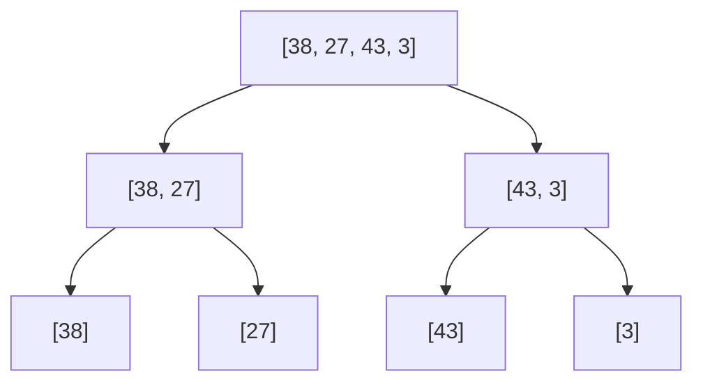
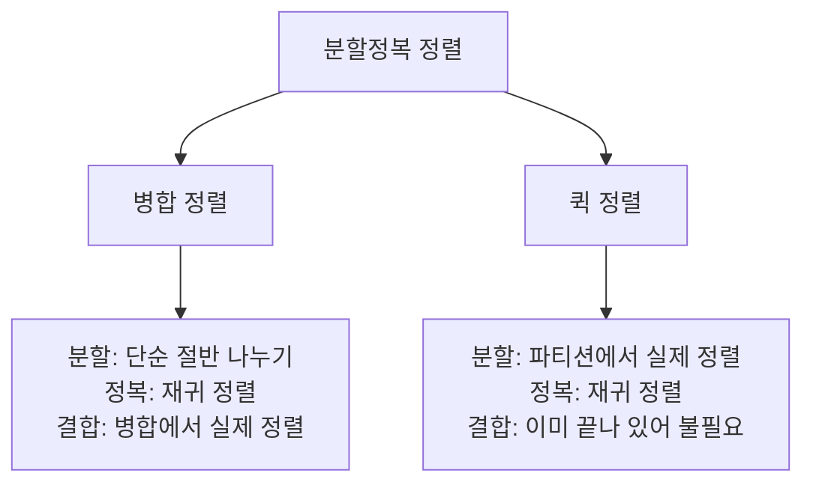

<Callout type="info">
  **이번 문서의 목표:** 이 파일을 다 읽으면 퀵 정렬과 병합 정렬을 배열 단위로 직접 추적하고, 재귀 트리를 그려 두 알고리즘의 시간 복잡도를 스스로 유도할 수 있다.
</Callout>

## 왜 O(n²)을 넘어서야 하는가

06편에서 다룬 선택·삽입·버블 정렬은 모두 평균·최악 시간 복잡도가 $O(n^2)$이었다. 자료가 100개면 최대 비교 횟수가 대략 5,000번 수준이지만, 자료가 100만 개가 되면 5천억 번에 가까운 연산이 필요해져 사실상 쓸 수 없다. 이 한계를 넘는 방법이 15편에서 본격적으로 다룰 **분할정복**(divide and conquer) 기법이다. 이 편에서 다루는 퀵 정렬과 병합 정렬은 분할정복을 정렬에 적용한 대표 사례이며, 04편에서 배운 재귀 트레이스와 점화식 분석을 실제로 사용하는 첫 사례이기도 하다.

분할정복의 기본 흐름은 세 단계다. (1) 문제를 더 작은 부분 문제로 **분할**(divide)한다. (2) 각 부분 문제를 재귀적으로 **정복**(conquer)한다. (3) 부분 문제의 해를 합쳐 원래 문제의 해를 만든다(**결합**, combine). 퀵 정렬과 병합 정렬은 이 세 단계를 서로 다른 지점에서 수행한다는 점이 핵심 차이다.

## 병합 정렬: 반으로 쪼개고 순서대로 합친다

> **쉽게 말하면:** 배열을 반씩 계속 쪼개 원소 하나짜리로 만든 다음, 두 개씩 비교하며 정렬된 상태로 다시 합쳐 나간다.

**병합 정렬**(merge sort)은 배열을 절반으로 나누는 **분할**은 아주 단순하게 하고, 대신 나뉜 두 부분을 정렬된 상태로 합치는 **병합**(merge) 단계에서 실제 정렬 작업을 수행한다.

### 병합 정렬 의사코드

```text
MergeSort(A, left, right)
  if left < right
    mid = (left + right) / 2
    MergeSort(A, left, mid)
    MergeSort(A, mid+1, right)
    Merge(A, left, mid, right)

Merge(A, left, mid, right)
  왼쪽 부분(A[left..mid])과 오른쪽 부분(A[mid+1..right])을
  각각 앞에서부터 하나씩 비교해, 더 작은 값을 임시 배열에 순서대로 담는다.
  다 담은 뒤 임시 배열 내용을 A[left..right]에 다시 복사한다.
```

### 배열 [38, 27, 43, 3]의 분할 과정 (재귀 트리)



원소가 하나만 남으면(리프 노드) 그 자체로 이미 정렬된 것이므로 더 이상 쪼개지 않고 병합을 시작한다.

### 병합 과정 단계별 표

| 병합 단계 | 왼쪽 부분 | 오른쪽 부분 | 병합 결과 |
|---|---|---|---|
| 1단계 | [38] | [27] | [27, 38] |
| 1단계 | [43] | [3] | [3, 43] |
| 2단계 | [27, 38] | [3, 43] | [3, 27, 38, 43] |

2단계 병합을 자세히 보면, 왼쪽 [27, 38]과 오른쪽 [3, 43]의 맨 앞 값을 계속 비교한다.

| 비교 | 왼쪽 포인터 값 | 오른쪽 포인터 값 | 선택된 값 | 결과 배열 |
|---|---|---|---|---|
| 1 | 27 | 3 | 3 (오른쪽이 작음) | [3] |
| 2 | 27 | 43 | 27 (왼쪽이 작음) | [3, 27] |
| 3 | 38 | 43 | 38 (왼쪽이 작음) | [3, 27, 38] |
| 4 | (왼쪽 소진) | 43 | 43 (남은 값 그대로 복사) | [3, 27, 38, 43] |

**결과 해석:** 병합 정렬의 핵심은 "이미 각각 정렬된 두 부분을 합칠 때는, 양쪽의 맨 앞만 비교하면 된다"는 사실이다. 한쪽이 먼저 바닥나면 남은 쪽을 그대로 뒤에 이어 붙이면 되므로, 병합 한 번에 걸리는 시간은 두 부분의 원소 수를 합친 만큼, 즉 $O(k)$($k$는 합친 길이)다.

### 병합 정렬의 복잡도 유도 (점화식)

배열 길이 $n$을 병합 정렬하는 데 걸리는 시간을 $T(n)$이라 하면, 분할은 절반씩 두 개의 부분 문제로 나뉘고(각 부분 문제 크기 $n/2$), 병합에는 $O(n)$이 걸리므로 다음 점화식이 성립한다.

$$
T(n) = 2T\left(\frac{n}{2}\right) + O(n)
$$

- $2T(n/2)$: 크기 $n/2$인 부분 문제 2개를 재귀적으로 정렬하는 시간
- $O(n)$: 두 정렬된 부분을 병합하는 데 드는 시간

04편에서 배운 마스터 정리를 적용하면, $a=2$, $b=2$, $f(n)=O(n)$이고 $n^{\log_b a} = n^{\log_2 2} = n^1 = n$이므로 $f(n)$과 $n^{\log_b a}$가 같은 차수인 **케이스 2**에 해당한다. 이 경우 해는 다음과 같다.

$$
T(n) = O(n \log n)
$$

이를 재귀 트리로 직접 눈으로도 확인할 수 있다. 트리의 깊이는 $n$을 절반씩 나눠 1이 될 때까지 걸리는 횟수인 $\log_2 n$이고, 각 깊이(레벨)마다 그 레벨의 모든 부분 배열 크기를 합치면 항상 $n$이다(예: 레벨 0은 크기 $n$짜리 1개, 레벨 1은 크기 $n/2$짜리 2개로 합이 $n$, 레벨 2는 크기 $n/4$짜리 4개로 합이 $n$). 레벨마다 병합 비용이 $O(n)$이고 레벨 수가 $\log_2 n$개이므로 전체는 $O(n) \times O(\log n) = O(n \log n)$이다.

- **시간 복잡도**: 최선·평균·최악 모두 $O(n \log n)$ (분할이 항상 정확히 절반이라 입력 상태에 영향받지 않는다)
- **공간 복잡도**: 병합 과정에서 원본과 같은 크기의 임시 배열이 필요하므로 $O(n)$ → **제자리 정렬이 아니다**
- **안정성**: `Merge`에서 왼쪽 값과 오른쪽 값이 같을 때 왼쪽 값을 먼저 선택하도록 구현하면 순서가 유지된다 → **안정 정렬**

## 퀵 정렬: 피벗을 기준으로 나누고, 나눈 뒤에는 그대로 둔다

> **쉽게 말하면:** 기준값(피벗)을 하나 정해서, 그보다 작은 값은 왼쪽으로 큰 값은 오른쪽으로 보낸 다음, 양쪽을 각각 다시 같은 방식으로 정렬한다.

**퀵 정렬**(quick sort)은 병합 정렬과 반대로, **분할** 단계에서 실제 정렬 작업(피벗보다 작은/큰 값 나누기)을 수행하고, 나뉜 두 부분을 재귀적으로 정렬한 뒤에는 다시 합칠 필요가 없다(이미 왼쪽은 전부 오른쪽보다 작은 값들이므로 이어 붙이기만 하면 끝).

### 퀵 정렬 의사코드 (로무토 파티션)

```text
QuickSort(A, low, high)
  if low < high
    p = Partition(A, low, high)
    QuickSort(A, low, p-1)
    QuickSort(A, p+1, high)

Partition(A, low, high)
  pivot = A[high]
  i = low - 1
  for j = low to high-1
    if A[j] <= pivot
      i = i + 1
      A[i]와 A[j]를 교환
  A[i+1]와 A[high]를 교환
  return i+1
```

이 의사코드는 배열의 **마지막 원소를 피벗**으로 삼는 로무토(Lomuto) 파티션 방식이다. `i`는 "피벗보다 작거나 같은 값들의 마지막 위치"를 가리키는 포인터이고, `j`는 배열을 훑는 포인터다.

### 배열 [10, 80, 30, 90, 40]의 파티션 과정 (피벗 40)

| $j$ | $A[j]$ | pivot(40)과 비교 | $i$ | 교환 후 배열 |
|---|---|---|---|---|
| 0 | 10 | 10 ≤ 40 → i 증가, 교환 | 0 | [10, 80, 30, 90, 40] |
| 1 | 80 | 80 > 40 → 조건 거짓, 교환 없음 | 0 | [10, 80, 30, 90, 40] |
| 2 | 30 | 30 ≤ 40 → i 증가, 교환 | 1 | [10, 30, 80, 90, 40] |
| 3 | 90 | 90 > 40 → 조건 거짓, 교환 없음 | 1 | [10, 30, 80, 90, 40] |
| 마무리 | - | `A[i+1]`(인덱스 2)과 `A[high]`(인덱스 4) 교환 | - | [10, 30, 40, 90, 80] |

**결과 해석:** 파티션이 끝나면 피벗 40은 정확히 자기 자리(인덱스 2)에 놓이고, 왼쪽 [10, 30]은 모두 40보다 작고 오른쪽 [90, 80]은 모두 40보다 크다. 이제 왼쪽 부분과 오른쪽 부분을 각각 독립적으로 다시 퀵 정렬하면 된다. 함수는 피벗의 최종 위치(인덱스 2)를 반환한다.

### 퀵 정렬의 복잡도 유도: 피벗 선택이 전부를 좌우한다

퀵 정렬의 성능은 피벗이 배열을 얼마나 균등하게 나누는지에 전적으로 달려 있다.

**최선의 경우 — 매번 정확히 절반으로 나뉠 때**

$$
T(n) = 2T\left(\frac{n}{2}\right) + O(n)
$$

이 점화식은 병합 정렬과 완전히 같은 형태이므로 같은 방법(마스터 정리 케이스 2)으로 풀리며 $T(n) = O(n \log n)$이다.

**최악의 경우 — 매번 피벗이 최솟값이나 최댓값이라 한쪽에 아무것도 남지 않을 때**

이미 정렬된 배열에 "마지막 원소를 피벗으로" 쓰는 로무토 파티션을 적용하면, 매번 피벗이 그 구간의 최댓값이 되어 한쪽 부분 문제의 크기가 0, 다른 쪽은 $n-1$이 된다.

$$
T(n) = T(n-1) + O(n)
$$

이 점화식을 반복 대입하면 $T(n) = O(n) + O(n-1) + \cdots + O(1) = O(n^2)$이 된다. 재귀 트리로 보면 트리의 깊이가 $\log n$이 아니라 $n$이 되어(매 레벨마다 크기가 1씩만 줄어드므로), 선택 정렬과 같은 수준으로 느려진다.

- **시간 복잡도**: 최선·평균 $O(n \log n)$, 최악 $O(n^2)$
- **공간 복잡도**: 추가 배열은 쓰지 않지만 재귀 호출 스택이 최선의 경우 $O(\log n)$, 최악의 경우 $O(n)$ 깊이까지 쌓인다 → 정렬 자체는 **제자리 정렬**로 분류하지만 재귀 스택 공간은 별도로 고려해야 한다.
- **안정성**: 파티션 과정에서 피벗과 멀리 떨어진 원소끼리 교환이 일어나 같은 값의 순서가 바뀔 수 있다 → **불안정 정렬**

### 피벗 선택 전략과 함정

| 피벗 선택 전략 | 특징 | 취약한 입력 |
|---|---|---|
| 항상 첫 원소 | 구현이 가장 단순 | 이미 정렬된(또는 역순) 배열에서 최악 |
| 항상 마지막 원소(로무토) | 위 의사코드처럼 구현이 단순 | 이미 정렬된(또는 역순) 배열에서 최악 |
| 무작위 선택 | 특정 입력 패턴에 당하지 않음 | 평균적으로 안전, 운이 나쁘면 여전히 최악 가능 |
| 세 값(처음·중간·끝)의 중앙값 | 실전에서 널리 쓰는 방식 | 최악 사례를 만들기 훨씬 어려움 |

시험에서 자주 나오는 함정은 "퀵 정렬은 항상 병합 정렬보다 빠르다"는 명제다. 이는 틀렸다. 퀵 정렬은 평균적으로 병합 정렬보다 실제 상수 계수가 작아 실무에서 더 빠른 경우가 많지만, 피벗이 계속 나쁘게 뽑히는 입력(예: 이미 정렬된 배열에 고정된 피벗 전략을 쓰는 경우)에서는 $O(n^2)$까지 떨어질 수 있어 최악의 경우 성능은 병합 정렬($O(n \log n)$ 보장)보다 나쁘다.

## 병합 정렬 vs 퀵 정렬 종합 비교



| 항목 | 병합 정렬 | 퀵 정렬 |
|---|---|---|
| 정렬 작업이 일어나는 단계 | 병합(결합) 단계 | 파티션(분할) 단계 |
| 최선 시간 | `O(n log n)` | `O(n log n)` |
| 평균 시간 | `O(n log n)` | `O(n log n)` |
| 최악 시간 | `O(n log n)` | `O(n^2)` |
| 추가 공간 | `O(n)` (병합용 임시 배열) | `O(log n)`–`O(n)` (재귀 스택) |
| 제자리 정렬 | 아니다 | 맞다(스택 공간 별도) |
| 안정성 | 안정 | 불안정 |
| 실전 특징 | 최악 성능이 보장되어 외부 정렬·연결 리스트 정렬에 유리 | 평균적으로 상수 계수가 작아 배열 정렬에서 널리 쓰임 |

## 자주 틀리는 점

- **병합 정렬의 공간 복잡도를 $O(1)$로 착각한다.** 병합 단계에서 정렬된 결과를 임시로 담을 배열이 필요해 $O(n)$ 추가 공간이 든다. 이는 병합 정렬이 제자리 정렬이 아닌 이유이기도 하다.
- **퀵 정렬의 최악 시간 복잡도를 $O(n \log n)$으로 잘못 외운다.** 퀵 정렬의 최악은 피벗이 계속 한쪽으로 치우칠 때 $O(n^2)$이다. 평균은 $O(n \log n)$이지만 최악과 평균을 구분해야 한다.
- **점화식 $T(n) = 2T(n/2) + O(n)$과 $T(n) = T(n-1) + O(n)$을 같은 결과로 착각한다.** 전자는 마스터 정리 케이스 2로 $O(n \log n)$, 후자는 등차수열 합으로 $O(n^2)$이 되어 결과가 완전히 다르다. 재귀 트리의 "깊이"가 $\log n$인지 $n$인지가 이 차이를 만든다.
- **퀵 정렬을 무조건 불안정 정렬이라 외우면서 병합 정렬도 불안정이라고 헷갈린다.** 병합 정렬은 병합 시 왼쪽을 먼저 선택하도록 구현하면 안정 정렬이 된다. 안정성은 퀵 정렬만의 문제다.
- **"이미 정렬된 배열이니 퀵 정렬이 빠를 것"이라 가정한다.** 고정된 피벗 전략(첫 원소·마지막 원소)에서는 이미 정렬된 배열이 오히려 최악의 입력이 된다.

## 핵심 정리

- 병합 정렬은 분할을 단순하게 하고 병합에서 정렬하며, 점화식 $T(n)=2T(n/2)+O(n)$에서 항상 $O(n \log n)$이 보장되지만 $O(n)$ 추가 공간이 필요하고 안정 정렬이다.
- 퀵 정렬은 파티션에서 정렬하고 결합이 필요 없으며, 평균 $O(n \log n)$이지만 피벗이 나쁘면 최악 $O(n^2)$까지 떨어지고, 불안정 정렬이다.
- 재귀 트리의 깊이(레벨 수)와 레벨당 작업량을 곱하는 방식으로 점화식의 해를 직관적으로 검산할 수 있다.
- 피벗 선택 전략(고정 vs 무작위 vs 중앙값)이 퀵 정렬의 최악 케이스 발생 가능성을 좌우한다.
- 다음 08편에서는 힙 자료구조를 이용해 $O(n \log n)$을 보장하면서도 추가 공간이 거의 필요 없는 힙 정렬을 다룬다.

## 마무리 복습

<Quiz
  questionNumber={1}
  question="병합 정렬의 시간 복잡도를 나타내는 점화식과 그 해로 옳은 것은?"
  options={['T(n) = T(n-1) + O(n), O(n^2)', 'T(n) = 2T(n/2) + O(n), O(n log n)', 'T(n) = 2T(n/2) + O(1), O(n)', 'T(n) = T(n/2) + O(n), O(n)']}
  correctAnswer={2}
  explanation="병합 정렬은 크기 n을 절반씩 두 부분으로 나누고 병합에 O(n)이 걸리므로 T(n)=2T(n/2)+O(n)이며, 마스터 정리 케이스 2에 따라 O(n log n)이다."
  optionExplanations={['이는 최악의 퀵 정렬 점화식과 해다', '병합 정렬의 정확한 점화식과 해로 정답이다', '병합 비용이 O(n)이 아니라 O(1)이라 가정한 잘못된 점화식이다', '부분 문제가 하나뿐이라고 가정한 잘못된 점화식이다']}
/>

<Quiz
  questionNumber={2}
  question="퀵 정렬에서 최악의 시간 복잡도 O(n^2)이 발생하는 상황으로 옳은 것은?"
  options={['피벗이 매번 배열을 정확히 절반으로 나눌 때', '피벗이 매번 최솟값 또는 최댓값이 되어 한쪽 부분 문제가 텅 빌 때', '배열의 크기가 짝수일 때', '병합 단계에서 비교 횟수가 많을 때']}
  correctAnswer={2}
  explanation="피벗이 계속 극단값으로 뽑히면 분할 후 한쪽 부분 문제의 크기가 0이 되고 다른 쪽은 n-1이 되어, T(n)=T(n-1)+O(n) 형태가 되고 이는 O(n^2)으로 풀린다."
  optionExplanations={['이 경우는 오히려 최선의 경우로 O(n log n)이다', '한쪽이 텅 비는 불균등 분할이 최악 케이스의 원인으로 정답이다', '배열 크기의 홀짝은 복잡도와 무관하다', '퀵 정렬에는 별도의 병합 단계가 없다']}
/>

<Quiz
  questionNumber={3}
  question="배열 [5, 3, 8, 4, 2]에 로무토 파티션(피벗 = 마지막 원소 2)을 적용한 직후, 피벗이 놓이는 최종 위치(0부터 시작하는 인덱스)는?"
  options={['0', '1', '2', '4']}
  correctAnswer={1}
  explanation="피벗 2보다 작거나 같은 값은 배열에 자기 자신(2)밖에 없으므로, 파티션이 끝나면 2는 배열의 맨 앞인 인덱스 0으로 이동한다."
  optionExplanations={['피벗보다 작은 값이 하나도 없어 인덱스 0에 놓이는 것이 정답이다', '피벗보다 작은 원소가 있다고 잘못 계산한 값이다', '원래 배열의 중간 위치와 혼동한 값이다', '피벗의 원래 위치(인덱스 4)를 그대로 답한 오류다']}
/>

<Quiz
  questionNumber={4}
  question="병합 정렬이 O(n) 만큼의 추가 공간을 필요로 하는 이유로 가장 적절한 것은?"
  options={['재귀 호출 스택이 깊어지기 때문이다', '병합 과정에서 정렬된 결과를 임시로 담을 배열이 필요하기 때문이다', '피벗을 저장할 변수가 배열 크기만큼 필요하기 때문이다', '입력 배열을 여러 번 복사해서 정렬하기 때문이다']}
  correctAnswer={2}
  explanation="Merge 단계에서 왼쪽·오른쪽 부분을 비교하며 정렬된 값을 담을 임시 배열이 필요하고, 이 임시 배열의 크기가 입력 크기에 비례하므로 O(n) 추가 공간이 든다."
  optionExplanations={['재귀 스택 깊이는 O(log n)으로 이보다 작다', '병합용 임시 배열이 O(n) 공간의 원인으로 정답이다', '피벗은 퀵 정렬의 개념으로 병합 정렬에는 존재하지 않는다', '전체를 반복 복사하는 방식으로 동작하지 않는다']}
/>

<Quiz
  questionNumber={5}
  question="퀵 정렬과 병합 정렬의 안정성(stability)에 대한 설명으로 옳은 것은?"
  options={['퀵 정렬은 안정, 병합 정렬은 불안정하다', '둘 다 항상 안정 정렬이다', '퀵 정렬은 일반적으로 불안정하고, 병합 정렬은 구현 방식에 따라 안정적으로 만들 수 있다', '둘 다 안정성을 정의할 수 없는 정렬이다']}
  correctAnswer={3}
  explanation="퀵 정렬은 파티션 과정에서 피벗과 먼 위치의 원소를 교환해 같은 값의 순서가 바뀔 수 있어 불안정하다. 병합 정렬은 병합 시 왼쪽 값을 우선 선택하도록 구현하면 안정 정렬이 된다."
  optionExplanations={['실제와 반대로 서술된 오답이다', '퀵 정렬은 일반적으로 불안정하므로 틀렸다', '두 알고리즘의 안정성 특징을 정확히 설명한 정답이다', '두 정렬 모두 안정성을 명확히 정의할 수 있다']}
/>

<Quiz
  questionNumber={6}
  question="분할정복 관점에서 병합 정렬과 퀵 정렬의 가장 근본적인 차이는?"
  options={['병합 정렬만 재귀를 사용한다', '실제 정렬(순서 맞추기) 작업이 일어나는 단계가 서로 다르다', '병합 정렬은 배열에만, 퀵 정렬은 연결 리스트에만 적용할 수 있다', '퀵 정렬만 분할정복 기법에 속한다']}
  correctAnswer={2}
  explanation="병합 정렬은 분할은 단순하게 하고 병합(결합) 단계에서 정렬하며, 퀵 정렬은 파티션(분할) 단계에서 정렬하고 결합이 필요 없다. 이 지점의 차이가 두 알고리즘의 본질적 차이다."
  optionExplanations={['둘 다 재귀를 사용한다', '분할정복 세 단계 중 어디서 정렬이 일어나는지의 차이로 정답이다', '두 알고리즘 모두 배열 기반으로 흔히 구현된다', '둘 다 분할정복 기법에 속하는 정렬이다']}
/>

<Quiz
  questionNumber={7}
  question="재귀 트리를 이용해 T(n) = 2T(n/2) + O(n)의 복잡도를 유도할 때, 트리의 깊이(레벨 수)와 각 레벨의 총 작업량으로 옳은 것은?"
  options={['깊이 n, 레벨당 작업량 O(1)', '깊이 log n, 레벨당 작업량 O(n)', '깊이 n, 레벨당 작업량 O(n)', '깊이 log n, 레벨당 작업량 O(1)']}
  correctAnswer={2}
  explanation="크기 n을 절반씩 나눠 1이 될 때까지 걸리는 깊이는 log2 n이고, 각 레벨의 부분 배열 크기를 모두 합치면 항상 n이므로 레벨당 작업량은 O(n)이다. O(n) × log n = O(n log n)이다."
  optionExplanations={['이는 T(n)=T(n-1)+O(n) 형태의 최악 퀵 정렬 트리에 가깝다', '깊이 log n, 레벨당 O(n)이 정답이다', '깊이가 n이 아니라 log n이다', '레벨당 작업량이 상수가 아니라 O(n)이다']}
/>

## 참고 자료

- [국가평생교육진흥원 독학학위제](https://bdes.nile.or.kr) — 4단계 알고리즘 과목 출제범위 중 분할정복 정렬 항목 확인
- [GeeksforGeeks: QuickSort](https://www.geeksforgeeks.org/quick-sort-algorithm/) — 로무토 파티션 의사코드와 최선·평균·최악 복잡도 분석 참고
- [GeeksforGeeks: Merge Sort](https://www.geeksforgeeks.org/merge-sort/) — 병합 정렬의 분할·병합 과정과 복잡도 유도 참고
