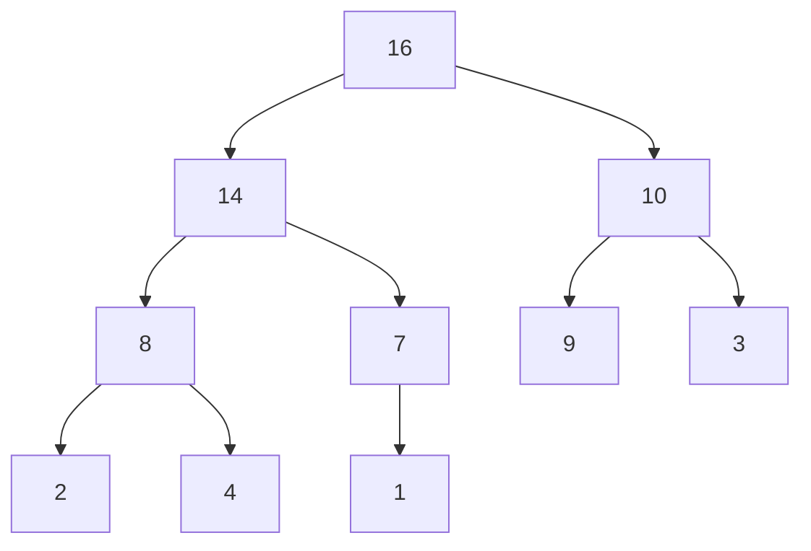

<Callout type="info">
  **이번 문서의 목표:** 이 파일을 다 읽으면 힙을 이용해 배열을 O(n log n)으로 정렬하는 과정을 손으로 추적하고, 비교 기반 정렬의 이론적 하한이 왜 O(n log n)인지 설명할 수 있다.
</Callout>

## 왜 또 다른 O(n log n) 정렬이 필요한가

07편에서 배운 병합 정렬은 항상 $O(n \log n)$을 보장하지만 $O(n)$의 추가 공간이 필요했다. 퀵 정렬은 추가 공간이 거의 필요 없지만 최악의 경우 $O(n^2)$까지 떨어질 수 있었다. **힙 정렬**(heap sort)은 이 둘의 장점을 동시에 취한다. 항상 $O(n \log n)$을 보장하면서도, 추가 배열 없이 원본 배열 안에서만 정렬을 끝내는 제자리 정렬이다.

이 편은 자료구조 과목에서 이미 배운 힙 자체를 처음부터 설명하지 않는다. 대신 힙을 "정렬 알고리즘의 도구"와 "특정 문제(k번째 원소, 우선순위 처리)의 해결 도구"로 응용하는 관점, 그리고 정렬 알고리즘 전체를 통틀어 "비교 기반 정렬은 도대체 얼마나 빨라질 수 있는가"라는 이론적 한계까지 정리한다.

## 힙 구조 복습: 완전 이진 트리 + 힙 속성

> **쉽게 말하면:** 힙은 부모가 항상 자식보다 크거나(최대 힙), 항상 작은(최소 힙) 완전 이진 트리다.

**힙**(heap)은 두 조건을 만족하는 자료구조다.

1. **완전 이진 트리**(complete binary tree): 마지막 레벨을 제외한 모든 레벨이 꽉 차 있고, 마지막 레벨은 왼쪽부터 순서대로 채워진다. 이 성질 덕분에 힙은 연결 노드가 아니라 배열 하나로 효율적으로 표현할 수 있다.
2. **힙 속성**(heap property): **최대 힙**(max heap)은 모든 부모 노드의 값이 자식 노드의 값보다 크거나 같다. **최소 힙**(min heap)은 반대로 모든 부모가 자식보다 작거나 같다.

배열로 힙을 표현할 때, 인덱스가 0부터 시작한다고 하면 인덱스 $i$인 노드의 부모·자식 인덱스는 다음 공식으로 바로 계산된다.

- 부모 인덱스: $\lfloor (i-1)/2 \rfloor$
- 왼쪽 자식 인덱스: $2i+1$
- 오른쪽 자식 인덱스: $2i+2$

이 공식 덕분에 힙은 포인터를 전혀 쓰지 않고 배열 인덱스 계산만으로 트리 구조를 흉내낼 수 있다는 것이 힙 정렬이 "제자리 정렬"이 될 수 있는 근본 이유다.

### 최대 힙 예시

배열 [16, 14, 10, 8, 7, 9, 3, 2, 4, 1]은 다음과 같은 최대 힙 트리를 이룬다.



**결과 해석:** 루트(16)는 항상 힙 전체에서 가장 큰 값이다. 이는 최대 힙의 정의로부터 바로 따라나오는 성질이며, 힙 정렬은 이 성질을 반복적으로 이용한다.

## 힙 정렬의 핵심 연산: 힙 재정렬(heapify)

> **쉽게 말하면:** 루트 하나가 힙 속성을 어겼을 때, 그 노드를 자식들과 비교해 아래로 계속 내려보내 다시 힙 모양을 맞추는 과정이다.

**heapify**(힙 재정렬)는 어떤 노드 하나가 힙 속성을 만족하지 않을 때(자식보다 작을 때), 그 노드를 자식 중 더 큰 쪽과 교환하고, 교환된 위치에서 다시 같은 검사를 반복해 내려가는 과정이다.

### heapify 의사코드 (최대 힙 기준)

```text
Heapify(A, n, i)
  largest = i
  left = 2*i + 1
  right = 2*i + 2
  if left < n and A[left] > A[largest]
    largest = left
  if right < n and A[right] > A[largest]
    largest = right
  if largest != i
    A[i]와 A[largest]를 교환
    Heapify(A, n, largest)
```

### 배열 [4, 10, 3, 5, 1]에서 인덱스 0(값 4)에 heapify 적용

| 단계 | 비교 대상 | 판단 | 조치 | 배열 상태 |
|---|---|---|---|---|
| 1 | A[0]=4, 왼쪽 A[1]=10, 오른쪽 A[2]=3 | 10이 가장 큼(largest=1) | A[0]과 A[1] 교환 | [10, 4, 3, 5, 1] |
| 2 (재귀, i=1) | A[1]=4, 왼쪽 A[3]=5, 오른쪽 A[4]=1 | 5가 가장 큼(largest=3) | A[1]과 A[3] 교환 | [10, 5, 3, 4, 1] |
| 3 (재귀, i=3) | A[3]=4, 자식 없음(왼쪽 인덱스 7이 범위 밖) | 자식이 없어 비교 불필요 | 종료 | [10, 5, 3, 4, 1] |

**결과 해석:** 값 4가 자기보다 큰 자식을 만날 때마다 자리를 바꾸며 트리를 따라 아래로 "가라앉는" 모습이다. 이 과정을 **sift-down**(또는 percolate-down)이라 부르기도 한다. heapify 한 번의 시간 복잡도는 트리의 높이에 비례하므로 $O(\log n)$이다.

## 힙 정렬 전체 과정: 힙 만들기 + 반복적으로 루트 꺼내기

> **쉽게 말하면:** 먼저 배열 전체를 최대 힙으로 만든 다음, 루트(최댓값)를 배열 맨 끝과 교환해 정렬 영역으로 밀어내고, 남은 부분에서 다시 힙을 맞추는 일을 반복한다.

### 힙 정렬 의사코드

```text
HeapSort(A, n)
  // 1단계: 배열 전체를 최대 힙으로 만든다
  for i = n/2 - 1 downTo 0
    Heapify(A, n, i)

  // 2단계: 루트를 꺼내 정렬 영역으로 보내고, 힙 크기를 줄여가며 재정렬
  for i = n-1 downTo 1
    A[0]와 A[i]를 교환
    Heapify(A, i, 0)   // 힙 크기를 i로 줄여서 재정렬 (A[i..n-1]은 이미 정렬 완료)
```

1단계에서 `i = n/2 - 1`부터 시작하는 이유는, 인덱스 $n/2$ 이상인 노드는 모두 자식이 없는 **리프 노드**이기 때문이다. 리프 노드는 이미 그 자체로 힙 속성을 만족하므로 heapify를 적용할 필요가 없고, 자식이 있는 노드부터 아래에서 위로 훑으면서 heapify하면 전체 배열이 힙이 된다.

### 배열 [4, 10, 3, 5, 1]로 전체 과정 추적

**1단계 (힙 만들기)**: $n=5$이므로 $i$는 $5/2-1=1$부터 $0$까지 내려간다.

| $i$ | Heapify 적용 결과 |
|---|---|
| 1 | A[1]=10, 자식 A[3]=5, A[4]=1 모두 10보다 작아 변화 없음 → [4, 10, 3, 5, 1] |
| 0 | 앞서 추적한 대로 [10, 5, 3, 4, 1] |

힙 만들기가 끝난 배열은 [10, 5, 3, 4, 1]이며, 이는 완전한 최대 힙이다.

**2단계 (반복적으로 루트 꺼내기)**

| $i$ | 교환 전 배열 | A[0]↔A[i] 교환 | Heapify(A, i, 0) 적용 결과 |
|---|---|---|---|
| 4 | [10, 5, 3, 4, 1] | [1, 5, 3, 4, 10] | [5, 4, 3, 1, 10] |
| 3 | [5, 4, 3, 1, 10] | [1, 4, 3, 5, 10] | [4, 1, 3, 5, 10] |
| 2 | [4, 1, 3, 5, 10] | [3, 1, 4, 5, 10] | [3, 1, 4, 5, 10] |
| 1 | [3, 1, 4, 5, 10] | [1, 3, 4, 5, 10] | [1, 3, 4, 5, 10] |

**결과 해석:** 매 단계마다 힙의 루트(그 시점 최댓값)가 배열 맨 뒤로 이동하며 정렬 영역이 오른쪽부터 한 칸씩 늘어난다. 최종 결과 [1, 3, 4, 5, 10]은 오름차순으로 완전히 정렬된 배열이다. 최대 힙을 쓰면 오름차순 정렬이 되는 이유는, 매번 "가장 큰 값"을 뒤로 밀어내기 때문이다.

### 힙 정렬의 복잡도 유도

- **힙 만들기(1단계)**: 언뜻 $n$개 노드마다 $O(\log n)$인 heapify를 하니 $O(n \log n)$처럼 보이지만, 실제로는 더 정교하게 분석하면 $O(n)$임이 알려져 있다(트리 아래쪽 노드가 훨씬 많고, 아래쪽 노드일수록 heapify가 내려갈 수 있는 높이가 짧기 때문이다). 다만 독학사 시험 수준에서는 "힙 만들기는 각 노드에 대해 최대 $O(\log n)$의 heapify를 최대 $n$번 수행하므로 $O(n \log n)$을 넘지 않는다"는 상한 설명으로도 충분하며, 정밀한 $O(n)$ 유도는 시험 범위를 넘는 심화 증명이다.
- **반복적으로 루트 꺼내기(2단계)**: 이 단계가 힙 정렬 복잡도의 핵심이다. 루트와 마지막 원소를 교환하는 것은 $O(1)$이지만, 그 후 매번 heapify를 호출해야 하고 heapify는 $O(\log n)$이 걸린다. 이 작업을 $n-1$번 반복하므로 2단계 전체는 $O(n \log n)$이다.

$$
T(n) = O(n) + O(n \log n) = O(n \log n)
$$

- **시간 복잡도**: 최선·평균·최악 모두 $O(n \log n)$ (병합 정렬처럼 입력 상태에 영향받지 않는다)
- **공간 복잡도**: 배열 인덱스 계산만으로 트리를 흉내내므로 추가 배열이 필요 없어 $O(1)$ → **제자리 정렬**
- **안정성**: 힙 재정렬 과정에서 값이 같아도 트리 구조상 먼 위치의 원소끼리 교환되어 순서가 바뀔 수 있다 → **불안정 정렬**

## 힙을 이용한 k번째 원소 선택

> **쉽게 말하면:** 배열 전체를 다 정렬할 필요 없이, "k번째로 큰 값 하나"만 필요하면 크기 k인 힙만 유지하면 된다.

배열에서 $k$번째로 큰 값을 찾는 문제를 생각해 보자. 배열 전체를 $O(n \log n)$에 정렬한 뒤 $k$번째 위치를 읽어도 되지만, $k$가 $n$보다 훨씬 작을 때는 다음과 같은 더 효율적인 방법이 있다.

1. 크기 $k$인 **최소 힙**을 만들고, 배열의 앞 $k$개 원소로 채운다.
2. 나머지 원소를 하나씩 힙의 루트(현재 힙에서 가장 작은 값)와 비교한다. 새 원소가 루트보다 크면 루트를 빼고 새 원소를 힙에 넣는다(작으면 무시).
3. 모든 원소를 다 처리하면, 힙에 남은 $k$개가 배열 전체에서 가장 큰 $k$개이고, 그 힙의 루트가 정확히 $k$번째로 큰 값이다.

이 방법의 시간 복잡도는 $n$개의 원소를 각각 최대 $O(\log k)$짜리 힙 연산으로 처리하므로 $O(n \log k)$다. $k$가 작을수록 전체 정렬($O(n \log n)$)보다 훨씬 빠르다.

**왜 최소 힙을 쓰는가**라는 질문이 시험에서 자주 나온다. "$k$번째로 큰 값"을 찾을 때, 힙에는 지금까지 본 것 중 **가장 큰 $k$개 후보**를 담아 두어야 한다. 이 후보군에서 새 원소가 들어올 자리가 있는지 확인하려면, 후보군 중 **가장 작은 값**(즉 언제든 후보에서 탈락할 값)을 빠르게 알아야 하므로 최소 힙(루트가 최솟값)을 쓰는 것이 자연스럽다.

## 우선순위 큐 응용

> **쉽게 말하면:** 힙은 "가장 급한 일을 항상 먼저 꺼낼 수 있는" 자료구조인 우선순위 큐를 구현하는 대표적인 방법이다.

**우선순위 큐**(priority queue)는 원소마다 우선순위가 있고, 꺼낼 때는 항상 우선순위가 가장 높은(또는 낮은) 원소를 먼저 꺼내는 자료구조다. 일반 큐가 "먼저 들어온 순서"로 꺼낸다면, 우선순위 큐는 "중요도 순서"로 꺼낸다.

힙은 우선순위 큐를 구현하는 표준적인 방법이다. 최대 힙을 쓰면 항상 루트가 최댓값(가장 급한 일)이므로 $O(1)$에 확인할 수 있고, 삽입·삭제는 각각 $O(\log n)$이다. 배열을 정렬 상태로 유지하는 방식(삽입마다 $O(n)$)이나 정렬 안 된 배열(최댓값 찾기마다 $O(n)$)보다 훨씬 효율적이다.

| 연산 | 정렬 안 된 배열 | 정렬된 배열 | 힙 기반 우선순위 큐 |
|---|---|---|---|
| 최댓값(최우선) 확인 | `O(n)` | `O(1)` | `O(1)` |
| 삽입 | `O(1)` | `O(n)` | `O(log n)` |
| 최댓값 꺼내기(삭제) | `O(n)` | `O(1)` (맨 끝이면) | `O(log n)` |

우선순위 큐는 12편에서 배울 프림 알고리즘(다음으로 연결할 가장 가중치가 작은 간선을 매번 골라야 함)과 13편의 다익스트라 알고리즘(다음으로 방문할 가장 거리가 짧은 정점을 매번 골라야 함)에서 핵심 도구로 다시 등장하므로, 이 편에서 "힙으로 최댓값·최솟값을 빠르게 유지하는 감각"을 확실히 잡아 두는 것이 중요하다.

## 비교 기반 정렬의 이론적 하한: 왜 O(n log n)의 벽이 있는가

> **쉽게 말하면:** 두 값을 직접 비교해서 순서를 정하는 정렬 방식은, 아무리 잘 만들어도 O(n log n)보다 빠를 수 없다는 것이 수학적으로 증명되어 있다.

병합 정렬·힙 정렬 모두 $O(n \log n)$이 최선이었고, 07편에서 본 것처럼 퀵 정렬의 평균도 $O(n \log n)$이다. 우연이 아니다. **값을 직접 비교해서 순서를 정하는 정렬**(비교 기반 정렬)은 어떤 알고리즘을 쓰더라도 최악의 경우 $\Omega(n \log n)$번의 비교가 필요하다는 사실이 증명되어 있다.

이 하한은 **결정 트리**(decision tree) 논증으로 유도한다. $n$개의 서로 다른 원소를 정렬하는 방법(순열)의 가짓수는 $n!$(n 팩토리얼)개다. 비교 기반 정렬 알고리즘은 매 비교마다 "크다/작다" 둘 중 하나의 결과를 얻으므로, 비교를 $h$번 하면 구분할 수 있는 경우의 수는 최대 $2^h$가지다. 알고리즘이 모든 입력 순서를 올바르게 정렬하려면 $n!$가지 경우를 모두 구분할 수 있어야 하므로 다음 부등식이 성립해야 한다.

$$
2^h \geq n!
$$

양변에 로그를 취하면 $h \geq \log_2(n!)$이 되고, 스털링 근사(02편에서 다룬 로그·지수 성장 비교의 연장선)를 적용하면 $\log_2(n!)$은 $\Theta(n \log n)$으로 근사된다. 따라서 어떤 비교 기반 정렬도 최악의 경우 $\Omega(n \log n)$번의 비교를 피할 수 없다.

이 하한이 중요한 이유는, 병합 정렬·힙 정렬이 $O(n \log n)$을 달성했다는 것이 "이 이론적 하한에 정확히 도달한 최적의 비교 기반 정렬"이라는 뜻이기 때문이다. 반면 09편에서 배울 기수·계수 정렬은 값을 직접 비교하지 않고 분류하는 방식이라 이 하한 자체가 적용되지 않아, 특정 조건에서는 $O(n)$까지도 가능하다.

```mermaid
flowchart TD
    A[정렬 알고리즘 O(n log n) 벽] --> B{비교 기반 정렬인가?}
    B -->|예| C["결정 트리 하한 적용<br/>최악 Ω(n log n) 필연"]
    B -->|아니오| D["값의 범위·자릿수를 이용<br/>O(n) 가능(09편 기수·계수 정렬)"]
```

## 정렬 알고리즘 종합 위치 정리

| 정렬 | 최악 시간 | 추가 공간 | 안정성 | 비교 기반 여부 |
|---|---|---|---|---|
| 선택·삽입·버블(06편) | `O(n^2)` | `O(1)` | 선택만 불안정 | 예 |
| 병합 정렬(07편) | `O(n log n)` | `O(n)` | 안정 | 예 |
| 퀵 정렬(07편) | `O(n^2)` | `O(log n)`–`O(n)` | 불안정 | 예 |
| 힙 정렬(이 편) | `O(n log n)` | `O(1)` | 불안정 | 예 |
| 기수·계수 정렬(09편) | 조건부 `O(n)` | `O(n+k)` | 안정 가능 | 아니오 |

이 표에서 힙 정렬의 위치가 두드러진다. 병합 정렬의 "항상 $O(n \log n)$ 보장"과 퀵 정렬·기본 정렬의 "제자리 정렬"이라는 두 장점을 동시에 갖춘 유일한 정렬이다. 다만 안정성을 포기했다는 점, 그리고 실전에서는 배열 접근 패턴(캐시 지역성)이 병합·퀵 정렬보다 불리해 상수 계수 면에서 더 느리게 동작하는 경우가 많다는 점도 함께 기억해야 한다.

## 자주 틀리는 점

- **heapify를 위에서 아래로 적용하는 순서를 반대로 안다.** 힙 만들기 단계는 반드시 마지막 비-리프 노드($n/2-1$)부터 시작해 인덱스 0까지 거꾸로 내려가며 적용해야 한다. 인덱스 0부터 시작하면 아직 자식 쪽이 힙이 아닌 상태라 잘못된 결과가 나온다.
- **힙 정렬이 안정 정렬이라고 착각한다.** 힙 재정렬 과정에서 값이 같은 원소도 트리 구조상 멀리 떨어진 위치와 교환될 수 있어 순서가 보장되지 않는다.
- **최대 힙을 만들면 내림차순으로 정렬된다고 착각한다.** 힙 정렬 2단계는 매번 "가장 큰 값을 배열 뒤쪽으로" 보내므로, 최대 힙을 쓰면 결과는 오름차순이 된다. 내림차순을 원하면 최소 힙을 쓴다.
- **k번째 원소 선택에서 최대 힙과 최소 힙을 반대로 쓴다.** $k$번째로 큰 값을 찾을 때는 "가장 작은 후보를 빠르게 아는 것"이 필요하므로 최소 힙을 쓴다. 반대로 $k$번째로 작은 값을 찾을 때는 최대 힙을 쓴다.
- **비교 기반 정렬의 하한 $\Omega(n \log n)$을 모든 정렬에 적용되는 절대 법칙이라 착각한다.** 이 하한은 "값을 비교해서 순서를 정하는" 정렬에만 적용되며, 기수·계수 정렬처럼 비교하지 않는 정렬에는 적용되지 않는다.

## 핵심 정리

- 힙은 완전 이진 트리 + 힙 속성을 만족하는 구조이며, 배열 인덱스만으로 부모·자식 관계를 계산할 수 있어 힙 정렬을 제자리 정렬로 만든다.
- 힙 정렬은 (1) 배열 전체를 힙으로 만들고 (2) 루트를 꺼내 뒤로 보내며 heapify를 반복하는 두 단계로 이루어지며, 최선·평균·최악 모두 $O(n \log n)$, 공간 $O(1)$, 불안정 정렬이다.
- 크기 $k$짜리 힙을 유지하면 $k$번째 원소 선택을 $O(n \log k)$에 풀 수 있고, 힙은 우선순위 큐의 표준 구현으로 프림·다익스트라 등 뒤에 나올 알고리즘의 핵심 도구다.
- 비교 기반 정렬은 결정 트리 논증에 의해 최악의 경우 $\Omega(n \log n)$번의 비교가 필연적이며, 병합·힙 정렬은 이 하한에 도달한 최적 알고리즘이다.
- 다음 09편에서는 이 하한을 우회하는 비교 아닌 정렬(기수·계수 정렬)을 다룬다.

## 마무리 복습

<Quiz
  questionNumber={1}
  question="배열로 표현한 최대 힙에서 인덱스 3(0부터 시작)에 있는 노드의 왼쪽 자식 인덱스는?"
  options={['5', '6', '7', '8']}
  correctAnswer={3}
  explanation="왼쪽 자식 인덱스는 2i+1 공식으로 구한다. i=3이면 2×3+1=7이다."
  optionExplanations={['공식을 잘못 적용한 값이다', '오른쪽 자식 인덱스(2i+2=8)와 혼동했거나 계산 오류다', '2×3+1=7로 정답이다', '오른쪽 자식 인덱스 2i+2=8이지 왼쪽이 아니다']}
/>

<Quiz
  questionNumber={2}
  question="힙 정렬에서 힙 만들기(build heap) 단계가 인덱스 n/2-1부터 시작하는 이유는?"
  options={['배열의 중간부터 정렬하는 것이 더 빠르기 때문이다', '인덱스 n/2 이상인 노드는 모두 자식이 없는 리프 노드라 heapify가 불필요하기 때문이다', '루트 노드부터 시작하면 오류가 나기 때문이다', '해당 인덱스가 항상 최댓값을 가지기 때문이다']}
  correctAnswer={2}
  explanation="인덱스가 n/2 이상인 노드는 자식이 없는 리프 노드이므로 이미 힙 속성을 만족한다. 따라서 자식이 있는 마지막 노드(n/2-1)부터 거꾸로 heapify를 적용하면 전체를 효율적으로 힙으로 만들 수 있다."
  optionExplanations={['정렬 자체를 하는 단계가 아니라 힙을 만드는 단계다', '리프 노드는 자식이 없어 재정렬이 불필요하다는 것이 정답 이유다', '루트부터 시작하면 자식 쪽이 아직 힙이 아니어서 문제가 생긴다', '해당 인덱스의 값과는 무관한 구조적 이유다']}
/>

<Quiz
  questionNumber={3}
  question="힙 정렬의 시간 복잡도와 안정성에 대한 설명으로 옳은 것은?"
  options={['최선·평균·최악 모두 O(n log n)이며 안정 정렬이다', '최선·평균·최악 모두 O(n log n)이며 불안정 정렬이다', '최악만 O(n^2)이고 안정 정렬이다', '입력 상태에 따라 O(n)부터 O(n^2)까지 달라진다']}
  correctAnswer={2}
  explanation="힙 정렬은 입력 상태와 무관하게 힙 재정렬을 n-1번 반복하므로 최선·평균·최악 모두 O(n log n)이며, 재정렬 과정에서 같은 값의 순서가 바뀔 수 있어 불안정 정렬이다."
  optionExplanations={['시간 복잡도는 맞지만 안정성이 틀렸다', '시간 복잡도와 안정성 모두 정확한 정답이다', '힙 정렬은 입력 상태에 영향받지 않는다', '힙 정렬은 입력 상태와 무관하게 항상 O(n log n)이다']}
/>

<Quiz
  questionNumber={4}
  question="배열에서 k번째로 큰 값을 O(n log k)에 찾으려 할 때 사용해야 할 힙의 종류와 크기로 옳은 것은?"
  options={['크기 n인 최대 힙', '크기 k인 최소 힙', '크기 k인 최대 힙', '크기 n인 최소 힙']}
  correctAnswer={2}
  explanation="크기 k인 최소 힙을 유지하면서, 힙의 루트(현재 후보 중 최솟값)보다 큰 원소가 들어오면 교체하는 방식으로 O(n log k)에 k번째로 큰 값을 구할 수 있다."
  optionExplanations={['크기 n짜리 힙은 전체 정렬과 다를 바 없어 O(n log n)이 된다', '크기 k인 최소 힙을 쓰는 것이 정답이다', '최대 힙을 쓰면 후보군에서 탈락시킬 값을 빠르게 찾기 어렵다', '크기 n짜리 힙은 목적에 비해 과도하게 크다']}
/>

<Quiz
  questionNumber={5}
  question="우선순위 큐를 힙으로 구현했을 때, 삽입과 최댓값 삭제의 시간 복잡도로 옳은 것은?"
  options={['둘 다 O(1)', '둘 다 O(n)', '둘 다 O(log n)', '삽입 O(n), 삭제 O(log n)']}
  correctAnswer={3}
  explanation="힙 기반 우선순위 큐는 삽입 시 새 원소를 맨 끝에 넣고 위로 올리는 과정(sift-up), 삭제 시 루트를 제거하고 맨 끝 값을 루트로 옮긴 뒤 heapify하는 과정이 모두 트리 높이에 비례해 O(log n)이다."
  optionExplanations={['정렬된 배열의 확인 연산과 혼동한 값이다', '정렬 안 된 배열의 연산 비용과 혼동한 값이다', '삽입·삭제 모두 트리 높이만큼 걸리는 O(log n)이 정답이다', '삽입도 O(log n)이지 O(n)이 아니다']}
/>

<Quiz
  questionNumber={6}
  question="비교 기반 정렬 알고리즘의 최악 시간 복잡도 하한이 Ω(n log n)임을 유도하는 논증의 이름은?"
  options={['재귀 트리 논증', '결정 트리 논증', '귀납법 논증', '분할정복 논증']}
  correctAnswer={2}
  explanation="n개 원소의 n!가지 순열을 모두 구분해야 하는 비교 기반 정렬의 하한은, 각 비교가 이진 분기를 만드는 결정 트리의 높이를 이용해 유도하며, 이를 결정 트리 논증이라 한다."
  optionExplanations={['재귀 트리는 점화식 T(n)의 복잡도를 유도할 때 쓰는 방법이다', '결정 트리 논증이 정답이다', '이 하한 증명은 수학적 귀납법이 아니라 정보이론적 논증이다', '분할정복은 정렬 알고리즘 설계 기법이지 하한 증명 방법이 아니다']}
/>

<Quiz
  questionNumber={7}
  question="기수 정렬(radix sort)이 비교 기반 정렬의 이론적 하한 Ω(n log n)을 우회할 수 있는 이유는?"
  options={['기수 정렬은 항상 배열이 이미 정렬되어 있다고 가정하기 때문이다', '기수 정렬은 원소끼리 직접 비교하지 않고 자릿수(범위)를 이용해 분류하기 때문이다', '기수 정렬은 재귀를 사용하지 않기 때문이다', '기수 정렬은 항상 정수만 정렬하기 때문이다']}
  correctAnswer={2}
  explanation="Ω(n log n) 하한은 두 값을 직접 비교해 순서를 정하는 비교 기반 정렬에만 적용된다. 기수 정렬은 값의 자릿수·범위를 이용해 분류하는 방식이라 이 하한의 적용 대상이 아니다."
  optionExplanations={['입력 상태에 대한 가정이 하한 우회의 이유가 아니다', '비교를 하지 않는다는 것이 하한 우회의 정확한 이유다', '재귀 사용 여부는 이 하한과 무관하다', '정수 정렬이라는 사실 자체가 하한 우회의 이유는 아니다']}
/>

## 참고 자료

- [국가평생교육진흥원 독학학위제](https://bdes.nile.or.kr) — 4단계 알고리즘 과목 출제범위 중 힙 정렬·정렬 하한 항목 확인
- [GeeksforGeeks: Heap Sort](https://www.geeksforgeeks.org/heap-sort/) — 힙 정렬 의사코드와 복잡도 분석, heapify 과정 참고
- [GeeksforGeeks: Lower bound on Comparison based sorting algorithms](https://www.geeksforgeeks.org/lower-bound-on-comparison-based-sorting-algorithms/) — 결정 트리 기반 Ω(n log n) 하한 유도 참고
