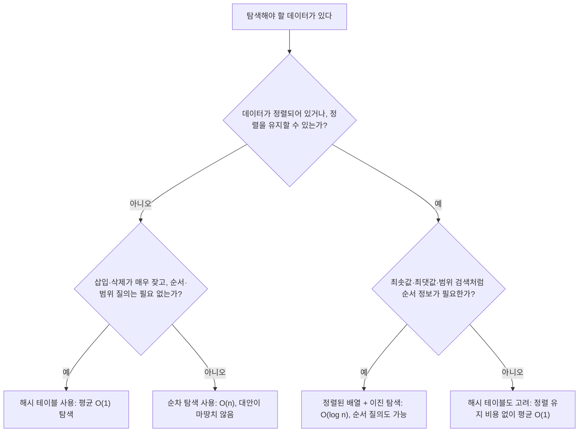

<Callout type="info">
  **이번 문서의 목표:** 이 문서를 다 읽으면 순차·이진 탐색의 시간 복잡도를 재귀 점화식으로 직접 유도할 수 있고, 비교 기반 탐색의 이론적 하한이 왜 O(log n)인지 결정 트리로 설명할 수 있으며, 해시 탐색의 평균 성능을 적재율(load factor)로 계산하고 자료 상황에 맞는 탐색 방법을 선택할 수 있다.
</Callout>

## 왜 탐색 방법이 여러 가지인가

"배열에서 특정 값을 찾는다"는 목표는 하나지만, **데이터가 어떤 상태로 준비되어 있는가**에 따라 쓸 수 있는 방법과 그 대가가 완전히 달라진다. 정렬되지 않은 데이터에는 순차 탐색밖에 쓸 수 없고, 정렬된 데이터라면 훨씬 빠른 이진 탐색을 쓸 수 있다. 정렬을 유지하는 비용 자체를 아예 피하고 싶다면 해시 테이블을 쓸 수도 있다. 독학사 4단계 시험은 이 세 방법의 절차 자체보다 **"이 상황에서는 어떤 방법을 선택해야 하는가", "그 복잡도는 왜 그 값인가"를 근거와 함께 설명할 수 있는가**를 더 깊이 묻는다. 이 편에서는 절차 추적은 짧게 다루고, 복잡도를 수식으로 유도하는 과정과 선택 기준에 집중한다.

> **쉽게 말하면:** 탐색은 "데이터를 미리 얼마나 손질해 두었는가"와 "그 손질에 어떤 대가를 치렀는가"를 맞바꾸는 문제다.

## 순차 탐색 — 손질 없이 바로 찾기

**순차 탐색**(sequential search, 선형 탐색)은 배열의 맨 앞부터 하나씩 확인해 목표값을 찾는 가장 단순한 방법이다. 정렬 여부와 무관하게 항상 쓸 수 있다는 것이 유일한 장점이다.

$$
\text{SequentialSearch}(A, \text{target}) = \begin{cases} i & A[i] = \text{target인 첫 번째 } i \\ \text{없음} & \text{끝까지 못 찾음} \end{cases}
$$

원소가 $n$개인 배열에서 목표값이 배열에 있을 확률이 균등하다고 가정하면, 평균적으로 배열의 중간쯤(약 $n/2$번째)에서 찾게 되므로 평균 비교 횟수는 $\frac{n+1}{2}$번이다. 하지만 **점근적 표기에서는 계수를 버리므로** 평균과 최악 모두 $O(n)$으로 같은 계열에 속한다. 정렬이 되어 있지 않을 때 순차 탐색은 선택의 여지가 없는 유일한 방법이라는 점에서, "느리지만 항상 쓸 수 있다"는 것 자체가 이 알고리즘의 존재 이유다.

## 이진 탐색 — 정렬을 대가로 절반씩 버린다

**이진 탐색**(binary search)은 배열이 **정렬되어 있을 때만** 쓸 수 있는 방법으로, 탐색 범위의 중간값과 목표값을 비교해 절반을 통째로 버리는 과정을 반복한다. 이 편에서는 절차 추적보다 **왜 시간 복잡도가 $O(\log n)$인지를 점화식으로 유도**하는 데 집중한다.

### 점화식 세우기

크기 $n$짜리 범위를 탐색하는 데 걸리는 비교 횟수를 $T(n)$이라 하자. 이진 탐색은 중간값과 한 번 비교한 뒤, 그 결과에 따라 크기가 정확히 절반(약 $n/2$)인 범위 하나만 남기고 나머지는 완전히 버린다. 그러므로 다음과 같은 점화식이 성립한다.

$$
T(n) = T\!\left(\frac{n}{2}\right) + 1
$$

- $T(n)$: 크기 $n$인 범위를 탐색하는 데 필요한 비교 횟수
- $T(n/2)$: 절반으로 줄어든 범위를 탐색하는 데 필요한 비교 횟수(재귀적으로 같은 문제)
- $+1$: 지금 범위에서 중간값과 한 번 비교하는 비용
- 기저 조건: $T(1) = 1$(범위에 원소가 하나 남으면 비교 한 번으로 종료)

### 반복 대입으로 점화식 풀기

이 점화식을 $n$이 $2^k$ 꼴이라고 가정하고 반복해서 대입하며 풀어본다.

$$
T(n) = T\!\left(\frac{n}{2}\right) + 1 = \left(T\!\left(\frac{n}{4}\right) + 1\right) + 1 = T\!\left(\frac{n}{4}\right) + 2
$$

이 패턴을 계속 반복하면, $j$번 대입했을 때 다음과 같은 형태가 된다.

$$
T(n) = T\!\left(\frac{n}{2^j}\right) + j
$$

범위 크기가 1이 되는 순간이 재귀가 끝나는 지점이므로, $\frac{n}{2^j} = 1$이 되는 $j$를 구하면 된다.

$$
2^j = n \quad \Longrightarrow \quad j = \log_2 n
$$

이 $j$를 대입하면 다음과 같은 결과를 얻는다.

$$
T(n) = T(1) + \log_2 n = 1 + \log_2 n
$$

상수항 1을 점근적 표기에서 버리면 최종적으로 다음과 같다.

$$
T(n) = O(\log n)
$$

이 유도 과정이 말해주는 것은 단순하다. **매번 절반을 버리는 전략이므로, 범위가 1이 될 때까지 절반을 나누는 횟수가 곧 비교 횟수이고, 그 횟수는 $n$을 몇 번 2로 나눠야 1이 되는지, 즉 $\log_2 n$이다.**

### 이진 탐색도 결정 트리 하한을 만족한다

09편에서 다룬 결정 트리 논증은 정렬뿐 아니라 **비교 기반 탐색**에도 그대로 적용된다. 정렬된 배열 $n$개 원소 중 목표값이 있을 수 있는 위치는 $n$가지, 없을 수도 있다는 경우까지 포함하면 총 $n+1$가지의 결과가 나올 수 있다. 비교 한 번마다 결과가 둘로 갈리는 이진 결정 트리이므로, 리프가 $n+1$개 이상이려면 트리 높이 $h$가 다음을 만족해야 한다.

$$
h \geq \log_2(n+1)
$$

이진 탐색은 이 하한을 정확히 달성하는 최적의 비교 기반 탐색 방법이다. 즉 "정렬된 배열에서 값의 존재 여부를 비교로만 확인하는" 어떤 알고리즘도 이진 탐색보다 적은 비교로 항상 성공할 수는 없다.

> **자주 틀리는 점:** 이진 탐색이 $O(\log n)$인 이유를 "그냥 절반씩 줄어드니까 로그"라고 뭉뚱그려 외우면, "왜 로그의 밑이 2인가", "왜 상수 1이 사라지는가" 같은 서술형 문항에 답하지 못한다. 점화식 $T(n) = T(n/2) + 1$을 직접 세우고 반복 대입으로 $\log_2 n$을 유도하는 과정 자체를 설명할 수 있어야 한다.

## 해시 탐색 — 정렬 대신 계산으로 위치를 찾는다

**해싱**(hashing)은 정렬을 유지하는 비용 자체를 피하고, 값을 해시 함수 $h(k)$로 계산해 바로 그 위치에 저장·탐색하는 방법이다. 해시 함수 자체와 체이닝·개방 주소법의 동작 절차는 자료구조 과목에서 이미 다뤘으므로(연결리스트·개방 주소 탐사의 구체적인 삽입 과정은 자료구조 2단계 16편 참고), 이 편에서는 **평균 성능이 왜 그렇게 되는지를 수식으로 유도**하는 데 집중한다.

### 적재율이라는 하나의 숫자로 성능을 예측한다

해시 테이블의 성능을 결정하는 가장 중요한 값은 **적재율**(load factor) $\alpha$다.

$$
\alpha = \frac{n}{m}
$$

- $n$: 테이블에 실제로 저장된 키의 개수
- $m$: 테이블의 전체 칸(슬롯) 수
- $\alpha$: 칸 하나당 평균적으로 몇 개의 키가 몰려 있는지를 나타내는 비율

**체이닝**(chaining) 방식에서는 키들이 균등하게 분산되어 있다고 가정하면, 각 칸의 연결리스트 길이는 평균적으로 $\alpha$개가 된다. 어떤 키를 탐색할 때는 해시값을 계산하는 데 $O(1)$, 그 칸의 리스트를 훑는 데 평균 $O(\alpha)$가 걸리므로, 체이닝의 평균 탐색 시간은 다음과 같다.

$$
O(1 + \alpha)
$$

$\alpha$가 항상 어떤 상수 이하로 유지되도록 관리하면(예: 저장된 키가 칸 수의 1.5배를 넘으면 테이블 크기를 늘리는 방식), 이 값은 사실상 $O(1)$에 가까워진다. 이것이 "해시 테이블은 평균 $O(1)$에 동작한다"는 말의 정확한 근거다.

**개방 주소법**(open addressing)에서는 테이블 안에서만 빈칸을 찾아야 하므로 $\alpha$가 1을 넘을 수 없다($n \leq m$). 선형 조사법을 균등 해싱으로 가정했을 때, 삽입에 실패할 확률 없이 성공하기까지 평균 탐사 횟수는 대략 다음 식으로 근사된다.

$$
\frac{1}{1-\alpha}
$$

이 식이 말해주는 함정은 명확하다. $\alpha = 0.5$(테이블이 절반 찼을 때)면 평균 탐사 횟수는 $\frac{1}{0.5} = 2$번이지만, $\alpha = 0.9$(90퍼센트 참)면 $\frac{1}{0.1} = 10$번으로 급격히 늘어난다. **적재율이 1에 가까워질수록 평균 탐사 횟수가 폭발적으로 증가한다**는 것이 개방 주소법의 핵심 약점이다.

| 적재율 $\alpha$ | 0.5 | 0.7 | 0.9 | 0.99 |
|---|---|---|---|---|
| 평균 탐사 횟수(개방 주소법 근사, $1/(1-\alpha)$) | 2 | 약 3.3 | 10 | 100 |

### 최악의 경우는 여전히 O(n)이다

평균 성능이 아무리 좋아도, 모든 키가 해시 함수 계산 결과 같은 칸으로 몰리는 최악의 경우(해시 함수 설계가 나쁘거나, 공격자가 의도적으로 충돌을 유발하는 경우)라면 체이닝은 하나의 긴 연결리스트를 순차 탐색하는 것과 같아져 $O(n)$이 되고, 개방 주소법도 테이블 전체를 훑어야 할 수 있어 $O(n)$이 된다.

| 방법 | 평균 시간 | 최악 시간 |
|------|-----------|-----------|
| 순차 탐색 | $O(n)$ | $O(n)$ |
| 이진 탐색 | $O(\log n)$ | $O(\log n)$ |
| 해시 탐색(체이닝) | $O(1+\alpha)$, $\alpha$를 상수로 관리하면 $O(1)$ | $O(n)$(모든 키가 한 칸에 몰릴 때) |
| 해시 탐색(개방 주소법) | $O\!\left(\frac{1}{1-\alpha}\right)$ | $O(n)$(테이블이 거의 다 찼을 때) |

> **자주 틀리는 점:** "해시 탐색은 항상 $O(1)$이다"라고 단정하면 안 된다. 이는 **적재율이 상수로 관리되고 해시 함수가 키를 고르게 분산시킨다는 조건 아래에서의 평균 시간**이며, 최악의 경우는 여전히 $O(n)$이다. "해시 테이블은 최악의 경우에도 O(1)을 보장한다"는 보기는 항상 틀린 진술이다.

## 무엇을 선택해야 하는가 — 상황별 판단 기준

세 방법의 복잡도만 외우는 것으로는 시험에서 "이런 상황에는 어떤 자료 구조·탐색을 써야 하는가"를 묻는 응용 문항에 대응하기 어렵다. 판단은 보통 다음 순서로 이루어진다.

- **정렬을 유지할 필요가 없고 순서·범위 검색이 필요 없다면** 해시 테이블이 평균적으로 가장 빠르다. 다만 최악의 경우($O(n)$)에 대비해 해시 함수 품질과 적재율 관리가 필요하다.
- **"5보다 크고 20보다 작은 값을 모두 찾아라"처럼 범위·순서 질의가 필요하다면** 해시 테이블은 적합하지 않다(해시 함수는 순서를 보존하지 않는다). 정렬된 배열이나 균형 탐색 트리(자료구조 2단계 14편 참고)를 이진 탐색과 함께 써야 한다.
- **데이터가 정렬되어 있지 않고, 정렬을 유지하는 비용(삽입할 때마다 재정렬)이 검색 이득보다 크다면** 순차 탐색이 오히려 합리적인 선택일 수 있다. 예를 들어 탐색을 딱 한 번만 할 데이터라면, 정렬($O(n \log n)$) 후 이진 탐색($O(\log n)$)을 하는 것보다 그냥 순차 탐색 한 번($O(n)$)이 총 비용이 더 적다.

> **자주 틀리는 점:** "정렬만 되어 있으면 무조건 이진 탐색이 최선이다"라고 단정하면 안 된다. 탐색을 **딱 한 번만** 수행할 것이라면, 정렬 비용 $O(n \log n)$까지 합산했을 때 총 비용은 순차 탐색 한 번의 $O(n)$보다 오히려 크다. 이진 탐색이 유리해지는 것은 **같은 정렬된 데이터에 대해 탐색을 여러 번 반복할 때**다.

## 자주 틀리는 점

- **이진 탐색의 O(log n)을 점화식 없이 직관으로만 설명하는 실수**: 서술형 문항에서는 $T(n) = T(n/2) + 1$을 세우고 $\log_2 n$을 유도하는 과정 자체를 요구할 수 있다.
- **적재율 $\alpha$를 저장된 키 개수로 착각하는 실수**: $\alpha$는 키 개수 자체가 아니라 키 개수를 테이블 크기로 나눈 **비율**이다.
- **해시 탐색이 항상 최악에도 O(1)이라고 착각하는 실수**: 평균은 O(1)에 가까울 수 있지만, 최악은 여전히 O(n)이다.
- **정렬되어 있으면 무조건 이진 탐색이 이득이라고 착각하는 실수**: 탐색을 한 번만 한다면 정렬 비용까지 합쳐 순차 탐색보다 총 비용이 클 수 있다.

## 핵심 정리

- 순차 탐색은 정렬 여부와 무관하게 $O(n)$이며, 데이터가 정렬되어 있지 않을 때의 유일한 대안이다.
- 이진 탐색은 점화식 $T(n)=T(n/2)+1$을 반복 대입해 $O(\log n)$을 유도할 수 있고, 이는 비교 기반 탐색의 결정 트리 하한 $\log_2(n+1)$에 정확히 도달한 최적값이다.
- 해시 탐색의 평균 성능은 적재율 $\alpha=n/m$으로 결정되며, 체이닝은 $O(1+\alpha)$, 개방 주소법은 대략 $O(1/(1-\alpha))$이지만, 두 방식 모두 최악의 경우 $O(n)$을 피할 수 없다.
- 어떤 방법을 선택할지는 "정렬 유지가 가능한가", "순서·범위 질의가 필요한가", "탐색을 몇 번 반복할 것인가"를 기준으로 판단한다.

## 마무리 복습

<Quiz
  questionNumber={1}
  question="이진 탐색의 점화식 T(n) = T(n/2) + 1을 반복 대입으로 풀었을 때 최종적으로 얻는 시간 복잡도는?"
  options={['O(n)', 'O(n log n)', 'O(log n)', 'O(1)']}
  correctAnswer={3}
  explanation="점화식을 j번 대입하면 T(n) = T(n/2^j) + j가 되고, 범위 크기가 1이 되는 조건 n/2^j = 1에서 j = log2 n을 얻는다. 이를 대입하면 T(n) = 1 + log2 n이 되어 상수를 버리면 O(log n)이다."
  optionExplanations={['O(n)은 순차 탐색의 복잡도다.', 'O(n log n)은 비교 기반 정렬의 하한이지 탐색과는 다른 값이다.', '정답. 반복 대입으로 j = log2 n을 유도해 O(log n)을 얻는다.', 'O(1)은 상수 시간으로, 범위를 절반씩 줄이는 재귀 구조와 맞지 않는다.']}
/>

<Quiz
  questionNumber={2}
  question="비교 기반 탐색의 결정 트리 하한에 대한 설명으로 옳은 것은?"
  options={['정렬된 배열 n개 원소에서 값의 존재 여부를 비교로 확인하려면 최소 log2(n+1)번의 비교가 필요할 수 있다', '비교 기반 탐색은 항상 O(1)에 끝낼 수 있다', '결정 트리 하한은 정렬 여부와 무관하게 순차 탐색에도 그대로 적용되어 순차 탐색도 O(log n)이다', '이진 탐색은 이 하한보다 더 적은 비교로 항상 끝낼 수 있다']}
  correctAnswer={1}
  explanation="정렬된 배열에서 목표값의 위치(n가지)와 없음(1가지)을 합쳐 n+1가지의 결과를 구분해야 하므로, 이진 결정 트리는 높이 h가 log2(n+1) 이상이어야 한다. 이진 탐색은 이 하한을 정확히 달성한다."
  optionExplanations={['정답. n+1가지 결과를 구분하려면 최소 log2(n+1)번의 비교가 필요하다는 것이 하한이다.', '탐색도 결국 비교 횟수에 따라 시간이 걸리며 O(1)을 보장하지 않는다.', '순차 탐색은 정렬 여부를 이용하지 않고 하나씩 확인하는 방식이라 이 하한을 달성하지 못하고 O(n)이 걸린다.', '이진 탐색은 이 하한과 같은 O(log n)을 달성하는 최적 방법이며, 하한보다 더 적은 비교로는 이론적으로 불가능하다.']}
/>

<Quiz
  questionNumber={3}
  question="해시 테이블의 적재율(load factor) α = n/m에 대한 설명으로 옳은 것은?"
  options={['α는 테이블에 저장된 키의 개수 그 자체를 의미한다', 'α는 저장된 키 개수 n을 테이블 칸 수 m으로 나눈 비율이며, 체이닝의 평균 탐색 시간은 O(1+α)로 근사된다', 'α는 항상 0과 1 사이의 값만 가질 수 있다', 'α가 커질수록 해시 탐색의 평균 성능이 항상 더 좋아진다']}
  correctAnswer={2}
  explanation="적재율 α는 저장된 키 개수 n을 테이블 칸 수 m으로 나눈 비율로, 칸 하나에 평균적으로 몇 개의 키가 몰리는지를 나타낸다. 체이닝에서는 이 값이 곧 평균 리스트 길이가 되어 평균 탐색 시간이 O(1+α)가 된다."
  optionExplanations={['α는 키 개수(n)가 아니라 n을 m으로 나눈 비율이다.', '정답. α의 정의와 체이닝 평균 탐색 시간 공식이 정확히 일치한다.', '체이닝에서는 리스트가 계속 길어질 수 있어 α가 1을 넘을 수 있다(개방 주소법에서만 1 이하로 제한된다).', 'α가 커질수록(테이블이 꽉 찰수록) 평균 탐사·탐색 시간은 오히려 늘어난다.']}
/>

<Quiz
  questionNumber={4}
  question="개방 주소법에서 적재율 α가 0.5에서 0.9로 증가할 때 평균 탐사 횟수(1/(1-α) 근사)의 변화로 옳은 것은?"
  options={['2번에서 10번으로, 완만하게 증가한다', '2번에서 10번으로, 급격하게 증가한다', '변화가 거의 없다', '오히려 감소한다']}
  correctAnswer={2}
  explanation="1/(1-α)에 α=0.5를 대입하면 1/0.5=2, α=0.9를 대입하면 1/0.1=10이 되어 값이 5배로 뛴다. α가 1에 가까워질수록 분모(1-α)가 0에 가까워져 평균 탐사 횟수가 폭발적으로 증가한다."
  optionExplanations={['2에서 10으로의 변화는 완만한 증가가 아니라 급격한 증가다.', '정답. 1/(1-α) 공식에 따라 적재율이 1에 가까워질수록 평균 탐사 횟수가 급격히 커진다.', '2배가 아니라 5배로 뛰는 뚜렷한 변화가 있다.', '적재율이 커질수록(테이블이 더 찰수록) 평균 탐사 횟수는 증가하지 감소하지 않는다.']}
/>

<Quiz
  questionNumber={5}
  question="정렬되지 않은 데이터에 대해 탐색을 단 한 번만 수행해야 하는 상황에서 가장 합리적인 선택은?"
  options={['먼저 O(n log n)에 정렬한 뒤 O(log n) 이진 탐색을 수행한다', '정렬 없이 O(n) 순차 탐색을 바로 수행한다', '항상 해시 테이블을 새로 구축한 뒤 탐색한다', '어떤 방법을 쓰든 총 비용은 동일하다']}
  correctAnswer={2}
  explanation="탐색을 한 번만 할 것이라면, 정렬 비용 O(n log n)까지 합산한 총 비용이 순차 탐색 한 번의 O(n)보다 크다. 이진 탐색이 유리해지는 것은 같은 정렬된 데이터에 대해 탐색을 여러 번 반복할 때다."
  optionExplanations={['정렬 비용까지 합치면 총 비용이 순차 탐색보다 더 커진다.', '정답. 한 번만 탐색할 것이라면 정렬 비용을 들이지 않는 순차 탐색이 총 비용 면에서 더 합리적이다.', '해시 테이블을 구축하는 데도 O(n)의 비용이 들어, 한 번만 탐색할 것이라면 순차 탐색과 비교해 이득이 없다.', '수행 횟수(한 번 vs 여러 번)에 따라 총 비용이 달라지므로 항상 동일하지 않다.']}
/>

<Quiz
  questionNumber={6}
  question="해시 탐색과 이진 탐색을 비교한 설명으로 옳지 않은 것은?"
  options={['해시 탐색은 순서·범위 검색(예: 특정 범위의 값 모두 찾기)에 적합하지 않다', '이진 탐색은 데이터가 정렬되어 있어야 하고, 정렬 상태를 계속 유지하는 비용이 추가로 든다', '해시 탐색은 평균적으로 O(1)에 가깝지만 최악의 경우 O(n)이 될 수 있다', '해시 탐색과 이진 탐색은 최악의 경우 복잡도가 완전히 동일하므로 아무 상황에서나 서로 대체할 수 있다']}
  correctAnswer={4}
  explanation="해시 탐색의 최악 복잡도는 O(n)인 반면 이진 탐색의 최악 복잡도는 O(log n)으로 서로 다르며, 해시 탐색은 순서 정보를 보존하지 않아 범위 검색에 적합하지 않다는 근본적인 차이가 있어 상황에 따라 대체할 수 없다."
  optionExplanations={['옳은 설명이다. 해시 함수는 값을 흩어 놓을 뿐 순서를 보존하지 않는다.', '옳은 설명이다. 삽입 시마다 정렬 순서를 유지해야 하는 비용이 있다.', '옳은 설명이다. 평균과 최악 복잡도가 다르다는 것이 해시 탐색의 특징이다.', '정답(옳지 않은 설명). 최악 복잡도가 서로 다르고(O(n) vs O(log n)), 범위 검색 가능 여부도 달라 상황에 따라 적합한 방법이 다르다.']}
/>

## 참고 자료

- [국가평생교육진흥원 독학학위제](https://bdes.nile.or.kr) — 알고리즘 과목 출제기준·평가영역 확인용 공식 안내.
- [GeeksforGeeks — Binary Search](https://www.geeksforgeeks.org/binary-search/) — 이진 탐색의 복잡도 유도와 결정 트리 하한 관련 개념 참고 자료.
