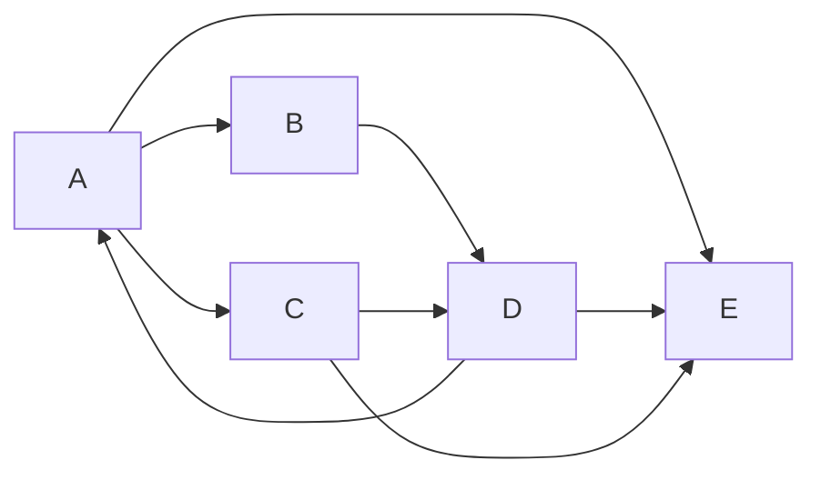
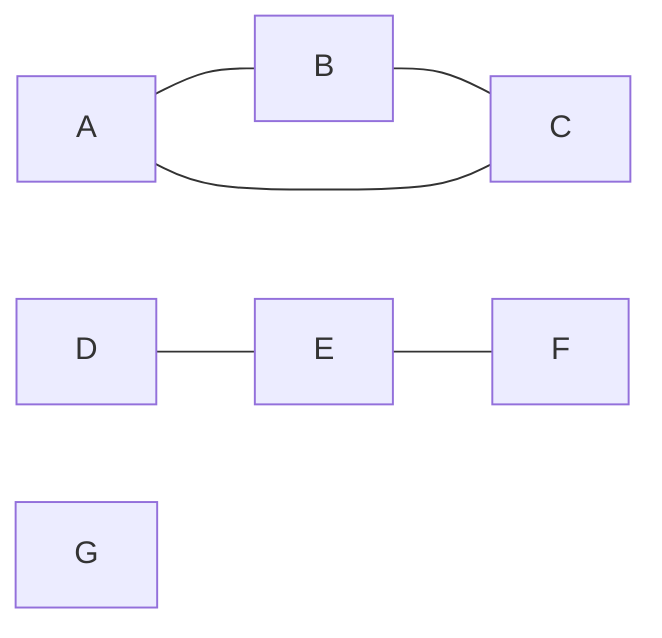

<Callout type="info">
  **이번 문서의 목표:** 이 문서를 다 읽으면 DFS의 발견 시각·종료 시각을 이용해 방향 그래프의 간선을 트리·역방향·순방향·교차 간선 네 가지로 분류할 수 있고, BFS로 그래프의 연결 요소를 모두 찾아낼 수 있으며, DFS·BFS의 시간 복잡도가 왜 정확히 O(V+E)인지를 차수의 합을 이용해 직접 증명할 수 있다.
</Callout>

## 이 편에서 다루는 범위

그래프의 정점·간선 용어, 인접행렬·인접리스트 표현, DFS·BFS의 기본 절차와 방문 순서 추적은 자료구조 2단계 15편에서 이미 다뤘다. 독학사 4단계 알고리즘 과목에서는 이 기본 절차를 **"어떻게 구현하는가"** 가 아니라 **"복잡도가 왜 그 값인지, 방문 기록을 어떻게 더 정밀하게 활용해 그래프의 구조적 성질(사이클, 연결성, 간선의 역할)을 판별하는가"** 의 관점에서 다시 짚는다. 특히 시험에서 자주 나오는 **방향 그래프의 간선 분류**(발견·종료 시각 활용)는 위상 정렬(12편)과 강연결요소 판별의 기초가 되므로 이 편에서 깊이 다룬다.

> **쉽게 말하면:** DFS·BFS 자체는 "어떤 순서로 정점을 훑는가"의 문제였다면, 4단계에서는 그 순서를 기록한 시각 정보로 그래프의 숨은 구조를 읽어내는 것이 핵심이다.

## 발견 시각과 종료 시각 — DFS에 타임스탬프를 붙인다

DFS를 실행하면서 각 정점 $v$에 두 개의 시각을 기록한다.

- **발견 시각**(discovery time) $d[v]$: 그 정점을 처음 방문한 순간의 시각
- **종료 시각**(finish time) $f[v]$: 그 정점에서 갈 수 있는 이웃을 모두 확인하고 재귀 호출에서 완전히 빠져나오는(그 정점의 처리가 끝나는) 순간의 시각

시각은 전체 DFS 실행 동안 하나의 카운터를 두고, 정점을 발견하거나 종료할 때마다 1씩 증가시켜 기록한다. 정점의 상태도 세 가지 색으로 구분한다.

- **흰색(white)**: 아직 발견되지 않은 정점
- **회색(gray)**: 발견되었지만 아직 종료되지 않은 정점(현재 재귀 호출 스택에 남아 있는, 즉 "탐색 중인 경로 위에 있는" 정점)
- **검은색(black)**: 종료되어 그 정점에서 갈 수 있는 곳을 모두 확인한 정점

## 방향 그래프에서 DFS 추적하기

다음 방향 그래프를 정점 A부터 DFS로 탐색한다. 각 정점의 이웃은 알파벳 순서로 확인한다.

<Steps>
1. **A 발견**: $d[A]=1$. A는 회색이 된다. A의 이웃 B, C, E를 순서대로 확인한다.
2. **B 발견(A→B, 이웃 B가 흰색)**: $d[B]=2$. A→B는 **트리 간선**이 된다. B의 이웃 D를 확인한다.
3. **D 발견(B→D, 이웃 D가 흰색)**: $d[D]=3$. B→D는 **트리 간선**이 된다. D의 이웃 A, E를 순서대로 확인한다.
4. **D→A 확인**: A는 아직 회색(현재 재귀 스택에 남아 있는 조상)이다. 흰색이 아니므로 트리 간선이 될 수 없고, **조상을 가리키므로 역방향 간선**이 된다.
5. **E 발견(D→E, 이웃 E가 흰색)**: $d[E]=4$. D→E는 **트리 간선**이 된다. E는 이웃이 없다.
6. **E 종료**: $f[E]=5$. E가 검은색이 된다.
7. **D 종료**: 더 확인할 이웃이 없다. $f[D]=6$. D가 검은색이 된다.
8. **B 종료**: 더 확인할 이웃이 없다. $f[B]=7$. B가 검은색이 된다.
9. **A→C 확인(이웃 C가 흰색)**: $d[C]=8$. A→C는 **트리 간선**이 된다. C의 이웃 D, E를 순서대로 확인한다.
10. **C→D 확인**: D는 이미 검은색(종료됨)이고, D의 구간 $[3,6]$은 C의 발견 시각 $8$보다 앞서 완전히 끝나 있다(조상도 자손도 아니다). **교차 간선**이 된다.
11. **C→E 확인**: E도 이미 검은색이고 마찬가지로 C보다 먼저 완전히 끝나 있다. **교차 간선**이 된다.
12. **C 종료**: $f[C]=9$. C가 검은색이 된다.
13. **A→E 확인**: A가 다시 이웃 목록을 이어서 확인하면 E는 이미 검은색이다. 하지만 E의 발견·종료 시각 구간 $[4,5]$가 A의 구간 $[1, \cdot]$ 안에 완전히 포함되어 있으므로(즉 E는 A의 **자손**이다) 이 간선은 조상→자손을 가리키는 **순방향 간선**이 된다.
14. **A 종료**: 모든 이웃 확인이 끝났다. $f[A]=10$. A가 검은색이 된다.
</Steps>

전체 발견·종료 시각을 표로 정리한다.

| 정점 | 발견 시각 $d$ | 종료 시각 $f$ | 구간 $[d, f]$ |
|------|----------------|----------------|-----------------|
| A | 1 | 10 | $[1, 10]$ |
| B | 2 | 7 | $[2, 7]$ |
| C | 8 | 9 | $[8, 9]$ |
| D | 3 | 6 | $[3, 6]$ |
| E | 4 | 5 | $[4, 5]$ |

### 간선 네 가지 분류

이 구간을 이용하면 어떤 두 정점의 관계(조상-자손 관계인지, 완전히 무관한지)를 시간 구간의 **포함 관계**만으로 판정할 수 있다. 이를 **괄호 정리**(parenthesis theorem)라 부르는데, 두 정점의 구간은 항상 완전히 포함되거나(하나가 다른 하나의 조상), 완전히 겹치지 않아야 한다(서로 무관). 예를 들어 C의 구간 $[8,9]$와 D의 구간 $[3,6]$은 전혀 겹치지 않으므로 두 정점은 조상-자손 관계가 아니다.

| 간선 | 분류 | 판정 근거 |
|------|------|------------|
| A→B, B→D, A→C, D→E | 트리 간선(tree edge) | 이웃을 처음 방문했을 때(흰색일 때) 생기는 간선 |
| D→A | 역방향 간선(back edge) | 목적지가 현재 회색(조상, 아직 재귀 스택 위)인 간선 |
| A→E | 순방향 간선(forward edge) | 목적지가 검은색이면서, 목적지의 구간이 출발지 구간에 완전히 포함되는(자손인) 간선 |
| C→D, C→E | 교차 간선(cross edge) | 목적지가 검은색이면서, 두 구간이 서로 겹치지 않는(조상도 자손도 아닌) 간선 |

> **쉽게 말하면:** 트리 간선은 "새로운 길을 처음 밟는 것", 역방향 간선은 "왔던 길로 되돌아가는 것", 순방향 간선은 "지름길로 자손에게 바로 가는 것", 교차 간선은 "전혀 상관없는 다른 가지로 건너뛰는 것"이다.

### 왜 이 분류가 시험에서 중요한가

이 분류는 단순한 용어 암기가 아니라, 그래프의 구조적 성질을 판정하는 데 직접 쓰인다.

- **사이클 판별**: 방향 그래프에 **역방향 간선이 하나라도 있으면 사이클이 존재한다.** 위 예시에서 D→A가 역방향 간선이므로, A→B→D→A로 돌아오는 사이클이 실제로 존재한다. 반대로 역방향 간선이 하나도 없다면 그 방향 그래프는 **비순환 방향 그래프**(Directed Acyclic Graph, DAG)이며, 이는 12편의 위상 정렬이 가능한 조건과 정확히 일치한다.
- **무방향 그래프에는 순방향·교차 간선이 없다**: 무방향 그래프를 DFS로 탐색하면 간선은 트리 간선과 역방향 간선 두 가지로만 분류된다. 간선의 방향이 없으므로 "자손에게 지름길로 간다"거나 "전혀 다른 가지로 건너뛴다"는 구분 자체가 성립하지 않기 때문이다.

> **자주 틀리는 점:** "역방향 간선이 있으면 무조건 사이클이다"는 방향 그래프에서만 성립한다. 무방향 그래프에서는 자기 자신이 아닌 부모로 되돌아가는 간선(이미 방문한 이웃이지만 그것이 방금 온 부모인 경우)까지 역방향 간선처럼 셀 수 있어, "부모로 돌아가는 간선인지" 여부를 별도로 확인해야 진짜 사이클인지 알 수 있다.

## BFS로 연결 요소 모두 찾기

다음 **무방향** 그래프는 서로 이어지지 않은 세 덩어리로 나뉘어 있다.

어떤 정점 하나에서 BFS(또는 DFS)를 한 번 실행하면, 그 정점과 간선으로 이어진 정점들만 방문된다. 방문되지 않고 남은 정점이 있다면, 그 정점에서 다시 BFS를 실행하는 과정을 **모든 정점이 방문될 때까지 반복**하면 그래프 전체의 **연결 요소**(connected component, 서로 이어진 정점들의 최대 묶음)를 모두 찾을 수 있다.

| 시도 | 시작 정점 | 방문된 정점(BFS 결과) | 남은 미방문 정점 |
|------|-----------|--------------------------|---------------------|
| 1 | A | A, B, C | D, E, F, G |
| 2 | D(남은 것 중 임의로 선택) | D, E, F | G |
| 3 | G(남은 것 중 임의로 선택) | G | (없음) |

세 번의 BFS 실행으로 이 그래프가 **정확히 세 개의 연결 요소** $\{A, B, C\}$, $\{D, E, F\}$, $\{G\}$로 나뉜다는 것을 확인했다. 정점 G처럼 어떤 간선도 갖지 않는 정점(**고립 정점**, isolated vertex) 하나도 그 자체로 크기 1인 연결 요소가 된다는 점에 주의한다.

> **자주 틀리는 점:** "정점이 $n$개면 연결 요소도 그래프 하나에 하나만 있다"고 착각하면 안 된다. 간선으로 전혀 연결되지 않은 정점들이 있으면 연결 요소는 여러 개일 수 있고, 극단적으로 간선이 하나도 없는 그래프라면 정점 개수만큼($n$개) 연결 요소가 생긴다.

## DFS·BFS의 시간 복잡도를 직접 유도하기

DFS와 BFS 모두 시간 복잡도가 $O(V+E)$($V$는 정점 수, $E$는 간선 수)라는 것은 자료구조 2단계에서 결과만 확인했다. 여기서는 **왜 정확히 이 값이 되는지**를 "각 정점의 인접 리스트를 몇 번 스캔하는가"를 세어서 증명한다.

DFS·BFS는 두 종류의 작업을 한다.

1. **정점 방문**: 모든 정점을 정확히 한 번씩 발견(그리고 종료) 처리한다. 정점이 $V$개이므로 이 작업의 총 비용은 $O(V)$다.
2. **인접 리스트 스캔**: 한 정점을 처리할 때, 그 정점의 인접 리스트에 있는 이웃을 전부 한 번씩 확인한다.

두 번째 작업의 총 비용을 정확히 계산하려면, "모든 정점의 인접 리스트 길이를 다 더하면 얼마인가"를 알아야 한다. 정점 $v$의 인접 리스트 길이는 정확히 그 정점의 **차수**(degree) $\deg(v)$와 같다. 그러므로 전체 스캔 비용은 다음과 같다.

$$
\sum_{v \in V} \deg(v)
$$

이 합을 계산하는 것이 바로 그래프 이론에서 **악수 보조정리**(handshaking lemma, 15편 이산수학류 과목에서 증명을 다루는 정리이며 여기서는 결과만 사용한다)로 알려진 성질과 연결된다. 무방향 그래프에서 간선 하나는 양 끝 두 정점의 차수에 각각 1씩 기여하므로 다음이 성립한다.

$$
\sum_{v \in V} \deg(v) = 2E
$$

- $V$: 정점 집합, $\deg(v)$: 정점 $v$에 연결된 간선의 개수
- $E$: 전체 간선의 개수
- $2E$: 간선 하나가 두 정점의 차수에 각각 기여하므로 차수의 합은 간선 수의 정확히 2배

방향 그래프에서는 간선 하나가 출발 정점의 진출차수에만 기여하므로, 진출차수의 합은 $E$(간선 수 그대로)가 된다. 어느 쪽이든 인접 리스트 스캔의 총 비용은 $O(E)$다. 정점 처리 비용 $O(V)$와 스캔 비용 $O(E)$를 더하면 다음과 같다.

$$
T(V, E) = O(V) + O(E) = O(V+E)
$$

> **쉽게 말하면:** 각 간선은 딱 한 번(방향 그래프) 또는 딱 두 번(무방향 그래프, 양 끝에서 한 번씩) 확인되므로, 간선을 확인하는 총 횟수는 간선 개수에 비례하고, 여기에 정점을 한 번씩 처리하는 비용을 더하면 $O(V+E)$가 된다.

이 유도가 중요한 이유는, "왜 인접행렬을 쓰면 $O(V^2)$이 되는가"까지 같은 논리로 설명할 수 있기 때문이다. 인접행렬에서는 한 정점의 이웃을 찾을 때 그 정점의 행 전체($V$칸)를 무조건 다 훑어야 한다(간선이 없는 칸도 "없다"는 것을 확인해야 하므로). 정점 $V$개에 대해 매번 $O(V)$씩 훑으므로 총 $O(V^2)$이 되며, 이는 실제 간선 수 $E$와 무관하게 항상 발생하는 비용이다.

## 자주 틀리는 점

- **역방향 간선과 트리 간선을 혼동하는 실수**: 트리 간선은 흰색(미방문) 정점으로 가는 간선이고, 역방향 간선은 회색(현재 조상, 재귀 스택 위) 정점으로 가는 간선이다.
- **순방향 간선과 교차 간선을 구분하지 못하는 실수**: 목적지가 검은색일 때, 그 목적지의 시간 구간이 출발지 구간에 **포함되면(자손이면)** 순방향, **전혀 겹치지 않으면(무관하면)** 교차 간선이다.
- **무방향 그래프에서 순방향·교차 간선을 찾으려는 실수**: 무방향 그래프는 트리 간선과 역방향 간선 두 종류만 존재한다.
- **연결 요소가 하나뿐이라고 가정하는 실수**: 그래프에 서로 이어지지 않은 부분이 있으면 연결 요소는 여러 개일 수 있으며, 이를 확인하려면 모든 정점이 방문될 때까지 BFS·DFS를 반복해야 한다.
- **DFS·BFS 복잡도 O(V+E)를 "대략 그렇다"로 뭉뚱그리는 실수**: 정확히는 정점 처리 $O(V)$와, 차수의 합(무방향은 $2E$, 방향은 $E$)에 비례하는 인접 리스트 스캔 $O(E)$를 더한 값이라는 근거까지 설명할 수 있어야 한다.

## 핵심 정리

- DFS는 각 정점에 발견 시각·종료 시각을 기록해 흰색·회색·검은색 상태로 관리하며, 이 시각 정보로 방향 그래프의 간선을 트리·역방향·순방향·교차 간선 네 가지로 분류할 수 있다.
- 방향 그래프에 역방향 간선이 하나라도 있으면 사이클이 존재하고, 역방향 간선이 전혀 없으면 비순환 방향 그래프(DAG)로 위상 정렬이 가능하다.
- BFS(또는 DFS)를 시작점을 바꿔가며 모든 정점이 방문될 때까지 반복하면 그래프의 모든 연결 요소를 찾을 수 있다.
- DFS·BFS의 시간 복잡도 $O(V+E)$는 정점 처리 비용 $O(V)$와, 모든 정점의 차수 합(무방향은 $2E$, 방향은 $E$)에 비례하는 인접 리스트 스캔 비용 $O(E)$를 더해 정확히 유도된다.

## 마무리 복습

<Quiz
  questionNumber={1}
  question="DFS에서 어떤 간선 (u, v)를 확인했을 때, 목적지 v가 현재 회색(gray) 상태라면 이 간선의 분류로 옳은 것은?"
  options={['트리 간선', '역방향 간선', '순방향 간선', '교차 간선']}
  correctAnswer={2}
  explanation="회색 정점은 발견되었지만 아직 종료되지 않아 현재 재귀 호출 스택에 남아 있는, 즉 탐색 중인 경로 위의 조상 정점이다. 조상을 가리키는 간선은 역방향 간선으로 분류된다."
  optionExplanations={['트리 간선은 목적지가 흰색(미방문)일 때 생긴다.', '정답. 회색(조상, 재귀 스택 위) 정점을 가리키는 간선은 역방향 간선이다.', '순방향 간선은 목적지가 검은색이면서 자손인 경우다.', '교차 간선은 목적지가 검은색이면서 조상도 자손도 아닌 경우다.']}
/>

<Quiz
  questionNumber={2}
  question="방향 그래프를 DFS로 탐색했을 때 역방향 간선이 하나도 발견되지 않았다면 이 그래프에 대해 옳은 설명은?"
  options={['반드시 사이클이 존재한다', '비순환 방향 그래프(DAG)이며 위상 정렬이 가능하다', '무방향 그래프로 변환해야만 탐색할 수 있다', '연결 요소가 정확히 하나뿐이다']}
  correctAnswer={2}
  explanation="방향 그래프에 역방향 간선이 없다는 것은 어떤 정점에서 출발해 자기 자신의 조상으로 되돌아가는 경로가 없다는 뜻이며, 이는 사이클이 없는 비순환 방향 그래프(DAG)의 조건과 정확히 일치한다. DAG는 위상 정렬이 가능하다."
  optionExplanations={['역방향 간선이 없으면 오히려 사이클이 존재하지 않는다는 뜻이다.', '정답. 역방향 간선이 없는 방향 그래프가 곧 DAG이며, DAG는 위상 정렬이 가능하다.', '방향 그래프는 방향 그래프 그대로 DFS로 탐색할 수 있으며 변환이 필요 없다.', '역방향 간선 유무와 연결 요소의 개수는 서로 다른 성질이며 직접적인 관계가 없다.']}
/>

<Quiz
  questionNumber={3}
  question="무방향 그래프에서 DFS를 수행할 때 나타날 수 없는 간선 분류는?"
  options={['트리 간선', '역방향 간선', '순방향 간선과 교차 간선', '트리 간선과 역방향 간선 모두']}
  correctAnswer={3}
  explanation="무방향 그래프는 간선에 방향이 없어 조상에서 자손으로의 지름길(순방향)이나 서로 무관한 가지 사이의 이동(교차)이라는 개념 자체가 성립하지 않는다. 무방향 그래프의 DFS에서는 트리 간선과 역방향 간선만 나타난다."
  optionExplanations={['트리 간선은 무방향 그래프에서도 정상적으로 나타난다.', '역방향 간선도 무방향 그래프에서 정상적으로 나타난다(부모가 아닌 조상으로 되돌아가는 경우).', '정답. 순방향·교차 간선은 방향 그래프에서만 의미가 있는 분류다.', '트리 간선과 역방향 간선은 무방향 그래프에서도 정상적으로 나타나는 분류다.']}
/>

<Quiz
  questionNumber={4}
  question="정점 7개, 간선이 하나도 없는 무방향 그래프의 연결 요소 개수는?"
  options={['1개', '0개', '7개', '정점 개수와 무관하게 알 수 없다']}
  correctAnswer={3}
  explanation="간선이 하나도 없다면 어떤 두 정점도 서로 이어져 있지 않으므로, 각 정점이 그 자체로 크기 1인 독립된 연결 요소가 된다. 정점이 7개이므로 연결 요소도 정확히 7개다."
  optionExplanations={['간선이 없으므로 모든 정점이 하나로 이어져 있다고 볼 수 없다.', '고립된 정점도 그 자체로 크기 1인 연결 요소로 센다.', '정답. 간선이 없는 그래프에서는 정점 개수만큼 연결 요소가 생긴다.', '간선이 전혀 없다는 조건만으로 연결 요소 개수(정점 개수와 동일)를 정확히 알 수 있다.']}
/>

<Quiz
  questionNumber={5}
  question="DFS·BFS의 시간 복잡도가 인접리스트 기준으로 O(V+E)가 되는 근거를 가장 정확하게 설명한 것은?"
  options={['정점을 한 번씩 처리하는 비용 O(V)와, 모든 정점의 차수 합(무방향 기준 2E)에 비례하는 인접 리스트 스캔 비용 O(E)를 더한 값이기 때문이다', 'O(V+E)는 정확한 값이 아니라 관례적으로 붙이는 표기일 뿐이다', '정점 수와 간선 수를 곱한 값이 항상 V+E와 같기 때문이다', '인접행렬을 사용할 때만 성립하는 복잡도다']}
  correctAnswer={1}
  explanation="정점 처리(O(V))와 인접 리스트 스캔(모든 정점 차수의 합이 무방향 그래프에서 2E이므로 O(E))을 더하면 정확히 O(V+E)가 유도된다."
  optionExplanations={['정답. 차수의 합을 이용한 정확한 수학적 유도 과정이다.', '이 값은 정점 처리와 간선 스캔 비용을 실제로 더해 유도된 정확한 복잡도다.', 'V와 E를 곱한 값은 V+E와 일반적으로 다르다.', 'O(V+E)는 인접리스트 기준이며, 인접행렬을 사용하면 O(V^2)이 된다.']}
/>

<Quiz
  questionNumber={6}
  question="DFS로 어떤 방향 그래프를 탐색한 결과, 정점 X의 시간 구간이 [2, 9]이고 정점 Y의 시간 구간이 [4, 6]이며 간선 X→Y가 존재하지 않고 Y→X도 존재하지 않을 때, 두 정점의 관계에 대한 설명으로 옳은 것은?"
  options={['두 구간이 완전히 포함 관계이므로 Y는 X의 자손이다', '두 구간이 겹치지 않으므로 두 정점은 무관하다', '항상 X가 Y의 부모다', '간선이 없으므로 이 그래프에는 사이클이 없다']}
  correctAnswer={1}
  explanation="시간 구간 [4,6]이 [2,9] 안에 완전히 포함되므로, 괄호 정리에 따라 Y는 X의 자손(같은 DFS 트리에서 X 아래쪽에서 발견되고 종료된 정점)이다. 직접적인 간선이 없어도 트리 경로를 통해 조상-자손 관계일 수 있다."
  optionExplanations={['정답. 구간 포함 관계는 조상-자손 관계를 의미하며, 직접 간선이 없어도 성립할 수 있다.', '구간이 완전히 포함되어 있으므로 겹치지 않는 경우(무관한 관계)가 아니다.', '조상-자손 관계이지 부모-자식(직접 연결) 관계라고 단정할 수는 없다.', '이 정보만으로는 그래프의 다른 부분에 사이클이 있는지 없는지 알 수 없다.']}
/>

## 참고 자료

- [국가평생교육진흥원 독학학위제](https://bdes.nile.or.kr) — 알고리즘 과목 출제기준·평가영역 확인용 공식 안내.
- [GeeksforGeeks — Depth First Search (DFS) and edge classification](https://www.geeksforgeeks.org/dsa/depth-first-search-or-dfs-for-a-graph/) — DFS 발견·종료 시각과 간선 분류 개념 참고 자료.
