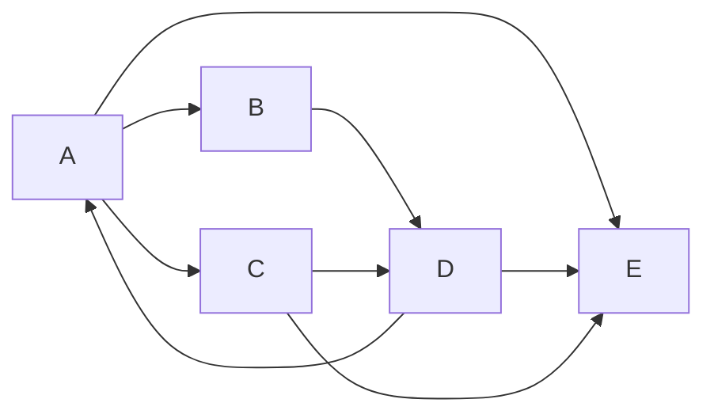
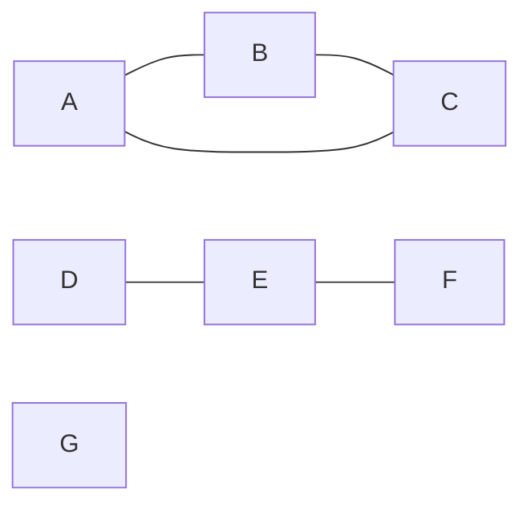

## 이 편에서 다루는 범위

그래프의 정점·간선 용어, 인접행렬·인접리스트 표현, DFS·BFS의 기본 절차와 방문 순서 추적은 자료구조 2단계 14편에서 이미 다뤘다. 독학사 4단계 알고리즘 과목에서는 이 기본 절차를 **"어떻게 구현하는가"** 가 아니라 **"복잡도가 왜 그 값인지, 방문 기록을 어떻게 더 정밀하게 활용해 그래프의 구조적 성질(사이클, 연결성, 간선의 역할)을 판별하는가"** 의 관점에서 다시 짚는다.

## 발견 시각과 종료 시각 — DFS에 타임스탬프를 붙인다

DFS를 실행하면서 각 정점 $v$에 두 개의 시각을 기록한다.

- **발견 시각**(discovery time) $d[v]$: 그 정점을 처음 방문한 순간의 시각
- **종료 시각**(finish time) $f[v]$: 그 정점에서 갈 수 있는 이웃을 모두 확인하고 재귀 호출에서 완전히 빠져나오는(그 정점의 처리가 끝나는) 순간의 시각

시각은 전체 DFS 실행 동안 하나의 카운터를 두고, 정점을 발견하거나 종료할 때마다 1씩 증가시켜 기록한다. 정점의 상태도 세 가지 색으로 구분한다.

- **흰색(white)**: 아직 발견되지 않은 정점
- **회색(gray)**: 발견되었지만 아직 종료되지 않은 정점(현재 재귀 호출 스택에 남아 있는, 즉 "탐색 중인 경로 위에 있는" 정점)
- **검은색(black)**: 종료되어 그 정점에서 갈 수 있는 곳을 모두 확인한 정점

## 방향 그래프에서 DFS 추적하기

다음 방향 그래프를 정점 A부터 DFS로 탐색한다. 각 정점의 이웃은 알파벳 순서로 확인한다.

```mermaid
graph LR
    A --> B
    A --> C
    A --> E
    B --> D
    D --> A
    D --> E
    C --> D
    C --> E
```

전체 발견·종료 시각을 표로 정리한다.

| 정점 | 발견 시각 $d$ | 종료 시각 $f$ | 구간 $[d, f]$ |
|------|----------------|----------------|-----------------|
| A | 1 | 10 | $[1, 10]$ |
| B | 2 | 7 | $[2, 7]$ |
| C | 8 | 9 | $[8, 9]$ |
| D | 3 | 6 | $[3, 6]$ |
| E | 4 | 5 | $[4, 5]$ |

### 간선 네 가지 분류

이 구간을 이용하면 어떤 두 정점의 관계(조상-자손 관계인지, 완전히 무관한지)를 시간 구간의 **포함 관계**만으로 판정할 수 있다. 예를 들어 C의 구간 $[8,9]$와 D의 구간 $[3,6]$은 전혀 겹치지 않으므로 두 정점은 조상-자손 관계가 아니다.

| 간선 | 분류 | 판정 근거 |
|------|------|------------|
| A→B, B→D, A→C, D→E | 트리 간선(tree edge) | 이웃을 처음 방문했을 때(흰색일 때) 생기는 간선 |
| D→A | 역방향 간선(back edge) | 목적지가 현재 회색(조상, 아직 재귀 스택 위)인 간선 |
| A→E | 순방향 간선(forward edge) | 목적지가 검은색이면서, 목적지의 구간이 출발지 구간에 완전히 포함되는(자손인) 간선 |
| C→D, C→E | 교차 간선(cross edge) | 목적지가 검은색이면서, 두 구간이 서로 겹치지 않는(조상도 자손도 아닌) 간선 |

### 왜 이 분류가 시험에서 중요한가

이 분류는 단순한 용어 암기가 아니라, 그래프의 구조적 성질을 판정하는 데 직접 쓰인다.

- **사이클 판별**: 방향 그래프에 **역방향 간선이 하나라도 있으면 사이클이 존재한다.** 위 예시에서 D→A가 역방향 간선이므로, A→B→D→A로 돌아오는 사이클이 실제로 존재한다. 반대로 역방향 간선이 하나도 없다면 그 방향 그래프는 **비순환 방향 그래프**(Directed Acyclic Graph, DAG)이며, 이는 11편의 위상 정렬이 가능한 조건과 정확히 일치한다.
- **무방향 그래프에는 순방향·교차 간선이 없다**: 무방향 그래프를 DFS로 탐색하면 간선은 트리 간선과 역방향 간선 두 가지로만 분류된다. 간선의 방향이 없으므로 "자손에게 지름길로 간다"거나 "전혀 다른 가지로 건너뛴다"는 구분 자체가 성립하지 않기 때문이다.

> **자주 틀리는 점:** "역방향 간선이 있으면 무조건 사이클이다"는 방향 그래프에서만 성립한다. 무방향 그래프에서는 자기 자신이 아닌 부모로 되돌아가는 간선(이미 방문한 이웃이지만 그것이 방금 온 부모인 경우)까지 역방향 간선처럼 셀 수 있어, "부모로 돌아가는 간선인지" 여부를 별도로 확인해야 진짜 사이클인지 알 수 있다.

## BFS로 연결 요소 모두 찾기

다음 **무방향** 그래프는 서로 이어지지 않은 세 덩어리로 나뉘어 있다.

```mermaid
graph LR
    A --- B
    B --- C
    A --- C
    D --- E
    E --- F
    G
```

어떤 정점 하나에서 BFS(또는 DFS)를 한 번 실행하면, 그 정점과 간선으로 이어진 정점들만 방문된다. 방문되지 않고 남은 정점이 있다면, 그 정점에서 다시 BFS를 실행하는 과정을 **모든 정점이 방문될 때까지 반복**하면 그래프 전체의 **연결 요소**(connected component, 서로 이어진 정점들의 최대 묶음)를 모두 찾을 수 있다.

| 시도 | 시작 정점 | 방문된 정점(BFS 결과) | 남은 미방문 정점 |
|------|-----------|--------------------------|---------------------|
| 1 | A | A, B, C | D, E, F, G |
| 2 | D(남은 것 중 임의로 선택) | D, E, F | G |
| 3 | G(남은 것 중 임의로 선택) | G | (없음) |

세 번의 BFS 실행으로 이 그래프가 **정확히 세 개의 연결 요소** $\{A, B, C\}$, $\{D, E, F\}$, $\{G\}$로 나뉜다는 것을 확인했다. 정점 G처럼 어떤 간선도 갖지 않는 정점(**고립 정점**, isolated vertex) 하나도 그 자체로 크기 1인 연결 요소가 된다는 점에 주의한다.

> **자주 틀리는 점:** "정점이 $n$개면 연결 요소도 그래프 하나에 하나만 있다"고 착각하면 안 된다. 간선으로 전혀 연결되지 않은 정점들이 있으면 연결 요소는 여러 개일 수 있고, 극단적으로 간선이 하나도 없는 그래프라면 정점 개수만큼($n$개) 연결 요소가 생긴다.

## DFS·BFS의 시간 복잡도를 직접 유도하기

DFS와 BFS 모두 시간 복잡도가 $O(V+E)$($V$는 정점 수, $E$는 간선 수)라는 것은 자료구조 2단계에서 결과만 확인했다. 여기서는 **왜 정확히 이 값이 되는지**를 "각 정점의 인접 리스트를 몇 번 스캔하는가"를 세어서 증명한다.

DFS·BFS는 두 종류의 작업을 한다.

1. **정점 방문**: 모든 정점을 정확히 한 번씩 발견(그리고 종료) 처리한다. 정점이 $V$개이므로 이 작업의 총 비용은 $O(V)$다.
2. **인접 리스트 스캔**: 한 정점을 처리할 때, 그 정점의 인접 리스트에 있는 이웃을 전부 한 번씩 확인한다.

두 번째 작업의 총 비용을 정확히 계산하려면, "모든 정점의 인접 리스트 길이를 다 더하면 얼마인가"를 알아야 한다. 정점 $v$의 인접 리스트 길이는 정확히 그 정점의 **차수**(degree) $\deg(v)$와 같다. 그러므로 전체 스캔 비용은 다음과 같다.

$$
\sum_{v \in V} \deg(v)
$$

이 합을 계산하는 것이 바로 그래프 이론에서 **악수 보조정리**(handshaking lemma, 14편 이산수학류 과목에서 증명을 다루는 정리이며 여기서는 결과만 사용한다)로 알려진 성질과 연결된다. 무방향 그래프에서 간선 하나는 양 끝 두 정점의 차수에 각각 1씩 기여하므로 다음이 성립한다.

$$
\sum_{v \in V} \deg(v) = 2E
$$

- $V$: 정점 집합, $\deg(v)$: 정점 $v$에 연결된 간선의 개수
- $E$: 전체 간선의 개수
- $2E$: 간선 하나가 두 정점의 차수에 각각 기여하므로 차수의 합은 간선 수의 정확히 2배

방향 그래프에서는 간선 하나가 출발 정점의 진출차수에만 기여하므로, 진출차수의 합은 $E$(간선 수 그대로)가 된다. 어느 쪽이든 인접 리스트 스캔의 총 비용은 $O(E)$다. 정점 처리 비용 $O(V)$와 스캔 비용 $O(E)$를 더하면 다음과 같다.

$$
T(V, E) = O(V) + O(E) = O(V+E)
$$

이 유도가 중요한 이유는, "왜 인접행렬을 쓰면 $O(V^2)$이 되는가"까지 같은 논리로 설명할 수 있기 때문이다. 인접행렬에서는 한 정점의 이웃을 찾을 때 그 정점의 행 전체($V$칸)를 무조건 다 훑어야 한다(간선이 없는 칸도 "없다"는 것을 확인해야 하므로).

## 자주 틀리는 점

- **역방향 간선과 트리 간선을 혼동하는 실수**: 트리 간선은 흰색(미방문) 정점으로 가는 간선이고, 역방향 간선은 회색(현재 조상, 재귀 스택 위) 정점으로 가는 간선이다.
- **순방향 간선과 교차 간선을 구분하지 못하는 실수**: 목적지가 검은색일 때, 그 목적지의 시간 구간이 출발지 구간에 **포함되면(자손이면)** 순방향, **전혀 겹치지 않으면(무관하면)** 교차 간선이다.
- **무방향 그래프에서 순방향·교차 간선을 찾으려는 실수**: 무방향 그래프는 트리 간선과 역방향 간선 두 종류만 존재한다.
- **연결 요소가 하나뿐이라고 가정하는 실수**: 그래프에 서로 이어지지 않은 부분이 있으면 연결 요소는 여러 개일 수 있으며, 이를 확인하려면 모든 정점이 방문될 때까지 BFS·DFS를 반복해야 한다.

## 핵심 정리

- DFS는 각 정점에 발견 시각·종료 시각을 기록해 흰색·회색·검은색 상태로 관리하며, 이 시각 정보로 방향 그래프의 간선을 트리·역방향·순방향·교차 간선 네 가지로 분류할 수 있다.
- 방향 그래프에 역방향 간선이 하나라도 있으면 사이클이 존재하고, 역방향 간선이 전혀 없으면 비순환 방향 그래프(DAG)로 위상 정렬이 가능하다.
- BFS(또는 DFS)를 시작점을 바꿔가며 모든 정점이 방문될 때까지 반복하면 그래프의 모든 연결 요소를 찾을 수 있다.
- DFS·BFS의 시간 복잡도 $O(V+E)$는 정점 처리 비용 $O(V)$와, 모든 정점의 차수 합(무방향은 $2E$, 방향은 $E$)에 비례하는 인접 리스트 스캔 비용 $O(E)$를 더해 정확히 유도된다.

## 마무리 복습

<Quiz
  questionNumber={1}
  question={"DFS에서 어떤 간선 (u, v)를 확인했을 때, 목적지 v가 현재 회색(gray) 상태라면 이 간선의 분류로 옳은 것은?"}
  options={["트리 간선","역방향 간선","순방향 간선","교차 간선"]}
  correctAnswer={2}
  explanation={"회색 정점은 발견되었지만 아직 종료되지 않아 현재 재귀 호출 스택에 남아 있는, 즉 탐색 중인 경로 위의 조상 정점이다. 조상을 가리키는 간선은 역방향 간선으로 분류된다."}
/>

<Quiz
  questionNumber={2}
  question={"방향 그래프를 DFS로 탐색했을 때 역방향 간선이 하나도 발견되지 않았다면 이 그래프에 대해 옳은 설명은?"}
  options={["반드시 사이클이 존재한다","비순환 방향 그래프(DAG)이며 위상 정렬이 가능하다","무방향 그래프로 변환해야만 탐색할 수 있다","연결 요소가 정확히 하나뿐이다"]}
  correctAnswer={2}
  explanation={"방향 그래프에 역방향 간선이 없다는 것은 어떤 정점에서 출발해 자기 자신의 조상으로 되돌아가는 경로가 없다는 뜻이며, 이는 사이클이 없는 비순환 방향 그래프(DAG)의 조건과 정확히 일치한다. DAG는 위상 정렬이 가능하다."}
/>

<Quiz
  questionNumber={3}
  question={"무방향 그래프에서 DFS를 수행할 때 나타날 수 없는 간선 분류는?"}
  options={["트리 간선","역방향 간선","순방향 간선과 교차 간선","트리 간선과 역방향 간선 모두"]}
  correctAnswer={3}
  explanation={"무방향 그래프는 간선에 방향이 없어 조상에서 자손으로의 지름길(순방향)이나 서로 무관한 가지 사이의 이동(교차)이라는 개념 자체가 성립하지 않는다. 무방향 그래프의 DFS에서는 트리 간선과 역방향 간선만 나타난다."}
/>

## 참고 자료

- [국가평생교육진흥원 독학학위제](https://bdes.nile.or.kr) — 알고리즘 과목 출제기준·평가영역 확인용 공식 안내.
- [GeeksforGeeks — Depth First Search (DFS) and edge classification](https://www.geeksforgeeks.org/dsa/depth-first-search-or-dfs-for-a-graph/) — DFS 발견·종료 시각과 간선 분류 개념 참고 자료.
