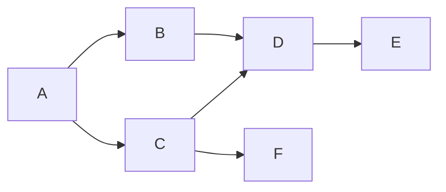
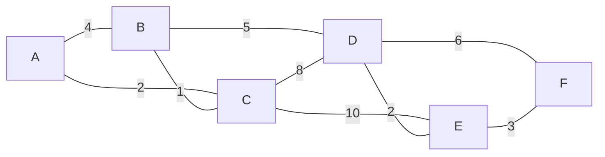

<Callout type="info">
  **이번 문서의 목표:** 이 문서를 다 읽으면 Kahn 알고리즘으로 위상 정렬 순서를 진입차수 큐 처리 과정으로 직접 구할 수 있고, 크루스칼·프림 알고리즘이 간선을 선택하는 순서를 단계별로 추적할 수 있으며, 컷 성질(cut property)을 이용해 이 탐욕적 선택이 왜 항상 최소 신장 트리를 만드는지 설명할 수 있다.
</Callout>

## 위상 정렬 — 선행 관계를 하나의 줄로 세운다

**위상 정렬**(topological sort)은 "이 작업을 하려면 저 작업을 먼저 끝내야 한다"는 선행 관계가 간선으로 표현된 **비순환 방향 그래프**(DAG, 11편에서 역방향 간선이 없는 방향 그래프로 정의했다)에서, 모든 선행 관계를 어기지 않는 하나의 순서로 정점을 나열하는 것이다. 대학 수강 신청의 선수 과목 관계, 빌드 시스템의 파일 의존성, 프로젝트 일정의 작업 순서가 모두 이 문제로 모델링된다.

> **쉽게 말하면:** 화살표가 "먼저 해야 할 일 → 나중에 할 일"을 뜻할 때, 모든 화살표를 왼쪽에서 오른쪽으로만 그릴 수 있도록 정점을 한 줄로 세우는 것이 위상 정렬이다.

### Kahn 알고리즘 — 진입차수가 0인 것부터 차례로 뺀다

**Kahn 알고리즘**은 각 정점의 **진입차수**(in-degree, 그 정점으로 들어오는 간선의 개수)를 계산해 두고, 진입차수가 0인 정점(더 이상 기다릴 선행 작업이 없는 정점)을 큐에 넣어 하나씩 꺼내며, 그 정점에서 나가는 간선을 모두 제거(그 간선이 가리키던 정점의 진입차수를 1씩 감소)하는 과정을 반복한다.

다음 DAG로 전 과정을 추적한다(A→B, A→C, B→D, C→D, C→F, D→E).

<Steps>
1. **초기 진입차수 계산**: A는 들어오는 간선이 없어 0, B는 A→B 하나뿐이라 1, C는 A→C 하나뿐이라 1, D는 B→D와 C→D 둘이라 2, E는 D→E 하나뿐이라 1, F는 C→F 하나뿐이라 1이다.
2. **초기 큐 구성**: 진입차수가 0인 정점(A)만 큐에 넣는다. 큐: `[A]`
3. **A 처리**: A를 꺼내 결과에 추가한다. A에서 나가는 간선 A→B, A→C를 제거한 것으로 보고, B의 진입차수를 $1 \to 0$, C의 진입차수를 $1 \to 0$으로 줄인다. 둘 다 0이 되었으므로 큐에 추가한다. 큐: `[B, C]`
4. **B 처리**: B를 꺼내 결과에 추가한다. B→D를 제거해 D의 진입차수를 $2 \to 1$로 줄인다. 아직 0이 아니므로 큐에 넣지 않는다. 큐: `[C]`
5. **C 처리**: C를 꺼내 결과에 추가한다. C→D를 제거해 D의 진입차수를 $1 \to 0$으로 줄이고, C→F를 제거해 F의 진입차수를 $1 \to 0$으로 줄인다. 둘 다 0이 되어 큐에 추가한다. 큐: `[D, F]`
6. **D 처리**: D를 꺼내 결과에 추가한다. D→E를 제거해 E의 진입차수를 $1 \to 0$으로 줄여 큐에 추가한다. 큐: `[F, E]`
7. **F 처리**: F를 꺼내 결과에 추가한다. F에서 나가는 간선이 없다. 큐: `[E]`
8. **E 처리**: E를 꺼내 결과에 추가한다. 큐가 비어 종료.
</Steps>

전체 처리 순서를 표로 정리한다.

| 단계 | 꺼낸 정점 | 진입차수 갱신 | 새로 큐에 들어온 정점 | 큐 상태(처리 후) |
|------|-----------|-----------------|--------------------------|----------------------|
| 1 | A | B: 1→0, C: 1→0 | B, C | `[B, C]` |
| 2 | B | D: 2→1 | (없음) | `[C]` |
| 3 | C | D: 1→0, F: 1→0 | D, F | `[D, F]` |
| 4 | D | E: 1→0 | E | `[F, E]` |
| 5 | F | (나가는 간선 없음) | (없음) | `[E]` |
| 6 | E | (나가는 간선 없음) | (없음) | `[]` |

**위상 정렬 결과: A, B, C, D, F, E**. 이 순서에서 모든 간선은 항상 "먼저 나온 정점 → 나중에 나온 정점" 방향으로만 존재한다는 것을 각 간선(A→B, A→C, B→D, C→D, C→F, D→E)에 직접 대입해 확인할 수 있다.

### 위상 정렬로 사이클을 판별한다

큐가 완전히 비었는데도 아직 결과에 추가되지 못한 정점이 남아 있다면, 그 남은 정점들은 서로 진입차수를 낮춰줄 수 없는 상태, 즉 **사이클을 이루고 있어서 영원히 진입차수가 0이 될 수 없는 상황**이다. 예를 들어 위 그래프에 D→A라는 간선을 추가하면 A의 초기 진입차수가 1이 되어 애초에 큐에 들어갈 수 없고, Kahn 알고리즘은 몇 개의 정점만 처리한 채 큐가 비어 종료된다. **처리된 정점의 개수가 전체 정점 개수보다 적다면, 그 방향 그래프에는 사이클이 있고 위상 정렬이 불가능하다**고 판정한다.

> **자주 틀리는 점:** "위상 정렬 결과는 항상 유일하다"고 착각하면 안 된다. 위 3단계에서 진입차수가 0인 정점이 D, F 두 개가 동시에 큐에 들어왔던 것처럼, 같은 시점에 진입차수가 0인 정점이 여러 개면 그중 어느 것을 먼저 처리해도 선행 관계를 어기지 않는 올바른 위상 정렬이 된다. 즉 하나의 DAG에 대해 여러 개의 올바른 위상 정렬 순서가 있을 수 있다.

### Kahn 알고리즘의 복잡도

각 정점은 큐에 정확히 한 번 들어가고 한 번 나오므로 $O(V)$이고, 각 간선은 그 간선의 출발 정점을 처리할 때 정확히 한 번씩 확인되어 진입차수를 갱신하므로(11편에서 유도한 것과 같은 논리로) $O(E)$다. 따라서 전체 복잡도는 DFS·BFS와 똑같이 $O(V+E)$다.

## 최소 신장 트리(MST) — 모든 정점을 가장 싸게 연결한다

**신장 트리**(spanning tree)는 그래프의 모든 정점을 포함하면서 사이클이 없는 부분 그래프이며, 정점이 $V$개인 연결 그래프의 신장 트리는 항상 정확히 $V-1$개의 간선을 가진다. **최소 신장 트리**(Minimum Spanning Tree, MST)는 간선에 가중치가 있을 때, 그 가중치의 합이 가장 작은 신장 트리를 말한다. 도시들을 도로로 모두 연결하되 총 건설 비용을 최소화하는 문제가 대표적인 예다.

다음 가중치 그래프로 크루스칼과 프림 두 알고리즘을 각각 추적한다.

### 크루스칼 알고리즘 — 가장 싼 간선부터 사이클 없이 채운다

**크루스칼**(Kruskal) 알고리즘은 모든 간선을 가중치 오름차순으로 정렬한 뒤, 가장 싼 간선부터 순서대로 확인하면서 **그 간선을 넣어도 사이클이 생기지 않으면** 채택하고, 사이클이 생기면 버리는 방식이다. 사이클이 생기는지는 **유니온-파인드**(union-find, 서로소 집합 자료구조)로, 두 정점이 이미 같은 그룹(같은 신장 트리 조각)에 속해 있는지를 확인해 판정한다.

가중치 오름차순 간선 목록: B–C(1), A–C(2), D–E(2), E–F(3), A–B(4), B–D(5), D–F(6), C–D(8), C–E(10).

| 선택 순서 | 확인한 간선 | 두 정점의 그룹 상태 | 판정 | 처리 후 그룹 |
|-----------|---------------|-------------------------|------|-----------------|
| 1 | B–C(1) | B, C가 각각 다른 그룹 | 채택(사이클 없음) | `{B, C}` |
| 2 | A–C(2) | A는 단독, C는 `{B,C}`에 속함 | 채택(사이클 없음) | `{A, B, C}` |
| 3 | D–E(2) | D, E가 각각 다른 그룹 | 채택(사이클 없음) | `{A,B,C}`, `{D, E}` |
| 4 | E–F(3) | E는 `{D,E}`, F는 단독 | 채택(사이클 없음) | `{A,B,C}`, `{D, E, F}` |
| 5 | A–B(4) | A, B가 모두 `{A,B,C}`에 속함 | **버림(사이클 생김)** | 변화 없음 |
| 6 | B–D(5) | B는 `{A,B,C}`, D는 `{D,E,F}` | 채택(사이클 없음) | `{A,B,C,D,E,F}`(전체 연결 완료) |

정점이 6개이므로 신장 트리는 간선 $V-1=5$개가 필요하다. 위 표에서 정확히 5개의 간선(B–C, A–C, D–E, E–F, B–D)이 채택되는 순간 전체 정점이 하나의 그룹으로 합쳐졌으므로 즉시 종료한다(4단계 A–B는 사이클을 만들어 버려졌다는 점이 "탐욕이지만 무조건 받아들이지는 않는다"는 것을 보여주는 핵심 지점이다).

$$
\text{MST 총 가중치} = 1 + 2 + 2 + 3 + 5 = 13
$$

### 프림 알고리즘 — 이미 연결된 덩어리에서 가장 싼 다리를 놓는다

**프림**(Prim) 알고리즘은 정렬된 전체 간선 목록을 보는 대신, **이미 신장 트리에 포함된 정점들의 집합(방문 집합)에서 바깥으로 나가는 간선 중 가장 싼 것**을 매번 골라 그 간선이 가리키는 새 정점을 방문 집합에 추가하는 방식이다. A에서 시작해 추적한다.

| 선택 순서 | 방문 집합(선택 전) | 방문 집합에서 바깥으로 나가는 후보 간선 | 선택한 최소 간선 | 방문 집합(선택 후) |
|-----------|------------------------|----------------------------------------------|----------------------|-------------------------|
| 1 | `{A}` | A–B(4), A–C(2) | A–C(2) | `{A, C}` |
| 2 | `{A, C}` | A–B(4), C–B(1), C–D(8), C–E(10) | C–B(1) | `{A, B, C}` |
| 3 | `{A, B, C}` | B–D(5), C–D(8), C–E(10) | B–D(5) | `{A, B, C, D}` |
| 4 | `{A, B, C, D}` | D–E(2), D–F(6), C–E(10) | D–E(2) | `{A, B, C, D, E}` |
| 5 | `{A, B, C, D, E}` | D–F(6), E–F(3) | E–F(3) | `{A, B, C, D, E, F}`(전체 완료) |

$$
\text{MST 총 가중치} = 2 + 1 + 5 + 2 + 3 = 13
$$

두 알고리즘이 서로 다른 순서로 간선을 살펴봤지만(크루스칼은 전체 간선을 가중치순으로, 프림은 방문 집합 경계에서만) 최종적으로 채택한 간선 집합(`{A–C, B–C, B–D, D–E, E–F}`)과 총 가중치(13)가 완전히 같다는 것을 확인할 수 있다.

| 비교 항목 | 크루스칼 | 프림 |
|-----------|----------|------|
| 간선을 보는 범위 | 그래프 전체 간선을 가중치순으로 | 방문 집합의 경계에 걸친 간선만 |
| 필요한 자료구조 | 간선 정렬 + 유니온-파인드 | 방문 집합의 경계 간선 중 최솟값을 뽑는 최소 힙(우선순위 큐) |
| 사이클 처리 | 유니온-파인드로 명시적으로 검사해 버림 | 이미 방문 집합 안의 정점끼리는 애초에 후보 간선으로 잡지 않아 자연히 회피 |
| 적합한 상황 | 간선이 상대적으로 적은(성긴) 그래프 | 간선이 많은(조밀한) 그래프, 또는 인접행렬로 표현된 그래프 |
| 시간 복잡도 | $O(E \log E)$(간선 정렬이 지배적) | $O(E \log V)$(최소 힙 사용 시) |

## 왜 탐욕적 선택이 항상 최적인가 — 컷 성질

크루스칼과 프림 모두 "지금 당장 가장 싼 것을 고른다"는 **탐욕**(greedy) 전략을 쓰는데, 매 순간의 최선이 어떻게 전체 최적(전체 가중치 최소)을 보장하는지 의문이 들 수 있다. 이를 뒷받침하는 것이 **컷 성질**(cut property)이다.

그래프의 정점 집합을 두 그룹으로 나누는 것을 **컷**(cut)이라 부른다. 컷 성질은 다음과 같이 말한다.

> 어떤 컷에서, 그 컷을 가로지르는(양쪽 그룹을 잇는) 간선 중 **가중치가 가장 작은 간선**은 항상 어떤 최소 신장 트리에도 포함될 수 있다.

**왜 그런지 반증법으로 확인해 본다.** 어떤 컷을 가로지르는 최소 가중치 간선을 $e$라 하고, $e$를 포함하지 않는 최소 신장 트리 $T$가 있다고 가정한다. $T$는 신장 트리이므로 컷의 양쪽을 잇는 경로가 반드시 존재하고, 그 경로에는 컷을 가로지르는 간선 $e'$이 적어도 하나 있다. $e$는 컷을 가로지르는 간선 중 가중치가 최소이므로 $w(e) \leq w(e')$이다. 이제 $T$에서 $e'$을 빼고 대신 $e$를 넣으면, 여전히 모든 정점을 연결하는 신장 트리이면서 가중치는 $w(T) - w(e') + w(e) \leq w(T)$로 **줄어들거나 같다.** $T$가 최소였다는 가정과 모순되지 않으려면 $w(e) = w(e')$이어야 하고, 이 경우 $e$를 포함한 신장 트리도 똑같이 최소가 된다. 즉 $e$를 포함하는 최소 신장 트리가 항상 존재한다.

- 크루스칼에서 매번 "아직 연결되지 않은 두 그룹(정점 하나하나가 처음엔 모두 별개의 그룹)을 가르는 컷"을 놓고 그 컷을 가로지르는 가장 싼 간선(정렬되어 있으므로 항상 지금 확인하는 간선이 후보가 된다)을 고르는 것이 바로 이 컷 성질을 반복 적용하는 것이다.
- 프림에서는 "방문 집합과 나머지"라는 하나의 컷을 고정해 두고, 그 컷을 가로지르는 가장 싼 간선을 매번 고르는 것이 컷 성질의 직접적인 적용이다.

이 증명이 바로 16편에서 다룰 **"탐욕 알고리즘이 항상 최적해를 주는 것은 아니지만, 문제가 특정 성질(교환 논증으로 반증 가능한 구조)을 만족하면 탐욕이 최적임을 증명할 수 있다"** 는 원칙의 구체적인 사례다. MST 문제는 컷 성질 덕분에 탐욕이 최적임이 수학적으로 보장되는 몇 안 되는 문제 중 하나다.

> **자주 틀리는 점:** "탐욕 알고리즘은 근사해만 준다"고 일반화하면 안 된다. 배낭 문제(0/1)처럼 탐욕이 최적을 보장하지 못하는 문제도 있지만, MST처럼 컷 성질이 성립하는 문제에서는 탐욕이 **항상 정확한 최적해**를 준다. "이 문제에 탐욕을 써도 되는가"는 문제마다 별도로 증명해야 하는 성질이지, 탐욕이라는 접근법 자체의 일반적인 한계가 아니다.

## 자주 틀리는 점

- **Kahn 알고리즘에서 큐가 빈 채로 종료됐는데 처리된 정점이 전체보다 적은 경우를 놓치는 실수**: 이는 사이클이 있다는 신호이며, 위상 정렬이 불가능하다고 판정해야 한다.
- **위상 정렬 결과가 유일하다고 착각하는 실수**: 같은 시점에 진입차수가 0인 정점이 여러 개면 처리 순서에 따라 서로 다른 올바른 위상 정렬이 나올 수 있다.
- **크루스칼에서 사이클을 만드는 간선도 무조건 채택한다고 착각하는 실수**: 가중치가 아무리 작아도 사이클을 만드는 간선은 반드시 버려야 한다.
- **프림의 후보 간선을 그래프 전체 간선으로 착각하는 실수**: 프림은 오직 **방문 집합에서 바깥으로 나가는** 간선만 후보로 고려한다.
- **탐욕 알고리즘이 항상 최적이라고(또는 항상 최적이 아니라고) 일반화하는 실수**: MST처럼 컷 성질이 성립하는 문제에서만 탐욕의 최적성이 보장되며, 이는 문제별로 증명이 필요하다.

## 핵심 정리

- Kahn 알고리즘은 진입차수가 0인 정점을 큐에 넣고 하나씩 꺼내며 나가는 간선을 제거하는 과정을 반복해 위상 정렬을 구하고, 큐가 빈 뒤 처리되지 못한 정점이 남으면 사이클이 있다는 뜻이다.
- 크루스칼은 전체 간선을 가중치순으로 정렬해 사이클을 만들지 않는 것만 채택하고, 프림은 방문 집합의 경계에서 가장 싼 간선만 골라 나가며, 두 방식 모두 같은 MST 총 가중치에 도달한다.
- 탐욕적 간선 선택이 항상 최적임은 컷 성질(어떤 컷을 가로지르는 최소 가중치 간선은 항상 어떤 MST에도 포함될 수 있다)의 교환 논증으로 증명된다.
- 탐욕이 최적을 보장하는 것은 문제의 구조(컷 성질 같은)에 달려 있으며, 모든 문제에 탐욕이 통하는 것은 아니다.

## 마무리 복습

<Quiz
  questionNumber={1}
  question="Kahn 알고리즘으로 위상 정렬을 수행하는 도중, 큐가 완전히 비었는데도 아직 결과에 포함되지 못한 정점이 남아 있다면 이 상황이 뜻하는 것은?"
  options={['그래프에 정점이 너무 많아 알고리즘이 비효율적으로 동작한 것이다', '이 방향 그래프에는 사이클이 존재하며 위상 정렬이 불가능하다', '남은 정점들은 나중에 처리하면 되므로 문제가 없다', '간선의 가중치를 고려하지 않아서 생기는 오류다']}
  correctAnswer={2}
  explanation="큐가 비었다는 것은 진입차수가 0인 정점이 더 이상 없다는 뜻인데, 아직 처리되지 못한 정점이 남아 있다면 그 정점들은 서로 진입차수를 낮춰 줄 수 없는 사이클 구조에 갇혀 있다는 의미이며, 이 경우 위상 정렬이 불가능하다."
  optionExplanations={['정점 개수와 알고리즘의 정상 동작 여부는 관련이 없다.', '정답. 남은 정점이 사이클을 이루고 있어 위상 정렬이 불가능하다는 신호다.', '진입차수가 0이 될 수 없는 사이클 구조라면 나중에 처리해도 결코 조건을 만족시킬 수 없다.', '위상 정렬은 가중치를 사용하지 않는 알고리즘이므로 이 상황과 무관하다.']}
/>

<Quiz
  questionNumber={2}
  question="어떤 DAG에서 같은 시점에 진입차수가 0인 정점이 두 개 이상 큐에 동시에 들어왔을 때에 대한 설명으로 옳은 것은?"
  options={['이는 오류 상황이며 알고리즘을 다시 실행해야 한다', '둘 중 어느 것을 먼저 처리해도 선행 관계를 어기지 않는 올바른 위상 정렬이 될 수 있다', '반드시 정점 번호가 작은 것부터 처리해야만 올바른 결과가 나온다', '이 경우 위상 정렬 자체가 불가능하다']}
  correctAnswer={2}
  explanation="진입차수가 동시에 0이 된 정점들은 서로 선행 관계가 없으므로, 어느 순서로 처리해도 모든 간선의 방향을 어기지 않는 올바른 위상 정렬이 나온다. 즉 하나의 DAG에 여러 개의 올바른 위상 정렬이 존재할 수 있다."
  optionExplanations={['오류가 아니라 정상적으로 발생할 수 있는 상황이다.', '정답. 서로 선행 관계가 없는 정점들이므로 처리 순서를 바꿔도 결과가 올바르다.', '특정 순서(정점 번호 등)를 강제해야 한다는 규칙은 없으며, 여러 올바른 순서가 모두 인정된다.', '오히려 여러 개의 올바른 위상 정렬이 가능하다는 뜻이지 불가능하다는 뜻이 아니다.']}
/>

<Quiz
  questionNumber={3}
  question="크루스칼 알고리즘이 가중치 오름차순으로 간선을 확인하는 도중, 이미 같은 그룹에 속한 두 정점을 잇는 간선을 만났을 때 해야 할 처리는?"
  options={['가중치가 가장 작으므로 무조건 채택한다', '사이클이 생기므로 그 간선을 버리고 다음 간선으로 넘어간다', '두 정점의 그룹을 강제로 분리한 뒤 채택한다', '알고리즘을 즉시 종료한다']}
  correctAnswer={2}
  explanation="이미 같은 그룹(유니온-파인드 상의 같은 집합)에 속한 두 정점을 잇는 간선을 채택하면 사이클이 생기므로, 이 간선은 가중치와 무관하게 버리고 다음으로 싼 간선을 확인해야 한다."
  optionExplanations={['가중치가 작아도 사이클을 만드는 간선은 신장 트리가 될 수 없으므로 채택하면 안 된다.', '정답. 사이클을 만드는 간선은 버리고 다음 간선을 확인하는 것이 크루스칼의 핵심 규칙이다.', '그룹을 강제로 분리하는 절차는 크루스칼 알고리즘에 존재하지 않는다.', '남은 간선 중에 사이클을 만들지 않는 유효한 간선이 더 있을 수 있으므로 즉시 종료하면 안 된다.']}
/>

<Quiz
  questionNumber={4}
  question="프림 알고리즘에서 다음에 추가할 간선을 고를 때 후보로 삼는 간선의 범위로 옳은 것은?"
  options={['그래프에 존재하는 모든 간선', '현재 방문 집합에서 아직 방문하지 않은 정점으로 나가는 간선만', '가중치가 가장 큰 간선부터 순서대로', '무작위로 선택한 일부 간선']}
  correctAnswer={2}
  explanation="프림 알고리즘은 이미 방문 집합에 포함된 정점들의 경계에서 바깥(아직 방문하지 않은 정점)으로 나가는 간선만 후보로 고려하며, 그중 가중치가 가장 작은 간선을 선택한다."
  optionExplanations={['그래프 전체 간선을 매번 다 보는 것은 크루스칼의 방식(정렬을 통해)에 더 가깝고, 프림은 경계 간선만 본다.', '정답. 방문 집합의 경계를 넘어가는 간선만 후보로 삼는 것이 프림의 핵심 규칙이다.', '프림은 가장 작은 가중치의 간선을 선택하는 알고리즘이며 가장 큰 것을 고르지 않는다.', '무작위 선택이 아니라 경계 간선 중 최솟값을 결정적으로 선택한다.']}
/>

<Quiz
  questionNumber={5}
  question="컷 성질(cut property)에 대한 설명으로 옳은 것은?"
  options={['어떤 컷을 가로지르는 간선 중 가중치가 가장 작은 간선은 항상 어떤 최소 신장 트리에도 포함될 수 있다', '컷 성질은 크루스칼에만 적용되고 프림에는 적용되지 않는다', '컷 성질은 모든 그래프 문제에서 탐욕이 최적임을 보장한다는 일반 원리다', '컷을 가로지르는 간선 중 가중치가 가장 큰 간선이 항상 MST에 포함된다']}
  correctAnswer={1}
  explanation="컷 성질은 어떤 컷을 가로지르는 간선 중 가중치가 최소인 간선이 항상 어떤 MST에도 포함될 수 있음을 보장하는 성질이며, 크루스칼과 프림 모두 이 성질을 서로 다른 방식(전체 정렬 vs 방문 집합 경계)으로 반복 적용한 것이다."
  optionExplanations={['정답. 최소 가중치 간선이 MST에 포함될 수 있다는 것이 컷 성질의 정확한 내용이다.', '컷 성질은 크루스칼과 프림 모두의 정당성을 뒷받침하는 공통 원리다.', '컷 성질은 MST 문제처럼 특정 구조를 만족하는 문제에서만 성립하며, 모든 문제에 탐욕이 통한다는 일반 원리가 아니다.', '컷 성질은 가중치가 가장 작은 간선에 대한 성질이며, 가장 큰 간선과는 관련이 없다.']}
/>

<Quiz
  questionNumber={6}
  question="정점 6개인 연결 그래프의 최소 신장 트리(MST)가 반드시 가져야 하는 간선의 개수는?"
  options={['5개', '6개', '정점 수와 무관하게 항상 다르다', '그래프의 전체 간선 수와 같다']}
  correctAnswer={1}
  explanation="정점이 V개인 연결 그래프의 신장 트리(사이클 없이 모든 정점을 연결하는 부분 그래프)는 항상 정확히 V-1개의 간선을 가지며, 정점이 6개이므로 MST의 간선 개수는 5개다."
  optionExplanations={['정답. 신장 트리는 항상 V-1개의 간선을 가지며 정점 6개면 5개다.', '정점 개수와 간선 개수가 같으면 사이클이 생기므로 신장 트리가 될 수 없다.', '신장 트리의 간선 개수는 항상 V-1개로 정해진 규칙을 따른다.', 'MST는 원래 그래프의 일부 간선만 선택한 것이므로 전체 간선 수보다 적거나 같다(사이클이 있는 그래프라면 반드시 더 적다).']}
/>

## 참고 자료

- [국가평생교육진흥원 독학학위제](https://bdes.nile.or.kr) — 알고리즘 과목 출제기준·평가영역 확인용 공식 안내.
- [GeeksforGeeks — Kruskal's Minimum Spanning Tree Algorithm](https://www.geeksforgeeks.org/dsa/kruskals-minimum-spanning-tree-algorithm-greedy-algo-2/) — 크루스칼·프림 알고리즘과 MST 성질 참고 자료.
