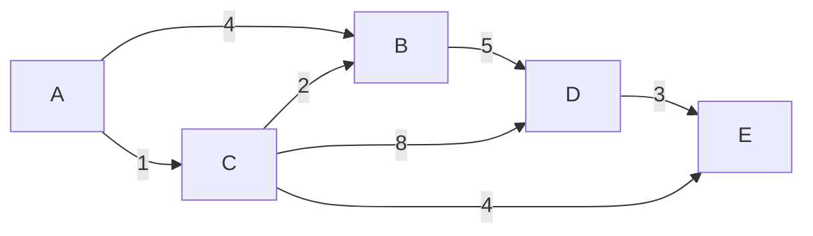
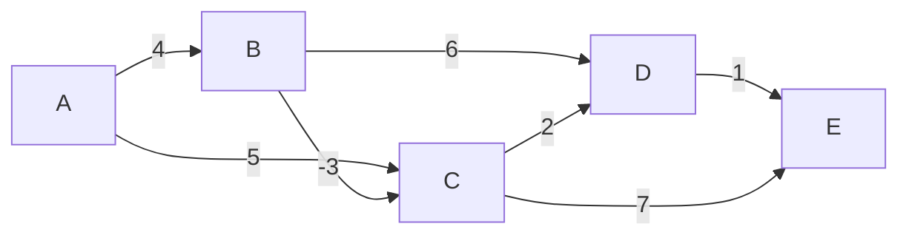
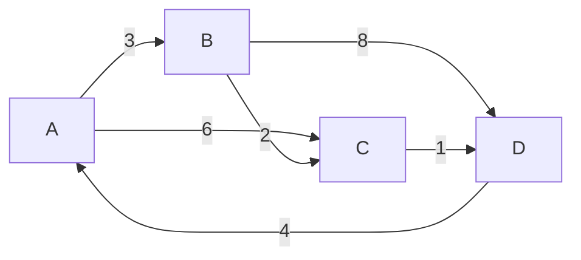

<Callout type="info">
  **이번 문서의 목표:** 이 문서를 다 읽으면 다익스트라·벨만-포드·플로이드-워셜 세 알고리즘을 실제 그래프에 손으로 적용해 최단거리를 구할 수 있고, 각 알고리즘이 어떤 조건(가중치 부호, 출발점 개수)에서 쓰이는지, 왜 다익스트라는 음수 가중치에서 틀릴 수 있는지, 벨만-포드가 어떻게 음수 사이클을 찾아내는지 설명할 수 있다.
</Callout>

## 왜 최단경로 문제가 따로 필요한가

11편의 DFS·BFS는 가중치가 없는 그래프에서 "몇 개의 간선을 거치는가"만 세었다. 하지만 현실의 많은 문제는 간선마다 비용(거리, 시간, 요금)이 다르다. 서울에서 부산까지 가는 방법이 여러 갈래일 때, 거치는 도시 수가 적다고 항상 빠른 것은 아니다. 두 도시를 잇는 구간이 유난히 느리면, 도시를 하나 더 거치더라도 전체 이동 시간이 더 짧을 수 있다. **최단경로**(shortest path) 문제는 이렇게 간선마다 가중치(weight)가 있는 그래프에서, 시작 정점에서 목적 정점까지 가중치의 합이 가장 작은 경로를 찾는 문제다.

> **쉽게 말하면:** BFS가 "몇 정거장 거치는가"를 셌다면, 최단경로 알고리즘은 "총 얼마나 드는가"를 계산한다.

최단경로 문제는 범위에 따라 두 가지로 나뉜다.

- **단일 출발점 최단경로**(single-source shortest path): 정해진 한 정점에서 다른 모든 정점까지의 최단거리를 구한다. 다익스트라, 벨만-포드가 여기 속한다.
- **모든 쌍 최단경로**(all-pairs shortest path): 그래프의 모든 정점 쌍 사이의 최단거리를 한꺼번에 구한다. 플로이드-워셜이 여기 속한다.

세 알고리즘 모두 "간선 가중치의 부호(양수만인지, 음수가 섞였는지)"에 따라 쓸 수 있는지가 갈린다는 점이 시험에서 가장 자주 나오는 포인트다.

## 다익스트라 알고리즘 — 가장 가까운 곳부터 확정한다

**다익스트라**(Dijkstra) 알고리즘은 모든 간선 가중치가 **음수가 아닐 때**(0 이상일 때) 단일 출발점 최단경로를 구하는 알고리즘이다. 아이디어는 "지금까지 확정된 거리 중 가장 짧은 정점을 하나씩 확정해 나간다"는 **탐욕**(greedy, 15~16편에서 다시 다룸) 전략이다.

```
Dijkstra(그래프, 시작정점 s):
  모든 정점의 dist를 무한대로 초기화하고, dist[s] = 0
  방문 여부를 모두 거짓으로 초기화
  정점이 모두 방문될 때까지 반복:
    1. 아직 방문하지 않은 정점 중 dist가 가장 작은 정점 u를 고른다
    2. u를 방문 처리한다
    3. u의 각 이웃 v에 대해:
       새경로 = dist[u] + 간선(u, v)의 가중치
       만약 새경로 < dist[v]이면 dist[v] = 새경로로 갱신한다 (완화, relaxation)
```

3번 단계를 **완화**(relaxation)라고 부른다. "u를 거쳐서 v로 가는 것이 지금까지 알던 것보다 더 짧다면 갱신한다"는 뜻이다.

### 작은 예시로 추적하기

다음과 같은 방향 가중치 그래프가 있다고 하자.



A를 시작 정점으로 다익스트라를 적용한다. dist는 "지금까지 확정되지 않은 최선의 거리"를 뜻한다.

| 단계 | 확정한 정점 | 확정 당시 dist | B | C | D | E |
|------|-------------|-----------------|---|---|---|---|
| 0 | (초기화) | - | ∞ | ∞ | ∞ | ∞ |
| 1 | A | 0 | 4 (A→B) | 1 (A→C) | ∞ | ∞ |
| 2 | C | 1 | 3 (C경유: 1+2) | - | 9 (C경유: 1+8) | 5 (C경유: 1+4) |
| 3 | B | 3 | - | - | 8 (B경유: 3+5, 9보다 작아 갱신) | 5 (변화 없음) |
| 4 | E | 5 | - | - | 8 (변화 없음, E에서 나가는 간선 없음) | - |
| 5 | D | 8 | - | - | - | - |

각 줄에서 굵게 볼 지점은 "왜 그 정점을 확정했는가"다. 2단계에서 B(4)와 C(1) 중 더 작은 C(1)를 확정한다. C를 확정하고 나면 C를 거쳐가는 경로들이 갱신되는데, B는 원래 4였지만 C를 거치면 $1 + 2 = 3$으로 더 짧아지므로 3으로 갱신한다. D는 원래 무한대였지만 C를 거치면 $1 + 8 = 9$가 되어 9로 갱신한다.

$$
\text{dist}[B] = \min(4,\ \text{dist}[C] + 2) = \min(4,\ 1+2) = 3
$$

- $\min$: 괄호 안 값 중 더 작은 값을 고르라는 기호.
- $\text{dist}[C] + 2$: C까지의 확정 거리에 C→B 간선 가중치 2를 더한, "C를 거쳐 B로 가는 경로"의 총 비용.

3단계에서는 남은 정점 B(3), D(9), E(5) 중 가장 작은 B(3)를 확정한다. B를 거치면 D는 $3+5=8$이 되어 기존 9보다 짧아지므로 8로 갱신한다. 4단계에서는 D(8)와 E(5) 중 E(5)를 확정하는데, E에서 나가는 간선이 없으므로 갱신할 곳이 없다. 마지막으로 D(8)를 확정하면 모든 정점이 확정된다.

**최종 결과: dist[A]=0, dist[B]=3, dist[C]=1, dist[D]=8, dist[E]=5**

### 왜 음수 가중치에서는 틀리는가

다익스트라는 "한 번 확정한 정점의 거리는 절대 줄어들지 않는다"는 전제 위에 서 있다. 이 전제가 성립하는 이유는 아직 방문하지 않은 정점까지의 거리가 방문한 정점의 거리보다 항상 크거나 같기 때문인데, 이는 **가중치가 모두 0 이상일 때만** 보장된다. 만약 나중에 확인할 간선 중에 음수 가중치가 있다면, 이미 확정한 정점을 "더 나중에, 음수 간선을 거쳐서" 가는 경로가 더 짧아질 수 있는데도 다익스트라는 이미 확정된 정점을 다시 갱신하지 않으므로 틀린 답을 낸다.

> **자주 틀리는 점:** "다익스트라는 최단경로 알고리즘이니 아무 그래프에나 쓸 수 있다"고 착각하기 쉽다. 그래프에 음수 가중치 간선이 하나라도 있으면 다익스트라의 정확성이 깨지므로, 이때는 벨만-포드를 써야 한다.

## 벨만-포드 알고리즘 — 모든 간선을 여러 번 완화한다

**벨만-포드**(Bellman-Ford) 알고리즘은 음수 가중치가 있어도(음수 사이클만 없다면) 올바르게 동작하는 단일 출발점 최단경로 알고리즘이다. 다익스트라처럼 "가장 가까운 정점부터 욕심내어 확정"하지 않고, 대신 **모든 간선을 정점 수 $-$ 1번 반복해서 완화**한다.

```
BellmanFord(그래프, 시작정점 s):
  모든 정점의 dist를 무한대로 초기화하고, dist[s] = 0
  (정점 수 - 1)번 반복:
    그래프의 모든 간선 (u, v, 가중치 w)에 대해:
      만약 dist[u] + w < dist[v]이면 dist[v] = dist[u] + w로 갱신한다
  추가로 한 번 더 모든 간선을 확인해, 그래도 갱신이 일어나면 음수 사이클이 존재한다고 판단한다
```

왜 정점 수 $-$ 1번 반복하는지는 최단경로의 성질에서 나온다. 정점이 $V$개인 그래프에서 사이클이 없는 최단경로는 간선을 최대 $V-1$개까지만 거친다(정점을 한 번씩만 지난다고 가정하면 $V$개 정점을 잇는 경로의 간선은 $V-1$개가 최대다). 한 번의 전체 간선 완화 라운드마다 "간선 하나만큼 더 먼 정점까지 정답이 확정된다"고 보면, $V-1$번 반복하면 모든 최단경로가 확정된다.

### 작은 예시로 추적하기

다음 방향 가중치 그래프에는 음수 가중치 간선(B→C)이 하나 있다.



정점이 5개(A, B, C, D, E)이므로 $V-1=4$번 반복해야 하지만, 실제로는 값이 더 이상 바뀌지 않으면 그전에 멈출 수 있다. A를 시작 정점으로 간선을 A→B, A→C, B→C, B→D, C→D, D→E, C→E 순서로 완화한다.

| 라운드 | A | B | C | D | E | 이번 라운드에 바뀐 값 |
|--------|---|---|---|---|---|------------------------|
| 초기화 | 0 | ∞ | ∞ | ∞ | ∞ | - |
| 1회차 | 0 | 4 | 1 | 3 | 4 | B: ∞→4, C: ∞→1(A→C:5 먼저 갱신 후 B→C: 4−3=1로 재갱신), D: ∞→3(C→D: 1+2), E: ∞→4(D→E: 3+1) |
| 2회차 | 0 | 4 | 1 | 3 | 4 | 변화 없음 |

1회차 안에서도 간선을 순서대로 처리하므로, C는 먼저 A→C로 5가 되었다가 바로 뒤 B→C 간선을 확인할 때 $4 + (-3) = 1$이 5보다 작아 1로 다시 갱신된다. 이렇게 한 라운드 안에서도 여러 번 갱신될 수 있다는 점이 벨만-포드 추적에서 자주 놓치는 부분이다. 2회차에서 모든 간선을 다시 확인해도 더 짧아지는 값이 없으므로, 이후 라운드를 계속해도(이론상 4회차까지) 결과는 바뀌지 않는다.

**최종 결과: dist[A]=0, dist[B]=4, dist[C]=1, dist[D]=3, dist[E]=4**

> **쉽게 말하면:** 벨만-포드는 다익스트라처럼 똑똑하게 순서를 고르지 않고, 대신 "혹시 모르니 모든 간선을 여러 번 다시 확인"하는 방식으로 음수 가중치도 견뎌낸다. 대신 그만큼 느리다.

### 음수 사이클 판별 — 벨만-포드만 할 수 있는 일

앞의 그래프에 간선 E→B(가중치 $-10$)을 추가하면 B→C→D→E→B로 이어지는 사이클의 가중치 합이 $4 + (-3) + 2 + 1 + (-10) = -6$이 되어 **음수 사이클**(negative cycle)이 생긴다. 음수 사이클이 있으면 그 사이클을 돌 때마다 총비용이 계속 줄어들므로, "최단거리"라는 개념 자체가 정의되지 않는다(무한히 돌수록 더 짧아지기 때문이다).

벨만-포드는 이런 상황을 잡아낼 수 있다. 정상적인 그래프라면 $V-1$번 반복만으로 모든 최단거리가 확정되어 그 이후에는 값이 바뀌지 않아야 한다. 그런데 $V-1$번을 다 채운 뒤에도(즉 $V$번째 라운드에서도) 여전히 더 짧아지는 정점이 있다면, 그 갱신은 사이클을 계속 돌면서 만들어진 것이므로 음수 사이클이 존재한다고 판단할 수 있다.

| 판별 절차 | 결과 |
|-----------|------|
| $V-1$번 완화 완료 | 일부 값이 여전히 갱신 가능 |
| $V$번째 완화(추가 1회) 실행 | 값이 또 갱신됨 → 음수 사이클 존재로 판정 |

> **자주 틀리는 점:** "음수 가중치가 있으면 무조건 최단경로를 구할 수 없다"고 오해하기 쉽다. 음수 가중치 자체는 문제가 없고, **음수 사이클**이 있을 때만 최단경로가 정의되지 않는다. 음수 가중치가 있어도 음수 사이클만 없으면 벨만-포드로 정확한 답을 구할 수 있다.

### 다익스트라와 벨만-포드 비교

| 비교 항목 | 다익스트라 | 벨만-포드 |
|-----------|-----------|-----------|
| 음수 가중치 | 허용 안 함(있으면 오답 가능) | 허용함 |
| 음수 사이클 판별 | 불가능 | 가능 |
| 시간 복잡도(간선 $E$, 정점 $V$) | 우선순위 큐 사용 시 $O((V+E)\log V)$ | $O(V \times E)$ |
| 동작 방식 | 가장 가까운 정점부터 욕심내어 확정(탐욕) | 모든 간선을 여러 번 완화 |
| 실무에서 선호되는 경우 | 대부분의 실제 지도·네트워크 문제(가중치가 거리·시간이라 음수가 없음) | 음수 요금·차익 거래 탐지처럼 음수가 나올 수 있는 문제 |

## 플로이드-워셜 알고리즘 — 모든 쌍을 동적계획법으로

**플로이드-워셜**(Floyd-Warshall) 알고리즘은 그래프의 **모든 정점 쌍** 사이의 최단거리를 한 번에 구하는 알고리즘이다. 다익스트라나 벨만-포드를 정점마다 한 번씩(총 $V$번) 실행해도 모든 쌍의 최단거리를 구할 수 있지만, 플로이드-워셜은 **동적계획법**(dynamic programming, 16편에서 자세히 다룸)으로 이를 한 번의 알고리즘 실행으로 처리한다.

핵심 아이디어는 "정점 $k$를 경유해도 되는지 하나씩 허용해 가며, 모든 $(i, j)$ 쌍의 거리를 갱신한다"는 것이다.

```
FloydWarshall(그래프):
  dist[i][j] = 정점 i에서 j로 가는 직접 간선의 가중치 (없으면 무한대, i=j면 0)
  정점 k를 1번부터 V번까지 하나씩:
    모든 정점 쌍 (i, j)에 대해:
      만약 dist[i][k] + dist[k][j] < dist[i][j]이면
        dist[i][j] = dist[i][k] + dist[k][j]로 갱신한다
```

바깥 반복문의 $k$가 "지금까지 경유가 허용된 정점들"을 뜻한다는 점이 이 알고리즘의 핵심이다. $k=1$일 때는 "정점 1을 거쳐가도 되는 경로만" 고려하고, $k=2$가 되면 "정점 1과 2를 모두 거쳐가도 되는 경로"까지 고려가 넓어진다. 이렇게 경유 가능한 정점을 하나씩 늘려가며 최적해를 갱신하는 것이 전형적인 동적계획법의 구조다.

### 작은 예시로 추적하기

다음 방향 가중치 그래프로 4개 정점의 모든 쌍 최단거리를 구한다.



초기 거리 행렬 $D^{(0)}$은 직접 간선만 반영한다(자기 자신은 0, 간선이 없으면 ∞).

|   | A | B | C | D |
|---|---|---|---|---|
| A | 0 | 3 | 6 | ∞ |
| B | ∞ | 0 | 2 | 8 |
| C | ∞ | ∞ | 0 | 1 |
| D | 4 | ∞ | ∞ | 0 |

**$k=A$를 경유 허용**: D→A(4)가 있으므로, D에서 A를 거쳐 B·C로 가는 경로를 확인한다. $D\to A\to B = 4+3=7$(기존 ∞보다 작아 갱신), $D\to A\to C = 4+6=10$(기존 ∞보다 작아 갱신).

|   | A | B | C | D |
|---|---|---|---|---|
| A | 0 | 3 | 6 | ∞ |
| B | ∞ | 0 | 2 | 8 |
| C | ∞ | ∞ | 0 | 1 |
| D | 4 | **7** | **10** | 0 |

**$k=B$를 경유 허용**: A에서 B를 거쳐 C·D로 가는 경로를 확인한다. $A\to B\to C=3+2=5$(기존 6보다 작아 갱신), $A\to B\to D=3+8=11$(기존 ∞보다 작아 갱신). D에서도 B를 거쳐 C로 가는 경로 $D\to B\to C=7+2=9$(기존 10보다 작아 갱신).

|   | A | B | C | D |
|---|---|---|---|---|
| A | 0 | 3 | **5** | **11** |
| B | ∞ | 0 | 2 | 8 |
| C | ∞ | ∞ | 0 | 1 |
| D | 4 | 7 | **9** | 0 |

**$k=C$를 경유 허용**: A에서 C를 거쳐 D로 가는 경로 $A\to C\to D=5+1=6$(기존 11보다 작아 갱신), B에서 C를 거쳐 D로 가는 경로 $B\to C\to D=2+1=3$(기존 8보다 작아 갱신).

|   | A | B | C | D |
|---|---|---|---|---|
| A | 0 | 3 | 5 | **6** |
| B | ∞ | 0 | 2 | **3** |
| C | ∞ | ∞ | 0 | 1 |
| D | 4 | 7 | 9 | 0 |

**$k=D$를 경유 허용**: D→A(4)를 발판으로 B·C에서 D를 거쳐 A로 가는 경로, C에서 D를 거쳐 B로 가는 경로를 확인한다. $B\to D\to A=3+4=7$(기존 ∞보다 작아 갱신), $C\to D\to A=1+4=5$(기존 ∞보다 작아 갱신), $C\to D\to A\to B=1+4+3=8$이지만 이는 $k=D$ 한 단계에서는 $C\to D\to B$로 계산하며 $D$행의 B열 값(7)을 사용해 $1+7=8$로 갱신한다.

|   | A | B | C | D |
|---|---|---|---|---|
| A | 0 | 3 | 5 | 6 |
| B | **7** | 0 | 2 | 3 |
| C | **5** | **8** | 0 | 1 |
| D | 4 | 7 | 9 | 0 |

**최종 모든 쌍 최단거리**가 위 표로 완성된다. 예를 들어 C에서 A까지 최단거리는 5인데, 이는 $C\to D\to A$($1+4$) 경로를 뜻한다.

> **결과 해석:** 표의 대각선(자기 자신)은 항상 0이고, 도달할 수 없는 쌍은 여전히 ∞로 남는다. 이 예시는 모든 정점이 결국 서로 도달 가능해 ∞가 하나도 남지 않았다.

## 세 알고리즘 한눈에 비교

| 비교 항목 | 다익스트라 | 벨만-포드 | 플로이드-워셜 |
|-----------|-----------|-----------|----------------|
| 구하는 범위 | 단일 출발점 → 전체 | 단일 출발점 → 전체 | 모든 쌍 |
| 음수 가중치 | 불가 | 가능 | 가능(음수 사이클만 없으면) |
| 음수 사이클 판별 | 불가 | 가능 | 대각선 값이 음수가 되면 판별 가능 |
| 방식 | 탐욕(가장 가까운 정점부터 확정) | 동적계획적 반복 완화 | 동적계획법(경유 정점 확장) |
| 시간 복잡도 | $O((V+E)\log V)$ | $O(V \times E)$ | $O(V^3)$ |
| 적합한 상황 | 정점이 많고 간선이 적은(성긴) 그래프, 출발점이 하나 | 음수 가중치가 있거나 음수 사이클 검사가 필요할 때 | 정점 수가 적고(대략 수백 개 이하) 모든 쌍의 거리가 모두 필요할 때 |

> **자주 틀리는 점:** "모든 쌍의 최단거리가 필요하면 무조건 플로이드-워셜을 쓴다"고 단정하면 안 된다. 정점 수가 매우 많고 간선이 적은 성긴 그래프라면, 다익스트라를 정점마다 $V$번 실행하는 쪽($O(V(V+E)\log V)$)이 플로이드-워셜의 $O(V^3)$보다 더 빠를 수 있다. "정점 수가 적당히 작을 때"라는 조건이 함께 붙어야 플로이드-워셜이 유리하다.

## 핵심 정리

- 다익스트라는 음수 가중치가 없을 때 단일 출발점 최단경로를 탐욕적으로 확정하며, $O((V+E)\log V)$에 동작한다.
- 벨만-포드는 모든 간선을 $V-1$번 완화해 음수 가중치가 있어도 정확하며, $V$번째 완화에서도 값이 바뀌면 음수 사이클이 존재한다고 판별할 수 있다.
- 플로이드-워셜은 경유 정점을 하나씩 늘려가는 동적계획법으로 모든 쌍의 최단거리를 $O(V^3)$에 구하며, 정점 수가 적을 때 유리하다.
- 세 알고리즘 모두 "완화"(더 짧은 경로를 발견하면 거리를 갱신)라는 공통 연산 위에 서 있지만, 완화를 언제 얼마나 반복하느냐가 서로 다르다.

## 마무리 복습

<Quiz
  questionNumber={1}
  question="다익스트라 알고리즘에 대한 설명으로 옳지 않은 것은?"
  options={['가중치가 모두 0 이상인 그래프에서 정확한 단일 출발점 최단경로를 구한다', '아직 방문하지 않은 정점 중 거리가 가장 작은 정점을 확정해 나가는 탐욕적 방식이다', '음수 가중치가 섞여 있어도 항상 정확한 최단거리를 구한다', '한 번 확정한 정점의 거리는 이후 더 짧게 갱신되지 않는다는 전제 위에서 동작한다']}
  correctAnswer={3}
  explanation="다익스트라는 가중치가 모두 0 이상일 때만 정확성이 보장된다. 음수 가중치가 있으면 이미 확정한 정점을 나중에 더 짧게 갱신할 방법이 있어도 다시 확인하지 않으므로 오답이 나올 수 있다."
  optionExplanations={['옳은 설명이다. 비음수 가중치가 다익스트라의 전제 조건이다.', '옳은 설명이다. 가장 가까운 정점부터 확정하는 탐욕 전략이 다익스트라의 핵심이다.', '정답(옳지 않은 설명). 음수 가중치가 있으면 다익스트라는 틀린 답을 낼 수 있다.', '옳은 설명이다. 이 전제가 무너지는 경우가 바로 음수 가중치가 있을 때다.']}
/>

<Quiz
  questionNumber={2}
  question="벨만-포드 알고리즘이 모든 간선을 정점 수 빼기 1번 반복해서 완화하는 이유로 가장 적절한 것은?"
  options={['우선순위 큐를 사용하지 않기 때문에 반복 횟수를 임의로 늘린 것이다', '사이클이 없는 최단경로는 최대 정점 수 빼기 1개의 간선만 거치므로, 그만큼 반복하면 모든 최단경로가 확정되기 때문이다', '음수 가중치 간선의 개수만큼 반복해야 하기 때문이다', '정점 수 빼기 1번보다 적게 반복하면 항상 무한 루프에 빠지기 때문이다']}
  correctAnswer={2}
  explanation="정점이 V개인 그래프에서 사이클 없이 정점을 지나가는 경로는 간선을 최대 V-1개까지만 거친다. 완화 한 라운드마다 간선 하나만큼 더 먼 정점까지 정답이 확정되므로, V-1번 반복하면 모든 단일 출발점 최단경로가 확정된다."
  optionExplanations={['우선순위 큐 사용 여부와는 무관하게, 경로의 최대 간선 수라는 그래프 이론적 근거에서 나온 반복 횟수다.', '정답. 최단경로의 최대 간선 수가 V-1이라는 성질에서 반복 횟수가 정해진다.', '음수 가중치 간선의 개수가 아니라 정점의 총 개수에 따라 반복 횟수가 정해진다.', '무한 루프가 아니라 정답이 아직 확정되지 않은 정점이 남아 있을 수 있다는 뜻이다.']}
/>

<Quiz
  questionNumber={3}
  question="벨만-포드 알고리즘에서 정점 수 빼기 1번의 완화를 모두 마친 뒤, 추가로 한 번 더(V번째) 완화를 수행했을 때 여전히 거리 값이 갱신되는 정점이 있다면 이는 무엇을 의미하는가?"
  options={['그래프에 정점이 하나 더 있다는 뜻이다', '알고리즘 구현에 오류가 있다는 뜻이다', '그래프에 음수 사이클이 존재한다는 뜻이다', '시작 정점을 잘못 선택했다는 뜻이다']}
  correctAnswer={3}
  explanation="정상적인 그래프라면 V-1번의 완화로 모든 최단거리가 확정되어 그 이후에는 값이 바뀌지 않는다. V번째 완화에서도 값이 갱신된다면, 그 갱신은 사이클을 계속 돌면서 비용이 줄어드는 음수 사이클이 존재하기 때문이다."
  optionExplanations={['정점 개수와는 무관한 판별 절차다.', '오류일 수도 있지만, 벨만-포드에서 이 현상은 음수 사이클 존재를 판별하는 정상적인 절차의 결과다.', '정답. V번째 완화에서도 갱신이 일어나면 음수 사이클이 존재한다고 판단한다.', '시작 정점 선택과 무관하게, 그래프 자체에 음수 사이클이 있으면 어느 정점에서 시작해도 이 현상이 나타날 수 있다.']}
/>

<Quiz
  questionNumber={4}
  question="플로이드-워셜 알고리즘의 바깥 반복문에서 정점 k를 1번부터 V번까지 하나씩 늘려가는 것이 의미하는 바로 가장 적절한 것은?"
  options={['정점 k의 차수를 계산하는 과정이다', '경유해도 되는 정점의 집합을 하나씩 넓혀가며 각 단계의 최적 거리를 갱신하는 동적계획법의 부분 문제 확장이다', '정점을 번호 순서대로 방문만 하는 것으로 최단거리 계산과는 무관하다', 'k번째 정점을 시작점으로 바꿔가며 다익스트라를 반복 실행하는 것이다']}
  correctAnswer={2}
  explanation="플로이드-워셜은 k가 1부터 V까지 늘어날 때마다 지금까지 경유가 허용된 정점의 집합이 하나씩 넓어지고, 그 확장된 조건에서 모든 (i, j) 쌍의 최단거리를 갱신한다. 이는 부분 문제(경유 가능 정점 집합)를 점점 넓혀가는 전형적인 동적계획법 구조다."
  optionExplanations={['차수 계산과는 관련이 없다.', '정답. 경유 허용 정점 집합을 확장해 나가는 동적계획법의 핵심 구조다.', 'k가 늘어날 때마다 실제로 모든 (i, j) 쌍의 거리가 갱신되므로 최단거리 계산의 핵심 절차다.', '다익스트라를 반복 실행하는 방식이 아니라, 모든 쌍의 거리 행렬을 직접 갱신하는 별개의 동적계획법이다.']}
/>

<Quiz
  questionNumber={5}
  question="다익스트라, 벨만-포드, 플로이드-워셜 세 알고리즘을 비교한 설명으로 옳은 것은?"
  options={['다익스트라의 시간 복잡도는 플로이드-워셜보다 항상 더 느리다', '벨만-포드는 음수 가중치가 있어도 음수 사이클만 없으면 정확한 최단거리를 구할 수 있다', '플로이드-워셜은 단일 출발점 최단경로만 구할 수 있다', '세 알고리즘 모두 음수 사이클을 판별할 수 있다']}
  correctAnswer={2}
  explanation="벨만-포드는 음수 가중치를 허용하며, 음수 사이클만 없다면 정확한 단일 출발점 최단거리를 구한다. 음수 사이클이 있을 때만 최단거리 개념 자체가 정의되지 않는다."
  optionExplanations={['다익스트라의 시간 복잡도 O((V+E)logV)와 플로이드-워셜의 O(V^3)은 그래프 크기에 따라 어느 쪽이 더 빠른지 달라진다.', '정답. 음수 가중치가 있어도 음수 사이클만 없으면 벨만-포드는 정확하다.', '플로이드-워셜은 모든 정점 쌍의 최단경로를 구하는 알고리즘이다.', '음수 사이클 판별이 가능한 것은 벨만-포드와 플로이드-워셜이며, 다익스트라는 애초에 음수 가중치 자체를 다루지 못한다.']}
/>

<Quiz
  questionNumber={6}
  question="정점 5개, 간선이 매우 적은(성긴) 방향 그래프에서 단 하나의 출발점에서 다른 모든 정점까지의 최단거리만 필요하고, 모든 가중치가 0 이상이라고 할 때 가장 적합한 알고리즘은?"
  options={['플로이드-워셜, 항상 가장 정확하기 때문이다', '벨만-포드, 항상 다익스트라보다 빠르기 때문이다', '다익스트라, 조건(비음수 가중치, 단일 출발점, 성긴 그래프)에 가장 잘 맞기 때문이다', '세 알고리즘 모두 결과가 다르므로 비교해서 선택해야 한다']}
  correctAnswer={3}
  explanation="가중치가 모두 0 이상이고 단일 출발점만 필요한 성긴 그래프라면 다익스트라가 가장 적합하다. 벨만-포드도 정확한 답을 내지만 O(V*E)로 더 느리고, 플로이드-워셜은 모든 쌍을 구하는 데 특화되어 있어 단일 출발점만 필요할 때는 비효율적이다."
  optionExplanations={['플로이드-워셜은 모든 쌍을 구하는 데 최적화되어 있어, 단일 출발점만 필요한 경우 불필요하게 느리다.', '벨만-포드가 항상 다익스트라보다 빠르다는 것은 사실이 아니다. 비음수 가중치 조건에서는 다익스트라가 더 효율적이다.', '정답. 비음수 가중치, 단일 출발점, 성긴 그래프라는 조건 모두에 다익스트라가 가장 알맞다.', '세 알고리즘 모두 올바르게 구현되었다면 같은 그래프에서 같은 최단거리 결과를 낸다. 차이는 속도와 적용 조건에 있다.']}
/>

## 참고 자료

- [대학 그래프 알고리즘 강의노트 - Graph Algorithms](https://www.geeksforgeeks.org/dsa/graph-and-its-representations/) — 다익스트라·벨만-포드·플로이드-워셜의 의사코드와 복잡도, 예제를 정리한 자료.
- [국가평생교육진흥원 독학학위제](https://bdes.nile.or.kr) — 독학사 4단계 알고리즘 과목의 최신 출제기준·평가영역 확인용 공식 안내.
