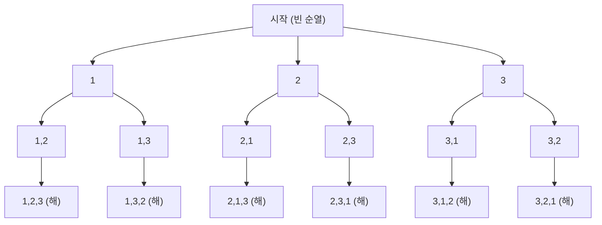

<Callout type="info">
  **이번 문서의 목표:** 이 문서를 다 읽으면 백트래킹 알고리즘의 상태공간트리를 직접 그려 유망성 검사와 가지치기 지점을 짚어낼 수 있고, 분기한정이 백트래킹과 어떻게 다른지 설명할 수 있다.
</Callout>

## 왜 필요한가 — 완전 탐색은 너무 크다

어떤 문제는 "가능한 모든 경우를 다 따져 보면" 답이 나온다. 예를 들어 8개의 퀸을 8×8 체스판에 서로 공격하지 못하게 놓는 문제는, 64개 칸 중 8개를 고르는 모든 조합을 하나하나 검사하면 언젠가는 답을 찾는다. 문제는 그 "모든 경우"의 개수다. 64개 칸에서 8개를 고르는 조합은 수천만 가지가 넘고, 순서까지 고려하면 훨씬 커진다. 이런 식의 완전 탐색(exhaustive search, 가능한 모든 경우를 빠짐없이 시도하는 탐색)은 문제 크기가 조금만 커져도 현실적인 시간 안에 끝나지 않는다.

**백트래킹**(backtracking, "되돌아가기"라는 뜻으로, 답이 될 수 없다고 판단되면 그 지점까지의 선택을 취소하고 이전 단계로 되돌아가는 탐색 기법)은 이 문제를 해결하는 접근이다. 해를 한 조각씩 만들어 가다가, 지금까지 만든 부분해가 "절대로 완전한 해가 될 수 없다"고 판단되는 순간 그 이후를 아예 만들어 보지 않고 되돌아간다. 이렇게 하면 완전 탐색과 달리 가망 없는 가지들을 통째로 잘라내므로(가지치기, pruning) 실제로 검사하는 경우의 수가 크게 줄어든다.

> **쉽게 말하면:** 백트래킹은 "이 길로 가면 답이 안 나온다"는 게 확실해지는 순간 그 앞을 더 가 보지 않고 바로 되돌아 나오는 탐색이다.

## 백트래킹의 프레임워크 — 상태·유망성·해·부분해

백트래킹 문제는 대부분 다음 네 가지 요소로 정리할 수 있다.

- **상태**(state): 지금까지의 선택으로 만들어진 부분적인 답. 예를 들어 N-Queen에서는 "1행에 퀸을 놓았고 2행에도 놓았다"까지의 상태.
- **부분해**(partial solution): 아직 완성되지 않은, 만들어 가는 중인 해.
- **유망성 검사**(promising check, 지금까지의 부분해가 완전한 해로 이어질 가능성이 있는지 확인하는 절차): 부분해가 이미 조건을 어겼다면(예: 두 퀸이 같은 열에 있다) 더 진행해도 소용없으므로 유망하지 않다고 판단한다.
- **해**(solution): 모든 선택이 끝나 완전한 답이 만들어진 상태.

이 네 요소로 일반적인 백트래킹 의사코드를 쓰면 다음과 같다. 여기서 `depth`는 지금까지 몇 단계 선택했는지를 나타내는 깊이이고, `n`은 전체 선택해야 할 단계 수다.

```text
procedure backtrack(depth):
    if depth == n:
        해 하나 완성됨 → 기록
        return
    for 후보 in depth번째 단계에서 고를 수 있는 모든 값:
        부분해에 후보를 추가
        if isPromising(부분해):     // 유망성 검사
            backtrack(depth + 1)     // 다음 단계로 전진
        부분해에서 후보를 제거        // 되돌아가기(backtrack)
```

이 틀에서 핵심은 `isPromising` 검사가 거짓이면 `backtrack(depth + 1)`을 아예 호출하지 않는다는 점이다. 즉 그 후보 아래에 있는 모든 하위 가지를 통째로 잘라낸다. 이것이 완전 탐색과 백트래킹의 근본적인 차이다.

## 예제 1 — 순열 생성으로 상태공간트리 이해하기

크기 3인 집합 `{1, 2, 3}`의 모든 순열을 만드는 문제로 상태공간트리(state space tree, 각 단계에서의 선택을 가지로 뻗어 나가며 만든 트리)를 직접 그려 보자. 순열이므로 유망성 검사는 "이미 사용한 숫자는 다시 고르지 않는다"이다.



이 트리에는 가지치기가 일어날 지점이 없다(어떤 숫자를 골라도 "이미 쓴 숫자만 아니면" 항상 유망하기 때문이다). 그래서 `n`개 원소의 순열을 모두 만드는 백트래킹은 결국 `n!`(n 팩토리얼)개의 잎 노드를 전부 만들어야 하고, 시간복잡도는 `O(n!)`이다. 이는 가지치기를 적용해도 줄어들지 않는, "해 자체의 개수가 원래 많은" 경우다.

> **자주 틀리는 점:** 백트래킹을 쓴다고 해서 항상 지수 시간보다 빨라지는 것은 아니다. 순열 생성처럼 **가능한 해의 개수 자체가 많은 문제**는 백트래킹으로 풀어도 결국 그 개수만큼은 만들어야 한다. 백트래킹의 이득은 "유망하지 않은 가지를 미리 잘라 만들지 않는" 데서 나오며, 가지치기가 일어나지 않는 문제에서는 완전 탐색과 시간이 같다.

## 예제 2 — N-Queen 문제: 유망성 검사가 실제로 가지를 자르는 경우

**N-Queen 문제**는 N×N 체스판에 퀸 N개를 서로 공격하지 못하게(같은 행·열·대각선에 있지 않게) 배치하는 문제다. 4-Queen(N=4)으로 직접 추적해 보자. 퀸을 한 행에 하나씩만 놓는다고 가정하면, 상태는 "각 행에 퀸을 몇 번째 열에 놓았는가"의 목록이 된다.

**유망성 검사**는 새로 놓으려는 퀸이 이미 놓인 퀸들과 같은 열에 있는지, 같은 대각선에 있는지 확인한다. 두 퀸이 `(row1, col1)`과 `(row2, col2)`에 있을 때 같은 대각선에 있다는 조건은 다음과 같이 세운다.

$$
|row_1 - row_2| = |col_1 - col_2|
$$

이 값이 성립하면 두 퀸이 대각선으로 마주 보고 있어 서로 공격할 수 있으므로 유망하지 않다.

| 단계(행) | 시도한 열 | 유망성 검사 결과 | 다음 행동 |
|----------|-----------|-------------------|-----------|
| 1행 | 1열 | 유망(첫 퀸이라 항상 통과) | 2행으로 전진 |
| 2행 | 1열 | 실패(1행 퀸과 같은 열) | 다음 열 시도 |
| 2행 | 2열 | 실패(1행 퀸과 대각선, `\|1-2\|=\|1-2\|`) | 다음 열 시도 |
| 2행 | 3열 | 유망 | 3행으로 전진 |
| 3행 | 1, 2, 3열 | 모두 실패(1·2행 퀸과 열 또는 대각선 충돌) | 3행에서 놓을 곳 없음 → 되돌아가기 |
| 2행 | 4열(다음 후보) | 유망 | 3행으로 다시 전진 |
| 3행 | 2열 | 유망 | 4행으로 전진 |
| 4행 | 1, 2, 3, 4열 | 모두 실패 | 되돌아가기 반복 |

이 표에서 3행에서 "놓을 곳이 전혀 없어" 되돌아가는 순간이 바로 **가지치기가 실제로 일어나는 지점**이다. 1행 1열, 2행 3열까지 진행했을 때 3행에 퀸을 놓을 수 있는 열이 하나도 없다는 것을 확인하는 즉시, 4행까지 내려가 보지 않고 바로 2행으로 되돌아가 다른 열을 시도한다. 만약 백트래킹 없이 완전 탐색을 했다면 3행·4행에 아무 열이나 채워 넣은 뒤에야 "이건 답이 아니구나"를 알았을 것이다.

> **쉽게 말하면:** 유망성 검사는 "이 수를 두는 순간 이미 진 게임인지" 매 수마다 확인하는 것이고, 가지치기는 그 확인 결과 진 게임이면 그 이후 수를 아예 두어 보지 않는 것이다.

## 예제 3 — 부분집합 탐색(부분합 문제)

집합 `{3, 5, 6, 7}`에서 합이 정확히 `13`이 되는 부분집합을 찾는 문제도 같은 틀로 풀 수 있다. 각 원소를 "포함한다/포함하지 않는다"의 두 갈래로 나누는 상태공간트리를 만들고, 유망성 검사로 "지금까지 고른 합이 이미 목표값을 넘었으면 더 진행하지 않는다"는 조건을 건다.

```text
procedure subsetSum(depth, 현재합):
    if 현재합 == 13:
        해 발견 → 기록하고 return
    if depth == 4 or 현재합 > 13:
        return   // 유망하지 않음: 더 커지거나 원소가 없음
    subsetSum(depth+1, 현재합 + 원소[depth])   // 포함하는 경우
    subsetSum(depth+1, 현재합)                 // 포함하지 않는 경우
```

여기서 `현재합 > 13`이 되는 순간 그 가지 아래는 절대로 13을 만들 수 없으므로(원소가 모두 양수라는 전제에서) 바로 잘라낸다. 이런 식으로 "지금까지 쌓은 값이 목표를 넘었다"거나 "남은 원소를 다 더해도 목표에 못 미친다" 같은 조건은 부분합·배낭류 문제에서 아주 자주 쓰이는 유망성 검사다.

## 분기한정 — 백트래킹에 "최적값 추정"을 더하다

**분기한정**(branch and bound)은 백트래킹과 같은 상태공간트리 탐색 틀을 쓰지만, 목적이 다르다. 백트래킹은 "조건을 만족하는 해를 찾는" 문제(N-Queen, 부분집합 등)에 주로 쓰이고, 분기한정은 "여러 해 중 가장 좋은 값을 찾는" **최적화 문제**(예: 배낭 문제에서 최대 가치)에 쓰인다.

분기한정은 각 가지에서 유망성 검사 대신 **한계값**(bound, 그 가지를 끝까지 파고들었을 때 얻을 수 있는 값의 상한 또는 하한 추정치)을 계산한다. 지금까지 찾은 최선의 해(현재까지의 최적값, incumbent)보다 그 가지의 한계값이 더 나쁘면, 실제로 끝까지 파 보지 않아도 "더 좋은 해가 나올 수 없다"는 것을 알 수 있으므로 가지를 잘라낸다.

**0/1 배낭 문제**(각 물건을 통째로 담거나 아예 담지 않는 배낭 문제, 무게 한도 `W = 10`)로 살펴보자. 물건이 `(무게, 가치)`로 `A(4, 40)`, `B(6, 60)`, `C(5, 30)` 세 개 있다고 하자. 각 물건의 가치 대비 무게 비율(무게당 가치)은 `A: 10`, `B: 10`, `C: 6`이다.

| 노드 | 지금까지 결정 | 남은 무게 | 확정 가치 | 한계값(남은 물건을 비율순으로 쪼개 담는다고 가정한 상한) | 현재 최적값과 비교 |
|------|---------------|-----------|-----------|-----------------------------------------------------------|---------------------|
| 루트 | 없음 | 10 | 0 | `A, B`를 다 담으면 무게 10, 가치 100 → 한계값 100 | 아직 최적값 없음, 탐색 계속 |
| A 포함 | A | 6 | 40 | 남은 무게 6에 B(무게 6) 전부 담기 → 100 | 탐색 계속 |
| A, B 포함 | A, B | 0 | 100 | 더 담을 수 없음 → 100(완전한 해) | 최적값을 100으로 갱신 |
| A 미포함 | (A 제외) | 10 | 0 | B, C를 비율순으로 최대한 담아도 상한 90(=60+30) | 90 < 100이므로 더 볼 필요 없음 → 가지치기 |

마지막 행이 분기한정의 핵심이다. "A를 담지 않는" 가지의 한계값(90)이 이미 찾아 놓은 최적값(100)보다 낮으므로, 그 가지 아래에서 어떤 조합을 만들어도 100을 넘을 수 없다는 것이 수학적으로 보장된다. 그래서 그 가지의 하위 경우들을 하나도 만들어 보지 않고 바로 잘라낼 수 있다.

> **쉽게 말하면:** 백트래킹은 "이 길이 조건을 어겼는가"만 보고 자르고, 분기한정은 "이 길로 가 봤자 지금까지 찾은 최선보다 좋을 수 있는가"까지 계산해서 자른다.

## 백트래킹 vs 분기한정 비교

| 구분 | 백트래킹 | 분기한정 |
|------|----------|----------|
| 주로 푸는 문제 | 조건을 만족하는 해 찾기(존재성) | 여러 해 중 최적값 찾기(최적화) |
| 가지치기 기준 | 유망성 검사(조건 위반 여부, 참/거짓) | 한계값과 현재 최적값의 비교(수치 비교) |
| 탐색 순서 | 보통 깊이 우선(DFS) | 깊이 우선 또는 한계값이 좋은 노드부터(우선순위 큐 활용 가능) |
| 잘라내는 근거 | "이 부분해로는 완전한 해를 만들 수 없다" | "이 가지의 최선의 경우도 지금까지의 최적값보다 못하다" |
| 대표 예제 | N-Queen, 순열 생성, 부분집합 탐색, 그래프 색칠 | 0/1 배낭 문제, 외판원 문제(TSP)의 근사·정확 탐색 |

## 복잡도 — 최악은 여전히 지수 시간

백트래킹과 분기한정 모두 **최악의 경우 시간복잡도는 여전히 지수 시간**(`O(2^n)`이나 `O(n!)` 등)이다. 가지치기는 평균적으로, 또 실제 입력에서 탐색량을 극적으로 줄여 주지만, 이론적인 최악의 경우 보장을 다항 시간으로 바꿔 주지는 않는다. 예를 들어 N-Queen에서 애초에 답이 하나도 없는 배치라면(예: N=2, N=3), 백트래킹도 결국 모든 유망한 부분해를 다 시도해 본 뒤에야 "해가 없다"는 결론에 도달하므로 최악의 경우 시간은 완전 탐색과 크게 다르지 않을 수 있다.

> **자주 틀리는 점:** "백트래킹을 쓰면 다항 시간에 풀린다"는 생각은 틀렸다. 백트래킹·분기한정은 **평균적인 실제 탐색량**을 줄이는 실용적 기법이지, 문제의 이론적 난이도(18편에서 다룰 P/NP 관점) 자체를 바꾸지는 않는다. N-Queen이나 배낭 문제 같은 조합 최적화 문제는 백트래킹으로 풀어도 최악의 경우 지수 시간이 걸릴 수 있다.

## 자주 틀리는 점

- **유망성 검사와 종료 조건을 혼동하는 실수**: 유망성 검사는 "더 진행할 가치가 있는가"를 보는 것이고, 종료 조건(`depth == n`)은 "이미 완성됐는가"를 보는 것이다. 둘은 검사 시점과 목적이 다르다.
- **백트래킹이 항상 빠르다고 오해하는 실수**: 가지치기가 거의 일어나지 않는 문제(순열 생성처럼)에서는 완전 탐색과 시간이 같다.
- **분기한정의 한계값을 최적값과 혼동하는 실수**: 한계값은 "이 가지에서 나올 수 있는 최선의 가능성"이라는 추정치이지, 실제로 그 값이 나온다는 보장은 아니다.
- **백트래킹과 동적계획법(16편)을 혼동하는 실수**: 동적계획법은 부분 문제의 결과를 저장해 재사용하지만, 백트래킹은 기본적으로 저장 없이 상태공간트리를 그대로 탐색한다. 다만 두 기법이 결합되는 문제도 있다.

## 핵심 정리

- 백트래킹은 상태·부분해·유망성 검사·해라는 네 요소로 이루어지며, 유망하지 않은 부분해 아래의 가지를 통째로 잘라낸다.
- 순열 생성처럼 해의 개수 자체가 많은 문제는 가지치기의 이득이 적어 여전히 `O(n!)` 수준이다.
- N-Queen의 유망성 검사는 같은 열·같은 대각선 여부(`|row1-row2| = |col1-col2|`)를 확인하는 것이다.
- 분기한정은 최적화 문제에서 한계값과 현재까지의 최적값을 비교해 가지를 잘라내며, 백트래킹의 참/거짓 유망성 검사보다 더 강한 수치 비교를 쓴다.
- 두 기법 모두 최악의 경우 시간복잡도는 지수 시간이며, 가지치기는 평균적인 실제 탐색량을 줄이는 실용적 기법이다.

## 마무리 복습

<Quiz
  questionNumber={1}
  question="백트래킹에서 유망성 검사가 하는 역할로 가장 적절한 것은?"
  options={['부분해가 완전한 해로 이어질 가능성이 있는지 확인해 없으면 가지를 잘라낸다', '모든 가능한 경우를 빠짐없이 만들어 저장한다', '이미 계산한 부분 문제의 결과를 표에 저장해 재사용한다', '입력 데이터를 미리 정렬해 탐색 순서를 정한다']}
  correctAnswer={1}
  explanation="유망성 검사는 지금까지 만든 부분해가 조건을 이미 어겼는지 확인해, 어겼다면 그 아래의 하위 가지를 만들어 보지 않고 잘라내는 역할을 한다."
  optionExplanations={['정답. 유망성 검사가 실패하면 그 가지 전체를 탐색하지 않는다.', '이는 완전 탐색의 정의이며 백트래킹은 오히려 이를 줄이려는 기법이다.', '이는 동적계획법의 메모이제이션 개념이다.', '정렬은 유망성 검사와 직접 관련이 없다.']}
/>

<Quiz
  questionNumber={2}
  question="4-Queen 문제에서 1행 1열, 2행 3열에 퀸을 놓은 상태에서 3행에 퀸을 놓을 수 있는 열이 하나도 없다는 것을 확인했을 때, 백트래킹이 취하는 다음 행동은?"
  options={['4행까지 임의로 채운 뒤 결과를 확인한다', '3행에서 되돌아가 2행의 다른 열을 다시 시도한다', '전체 탐색을 즉시 종료하고 해가 없다고 결론짓는다', '1행의 퀸을 제거하지 않고 3행에 강제로 퀸을 놓는다']}
  correctAnswer={2}
  explanation="3행에 놓을 수 있는 열이 없다는 것은 2행까지의 선택이 유망하지 않다는 뜻이므로, 백트래킹은 2행으로 되돌아가 아직 시도하지 않은 다른 열을 시도한다."
  optionExplanations={['이는 완전 탐색 방식이며 백트래킹의 가지치기 이점을 살리지 못한다.', '정답. 되돌아가기(backtrack)는 실패한 단계의 바로 이전 단계로 돌아가 다른 후보를 시도하는 것이다.', '4-Queen에는 실제로 해가 존재하므로 다른 경로를 더 탐색해야 한다.', '유망하지 않은 상태에 강제로 값을 놓는 것은 백트래킹의 정의에 어긋난다.']}
/>

<Quiz
  questionNumber={3}
  question="크기 5인 집합의 모든 순열을 백트래킹으로 생성할 때 시간복잡도로 가장 적절한 것은?"
  options={['O(5)', 'O(5^2)', 'O(2^5)', 'O(5!)']}
  correctAnswer={4}
  explanation="순열 생성은 가지치기가 거의 일어나지 않아(이미 사용한 원소만 제외) 만들어야 할 잎 노드의 개수가 순열의 총 개수인 n!과 같으므로 O(n!)이다."
  optionExplanations={['순열의 개수는 n에 선형으로 비례하지 않는다.', '이차 시간은 중첩 반복문 수준의 복잡도이며 순열 생성보다 훨씬 작다.', '2^n은 부분집합 개수에 해당하며 순열 개수와는 다른 값이다.', '정답. 순열의 총 개수가 n!이므로 모든 순열을 만드는 데 걸리는 시간도 O(n!)이다.']}
/>

<Quiz
  questionNumber={4}
  question="분기한정에서 어떤 가지의 한계값(bound)이 현재까지 찾은 최적값보다 나쁠 때 취하는 행동은?"
  options={['그 가지를 끝까지 탐색해 정확한 값을 확인한다', '그 가지를 잘라내고 탐색하지 않는다', '현재까지의 최적값을 그 한계값으로 즉시 교체한다', '루트 노드부터 탐색을 다시 시작한다']}
  correctAnswer={2}
  explanation="한계값이 이미 현재까지의 최적값보다 나쁘다면, 그 가지에서 아무리 좋은 조합을 찾아도 현재 최적값을 넘어설 수 없다는 뜻이므로 더 탐색할 필요 없이 가지를 잘라낸다."
  optionExplanations={['한계값만으로 이미 더 좋은 해가 나올 수 없음이 보장되므로 끝까지 탐색하는 것은 비효율적이다.', '정답. 한계값이 더 나쁘면 그 가지는 더 볼 필요가 없어 잘라낸다.', '한계값은 상한 추정치일 뿐 실제로 그 값이 나온다는 보장이 없으므로 최적값으로 삼을 수 없다.', '분기한정은 상태공간트리를 그대로 두고 가지만 잘라내며 처음부터 다시 시작하지 않는다.']}
/>

<Quiz
  questionNumber={5}
  question="백트래킹과 분기한정의 차이에 대한 설명으로 옳은 것은?"
  options={['백트래킹은 최적화 문제에, 분기한정은 존재성 문제에만 쓰인다', '백트래킹은 참/거짓의 유망성 검사로, 분기한정은 수치 비교인 한계값으로 가지를 잘라낸다', '두 기법은 이름만 다를 뿐 완전히 동일한 알고리즘이다', '분기한정은 상태공간트리를 사용하지 않는 기법이다']}
  correctAnswer={2}
  explanation="백트래킹은 부분해가 조건을 만족하는지 참/거짓으로 판단하는 유망성 검사로 가지를 자르고, 분기한정은 그 가지에서 얻을 수 있는 값의 상한(한계값)을 수치로 계산해 현재 최적값과 비교하여 가지를 자른다."
  optionExplanations={['설명이 뒤바뀌었다. 존재성 문제는 주로 백트래킹, 최적화 문제는 주로 분기한정으로 푼다.', '정답. 판단 기준이 참/거짓이냐 수치 비교냐가 두 기법의 핵심 차이다.', '두 기법은 같은 상태공간트리 탐색 틀을 공유하지만 가지치기 기준이 달라 별개의 기법으로 구분한다.', '분기한정도 백트래킹과 마찬가지로 상태공간트리를 탐색하며 한계값을 계산한다.']}
/>

<Quiz
  questionNumber={6}
  question="0/1 배낭 문제를 분기한정으로 풀 때, 어떤 가지의 한계값을 계산하는 일반적인 방법으로 가장 적절한 것은?"
  options={['남은 물건을 무작위로 하나만 담아본 값을 한계값으로 삼는다', '남은 물건을 무게당 가치 비율 순서로 최대한 담을 수 있다고 가정해 상한을 계산한다', '이미 확정된 가치만을 한계값으로 삼고 남은 물건은 고려하지 않는다', '전체 물건의 가치를 모두 더한 값을 항상 한계값으로 삼는다']}
  correctAnswer={2}
  explanation="분기한정에서 배낭 문제의 한계값은 흔히 남은 무게 한도 안에서 물건을 쪼개서라도(부분적으로) 무게당 가치가 높은 순서로 채운다고 가정해 계산한 상한을 사용한다. 이 값은 실제 0/1 조합보다 항상 같거나 크므로 안전한 상한이 된다."
  optionExplanations={['무작위로 하나만 담아본 값은 상한이 된다는 보장이 없어 안전한 가지치기 기준이 될 수 없다.', '정답. 비율 기준 상한은 실제 달성 가능한 값보다 항상 크거나 같아 안전하게 가지를 잘라낼 수 있는 근거가 된다.', '확정된 가치만 쓰면 아직 담지 않은 물건의 가능성을 무시하게 되어 유효한 가지를 잘못 잘라낼 위험이 있다.', '전체 가치의 합은 무게 제한을 고려하지 않아 지나치게 느슨한 상한이 되어 가지치기 효과가 거의 없다.']}
/>

## 참고 자료

- [국가평생교육진흥원 독학학위제 학습정보](https://bdes.nile.or.kr) — 알고리즘 과목의 출제기준과 평가 수준 확인.
- [Princeton Algorithms Course, Backtracking and Branch and Bound](https://algs4.cs.princeton.edu) — 백트래킹·분기한정의 상태공간트리 개념과 대표 예제 정리.
